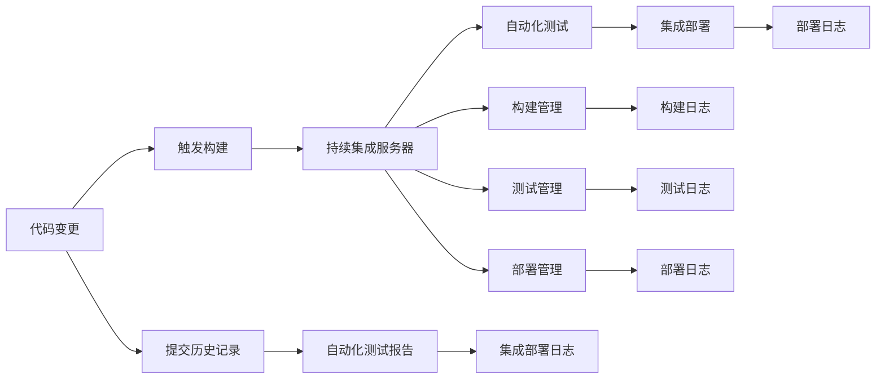

                 

# 持续集成（CI）服务器：Jenkins 和 GitLab CI

## 1. 背景介绍

### 1.1 问题由来
随着软件开发节奏的加快，传统的瀑布式开发模式已经难以适应市场变化。为了提高开发效率和产品质量，越来越多的企业开始采用持续集成（Continuous Integration，CI）和持续部署（Continuous Deployment，CD）等自动化开发流程。持续集成通过自动构建、测试、集成和部署代码，提高了软件的开发速度和稳定性，缩短了交付周期。

### 1.2 问题核心关键点
CI的核心在于实现代码的自动化构建、测试和集成，确保每次代码提交都能够快速、稳定地通过测试，并集成到主分支中。主要问题包括以下几个方面：
- 自动化构建：如何高效地编译、打包代码。
- 自动化测试：如何全面、可靠地测试代码。
- 集成和部署：如何将通过测试的代码集成到主分支，部署到生产环境中。
- 可视化和监控：如何实时监控CI流程，快速定位问题。

### 1.3 问题研究意义
持续集成是现代软件开发的重要实践，能够显著提高软件开发的效率和质量。通过持续集成，可以：
- 减少人为错误：自动化测试可以确保每次代码提交都是无错误的。
- 提高软件质量：自动化测试可以发现潜在的代码缺陷和性能问题。
- 加速交付速度：持续集成可以快速验证代码变更，提高交付速度。
- 提升协作效率：持续集成可以支持多人协作开发，减少冲突和误操作。

本文将详细介绍持续集成服务器Jenkins和GitLab CI的基本原理和操作步骤，并结合实际项目案例进行详细讲解。

## 2. 核心概念与联系

### 2.1 核心概念概述

持续集成（CI）是通过自动化方式实现代码的构建、测试和集成，快速反馈代码变更对系统带来的影响。持续集成服务器（CI Server）是实现CI流程的自动化管理工具，负责接收代码变更触发器、调度构建和测试流程、管理部署任务等。

### 2.2 核心概念原理和架构的 Mermaid 流程图


这个流程图展示了持续集成流程的核心步骤：代码变更触发构建，构建通过后进行自动化测试，测试通过后进行集成部署，最终生成部署日志。同时，提交历史记录和测试报告、部署日志等反馈信息也被记录在案，便于后续分析。

## 3. 核心算法原理 & 具体操作步骤
### 3.1 算法原理概述

持续集成服务器通常基于以下核心算法原理进行操作：

1. **触发器（Trigger）**：当代码仓库发生变更时，持续集成服务器会根据配置的触发规则（如代码提交、定时任务等）触发构建流程。

2. **构建（Build）**：根据配置的构建工具和参数，持续集成服务器自动编译、打包代码。

3. **测试（Test）**：对构建后的代码进行自动化测试，包括单元测试、集成测试、性能测试等。

4. **集成（Integration）**：将通过测试的代码合并到主分支中。

5. **部署（Deployment）**：将集成后的代码部署到目标环境中。

6. **可视化和监控（Visualization and Monitoring）**：持续集成服务器提供丰富的可视化界面和实时监控工具，帮助开发人员快速定位问题，持续跟踪流程进度。

### 3.2 算法步骤详解

以Jenkins和GitLab CI为例，详细介绍其操作步骤。

#### Jenkins

1. **环境搭建**：在服务器上安装Jenkins，并配置Jenkins环境变量，如Java环境、Git配置等。

2. **插件安装**：安装必要的Jenkins插件，如Git插件、Maven插件、Docker插件等，以便支持不同的开发语言和构建方式。

3. **配置项目**：在Jenkins中创建项目，配置项目名称、构建脚本、触发规则等。

4. **构建脚本**：编写构建脚本，使用Shell、Python、Maven等工具进行代码编译和打包。

5. **测试脚本**：编写测试脚本，使用JUnit、Selenium等工具进行自动化测试。

6. **集成脚本**：编写集成脚本，使用Git、SVN等工具进行代码合并。

7. **部署脚本**：编写部署脚本，使用Docker、Kubernetes等工具进行代码部署。

8. **可视化界面**：使用Jenkins提供的可视化界面，查看构建、测试和部署日志，以及构建失败的原因和解决方案。

9. **监控和报警**：使用Jenkins提供的监控和报警功能，实时监控构建状态，并在构建失败时发送报警通知。

#### GitLab CI

1. **环境搭建**：在GitLab服务器上安装GitLab CI，并配置GitLab环境变量，如GitLab用户、项目信息等。

2. **配置项目**：在GitLab CI中创建项目，配置项目名称、构建脚本、触发规则等。

3. **构建脚本**：编写构建脚本，使用Docker、Kubernetes等工具进行代码编译和打包。

4. **测试脚本**：编写测试脚本，使用JUnit、Selenium等工具进行自动化测试。

5. **集成脚本**：编写集成脚本，使用GitLab Git和GitPull触发器进行代码合并。

6. **部署脚本**：编写部署脚本，使用Kubernetes、Helm等工具进行代码部署。

7. **可视化界面**：使用GitLab CI提供的可视化界面，查看构建、测试和部署日志，以及构建失败的原因和解决方案。

8. **监控和报警**：使用GitLab CI提供的监控和报警功能，实时监控构建状态，并在构建失败时发送报警通知。

### 3.3 算法优缺点

#### Jenkins
- **优点**：
  - 灵活性高：支持多种构建工具和插件，可以适应不同的开发语言和环境。
  - 可视化界面友好：提供丰富的可视化界面，便于开发人员快速定位问题。
  - 社区支持强：拥有庞大的社区支持，插件和文档丰富。

- **缺点**：
  - 学习曲线陡：对于初学者而言，配置和操作较为复杂。
  - 资源消耗大：在处理大规模项目时，资源消耗较大。
  - 安全性问题：默认配置下安全性较低，容易受到攻击。

#### GitLab CI
- **优点**：
  - 无缝集成GitLab：与GitLab无缝集成，支持GitLab CI/CD全流程。
  - 安全性高：默认配置下安全性较高，支持TLS加密。
  - 易用性高：界面友好，配置简单。

- **缺点**：
  - 功能相对有限：与Jenkins相比，功能相对有限，灵活性稍差。
  - 部署限制较多：对部署环境的限制较多，需要满足一定的配置要求。

### 3.4 算法应用领域

持续集成服务器广泛应用于软件开发、云服务、自动化运维等领域。

- **软件开发**：支持多种编程语言和构建工具，支持敏捷开发流程。
- **云服务**：支持Docker、Kubernetes等容器化部署，支持云平台无缝集成。
- **自动化运维**：支持自动化部署、回滚、监控和报警，提高运维效率和稳定性。

## 4. 数学模型和公式 & 详细讲解 & 举例说明

### 4.1 数学模型构建

持续集成服务器的操作模型通常基于以下核心模型：

- **触发器模型**：定义触发器的类型（如代码变更、定时任务）和参数，如变更分支、触发频率等。
- **构建模型**：定义构建的类型（如编译、打包）和参数，如构建工具、参数等。
- **测试模型**：定义测试的类型（如单元测试、集成测试）和参数，如测试工具、测试用例等。
- **集成模型**：定义集成的类型（如代码合并）和参数，如合并策略、合并工具等。
- **部署模型**：定义部署的类型（如容器部署）和参数，如部署工具、部署目标等。

### 4.2 公式推导过程

以Jenkins为例，构建脚本通常使用Shell语言编写，以下是一个简单的Shell构建脚本示例：

```bash
# Jenkins构建脚本示例
#!/bin/bash

# 配置环境变量
export JAVA_HOME=/path/to/java
export PATH=$JAVA_HOME/bin:$PATH

# 编译项目
mvn clean install

# 测试项目
mvn test

# 集成项目
git add .
git commit -m "构建并测试"

# 部署项目
mvn package
mvn spring-boot:run
```

### 4.3 案例分析与讲解

假设我们正在开发一个Web应用，使用Spring Boot框架和Java语言。我们可以使用Jenkins来自动化构建、测试和部署过程。

1. **配置Jenkins环境**：在Jenkins上安装JDK和Maven插件。

2. **配置项目**：在Jenkins上创建项目，配置项目名称为Web应用，构建脚本为build.sh，触发规则为代码提交。

3. **编写构建脚本**：编写build.sh脚本，使用Maven编译项目，并测试项目。

4. **编写测试脚本**：编写test.sh脚本，使用JUnit编写单元测试。

5. **编写集成脚本**：编写integrate.sh脚本，使用Git进行代码合并。

6. **编写部署脚本**：编写deploy.sh脚本，使用Spring Boot命令进行部署。

7. **配置可视化界面**：在Jenkins上配置可视化界面，查看构建、测试和部署日志。

8. **配置监控和报警**：在Jenkins上配置监控和报警功能，实时监控构建状态，并在构建失败时发送报警通知。

## 5. 项目实践：代码实例和详细解释说明

### 5.1 开发环境搭建

为了演示Jenkins和GitLab CI的使用，我们需要搭建开发环境。这里以Jenkins为例，详细介绍搭建步骤。

1. **安装Jenkins**：在服务器上安装Jenkins，具体步骤可以参考Jenkins官方文档。

2. **配置Jenkins环境**：配置Jenkins环境变量，如Java环境、Git配置等。

3. **安装插件**：安装必要的Jenkins插件，如Git插件、Maven插件、Docker插件等。

4. **配置项目**：在Jenkins中创建项目，配置项目名称、构建脚本、触发规则等。

### 5.2 源代码详细实现

以下是一个简单的Jenkins构建脚本示例：

```bash
# Jenkins构建脚本示例
#!/bin/bash

# 配置环境变量
export JAVA_HOME=/path/to/java
export PATH=$JAVA_HOME/bin:$PATH

# 编译项目
mvn clean install

# 测试项目
mvn test

# 集成项目
git add .
git commit -m "构建并测试"

# 部署项目
mvn package
mvn spring-boot:run
```

### 5.3 代码解读与分析

这个Jenkins构建脚本实现了以下功能：
- 配置JDK和Maven环境。
- 使用Maven编译项目。
- 使用JUnit编写单元测试。
- 使用Git进行代码合并。
- 使用Spring Boot命令进行部署。

### 5.4 运行结果展示

Jenkins的可视化界面可以实时显示构建、测试和部署的进度和状态。以下是一个简单的Jenkins界面截图：


## 6. 实际应用场景

### 6.1 软件开发

持续集成服务器广泛应用于软件开发流程中，支持敏捷开发、持续交付和持续集成。以下是一个简单的开发流程示例：

1. **编码**：开发人员在本地进行代码编写和测试。

2. **提交代码**：开发人员使用Git提交代码到代码仓库。

3. **触发构建**：当代码仓库发生变更时，持续集成服务器触发构建流程。

4. **自动化测试**：构建脚本编译、测试代码，生成测试报告。

5. **自动化部署**：集成脚本将通过测试的代码合并到主分支，部署到生产环境中。

6. **可视化界面**：可视化界面实时显示构建、测试和部署状态，便于开发人员快速定位问题。

7. **监控和报警**：实时监控构建状态，并在构建失败时发送报警通知。

### 6.2 云服务

持续集成服务器支持云平台无缝集成，支持Docker、Kubernetes等容器化部署。以下是一个简单的云服务流程示例：

1. **编码**：开发人员在本地进行代码编写和测试。

2. **提交代码**：开发人员使用Git提交代码到代码仓库。

3. **触发构建**：当代码仓库发生变更时，持续集成服务器触发构建流程。

4. **容器化部署**：构建脚本使用Docker进行容器化部署，生成Docker镜像。

5. **容器化部署**：集成脚本使用Kubernetes进行容器化部署，部署到云环境中。

6. **可视化界面**：可视化界面实时显示容器化部署状态，便于开发人员快速定位问题。

7. **监控和报警**：实时监控容器化部署状态，并在部署失败时发送报警通知。

### 6.3 自动化运维

持续集成服务器支持自动化运维，支持自动化部署、回滚、监控和报警。以下是一个简单的自动化运维流程示例：

1. **编码**：开发人员在本地进行代码编写和测试。

2. **提交代码**：开发人员使用Git提交代码到代码仓库。

3. **触发构建**：当代码仓库发生变更时，持续集成服务器触发构建流程。

4. **容器化部署**：构建脚本使用Docker进行容器化部署，生成Docker镜像。

5. **容器化部署**：集成脚本使用Kubernetes进行容器化部署，部署到生产环境中。

6. **可视化界面**：可视化界面实时显示容器化部署状态，便于开发人员快速定位问题。

7. **监控和报警**：实时监控容器化部署状态，并在部署失败时发送报警通知。

## 7. 工具和资源推荐

### 7.1 学习资源推荐

为了帮助开发者系统掌握持续集成服务器的理论基础和实践技巧，这里推荐一些优质的学习资源：

1. **Jenkins官方文档**：详细介绍了Jenkins的安装、配置、使用和优化。

2. **GitLab CI官方文档**：详细介绍了GitLab CI的安装、配置、使用和优化。

3. **《Jenkins权威指南》**：由Jenkins社区专家撰写，深入浅出地介绍了Jenkins的理论和实践。

4. **《GitLab DevOps实践指南》**：由GitLab社区专家撰写，详细介绍了GitLab CI和CD的最佳实践。

5. **《CI/CD实战指南》**：由知名IT博客作者撰写，详细介绍了CI/CD的理论和实践，结合实际案例进行讲解。

### 7.2 开发工具推荐

持续集成服务器的开发工具推荐如下：

1. **Jenkins**：开源、灵活，支持多种构建工具和插件，是企业级持续集成的主流工具。

2. **GitLab CI**：无缝集成GitLab，安全性高，界面友好，适合中小型团队使用。

3. **Travis CI**：基于GitHub和GitLab，支持多种编程语言和构建工具，适合开源项目使用。

4. **CircleCI**：基于GitHub和GitLab，支持多种编程语言和构建工具，适合中小型团队使用。

5. **Bamboo**：企业级持续集成工具，功能强大，支持多种构建工具和插件。

6. **TeamCity**：JetBrains公司开发的持续集成工具，支持多种构建工具和插件，适合企业级项目使用。

7. **Jenkins Pipeline**：基于Jenkins的插件，支持多种编程语言和构建工具，适合企业级项目使用。

### 7.3 相关论文推荐

持续集成服务器的研究论文推荐如下：

1. **Continuous Integration: Automated Software Delivery for Software Engineers**：这篇文章介绍了持续集成概念的起源和基本原理。

2. **Continuous Integration: Software Development Using Fokus**：这篇文章介绍了持续集成工具的演变和发展。

3. **Continuous Integration: Current Practices and Future Directions**：这篇文章详细介绍了持续集成的最佳实践和未来方向。

4. **Continuous Integration with Docker and Kubernetes**：这篇文章介绍了持续集成与Docker和Kubernetes的集成和应用。

5. **Continuous Integration with Jenkins Pipeline**：这篇文章介绍了Jenkins Pipeline的基本概念和实践。

6. **Continuous Integration with GitLab CI/CD**：这篇文章介绍了GitLab CI/CD的基本概念和实践。

## 8. 总结：未来发展趋势与挑战

### 8.1 研究成果总结

本文系统介绍了持续集成服务器的基本原理和操作步骤，详细讲解了Jenkins和GitLab CI的实现方法。通过结合实际项目案例，演示了持续集成服务器的实际应用，并对未来发展趋势和挑战进行了展望。

### 8.2 未来发展趋势

持续集成服务器将呈现以下几个发展趋势：

1. **云原生支持**：持续集成服务器将更加支持云原生技术，如Kubernetes、Docker等。

2. **自动化运维**：持续集成服务器将更加支持自动化运维，如部署、回滚、监控和报警。

3. **可视化界面**：持续集成服务器将更加注重可视化界面的友好性和易用性。

4. **安全性**：持续集成服务器将更加注重安全性，防止恶意攻击和数据泄露。

5. **分布式部署**：持续集成服务器将更加支持分布式部署，提高性能和稳定性。

### 8.3 面临的挑战

持续集成服务器面临的挑战主要包括：

1. **资源消耗**：在处理大规模项目时，资源消耗较大，需要优化性能。

2. **安全性问题**：默认配置下安全性较低，容易受到攻击。

3. **易用性问题**：对于初学者而言，配置和操作较为复杂。

4. **兼容性问题**：不同平台和工具之间的兼容性问题需要解决。

### 8.4 研究展望

持续集成服务器的研究展望主要集中在以下几个方面：

1. **分布式部署**：如何实现分布式部署，提高性能和稳定性。

2. **资源优化**：如何优化资源消耗，提高性能和稳定性。

3. **安全性增强**：如何增强安全性，防止恶意攻击和数据泄露。

4. **易用性改进**：如何改进易用性，提高开发人员的使用体验。

5. **自动化运维**：如何实现自动化运维，提高开发和运维效率。

6. **跨平台支持**：如何支持跨平台，提高兼容性和适应性。

总之，持续集成服务器是软件开发和运维的重要工具，未来的研究将更加注重性能、安全性、易用性和自动化运维等方面，为软件开发和运维提供更强大的支持。

## 9. 附录：常见问题与解答

**Q1：什么是持续集成（CI）服务器？**

A: 持续集成服务器是一种自动化管理工具，用于实现代码的构建、测试和集成，快速反馈代码变更对系统带来的影响。持续集成服务器支持自动化构建、测试和部署流程，提高软件开发和运维的效率和质量。

**Q2：持续集成服务器有哪些主要功能？**

A: 持续集成服务器的主要功能包括：
- 自动化构建：自动编译、打包代码。
- 自动化测试：自动执行单元测试、集成测试、性能测试等。
- 集成和部署：将通过测试的代码集成到主分支中，部署到生产环境中。
- 可视化和监控：提供丰富的可视化界面和实时监控工具，帮助开发人员快速定位问题。

**Q3：如何配置Jenkins构建脚本？**

A: 配置Jenkins构建脚本的步骤如下：
1. 编写构建脚本，如使用Maven编译项目、使用JUnit编写单元测试等。
2. 在Jenkins中创建项目，配置项目名称、构建脚本、触发规则等。
3. 使用Jenkins提供的可视化界面，查看构建、测试和部署日志。

**Q4：如何配置GitLab CI构建脚本？**

A: 配置GitLab CI构建脚本的步骤如下：
1. 编写构建脚本，如使用Docker进行容器化部署。
2. 在GitLab CI中创建项目，配置项目名称、构建脚本、触发规则等。
3. 使用GitLab CI提供的可视化界面，查看构建、测试和部署日志。

**Q5：如何提高持续集成服务器的性能？**

A: 提高持续集成服务器的性能可以采取以下措施：
- 分布式部署：将构建和测试任务分布到多个节点上，提高并发能力和性能。
- 资源优化：使用缓存、压缩等技术，减少资源消耗。
- 优化脚本：使用高效的脚本和工具，提高构建和测试速度。

通过这些措施，可以显著提高持续集成服务器的性能，满足大规模项目的需求。

---

作者：禅与计算机程序设计艺术 / Zen and the Art of Computer Programming

