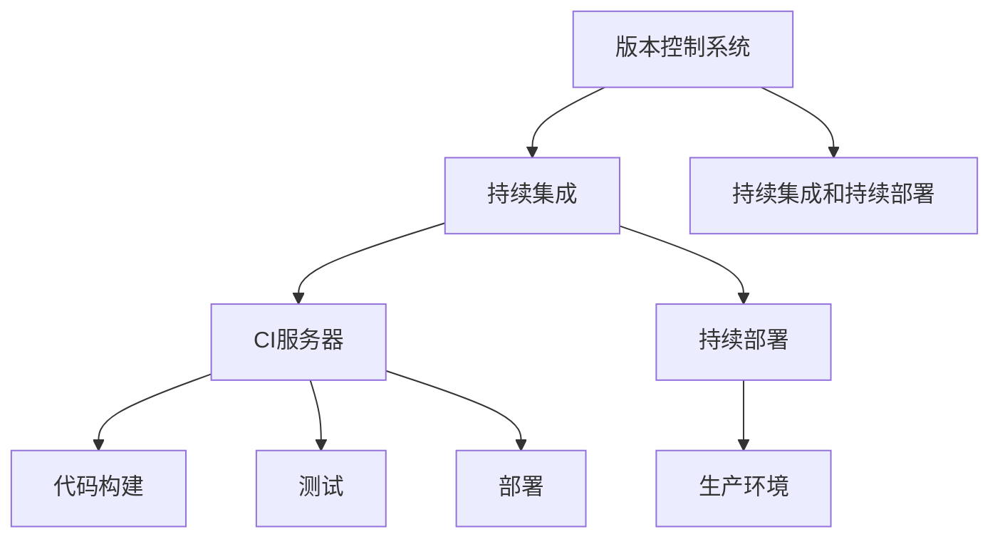

                 

# 持续集成（CI）服务器：Jenkins 和 GitLab CI

## 1. 背景介绍

### 1.1 问题由来

随着软件开发规模的不断扩大，软件开发过程中的版本控制、测试、部署等环节变得更加复杂。过去，开发人员常常需要手动进行代码合并、手动执行测试和部署，这种重复性工作不仅消耗了大量的人力物力，还容易导致人为错误。因此，持续集成（Continuous Integration, CI）技术应运而生，旨在通过自动化手段，持续地、频繁地集成新的代码变更，提升软件开发的效率和质量。

CI技术涉及到的核心组成部分包括版本控制系统（如Git）、CI服务器（如Jenkins、GitLab CI）、测试框架等。其中，CI服务器是CI系统的核心组件，负责自动化地进行代码构建、测试、部署等操作，是实现CI的关键工具。本文将重点介绍两种常用的CI服务器：Jenkins和GitLab CI，并分析它们在实际项目中的应用和优劣。

### 1.2 问题核心关键点

Jenkins和GitLab CI作为CI服务器的代表，它们的设计理念、核心功能和优缺点各不相同。以下是这些关键点的详细阐述：

1. **设计理念**：Jenkins的核心理念是"插件即一切"，通过丰富的插件生态，支持从代码构建、测试、部署到持续部署（Continuous Deployment, CD）的各种需求。而GitLab CI则更加注重在GitLab平台内的一体化集成，提供了与GitLab tightly集成的CI功能，同时支持跨平台和跨语言的构建测试工具。
2. **核心功能**：Jenkins的重点是灵活的、可扩展的CI系统，能够支持各种类型和规模的项目。GitLab CI则更加注重在GitLab平台内部的集成和协作，提供了强大的代码合并、CI/CD流水线管理功能。
3. **优缺点**：Jenkins功能强大，但配置和管理复杂；GitLab CI则更加易于使用，且与GitLab平台集成紧密。

## 2. 核心概念与联系

### 2.1 核心概念概述

为了更好地理解Jenkins和GitLab CI的原理和架构，首先需要对核心概念进行清晰的定义和阐述：

- **版本控制系统**：如Git，用于管理和控制代码的变更历史，提供版本控制、分支管理、合并请求等功能。
- **持续集成**：通过持续地、频繁地集成新的代码变更，提升软件开发的效率和质量。
- **持续部署**：在CI的基础上，自动化地将代码变更部署到生产环境中，实现快速、稳定的发布。
- **CI服务器**：负责自动化地进行代码构建、测试、部署等操作，是实现CI的关键工具。

这些核心概念之间的关系可以通过以下Mermaid流程图来展示：



这个流程图展示了版本控制系统、持续集成、持续部署和CI服务器之间的关系：

1. 版本控制系统提供代码变更的管理和控制。
2. 持续集成通过自动化地集成新的代码变更，提升开发效率和质量。
3. CI服务器负责自动化地进行代码构建、测试和部署。
4. 持续部署在CI的基础上，进一步自动化地将代码变更部署到生产环境中。

## 3. 核心算法原理 & 具体操作步骤

### 3.1 算法原理概述

Jenkins和GitLab CI的原理主要基于自动化流水线的构建和执行。其核心思想是：将软件开发过程划分为若干阶段，每个阶段通过自动化脚本执行特定的任务，从而实现持续集成和持续部署。

以下是Jenkins和GitLab CI的基本工作流程：

1. **代码提交**：开发者将代码变更提交到版本控制系统中。
2. **触发构建**：当提交的代码变更满足预设条件时，CI服务器自动触发构建任务。
3. **代码构建**：构建任务通过执行构建脚本，将代码变更编译成可执行的二进制文件。
4. **测试任务**：构建完成后，执行测试任务，验证代码变更的正确性。
5. **部署任务**：如果测试通过，执行部署任务，将代码变更部署到生产环境中。
6. **持续集成和持续部署**：通过自动化流程，持续地、频繁地集成和部署代码变更，提升软件开发效率和质量。

### 3.2 算法步骤详解

#### Jenkins

**Step 1: 安装Jenkins**

1. 下载并安装Jenkins服务器，可在官网下载最新版本的Jenkins，并进行安装配置。
2. 安装所需插件，如Maven、Docker、Junit等。

**Step 2: 配置构建脚本**

1. 创建Jenkins作业，定义构建步骤。
2. 编写构建脚本，例如使用Maven或Gradle等构建工具。
3. 在构建脚本中添加测试任务，例如Junit测试。

**Step 3: 配置部署脚本**

1. 编写部署脚本，例如使用Docker或Kubernetes进行容器部署。
2. 在构建脚本中添加部署任务，例如在部署完成后发送通知。

**Step 4: 配置触发器**

1. 配置触发器，例如通过代码提交触发构建任务。
2. 设置构建失败后的告警机制。

#### GitLab CI

**Step 1: 安装GitLab**

1. 在服务器上安装GitLab，并进行配置。
2. 创建项目，并定义CI/CD流水线。

**Step 2: 定义CI/CD流水线**

1. 在项目中创建`.gitlab-ci.yml`文件，定义CI/CD流水线。
2. 在流水线中定义构建、测试和部署任务，例如使用Maven、Junit、Docker等工具。

**Step 3: 配置CI/CD触发器**

1. 配置CI/CD触发器，例如通过代码提交触发构建任务。
2. 设置构建失败后的告警机制。

**Step 4: 部署CI/CD流水线**

1. 保存并提交`.gitlab-ci.yml`文件，触发CI/CD流水线。
2. 在流水线中配置CI/CD任务，例如构建、测试和部署。

### 3.3 算法优缺点

#### Jenkins

**优点**：
- 功能强大，支持从代码构建、测试到持续部署的各类需求。
- 灵活性高，支持自定义插件，可扩展性强。
- 社区活跃，有大量的插件和文档资源支持。

**缺点**：
- 配置和管理复杂，需要一定的技术基础。
- 用户界面不够友好，需要花费一定时间学习。
- 内存和CPU资源消耗较大。

#### GitLab CI

**优点**：
- 易于使用，界面友好，上手门槛低。
- 与GitLab平台紧密集成，支持CI/CD流水线管理。
- 支持跨平台和跨语言的构建测试工具。

**缺点**：
- 功能相对有限，需要额外使用其他工具来扩展功能。
- 与GitLab平台的深度绑定，使得在非GitLab平台上的使用受限。

### 3.4 算法应用领域

Jenkins和GitLab CI在软件开发、应用程序部署、网站运维等多个领域都有广泛的应用。以下是它们在不同应用场景中的具体表现：

- **软件开发**：用于代码构建、测试、部署等，提升软件开发效率和质量。
- **应用程序部署**：通过CI/CD流水线，实现应用的自动化部署和回滚。
- **网站运维**：通过CI/CD流水线，实现网站的持续集成和持续部署。
- **数据处理和分析**：通过构建和测试任务，自动化地处理和分析数据。

## 4. 数学模型和公式 & 详细讲解 & 举例说明

### 4.1 数学模型构建

在Jenkins和GitLab CI中，数学模型主要用于描述构建、测试和部署等任务执行的顺序和依赖关系。

**Step 1: 构建模型**

- **Jenkins**：使用Jenkins Pipeline和Jenkinsfile定义任务的执行顺序和依赖关系。
- **GitLab CI**：使用`.gitlab-ci.yml`文件定义任务的执行顺序和依赖关系。

**Step 2: 数学公式表示**

- **Jenkins Pipeline**：使用Pipeline脚本描述任务执行流程，例如：
  ```groovy
  pipeline {
    agent any
    stages {
      val myStage = stage('My Stage') {
        steps {
          sh 'echo Hello Jenkins'
        }
      }
    }
  }
  ```

- **GitLab CI**：使用`.gitlab-ci.yml`文件定义任务的执行流程，例如：
  ```yaml
  stages:
    - build
    - test
    - deploy

  build:
    stage: build
    script:
      - echo "Building..."

  test:
    stage: test
    script:
      - echo "Testing..."

  deploy:
    stage: deploy
    script:
      - echo "Deploying..."
  ```

### 4.2 公式推导过程

#### Jenkins Pipeline

**Step 1: 定义任务**

- Jenkins Pipeline中，任务通过Pipeline脚本定义。例如：
  ```groovy
  pipeline {
    agent any
    stages {
      stage('Build') {
        steps {
          sh 'mvn install'
        }
      }
      stage('Test') {
        steps {
          sh 'mvn test'
        }
      }
      stage('Deploy') {
        steps {
          sh 'mvn spring-boot:run'
        }
      }
    }
  }
  ```

**Step 2: 推导公式**

- Jenkins Pipeline中的任务执行顺序和依赖关系可以通过Pipeline脚本中的阶段（Stage）和步骤（Step）进行描述。例如，在上述示例中，`Build`、`Test`、`Deploy`三个任务分别属于不同的阶段，且`Test`依赖于`Build`，`Deploy`依赖于`Test`。

#### GitLab CI

**Step 1: 定义任务**

- GitLab CI中，任务通过`.gitlab-ci.yml`文件定义。例如：
  ```yaml
  stages:
    - build
    - test
    - deploy

  build:
    stage: build
    script:
      - echo "Building..."

  test:
    stage: test
    script:
      - echo "Testing..."

  deploy:
    stage: deploy
    script:
      - echo "Deploying..."
  ```

**Step 2: 推导公式**

- GitLab CI中的任务执行顺序和依赖关系可以通过`.gitlab-ci.yml`文件中的任务（Job）和阶段（Stage）进行描述。例如，在上述示例中，`build`、`test`、`deploy`三个任务分别属于不同的阶段，且`test`依赖于`build`，`deploy`依赖于`test`。

### 4.3 案例分析与讲解

#### Jenkins Pipeline

**示例：构建Maven项目**

```groovy
pipeline {
    agent any
    stages {
        stage('Build') {
            steps {
                sh 'mvn clean install'
            }
        }
        stage('Test') {
            steps {
                sh 'mvn test'
            }
        }
        stage('Deploy') {
            steps {
                sh 'mvn spring-boot:run'
            }
        }
    }
}
```

**示例分析**：
- 通过Pipeline脚本定义了构建、测试和部署三个阶段的执行顺序。
- 构建阶段执行`mvn clean install`命令，清理并安装项目。
- 测试阶段执行`mvn test`命令，运行单元测试。
- 部署阶段执行`mvn spring-boot:run`命令，启动项目。

#### GitLab CI

**示例：构建Maven项目**

```yaml
stages:
  - build
  - test
  - deploy

build:
  stage: build
  script:
    - echo "Building..."

test:
  stage: test
  script:
    - echo "Testing..."

deploy:
  stage: deploy
  script:
    - echo "Deploying..."
```

**示例分析**：
- 通过`.gitlab-ci.yml`文件定义了构建、测试和部署三个任务的执行顺序。
- 构建任务在`build`阶段执行，输出`Building...`。
- 测试任务在`test`阶段执行，输出`Testing...`。
- 部署任务在`deploy`阶段执行，输出`Deploying...`。

## 5. 项目实践：代码实例和详细解释说明

### 5.1 开发环境搭建

#### Jenkins

**Step 1: 安装Jenkins**

1. 下载并安装Jenkins服务器，可在官网下载最新版本的Jenkins，并进行安装配置。
2. 配置Jenkins所需插件，如Maven、Docker、Junit等。

**Step 2: 配置构建脚本**

1. 创建Jenkins作业，定义构建步骤。
2. 编写构建脚本，例如使用Maven或Gradle等构建工具。
3. 在构建脚本中添加测试任务，例如Junit测试。

**Step 3: 配置部署脚本**

1. 编写部署脚本，例如使用Docker或Kubernetes进行容器部署。
2. 在构建脚本中添加部署任务，例如在部署完成后发送通知。

**Step 4: 配置触发器**

1. 配置触发器，例如通过代码提交触发构建任务。
2. 设置构建失败后的告警机制。

#### GitLab CI

**Step 1: 安装GitLab**

1. 在服务器上安装GitLab，并进行配置。
2. 创建项目，并定义CI/CD流水线。

**Step 2: 定义CI/CD流水线**

1. 在项目中创建`.gitlab-ci.yml`文件，定义CI/CD流水线。
2. 在流水线中定义构建、测试和部署任务，例如使用Maven、Junit、Docker等工具。

**Step 3: 配置CI/CD触发器**

1. 配置CI/CD触发器，例如通过代码提交触发构建任务。
2. 设置构建失败后的告警机制。

**Step 4: 部署CI/CD流水线**

1. 保存并提交`.gitlab-ci.yml`文件，触发CI/CD流水线。
2. 在流水线中配置CI/CD任务，例如构建、测试和部署。

### 5.2 源代码详细实现

#### Jenkins Pipeline

**Step 1: 创建Pipeline脚本**

```groovy
pipeline {
    agent any
    stages {
        stage('Build') {
            steps {
                sh 'mvn clean install'
            }
        }
        stage('Test') {
            steps {
                sh 'mvn test'
            }
        }
        stage('Deploy') {
            steps {
                sh 'mvn spring-boot:run'
            }
        }
    }
}
```

**Step 2: 配置Jenkins作业**

1. 打开Jenkins，创建新作业。
2. 配置构建步骤为Pipeline脚本。
3. 配置触发器，例如通过代码提交触发构建任务。

#### GitLab CI

**Step 1: 创建CI/CD流水线**

1. 打开GitLab，创建新项目。
2. 进入项目，创建`.gitlab-ci.yml`文件。
3. 添加构建、测试和部署任务。

**Step 2: 配置CI/CD触发器**

1. 配置CI/CD触发器，例如通过代码提交触发构建任务。
2. 设置构建失败后的告警机制。

**Step 3: 保存并提交CI/CD流水线**

1. 保存并提交`.gitlab-ci.yml`文件，触发CI/CD流水线。

### 5.3 代码解读与分析

#### Jenkins Pipeline

**示例分析**：
- Jenkins Pipeline使用Pipeline脚本描述任务的执行顺序和依赖关系。
- 通过Stage和Step定义任务的执行流程。
- Jenkins Pipeline支持多种构建和测试工具，例如Maven、Gradle、Junit等。
- Jenkins Pipeline的配置和管理相对复杂，需要一定的技术基础。

#### GitLab CI

**示例分析**：
- GitLab CI使用`.gitlab-ci.yml`文件定义任务的执行顺序和依赖关系。
- 通过Job和Stage定义任务的执行流程。
- GitLab CI与GitLab平台紧密集成，支持CI/CD流水线管理。
- GitLab CI的配置和管理相对简单，易于上手。

### 5.4 运行结果展示

#### Jenkins Pipeline

**示例结果**：
- Jenkins Pipeline的构建结果可以在Jenkins仪表板中查看。
- 可以实时监控构建任务的执行状态，查看构建日志。

#### GitLab CI

**示例结果**：
- GitLab CI的构建结果可以在GitLab CI/CD仪表板中查看。
- 可以实时监控构建任务的执行状态，查看构建日志。

## 6. 实际应用场景

### 6.1 智能运维

**Step 1: 任务划分**

1. 将运维任务划分为构建、测试和部署三个阶段。
2. 通过CI服务器自动化执行每个阶段的任务。

**Step 2: 任务执行**

1. 构建任务：自动编译代码，生成可执行文件。
2. 测试任务：自动执行测试用例，检查代码质量。
3. 部署任务：自动部署到服务器，启动服务。

**Step 3: 任务监控**

1. 实时监控任务执行状态，及时发现和解决问题。
2. 提供详细的构建日志和错误信息，便于排查问题。

### 6.2 持续部署

**Step 1: 定义CI/CD流水线**

1. 在GitLab中创建项目，并定义CI/CD流水线。
2. 在流水线中定义构建、测试和部署任务。

**Step 2: 配置触发器**

1. 配置触发器，例如通过代码提交触发构建任务。
2. 设置构建失败后的告警机制。

**Step 3: 自动化部署**

1. 自动构建、测试和部署代码变更。
2. 实时监控部署状态，确保稳定发布。

### 6.3 应用程序开发

**Step 1: 定义任务**

1. 在Jenkins或GitLab CI中定义任务，例如Maven构建、Junit测试等。
2. 配置任务执行顺序和依赖关系。

**Step 2: 触发任务**

1. 通过代码提交触发任务执行。
2. 实时监控任务执行状态，及时发现和解决问题。

**Step 3: 任务结果**

1. 查看任务执行结果，分析构建和测试日志。
2. 根据任务结果，手动部署或回滚代码变更。

## 7. 工具和资源推荐

### 7.1 学习资源推荐

为了帮助开发者系统掌握Jenkins和GitLab CI的理论基础和实践技巧，这里推荐一些优质的学习资源：

1. Jenkins官方文档：详细介绍了Jenkins的功能、配置和管理方法。
2. Jenkins Pipeline官方文档：提供了Pipeline脚本的编写和执行方法。
3. GitLab CI/CD官方文档：详细介绍了GitLab CI的功能、配置和管理方法。
4. Jenkins Confluence：提供了丰富的Jenkins插件和示例代码。
5. GitLab Wiki：提供了GitLab CI/CD的配置和管理技巧。

通过对这些资源的学习实践，相信你一定能够快速掌握Jenkins和GitLab CI的精髓，并用于解决实际的NLP问题。

### 7.2 开发工具推荐

Jenkins和GitLab CI是两种常用的CI服务器，以下是推荐的开发工具：

1. Jenkins：开源的、灵活的CI/CD服务器，支持多种构建和测试工具。
2. GitLab CI：开源的、易于使用的CI/CD服务器，与GitLab平台紧密集成。
3. Maven：广泛使用的构建工具，支持Java项目。
4. Junit：广泛使用的测试框架，支持Java项目。
5. Docker：开源的容器化平台，支持多种语言和工具。

合理利用这些工具，可以显著提升Jenkins和GitLab CI的任务执行效率，加快创新迭代的步伐。

### 7.3 相关论文推荐

Jenkins和GitLab CI的研究始于学术界，以下是几篇奠基性的相关论文，推荐阅读：

1. "Continuous Integration: Building, Testing, and Deployment of Software Configuration Items"：描述了CI的基本原理和方法。
2. "Jenkins: Continuous Integration"：介绍了Jenkins的功能和配置方法。
3. "GitLab CI: Continuous Integration and Continuous Deployment"：介绍了GitLab CI的功能和配置方法。
4. "Comparative Study of Continuous Integration Tools"：比较了Jenkins、GitLab CI等CI工具的优缺点。
5. "Deploying DevOps with Jenkins Pipeline"：介绍了使用Jenkins Pipeline进行CI/CD的实践方法。

这些论文代表了大语言模型微调技术的发展脉络。通过学习这些前沿成果，可以帮助研究者把握学科前进方向，激发更多的创新灵感。

## 8. 总结：未来发展趋势与挑战

### 8.1 研究成果总结

本文对Jenkins和GitLab CI的原理和实践进行了全面系统的介绍。首先阐述了Jenkins和GitLab CI的设计理念和核心功能，明确了它们在实际项目中的应用和优劣。其次，从原理到实践，详细讲解了Jenkins和GitLab CI的配置和管理方法，给出了详细的代码实例。同时，本文还广泛探讨了Jenkins和GitLab CI在智能运维、持续部署、应用程序开发等多个领域的应用前景，展示了它们在实际项目中的强大威力。

通过本文的系统梳理，可以看到，Jenkins和GitLab CI作为CI服务器的代表，其功能强大、易于使用、易于扩展的特点，使得它们在软件开发、应用程序部署、网站运维等多个领域得到了广泛的应用。未来，伴随CI技术的不断演进，Jenkins和GitLab CI必将在更多领域发挥更大的作用，为软件开发和应用部署带来更高的效率和质量。

### 8.2 未来发展趋势

展望未来，Jenkins和GitLab CI的发展趋势如下：

1. **功能更加丰富**：未来的CI服务器将支持更多的构建和测试工具，提供更加灵活的配置和管理方法。
2. **与云平台深度集成**：未来的CI服务器将与云平台深度集成，实现自动化的资源分配和管理。
3. **支持更多的自动化工具**：未来的CI服务器将支持更多的自动化工具，例如Kubernetes、Docker等。
4. **增强安全性**：未来的CI服务器将提供更加严格的安全机制，保障代码和数据的隐私和安全。
5. **支持多环境部署**：未来的CI服务器将支持多环境部署，实现更加灵活的应用部署。

以上趋势凸显了Jenkins和GitLab CI的广阔前景。这些方向的探索发展，必将进一步提升CI服务器的功能和使用效率，为软件开发和应用部署带来更高的效率和质量。

### 8.3 面临的挑战

尽管Jenkins和GitLab CI已经取得了瞩目成就，但在迈向更加智能化、普适化应用的过程中，它们仍面临着诸多挑战：

1. **配置和管理复杂**：Jenkins和GitLab CI的配置和管理相对复杂，需要一定的技术基础。
2. **内存和CPU资源消耗大**：Jenkins和GitLab CI的执行过程中，内存和CPU资源消耗较大，需要优化和优化。
3. **数据存储和传输问题**：Jenkins和GitLab CI的构建和测试任务会产生大量的数据，需要优化数据存储和传输机制。
4. **跨平台和跨语言支持**：Jenkins和GitLab CI需要支持更多的构建和测试工具，支持跨平台和跨语言的开发。
5. **安全性和隐私问题**：Jenkins和GitLab CI需要提供更加严格的安全机制，保障代码和数据的隐私和安全。

正视Jenkins和GitLab CI面临的这些挑战，积极应对并寻求突破，将使得它们在实际应用中更加强大、可靠、高效。

### 8.4 研究展望

面对Jenkins和GitLab CI所面临的种种挑战，未来的研究需要在以下几个方面寻求新的突破：

1. **优化资源利用**：开发更加高效的资源利用算法，减少内存和CPU资源消耗。
2. **提升数据存储和传输效率**：优化数据存储和传输机制，提升构建和测试任务的执行效率。
3. **增强跨平台和跨语言支持**：支持更多的构建和测试工具，支持跨平台和跨语言的开发。
4. **引入先进技术**：引入先进的自动化技术和工具，提高构建和测试任务的执行效率和准确性。
5. **增强安全性和隐私保护**：提供更加严格的安全机制，保障代码和数据的隐私和安全。

这些研究方向的探索，必将引领Jenkins和GitLab CI迈向更高的台阶，为软件开发和应用部署带来更高的效率和质量。面向未来，Jenkins和GitLab CI还需要与其他自动化工具和技术进行更深入的融合，共同推动软件开发和应用部署的进步。

## 9. 附录：常见问题与解答

**Q1：如何配置Jenkins Pipeline？**

A: Jenkins Pipeline的配置主要在Jenkins仪表板中完成。首先需要创建Pipeline脚本，然后在Jenkins仪表板中创建新作业，选择Pipeline脚本，配置构建步骤和触发器即可。

**Q2：GitLab CI有哪些常用配置项？**

A: GitLab CI的常用配置项包括：
- `name`：定义任务名称。
- `stage`：定义任务所在阶段。
- `script`：定义任务的执行脚本。
- `only`：定义任务执行的触发条件。
- `artifacts`：定义任务执行后的输出结果。

**Q3：Jenkins和GitLab CI的主要区别是什么？**

A: Jenkins和GitLab CI的主要区别在于：
- Jenkins更加灵活，支持多种构建和测试工具，但配置和管理相对复杂。
- GitLab CI与GitLab平台紧密集成，支持CI/CD流水线管理，但功能相对有限。

**Q4：如何优化Jenkins Pipeline的资源利用？**

A: 可以通过以下方法优化Jenkins Pipeline的资源利用：
- 使用Node和Pipeline脚本的并行执行。
- 使用Gradle或Maven进行多模块构建。
- 使用Docker进行容器化构建。

**Q5：如何提高GitLab CI的构建效率？**

A: 可以通过以下方法提高GitLab CI的构建效率：
- 使用Docker进行容器化构建。
- 使用Pipeline脚本进行任务并行执行。
- 使用Cache和Artifacts机制，避免重复构建。

通过对这些问题的解答，相信你能够更好地理解Jenkins和GitLab CI的核心概念和实践技巧，并用于解决实际的NLP问题。

---

作者：禅与计算机程序设计艺术 / Zen and the Art of Computer Programming

