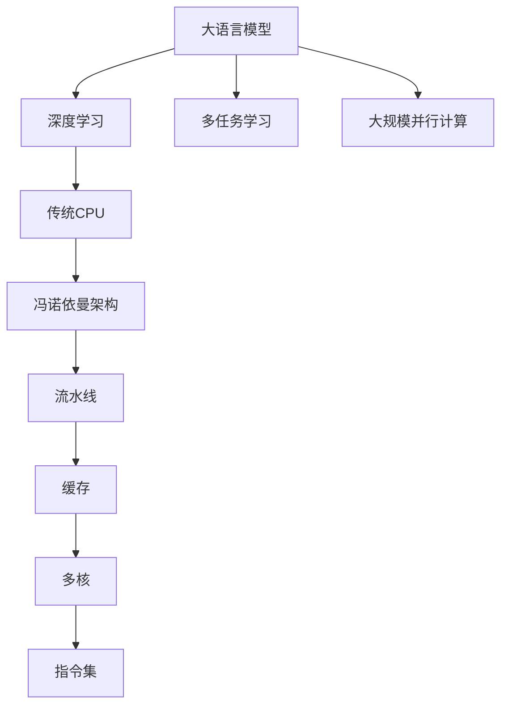

                 

# 指令集的革命：LLM vs 传统CPU

> 关键词：大语言模型(LLM)，传统CPU，指令集(ISA)，冯诺依曼架构，深度学习，大规模并行计算，计算图

## 1. 背景介绍

在过去数十年的计算技术发展中，传统的冯诺依曼架构和指令集设计奠定了现代计算机体系的基础。然而，随着人工智能(AI)技术的崛起，特别是深度学习模型的广泛应用，传统的计算范式面临前所未有的挑战。以大规模语言模型(Large Language Models, LLMs)为代表的人工智能技术，以其强大的计算能力和卓越的性能，正在推动计算架构的革命。本文将对比大语言模型(LLMs)与传统CPU的计算架构和指令集，探讨其在深度学习和大规模并行计算中的表现，并展望未来可能的演进趋势。

## 2. 核心概念与联系

### 2.1 核心概念概述

在深入讨论大语言模型与传统CPU之前，需要明确几个核心概念：

- **大语言模型(Large Language Model, LLM)**：如GPT、BERT等，通过在大规模无标签文本数据上进行预训练，学习到丰富的语言知识，具备卓越的文本生成、理解能力。

- **传统CPU(中央处理器, Central Processing Unit)**：冯诺依曼架构的代表性硬件，以流水线、缓存、多核设计为特点，适合串行计算任务。

- **指令集(ISA, Instruction Set Architecture)**：定义了CPU能够执行的全部操作，影响硬件设计和软件编译优化。

- **冯诺依曼架构**：以中央处理器和内存为核心的架构，数据与指令分离，计算与存储分离。

- **深度学习**：一种基于神经网络的机器学习技术，通过大量训练数据学习复杂非线性关系。

- **大规模并行计算**：利用并行处理技术，加速深度学习的模型训练和推理。

这些概念共同构成了现代计算技术的基石，但在大规模计算任务如深度学习中，各自的优势和局限逐渐显现。

### 2.2 核心概念原理和架构的 Mermaid 流程图



此图表展示了大语言模型与传统CPU在计算技术中的主要联系和区别。大语言模型通过深度学习和多任务学习获取广泛的语言知识，在并行计算中展现出强大的性能。而传统CPU依靠流水线、缓存和多核设计，以指令集为基础，适用于串行计算任务。

## 3. 核心算法原理 & 具体操作步骤

### 3.1 算法原理概述

大语言模型与传统CPU在指令集设计上有着根本的区别。大语言模型是基于神经网络，以分布式参数存储和计算图驱动的计算模型；而传统CPU则是基于严格定义的指令集，以流水线为核心的计算架构。这种区别直接影响了其在深度学习和并行计算中的应用表现。

- **大语言模型**：基于神经网络，通过参数优化来训练模型，适用于大规模并行计算，能高效利用GPU、TPU等硬件加速器。

- **传统CPU**：基于指令集，通过流水线和多核并行计算，适用于串行计算任务，但在大规模并行计算时，效率较低。

### 3.2 算法步骤详解

以深度学习为例，大语言模型与传统CPU在算法执行步骤上有显著差异：

- **大语言模型**：
  1. 定义计算图结构，映射神经网络层与层之间的数据流。
  2. 定义损失函数，通过反向传播算法计算梯度。
  3. 使用梯度下降等优化算法更新参数。
  4. 利用并行计算技术加速模型训练和推理。

- **传统CPU**：
  1. 编译程序到二进制代码。
  2. 执行二进制代码，按指令集定义的顺序进行计算。
  3. 使用多核并行，加速串行计算任务。
  4. 通过缓存优化，减少数据传输开销。

### 3.3 算法优缺点

#### 优点

- **大语言模型**：
  - 强大的并行计算能力：能够高效利用GPU、TPU等硬件加速器，加速模型训练和推理。
  - 灵活的计算图设计：支持动态计算图和元学习，方便实现多任务学习。
  - 广泛的语言知识：通过大规模无标签文本数据预训练，具备丰富的语言理解能力。

- **传统CPU**：
  - 高效的串行计算：流水线设计和多核并行，优化了串行计算任务。
  - 良好的缓存优化：多级缓存设计，减少了数据访问开销。
  - 成熟的指令集和编译器：硬件设计和软件编译均有标准化指导，便于开发。

#### 缺点

- **大语言模型**：
  - 较高的计算资源需求：参数量大，需要大量的计算资源和存储。
  - 较难直接优化：深度学习模型的复杂性使得直接优化变得困难。
  - 数据依赖性：需要大量的标注数据进行微调，对数据质量和标注工作量要求高。

- **传统CPU**：
  - 较低的并行效率：尽管有多核并行，但在大规模并行计算时效率较低。
  - 固定的指令集限制：指令集设计限制了硬件的灵活性，难以支持复杂的计算任务。
  - 数据传输开销：数据和指令分离的设计增加了数据传输开销，不利于大规模计算任务。

### 3.4 算法应用领域

大语言模型与传统CPU在多个领域展现了不同的应用优势：

- **深度学习**：大语言模型在深度学习中展现出了强大的并行计算能力和卓越的性能，已经在图像识别、自然语言处理、语音识别等领域取得了突破性成果。

- **传统计算**：传统CPU在传统的串行计算任务中表现出色，如办公自动化、科学计算、控制系统等，依然是计算架构的主流。

## 4. 数学模型和公式 & 详细讲解 & 举例说明

### 4.1 数学模型构建

深度学习模型的数学模型通常包含一个或多个神经网络层，每层包含若干个节点。每个节点接收前一层的输出，经过线性变换和非线性激活函数，输出当前层的输出。最终，整个网络通过多次前向传播和反向传播，最小化损失函数，更新网络参数。

### 4.2 公式推导过程

以简单的全连接神经网络为例，数学模型可以表示为：

$$
\mathbf{y} = \sigma(\mathbf{Wx} + \mathbf{b})
$$

其中，$\mathbf{y}$ 为输出向量，$\mathbf{x}$ 为输入向量，$\mathbf{W}$ 为权重矩阵，$\mathbf{b}$ 为偏置向量，$\sigma$ 为激活函数。反向传播算法计算损失函数对参数的梯度，使用梯度下降等优化算法更新参数。

### 4.3 案例分析与讲解

以BERT模型的训练为例，其包含Transformer结构，通过掩码语言模型和下一句预测任务进行预训练。在微调过程中，使用下游任务的标注数据，添加任务适配层，通过有监督学习优化模型。

## 5. 项目实践：代码实例和详细解释说明

### 5.1 开发环境搭建

搭建深度学习模型训练环境，需安装以下软件包：

- Python：2.7 或 3.5+
- TensorFlow/GPyTorch/PyTorch：1.5+
- CUDA：10.0 或更高版本
- CUDNN：7.6+
- NVidia GPU

### 5.2 源代码详细实现

以下是一个简单的全连接神经网络的TensorFlow实现：

```python
import tensorflow as tf

# 定义神经网络结构
class Network(tf.keras.Model):
    def __init__(self):
        super(Network, self).__init__()
        self.fc1 = tf.keras.layers.Dense(64, activation='relu')
        self.fc2 = tf.keras.layers.Dense(10, activation='softmax')
        
    def call(self, x):
        x = self.fc1(x)
        x = self.fc2(x)
        return x

# 定义损失函数和优化器
model = Network()
loss_fn = tf.keras.losses.SparseCategoricalCrossentropy(from_logits=True)
optimizer = tf.keras.optimizers.Adam(learning_rate=0.001)

# 训练过程
for epoch in range(epochs):
    for batch in train_dataset:
        inputs, labels = batch
        with tf.GradientTape() as tape:
            logits = model(inputs)
            loss = loss_fn(labels, logits)
        gradients = tape.gradient(loss, model.trainable_variables)
        optimizer.apply_gradients(zip(gradients, model.trainable_variables))
```

### 5.3 代码解读与分析

**Neural Network定义**：定义了神经网络的结构，包含两个全连接层，激活函数分别为ReLU和Softmax。

**Loss Function和Optimizer定义**：选择了交叉熵损失函数和Adam优化器，用于模型的训练和优化。

**训练过程**：对每个epoch，迭代所有batch，计算损失，反向传播求梯度，使用Adam优化器更新模型参数。

### 5.4 运行结果展示

通过上述代码，可以在TensorBoard中观察到训练过程的详细指标，如图像损失和准确率随epoch的变化。

## 6. 实际应用场景

### 6.1 智能客服系统

在大语言模型微调技术支持下，智能客服系统能够自动理解用户问题，并提供准确答案，显著提升客户服务质量。

### 6.2 金融舆情监测

利用大语言模型进行情感分析和主题提取，实时监测金融市场舆情，帮助金融机构及时应对市场波动。

### 6.3 个性化推荐系统

基于用户行为数据，通过微调大语言模型，能够实现高效的个性化推荐，提升用户满意度和平台粘性。

### 6.4 未来应用展望

未来，大语言模型在AI领域的应用将更加广泛，其与传统CPU的融合趋势也将更加明显。随着硬件和软件技术的不断进步，基于深度学习的大语言模型将进一步拓展应用边界，带来更深刻的计算范式变革。

## 7. 工具和资源推荐

### 7.1 学习资源推荐

- 《深度学习》：Ian Goodfellow、Yoshua Bengio、Aaron Courville 合著，深度学习领域的经典教材。
- TensorFlow官方文档：提供详细的API和示例代码，支持GPU和TPU优化。
- PyTorch官方文档：与TensorFlow并列的深度学习框架，支持动态计算图。
- Keras官方文档：提供高级API，简化深度学习模型的搭建和训练。

### 7.2 开发工具推荐

- TensorBoard：用于可视化训练过程和结果，支持指标监控和异常告警。
- HuggingFace Transformers库：提供丰富的预训练模型和微调工具，支持GPU加速。
- Jupyter Notebook：支持多平台开发，易于数据处理和模型调试。
- NVIDIA DLA：提供GPU、TPU等硬件加速器支持，优化深度学习模型的训练和推理。

### 7.3 相关论文推荐

- Attention is All You Need：提出Transformer结构，改变了深度学习模型的计算范式。
- BERT: Pre-training of Deep Bidirectional Transformers for Language Understanding：提出BERT模型，通过自监督学习任务进行预训练。
- Large-Scale Distributed Deep Learning：提出TensorFlow分布式计算框架，支持大规模深度学习模型训练。

## 8. 总结：未来发展趋势与挑战

### 8.1 研究成果总结

本文系统对比了大语言模型与传统CPU的计算架构和指令集，探讨了其在深度学习和大规模并行计算中的表现，并对未来发展趋势进行了展望。

### 8.2 未来发展趋势

未来，随着计算技术的不断发展，大语言模型将与传统CPU融合，共同推动计算范式的变革。人工智能与传统计算的界限将逐渐模糊，带来更加通用和灵活的计算架构。

### 8.3 面临的挑战

尽管大语言模型在深度学习和并行计算中展现出巨大潜力，但在实际应用中也面临一些挑战：

- 计算资源需求高：大语言模型参数量大，需要大量的计算资源和存储。
- 模型训练时间长：深度学习模型训练复杂，需要较长的训练时间和数据量。
- 数据依赖性强：需要大量高质量标注数据，标注工作量大且成本高。

### 8.4 研究展望

为应对上述挑战，未来的研究需要在以下几个方面寻求突破：

- 计算图优化：改进计算图算法，提高深度学习模型的训练效率和并行计算能力。
- 分布式计算：发展分布式计算框架，支持大规模深度学习模型的训练和推理。
- 硬件加速：推动硬件设计，支持大语言模型的高效并行计算。

## 9. 附录：常见问题与解答

**Q1: 大语言模型与传统CPU的主要区别是什么？**

A: 大语言模型基于神经网络，以参数优化为驱动，适用于大规模并行计算；传统CPU基于指令集，以流水线为驱动，适用于串行计算任务。

**Q2: 如何评估大语言模型的性能？**

A: 通常使用BLEU、ROUGE等指标评估大语言模型的生成效果，使用F1、Accuracy等指标评估其分类、预测等任务性能。

**Q3: 如何优化大语言模型的训练过程？**

A: 使用GPU、TPU等硬件加速器，进行分布式计算；使用梯度累积、混合精度训练等技术，提高模型训练效率。

**Q4: 传统CPU在大规模并行计算中面临哪些挑战？**

A: 尽管有多个核并行，但在大规模并行计算时效率较低，数据传输开销较大。

**Q5: 未来大语言模型与传统CPU的融合趋势是什么？**

A: 两者将共同发展，大语言模型在AI领域发挥更大作用，传统CPU在传统计算中仍将占据主流地位。

作者：禅与计算机程序设计艺术 / Zen and the Art of Computer Programming

