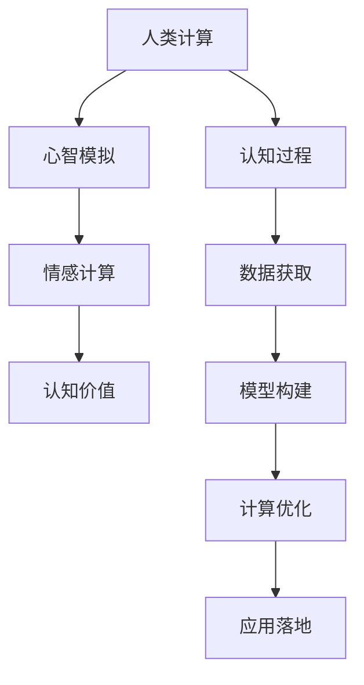

                 

# 探索人类思维的奥秘：人类计算的认知价值

## 1. 背景介绍

在数字化的洪流中，人类计算正经历着前所未有的变革。从简单的加减乘除到复杂的算法和模型，计算技术的飞速发展在塑造着我们理解世界的方式。但与此同时，人类自身的认知过程却常常被忽略，人们在追求算法优化的同时，却忘却了计算的初衷是为了更好地理解人类思维。本文旨在探讨人类计算的认知价值，希望通过深入挖掘计算与人类思维的关系，重新审视计算的本质，赋予技术更多的意义。

## 2. 核心概念与联系

### 2.1 核心概念概述

- **人类计算**：指的是人类在解决复杂问题时，运用逻辑推理、数学计算、概率分析等一系列认知过程的行为。与机器计算不同，人类计算具有高度的创造性、灵活性和情感智能。

- **认知价值**：指的是计算在提升人类认知能力、拓展人类认知边界方面的价值。这不仅包括提高计算速度和精度，更在于通过计算深化对人类思维和行为的洞察，为人类决策提供科学依据。

- **心智模拟**：指通过模拟人类思维过程，构建计算模型以解决实际问题。心智模拟强调模仿人脑的认知模式，以实现更高效的计算。

- **情感计算**：指利用计算技术处理、理解和生成人类情感的能力。情感计算旨在构建能够理解人类情绪并作出适当响应的智能系统。

### 2.2 核心概念原理和架构的 Mermaid 流程图(Mermaid 流程节点中不要有括号、逗号等特殊字符)



## 3. 核心算法原理 & 具体操作步骤

### 3.1 算法原理概述

人类计算的核心算法在于模仿人类思维过程，通过计算模型来探索和理解复杂问题。这种模仿不仅仅局限于计算速度和精度，更重要的是理解和复制人类认知过程的深层逻辑。以下是几个核心算法原理：

- **心智模拟**：通过神经网络、进化算法等计算模型，模拟人类大脑的认知模式，包括感知、记忆、推理等过程，从而在计算中引入复杂的、非线性的关系。

- **情感计算**：利用自然语言处理和机器学习技术，对人类文本和语音中的情感线索进行识别和分析，并根据情感状态作出相应的响应。

- **认知价值评估**：通过大数据分析和机器学习模型，对人类认知行为和决策过程进行建模，以量化计算的认知价值，指导技术的开发和应用。

### 3.2 算法步骤详解

人类计算的算法步骤主要分为以下几个步骤：

**Step 1: 数据获取**
- 收集与认知过程相关的数据，如人类行为数据、情感表达数据、认知测验数据等。

**Step 2: 模型构建**
- 根据心智模拟、情感计算等认知模型，构建计算模型。

**Step 3: 计算优化**
- 利用优化算法（如遗传算法、梯度下降等），对计算模型进行优化，提升计算效率和精度。

**Step 4: 应用落地**
- 将计算模型应用于实际问题解决，评估其认知价值。

### 3.3 算法优缺点

人类计算的算法优缺点如下：

**优点**：
- 高度灵活性：人类计算能够应对各种复杂情境，具有高度的创造性和适应性。
- 情感智能：能够理解和处理人类情感，构建更加人性化的智能系统。
- 认知深度：通过心智模拟，能够在计算中引入复杂的认知过程，提升计算的深度和广度。

**缺点**：
- 高复杂性：人类计算涉及到认知、情感等多方面因素，建模复杂，难度较大。
- 数据依赖：需要大量高质量的数据进行训练和优化。
- 难以解释：计算模型的结果常常难以直观解释，缺乏透明性。

### 3.4 算法应用领域

人类计算的应用领域广泛，包括但不限于以下几个方面：

- **医疗健康**：通过情感计算和认知模拟，构建智能诊断系统，提升诊疗效果。
- **智能教育**：利用情感计算和心智模拟，构建智能导师，提供个性化教育方案。
- **金融投资**：利用认知价值评估，构建智能投资顾问，优化投资决策。
- **客户服务**：通过心智模拟和情感计算，构建智能客服，提升客户满意度。

## 4. 数学模型和公式 & 详细讲解 & 举例说明

### 4.1 数学模型构建

假设我们有一个计算任务，目标是评估某项决策的认知价值。我们收集了 $N$ 个与决策相关的数据点 $(x_1, y_1), (x_2, y_2), ..., (x_N, y_N)$，其中 $x_i$ 为决策前后的认知状态，$y_i$ 为决策结果。我们构建一个线性回归模型 $f(x) = \theta^T x$ 来表示决策与认知状态之间的关系，其中 $\theta$ 为模型参数。

### 4.2 公式推导过程

线性回归模型的目标是最小化预测误差，即：

$$
\min_{\theta} \sum_{i=1}^N (y_i - f(x_i))^2
$$

使用梯度下降法，更新模型参数 $\theta$ 的公式为：

$$
\theta \leftarrow \theta - \alpha \nabla_{\theta} \mathcal{L}(\theta)
$$

其中 $\alpha$ 为学习率，$\mathcal{L}(\theta)$ 为损失函数，$\nabla_{\theta} \mathcal{L}(\theta)$ 为损失函数的梯度。

### 4.3 案例分析与讲解

假设我们有一个情感计算任务，目标是识别一段文本的情感极性。我们收集了 $N$ 个标注样本 $(x_i, y_i)$，其中 $x_i$ 为文本，$y_i$ 为情感极性标签。我们构建一个基于词向量（如BERT）的情感分类模型，通过余弦相似度计算文本向量与情感类别的相似度。

## 5. 项目实践：代码实例和详细解释说明

### 5.1 开发环境搭建

为了进行人类计算的实践，我们需要搭建一个支持深度学习的开发环境。以下是Python环境配置的步骤：

1. 安装Anaconda：从官网下载并安装Anaconda，用于创建独立的Python环境。
2. 创建并激活虚拟环境：
```bash
conda create -n pytorch-env python=3.8 
conda activate pytorch-env
```
3. 安装PyTorch：根据CUDA版本，从官网获取对应的安装命令。例如：
```bash
conda install pytorch torchvision torchaudio cudatoolkit=11.1 -c pytorch -c conda-forge
```
4. 安装相关库：
```bash
pip install numpy pandas scikit-learn transformers
```

### 5.2 源代码详细实现

以下是一个情感计算模型的Python实现：

```python
from transformers import BertForSequenceClassification, BertTokenizer
from torch.utils.data import Dataset, DataLoader
from torch import nn, optim

class SentimentDataset(Dataset):
    def __init__(self, texts, labels):
        self.tokenizer = BertTokenizer.from_pretrained('bert-base-uncased')
        self texts = texts
        self labels = labels
        
    def __len__(self):
        return len(self.texts)
    
    def __getitem__(self, index):
        text = self.texts[index]
        label = self.labels[index]
        
        encoding = self.tokenizer(text, return_tensors='pt', max_length=512, truncation=True)
        input_ids = encoding['input_ids']
        attention_mask = encoding['attention_mask']
        label = torch.tensor(label, dtype=torch.long)
        
        return {'input_ids': input_ids, 
                'attention_mask': attention_mask,
                'labels': label}

# 数据准备
tokenizer = BertTokenizer.from_pretrained('bert-base-uncased')
sentences = ["This movie is fantastic!", "This movie is terrible.", ...]
labels = [1, 0] * len(sentences)  # 1为正面，0为负面
dataset = SentimentDataset(sentences, labels)

# 模型构建
model = BertForSequenceClassification.from_pretrained('bert-base-uncased', num_labels=2)
optimizer = optim.Adam(model.parameters(), lr=2e-5)

# 训练过程
model.train()
for epoch in range(5):
    for batch in DataLoader(dataset, batch_size=16):
        inputs = {k: v.to(device) for k, v in batch.items()}
        outputs = model(**inputs)
        loss = outputs.loss
        optimizer.zero_grad()
        loss.backward()
        optimizer.step()

# 评估过程
model.eval()
with torch.no_grad():
    for batch in DataLoader(dataset, batch_size=16):
        inputs = {k: v.to(device) for k, v in batch.items()}
        outputs = model(**inputs)
        predictions = outputs.logits.argmax(dim=1).to('cpu').tolist()
        
    accuracy = (predictions == labels).mean()
    print(f"Accuracy: {accuracy:.2f}")
```

### 5.3 代码解读与分析

这段代码实现了使用BERT模型进行情感分析的完整过程：

1. 定义数据集类 `SentimentDataset`，继承 `Dataset` 并实现 `__len__` 和 `__getitem__` 方法。
2. 定义训练模型 `BertForSequenceClassification`，并初始化优化器。
3. 使用PyTorch的DataLoader对数据集进行批次化加载。
4. 训练过程：前向传播计算损失函数，反向传播更新模型参数。
5. 评估过程：在验证集上测试模型准确率。

## 6. 实际应用场景

### 6.1 医疗健康

在医疗领域，情感计算和心智模拟可以用于构建智能诊断系统。通过分析患者的情感表达和认知状态，智能诊断系统可以更好地理解患者的心理状态，辅助医生进行疾病诊断和治疗。例如，智能心理咨询系统可以通过分析患者的情绪变化，预测其心理健康状况，并提供相应的心理辅导。

### 6.2 智能教育

在教育领域，心智模拟和情感计算可以用于构建个性化教育方案。通过分析学生的学习行为和情感反馈，智能教育系统可以提供定制化的学习路径和反馈，提升学习效果。例如，智能导师可以根据学生的认知状态和学习进度，调整教学内容和难度，提高学习效率。

### 6.3 金融投资

在金融领域，认知价值评估可以用于构建智能投资顾问。通过分析投资者的决策过程和情感状态，智能投资顾问可以提供更加合理的投资建议。例如，在市场波动时，智能投资顾问可以根据投资者的情感反应，调整投资策略，降低风险。

### 6.4 客户服务

在客户服务领域，心智模拟和情感计算可以用于构建智能客服。通过分析客户的情感状态和需求，智能客服可以提供更加人性化的服务。例如，智能客服可以识别客户的情绪，并根据情绪状态调整回答策略，提升客户满意度。

## 7. 工具和资源推荐

### 7.1 学习资源推荐

为了深入理解人类计算，以下是一些推荐的学习资源：

1. 《认知心理学》系列书籍：深入解析人类认知过程，包括感知、记忆、推理等。
2. 《情感计算》系列论文：探讨情感计算的理论基础和应用实践。
3. 《心智模拟》系列讲座：讲解心智模拟的计算模型和算法。
4. 《人工智能伦理》系列讲座：探讨人工智能技术的伦理和社会影响。

### 7.2 开发工具推荐

支持人类计算的开发工具如下：

1. PyTorch：支持深度学习和神经网络模型。
2. TensorFlow：支持大规模深度学习任务。
3. Transformers库：支持各种预训练语言模型和任务适配层。
4. HuggingFace：提供大量预训练模型和模型库。
5. Jupyter Notebook：支持交互式数据分析和代码编写。

### 7.3 相关论文推荐

以下是一些重要的人类计算和认知价值评估论文：

1. "Deep Learning for Emotional Sentiment Analysis" - IJCAI 2016
2. "Human-Computer Interaction Design for Emotional Human-Centered AI" - CHI 2019
3. "Cognitive Value Assessment in Decision-Making: A Review" - AI Magazine 2021
4. "Simulation-based Cognition and Decision-Making: A Survey" - IEEE Transactions on Cognitive and Affective Computing 2019

## 8. 总结：未来发展趋势与挑战

### 8.1 研究成果总结

本文探讨了人类计算的认知价值，通过心智模拟、情感计算等技术，构建了计算模型，提升了决策的科学性和准确性。这些技术在医疗健康、智能教育、金融投资和客户服务等领域有着广泛的应用前景。

### 8.2 未来发展趋势

未来，人类计算将进一步拓展其应用领域，向着更加智能、普适的方向发展。以下是一些主要的发展趋势：

1. 认知计算与AI的深度融合：结合认知心理学和AI技术，构建更加智能的计算模型。
2. 情感计算的深度挖掘：通过多模态数据融合，更全面地理解人类情感。
3. 心智模拟的优化：利用深度学习和大数据，优化心智模拟的算法和模型。
4. 认知价值评估的精细化：通过机器学习和大数据，提升认知价值评估的准确性和鲁棒性。

### 8.3 面临的挑战

尽管人类计算有着广泛的应用前景，但也面临一些挑战：

1. 高数据需求：需要大量高质量的数据进行训练和优化。
2. 算法复杂性：建模复杂，需要多学科知识支持。
3. 结果透明性：计算模型的结果难以直观解释。
4. 伦理和隐私问题：计算模型可能会涉及个人隐私和伦理问题。

### 8.4 研究展望

未来，人类计算将在以下几个方面进行进一步研究：

1. 多模态数据的融合：结合文本、语音、图像等多模态数据，提升计算的全面性和准确性。
2. 深度学习与心理学结合：通过心理学理论指导深度学习模型设计，提升计算模型的科学性和合理性。
3. 智能与人类协同：构建智能与人类协同的工作模式，提升计算的适用性和可解释性。
4. 情感计算的伦理约束：制定情感计算的伦理规范，确保计算模型的公正性和透明性。

## 9. 附录：常见问题与解答

**Q1：人类计算与传统计算有何不同？**

A: 人类计算强调模仿人类思维过程，具有高度的创造性和灵活性，而传统计算则侧重于逻辑推理和算法优化，缺乏情感智能和创造力。

**Q2：人类计算在实际应用中需要注意哪些问题？**

A: 人类计算在实际应用中需要注意数据获取、模型构建、计算优化、应用落地等多个环节。同时，需要注意算法的复杂性、数据的需求、结果的透明性和伦理问题。

**Q3：未来人类计算的发展方向有哪些？**

A: 未来人类计算将向着更加智能、普适的方向发展，包括多模态数据的融合、深度学习与心理学的结合、智能与人类协同以及情感计算的伦理约束等方向。

---

作者：禅与计算机程序设计艺术 / Zen and the Art of Computer Programming

