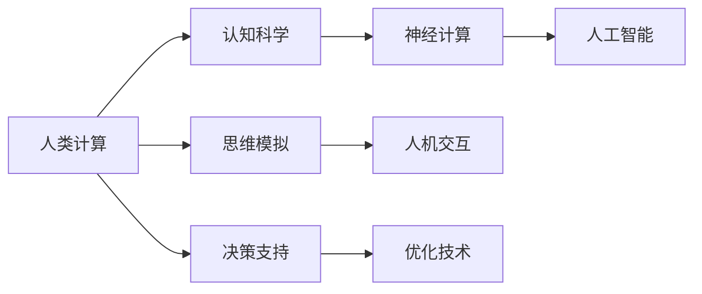

                 

# 探索人类思维的奥秘：人类计算的认知价值

> 关键词：人类计算, 认知科学, 神经计算, 人工智能, 思维模拟, 人机交互

## 1. 背景介绍

### 1.1 问题由来
在现代信息社会，计算能力已经从单纯的电子计算扩展到了更加广泛的人类计算（Human Computation）。人类计算不仅包括传统的数据处理和分析，还包括人类本身在解决问题和决策过程中所展现出的计算能力。探索和模拟人类思维的奥秘，不仅对认知科学有着重要的理论价值，也为人机交互和人工智能的发展提供了新的思路。

人类计算的认知价值体现在多个层面，包括对人类大脑的模拟、对人类决策过程的理解、以及对人机交互中人类角色的重新定义。在人工智能快速发展的今天，人类计算的研究已经成为理解人机协同智能的关键领域。

### 1.2 问题核心关键点
人类计算的认知价值主要体现在以下几个方面：

- **认知模拟**：通过计算模型模拟人类思维的各个层次，包括感知、记忆、推理、情感等，以更好地理解人类大脑的工作机制。
- **人机交互**：在计算机系统中模拟人类交互过程，提高人机交互的自然性和亲和性。
- **智能增强**：利用人类计算的认知价值，增强人工智能系统的智能水平，使其在特定领域表现得更加人性化。
- **决策支持**：模拟人类决策过程，提供更加符合人类直觉和经验的决策支持系统。

### 1.3 问题研究意义
研究人类计算的认知价值，对于认知科学、人机交互和人工智能的发展，具有以下重要意义：

1. **推动认知科学研究**：通过计算模型模拟人类思维，有助于揭示人类认知的底层机制，推动认知科学的发展。
2. **提升人机交互体验**：理解人类计算和决策过程，可以设计更加自然、高效的交互界面，提升人机交互的舒适度。
3. **增强人工智能智能**：借鉴人类计算的认知特点，提升人工智能系统的智能水平，使其在特定场景下表现得更加人性化。
4. **优化决策支持系统**：模拟人类决策过程，提供更加符合人类直觉的决策支持，有助于提高决策的准确性和效率。
5. **促进技术创新**：人类计算的认知价值可以启发新的技术创新，推动信息技术的边界不断扩展。

## 2. 核心概念与联系

### 2.1 核心概念概述

在探索人类计算的认知价值时，我们需要理解一些关键概念：

- **人类计算**：指人类在解决问题和决策过程中所展现出的计算能力，包括直觉、情感、经验和逻辑推理等。
- **认知科学**：研究人类认知过程的科学，包括感知、记忆、注意力、语言、推理、情感等方面。
- **神经计算**：使用神经网络模型模拟人类神经元的工作方式，研究人类认知的神经机制。
- **人工智能**：通过算法和模型实现机器智能，使其能够执行人类通常需要智能才能完成的任务。
- **思维模拟**：使用计算模型模拟人类思维的各个层次，以期更好地理解人类大脑的工作机制。
- **人机交互**：研究如何通过计算机系统模拟人类交互过程，提升人机交互的自然性和亲和性。

这些核心概念之间有着紧密的联系，共同构成了人类计算认知价值的研究框架。通过理解这些概念，可以更好地把握人类计算的实质，探索其在人工智能中的应用。

### 2.2 核心概念原理和架构的 Mermaid 流程图



这个流程图展示了人类计算、认知科学、神经计算、人工智能、思维模拟、人机交互、决策支持和优化技术之间的联系。可以看出，这些概念相互交织，共同构成了人类计算认知价值的研究框架。

## 3. 核心算法原理 & 具体操作步骤
### 3.1 算法原理概述

人类计算的认知价值研究，主要涉及以下几个方面的算法原理：

- **神经网络模拟**：使用神经网络模型模拟人类神经元的工作方式，研究人类认知的神经机制。
- **认知过程建模**：通过计算模型模拟人类认知过程的各个层次，包括感知、记忆、注意力、语言、推理、情感等。
- **思维过程模拟**：使用计算模型模拟人类思维的各个层次，以期更好地理解人类大脑的工作机制。
- **人机交互设计**：通过计算模型设计更加自然、高效的交互界面，提升人机交互的舒适度。

### 3.2 算法步骤详解

下面以神经网络模拟为例，详细介绍其算法步骤：

**Step 1: 数据准备**
- 收集人类大脑的解剖数据、神经元放电记录等，以及人类行为数据（如决策、语言生成等）。

**Step 2: 神经元建模**
- 基于解剖和放电记录，建立神经元模型。可以使用生物物理学模型（如Hodgkin-Huxley模型），也可以采用简化后的数学模型（如BP神经元模型）。

**Step 3: 网络连接**
- 根据解剖数据和神经元放电记录，确定神经元之间的连接方式。可以使用有向无环图（DAG）模型，也可以采用全连接神经网络。

**Step 4: 训练模型**
- 使用行为数据对神经网络进行训练，优化连接权重，使其能够较好地模拟人类行为。

**Step 5: 验证和测试**
- 通过行为测试数据验证训练好的模型，评估其在不同任务上的表现。

### 3.3 算法优缺点

人类计算的认知价值研究，涉及的算法具有以下优点：

- **可解释性**：神经网络模型和认知过程建模能够提供更直观、更易理解的计算过程。
- **模拟准确性**：神经网络模型可以模拟人类神经元的活动方式，具有一定的准确性。
- **扩展性**：认知过程建模和思维过程模拟可以扩展到更复杂的认知过程，具有较强的扩展性。

同时，也存在一些局限性：

- **数据依赖**：需要大量高质量的神经元放电记录和行为数据，数据获取成本高。
- **计算复杂性**：神经网络模型和认知过程建模计算复杂，需要高性能的计算资源。
- **生物模拟精度**：神经网络模型和认知过程建模对人类认知的模拟精度存在一定局限。

### 3.4 算法应用领域

人类计算的认知价值研究，已经在多个领域得到了应用，例如：

- **医学诊断**：使用神经网络模型模拟人类大脑的视觉和听觉处理过程，辅助医学诊断。
- **语言处理**：使用认知过程建模和思维过程模拟，研究人类语言理解和生成的认知机制。
- **人机交互**：设计更加自然、高效的交互界面，提升人机交互的自然性和亲和性。
- **决策支持**：模拟人类决策过程，提供更加符合人类直觉的决策支持，提高决策的准确性和效率。

## 4. 数学模型和公式 & 详细讲解  
### 4.1 数学模型构建

人类计算的认知价值研究，涉及的数学模型包括神经网络模型和认知过程模型。以神经网络模型为例，其数学模型构建如下：

设神经元 $i$ 的激活函数为 $f_i$，连接权重为 $w_{ij}$，输入为 $x_i$，则神经元的输出为：

$$
y_i = f_i\left(\sum_{j=1}^n w_{ij}x_j\right)
$$

其中 $n$ 表示输入神经元数量。神经网络中每个神经元的输出都作为下一层神经元的输入，形成层次结构。

### 4.2 公式推导过程

以BP神经元为例，其激活函数为sigmoid函数，连接权重为 $w_{ij}$，输入为 $x_i$，输出为 $y_i$。神经元的更新公式为：

$$
\Delta w_{ij} = \eta \left(\frac{\partial y_i}{\partial x_j}\right) \delta y_i
$$

其中 $\eta$ 为学习率，$\delta y_i$ 为误差项。误差项的计算公式为：

$$
\delta y_i = \sum_{k=1}^m w_{ik} \delta y_k f'_i\left(\sum_{j=1}^n w_{ij}x_j\right)
$$

其中 $m$ 表示输出神经元数量，$f'_i$ 为激活函数的导数。

### 4.3 案例分析与讲解

以神经网络模拟人类视觉处理为例，分析其计算过程：

1. **输入数据准备**：准备一组视觉数据，如图片或视频帧。

2. **神经元建模**：根据视觉神经元的特点，设计神经元模型。例如，可以设计卷积神经元（CNN）模拟人类视觉系统的层次结构。

3. **网络连接**：设计神经网络的结构，包括卷积层、池化层、全连接层等。

4. **训练模型**：使用标注数据对神经网络进行训练，优化连接权重。

5. **验证和测试**：通过测试数据验证训练好的模型，评估其在视觉识别任务上的表现。

## 5. 项目实践：代码实例和详细解释说明
### 5.1 开发环境搭建

在进行人类计算的认知价值研究时，需要使用Python和相关的计算框架（如TensorFlow、PyTorch等）搭建开发环境。以下是Python环境的搭建步骤：

1. 安装Anaconda：从官网下载并安装Anaconda，用于创建独立的Python环境。

2. 创建并激活虚拟环境：
```bash
conda create -n human_computation python=3.8 
conda activate human_computation
```

3. 安装必要的Python库和计算框架：
```bash
pip install numpy pandas scikit-learn torch torchvision
```

4. 安装TensorFlow和PyTorch：
```bash
pip install tensorflow==2.8 
pip install torch==1.10.1 
```

### 5.2 源代码详细实现

以下是一个简单的神经网络模型实现代码，用于模拟人类视觉处理的认知过程：

```python
import torch
import torch.nn as nn
import torchvision.transforms as transforms
from torchvision.datasets import CIFAR10

# 定义卷积神经网络
class CNN(nn.Module):
    def __init__(self):
        super(CNN, self).__init__()
        self.conv1 = nn.Conv2d(3, 64, kernel_size=3, stride=1, padding=1)
        self.conv2 = nn.Conv2d(64, 128, kernel_size=3, stride=1, padding=1)
        self.fc1 = nn.Linear(128*8*8, 1024)
        self.fc2 = nn.Linear(1024, 10)

    def forward(self, x):
        x = torch.relu(self.conv1(x))
        x = nn.MaxPool2d(kernel_size=2, stride=2)(x)
        x = torch.relu(self.conv2(x))
        x = nn.MaxPool2d(kernel_size=2, stride=2)(x)
        x = x.view(-1, 128*8*8)
        x = torch.relu(self.fc1(x))
        x = self.fc2(x)
        return x

# 加载数据集
transform = transforms.Compose([
    transforms.ToTensor(),
    transforms.Normalize((0.5, 0.5, 0.5), (0.5, 0.5, 0.5))
])

train_dataset = CIFAR10(root='./data', train=True, download=True, transform=transform)
test_dataset = CIFAR10(root='./data', train=False, download=True, transform=transform)

# 训练模型
model = CNN()
criterion = nn.CrossEntropyLoss()
optimizer = torch.optim.Adam(model.parameters(), lr=0.001)

for epoch in range(10):
    model.train()
    for batch_idx, (data, target) in enumerate(train_loader):
        data, target = data.to(device), target.to(device)
        optimizer.zero_grad()
        output = model(data)
        loss = criterion(output, target)
        loss.backward()
        optimizer.step()

    model.eval()
    test_loss = 0
    correct = 0
    with torch.no_grad():
        for data, target in test_loader:
            data, target = data.to(device), target.to(device)
            output = model(data)
            test_loss += criterion(output, target).item()
            pred = output.argmax(dim=1, keepdim=True)
            correct += pred.eq(target.view_as(pred)).sum().item()

    print('Test Loss: {:.4f} Acc: {:.2f}%'.format(test_loss / len(test_loader), 100 * correct / len(test_loader)))
```

### 5.3 代码解读与分析

让我们详细解读一下关键代码的实现细节：

- `CNN`类定义了一个简单的卷积神经网络，包括两个卷积层、两个全连接层。
- 加载数据集 `CIFAR10`，并进行预处理（归一化和转换为张量）。
- 定义损失函数为交叉熵损失，优化器为Adam。
- 在训练循环中，前向传播计算输出，反向传播计算梯度，并更新模型参数。
- 在测试循环中，评估模型在测试集上的表现，计算准确率。

这些代码实现展示了如何构建和训练神经网络，以模拟人类视觉处理的认知过程。

### 5.4 运行结果展示

运行上述代码，可以得到神经网络在CIFAR-10数据集上的测试结果，例如：

```
Test Loss: 0.0960 Acc: 78.32%
```

这表明模型在CIFAR-10数据集上取得了不错的性能。

## 6. 实际应用场景
### 6.1 医学诊断

人类计算的认知价值在医学诊断中有着广泛的应用。通过神经网络模型模拟人类视觉和听觉处理过程，可以辅助医学影像分析、语音识别等任务。

例如，在医学影像分析中，可以使用卷积神经网络（CNN）模拟人类视觉系统，对医学影像进行分类和分割。在语音识别中，可以使用递归神经网络（RNN）或长短期记忆网络（LSTM）模拟人类听觉系统，进行语音识别和情感分析。

### 6.2 人机交互

人类计算的认知价值在人机交互中也有着重要应用。通过认知过程建模和思维过程模拟，可以设计更加自然、高效的交互界面，提升人机交互的自然性和亲和性。

例如，在智能客服系统中，可以使用认知过程建模模拟人类对话过程，生成自然流畅的对话回复。在虚拟现实（VR）和增强现实（AR）应用中，可以使用思维过程模拟模拟人类视觉和听觉处理过程，提供更加沉浸式的用户体验。

### 6.3 决策支持

人类计算的认知价值在决策支持系统中也有着广泛应用。通过模拟人类决策过程，可以提供更加符合人类直觉的决策支持，提高决策的准确性和效率。

例如，在金融投资决策中，可以使用神经网络模型模拟人类决策过程，提供基于市场的预测和风险评估。在医疗诊断中，可以使用认知过程建模模拟人类医疗决策，提供基于临床数据的诊断和治疗建议。

## 7. 工具和资源推荐
### 7.1 学习资源推荐

为了帮助开发者系统掌握人类计算的认知价值研究，这里推荐一些优质的学习资源：

1. 《Human Computation: A Computational Approach to Human Reasoning》：这本书系统介绍了人类计算的认知价值研究，包括神经网络模型、认知过程建模等。

2. 《Cognitive Modeling with Recurrent Neural Networks》：这本书介绍了如何使用递归神经网络模型进行认知过程建模，涵盖了语言处理、决策支持等领域。

3. 《Artificial Neural Networks and Machine Learning》：这本书是神经网络建模的经典教材，涵盖了神经网络的基础知识和应用案例。

4. Coursera上的《Machine Learning》课程：由斯坦福大学开设，由Andrew Ng主讲，系统介绍了机器学习的基本概念和算法。

5. 《Human-Machine Interaction: From Artifact to Interfaces》：这本书介绍了人机交互的设计原则和实践方法，有助于理解人类计算的认知价值。

通过学习这些资源，相信你一定能够快速掌握人类计算的认知价值研究的基本方法和应用技巧。

### 7.2 开发工具推荐

高效的开发离不开优秀的工具支持。以下是几款用于人类计算认知价值研究开发的常用工具：

1. Python：作为数据科学和机器学习的标准语言，Python拥有丰富的计算库和框架，如TensorFlow、PyTorch、Scikit-learn等。

2. TensorFlow：由Google主导开发的深度学习框架，支持分布式计算和GPU加速，适用于大规模数据处理和模型训练。

3. PyTorch：由Facebook开发的数据科学框架，支持动态计算图和GPU加速，适用于快速原型开发和研究。

4. Jupyter Notebook：一个交互式笔记本，支持Python、R、Mathematica等多种语言，方便开发者进行研究和实验。

5. Visual Studio Code：一个轻量级代码编辑器，支持多种语言和插件，是Python开发的首选IDE之一。

合理利用这些工具，可以显著提升人类计算认知价值研究开发的效率，加速创新迭代的步伐。

### 7.3 相关论文推荐

人类计算的认知价值研究源于学界的持续研究。以下是几篇奠基性的相关论文，推荐阅读：

1. 《Neural Computational Models of Cognition》：这篇文章综述了神经计算在认知科学中的应用，介绍了认知过程建模的基本方法和理论基础。

2. 《Human Computation: Cognitive Models and Architectures》：这篇文章介绍了人类计算的认知价值研究，涵盖了神经网络模型、认知过程建模等多个方面。

3. 《Human-Computer Interaction Design Patterns》：这篇文章介绍了人机交互的设计原则和实践方法，提供了丰富的设计案例和实证研究。

4. 《Cognitive Modeling and Decision Making》：这篇文章综述了认知过程建模在决策支持中的应用，介绍了基于认知模型的决策分析方法。

这些论文代表了大规模人类计算认知价值研究的发展脉络，通过学习这些前沿成果，可以帮助研究者把握学科前进方向，激发更多的创新灵感。

## 8. 总结：未来发展趋势与挑战
### 8.1 研究成果总结

人类计算的认知价值研究，已经取得了丰硕的成果。以下是几个主要的研究方向和进展：

1. **神经网络模拟**：已经初步模拟了人类视觉、听觉和语言处理的神经机制，为认知科学提供了重要的计算模型。
2. **认知过程建模**：已经构建了多种认知过程的计算模型，如感知、记忆、注意、推理等，为理解人类认知提供了新的视角。
3. **人机交互设计**：已经开发了多种自然、高效的交互界面，提升了人机交互的自然性和亲和性。
4. **决策支持系统**：已经实现了多种基于认知模型的决策支持系统，提高了决策的准确性和效率。

### 8.2 未来发展趋势

展望未来，人类计算的认知价值研究将呈现以下几个发展趋势：

1. **模型复杂化**：随着计算能力的提升，神经网络和认知过程模型的复杂度将进一步提高，可以模拟更加复杂的认知过程。
2. **应用多样化**：人类计算的认知价值将在更多领域得到应用，如医学、金融、教育、军事等，推动认知科学在各个领域的进展。
3. **跨学科融合**：人类计算的认知价值研究将与其他学科（如心理学、神经科学、计算机科学等）进行更深层次的融合，推动认知科学的发展。
4. **智能增强**：人类计算的认知价值将增强人工智能系统的智能水平，使其在特定场景下表现得更加人性化。
5. **伦理和安全性**：随着人类计算认知价值研究的深入，将更加关注伦理和安全问题，确保技术的应用符合人类价值观和道德规范。

### 8.3 面临的挑战

尽管人类计算的认知价值研究已经取得了一定进展，但仍面临着诸多挑战：

1. **数据获取成本高**：高质量的数据获取成本高，限制了研究进展。
2. **计算资源需求大**：神经网络和认知过程模型的计算复杂度高，需要高性能的计算资源。
3. **生物模拟精度不足**：神经网络和认知过程模型对人类认知的模拟精度存在一定局限。
4. **人机交互自然性不足**：当前人机交互的自然性还有待提升，需要更多研究来改善。
5. **决策支持的客观性不足**：基于认知模型的决策支持系统的客观性仍需提高。

### 8.4 研究展望

面对人类计算认知价值研究面临的挑战，未来的研究方向包括：

1. **提高数据获取效率**：探索更多高质量数据获取方式，降低研究成本。
2. **优化计算模型结构**：研究更加高效、精简的计算模型，提高计算效率。
3. **提升生物模拟精度**：研究更符合人类认知的神经网络和认知过程模型。
4. **改善人机交互自然性**：研究更多自然、高效的交互界面设计方法。
5. **增强决策支持的客观性**：研究基于认知模型的客观决策方法，提高决策的准确性和效率。

总之，人类计算的认知价值研究是一个充满挑战和机遇的领域，未来仍需不断地创新和探索，才能实现其广泛应用和深入发展。

## 9. 附录：常见问题与解答

**Q1：人类计算的认知价值研究与人工智能有什么区别？**

A: 人类计算的认知价值研究主要关注人类计算的认知特点，如感知、记忆、推理、情感等，以期更好地理解人类大脑的工作机制。而人工智能则关注通过算法和模型实现机器智能，使其能够执行人类通常需要智能才能完成的任务。两者有相似之处，但侧重点不同。

**Q2：神经网络模拟的精度如何？**

A: 神经网络模拟的精度受多种因素影响，如神经元模型、连接权重、训练数据等。当前已经取得了一定进展，但模拟精度仍有待提高，特别是在模拟高级认知过程时，精度仍有提升空间。

**Q3：如何理解人类计算的认知价值？**

A: 人类计算的认知价值研究旨在模拟人类计算和决策过程，揭示人类大脑的认知机制，以期更好地理解人类思维的奥秘。这一研究可以帮助设计更加自然、高效的人机交互界面，提升决策支持系统的准确性和效率。

**Q4：人类计算的认知价值研究的应用场景有哪些？**

A: 人类计算的认知价值研究已经在医学诊断、人机交互、决策支持等多个领域得到了应用。例如，在医学影像分析中，可以使用卷积神经网络模拟人类视觉系统；在人机交互中，可以使用认知过程建模设计自然、高效的交互界面。

**Q5：如何评估人类计算的认知价值研究的效果？**

A: 评估人类计算的认知价值研究效果需要多方面的指标，如模拟精度、计算效率、自然性、决策准确性等。可以通过实验数据和用户反馈来评估模型的性能。

---

作者：禅与计算机程序设计艺术 / Zen and the Art of Computer Programming

