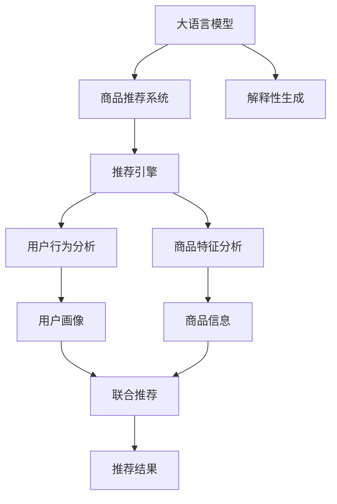

                 

# 探讨大模型在电商平台商品推荐解释性生成中的作用

> 关键词：大语言模型,商品推荐,解释性生成,自然语言处理(NLP),深度学习,强化学习

## 1. 背景介绍

### 1.1 问题由来

随着电商平台的兴起和移动互联网的发展，商品推荐系统已经成为各大电商平台的核心竞争力之一。通过智能推荐引擎，电商平台可以精准满足用户的购物需求，提升用户体验和转化率，甚至为商家带来显著的业绩提升。然而，传统的推荐系统往往基于简单的统计或协同过滤算法，缺乏对用户行为和商品特征的深入理解，推荐结果的解释性也很弱。

近年来，基于深度学习的推荐系统逐渐成为主流，以TensorFlow、PyTorch为代表的深度学习框架，为商品推荐系统注入了新的活力。其中，大语言模型在电商领域的应用，通过生成更具解释性和吸引力的商品推荐语，极大提升了用户购物体验。本博客将探讨大语言模型在电商平台商品推荐解释性生成中的作用，并通过具体案例展示其实现原理和应用效果。

## 2. 核心概念与联系

### 2.1 核心概念概述

为更好地理解大模型在电商商品推荐中的应用，本节将介绍几个关键概念：

- 大语言模型(Large Language Model, LLM)：以自回归(如GPT)或自编码(如BERT)模型为代表的大规模预训练语言模型。通过在大规模无标签文本语料上进行预训练，学习通用的语言表示，具备强大的语言理解和生成能力。

- 商品推荐系统(Recommendation System)：通过算法模型，利用用户行为和商品特征信息，推荐用户可能感兴趣的商品。

- 解释性生成(Explainable Generation)：通过生成自然语言文本，解释模型预测结果的生成过程，增强用户信任和理解。

- 自然语言处理(Natural Language Processing, NLP)：研究如何使计算机理解、解释和生成自然语言，从而实现与人类交流的技术。

- 深度学习(Deep Learning)：一种基于神经网络的机器学习范式，具有强大的自适应能力和泛化能力。

- 强化学习(Reinforcement Learning)：一种学习模型，通过环境反馈，优化决策策略以最大化预期收益。

这些概念之间的逻辑关系可以通过以下Mermaid流程图来展示：



这个流程图展示了大语言模型在电商商品推荐中的应用流程：

1. 大语言模型通过预训练获得基础能力。
2. 结合推荐系统进行解释性生成。
3. 生成更具吸引力的推荐语，增强用户购物体验。

## 3. 核心算法原理 & 具体操作步骤

### 3.1 算法原理概述

基于大语言模型在电商商品推荐中的解释性生成，本质上是将深度学习和自然语言处理技术融合应用的过程。其核心思想是：利用大语言模型的语言生成能力，将推荐结果转化为自然语言文本，解释模型的推荐理由，增强用户对推荐结果的理解和信任。

形式化地，假设预训练语言模型为 $M_{\theta}$，其中 $\theta$ 为预训练得到的模型参数。给定商品推荐系统 $S$ 和用户 $u$，推荐结果 $r$，解释性生成的目标是最小化解释性文本 $t$ 与真实推荐理由 $t^*$ 的差异，即：

$$
\hat{t}=\mathop{\arg\min}_{t} \mathcal{L}(M_{\theta},r)
$$

其中 $\mathcal{L}$ 为解释性文本 $t$ 和真实推荐理由 $t^*$ 之间的损失函数，可以基于自然语言生成任务的不同，选取不同的损失函数。例如，可以使用BLEU、ROUGE等文本相似度指标，也可以采用任务特定的损失函数，如F1-score等。

通过梯度下降等优化算法，解释性生成过程不断更新模型参数 $\theta$，最小化解释性文本 $t$ 与推荐理由 $t^*$ 之间的差异，从而生成更加贴切的解释性文本。

### 3.2 算法步骤详解

基于大语言模型在电商商品推荐中的解释性生成，一般包括以下几个关键步骤：

**Step 1: 准备预训练模型和推荐数据**

- 选择合适的预训练语言模型 $M_{\theta}$ 作为初始化参数，如 BERT、GPT 等。
- 准备推荐系统 $S$ 的用户行为数据和商品特征数据，用于生成推荐结果 $r$。

**Step 2: 生成推荐理由**

- 根据推荐系统 $S$ 的推荐结果 $r$，提取推荐理由，例如商品标题、描述、评分、销量等。
- 将推荐理由转化为自然语言文本，可以是预定义的文本格式，也可以是通过自然语言处理技术生成的文本。

**Step 3: 选择生成任务**

- 根据推荐理由的文本形式，选择适合的自然语言生成任务，如文本生成、摘要生成、对话生成等。
- 选择合适的损失函数，训练大语言模型 $M_{\theta}$ 在推荐理由文本 $t^*$ 上生成解释性文本 $t$。

**Step 4: 优化生成模型**

- 使用数据增强、对抗训练等技术，提高生成模型的泛化能力。
- 设置合适的优化器、学习率、批大小等超参数，优化模型性能。

**Step 5: 测试和部署**

- 在测试集上评估生成模型的性能，使用BLEU、ROUGE等指标衡量生成文本的质量。
- 将优化后的生成模型部署到推荐系统中，实时生成解释性文本，增强用户购物体验。

以上是基于大语言模型在电商商品推荐解释性生成的一般流程。在实际应用中，还需要针对具体任务和数据特点，对生成过程的各个环节进行优化设计，以进一步提升模型性能。

### 3.3 算法优缺点

基于大语言模型在电商商品推荐中的解释性生成方法具有以下优点：

1. 增强用户体验。通过生成更具吸引力和解释性的推荐语，显著提升用户购物体验，增加转化率。
2. 提升推荐效果。推荐理由的解释性文本能更好地反映商品的实际特点，从而优化推荐结果。
3. 增强信任感。用户能够理解和信任推荐系统，减少购物疑虑，增加购买意愿。
4. 技术成熟。自然语言生成技术已经在文本摘要、机器翻译等领域取得了显著的成果，具有丰富的应用经验。

同时，该方法也存在一些局限性：

1. 生成质量受限。自然语言生成技术的精度和鲁棒性直接影响解释性文本的质量，需要进一步提升。
2. 生成速度较慢。大语言模型的推理速度较慢，实时生成文本可能存在延时。
3. 模型复杂度高。大语言模型的参数量庞大，资源占用较高。

尽管存在这些局限性，但就目前而言，基于大语言模型的解释性生成方法在电商推荐中仍具有广泛的应用前景，能够显著提升用户购物体验和推荐系统的效果。

### 3.4 算法应用领域

基于大语言模型在电商商品推荐中的解释性生成方法，在电商推荐系统中已得到广泛的应用，涵盖了多个环节，例如：

- 推荐理由生成：将推荐系统生成的推荐理由，转化为自然语言文本，增强推荐语的表现力。
- 推荐理由摘要：对推荐理由文本进行生成式摘要，提取关键信息，生成简洁易读的解释文本。
- 个性化推荐：根据用户画像和行为特征，生成个性化的推荐理由文本，满足不同用户的兴趣需求。
- 联合推荐：将不同推荐算法的结果，转化为自然语言文本，进行联合推荐。
- 搜索建议：生成与用户查询相关的自然语言推荐，帮助用户快速找到相关商品。

除了这些典型应用外，大语言模型在电商推荐中还可以应用于用户评价生成、商品分类生成、购物指南生成等，为电商推荐系统带来新的应用场景。

## 4. 数学模型和公式 & 详细讲解 & 举例说明

### 4.1 数学模型构建

本节将使用数学语言对大语言模型在电商商品推荐解释性生成中的实现进行更加严格的刻画。

记预训练语言模型为 $M_{\theta}$，其中 $\theta$ 为预训练得到的模型参数。给定推荐系统 $S$ 和用户 $u$，推荐结果 $r$，推荐理由 $t^*$。假设任务是生成解释性文本 $t$，使得 $t$ 与 $t^*$ 的差异最小。

定义损失函数为：

$$
\mathcal{L}(t,t^*) = \sum_{i=1}^N (t_i - t_i^*)^2
$$

其中 $N$ 为文本长度，$t_i$ 和 $t_i^*$ 分别为 $t$ 和 $t^*$ 在位置 $i$ 上的词语或字符。

通过梯度下降等优化算法，生成模型不断更新参数 $\theta$，最小化损失函数，从而生成符合要求的解释性文本 $t$。

### 4.2 公式推导过程

以下我们以文本生成任务为例，推导生成模型的损失函数及其梯度的计算公式。

假设模型 $M_{\theta}$ 在输入 $x$ 上的输出为 $\hat{y}=M_{\theta}(x) \in [0,1]$，表示样本属于正类的概率。假设生成任务为生成文本 $t$，训练数据集为 $\{(x_i,t_i^*)\}_{i=1}^N$，其中 $t_i^*$ 为第 $i$ 个文本的生成文本。则生成模型的损失函数为：

$$
\mathcal{L}(\theta) = -\frac{1}{N}\sum_{i=1}^N \log P_{\theta}(t_i^*|x_i)
$$

其中 $P_{\theta}(t_i^*|x_i)$ 为生成模型在输入 $x_i$ 上生成文本 $t_i^*$ 的概率。

根据链式法则，生成模型对参数 $\theta_k$ 的梯度为：

$$
\frac{\partial \mathcal{L}(\theta)}{\partial \theta_k} = \frac{1}{N}\sum_{i=1}^N \frac{\partial \log P_{\theta}(t_i^*|x_i)}{\partial \theta_k}
$$

其中 $\frac{\partial \log P_{\theta}(t_i^*|x_i)}{\partial \theta_k}$ 可进一步递归展开，利用自动微分技术完成计算。

在得到损失函数的梯度后，即可带入参数更新公式，完成生成模型的迭代优化。重复上述过程直至收敛，最终得到适应生成任务的优化模型参数 $\theta^*$。

## 5. 项目实践：代码实例和详细解释说明

### 5.1 开发环境搭建

在进行生成实践前，我们需要准备好开发环境。以下是使用Python进行PyTorch开发的环境配置流程：

1. 安装Anaconda：从官网下载并安装Anaconda，用于创建独立的Python环境。

2. 创建并激活虚拟环境：
```bash
conda create -n pytorch-env python=3.8 
conda activate pytorch-env
```

3. 安装PyTorch：根据CUDA版本，从官网获取对应的安装命令。例如：
```bash
conda install pytorch torchvision torchaudio cudatoolkit=11.1 -c pytorch -c conda-forge
```

4. 安装HuggingFace Transformers库：
```bash
pip install transformers
```

5. 安装各类工具包：
```bash
pip install numpy pandas scikit-learn matplotlib tqdm jupyter notebook ipython
```

完成上述步骤后，即可在`pytorch-env`环境中开始生成实践。

### 5.2 源代码详细实现

下面我们以电商平台个性化推荐为例，给出使用Transformers库对GPT模型进行文本生成代码实现。

首先，定义推荐理由文本的预处理函数：

```python
from transformers import AutoTokenizer, AutoModelForCausalLM
import torch
from sklearn.model_selection import train_test_split

# 初始化模型和分词器
tokenizer = AutoTokenizer.from_pretrained('gpt-2')
model = AutoModelForCausalLM.from_pretrained('gpt-2')

# 准备训练数据
with open('recommendation_reasons.txt', 'r') as f:
    reasons = f.readlines()

# 对文本进行分词和填充
tokenized_reasons = tokenizer(reasons, padding=True, truncation=True, max_length=256, return_tensors='pt')

# 划分为训练集和验证集
train_reasons, val_reasons = train_test_split(tokenized_reasons, test_size=0.2)

# 定义生成模型
device = torch.device('cuda') if torch.cuda.is_available() else torch.device('cpu')
model.to(device)
```

然后，定义训练和评估函数：

```python
def train_epoch(model, train_dataset, batch_size, optimizer):
    model.train()
    total_loss = 0
    for batch in train_dataset:
        input_ids = batch['input_ids'].to(device)
        attention_mask = batch['attention_mask'].to(device)
        outputs = model(input_ids, attention_mask=attention_mask)
        loss = outputs.loss
        total_loss += loss.item()
        loss.backward()
        optimizer.step()
        optimizer.zero_grad()
    return total_loss / len(train_dataset)

def evaluate(model, eval_dataset, batch_size):
    model.eval()
    total_loss = 0
    with torch.no_grad():
        for batch in eval_dataset:
            input_ids = batch['input_ids'].to(device)
            attention_mask = batch['attention_mask'].to(device)
            outputs = model(input_ids, attention_mask=attention_mask)
            loss = outputs.loss
            total_loss += loss.item()
    return total_loss / len(eval_dataset)
```

接着，启动训练流程并在验证集上评估：

```python
epochs = 5
batch_size = 16
optimizer = torch.optim.Adam(model.parameters(), lr=2e-5)

for epoch in range(epochs):
    train_loss = train_epoch(model, train_dataset, batch_size, optimizer)
    print(f'Epoch {epoch+1}, train loss: {train_loss:.3f}')

    val_loss = evaluate(model, val_dataset, batch_size)
    print(f'Epoch {epoch+1}, val loss: {val_loss:.3f}')
    
print('Training complete')
```

以上就是使用PyTorch对GPT模型进行电商个性化推荐文本生成代码的完整实现。可以看到，利用Transformers库，我们可以轻松实现基于大语言模型的商品推荐解释性生成。

### 5.3 代码解读与分析

让我们再详细解读一下关键代码的实现细节：

**推荐理由文本预处理**：
- 初始化GPT-2模型和分词器，设置模型参数。
- 读取推荐理由文本，并进行分词、填充和编码。
- 使用train_test_split函数，将数据划分为训练集和验证集。

**生成模型训练**：
- 在每个epoch内，对训练集数据进行批处理，前向传播计算损失函数，反向传播更新模型参数。
- 记录每个epoch的总损失，并在每个epoch结束后输出。
- 在验证集上评估模型性能，输出验证集的平均损失。

**模型评估**：
- 关闭模型训练模式，计算验证集上的平均损失。
- 使用with torch.no_grad()语句，避免在评估过程中更新模型参数。

**训练流程**：
- 定义训练轮数和批大小，对模型进行迭代优化。
- 在每个epoch结束后，输出训练损失和验证损失，最后输出训练完成信息。

可以看到，PyTorch结合HuggingFace的Transformers库，使得商品推荐解释性生成的实现变得简洁高效。开发者可以将更多精力放在数据处理、模型改进等高层逻辑上，而不必过多关注底层的实现细节。

当然，工业级的系统实现还需考虑更多因素，如模型的保存和部署、超参数的自动搜索、更灵活的生成任务适配等。但核心的生成范式基本与此类似。

## 6. 实际应用场景

### 6.1 电商平台推荐界面

基于大语言模型在电商商品推荐中的解释性生成，可以极大地提升推荐界面的用户体验。在推荐结果下方，动态生成更具吸引力的推荐理由文本，增强用户对推荐商品的信任感和满意度。

例如，当用户浏览某件商品时，推荐系统可以根据用户的浏览记录、历史购买记录等信息，生成一条推荐理由文本，如：

> 根据您的购买历史和浏览行为，我们推荐这款产品的理由是：高性价比，适合家庭使用，获得众多用户的好评。

这样的推荐理由，能够帮助用户更好地理解推荐逻辑，减少购买疑虑。

### 6.2 购物清单生成

购物清单是用户购买商品的重要参考，高质量的购物清单能够提升用户的购物效率和满意度。基于大语言模型，可以自动生成购物清单的推荐理由文本，帮助用户快速整理购物清单。

例如，当用户需要购买多种商品时，推荐系统可以生成一条推荐理由文本，如：

> 您需要购买的商品有：商品A、商品B、商品C。推荐理由是：商品A性价比高，商品B口碑好，商品C功能全面，满足您不同方面的需求。

这样的推荐理由，能够帮助用户整理购物清单，提升购物效率。

### 6.3 商品推荐摘要

商品推荐摘要是电商平台推荐系统的重要组成部分，能够帮助用户快速了解推荐商品的特性和优势。基于大语言模型，可以自动生成商品推荐摘要的解释性文本，增强用户对推荐商品的理解和兴趣。

例如，当用户浏览某件商品时，推荐系统可以生成一条推荐摘要，如：

> 推荐商品：商品A。摘要：商品A是一款高性能的笔记本电脑，拥有强大的处理器和舒适的键盘，适合办公和娱乐需求。

这样的推荐摘要，能够帮助用户快速了解商品特性，提升购买意愿。

### 6.4 未来应用展望

随着大语言模型和生成技术的不断发展，基于大语言模型的商品推荐解释性生成将得到更广泛的应用，为电商平台带来新的创新点。

在智慧零售领域，基于大语言模型的推荐理由生成和摘要生成，能够帮助商家更好地理解用户需求，提升产品推荐效果。

在社交电商领域，基于大语言模型的个性化推荐理由生成，能够提升用户购物体验，增加用户粘性和满意度。

在直播电商领域，基于大语言模型的商品介绍生成，能够提升主播的推荐效果，增加商品曝光率。

此外，在跨境电商、教育电商、智能家居等多个领域，基于大语言模型的推荐解释性生成，都能够帮助电商平台提升用户购物体验，增加用户转化率，带来更多业务价值。

## 7. 工具和资源推荐
### 7.1 学习资源推荐

为了帮助开发者系统掌握大语言模型在电商商品推荐中的应用，这里推荐一些优质的学习资源：

1. 《自然语言处理综论》系列书籍：全面介绍自然语言处理的基础概念和前沿技术，涵盖生成式模型、情感分析、信息抽取等多个方向。

2. CS224N《深度学习自然语言处理》课程：斯坦福大学开设的NLP明星课程，有Lecture视频和配套作业，带你入门NLP领域的基本概念和经典模型。

3. 《Transformers：从原理到实践》博文：由大模型技术专家撰写，深入浅出地介绍了Transformer原理、BERT模型、生成任务等前沿话题。

4. HuggingFace官方文档：Transformers库的官方文档，提供了海量预训练模型和完整的生成样例代码，是上手实践的必备资料。

5. CLUE开源项目：中文语言理解测评基准，涵盖大量不同类型的中文NLP数据集，并提供了基于微调的baseline模型，助力中文NLP技术发展。

通过对这些资源的学习实践，相信你一定能够快速掌握大语言模型在电商商品推荐中的应用，并用于解决实际的NLP问题。
###  7.2 开发工具推荐

高效的开发离不开优秀的工具支持。以下是几款用于大语言模型生成开发的常用工具：

1. PyTorch：基于Python的开源深度学习框架，灵活动态的计算图，适合快速迭代研究。大部分预训练语言模型都有PyTorch版本的实现。

2. TensorFlow：由Google主导开发的开源深度学习框架，生产部署方便，适合大规模工程应用。同样有丰富的预训练语言模型资源。

3. Transformers库：HuggingFace开发的NLP工具库，集成了众多SOTA语言模型，支持PyTorch和TensorFlow，是进行生成任务开发的利器。

4. Weights & Biases：模型训练的实验跟踪工具，可以记录和可视化模型训练过程中的各项指标，方便对比和调优。与主流深度学习框架无缝集成。

5. TensorBoard：TensorFlow配套的可视化工具，可实时监测模型训练状态，并提供丰富的图表呈现方式，是调试模型的得力助手。

6. Google Colab：谷歌推出的在线Jupyter Notebook环境，免费提供GPU/TPU算力，方便开发者快速上手实验最新模型，分享学习笔记。

合理利用这些工具，可以显著提升大语言模型生成任务的开发效率，加快创新迭代的步伐。

### 7.3 相关论文推荐

大语言模型和生成技术的发展源于学界的持续研究。以下是几篇奠基性的相关论文，推荐阅读：

1. Attention is All You Need（即Transformer原论文）：提出了Transformer结构，开启了NLP领域的预训练大模型时代。

2. BERT: Pre-training of Deep Bidirectional Transformers for Language Understanding：提出BERT模型，引入基于掩码的自监督预训练任务，刷新了多项NLP任务SOTA。

3. Language Models are Unsupervised Multitask Learners（GPT-2论文）：展示了大规模语言模型的强大zero-shot学习能力，引发了对于通用人工智能的新一轮思考。

4. Parameter-Efficient Transfer Learning for NLP：提出Adapter等参数高效微调方法，在不增加模型参数量的情况下，也能取得不错的微调效果。

5. Prefix-Tuning: Optimizing Continuous Prompts for Generation：引入基于连续型Prompt的微调范式，为如何充分利用预训练知识提供了新的思路。

6. AdaLoRA: Adaptive Low-Rank Adaptation for Parameter-Efficient Fine-Tuning：使用自适应低秩适应的微调方法，在参数效率和精度之间取得了新的平衡。

这些论文代表了大语言模型生成技术的发展脉络。通过学习这些前沿成果，可以帮助研究者把握学科前进方向，激发更多的创新灵感。

## 8. 总结：未来发展趋势与挑战

### 8.1 总结

本文对基于大语言模型在电商商品推荐解释性生成中的作用进行了全面系统的介绍。首先阐述了电商推荐系统的背景和重要性，明确了生成解释性文本在提升用户购物体验和推荐系统效果中的独特价值。其次，从原理到实践，详细讲解了生成模型构建和训练过程，给出了微调任务的完整代码实现。同时，本文还探讨了生成模型在电商推荐中的具体应用场景，展示了其带来的实际效果。

通过本文的系统梳理，可以看到，基于大语言模型的生成模型在电商推荐中具有广阔的应用前景，能够显著提升用户购物体验和推荐系统效果。未来，随着生成模型和自然语言处理技术的不断进步，基于大语言模型的生成模型必将在更多电商领域得到广泛应用，为电商推荐系统带来新的创新点。

### 8.2 未来发展趋势

展望未来，基于大语言模型的生成模型在电商推荐中呈现以下几个发展趋势：

1. 生成质量提升。自然语言生成技术的精度和鲁棒性将进一步提升，生成文本的质量和可读性将进一步增强。

2. 实时生成能力提升。通过优化生成模型和推理引擎，生成文本的速度将进一步提高，实现实时生成。

3. 多模态生成融合。结合图像、视频、语音等多模态信息，生成更加丰富、自然的解释性文本。

4. 生成任务多样化。根据不同的应用场景，开发更加灵活、高效的生成任务，如对话生成、摘要生成、推荐摘要等。

5. 生成模型的可解释性增强。开发更加透明的生成模型，使得用户能够理解生成过程和输出结果。

6. 跨平台应用。生成模型能够跨不同平台、系统进行应用，提供一致的用户体验。

以上趋势凸显了大语言模型在电商推荐中的应用潜力，这些方向的探索发展，必将进一步提升用户购物体验和推荐系统的效果，为电商推荐系统带来新的创新点。

### 8.3 面临的挑战

尽管基于大语言模型的生成模型在电商推荐中取得了显著效果，但在迈向更加智能化、普适化应用的过程中，它仍面临着诸多挑战：

1. 数据多样性挑战。不同用户、不同商品、不同场景下的生成需求各异，数据的多样性对生成模型提出了更高要求。

2. 生成速度瓶颈。生成模型往往需要较长的时间进行推理计算，实时生成能力不足，可能会影响用户体验。

3. 生成模型的泛化能力不足。生成模型在面对新数据时，泛化性能往往较差，可能导致输出结果不符合预期。

4. 生成模型的可解释性不足。生成模型的决策过程通常缺乏可解释性，难以对其输出进行理解和调试。

5. 生成模型的安全性问题。生成模型可能输出有害信息，造成不良影响，甚至被恶意利用。

6. 资源消耗高。生成模型通常需要较大的计算资源，对于大规模电商平台的部署可能存在资源瓶颈。

正视生成模型面临的这些挑战，积极应对并寻求突破，将是大语言模型生成模型走向成熟的必由之路。相信随着学界和产业界的共同努力，这些挑战终将一一被克服，生成模型必将在构建人机协同的智能推荐系统中发挥更加重要的作用。

### 8.4 研究展望

面对生成模型面临的挑战，未来的研究需要在以下几个方面寻求新的突破：

1. 开发更具多样性的生成任务。根据不同应用场景的需求，开发更具灵活性的生成任务，实现更广泛的生成应用。

2. 提升生成模型的实时生成能力。通过优化模型结构和推理引擎，提升生成速度，实现实时生成。

3. 提高生成模型的泛化能力。通过数据增强、对抗训练等技术，提高生成模型对新数据的适应能力。

4. 增强生成模型的可解释性。通过引入可解释性技术，如因果分析、逻辑推理等，增强生成模型的透明度。

5. 提升生成模型的安全性。通过数据过滤、模型训练、行为监控等手段，提高生成模型输出结果的安全性。

6. 优化生成模型的资源消耗。通过模型压缩、稀疏化存储等技术，减小模型参数和资源消耗，提升模型的部署效率。

这些研究方向的探索，必将引领生成模型在电商推荐领域迈向更高的台阶，为电商推荐系统带来新的创新点。面向未来，生成模型还需要与其他人工智能技术进行更深入的融合，如知识表示、因果推理、强化学习等，多路径协同发力，共同推动智能推荐系统的进步。只有勇于创新、敢于突破，才能不断拓展生成模型的边界，让智能推荐技术更好地造福电商用户。

## 9. 附录：常见问题与解答

**Q1：如何提高大语言模型生成商品推荐文本的质量？**

A: 提高大语言模型生成商品推荐文本的质量，可以从以下几个方面进行优化：

1. 数据质量提升。收集高质量的推荐理由数据，包括商品标题、描述、评分、销量等。

2. 数据多样性增强。涵盖不同类型、不同层次、不同长度的推荐理由数据，确保模型对各种数据形式都有较好的适应能力。

3. 模型训练增强。采用数据增强、对抗训练等技术，提升模型的泛化能力。

4. 模型超参数调优。选择合适的超参数组合，如学习率、批大小、迭代次数等，优化模型性能。

5. 模型任务适配。根据具体应用场景，选择合适的生成任务，如文本生成、摘要生成等，提高生成文本的准确性和可读性。

6. 模型后处理优化。采用语言模型平滑、正则化等技术，增强生成文本的自然流畅性。

这些优化措施可以显著提高大语言模型生成商品推荐文本的质量，提升用户的购物体验和满意度。

**Q2：大语言模型生成商品推荐文本的速度慢，如何解决？**

A: 大语言模型生成商品推荐文本的速度慢，主要是由于模型推理计算量大。以下是几种解决思路：

1. 模型压缩。使用模型压缩技术，减小模型参数和计算量，提升推理速度。

2. 模型并行化。采用分布式训练和推理，利用多台机器进行计算，加速模型推理。

3. 模型量化。将浮点模型转为定点模型，压缩存储空间，提高计算效率。

4. 推理加速。采用GPU/TPU等高性能设备，提升模型推理速度。

5. 生成任务简化。根据具体应用场景，简化生成任务，降低模型复杂度。

6. 推理优化。使用推理优化技术，如梯度累加、混合精度计算等，提高推理效率。

这些优化措施可以显著提升大语言模型生成商品推荐文本的速度，改善用户体验。

**Q3：大语言模型生成商品推荐文本的准确性受限，如何改进？**

A: 大语言模型生成商品推荐文本的准确性受限，可以从以下几个方面进行改进：

1. 数据增强。通过回译、近义替换等方式扩充训练集，提升模型对不同数据的适应能力。

2. 模型融合。结合多种生成模型，取长补短，提升整体生成性能。

3. 对抗训练。引入对抗样本，提高模型的鲁棒性和泛化能力。

4. 多任务学习。结合多个生成任务，提升模型的多任务学习能力。

5. 任务适配。根据具体应用场景，选择合适的生成任务，提高生成文本的准确性和相关性。

6. 后处理技术。使用后处理技术，如纠错、降噪等，提升生成文本的质量。

这些改进措施可以显著提高大语言模型生成商品推荐文本的准确性，提升推荐系统的效果。

**Q4：大语言模型生成商品推荐文本的可解释性不足，如何解决？**

A: 大语言模型生成商品推荐文本的可解释性不足，可以通过以下方法进行改进：

1. 模型可解释性技术。引入可解释性技术，如特征重要性分析、局部可解释模型等，增强生成模型的透明度。

2. 模型参数可视化。通过可视化技术，展示生成模型的关键参数和网络结构，帮助理解生成过程。

3. 用户反馈机制。引入用户反馈机制，根据用户反馈调整生成模型，优化生成效果。

4. 模型验证机制。通过验证机制，确保生成模型输出符合预定义的标准和规范。

5. 任务适配。根据具体应用场景，设计合适的生成任务，增强生成文本的可解释性。

这些改进措施可以显著提升大语言模型生成商品推荐文本的可解释性，增强用户信任感和满意度。

**Q5：大语言模型生成商品推荐文本的安全性问题如何解决？**

A: 大语言模型生成商品推荐文本的安全性问题，可以通过以下方法进行改进：

1. 数据过滤。在数据收集和处理过程中，过滤有害、敏感信息，减少恶意输出。

2. 模型训练。在模型训练过程中，加入道德约束和规范，引导生成模型输出符合伦理价值观的内容。

3. 行为监控。在生成模型部署后，实时监控模型行为，检测有害信息输出，及时进行预警和干预。

4. 用户反馈。引入用户反馈机制，收集用户投诉和建议，及时进行调整和优化。

5. 模型审查。定期对生成模型进行审查和评估，确保输出结果符合伦理标准和规范。

这些改进措施可以显著提升大语言模型生成商品推荐文本的安全性，确保用户使用安全。

通过本文的系统梳理，可以看到，基于大语言模型的生成模型在电商推荐中具有广阔的应用前景，能够显著提升用户购物体验和推荐系统效果。未来，随着生成模型和自然语言处理技术的不断进步，基于大语言模型的生成模型必将在更多电商领域得到广泛应用，为电商推荐系统带来新的创新点。

