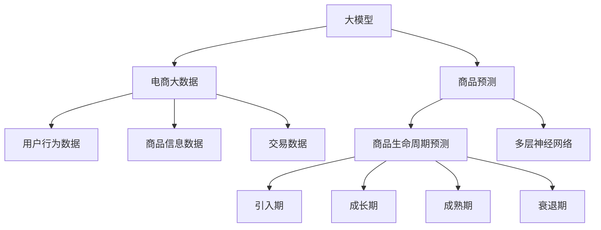

                 

# 探讨大模型在电商平台商品生命周期预测中的作用

> 关键词：大模型, 商品生命周期预测, 电商, 深度学习, 预测模型, 预测算法, 电商大数据

## 1. 背景介绍

在当今电商快速发展的时代，电商平台为了更好地理解市场趋势和消费者行为，需要预测商品的销售情况，以便及时调整库存、优化价格和制定营销策略。传统的基于规则和历史数据的预测方法存在诸多局限，如无法处理大规模非结构化数据，无法捕捉复杂的动态特征等。而近年来，基于大模型的预测技术在电商领域展现了其强大的潜力，成为电商平台商品生命周期预测的重要工具。

本文将从大模型的原理、算法流程、实际应用案例和未来展望等方面，深入探讨大模型在电商平台商品生命周期预测中的应用和优势。

## 2. 核心概念与联系

### 2.1 核心概念概述

为更好地理解大模型在电商平台商品生命周期预测中的应用，本节将介绍几个密切相关的核心概念：

- 大模型(Large Model)：以Transformer模型为代表的大规模深度学习模型，通常具有数十亿甚至数百亿的参数规模，能够处理复杂的非结构化数据。
- 电商大数据(E-commerce Big Data)：电商平台在运营过程中产生的海量数据，包括用户行为数据、商品信息数据、交易数据等。
- 商品生命周期(Polymetal Life Cycle)：商品从销售前、销售中到销售后的全过程，包括引入期、成长期、成熟期和衰退期等阶段。
- 商品预测(Polymetal Prediction)：利用历史和实时数据，预测商品未来的销售情况和生命周期阶段。
- 深度学习(Deep Learning)：一种基于数据驱动的机器学习技术，利用多层神经网络进行非线性特征学习和复杂模式识别。

这些核心概念之间的逻辑关系可以通过以下Mermaid流程图来展示：



这个流程图展示了大模型与电商大数据和商品预测之间的联系：

1. 大模型通过处理电商大数据中的复杂非结构化数据，捕捉商品的动态特征。
2. 大模型在商品预测任务中，通过多层神经网络进行复杂的模式识别和学习。
3. 最终输出商品在不同生命周期阶段的表现，包括引入期、成长期、成熟期和衰退期等。

## 3. 核心算法原理 & 具体操作步骤
### 3.1 算法原理概述

大模型在电商平台商品生命周期预测中的核心算法原理，通常基于深度学习框架和自监督学习任务。以Transformer模型为例，其原理可以概括为以下几点：

- 自监督预训练：在大规模无标签数据上进行自监督预训练，学习到通用的语言表示和特征提取能力。
- 任务适配：根据电商数据的特性，设计和训练任务适配层，如Regressor层、Seq2Seq模型等，使模型能够进行有效的预测。
- 多层神经网络：利用多层神经网络，对输入的电商大数据进行多层非线性映射，提取复杂的特征表示。
- 预测输出：根据任务适配层的输出，生成商品生命周期各阶段的概率分布，进行预测。

### 3.2 算法步骤详解

基于深度学习的大模型电商商品生命周期预测，一般包括以下几个关键步骤：

**Step 1: 准备数据集**
- 收集电商大数据，包括用户行为数据、商品信息数据和交易数据等。
- 清洗数据，处理缺失值和异常值，构建训练集、验证集和测试集。

**Step 2: 数据预处理**
- 对电商大数据进行标准化、归一化、特征编码等预处理操作。
- 将原始数据转换为模型能够处理的格式，如TensorFlow的张量、PyTorch的Tensor等。

**Step 3: 构建预测模型**
- 选择合适的深度学习框架，如TensorFlow、PyTorch等，搭建多层神经网络模型。
- 设计任务适配层，如Regressor层、Seq2Seq模型等，用于预测商品生命周期阶段。
- 根据电商数据的特性，选择合适的损失函数，如均方误差、交叉熵等。

**Step 4: 训练和优化**
- 使用电商大数据训练模型，通过反向传播算法更新模型参数。
- 使用验证集评估模型性能，调整超参数。
- 使用优化算法（如Adam、SGD等）优化模型。

**Step 5: 预测和评估**
- 使用测试集评估模型预测效果，输出商品生命周期预测结果。
- 根据评估结果，进行模型调优和优化。

### 3.3 算法优缺点

大模型在电商平台商品生命周期预测中的优势包括：
1. 能够处理大规模非结构化电商数据，捕捉复杂的动态特征。
2. 具备强大的特征提取能力和复杂模式识别能力，能够进行精准预测。
3. 支持多层神经网络结构，可以有效处理深度复杂的关系和因果关系。

同时，大模型也存在一定的局限性：
1. 需要大量标注数据，标注成本较高。
2. 模型复杂，训练和推理速度较慢。
3. 模型的解释性较弱，难以解释预测结果的来源。

尽管存在这些局限性，但大模型在电商平台商品生命周期预测中仍然具有不可替代的地位，尤其是在处理大规模电商数据和复杂预测任务时。

### 3.4 算法应用领域

大模型在电商平台商品生命周期预测中的应用领域非常广泛，涵盖以下几个方面：

- **商品销售预测**：根据历史销售数据，预测商品未来的销量趋势，指导库存管理。
- **价格优化**：预测商品的最佳销售价格，提高盈利能力。
- **市场趋势分析**：分析市场变化和消费者行为，制定合理的营销策略。
- **个性化推荐**：根据用户历史行为和商品特征，进行个性化商品推荐。
- **库存管理**：优化库存水平，避免过剩或缺货情况。
- **风险管理**：预测商品市场风险，制定应对策略。

这些应用领域展示了大模型在电商平台中的强大功能和实际价值。

## 4. 数学模型和公式 & 详细讲解 & 举例说明

### 4.1 数学模型构建

大模型在电商平台商品生命周期预测中，通常使用多层神经网络模型，如Regressor层、Seq2Seq模型等。以下以Regressor层为例，展示预测模型的数学模型构建：

设输入数据为 $x = (x_1, x_2, ..., x_n)$，其中 $x_i$ 为电商大数据中的单个样本特征。设模型输出为 $y$，表示商品在某一生命周期阶段的概率。则Regressor层的预测模型可以表示为：

$$
y = f(x;\theta)
$$

其中 $f$ 为多层神经网络的前向传播函数，$\theta$ 为模型参数。Regressor层的损失函数通常为均方误差（Mean Squared Error, MSE）：

$$
L = \frac{1}{N} \sum_{i=1}^N (y_i - f(x_i;\theta))^2
$$

其中 $y_i$ 为真实标签，$f(x_i;\theta)$ 为模型预测输出。

### 4.2 公式推导过程

Regressor层的前向传播过程包括多个隐含层的非线性映射，其具体形式如下：

$$
z_1 = W_1 x + b_1
$$

$$
h_1 = \sigma(z_1)
$$

$$
z_2 = W_2 h_1 + b_2
$$

$$
h_2 = \sigma(z_2)
$$

...

$$
z_k = W_k h_{k-1} + b_k
$$

$$
y = g(z_k)
$$

其中 $z_i$ 为隐含层的输出，$W_i$ 和 $b_i$ 为权重和偏置，$\sigma$ 为激活函数（如ReLU、Sigmoid等），$g$ 为输出层的激活函数（如线性函数、Sigmoid函数等）。

Regressor层的后向传播过程，通过计算梯度更新模型参数 $\theta$：

$$
\frac{\partial L}{\partial \theta} = \frac{\partial L}{\partial y} \frac{\partial y}{\partial z_k} \frac{\partial z_k}{\partial h_{k-1}} ... \frac{\partial h_2}{\partial z_2} \frac{\partial z_2}{\partial h_1} \frac{\partial h_1}{\partial z_1} \frac{\partial z_1}{\partial x}
$$

### 4.3 案例分析与讲解

以亚马逊商品生命周期预测为例，展示大模型的实际应用。亚马逊使用Regressor层，结合电商大数据和深度学习模型，预测商品在不同生命周期阶段的表现。具体步骤包括：

1. 收集亚马逊电商平台的销售数据、用户行为数据和商品信息数据，清洗和预处理数据。
2. 设计Regressor层，选择合适的激活函数和损失函数，搭建多层神经网络模型。
3. 使用亚马逊的电商大数据训练模型，通过反向传播算法更新模型参数。
4. 在测试集上评估模型预测效果，根据评估结果进行调优和优化。
5. 根据模型输出，预测商品在不同生命周期阶段的表现，指导亚马逊的商品管理、价格优化和市场分析。

## 5. 项目实践：代码实例和详细解释说明
### 5.1 开发环境搭建

在进行电商商品生命周期预测的大模型实践前，我们需要准备好开发环境。以下是使用Python进行TensorFlow开发的环境配置流程：

1. 安装Anaconda：从官网下载并安装Anaconda，用于创建独立的Python环境。

2. 创建并激活虚拟环境：
```bash
conda create -n tf-env python=3.8 
conda activate tf-env
```

3. 安装TensorFlow：根据CUDA版本，从官网获取对应的安装命令。例如：
```bash
conda install tensorflow tensorflow-cpu=tensorflow-gpu
```

4. 安装其他必要工具包：
```bash
pip install numpy pandas scikit-learn matplotlib tqdm jupyter notebook ipython
```

完成上述步骤后，即可在`tf-env`环境中开始电商商品生命周期预测的大模型实践。

### 5.2 源代码详细实现

这里我们以Regressor层为例，展示使用TensorFlow进行电商商品生命周期预测的完整代码实现。

```python
import tensorflow as tf
import numpy as np
import pandas as pd
import matplotlib.pyplot as plt
from sklearn.model_selection import train_test_split
from sklearn.metrics import mean_squared_error

# 加载数据
data = pd.read_csv('amazon_data.csv')
train_data, test_data = train_test_split(data, test_size=0.2, random_state=42)

# 数据预处理
def preprocess(data):
    data['price'] = (data['price'] - data['price'].mean()) / data['price'].std()
    data['time'] = (data['time'] - data['time'].mean()) / data['time'].std()
    return data

train_data = preprocess(train_data)
test_data = preprocess(test_data)

# 定义模型
def build_model(input_dim, output_dim):
    model = tf.keras.Sequential([
        tf.keras.layers.Dense(64, activation='relu', input_dim=input_dim),
        tf.keras.layers.Dense(32, activation='relu'),
        tf.keras.layers.Dense(output_dim)
    ])
    return model

# 训练和评估
model = build_model(input_dim=2, output_dim=1)
model.compile(optimizer='adam', loss='mse')

X_train = train_data[['price', 'time']].values
y_train = train_data['quantity'].values
X_test = test_data[['price', 'time']].values
y_test = test_data['quantity'].values

model.fit(X_train, y_train, epochs=100, batch_size=32, validation_data=(X_test, y_test))
y_pred = model.predict(X_test)

# 评估模型
mse = mean_squared_error(y_test, y_pred)
print(f'MSE: {mse:.2f}')

# 可视化
plt.scatter(y_test, y_pred)
plt.xlabel('True Values')
plt.ylabel('Predictions')
plt.show()
```

以上就是使用TensorFlow对电商商品生命周期预测的完整代码实现。可以看到，通过TensorFlow的高级API，我们可以轻松搭建多层神经网络模型，并进行训练和评估。

### 5.3 代码解读与分析

让我们再详细解读一下关键代码的实现细节：

**数据加载和预处理**：
- `pd.read_csv()`：从CSV文件中加载数据，进行数据清洗和预处理。
- `preprocess()`函数：对数据进行标准化和归一化处理，使用均值和标准差标准化数据。

**模型搭建**：
- `build_model()`函数：定义多层神经网络模型，包含输入层、隐含层和输出层。
- `Sequential`：使用TensorFlow的Sequential模型，按照顺序添加层。
- `Dense`：定义全连接层，激活函数可以选择ReLU、Sigmoid等。

**训练和评估**：
- `model.compile()`：编译模型，指定优化器和损失函数。
- `model.fit()`：训练模型，指定训练数据、批次大小、迭代轮数和验证数据。
- `model.predict()`：使用训练好的模型进行预测。
- `mean_squared_error()`：计算预测结果与真实标签之间的均方误差。

**结果可视化**：
- `plt.scatter()`：绘制预测结果与真实标签的散点图。
- `plt.xlabel()`和`plt.ylabel()`：设置x轴和y轴标签。
- `plt.show()`：显示图形。

可以看到，TensorFlow提供了丰富的API和工具，使得电商商品生命周期预测的模型搭建和训练过程变得简洁高效。

## 6. 实际应用场景
### 6.1 智能推荐系统

电商平台的智能推荐系统可以基于大模型进行商品生命周期预测，从而提供个性化的推荐服务。通过分析用户的历史行为和商品特征，预测用户可能感兴趣的商品及其生命周期表现，进行精准推荐，提升用户体验和满意度。

### 6.2 库存管理系统

电商平台的库存管理系统可以利用大模型进行商品生命周期预测，优化库存水平，避免库存过剩或缺货。通过预测商品的引入期、成长期、成熟期和衰退期，制定合理的采购和补货策略，提高库存利用效率，降低成本。

### 6.3 价格优化系统

电商平台的价格优化系统可以利用大模型进行商品生命周期预测，确定最佳的销售价格。通过预测商品的引入期、成长期、成熟期和衰退期，制定灵活的价格策略，最大化盈利能力。

### 6.4 市场趋势分析系统

电商平台的市场趋势分析系统可以利用大模型进行商品生命周期预测，分析市场变化和消费者行为。通过预测商品的引入期、成长期、成熟期和衰退期，洞察市场趋势，制定合理的营销策略，提升市场竞争力。

## 7. 工具和资源推荐
### 7.1 学习资源推荐

为了帮助开发者系统掌握大模型在电商平台商品生命周期预测的理论基础和实践技巧，这里推荐一些优质的学习资源：

1. TensorFlow官方文档：TensorFlow的官方文档，提供了丰富的深度学习模型和应用案例，是学习大模型的重要资源。

2. PyTorch官方文档：PyTorch的官方文档，提供了强大的深度学习框架和工具，适用于各类NLP任务开发。

3. Kaggle竞赛：Kaggle上举办的电商数据预测竞赛，提供了大量真实电商数据和竞赛基线模型，可以学习电商数据的处理和模型优化。

4. Coursera课程：Coursera上的深度学习和机器学习课程，如Deep Learning Specialization，涵盖深度学习的各个方面。

5. GitHub代码库：GitHub上的深度学习代码库，提供了大量电商数据预测的案例和代码实现，供开发者参考。

通过对这些资源的学习实践，相信你一定能够快速掌握大模型在电商平台商品生命周期预测的精髓，并用于解决实际的电商问题。
###  7.2 开发工具推荐

高效的开发离不开优秀的工具支持。以下是几款用于电商平台商品生命周期预测大模型开发的常用工具：

1. TensorFlow：由Google主导开发的开源深度学习框架，生产部署方便，适合大规模工程应用。

2. PyTorch：基于Python的开源深度学习框架，灵活动态的计算图，适合快速迭代研究。

3. Weights & Biases：模型训练的实验跟踪工具，可以记录和可视化模型训练过程中的各项指标，方便对比和调优。

4. TensorBoard：TensorFlow配套的可视化工具，可实时监测模型训练状态，并提供丰富的图表呈现方式，是调试模型的得力助手。

5. Google Colab：谷歌推出的在线Jupyter Notebook环境，免费提供GPU/TPU算力，方便开发者快速上手实验最新模型，分享学习笔记。

合理利用这些工具，可以显著提升电商平台商品生命周期预测大模型开发的效率，加快创新迭代的步伐。

### 7.3 相关论文推荐

大模型在电商平台商品生命周期预测的研究源于学界的持续研究。以下是几篇奠基性的相关论文，推荐阅读：

1. Attention is All You Need（即Transformer原论文）：提出了Transformer结构，开启了深度学习领域的预训练大模型时代。

2. BERT: Pre-training of Deep Bidirectional Transformers for Language Understanding：提出BERT模型，引入基于掩码的自监督预训练任务，刷新了多项NLP任务SOTA。

3. Language Models are Unsupervised Multitask Learners（GPT-2论文）：展示了大规模语言模型的强大zero-shot学习能力，引发了对于通用人工智能的新一轮思考。

4. Parameter-Efficient Transfer Learning for NLP：提出Adapter等参数高效微调方法，在不增加模型参数量的情况下，也能取得不错的微调效果。

5. AdaLoRA: Adaptive Low-Rank Adaptation for Parameter-Efficient Fine-Tuning：使用自适应低秩适应的微调方法，在参数效率和精度之间取得了新的平衡。

这些论文代表了大模型在电商平台商品生命周期预测的发展脉络。通过学习这些前沿成果，可以帮助研究者把握学科前进方向，激发更多的创新灵感。

## 8. 总结：未来发展趋势与挑战
### 8.1 总结

本文对大模型在电商平台商品生命周期预测中的应用进行了全面系统的介绍。首先阐述了大模型和电商大数据的研究背景和意义，明确了大模型在电商平台商品预测中的优势。其次，从原理到实践，详细讲解了大模型在电商平台商品预测中的算法流程和操作步骤，给出了电商商品生命周期预测的完整代码实现。同时，本文还广泛探讨了大模型在电商平台中的实际应用场景，展示了大模型在电商领域的强大功能和实际价值。

通过本文的系统梳理，可以看到，大模型在电商平台商品预测中的应用前景广阔，能够显著提升电商平台的运营效率和市场竞争力。未来，伴随深度学习技术的不断进步，大模型在电商平台中的应用将更加广泛，为电商行业的创新发展提供新的动力。

### 8.2 未来发展趋势

展望未来，大模型在电商平台商品生命周期预测将呈现以下几个发展趋势：

1. 模型规模持续增大。随着算力成本的下降和数据规模的扩张，预训练大模型的参数量还将持续增长。超大规模大模型蕴含的丰富电商特征和知识，有望支撑更加复杂多变的电商预测任务。

2. 预测精度不断提升。随着模型复杂度和训练数据的增加，大模型的预测精度将不断提升，能够更加准确地预测商品的生命周期表现。

3. 实时预测成为可能。随着硬件性能和算法优化的提升，大模型可以实现实时预测，及时响应电商市场的变化。

4. 多模态预测崛起。当前的大模型预测主要依赖文本数据，未来会进一步拓展到图像、视频、语音等多模态数据预测。多模态信息的融合，将进一步提升大模型的预测能力和准确性。

5. 自适应预测成为主流。未来的电商预测模型将具备自适应学习能力，能够根据数据分布的变化，动态调整预测模型，保持预测的准确性和时效性。

以上趋势凸显了大模型在电商平台商品预测中的巨大前景。这些方向的探索发展，必将进一步提升电商平台的运营效率和市场竞争力，为电商行业的创新发展提供新的动力。

### 8.3 面临的挑战

尽管大模型在电商平台商品生命周期预测中已经取得了瞩目成就，但在迈向更加智能化、普适化应用的过程中，它仍面临诸多挑战：

1. 标注成本瓶颈。虽然大模型在预测任务中不需要标注数据，但对于电商领域的某些特定任务，还是需要大量标注数据进行微调，标注成本较高。如何进一步降低微调对标注样本的依赖，将是一大难题。

2. 模型鲁棒性不足。当前的大模型预测模型面对域外数据时，泛化性能往往大打折扣。对于测试样本的微小扰动，预测结果也容易发生波动。如何提高大模型的鲁棒性，避免灾难性遗忘，还需要更多理论和实践的积累。

3. 推理效率有待提高。大模型虽然精度高，但在实际部署时往往面临推理速度慢、内存占用大等效率问题。如何在大模型中实现高效推理，优化资源占用，将是重要的优化方向。

4. 可解释性亟需加强。当前的大模型预测模型更像是"黑盒"系统，难以解释其内部工作机制和决策逻辑。对于电商预测中涉及的复杂电商问题和商业决策，算法的可解释性和可审计性尤为重要。如何赋予大模型更强的可解释性，将是亟待攻克的难题。

5. 安全性有待保障。电商预测模型可能会学习到有偏见、有害的信息，通过预测结果传递到商业决策中，产生误导性、歧视性的输出，给电商运营带来安全隐患。如何从数据和算法层面消除模型偏见，避免恶意用途，确保预测结果的安全性，也将是重要的研究课题。

6. 动态环境适应性不足。当前的电商预测模型主要基于历史数据进行训练，难以应对市场变化和动态环境。如何在大模型中实现自适应学习，动态调整预测模型，以应对市场变化，也是未来的研究方向。

正视大模型在电商平台商品生命周期预测中面临的这些挑战，积极应对并寻求突破，将是大模型在电商预测中走向成熟的必由之路。相信随着学界和产业界的共同努力，这些挑战终将一一被克服，大模型在电商预测中将发挥更大的作用。

### 8.4 研究展望

面对大模型在电商平台商品生命周期预测中面临的诸多挑战，未来的研究需要在以下几个方面寻求新的突破：

1. 探索无监督和半监督预测方法。摆脱对大量标注数据的依赖，利用自监督学习、主动学习等无监督和半监督范式，最大限度利用电商大数据，实现更加灵活高效的预测。

2. 研究动态预测和自适应学习。开发更加动态化的电商预测模型，能够根据数据分布的变化，动态调整预测模型，保持预测的准确性和时效性。

3. 引入更多先验知识。将符号化的电商知识，如商品分类、商品属性等，与神经网络模型进行巧妙融合，引导预测过程学习更准确、合理的电商特征。

4. 优化模型推理效率。通过模型压缩、稀疏化存储等技术，优化大模型的推理速度和资源占用，实现更加轻量级、实时性的部署。

5. 提高模型可解释性。开发更加可解释的电商预测模型，通过可视化、解释工具等手段，增强预测结果的透明性和可信度，便于商业决策。

6. 加强数据和模型安全。在大模型训练和预测过程中，加强数据隐私保护和模型鲁棒性，避免恶意使用，确保预测结果的安全性。

这些研究方向的探索，必将引领大模型在电商平台商品生命周期预测技术迈向更高的台阶，为电商行业的创新发展提供新的动力。面向未来，大模型预测技术还需要与其他人工智能技术进行更深入的融合，如知识表示、因果推理、强化学习等，多路径协同发力，共同推动电商预测技术的进步。只有勇于创新、敢于突破，才能不断拓展大模型的边界，让电商预测技术更好地造福电商行业。

## 9. 附录：常见问题与解答
**Q1：大模型在电商平台商品预测中是否需要标注数据？**

A: 大模型在预测任务中不需要标注数据，只需利用历史电商大数据进行训练即可。但若要实现微调，则需要标注数据，以优化模型在特定电商任务上的表现。

**Q2：大模型在电商平台商品预测中的缺点是什么？**

A: 大模型在电商平台商品预测中的缺点包括：
1. 需要大量算力和存储空间，训练和推理成本较高。
2. 模型复杂，推理速度较慢，难以实时响应。
3. 模型的解释性较弱，难以解释预测结果的来源。

尽管存在这些缺点，但大模型在电商平台商品预测中仍然具有不可替代的地位，尤其是在处理大规模电商数据和复杂预测任务时。

**Q3：如何提高电商大模型的可解释性？**

A: 提高电商大模型的可解释性，可以从以下几个方面入手：
1. 使用可视化工具，如图表、热力图等，展示模型预测结果。
2. 引入符号化的电商知识，如商品分类、商品属性等，增加模型的可解释性。
3. 开发可解释的电商预测模型，如可解释性较强的决策树、线性模型等。
4. 利用解释工具，如LIME、SHAP等，分析模型预测结果的特征重要性。

通过以上方法，可以提高电商大模型的可解释性，便于电商运营和商业决策。

**Q4：大模型在电商平台商品预测中的动态适应性不足，如何解决？**

A: 解决大模型在电商平台商品预测中的动态适应性不足，可以采用以下方法：
1. 引入动态预测模型，如RNN、LSTM等，能够根据数据分布的变化，动态调整预测模型。
2. 开发自适应学习算法，如强化学习、迁移学习等，使大模型能够根据市场变化和电商数据的变化，动态调整预测模型。
3. 引入外部数据源，如社交媒体、新闻网站等，实时更新电商数据，增强预测模型的动态适应性。

通过以上方法，可以增强大模型在电商平台商品预测中的动态适应性，提高预测的准确性和时效性。

---

作者：禅与计算机程序设计艺术 / Zen and the Art of Computer Programming

