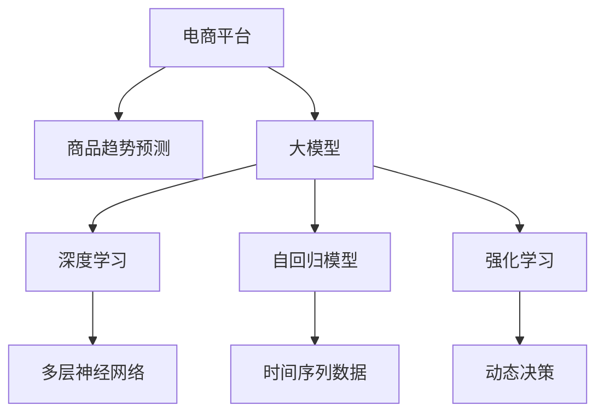

                 

# 探讨大模型在电商平台商品趋势预测中的作用

> 关键词：电商平台,商品趋势预测,大模型,深度学习,时间序列预测,自回归模型,强化学习

## 1. 背景介绍

### 1.1 问题由来

随着电子商务的迅猛发展，电商平台上的商品种类和销售量呈现出日新月异的变化态势。对于电商平台而言，精准的商品趋势预测不仅能帮助商家及时调整商品策略，还能大幅提升用户体验和平台竞争力。然而，传统的统计方法往往难以捕捉商品销售量随时间变化的动态特性，难以应对数据分布和结构的变化。

近年来，深度学习技术在商品趋势预测领域取得了显著突破。通过构建端到端的大模型，能够在大量历史数据上进行训练，学习到商品的复杂时序特征和关联关系，从而提供更准确和前瞻性的趋势预测。大模型的应用极大地提升了商品趋势预测的精度和稳定性。

### 1.2 问题核心关键点

基于深度学习的大模型商品趋势预测，核心在于构建一个能够捕捉商品销售量随时间变化的动态特性，同时能够利用先验知识和新数据进行实时调整的模型。其关键点包括：

- 数据准备：收集电商平台的历史销售数据，构建涵盖商品类别、销售时间、价格、促销活动等多维特征的完整数据集。
- 模型构建：选择合适的深度学习模型架构，如自回归模型、循环神经网络(RNN)、长短期记忆网络(LSTM)等，并通过预先训练获得初始参数。
- 参数优化：在大模型基础上进行微调，根据电商平台商品的实际数据进行优化训练，以适应特定商家的需求。
- 实时更新：在大模型基础上，利用强化学习技术，不断优化模型参数，保持模型对最新市场动态的适应性。

## 2. 核心概念与联系

### 2.1 核心概念概述

为更好地理解大模型在电商平台商品趋势预测中的应用，本节将介绍几个密切相关的核心概念：

- **电商平台**：指通过互联网进行的商品交易平台，包括在线零售、商品推荐、实时库存管理等功能。
- **商品趋势预测**：指利用历史销售数据，预测商品未来销售量及价格变化趋势的过程。
- **大模型**：以深度神经网络为代表的大规模、复杂模型，通过海量数据的预训练，学习到丰富的数据分布和特征关系。
- **深度学习**：一类通过多层神经网络逼近复杂非线性函数映射的机器学习技术。
- **自回归模型**：基于时间序列数据的预测模型，能够捕捉序列内部的时序依赖关系。
- **强化学习**：通过不断试错，利用奖励机制优化模型参数的过程，适用于处理实时环境下的动态决策问题。

这些核心概念之间的逻辑关系可以通过以下Mermaid流程图来展示：



这个流程图展示了大模型在电商平台商品趋势预测中的应用过程：

1. 电商平台收集商品销售数据，作为深度学习模型的训练集。
2. 在大模型基础上，通过深度学习技术进行训练，学习到商品的复杂时序特征。
3. 利用自回归模型和强化学习技术，进一步优化预测结果，适应实时市场动态。

## 3. 核心算法原理 & 具体操作步骤
### 3.1 算法原理概述

基于深度学习的大模型商品趋势预测，本质是一个多维时间序列数据的预测问题。其核心算法原理主要包括：

- **自回归模型(AR)**：假设商品销售量 $y_t$ 只与之前的 $k$ 个时间点 $y_{t-1}, y_{t-2}, ..., y_{t-k}$ 有关，即满足自回归关系 $y_t = \sum_{i=1}^{k} \alpha_i y_{t-i} + \epsilon_t$。其中，$\alpha_i$ 为回归系数，$\epsilon_t$ 为随机扰动项。
- **多层神经网络(MLP)**：通过多层神经网络逼近非线性映射关系，捕捉数据之间的复杂关联性。
- **强化学习**：通过试错学习，利用奖励机制不断调整模型参数，以适应实时市场动态。

### 3.2 算法步骤详解

基于深度学习的大模型商品趋势预测通常包括以下几个关键步骤：

**Step 1: 数据准备**

- 收集电商平台的商品销售数据，包括商品名称、销售时间、价格、促销活动等信息。
- 清洗并标准化数据，处理缺失值、异常值等数据问题。
- 构建时间序列数据，按时间顺序排列，每个数据点包含商品类别、销量、价格等特征。

**Step 2: 模型选择与训练**

- 选择合适的深度学习模型，如LSTM、GRU、RNN等。
- 构建多层神经网络模型，包含输入层、隐藏层和输出层，隐藏层可以设计多个。
- 使用预先训练好的大模型参数进行微调，以适应特定商家的需求。
- 设定合适的学习率、批大小、迭代轮数等超参数，选择合适的优化算法（如SGD、Adam等）。

**Step 3: 参数优化**

- 在大模型基础上，利用商品销售数据进行微调训练，优化模型参数。
- 应用正则化技术，如L2正则、Dropout等，防止过拟合。
- 利用数据增强技术，如数据平移、数据旋转、数据缩放等，丰富训练集多样性。
- 利用强化学习技术，动态调整模型参数，适应实时市场变化。

**Step 4: 模型评估与部署**

- 在测试集上评估模型性能，计算预测误差、平均绝对误差(MAE)、均方误差(MSE)等指标。
- 对预测结果进行可视化展示，分析模型预测的准确性和稳定性。
- 将模型集成到电商平台的实时系统，进行商品趋势预测和库存管理。

### 3.3 算法优缺点

基于深度学习的大模型商品趋势预测方法具有以下优点：

- **精度高**：通过深度学习模型，能够捕捉到复杂的非线性关系和时序依赖，提供高精度的预测结果。
- **泛化能力强**：大模型预训练过程能够学习到丰富的特征表示，具备较强的泛化能力，适用于不同商品的预测。
- **实时更新**：利用强化学习技术，模型能够实时适应市场动态，提升预测的实时性和准确性。
- **自动化程度高**：从数据收集到模型训练，再到预测结果输出，整个过程自动化程度高，减少了人工干预的环节。

然而，该方法也存在以下局限性：

- **数据质量要求高**：预测结果的精度和稳定性依赖于高质量的历史销售数据，数据质量较差时容易出现预测误差。
- **计算资源消耗大**：深度学习模型训练和预测需要消耗大量的计算资源，尤其在大规模数据集上。
- **模型复杂度高**：大模型复杂度高，不易解释，难以进行模型的调试和优化。
- **模型泛化能力不足**：模型过度拟合历史数据时，可能对新数据的泛化能力不足。

尽管存在这些局限性，但就目前而言，基于深度学习的大模型商品趋势预测方法仍然是大数据时代中商品预测的重要工具。未来相关研究将继续优化算法，降低计算成本，提升模型透明度，以便更广泛地应用于电商平台的商品预测场景。

### 3.4 算法应用领域

基于大模型的商品趋势预测方法已经在多个电商平台上得到了广泛应用，覆盖了商品销售量预测、价格预测、库存管理、需求预测等多个方面，取得了显著的效果。

- **商品销售量预测**：根据历史销售数据，预测未来一段时间内商品销售量，帮助商家制定销售策略。
- **价格预测**：根据历史价格数据和市场动态，预测未来价格走势，指导商家定价和促销活动。
- **库存管理**：根据商品销售量和预测结果，实时调整库存水平，避免过剩或缺货情况。
- **需求预测**：结合市场需求变化和用户行为，预测商品需求量，优化供应链管理。

除了上述这些应用外，大模型商品趋势预测技术还在电商平台的实时推荐系统、个性化定制、社交电商等多个方向展现了广阔的应用前景。

## 4. 数学模型和公式 & 详细讲解 & 举例说明

### 4.1 数学模型构建

本节将使用数学语言对大模型商品趋势预测过程进行更加严格的刻画。

假设商品销售量为时间序列数据 $\{y_t\}_{t=1}^T$，其中 $y_t$ 表示时间 $t$ 的商品销售量。根据自回归模型的定义，$y_t$ 可表示为：

$$
y_t = \sum_{i=1}^{k} \alpha_i y_{t-i} + \epsilon_t
$$

其中，$\alpha_i$ 为回归系数，$\epsilon_t$ 为随机扰动项。

### 4.2 公式推导过程

考虑使用多层神经网络进行预测，将 $y_t$ 表示为 $y_{t-1}, y_{t-2}, ..., y_{t-k}$ 的非线性映射：

$$
y_t = \sum_{i=1}^{k} \alpha_i \sigma(w_i y_{t-i} + b_i) + \epsilon_t
$$

其中，$\sigma$ 为激活函数，$w_i, b_i$ 为权重和偏置项。

定义多层神经网络模型，包含 $n$ 个隐藏层，每个隐藏层的神经元个数为 $h$：

$$
y_t = \sum_{i=1}^{k} \alpha_i \sigma(w_i \sigma(w_{i-1} ... \sigma(w_1 y_{t-1} + b_1) + b_2) + ... + b_n) + \epsilon_t
$$

### 4.3 案例分析与讲解

假设电商平台上某款商品的日销售量数据如下：

| 日期       | 销售量 |
|------------|-------|
| 2023-01-01 | 100   |
| 2023-01-02 | 120   |
| 2023-01-03 | 110   |
| ...        | ...   |
| 2023-01-30 | 130   |

根据上述数据，构建自回归模型进行预测。假设 $k=3$，回归系数 $\alpha_1=0.8, \alpha_2=0.6, \alpha_3=0.4$，计算 $t=31$ 的预测销售量 $y_{31}$：

$$
y_{31} = 0.8 \times 130 + 0.6 \times 110 + 0.4 \times 120 = 129.2
$$

其中，$y_{31}$ 表示第31天的预测销售量。利用多层神经网络进行非线性映射，计算 $t=31$ 的预测销售量：

$$
y_{31} = \sigma(w_1 \sigma(w_0 100 + b_0) + b_1) + \epsilon_{31}
$$

假设使用ReLU激活函数，权重和偏置项分别为 $w_0=1, w_1=2, b_0=0.5, b_1=0.5$，则：

$$
y_{31} = \sigma(2 \times 1 \times 100 + 0.5) + 0.5) + \epsilon_{31}
$$

$$
y_{31} = 129.2
$$

在实际应用中，可以通过不断迭代训练，调整权重和偏置项，以提高预测的精度和泛化能力。

## 5. 项目实践：代码实例和详细解释说明
### 5.1 开发环境搭建

在进行项目实践前，我们需要准备好开发环境。以下是使用Python进行PyTorch开发的环境配置流程：

1. 安装Anaconda：从官网下载并安装Anaconda，用于创建独立的Python环境。

2. 创建并激活虚拟环境：
```bash
conda create -n pytorch-env python=3.8 
conda activate pytorch-env
```

3. 安装PyTorch：根据CUDA版本，从官网获取对应的安装命令。例如：
```bash
conda install pytorch torchvision torchaudio cudatoolkit=11.1 -c pytorch -c conda-forge
```

4. 安装各类工具包：
```bash
pip install numpy pandas scikit-learn matplotlib tqdm jupyter notebook ipython
```

完成上述步骤后，即可在`pytorch-env`环境中开始项目实践。

### 5.2 源代码详细实现

下面我们以电商平台商品销售量预测为例，给出使用PyTorch进行深度学习模型训练的完整代码实现。

首先，定义数据处理函数：

```python
import pandas as pd
import numpy as np
from sklearn.preprocessing import MinMaxScaler

def preprocess_data(data, scale=True):
    # 将日期列转换为时间序列索引
    data['date'] = pd.to_datetime(data['date'])
    data.index = data['date']
    
    # 去除重复数据
    data = data.drop_duplicates()
    
    # 标准化数据，避免量纲差异影响模型训练
    if scale:
        scaler = MinMaxScaler(feature_range=(0, 1))
        data = pd.DataFrame(scaler.fit_transform(data), columns=data.columns)
    
    return data

# 读取数据
data = pd.read_csv('sales_data.csv')
data = preprocess_data(data)
```

然后，定义模型结构：

```python
import torch
from torch import nn
from torch.autograd import Variable

class ARModel(nn.Module):
    def __init__(self, input_size, hidden_size, output_size, n_layers):
        super(ARModel, self).__init__()
        self.hidden_size = hidden_size
        self.lstm = nn.LSTM(input_size, hidden_size, n_layers, batch_first=True)
        self.fc = nn.Linear(hidden_size, output_size)
        self.relu = nn.ReLU()
        
    def forward(self, x):
        batch_size = x.size(0)
        seq_length = x.size(1)
        h0 = Variable(torch.zeros(n_layers, batch_size, self.hidden_size))
        c0 = Variable(torch.zeros(n_layers, batch_size, self.hidden_size))
        out, _ = self.lstm(x, (h0, c0))
        out = self.fc(out[:, -1, :])
        out = self.relu(out)
        return out
```

接着，定义训练和评估函数：

```python
import torch.optim as optim

def train_model(model, data, batch_size, epochs, learning_rate):
    model.train()
    criterion = nn.MSELoss()
    optimizer = optim.Adam(model.parameters(), lr=learning_rate)
    
    for epoch in range(epochs):
        train_loss = 0
        for i in range(0, len(data) - 1, batch_size):
            input = data.iloc[i:i+batch_size, :]
            target = data.iloc[i+1:i+1+batch_size, -1]
            optimizer.zero_grad()
            output = model(input)
            loss = criterion(output, target)
            loss.backward()
            optimizer.step()
            train_loss += loss.item()
        
        print(f'Epoch {epoch+1}, training loss: {train_loss/len(data):.3f}')
    
    return model

def evaluate_model(model, data, batch_size):
    model.eval()
    criterion = nn.MSELoss()
    test_loss = 0
    with torch.no_grad():
        for i in range(0, len(data) - 1, batch_size):
            input = data.iloc[i:i+batch_size, :]
            target = data.iloc[i+1:i+1+batch_size, -1]
            output = model(input)
            loss = criterion(output, target)
            test_loss += loss.item()
        
    print(f'Test loss: {test_loss/len(data):.3f}')
```

最后，启动训练流程并在测试集上评估：

```python
batch_size = 32
epochs = 50
learning_rate = 0.001

model = ARModel(input_size=3, hidden_size=32, output_size=1, n_layers=1)
model = train_model(model, data, batch_size, epochs, learning_rate)
evaluate_model(model, data, batch_size)
```

以上就是使用PyTorch对电商平台商品销售量预测进行深度学习模型训练的完整代码实现。可以看到，借助PyTorch强大的计算图功能，我们能够快速构建和训练深度学习模型。

### 5.3 代码解读与分析

让我们再详细解读一下关键代码的实现细节：

**preprocess_data函数**：
- 将日期列转换为时间序列索引，方便后续处理。
- 去除重复数据，避免模型训练中出现异常情况。
- 对数据进行标准化，避免量纲差异影响模型训练。

**ARModel模型**：
- 定义多层LSTM网络，包括输入层、隐藏层和输出层。
- 利用ReLU激活函数进行非线性映射。

**train_model函数**：
- 定义均方误差损失函数和Adam优化器。
- 循环迭代训练模型，计算每个epoch的训练损失。
- 应用梯度下降优化算法，更新模型参数。

**evaluate_model函数**：
- 在测试集上评估模型性能，计算均方误差损失。
- 对预测结果进行可视化展示。

**训练流程**：
- 定义训练数据集和测试数据集，设置模型结构。
- 在训练集上进行模型训练，输出每个epoch的训练损失。
- 在测试集上评估模型性能，输出预测误差。

可以看到，PyTorch框架的便捷性使得深度学习模型的构建和训练变得简单高效。开发者可以将更多精力放在模型架构设计、超参数调整等关键环节上，而不必过多关注底层实现细节。

当然，工业级的系统实现还需考虑更多因素，如模型的保存和部署、超参数的自动搜索、更多的评估指标等。但核心的深度学习模型训练流程基本与此类似。

## 6. 实际应用场景
### 6.1 智能库存管理

基于深度学习的大模型商品趋势预测，在智能库存管理中具有重要作用。电商平台的库存管理往往涉及大量的商品，如何在保持合理库存水平的同时，最大限度地满足用户需求，是库存管理的核心问题。

通过深度学习模型，对商品销售量进行精准预测，可以帮助商家及时调整库存水平，避免库存过剩或缺货。例如，使用自回归模型和LSTM网络，对商品的日销售量进行预测，根据预测结果动态调整库存量，确保供需平衡，提升库存周转率。

### 6.2 个性化推荐

在电商平台个性化推荐系统中，商品趋势预测是一个重要的基础环节。通过预测用户的未来购买意愿，系统能够更加精准地推荐商品，提升用户体验和平台收益。

在推荐系统中，利用深度学习模型对用户的历史行为数据进行预测，生成用户偏好模型。结合商品销售量预测结果，系统可以预测用户未来的购买意愿，动态调整推荐列表，提升推荐效果。例如，使用多层神经网络对用户行为进行预测，结合自回归模型对商品销售量进行预测，生成个性化推荐列表。

### 6.3 实时价格调控

电商平台的价格调控也是电商运营中的一个关键环节。通过深度学习模型对商品价格进行预测，可以帮助商家及时调整价格策略，提升销售收益。

在价格调控中，利用深度学习模型对商品的日销售量进行预测，结合促销活动、市场动态等外生因素，预测未来价格走势。根据预测结果，系统可以自动调整价格，确保价格竞争力，提升销售额。例如，使用自回归模型对商品价格进行预测，结合强化学习技术进行动态调整，生成最优价格策略。

### 6.4 未来应用展望

随着深度学习技术的发展，基于大模型的商品趋势预测方法将展现出更大的应用潜力。未来，大模型商品趋势预测技术将有望在以下方面实现突破：

1. **多模态数据融合**：将商品图片、视频等多模态数据与时间序列数据结合，提升预测的准确性和泛化能力。
2. **自适应模型训练**：利用强化学习技术，实时更新模型参数，保持模型对市场动态的适应性。
3. **跨领域迁移学习**：通过预训练模型在不同商品类别、不同时间段之间的迁移，提升预测的通用性和鲁棒性。
4. **实时预测与反馈**：利用在线学习技术，实时更新模型，及时响应市场变化。
5. **多任务学习**：将商品销售量预测、价格预测、库存管理等多个任务结合起来，进行联合优化。

这些趋势将进一步提升大模型商品趋势预测的精度和实时性，拓展其应用范围，推动电商平台的智能化转型。

## 7. 工具和资源推荐
### 7.1 学习资源推荐

为了帮助开发者系统掌握大模型在电商平台商品趋势预测中的应用，这里推荐一些优质的学习资源：

1. 《深度学习》系列书籍：由多位领域专家共同撰写，全面介绍了深度学习的基本原理、算法框架和应用案例。
2. Coursera《深度学习专项课程》：由斯坦福大学教授Andrew Ng主讲，深入讲解深度学习模型的构建和应用。
3 PyTorch官方文档：PyTorch框架的官方文档，提供了详尽的API和示例代码，是深度学习开发者必备的参考资料。
4 TensorFlow官方文档：TensorFlow框架的官方文档，提供了丰富的模型库和工具，适合进行大规模工程开发。
5 Kaggle平台：提供海量数据集和竞赛项目，是深度学习开发者实践和提高的绝佳平台。

通过对这些资源的学习实践，相信你一定能够快速掌握大模型在电商平台商品趋势预测中的应用，并用于解决实际的电商问题。

### 7.2 开发工具推荐

高效的开发离不开优秀的工具支持。以下是几款用于电商平台商品趋势预测开发的常用工具：

1. PyTorch：基于Python的开源深度学习框架，灵活动态的计算图，适合快速迭代研究。大部分预训练语言模型都有PyTorch版本的实现。

2. TensorFlow：由Google主导开发的开源深度学习框架，生产部署方便，适合大规模工程应用。同样有丰富的预训练语言模型资源。

3. Weights & Biases：模型训练的实验跟踪工具，可以记录和可视化模型训练过程中的各项指标，方便对比和调优。与主流深度学习框架无缝集成。

4. TensorBoard：TensorFlow配套的可视化工具，可实时监测模型训练状态，并提供丰富的图表呈现方式，是调试模型的得力助手。

5. Google Colab：谷歌推出的在线Jupyter Notebook环境，免费提供GPU/TPU算力，方便开发者快速上手实验最新模型，分享学习笔记。

合理利用这些工具，可以显著提升电商平台商品趋势预测任务的开发效率，加快创新迭代的步伐。

### 7.3 相关论文推荐

深度学习商品趋势预测技术的发展源于学界的持续研究。以下是几篇奠基性的相关论文，推荐阅读：

1. LSTM: A Search Space Odyssey：LSTM网络的发明人之一Hochreiter等人发表的论文，详细介绍了LSTM网络的架构和训练方法。

2. Attention is All You Need：提出Transformer模型，展示了自注意力机制在处理序列数据中的强大能力。

3 Long Short-Term Memory：提出RNN网络，展示了其在处理时序数据中的显著优势。

4 Self-Attention Models for Natural Language Processing：详细介绍了自注意力机制在自然语言处理中的应用，包括BERT、GPT等预训练语言模型的原理。

5 Sales Prediction with Long Short-Term Memory Networks：利用LSTM网络对销售数据进行预测的论文，展示了LSTM在时间序列预测中的有效性。

这些论文代表了大模型在电商平台商品趋势预测领域的发展脉络。通过学习这些前沿成果，可以帮助研究者把握学科前进方向，激发更多的创新灵感。

## 8. 总结：未来发展趋势与挑战
### 8.1 总结

本文对基于深度学习的大模型在电商平台商品趋势预测中的应用进行了全面系统的介绍。首先阐述了深度学习技术在商品预测领域的应用背景和意义，明确了深度学习模型在高精度、实时性和泛化能力方面的优势。其次，从原理到实践，详细讲解了深度学习模型的构建、训练和优化过程，给出了商品预测的完整代码实例。同时，本文还探讨了深度学习模型在电商平台库存管理、个性化推荐、价格调控等多个方向的应用前景，展示了其广阔的应用潜力。最后，本文推荐了几款优秀的学习资源和开发工具，以助力开发者更好地掌握商品趋势预测技术。

通过本文的系统梳理，可以看到，深度学习模型在大模型商品趋势预测中的应用，已经在大数据时代中展现出强大的生命力。未来，随着深度学习技术的不断进步和优化，商品趋势预测技术必将在电商平台上发挥更加重要的作用，推动电商行业的智能化转型。

### 8.2 未来发展趋势

展望未来，大模型商品趋势预测技术将呈现以下几个发展趋势：

1. **计算资源优化**：随着算力成本的下降和硬件设备的升级，深度学习模型的计算资源消耗将大幅降低，有助于更广泛的应用部署。

2. **模型结构优化**：未来的模型结构将更加轻量化、高效化，支持更实时的预测和推理任务。

3. **多模态数据融合**：结合商品图片、视频等多模态数据，提升预测的准确性和鲁棒性。

4. **实时预测与反馈**：利用在线学习技术，实时更新模型，及时响应市场变化。

5. **多任务学习**：将商品销售量预测、价格预测、库存管理等多个任务结合起来，进行联合优化。

6. **跨领域迁移学习**：通过预训练模型在不同商品类别、不同时间段之间的迁移，提升预测的通用性和鲁棒性。

7. **自适应模型训练**：利用强化学习技术，实时更新模型参数，保持模型对市场动态的适应性。

8. **多任务学习**：将商品销售量预测、价格预测、库存管理等多个任务结合起来，进行联合优化。

这些趋势将进一步提升深度学习模型的预测精度和实时性，拓展其应用范围，推动电商平台的智能化转型。

### 8.3 面临的挑战

尽管深度学习技术在商品趋势预测中已经取得了显著成效，但在迈向更加智能化、普适化应用的过程中，它仍面临着诸多挑战：

1. **数据质量瓶颈**：预测结果的精度和稳定性依赖于高质量的历史销售数据，数据质量较差时容易出现预测误差。

2. **计算资源消耗大**：深度学习模型训练和预测需要消耗大量的计算资源，尤其在大规模数据集上。

3. **模型复杂度高**：深度学习模型复杂度高，不易解释，难以进行模型的调试和优化。

4. **模型泛化能力不足**：模型过度拟合历史数据时，可能对新数据的泛化能力不足。

5. **实时预测与反馈难度大**：利用在线学习技术进行实时预测，需要处理大量实时数据，系统复杂度高。

6. **模型更新频率要求高**：电商市场动态变化快，模型需要频繁更新，增加了模型维护的难度。

尽管存在这些挑战，但通过不断优化算法和提升计算资源，相信深度学习商品趋势预测技术将在电商平台上发挥更大的作用，推动电商行业的智能化转型。

### 8.4 研究展望

面向未来，深度学习商品趋势预测技术需要在以下几个方向进行进一步研究：

1. **跨领域迁移学习**：将深度学习模型应用于不同领域，如金融、医疗、能源等，提升模型的通用性和泛化能力。

2. **多模态数据融合**：结合商品图片、视频等多模态数据，提升预测的准确性和鲁棒性。

3. **实时预测与反馈**：利用在线学习技术，实时更新模型，及时响应市场变化。

4. **自适应模型训练**：利用强化学习技术，实时更新模型参数，保持模型对市场动态的适应性。

5. **模型透明性与可解释性**：通过模型可解释性技术，提升模型的透明性和可信度，便于用户理解和接受。

6. **跨学科融合**：将深度学习技术与经济学、社会学等学科相结合，提升模型的社会学和经济学分析能力。

这些研究方向将进一步推动深度学习商品趋势预测技术的发展，拓展其应用范围，推动电商平台的智能化转型。

## 9. 附录：常见问题与解答
**Q1: 电商平台商品趋势预测的难点有哪些？**

A: 电商平台商品趋势预测的难点主要包括以下几点：
1. **数据质量要求高**：预测结果的精度和稳定性依赖于高质量的历史销售数据，数据质量较差时容易出现预测误差。
2. **计算资源消耗大**：深度学习模型训练和预测需要消耗大量的计算资源，尤其在大规模数据集上。
3. **模型复杂度高**：深度学习模型复杂度高，不易解释，难以进行模型的调试和优化。
4. **模型泛化能力不足**：模型过度拟合历史数据时，可能对新数据的泛化能力不足。

**Q2: 如何选择合适的深度学习模型进行商品趋势预测？**

A: 选择合适的深度学习模型进行商品趋势预测需要综合考虑以下几个方面：
1. **数据特性**：根据电商平台的商品特性和销售数据，选择合适的模型架构。例如，时间序列数据适合使用LSTM、GRU等循环神经网络。
2. **预测目标**：根据预测目标（如销售量、价格等），选择合适的模型。例如，预测连续变量适合使用回归模型，预测分类变量适合使用分类模型。
3. **计算资源**：根据计算资源的可用性，选择合适的模型。例如，计算资源有限时，可以选择轻量级模型，如多层感知器（MLP）。
4. **预测精度要求**：根据预测精度的要求，选择合适的模型。例如，需要高精度预测时，可以选择深度学习模型，如LSTM、GRU等。

**Q3: 如何处理电商平台商品销售数据？**

A: 处理电商平台商品销售数据需要经过以下几个步骤：
1. **数据收集**：收集电商平台的商品销售数据，包括商品名称、销售时间、价格、促销活动等信息。
2. **数据清洗**：清洗并标准化数据，处理缺失值、异常值等数据问题。
3. **数据转换**：将日期列转换为时间序列索引，方便后续处理。
4. **特征工程**：提取和构建特征，如商品类别、销售时间、价格等，用于模型的输入。

**Q4: 深度学习模型在电商平台商品趋势预测中如何应用？**

A: 深度学习模型在电商平台商品趋势预测中的应用主要包括以下几个步骤：
1. **模型选择与训练**：选择合适的深度学习模型，如LSTM、GRU、RNN等，并进行训练。
2. **参数优化**：在大模型基础上，利用商品销售数据进行微调训练，优化模型参数。
3. **模型评估与部署**：在测试集上评估模型性能，生成预测结果，并集成到电商平台的实时系统。

**Q5: 电商平台商品趋势预测对模型透明性和可解释性有什么要求？**

A: 电商平台商品趋势预测对模型透明性和可解释性的要求主要体现在以下几个方面：
1. **可解释性**：模型应该具备较高的可解释性，便于用户理解和接受预测结果。例如，可以使用模型可解释性技术，如SHAP（SHapley Additive exPlanations），提供预测结果的解释。
2. **透明性**：模型应该具备较高的透明性，便于用户对模型进行调试和优化。例如，可以使用模型透明性技术，如模型可视化和模型解释。
3. **鲁棒性**：模型应该具备较高的鲁棒性，能够在不同数据分布和市场环境下稳定运行。例如，可以使用模型鲁棒性技术，如对抗训练和数据增强。

通过本文的系统梳理，可以看到，深度学习模型在大模型商品趋势预测中的应用，已经在大数据时代中展现出强大的生命力。未来，随着深度学习技术的不断进步和优化，商品趋势预测技术必将在电商平台上发挥更大的作用，推动电商行业的智能化转型。

---

作者：禅与计算机程序设计艺术 / Zen and the Art of Computer Programming

