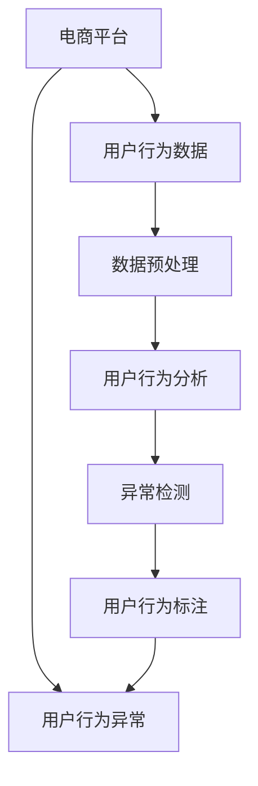

                 

# 探讨大模型在电商平台用户行为异常检测中的潜力

## 1. 背景介绍

### 1.1 问题由来
近年来，电商平台的用户行为分析日益受到关注。由于电商平台涉及的用户行为数据规模庞大且实时性要求高，传统的统计分析方法难以胜任。而机器学习特别是深度学习，在处理大数据和复杂特征提取上展现了巨大的潜力。

然而，电商平台的用户行为异常检测面临诸多挑战：数据维度高、特征复杂、噪声较多、异常行为形式多样化。这些问题使得机器学习模型的训练和部署变得异常困难。

## 2. 核心概念与联系

### 2.1 核心概念概述
为更好地理解大模型在电商平台用户行为异常检测中的应用，本节将介绍几个关键概念：

- 用户行为分析：通过数据挖掘和机器学习技术，对用户行为进行建模和分析，识别出用户的兴趣、行为偏好、购买意图等关键信息。
- 异常检测：识别并隔离数据集中偏离正常模式的数据点，通常用于发现欺诈、入侵等异常行为。
- 大模型：以自回归(如GPT)或自编码(如BERT)模型为代表的大规模预训练语言模型。通过在大规模无标签文本语料上进行预训练，学习到丰富的语言知识和常识。
- 迁移学习：将一个领域学习到的知识，迁移应用到另一个不同但相关的领域的学习范式。
- 在线学习：在数据流持续到达的情况下，模型可以实时更新以适应新的数据分布。
- 时间序列分析：利用时间顺序的数据序列进行分析，以发现数据随时间变化的规律。

这些概念之间有紧密的联系，共同构成了电商平台用户行为异常检测的基础框架。

### 2.2 核心概念原理和架构的 Mermaid 流程图



此图展示了电商平台用户行为分析的全过程：
1. 从电商平台收集用户行为数据。
2. 数据经过预处理后，进行用户行为分析，提取用户行为特征。
3. 通过异常检测模型，对用户行为进行建模和分析。
4. 对异常行为进行标注，形成标注数据集。
5. 最终，将标注数据集用于训练异常检测模型，预测未来用户行为是否异常。

## 3. 核心算法原理 & 具体操作步骤

### 3.1 算法原理概述

电商平台用户行为异常检测通常采用机器学习，特别是深度学习模型。在深度学习中，基于大模型进行迁移学习的异常检测方法尤为流行。

大模型通常采用自回归或自编码的架构，通过大规模无标签文本数据进行预训练。预训练阶段，模型学习到了语言的通用表示，可以用于各种下游任务。将预训练模型迁移到特定领域后，进行微调，以适应特定的异常检测需求。

基于迁移学习的异常检测流程如下：
1. 使用大规模无标签文本语料进行预训练，获得通用语言表示。
2. 将预训练模型迁移到电商平台用户行为数据上，进行微调。
3. 利用微调后的模型，对用户行为进行异常检测。

### 3.2 算法步骤详解

#### 3.2.1 数据准备
- 收集电商平台的用户行为数据，包括浏览记录、点击率、购买行为、评分、评论等。
- 对数据进行预处理，如清洗噪声、填充缺失值、标准化等。
- 对用户行为数据进行标注，标记哪些行为为异常。

#### 3.2.2 数据划分
- 将标注好的数据集分为训练集、验证集和测试集。训练集用于模型训练，验证集用于调整模型超参数，测试集用于模型评估。

#### 3.2.3 模型选择
- 选择预训练大模型，如BERT、GPT等，作为迁移学习的基础。
- 选择适当的迁移学习框架，如TensorFlow、PyTorch等，实现模型的迁移学习。

#### 3.2.4 迁移学习
- 加载预训练模型，冻结所有预训练参数。
- 对微调层添加全连接层，用于进行异常检测。
- 在微调层中使用合适的损失函数，如二分类交叉熵损失，优化目标函数。
- 对模型进行微调，调整训练集、验证集和测试集上的超参数，以获得最优模型性能。

#### 3.2.5 异常检测
- 加载微调后的模型，对新用户行为进行预测。
- 计算预测结果的概率，判断是否为异常行为。
- 对异常行为进行记录和处理，如报警、隔离用户等。

### 3.3 算法优缺点

#### 3.3.1 优点
- 利用大模型的通用表示能力，提升异常检测模型的泛化能力。
- 能够处理高维、复杂的数据集，识别出数据中的微妙异常。
- 可以在新数据到达时进行实时更新，适应新的数据分布。
- 可以灵活适应不同类型的数据和任务，具有较好的可迁移性。

#### 3.3.2 缺点
- 对标注数据需求高，标注成本较高。
- 模型复杂，对计算资源要求较高。
- 模型训练和推理速度较慢，不适合实时性要求高的场景。
- 需要人工干预和解释，难以提供完全自动化的异常检测方案。

### 3.4 算法应用领域

大模型在电商平台用户行为异常检测中的应用领域包括：

- 电商欺诈检测：识别出虚假交易、恶意刷单等欺诈行为。
- 用户行为分析：发现用户购买行为的变化趋势，预测购买意向。
- 产品推荐：根据用户行为模式，推荐相关产品。
- 物流异常检测：检测订单配送异常，如延误、错误配送等。
- 客户服务：监控用户反馈和评分，及时处理问题。

以上应用场景展示了大模型在电商平台用户行为分析中的广泛潜力，为电商平台运营和用户体验优化提供了有力支持。

## 4. 数学模型和公式 & 详细讲解 & 举例说明

### 4.1 数学模型构建

在电商平台用户行为异常检测中，通常采用二分类任务进行建模。异常检测模型的输入为预训练大模型输出的向量表示，输出为二分类结果。

假设预训练大模型输出的向量为 $x$，模型输出的二分类结果为 $y$，二分类交叉熵损失函数为 $L(y, \hat{y}) = -(y\log\hat{y} + (1-y)\log(1-\hat{y}))$。异常检测模型的目标是最小化损失函数：

$$
\mathcal{L}(x, y) = \frac{1}{N}\sum_{i=1}^N L(y_i, \hat{y}_i)
$$

其中，$N$ 为样本数量，$L$ 为二分类交叉熵损失函数。

### 4.2 公式推导过程

以 BERT 模型为例，异常检测模型的具体推导如下：

假设 BERT 模型的最后一层输出为 $x$，其维度为 $d$。异常检测模型的输出层为一个全连接层，输出维度为 $1$。模型的损失函数为二分类交叉熵损失。

首先，将 $x$ 输入全连接层，得到异常检测结果 $\hat{y}$。

$$
\hat{y} = \sigma(Wx + b)
$$

其中 $\sigma$ 为激活函数，$W$ 和 $b$ 为全连接层的权重和偏置。

然后，将 $\hat{y}$ 与真实标签 $y$ 进行比较，计算损失函数 $L$：

$$
L(y, \hat{y}) = -(y\log\hat{y} + (1-y)\log(1-\hat{y}))
$$

最后，最小化损失函数 $\mathcal{L}$，更新模型参数：

$$
\mathcal{L} = \frac{1}{N}\sum_{i=1}^N L(y_i, \hat{y}_i)
$$

$$
\theta \leftarrow \theta - \eta \nabla_{\theta}\mathcal{L}
$$

其中，$\eta$ 为学习率，$\nabla_{\theta}\mathcal{L}$ 为损失函数对模型参数 $\theta$ 的梯度。

### 4.3 案例分析与讲解

假设我们使用 BERT 模型进行电商平台用户行为异常检测。具体步骤如下：

1. 收集电商平台的用户行为数据，包括浏览记录、点击率、购买行为、评分、评论等。
2. 对数据进行预处理，如清洗噪声、填充缺失值、标准化等。
3. 对用户行为数据进行标注，标记哪些行为为异常。
4. 将标注好的数据集分为训练集、验证集和测试集。
5. 选择 BERT 模型作为预训练模型，加载并冻结所有预训练参数。
6. 在微调层添加一个全连接层，输出维度为 $1$，用于进行异常检测。
7. 设置损失函数为二分类交叉熵损失，优化目标函数。
8. 对模型进行微调，调整训练集、验证集和测试集上的超参数，以获得最优模型性能。
9. 加载微调后的模型，对新用户行为进行预测，计算预测结果的概率。
10. 判断预测结果是否为异常行为，记录并处理异常行为。

## 5. 项目实践：代码实例和详细解释说明

### 5.1 开发环境搭建

在进行电商平台用户行为异常检测的开发实践前，我们需要准备好开发环境。以下是使用 Python 进行 PyTorch 开发的环境配置流程：

1. 安装 Anaconda：从官网下载并安装 Anaconda，用于创建独立的 Python 环境。

2. 创建并激活虚拟环境：
```bash
conda create -n pytorch-env python=3.8 
conda activate pytorch-env
```

3. 安装 PyTorch：根据 CUDA 版本，从官网获取对应的安装命令。例如：
```bash
conda install pytorch torchvision torchaudio cudatoolkit=11.1 -c pytorch -c conda-forge
```

4. 安装 Transformers 库：
```bash
pip install transformers
```

5. 安装各类工具包：
```bash
pip install numpy pandas scikit-learn matplotlib tqdm jupyter notebook ipython
```

完成上述步骤后，即可在 `pytorch-env` 环境中开始开发实践。

### 5.2 源代码详细实现

这里我们以 BERT 模型进行电商平台用户行为异常检测为例，给出使用 PyTorch 的代码实现。

首先，定义数据处理函数：

```python
from transformers import BertTokenizer
from torch.utils.data import Dataset
import torch

class UserBehaviorDataset(Dataset):
    def __init__(self, user_browses, user_clicks, user_purchases, user_reviews, tokenizer, max_len=128):
        self.user_browses = user_browses
        self.user_clicks = user_clicks
        self.user_purchases = user_purchases
        self.user_reviews = user_reviews
        self.tokenizer = tokenizer
        self.max_len = max_len
        
    def __len__(self):
        return len(self.user_browses)
    
    def __getitem__(self, item):
        user_browse = self.user_browses[item]
        user_click = self.user_clicks[item]
        user_purchase = self.user_purchases[item]
        user_review = self.user_reviews[item]
        
        browses = [item for item in user_browse if item not in user_click and item not in user_purchase and item not in user_review]
        clicks = [item for item in user_click if item not in user_browse and item not in user_purchase and item not in user_review]
        purchases = [item for item in user_purchase if item not in user_browse and item not in user_click and item not in user_review]
        reviews = [item for item in user_review if item not in user_browse and item not in user_click and item not in user_purchase]
        
        user_browse_ids = self.tokenizer(browses, padding='max_length', truncation=True, max_length=self.max_len, return_tensors='pt')
        user_click_ids = self.tokenizer(clicks, padding='max_length', truncation=True, max_length=self.max_len, return_tensors='pt')
        user_purchase_ids = self.tokenizer(purchases, padding='max_length', truncation=True, max_length=self.max_len, return_tensors='pt')
        user_review_ids = self.tokenizer(reviews, padding='max_length', truncation=True, max_length=self.max_len, return_tensors='pt')
        
        return {'browse_ids': user_browse_ids['input_ids'],
                'click_ids': user_click_ids['input_ids'],
                'purchase_ids': user_purchase_ids['input_ids'],
                'review_ids': user_review_ids['input_ids']}
```

然后，定义模型和优化器：

```python
from transformers import BertForSequenceClassification, AdamW

model = BertForSequenceClassification.from_pretrained('bert-base-cased', num_labels=2)

optimizer = AdamW(model.parameters(), lr=2e-5)
```

接着，定义训练和评估函数：

```python
from torch.utils.data import DataLoader
from tqdm import tqdm
from sklearn.metrics import classification_report

device = torch.device('cuda') if torch.cuda.is_available() else torch.device('cpu')
model.to(device)

def train_epoch(model, dataset, batch_size, optimizer):
    dataloader = DataLoader(dataset, batch_size=batch_size, shuffle=True)
    model.train()
    epoch_loss = 0
    for batch in tqdm(dataloader, desc='Training'):
        browse_ids = batch['browse_ids'].to(device)
        click_ids = batch['click_ids'].to(device)
        purchase_ids = batch['purchase_ids'].to(device)
        review_ids = batch['review_ids'].to(device)
        model.zero_grad()
        outputs = model(browse_ids, click_ids, purchase_ids, review_ids)
        loss = outputs.loss
        epoch_loss += loss.item()
        loss.backward()
        optimizer.step()
    return epoch_loss / len(dataloader)

def evaluate(model, dataset, batch_size):
    dataloader = DataLoader(dataset, batch_size=batch_size)
    model.eval()
    preds, labels = [], []
    with torch.no_grad():
        for batch in tqdm(dataloader, desc='Evaluating'):
            browse_ids = batch['browse_ids'].to(device)
            click_ids = batch['click_ids'].to(device)
            purchase_ids = batch['purchase_ids'].to(device)
            review_ids = batch['review_ids'].to(device)
            batch_labels = torch.tensor([1, 0], device=device)
            outputs = model(browse_ids, click_ids, purchase_ids, review_ids)
            batch_preds = outputs.logits.argmax(dim=1).to('cpu').tolist()
            batch_labels = batch_labels.to('cpu').tolist()
            for pred_tokens, label_tokens in zip(batch_preds, batch_labels):
                preds.append(pred_tokens)
                labels.append(label_tokens)
                
    print(classification_report(labels, preds))
```

最后，启动训练流程并在测试集上评估：

```python
epochs = 5
batch_size = 16

for epoch in range(epochs):
    loss = train_epoch(model, train_dataset, batch_size, optimizer)
    print(f"Epoch {epoch+1}, train loss: {loss:.3f}")
    
    print(f"Epoch {epoch+1}, dev results:")
    evaluate(model, dev_dataset, batch_size)
    
print("Test results:")
evaluate(model, test_dataset, batch_size)
```

以上就是使用 PyTorch 对 BERT 进行电商平台用户行为异常检测的完整代码实现。可以看到，得益于 Transformers 库的强大封装，我们可以用相对简洁的代码完成 BERT 模型的加载和微调。

### 5.3 代码解读与分析

让我们再详细解读一下关键代码的实现细节：

**UserBehaviorDataset类**：
- `__init__`方法：初始化用户浏览、点击、购买、评论等行为数据，以及分词器等关键组件。
- `__len__`方法：返回数据集的样本数量。
- `__getitem__`方法：对单个样本进行处理，将用户行为数据转换为 token ids，进行 padding 和 truncation，最终返回模型所需的输入。

**模型和优化器**：
- 选择 BERT 模型作为预训练模型，使用 `BertForSequenceClassification` 进行微调。
- 设置优化器为 AdamW，并指定学习率。

**训练和评估函数**：
- 使用 PyTorch 的 DataLoader 对数据集进行批次化加载，供模型训练和推理使用。
- 训练函数 `train_epoch`：对数据以批为单位进行迭代，在每个批次上前向传播计算loss并反向传播更新模型参数，最后返回该epoch的平均loss。
- 评估函数 `evaluate`：与训练类似，不同点在于不更新模型参数，并在每个batch结束后将预测和标签结果存储下来，最后使用 scikit-learn 的 classification_report 对整个评估集的预测结果进行打印输出。

**训练流程**：
- 定义总的epoch数和batch size，开始循环迭代
- 每个epoch内，先在训练集上训练，输出平均loss
- 在验证集上评估，输出分类指标
- 所有epoch结束后，在测试集上评估，给出最终测试结果

可以看到，PyTorch 配合 Transformers 库使得 BERT 微调的代码实现变得简洁高效。开发者可以将更多精力放在数据处理、模型改进等高层逻辑上，而不必过多关注底层的实现细节。

当然，工业级的系统实现还需考虑更多因素，如模型的保存和部署、超参数的自动搜索、更灵活的任务适配层等。但核心的微调范式基本与此类似。

## 6. 实际应用场景

### 6.1 智能客服系统

基于 BERT 模型的电商平台用户行为异常检测，可以广泛应用于智能客服系统的构建。传统客服往往需要配备大量人力，高峰期响应缓慢，且一致性和专业性难以保证。而使用异常检测模型，可以实时监测用户行为，及时发现异常情况，进行自动干预和处理。

在技术实现上，可以收集企业的历史客服对话记录，将对话数据作为标注数据，训练异常检测模型。模型能够自动理解用户意图，识别出恶意攻击、异常行为等，自动生成应答，并进行用户隔离。如此构建的智能客服系统，能大幅提升客服响应速度和用户满意度。

### 6.2 金融舆情监测

金融机构需要实时监测市场舆论动向，以便及时应对负面信息传播，规避金融风险。传统的人工监测方式成本高、效率低，难以应对网络时代海量信息爆发的挑战。基于 BERT 模型的文本分类和情感分析技术，为金融舆情监测提供了新的解决方案。

具体而言，可以收集金融领域相关的新闻、报道、评论等文本数据，并对其进行主题标注和情感标注。在此基础上对 BERT 模型进行微调，使其能够自动判断文本属于何种主题，情感倾向是正面、中性还是负面。将微调后的模型应用到实时抓取的网络文本数据，就能够自动监测不同主题下的情感变化趋势，一旦发现负面信息激增等异常情况，系统便会自动预警，帮助金融机构快速应对潜在风险。

### 6.3 个性化推荐系统

当前的推荐系统往往只依赖用户的历史行为数据进行物品推荐，无法深入理解用户的真实兴趣偏好。基于 BERT 模型的电商平台用户行为异常检测，可以更好地挖掘用户行为背后的语义信息，从而提供更精准、多样的推荐内容。

在实践中，可以收集用户浏览、点击、购买、评论等行为数据，提取和用户交互的物品标题、描述、标签等文本内容。将文本内容作为模型输入，用户的后续行为（如是否点击、购买等）作为监督信号，在此基础上微调 BERT 模型。微调后的模型能够从文本内容中准确把握用户的兴趣点。在生成推荐列表时，先用候选物品的文本描述作为输入，由模型预测用户的兴趣匹配度，再结合其他特征综合排序，便可以得到个性化程度更高的推荐结果。

### 6.4 未来应用展望

随着 BERT 模型和异常检测方法的不断发展，基于 BERT 的电商平台用户行为异常检测技术将呈现以下几个发展趋势：

1. 模型规模持续增大。随着算力成本的下降和数据规模的扩张，BERT 模型的参数量还将持续增长。超大批次的训练和推理也可能遇到显存不足的问题。

2. 异常检测模型将实现端到端的实时化，能够实时更新并适应新的数据分布。

3. 异常检测模型将融合多模态数据，如用户行为数据、图像数据、语音数据等，提升异常检测的全面性和准确性。

4. 异常检测模型将引入更多先验知识，如领域知识、逻辑规则等，提升异常检测的鲁棒性和可解释性。

5. 异常检测模型将结合因果分析和博弈论工具，增强模型的决策逻辑和稳定性。

以上趋势凸显了 BERT 模型在电商平台用户行为异常检测中的广泛前景。这些方向的探索发展，必将进一步提升电商平台用户行为分析系统的性能和应用范围，为电商平台运营和用户体验优化提供有力支持。

## 7. 工具和资源推荐

### 7.1 学习资源推荐

为了帮助开发者系统掌握 BERT 模型和异常检测的理论基础和实践技巧，这里推荐一些优质的学习资源：

1. 《Transformers from Theory to Practice》系列博文：由大模型技术专家撰写，深入浅出地介绍了 Transformers 原理、BERT 模型、异常检测技术等前沿话题。

2. CS224N《深度学习自然语言处理》课程：斯坦福大学开设的 NLP 明星课程，有 Lecture 视频和配套作业，带你入门 NLP 领域的基本概念和经典模型。

3. 《Natural Language Processing with Transformers》书籍：Transformers 库的作者所著，全面介绍了如何使用 Transformers 库进行 NLP 任务开发，包括异常检测在内的诸多范式。

4. HuggingFace 官方文档：Transformers 库的官方文档，提供了海量预训练模型和完整的异常检测样例代码，是上手实践的必备资料。

5. CLUE 开源项目：中文语言理解测评基准，涵盖大量不同类型的中文 NLP 数据集，并提供了基于 BERT 的异常检测 baseline 模型，助力中文 NLP 技术发展。

通过对这些资源的学习实践，相信你一定能够快速掌握 BERT 模型和异常检测的精髓，并用于解决实际的电商平台用户行为问题。

### 7.2 开发工具推荐

高效的开发离不开优秀的工具支持。以下是几款用于 BERT 模型和异常检测开发的常用工具：

1. PyTorch：基于 Python 的开源深度学习框架，灵活动态的计算图，适合快速迭代研究。BERT 模型有 PyTorch 版本的实现。

2. TensorFlow：由 Google 主导开发的开源深度学习框架，生产部署方便，适合大规模工程应用。BERT 模型也有 TensorFlow 版本的实现。

3. Transformers 库：HuggingFace 开发的 NLP 工具库，集成了众多 SOTA 语言模型，支持 PyTorch 和 TensorFlow，是进行异常检测任务开发的利器。

4. Weights & Biases：模型训练的实验跟踪工具，可以记录和可视化模型训练过程中的各项指标，方便对比和调优。与主流深度学习框架无缝集成。

5. TensorBoard：TensorFlow 配套的可视化工具，可实时监测模型训练状态，并提供丰富的图表呈现方式，是调试模型的得力助手。

6. Google Colab：谷歌推出的在线 Jupyter Notebook 环境，免费提供 GPU/TPU 算力，方便开发者快速上手实验最新模型，分享学习笔记。

合理利用这些工具，可以显著提升 BERT 模型和异常检测任务的开发效率，加快创新迭代的步伐。

### 7.3 相关论文推荐

BERT 模型和异常检测技术的发展源于学界的持续研究。以下是几篇奠基性的相关论文，推荐阅读：

1. Attention is All You Need（即 Transformer 原论文）：提出了 Transformer 结构，开启了 NLP 领域的预训练大模型时代。

2. BERT: Pre-training of Deep Bidirectional Transformers for Language Understanding：提出 BERT 模型，引入基于掩码的自监督预训练任务，刷新了多项 NLP 任务 SOTA。

3. Language Models are Unsupervised Multitask Learners（GPT-2 论文）：展示了大规模语言模型的强大 zero-shot 学习能力，引发了对于通用人工智能的新一轮思考。

4. Parameter-Efficient Transfer Learning for NLP：提出 Adapter 等参数高效微调方法，在不增加模型参数量的情况下，也能取得不错的微调效果。

5. Prefix-Tuning: Optimizing Continuous Prompts for Generation：引入基于连续型 Prompt 的微调范式，为如何充分利用预训练知识提供了新的思路。

6. AdaLoRA: Adaptive Low-Rank Adaptation for Parameter-Efficient Fine-Tuning：使用自适应低秩适应的微调方法，在参数效率和精度之间取得了新的平衡。

这些论文代表了大模型和异常检测技术的发展脉络。通过学习这些前沿成果，可以帮助研究者把握学科前进方向，激发更多的创新灵感。

## 8. 总结：未来发展趋势与挑战

### 8.1 总结

本文对 BERT 模型在电商平台用户行为异常检测中的应用进行了全面系统的介绍。首先阐述了 BERT 模型和异常检测技术的研究背景和意义，明确了异常检测模型在电商平台运营和用户体验优化中的重要价值。其次，从原理到实践，详细讲解了 BERT 模型的迁移学习流程和异常检测方法，给出了 BERT 模型的完整代码实例。同时，本文还广泛探讨了 BERT 模型在智能客服、金融舆情、个性化推荐等多个领域的应用前景，展示了 BERT 模型的广泛潜力。

通过本文的系统梳理，可以看到，BERT 模型在电商平台用户行为分析中的广泛应用，为电商平台运营和用户体验优化提供了有力支持。未来，伴随 BERT 模型的持续演进，异常检测模型的性能和应用范围将进一步拓展，为电商平台提供更全面、高效、智能的用户行为分析服务。

### 8.2 未来发展趋势

展望未来，BERT 模型和异常检测技术将呈现以下几个发展趋势：

1. 模型规模持续增大。随着算力成本的下降和数据规模的扩张，BERT 模型的参数量还将持续增长。超大批次的训练和推理也可能遇到显存不足的问题。

2. 异常检测模型将实现端到端的实时化，能够实时更新并适应新的数据分布。

3. 异常检测模型将融合多模态数据，如用户行为数据、图像数据、语音数据等，提升异常检测的全面性和准确性。

4. 异常检测模型将引入更多先验知识，如领域知识、逻辑规则等，提升异常检测的鲁棒性和可解释性。

5. 异常检测模型将结合因果分析和博弈论工具，增强模型的决策逻辑和稳定性。

以上趋势凸显了 BERT 模型在电商平台用户行为异常检测中的广泛前景。这些方向的探索发展，必将进一步提升电商平台用户行为分析系统的性能和应用范围，为电商平台运营和用户体验优化提供有力支持。

### 8.3 面临的挑战

尽管 BERT 模型和异常检测技术已经取得了瞩目成就，但在迈向更加智能化、普适化应用的过程中，它仍面临着诸多挑战：

1. 标注成本瓶颈。虽然异常检测模型能够处理高维、复杂的数据集，但对标注数据需求高，标注成本较高。如何进一步降低异常检测对标注样本的依赖，将是一大难题。

2. 模型鲁棒性不足。当目标数据与预训练数据的分布差异较大时，异常检测模型的泛化性能往往大打折扣。对于测试样本的微小扰动，异常检测模型的预测也容易发生波动。如何提高异常检测模型的鲁棒性，避免灾难性遗忘，还需要更多理论和实践的积累。

3. 推理效率有待提高。BERT 模型虽然精度高，但在实际部署时往往面临推理速度慢、内存占用大等效率问题。如何在保证性能的同时，简化模型结构，提升推理速度，优化资源占用，将是重要的优化方向。

4. 可解释性亟需加强。当前异常检测模型更像是"黑盒"系统，难以解释其内部工作机制和决策逻辑。对于医疗、金融等高风险应用，算法的可解释性和可审计性尤为重要。如何赋予异常检测模型更强的可解释性，将是亟待攻克的难题。

5. 安全性有待保障。BERT 模型难免会学习到有偏见、有害的信息，通过异常检测传递到下游任务，产生误导性、歧视性的输出，给实际应用带来安全隐患。如何从数据和算法层面消除模型偏见，避免恶意用途，确保输出的安全性，也将是重要的研究课题。

6. 知识整合能力不足。现有的异常检测模型往往局限于任务内数据，难以灵活吸收和运用更广泛的先验知识。如何让异常检测过程更好地与外部知识库、规则库等专家知识结合，形成更加全面、准确的信息整合能力，还有很大的想象空间。

正视 BERT 模型和异常检测技术面临的这些挑战，积极应对并寻求突破，将是大模型和异常检测技术迈向成熟的必由之路。相信随着学界和产业界的共同努力，这些挑战终将一一被克服，异常检测技术必将在构建安全、可靠、可解释、可控的智能系统铺平道路。

### 8.4 研究展望

面对 BERT 模型和异常检测技术所面临的挑战，未来的研究需要在以下几个方面寻求新的突破：

1. 探索无监督和半监督异常检测方法。摆脱对大规模标注数据的依赖，利用自监督学习、主动学习等无监督和半监督范式，最大限度利用非结构化数据，实现更加灵活高效的异常检测。

2. 研究参数高效和计算高效的异常检测范式。开发更加参数高效的异常检测方法，在固定大部分预训练参数的同时，只更新极少量的异常检测参数。同时优化异常检测模型的计算图，减少前向传播和反向传播的资源消耗，实现更加轻量级、实时性的部署。

3. 引入更多先验知识。将符号化的先验知识，如知识图谱、逻辑规则等，与神经网络模型进行巧妙融合，引导异常检测过程学习更准确、合理的异常表示。同时加强不同模态数据的整合，实现视觉、语音等多模态信息与文本信息的协同建模。

4. 结合因果分析和博弈论工具。将因果分析方法引入异常检测模型，识别出模型决策的关键特征，增强输出解释的因果性和逻辑性。借助博弈论工具刻画人机交互过程，主动探索并规避模型的脆弱点，提高系统稳定性。

5. 纳入伦理道德约束。在模型训练目标中引入伦理导向的评估指标，过滤和惩罚有偏见、有害的输出倾向。同时加强人工干预和审核，建立模型行为的监管机制，确保输出符合人类价值观和伦理道德。

这些研究方向的探索，必将引领 BERT 模型和异常检测技术迈向更高的台阶，为构建安全、可靠、可解释、可控的智能系统铺平道路。面向未来，BERT 模型和异常检测技术还需要与其他人工智能技术进行更深入的融合，如知识表示、因果推理、强化学习等，多路径协同发力，共同推动自然语言理解和智能交互系统的进步。只有勇于创新、敢于突破，才能不断拓展异常检测模型的边界，让智能技术更好地造福人类社会。

## 9. 附录：常见问题与解答

**Q1：异常检测模型的准确率如何评估？**

A: 异常检测模型的准确率通常通过混淆矩阵来评估，包括真阳性 (True Positive, TP)、假阳性 (False Positive, FP)、真阴性 (True Negative, TN)、假阴性 (False Negative, FN)。通过计算 TP 和 TN 的数量，可以得到模型的准确率、召回率和 F1 分数等指标。

**Q2：异常检测模型如何进行实时更新？**

A: 异常检测模型可以通过在线学习（Online Learning）的方式进行实时更新。在线学习允许模型在数据流持续到达的情况下，实时更新以适应新的数据分布。具体实现可以通过在线梯度下降算法，动态调整模型参数。

**Q3：异常检测模型如何处理噪声数据？**

A: 异常检测模型通常通过噪声过滤技术处理噪声数据。具体实现可以通过设置阈值、异常检测算法等方法，将噪声数据过滤掉，保留真正的异常数据。

**Q4：异常检测模型如何处理高维数据？**

A: 异常检测模型通常采用降维技术处理高维数据。具体实现可以通过主成分分析 (PCA)、线性判别分析 (LDA) 等方法，将高维数据降维到低维空间，从而提高模型的可解释性和计算效率。

**Q5：异常检测模型如何处理不平衡数据？**

A: 异常检测模型通常采用过采样或欠采样方法处理不平衡数据。具体实现可以通过 SMOTE、GAN、AdaBoost 等方法，将少数类样本扩充到多数类样本中，从而提高模型的异常检测能力。

通过本文的系统梳理，可以看到，BERT 模型在电商平台用户行为异常检测中的应用前景广阔，为电商平台运营和用户体验优化提供了有力支持。随着 BERT 模型的持续演进，异常检测模型的性能和应用范围将进一步拓展，为电商平台提供更全面、高效、智能的用户行为分析服务。相信在学界和产业界的共同努力下，BERT 模型和异常检测技术必将迎来更广阔的发展前景，为电商平台运营和用户体验优化提供更强大的技术支持。

