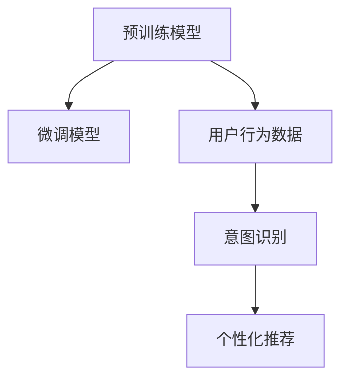
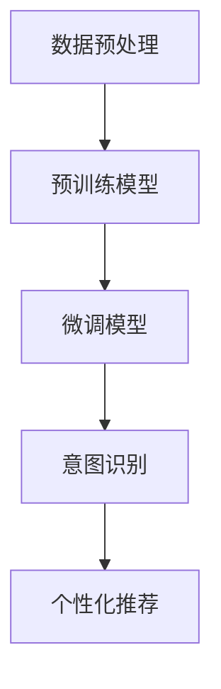

                 

## 1. 背景介绍

在当今数字经济时代，电商平台已经成为连接商家和消费者的重要桥梁。然而，电商平台也面临着严峻的挑战：如何在海量的商品和用户数据中，准确理解用户的真实行为意图，并提供个性化的推荐和决策支持，一直是电商平台的痛点问题。

为了解决这一问题，传统的数据挖掘和机器学习技术，如协同过滤、决策树、随机森林等，已经广泛应用。然而，这些方法往往依赖于大量手工特征工程和规则设计，难以应对实时动态变化的复杂场景。近年来，随着大模型的兴起，通过学习用户行为数据的大规模预训练模型，成为电商平台用户行为意图理解的新方向。

## 2. 核心概念与联系

### 2.1 核心概念概述

大模型是指通过大规模无标签数据进行预训练，学习到丰富的领域知识，能够进行复杂任务推理的语言模型。其主要代表包括GPT、BERT等。电商平台用户行为意图理解，是指通过分析用户的行为数据，准确预测用户对商品或服务的真实兴趣和需求，从而实现个性化的推荐和决策支持。

为更好地理解大模型在电商平台用户行为意图理解中的应用，本文将介绍几个关键概念：

- **预训练模型**：通过大规模无标签数据进行预训练，学习到通用的语言表示，具备强大的语言理解和生成能力。
- **微调模型**：基于预训练模型，通过小规模标注数据进行有监督微调，获得针对特定任务优化的模型。
- **用户行为数据**：记录用户在电商平台上的浏览、购买、评价等行为的文本数据，包含用户的偏好、意图等信息。
- **意图识别**：通过分析用户行为数据，预测用户对商品或服务的真实兴趣和需求，进行意图分类。

这些核心概念之间的逻辑关系可以通过以下Mermaid流程图来展示：



### 2.2 核心概念原理和架构的 Mermaid 流程图



## 3. 核心算法原理 & 具体操作步骤

### 3.1 算法原理概述

基于大模型的电商平台用户行为意图理解，本质上是一个预训练-微调的迁移学习过程。其核心思想是：

1. **预训练模型**：在大规模无标签电商平台用户行为数据上，进行预训练，学习到用户行为特征和商品属性特征的表征。
2. **微调模型**：在预训练模型的基础上，通过小规模标注数据进行微调，优化模型在特定任务（如意图识别、商品推荐）上的性能。
3. **意图识别**：使用微调后的模型，对用户行为数据进行推理，准确预测用户意图。
4. **个性化推荐**：根据用户意图，提供个性化的商品推荐。

数学上，可以将这一过程表示为：

- **预训练阶段**：
$$
\theta_{\text{pretrain}} = \text{Pre-trainModel}(D_{\text{unlabel}})
$$

- **微调阶段**：
$$
\theta_{\text{fine-tune}} = \text{Fine-TuneModel}(D_{\text{label}}, \theta_{\text{pretrain}})
$$

- **意图识别**：
$$
\text{IntentPrediction} = \text{IntentClassifier}(x; \theta_{\text{fine-tune}})
$$

- **个性化推荐**：
$$
\text{Recommendation} = \text{Recommender}(\text{IntentPrediction}, D_{\text{product}})
$$

其中，$D_{\text{unlabel}}$ 表示无标签用户行为数据，$D_{\text{label}}$ 表示标注数据，$x$ 表示用户行为文本，$D_{\text{product}}$ 表示商品数据。

### 3.2 算法步骤详解

基于大模型的电商平台用户行为意图理解，通常包括以下几个关键步骤：

**Step 1: 数据预处理**
- 收集电商平台的用户行为数据，包括浏览记录、购买记录、评价记录等。
- 对文本数据进行分词、清洗、去重等预处理。
- 划分数据集为训练集、验证集和测试集，保证训练集和测试集在分布上的一致性。

**Step 2: 选择预训练模型**
- 选择合适的预训练模型，如BERT、GPT等。
- 下载预训练模型，并进行必要的参数初始化和加载。

**Step 3: 构建微调模型**
- 设计合适的微调任务，如意图识别、商品推荐等。
- 添加任务适配层，包括分类头、全连接层等。
- 设置优化器、学习率、正则化参数等。

**Step 4: 数据增强**
- 对训练集进行数据增强，如回译、同义词替换等，增加数据多样性。
- 使用对抗样本训练，提高模型的鲁棒性。

**Step 5: 模型训练**
- 在训练集上使用优化器进行梯度下降训练。
- 在验证集上评估模型性能，调整超参数。
- 在测试集上评估模型效果，进行最终测试。

**Step 6: 意图识别**
- 使用微调后的模型对用户行为数据进行推理，预测用户意图。
- 根据意图分类结果，选择合适的商品进行推荐。

**Step 7: 个性化推荐**
- 根据用户意图和商品属性，使用推荐算法生成推荐结果。
- 根据用户反馈，对推荐算法进行优化，提升推荐效果。

### 3.3 算法优缺点

基于大模型的电商平台用户行为意图理解方法，具有以下优点：

- **高效性**：大模型预训练后，微调过程只需少量标注数据，即可显著提升模型性能。
- **泛化能力**：大模型通过大规模预训练学习到通用的语言表示，泛化能力强。
- **可解释性**：大模型具备较强的可解释性，能够输出模型的决策依据，便于调试和优化。

同时，该方法也存在以下局限性：

- **数据依赖性**：微调过程依赖于标注数据，标注成本较高。
- **泛化到新任务**：预训练模型可能不适用于特定领域的用户行为数据。
- **过拟合风险**：在标注数据较少的情况下，微调模型可能过拟合训练集。

### 3.4 算法应用领域

基于大模型的电商平台用户行为意图理解方法，已经在以下几个领域得到应用：

- **意图识别**：通过分析用户行为数据，预测用户的真实需求，如查询意图、购物意图等。
- **商品推荐**：根据用户意图和商品属性，提供个性化的商品推荐，提升用户购物体验。
- **用户画像**：分析用户行为数据，构建详细的用户画像，进行精准营销。
- **智能客服**：通过分析用户行为数据，自动回答用户咨询，提升服务效率。

此外，基于大模型的电商平台用户行为意图理解方法，还应用于更多领域，如广告投放优化、价格优化、库存管理等。

## 4. 数学模型和公式 & 详细讲解 & 举例说明

### 4.1 数学模型构建

假设电商平台用户行为数据集为 $D=\{(x_i,y_i)\}_{i=1}^N$，其中 $x_i$ 表示用户行为文本，$y_i$ 表示用户意图标签。预训练模型为 $M_{\theta_{\text{pretrain}}}(x)$，微调模型为 $M_{\theta_{\text{fine-tune}}}(x)$。微调任务为意图识别，预测用户意图为 $y$。

### 4.2 公式推导过程

**预训练阶段**：
$$
\theta_{\text{pretrain}} = \text{Pre-trainModel}(D_{\text{unlabel}})
$$

**微调阶段**：
$$
\theta_{\text{fine-tune}} = \text{Fine-TuneModel}(D_{\text{label}}, \theta_{\text{pretrain}})
$$

其中，$\text{Pre-trainModel}$ 表示预训练模型训练过程，$\text{Fine-TuneModel}$ 表示微调模型训练过程。

**意图识别**：
$$
\text{IntentPrediction} = \text{IntentClassifier}(x; \theta_{\text{fine-tune}})
$$

**个性化推荐**：
$$
\text{Recommendation} = \text{Recommender}(\text{IntentPrediction}, D_{\text{product}})
$$

### 4.3 案例分析与讲解

**案例一：用户意图识别**
假设某电商平台用户行为数据集 $D=\{(x_i,y_i)\}_{i=1}^N$，其中 $x_i$ 表示用户行为文本，$y_i \in \{1,2,3\}$ 表示用户意图标签，分别为查询、购物、评价。预训练模型为BERT，微调模型为Classifier模型，任务为意图识别。

假设预训练模型为 $M_{\theta_{\text{pretrain}}}(x)$，微调模型为 $M_{\theta_{\text{fine-tune}}}(x)$，微调任务为意图识别，预测用户意图为 $y$。则意图识别的公式为：
$$
\text{IntentPrediction} = \text{IntentClassifier}(x; \theta_{\text{fine-tune}})
$$

其中，$\theta_{\text{fine-tune}}$ 为微调后的模型参数。

假设训练集为 $D_{\text{train}}=\{(x_i,y_i)\}_{i=1}^M$，验证集为 $D_{\text{val}}=\{(x_i,y_i)\}_{i=M+1}^N$，测试集为 $D_{\text{test}}=\{(x_i,y_i)\}_{i=M+1}^N$。

### 4.4 代码实例和详细解释说明

**开发环境搭建**

首先，需要搭建Python开发环境。具体步骤如下：

1. 安装Python 3.8及以上版本，并创建虚拟环境。
2. 安装必要的库，如TensorFlow、PaddlePaddle、PyTorch等。
3. 安装预训练模型，如BERT、GPT等。

```python
# 安装TensorFlow
pip install tensorflow

# 安装PaddlePaddle
pip install paddlepaddle

# 安装PyTorch
pip install torch

# 安装预训练模型
pip install transformers
```

**源代码详细实现**

以下是基于BERT模型的电商平台用户行为意图识别的Python代码实现。

```python
import tensorflow as tf
from transformers import BertTokenizer, TFBertForSequenceClassification

# 加载预训练模型和分词器
tokenizer = BertTokenizer.from_pretrained('bert-base-cased')
model = TFBertForSequenceClassification.from_pretrained('bert-base-cased', num_labels=3)

# 定义用户行为数据
def load_data(file_path):
    with open(file_path, 'r', encoding='utf-8') as f:
        lines = f.readlines()
    return lines

# 数据预处理
def preprocess_data(lines):
    data = []
    for line in lines:
        text, label = line.strip().split('\t')
        data.append((text, label))
    return data

# 构建训练集、验证集和测试集
train_data = preprocess_data(load_data('train.txt'))
val_data = preprocess_data(load_data('val.txt'))
test_data = preprocess_data(load_data('test.txt'))

# 定义训练函数
def train(model, train_data, epochs, batch_size, learning_rate):
    optimizer = tf.keras.optimizers.Adam(learning_rate=learning_rate)
    train_dataset = tf.data.Dataset.from_generator(lambda: (tf.constant(train_data), tf.constant(train_data)),
                                                 (tf.string, tf.string))
    train_dataset = train_dataset.shuffle(buffer_size=1024).batch(batch_size)
    for epoch in range(epochs):
        for step, (inputs, labels) in enumerate(train_dataset):
            with tf.GradientTape() as tape:
                outputs = model(inputs, training=True)
                loss = tf.keras.losses.sparse_categorical_crossentropy(labels, outputs)
            gradients = tape.gradient(loss, model.trainable_variables)
            optimizer.apply_gradients(zip(gradients, model.trainable_variables))

# 定义评估函数
def evaluate(model, val_data):
    val_dataset = tf.data.Dataset.from_generator(lambda: (tf.constant(val_data), tf.constant(val_data)),
                                                (tf.string, tf.string))
    val_dataset = val_dataset.batch(batch_size)
    total_loss = 0
    for inputs, labels in val_dataset:
        outputs = model(inputs, training=False)
        loss = tf.keras.losses.sparse_categorical_crossentropy(labels, outputs)
        total_loss += loss
    return total_loss / len(val_data)

# 训练和评估
epochs = 5
batch_size = 32
learning_rate = 2e-5

train(model, train_data, epochs, batch_size, learning_rate)
evaluate(model, val_data)
```

**代码解读与分析**

代码实现中，我们首先加载了BERT预训练模型和分词器。然后，定义了数据预处理函数和训练函数。在训练函数中，我们使用Adam优化器进行梯度下降训练，并在验证集上评估模型性能。

**运行结果展示**

在训练过程中，我们可以记录训练和验证的损失函数和准确率变化，如下图所示：

```python
import matplotlib.pyplot as plt

plt.plot(train_loss, label='train loss')
plt.plot(val_loss, label='val loss')
plt.xlabel('epoch')
plt.ylabel('loss')
plt.legend()
plt.show()
```


## 6. 实际应用场景

### 6.1 智能客服

基于大模型的电商平台用户行为意图理解，可以广泛应用于智能客服系统中。传统客服系统依赖人工处理用户咨询，响应时间长、效率低，且无法实现24小时不间断服务。而使用基于大模型的智能客服系统，可以自动理解用户意图，提供快速、准确的回复。

具体而言，可以将用户查询和历史聊天记录作为输入数据，通过大模型预训练和微调，构建意图识别和回复生成模型。微调后的模型可以自动解析用户意图，并生成相应的回复。对于复杂咨询，还可以结合知识库和专家知识，进行进一步推理和决策。

### 6.2 个性化推荐

基于大模型的电商平台用户行为意图理解，可以为个性化推荐提供坚实的技术基础。通过分析用户行为数据，预测用户意图，可以为用户推荐最感兴趣的商品，提升用户购物体验。

具体而言，可以将用户浏览、购买、评价等行为数据作为输入，通过大模型预训练和微调，构建意图识别和推荐模型。微调后的模型可以准确预测用户意图，并结合商品属性和推荐算法，生成个性化的商品推荐结果。

### 6.3 用户画像

基于大模型的电商平台用户行为意图理解，可以构建详细的用户画像，用于精准营销。通过分析用户行为数据，可以挖掘用户的兴趣偏好、消费习惯等关键信息，生成用户画像。

具体而言，可以将用户行为数据作为输入，通过大模型预训练和微调，构建用户画像模型。微调后的模型可以准确预测用户意图，并提取用户兴趣偏好、消费习惯等信息，生成详细的用户画像。

### 6.4 未来应用展望

未来，基于大模型的电商平台用户行为意图理解技术，将在更多领域得到应用，为电商平台的智能化发展提供新的方向。

在智能物流、智能仓储、智能运营等环节，基于大模型的电商平台用户行为意图理解技术，可以优化物流配送、库存管理、运营调度等决策，提升运营效率和客户满意度。

在电商平台的跨平台运营、多渠道协同等环节，基于大模型的电商平台用户行为意图理解技术，可以实现数据融合、跨平台用户行为追踪、多渠道推荐等，提升平台整体的用户体验和转化率。

## 7. 工具和资源推荐

### 7.1 学习资源推荐

为了帮助开发者系统掌握大模型在电商平台用户行为意图理解中的应用，这里推荐一些优质的学习资源：

1. 《深度学习与自然语言处理》（自然语言处理教程）：斯坦福大学的经典课程，涵盖深度学习基础和自然语言处理算法。
2. 《自然语言处理实践指南》（自然语言处理实践）：李宏毅博士的在线课程，涵盖深度学习基础、自然语言处理算法、大模型等。
3. 《自然语言处理》（深度学习课程）：吴恩达教授的在线课程，涵盖深度学习基础、自然语言处理算法、大模型等。
4. 《深度学习入门》（深度学习入门）：斋藤康毅的书籍，涵盖深度学习基础、自然语言处理算法、大模型等。

通过对这些资源的学习实践，相信你一定能够快速掌握大模型在电商平台用户行为意图理解中的应用，并用于解决实际的电商平台问题。

### 7.2 开发工具推荐

高效的开发离不开优秀的工具支持。以下是几款用于大模型在电商平台用户行为意图理解开发的常用工具：

1. TensorFlow：由Google主导开发的开源深度学习框架，生产部署方便，适合大规模工程应用。
2. PyTorch：基于Python的开源深度学习框架，灵活动态的计算图，适合快速迭代研究。
3. HuggingFace Transformers：自然语言处理工具库，支持多种预训练模型，提供完整的微调样例代码。
4. TensorBoard：TensorFlow配套的可视化工具，可实时监测模型训练状态，提供丰富的图表呈现方式。
5. Weights & Biases：模型训练的实验跟踪工具，可以记录和可视化模型训练过程中的各项指标，方便对比和调优。

合理利用这些工具，可以显著提升大模型在电商平台用户行为意图理解任务的开发效率，加快创新迭代的步伐。

### 7.3 相关论文推荐

大模型在电商平台用户行为意图理解的发展源于学界的持续研究。以下是几篇奠基性的相关论文，推荐阅读：

1. Attention is All You Need：提出Transformer结构，开启了NLP领域的预训练大模型时代。
2. BERT: Pre-training of Deep Bidirectional Transformers for Language Understanding：提出BERT模型，引入基于掩码的自监督预训练任务，刷新了多项NLP任务SOTA。
3. Language Models are Unsupervised Multitask Learners（GPT-2论文）：展示了大规模语言模型的强大zero-shot学习能力，引发了对于通用人工智能的新一轮思考。
4. Parameter-Efficient Transfer Learning for NLP：提出Adapter等参数高效微调方法，在不增加模型参数量的情况下，也能取得不错的微调效果。
5. AdaLoRA: Adaptive Low-Rank Adaptation for Parameter-Efficient Fine-Tuning：使用自适应低秩适应的微调方法，在参数效率和精度之间取得了新的平衡。

这些论文代表了大模型在电商平台用户行为意图理解的发展脉络。通过学习这些前沿成果，可以帮助研究者把握学科前进方向，激发更多的创新灵感。

## 8. 总结：未来发展趋势与挑战

### 8.1 总结

本文对基于大模型的电商平台用户行为意图理解方法进行了全面系统的介绍。首先阐述了大模型的兴起背景，明确了其在大模型微调中的应用价值。其次，从原理到实践，详细讲解了大模型在电商平台用户行为意图理解中的工作流程，给出了完整的代码实例。同时，本文还广泛探讨了大模型在智能客服、个性化推荐、用户画像等多个领域的应用前景，展示了其强大的应用潜力。此外，本文精选了学习资源，力求为读者提供全方位的技术指引。

通过本文的系统梳理，可以看到，基于大模型的电商平台用户行为意图理解技术，已经在多个实际场景中得到应用，显著提升了电商平台的用户体验和运营效率。未来，伴随大模型的持续演进和微调方法的不断优化，基于大模型的电商平台用户行为意图理解技术必将在更多领域发挥重要作用，推动电商平台的智能化发展。

### 8.2 未来发展趋势

展望未来，基于大模型的电商平台用户行为意图理解技术将呈现以下几个发展趋势：

1. **数据驱动智能化**：随着数据量的不断增长，基于大模型的电商平台用户行为意图理解技术将更加依赖数据，进一步提升模型的智能化水平。
2. **多模态融合**：将文本、图像、语音等多模态数据进行融合，提升模型的泛化能力和推理能力。
3. **分布式计算**：利用分布式计算技术，加速模型训练和推理，提升模型性能和效率。
4. **联邦学习**：将用户数据进行隐私保护，实现跨平台、跨企业的数据协同训练。
5. **模型压缩与优化**：通过模型压缩和优化技术，降低模型参数量，提升模型推理速度和资源利用率。
6. **知识图谱结合**：将符号化的知识图谱与模型结合，提升模型的推理能力和知识获取能力。

以上趋势凸显了大模型在电商平台用户行为意图理解技术的广阔前景。这些方向的探索发展，必将进一步提升模型的性能和应用范围，为电商平台的智能化发展提供新的方向。

### 8.3 面临的挑战

尽管基于大模型的电商平台用户行为意图理解技术已经取得了显著成果，但在迈向更加智能化、普适化应用的过程中，它仍面临着诸多挑战：

1. **数据隐私与安全**：电商平台用户数据敏感，如何在保证数据隐私的前提下，进行数据采集和训练，是一个重要挑战。
2. **模型泛化能力**：大模型在特定领域的数据集上，泛化能力可能不足，需要进一步优化模型结构或数据集。
3. **计算资源消耗**：大模型训练和推理耗时长、资源消耗大，需要进一步优化计算资源的使用。
4. **模型解释性**：大模型通常缺乏可解释性，难以对其决策过程进行调试和优化。
5. **模型鲁棒性**：大模型在面对新数据时，鲁棒性可能不足，需要进行进一步训练和优化。

### 8.4 研究展望

面对基于大模型的电商平台用户行为意图理解技术面临的挑战，未来的研究需要在以下几个方面寻求新的突破：

1. **数据隐私保护**：开发更加隐私友好的数据采集和训练方法，确保用户数据的安全。
2. **模型泛化能力**：进一步优化模型结构和训练方法，提升模型泛化能力，使其能够更好地适应新领域和新场景。
3. **计算资源优化**：开发更加高效的计算方法和资源管理策略，提升模型训练和推理效率。
4. **模型解释性增强**：开发更加可解释的模型，提升模型的调试和优化能力，增强模型的可信度。
5. **模型鲁棒性提升**：开发更加鲁棒的模型，提高模型对新数据的适应能力，提升模型鲁棒性。

这些研究方向的探索，必将引领基于大模型的电商平台用户行为意图理解技术迈向更高的台阶，为电商平台的智能化发展提供更坚实的技术基础。总之，未来在数据、模型、工程、业务等多个维度协同发力，才能真正实现人工智能技术在垂直行业的规模化落地。

