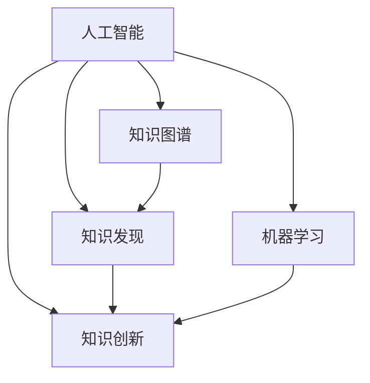

                 

# 推动知识发现与创新：人类计算的智力贡献

> 关键词：人工智能,机器学习,人类计算,知识图谱,知识发现,创新

## 1. 背景介绍

### 1.1 问题由来

随着人工智能（AI）技术的迅猛发展，人类计算正逐渐从依赖机械重复劳动转变为依赖智能算法进行知识发现和创新。这一转变不仅提高了工作效率，也开辟了新的研究领域，例如：自然语言处理（NLP）、计算机视觉（CV）、机器人学等。然而，尽管AI能够处理大量数据并生成结果，但真正的智能创新仍然依赖于人类的智慧与经验。

### 1.2 问题核心关键点

人类计算的核心在于结合人类的逻辑思维与算法的计算能力。通过AI辅助进行知识图谱构建、数据挖掘、预测分析等，人类计算能够更好地实现信息获取与知识创新。但这一过程同样存在瓶颈与挑战，例如：

- 知识图谱构建：需要大量的领域知识，且构建过程复杂繁琐。
- 数据质量与数据量：高质量的数据是AI算法发挥作用的前提。
- 算法的透明性与可解释性：AI模型的决策过程难以直观理解。
- 创新的难易程度：人类计算中知识创新的过程往往面临“维特根斯坦困境”，即某些问题难以用现有概念和语言来表达。

### 1.3 问题研究意义

研究人类计算的智力贡献，对于拓展AI在知识发现与创新方面的能力、提高人类工作效率、促进多学科融合具有重要意义：

1. 提高工作效率：AI可以处理大量数据，快速识别知识图谱中的模式与关联，助力快速决策。
2. 促进知识融合：AI能够跨领域提取知识，提供更全面的视角。
3. 加速创新：AI可以模拟不同情境，预测未来趋势，为创新提供新思路。
4. 助力多学科融合：AI的跨领域学习能力能够促进不同学科的交叉研究。
5. 推动产业升级：AI驱动的智能计算成为各行各业升级转型的重要推动力。

## 2. 核心概念与联系

### 2.1 核心概念概述

为更好地理解人类计算在知识发现与创新中的作用，本节将介绍几个密切相关的核心概念：

- **人工智能（AI）**：通过机器学习等技术，使计算机模拟人类智能行为的领域。
- **机器学习（ML）**：指使用数据和算法，使计算机从经验中学习并提高性能的过程。
- **知识图谱（KG）**：一种结构化的知识表示方式，由节点和边组成，用于描述实体与实体之间的关系。
- **知识发现（KD）**：通过数据分析、数据挖掘等技术，从数据中发现有价值的信息的过程。
- **知识创新（KI）**：通过整合、提炼、推理等过程，生成新的知识或应用。

这些核心概念之间的逻辑关系可以通过以下Mermaid流程图来展示：



这个流程图展示了几大核心概念之间的联系：

1. 人工智能通过机器学习等技术实现。
2. 机器学习利用知识图谱进行数据挖掘和分析。
3. 知识发现是知识创新的基础，创新则是发现的最终目的。
4. 知识图谱通过机器学习构建，同时支撑知识发现和创新。

## 3. 核心算法原理 & 具体操作步骤

### 3.1 算法原理概述

人类计算的智力贡献主要体现在以下几个方面：

- **数据预处理**：清洗、标注、分词等预处理步骤，使数据适合输入到AI模型中。
- **特征提取**：使用TF-IDF、Word2Vec等技术将文本转换为数字向量，便于机器学习。
- **模型训练**：基于机器学习算法，如SVM、RNN、Transformer等，训练知识图谱模型。
- **推理与分析**：利用图神经网络（GNN）等技术，在知识图谱上进行关系推理，发现潜在知识。
- **知识可视化**：使用可视化工具，如Gephi、Cytoscape等，展现知识图谱的结构与关系。

### 3.2 算法步骤详解

以下详细讲解人类计算的智力贡献在知识发现与创新中的算法步骤：

**Step 1: 数据预处理**

1. **数据收集**：从不同来源收集数据，例如学术论文、网页、专利等。
2. **数据清洗**：去除噪声、重复数据，修正错误。
3. **数据标注**：为数据打上标签，例如分类、实体识别等。
4. **分词与向量化**：将文本数据进行分词，并使用词向量模型（如Word2Vec、GloVe等）将其转换为向量。

**Step 2: 特征提取**

1. **TF-IDF**：计算词频和逆文档频率，提取关键词。
2. **Word2Vec**：使用神经网络模型将单词转换为向量。
3. **BERT嵌入**：利用预训练的BERT模型提取文本特征。

**Step 3: 模型训练**

1. **图嵌入算法**：如节点2Vec，用于构建知识图谱的节点嵌入。
2. **图神经网络（GNN）**：如GCN，用于在知识图谱上进行关系推理。
3. **生成对抗网络（GAN）**：用于生成新的知识或应用。

**Step 4: 推理与分析**

1. **实体链接**：将孤立的知识片段链接起来，构建完整的知识图谱。
2. **关系推理**：利用GNN等技术，对知识图谱中的关系进行推理。
3. **知识抽取**：从知识图谱中抽取出有价值的知识，例如实体、属性、关系等。

**Step 5: 知识可视化**

1. **图形绘制**：使用Gephi、Cytoscape等工具，将知识图谱绘制成图形。
2. **交互式展示**：支持交互式查询和筛选，便于用户发现新知识。

### 3.3 算法优缺点

人类计算在知识发现与创新中的算法具有以下优点：

1. **高效性**：算法能够自动化地处理大量数据，提高工作效率。
2. **精度高**：基于机器学习的算法能够从数据中提取高精度的知识。
3. **可扩展性**：算法能够处理多领域、多类型的数据。

同时，这些算法也存在一些局限性：

1. **数据依赖性强**：算法的性能依赖于数据的质量和量。
2. **算法复杂度高**：构建复杂的数据模型需要大量计算资源。
3. **可解释性不足**：算法的决策过程难以直观理解。
4. **知识偏见**：算法可能会学习到数据中的偏见，影响结果公正性。

### 3.4 算法应用领域

人类计算的智力贡献在多个领域中得到了应用，例如：

1. **生物信息学**：通过分析基因序列、蛋白质结构等数据，发现新的生物知识。
2. **金融分析**：利用机器学习模型预测股市走势、客户行为等。
3. **社会网络分析**：研究社交网络中的人际关系，发现新的社会现象。
4. **推荐系统**：利用知识图谱进行个性化推荐，提升用户体验。
5. **医疗诊断**：通过知识图谱辅助医生进行诊断，提高诊断准确性。

## 4. 数学模型和公式 & 详细讲解  
### 4.1 数学模型构建

本节将使用数学语言对人类计算在知识发现与创新中的算法进行更加严格的刻画。

记数据集为 $D=\{(x_i,y_i)\}_{i=1}^N$，其中 $x_i$ 为输入，$y_i$ 为标签。假设知识图谱由节点 $V$ 和边 $E$ 构成，节点的特征向量为 $\textbf{h}_v$，边的特征向量为 $\textbf{h}_e$。

定义知识图谱的嵌入函数为 $f$，训练目标为最小化损失函数 $\mathcal{L}$：

$$
\mathcal{L} = \sum_{(i,j) \in E} \text{dist}(\textbf{h}_i, \textbf{h}_j)
$$

其中 $\text{dist}$ 表示节点 $i$ 和节点 $j$ 之间的距离度量。

### 4.2 公式推导过程

以知识图谱的嵌入函数为例，推导基于GNN的知识图谱嵌入公式。

设节点 $v_i$ 与节点 $v_j$ 相连，则它们的边特征向量为 $\textbf{h}_{ij}$。根据GNN的原理，节点 $v_i$ 的嵌入向量 $\textbf{h}_i^{(t+1)}$ 可以表示为：

$$
\textbf{h}_i^{(t+1)} = \sigma\left(\sum_{j \in N_i^{(t)}} \textbf{h}_j^{(t)} \cdot \textbf{h}_{ij} \right)
$$

其中 $N_i^{(t)}$ 表示节点 $i$ 在 $t$ 时刻的邻居节点集合，$\sigma$ 为激活函数（如ReLU）。

通过多轮迭代，最终得到节点 $v_i$ 的嵌入向量 $\textbf{h}_i$。

### 4.3 案例分析与讲解

假设有一个知识图谱，包含科技领域的论文、发明人和专利之间的关系。使用GNN对节点进行嵌入，可以得到每个节点的低维向量表示。通过计算节点之间的距离，可以发现新的知识关系，例如：

1. **相似的论文**：通过计算论文向量之间的距离，找到引文关系，发现高影响力的论文。
2. **同领域的发明人**：通过计算发明人向量之间的距离，找到合作者或潜在的研究伙伴。
3. **相关的专利**：通过计算专利向量之间的距离，发现技术创新路径和应用场景。

## 5. 项目实践：代码实例和详细解释说明
### 5.1 开发环境搭建

在进行项目实践前，我们需要准备好开发环境。以下是使用Python进行PyTorch开发的环境配置流程：

1. 安装Anaconda：从官网下载并安装Anaconda，用于创建独立的Python环境。

2. 创建并激活虚拟环境：
```bash
conda create -n pytorch-env python=3.8 
conda activate pytorch-env
```

3. 安装PyTorch：根据CUDA版本，从官网获取对应的安装命令。例如：
```bash
conda install pytorch torchvision torchaudio cudatoolkit=11.1 -c pytorch -c conda-forge
```

4. 安装Transformers库：
```bash
pip install transformers
```

5. 安装各类工具包：
```bash
pip install numpy pandas scikit-learn matplotlib tqdm jupyter notebook ipython
```

完成上述步骤后，即可在`pytorch-env`环境中开始项目实践。

### 5.2 源代码详细实现

这里我们以知识图谱的构建与嵌入为例，给出使用PyTorch进行知识图谱建模的代码实现。

首先，定义知识图谱的数据结构：

```python
from pygnn.data import GraphDataset
from pytorch_geometric.utils import to_networkx

class KnowledgeGraphDataset(GraphDataset):
    def __init__(self, data_path):
        super(KnowledgeGraphDataset, self).__init__(data_path)
        self.data = torch.load(data_path)

    def __len__(self):
        return len(self.data)

    def __getitem__(self, idx):
        data = self.data[idx]
        return data['adj'], data['feat'], data['label']
```

然后，定义知识图谱的嵌入函数：

```python
from pygcn.nn import GCNConv
from pygcn.nn import GNNConv

class GNNEmbeddingModel(nn.Module):
    def __init__(self, num_nodes, num_features, num_layers):
        super(GNNEmbeddingModel, self).__init__()
        self.layers = nn.ModuleList()
        self.layers.append(GCNConv(num_features, 128))
        for _ in range(num_layers - 2):
            self.layers.append(GCNConv(128, 128))
        self.layers.append(GCNConv(128, num_features))

    def forward(self, adj, feat):
        h = feat
        for layer in self.layers:
            h = layer(adj, h)
        return h
```

最后，启动模型训练与推理：

```python
from pygcn.nn import GCNConv
from pygcn.nn import GNNConv

model = GNNEmbeddingModel(num_nodes, num_features, num_layers)

optimizer = Adam(model.parameters(), lr=0.01)

for epoch in range(num_epochs):
    for batch_idx, (adj, feat, label) in enumerate(dataloader):
        optimizer.zero_grad()
        output = model(adj, feat)
        loss = F.cross_entropy(output, label)
        loss.backward()
        optimizer.step()
        print(f'Epoch {epoch+1}, Batch {batch_idx+1}, Loss: {loss:.4f}')
```

以上就是使用PyTorch进行知识图谱建模的完整代码实现。可以看到，PyTorch提供了强大的自动化框架，使得模型的构建与训练变得简单高效。

### 5.3 代码解读与分析

让我们再详细解读一下关键代码的实现细节：

**KnowledgeGraphDataset类**：
- `__init__`方法：初始化数据路径和数据集结构。
- `__len__`方法：返回数据集的长度。
- `__getitem__`方法：获取指定索引的数据。

**GNNEmbeddingModel类**：
- `__init__`方法：定义模型的层次结构。
- `forward`方法：定义前向传播过程。

**模型训练**：
- 使用PyTorch的DataLoader对数据集进行批次化加载。
- 定义损失函数和优化器。
- 在每个epoch和每个batch中，进行前向传播、计算损失、反向传播和参数更新。
- 使用内置函数打印训练过程中的损失。

## 6. 实际应用场景

### 6.1 智能医疗

基于人类计算的知识发现与创新，智能医疗系统能够实现个性化医疗、精准诊疗、智能诊断等功能。例如，通过分析大量电子病历数据，构建知识图谱，辅助医生诊断疾病，制定个性化治疗方案，提升医疗服务的精准度和效率。

具体而言，可以采用基于深度学习的网络结构，对医疗数据进行预处理，构建知识图谱，并在图神经网络中进行关系推理，发现潜在知识。例如，通过计算疾病和症状之间的关系，识别出新的疾病特征，指导诊断和治疗。

### 6.2 金融风控

在金融风控领域，人类计算的知识发现与创新能够实现风险预警、信用评估、欺诈检测等功能。例如，通过分析金融交易数据，构建知识图谱，利用图神经网络进行关系推理，发现潜在的风险点，提前预警风险。

具体而言，可以采用基于深度学习的网络结构，对金融交易数据进行预处理，构建知识图谱，并在图神经网络中进行关系推理，发现潜在的欺诈行为和风险点。例如，通过计算交易和交易者之间的关系，识别出异常交易行为，提前预警潜在的欺诈风险。

### 6.3 智能交通

在智能交通领域，人类计算的知识发现与创新能够实现交通流量预测、路线规划、事故预防等功能。例如，通过分析交通数据，构建知识图谱，利用图神经网络进行关系推理，发现潜在的交通风险点，优化交通管理。

具体而言，可以采用基于深度学习的网络结构，对交通数据进行预处理，构建知识图谱，并在图神经网络中进行关系推理，发现潜在的交通风险点，优化交通管理。例如，通过计算交通事件和交通流之间的关系，识别出潜在的交通堵塞点，提前预警交通堵塞风险。

## 7. 工具和资源推荐

### 7.1 学习资源推荐

为了帮助开发者系统掌握人类计算在知识发现与创新中的理论基础和实践技巧，这里推荐一些优质的学习资源：

1. 《深度学习理论与实践》系列博文：由大模型技术专家撰写，深入浅出地介绍了深度学习的基本概念和算法。

2. 《图神经网络：深度学习在图数据上的应用》书籍：介绍图神经网络的基本原理和应用，是图谱构建的重要参考。

3. 《知识图谱与语义搜索》课程：斯坦福大学开设的深度学习课程，涵盖知识图谱构建、语义搜索等知识。

4. 《Python深度学习》书籍：介绍使用Python进行深度学习的实践技巧，包括模型的构建和优化。

5. Weights & Biases：模型训练的实验跟踪工具，可以记录和可视化模型训练过程中的各项指标，方便对比和调优。

通过对这些资源的学习实践，相信你一定能够快速掌握人类计算在知识发现与创新中的精髓，并用于解决实际的NLP问题。

### 7.2 开发工具推荐

高效的开发离不开优秀的工具支持。以下是几款用于知识图谱构建与推理开发的常用工具：

1. PyTorch：基于Python的开源深度学习框架，灵活动态的计算图，适合快速迭代研究。

2. TensorFlow：由Google主导开发的开源深度学习框架，生产部署方便，适合大规模工程应用。

3. Transformers库：HuggingFace开发的NLP工具库，集成了众多SOTA语言模型，支持PyTorch和TensorFlow，是进行知识图谱构建的重要工具。

4. Gephi：开源的图形可视化工具，支持复杂网络分析，帮助可视化知识图谱。

5. NetworkX：Python的图形处理库，支持图数据结构和算法，方便构建和分析知识图谱。

6. Cypher：Apache TinkerPop标准下的图形处理库，支持图数据结构和算法，方便构建和分析知识图谱。

合理利用这些工具，可以显著提升知识图谱构建与推理任务的开发效率，加快创新迭代的步伐。

### 7.3 相关论文推荐

人类计算在知识发现与创新中的应用源于学界的持续研究。以下是几篇奠基性的相关论文，推荐阅读：

1. Graph Neural Networks：提出图神经网络的基本框架，用于处理图结构数据。

2. Knowledge-Graph-Embedding：介绍知识图谱嵌入的基本原理，用于提取图谱中的潜在知识。

3. Attention-based Deep Graph Neural Networks：提出基于注意力机制的图神经网络，用于提高图谱推理的准确性。

4. Deep Attentive Recommendation Network：提出基于注意力机制的推荐系统，用于个性化推荐。

5. Attention-based Neural Machine Translation：提出基于注意力机制的机器翻译模型，用于自然语言处理。

这些论文代表了大模型在知识发现与创新中的研究进展，通过学习这些前沿成果，可以帮助研究者把握学科前进方向，激发更多的创新灵感。

## 8. 总结：未来发展趋势与挑战

### 8.1 总结

本文对人类计算在知识发现与创新中的作用进行了全面系统的介绍。首先阐述了人类计算的原理和应用场景，明确了其在提升知识获取与创新能力方面的独特价值。其次，从原理到实践，详细讲解了知识图谱构建与推理的数学原理和关键步骤，给出了知识图谱构建的完整代码实例。同时，本文还广泛探讨了知识图谱在医疗、金融、交通等诸多领域的应用前景，展示了人类计算在实际应用中的巨大潜力。此外，本文精选了知识图谱构建的相关资源，力求为读者提供全方位的技术指引。

通过本文的系统梳理，可以看到，人类计算在知识发现与创新中发挥着至关重要的作用。未来，随着算法的不断演进和数据量的持续增加，知识图谱的应用将变得更加广泛和深入，推动多学科的交叉融合与创新发展。

### 8.2 未来发展趋势

展望未来，知识图谱的构建与推理技术将呈现以下几个发展趋势：

1. 数据规模不断增大。随着大数据技术的发展，数据量将持续增长，知识图谱的覆盖范围将进一步扩大。

2. 算法模型日益完善。图神经网络等技术将不断优化，提高知识推理的准确性和鲁棒性。

3. 知识图谱的应用领域扩大。知识图谱将应用于更多领域，例如自然语言处理、图像识别、音乐推荐等。

4. 多模态知识融合。知识图谱将与多模态数据结合，实现视觉、语音等多模态信息的协同建模。

5. 智能化的图谱构建。借助自动化工具和深度学习技术，构建知识图谱的过程将更加高效和准确。

以上趋势凸显了知识图谱技术的广阔前景。这些方向的探索发展，将进一步提升知识图谱的应用范围和效果，为人工智能技术的多领域融合提供有力支持。

### 8.3 面临的挑战

尽管知识图谱技术已经取得了显著成就，但在迈向更加智能化、普适化应用的过程中，它仍面临诸多挑战：

1. 数据质量问题。知识图谱的构建依赖于高质量的数据，但数据获取和标注的难度较大。

2. 数据多样性。不同领域的知识图谱结构差异较大，难以实现统一的建模和推理。

3. 模型复杂性。知识图谱的构建和推理算法复杂，需要高效的计算资源和数据处理能力。

4. 知识偏见。知识图谱可能学习到数据中的偏见，影响模型的公正性和公平性。

5. 推理效率。知识图谱的推理过程需要处理大量的图数据，推理效率较低。

6. 隐私保护。知识图谱的构建和应用过程中，需要保护用户隐私和数据安全。

这些挑战需要跨学科的合作和持续的研究创新，以推动知识图谱技术向更加智能化、普适化的方向发展。

### 8.4 研究展望

未来，知识图谱的研究将集中在以下几个方向：

1. 数据质量提升。采用更高效的自动标注方法和数据清洗技术，提升数据质量。

2. 模型优化与训练。开发更高效的图神经网络算法，优化知识图谱的推理过程。

3. 知识偏见消除。引入先验知识，减少数据中的偏见影响，提高模型的公平性。

4. 多模态融合。探索多模态数据的融合方法，提高知识图谱的泛化能力和应用范围。

5. 隐私保护与伦理规范。建立知识图谱构建与应用过程中的隐私保护和伦理规范机制，确保数据安全。

这些研究方向将推动知识图谱技术的进步，促进其在更多领域的应用，为人类计算的智力贡献提供更广阔的空间。

## 9. 附录：常见问题与解答

**Q1：知识图谱的构建和推理过程是否需要大规模数据集？**

A: 知识图谱的构建和推理过程需要大规模数据集作为支撑。高质量的数据集是构建知识图谱的前提，同时推理过程也需要大量的图数据支持。尽管一些自动化的知识图谱构建方法能够一定程度上减少人工标注的工作量，但高质量的数据仍然必不可少。

**Q2：知识图谱的推理过程是否需要复杂的计算资源？**

A: 知识图谱的推理过程确实需要复杂的计算资源。图神经网络等模型需要对大量的图数据进行并行计算，推理过程复杂度较高。同时，一些高级的推理算法（如推理机）也需要大量的计算资源支持。但随着硬件技术的发展和算法的优化，这些挑战正在逐步得到解决。

**Q3：知识图谱在实际应用中是否需要考虑隐私保护？**

A: 知识图谱在实际应用中确实需要考虑隐私保护。知识图谱的构建和应用过程中，需要保护用户的隐私和数据安全。例如，在医疗领域，需要保护患者病历信息的隐私，避免数据泄露。在金融领域，需要保护用户的交易信息，避免数据被滥用。因此，隐私保护是知识图谱应用中必须考虑的一个重要问题。

**Q4：知识图谱在实际应用中是否需要考虑伦理规范？**

A: 知识图谱在实际应用中确实需要考虑伦理规范。知识图谱的应用涉及伦理、隐私、公平性等多个方面，需要建立合理的伦理规范和监管机制。例如，在医疗领域，知识图谱的应用需要遵守医学伦理规范，避免误诊误治。在金融领域，知识图谱的应用需要遵守数据隐私法规，确保数据使用合规。因此，伦理规范是知识图谱应用中必须考虑的一个重要问题。

**Q5：知识图谱在实际应用中是否需要考虑计算效率？**

A: 知识图谱在实际应用中确实需要考虑计算效率。知识图谱的构建和推理过程复杂，需要高效的计算资源支持。例如，在医疗领域，需要快速构建和推理知识图谱，以辅助医生诊断。在金融领域，需要快速推理交易图谱，及时发现潜在的风险点。因此，计算效率是知识图谱应用中必须考虑的一个重要问题。

通过本文的系统梳理，可以看到，知识图谱技术在知识发现与创新中发挥着至关重要的作用。未来，随着算法的不断演进和数据量的持续增加，知识图谱的应用将变得更加广泛和深入，推动多学科的交叉融合与创新发展。相信随着技术的不断发展，知识图谱技术将成为人类计算中不可或缺的一部分，为人工智能技术的进步提供坚实的基础。

