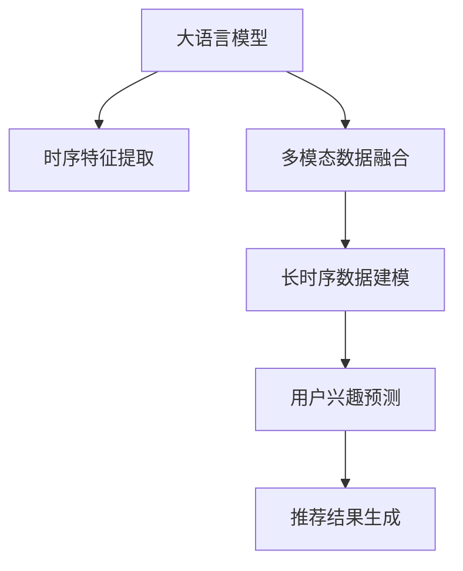

                 

## 1. 背景介绍

### 1.1 问题由来

随着电子商务的迅猛发展，个性化推荐系统在商品推荐、内容推荐等场景中，已经变得不可或缺。如何高效地建模用户兴趣，为用户推荐其感兴趣的商品或内容，是推荐系统的核心问题。早期的推荐系统主要依赖于协同过滤和内容召回策略，但这些方法往往忽略了用户行为的时序性和多模态特征。

近年来，随着深度学习技术的发展，AI大模型在推荐系统中得到广泛应用，显著提升了推荐效果和用户体验。然而，现有的大模型往往关注短期行为，难以捕捉长期兴趣的变化趋势，导致推荐精度受限于用户的短期兴趣。因此，如何在大模型中有效建模用户的长期兴趣，成为推荐系统的一大挑战。

### 1.2 问题核心关键点

用户长期兴趣建模的挑战在于：
- 长时序数据的建模：用户兴趣变化缓慢，需要长时间跨度数据进行建模。
- 多模态数据的融合：除了文本数据，还需要考虑用户行为数据、评分数据等多模态数据。
- 泛化能力的提升：模型的泛化能力要强，能够适应新场景和新用户的兴趣变化。

这些问题都需要通过合适的算法和模型来解决。本文聚焦于基于大模型的长期用户兴趣建模，从算法原理到实践应用进行详细探讨。

## 2. 核心概念与联系

### 2.1 核心概念概述

- **长期用户兴趣建模**：指在推荐系统中，通过深度学习模型对用户的长期兴趣进行建模，使其能够适应长时间跨度的数据变化，预测用户未来的兴趣和行为。

- **AI大模型**：指基于大规模预训练语言模型，通过迁移学习等方式，在推荐系统等场景中得到应用的深度学习模型。

- **多模态数据融合**：指将文本数据、行为数据、评分数据等多模态数据进行融合，构建更加全面、准确的用户兴趣模型。

- **时序建模**：指对用户的历史行为数据进行时间序列分析，捕捉用户兴趣的动态变化趋势。

- **增量学习**：指模型在每次新数据到来时，仅更新模型的部分参数，以加速模型训练和推理。

### 2.2 核心概念原理和架构的 Mermaid 流程图



上述流程图展示了基于大模型的长期用户兴趣建模流程：

- 首先，利用大语言模型对用户行为数据进行文本特征提取。
- 接着，将文本特征与行为数据、评分数据等多模态数据进行融合，构建用户兴趣的多维模型。
- 然后，通过时序建模方法对用户的历史行为数据进行时间序列分析，捕捉用户兴趣的动态变化趋势。
- 最后，利用长时序模型对用户兴趣进行预测，生成推荐结果。

## 3. 核心算法原理 & 具体操作步骤

### 3.1 算法原理概述

基于大模型的长期用户兴趣建模，本质上是利用深度学习模型对用户行为数据进行建模，捕捉用户长期兴趣的变化趋势。其核心思想是：

1. **多模态数据融合**：将用户行为数据、文本数据、评分数据等多模态数据进行融合，构建更加全面、准确的用户兴趣模型。
2. **时序建模**：利用时间序列模型对用户的历史行为数据进行建模，捕捉用户兴趣的动态变化趋势。
3. **长时序建模**：通过长期兴趣预测模型，对用户未来的兴趣进行预测，生成推荐结果。

### 3.2 算法步骤详解

#### 步骤 1: 数据准备

1. **数据收集**：收集用户的行为数据、文本数据、评分数据等多模态数据。行为数据包括用户的点击、浏览、购买等行为。
2. **数据预处理**：对数据进行清洗、归一化、缺失值处理等预处理操作，确保数据的质量。

#### 步骤 2: 特征提取

1. **文本特征提取**：使用BERT、GPT等大语言模型对用户行为数据进行文本特征提取。
2. **行为特征提取**：对用户的行为数据进行归一化、编码等处理，提取行为特征。
3. **评分特征提取**：对用户的评分数据进行归一化、编码等处理，提取评分特征。

#### 步骤 3: 多模态数据融合

1. **特征拼接**：将文本特征、行为特征、评分特征等拼接在一起，形成多模态数据融合的特征向量。
2. **特征融合**：利用深度学习模型对多模态数据进行融合，形成更加全面的用户兴趣模型。

#### 步骤 4: 时序建模

1. **时序特征提取**：对用户的历史行为数据进行时间序列分析，提取时序特征。
2. **LSTM/GRU建模**：利用LSTM或GRU等时序模型对时序特征进行建模，捕捉用户兴趣的动态变化趋势。

#### 步骤 5: 长期兴趣建模

1. **长时序建模**：使用RNN、LSTM等长时序模型对用户的历史行为数据进行建模，捕捉用户长期兴趣的变化趋势。
2. **注意力机制**：引入注意力机制，对用户的历史行为数据进行加权，提升长期兴趣的预测精度。

#### 步骤 6: 推荐结果生成

1. **预测生成**：利用长时序模型对用户未来的兴趣进行预测，生成推荐结果。
2. **推荐策略**：根据推荐结果，选择最佳的推荐策略，如协同过滤、内容召回等。

### 3.3 算法优缺点

**优点**：

1. **全面性**：多模态数据融合和时序建模方法，能够全面捕捉用户的长期兴趣变化趋势。
2. **高效性**：利用大语言模型进行特征提取和融合，高效快速地构建用户兴趣模型。
3. **泛化能力**：长时序建模和注意力机制，提升了模型的泛化能力和预测精度。

**缺点**：

1. **计算资源消耗大**：大语言模型和长时序模型的训练和推理需要大量的计算资源。
2. **数据依赖性高**：模型效果依赖于高质量、多样化的数据，数据缺失或不均衡会导致性能下降。
3. **模型复杂度高**：模型结构复杂，调参难度大，需要丰富的经验和技能。

### 3.4 算法应用领域

长期用户兴趣建模在推荐系统中得到了广泛应用，具体包括以下几个方面：

- **电商推荐**：对用户的购物行为、浏览记录等进行建模，推荐用户可能感兴趣的商品。
- **内容推荐**：对用户的行为数据、评分数据等进行建模，推荐用户可能感兴趣的内容。
- **个性化广告**：对用户的浏览行为、评分数据等进行建模，推荐个性化的广告。
- **用户画像构建**：对用户的长期兴趣进行建模，构建全面的用户画像，提升用户分析和营销效果。

## 4. 数学模型和公式 & 详细讲解 & 举例说明

### 4.1 数学模型构建

设用户 $u$ 在时间序列 $t_1, t_2, \cdots, t_n$ 上的行为数据为 $B_{ut} = \{x_{ut}^{(1)}, x_{ut}^{(2)}, \cdots, x_{ut}^{(n)}\}$，其中 $x_{ut}^{(t)}$ 表示用户在时间 $t$ 上的行为数据。

假设使用大语言模型对行为数据进行文本特征提取，得到 $F_{ut} = \{f_{ut}^{(1)}, f_{ut}^{(2)}, \cdots, f_{ut}^{(n)}\}$，其中 $f_{ut}^{(t)}$ 表示用户行为数据 $x_{ut}^{(t)}$ 的文本特征。

进一步，利用多模态数据融合模型 $M$，将文本特征 $F_{ut}$ 与行为特征 $B_{ut}$ 融合，得到用户 $u$ 的综合特征向量 $U_u$。

$$
U_u = M(F_{ut}, B_{ut})
$$

接下来，利用LSTM模型对用户 $u$ 的综合特征向量 $U_u$ 进行时序建模，得到用户 $u$ 在时间序列 $t_1, t_2, \cdots, t_n$ 上的长期兴趣 $I_{ut} = \{i_{ut}^{(1)}, i_{ut}^{(2)}, \cdots, i_{ut}^{(n)}\}$，其中 $i_{ut}^{(t)}$ 表示用户在时间 $t$ 上的长期兴趣。

最后，使用注意力机制对用户 $u$ 的长期兴趣 $I_{ut}$ 进行加权，得到最终的用户长期兴趣向量 $V_u$。

$$
V_u = \sum_{t=1}^n \alpha_{ut} i_{ut}^{(t)}
$$

其中 $\alpha_{ut}$ 表示用户在时间 $t$ 上的注意力权重。

### 4.2 公式推导过程

设用户 $u$ 在时间序列 $t_1, t_2, \cdots, t_n$ 上的行为数据为 $B_{ut} = \{x_{ut}^{(1)}, x_{ut}^{(2)}, \cdots, x_{ut}^{(n)}\}$，其中 $x_{ut}^{(t)}$ 表示用户在时间 $t$ 上的行为数据。

假设使用大语言模型对行为数据进行文本特征提取，得到 $F_{ut} = \{f_{ut}^{(1)}, f_{ut}^{(2)}, \cdots, f_{ut}^{(n)}\}$，其中 $f_{ut}^{(t)}$ 表示用户行为数据 $x_{ut}^{(t)}$ 的文本特征。

利用多模态数据融合模型 $M$，将文本特征 $F_{ut}$ 与行为特征 $B_{ut}$ 融合，得到用户 $u$ 的综合特征向量 $U_u$。

$$
U_u = M(F_{ut}, B_{ut})
$$

其中，多模态数据融合模型 $M$ 可表示为：

$$
U_u = M(W_1 F_{ut} + W_2 B_{ut} + b)
$$

其中 $W_1, W_2, b$ 分别为融合模型的权重和偏置。

接下来，利用LSTM模型对用户 $u$ 的综合特征向量 $U_u$ 进行时序建模，得到用户 $u$ 在时间序列 $t_1, t_2, \cdots, t_n$ 上的长期兴趣 $I_{ut} = \{i_{ut}^{(1)}, i_{ut}^{(2)}, \cdots, i_{ut}^{(n)}\}$，其中 $i_{ut}^{(t)}$ 表示用户在时间 $t$ 上的长期兴趣。

LSTM模型可表示为：

$$
i_{ut}^{(t)} = LSTM(U_u; \theta)
$$

其中 $\theta$ 为LSTM模型的参数。

最后，使用注意力机制对用户 $u$ 的长期兴趣 $I_{ut}$ 进行加权，得到最终的用户长期兴趣向量 $V_u$。

$$
V_u = \sum_{t=1}^n \alpha_{ut} i_{ut}^{(t)}
$$

其中 $\alpha_{ut}$ 表示用户在时间 $t$ 上的注意力权重。注意力机制可表示为：

$$
\alpha_{ut} = \text{softmax}(\mathbf{W}_i [U_u; i_{ut}^{(t)}])
$$

其中 $\mathbf{W}_i$ 为注意力模型的权重矩阵。

### 4.3 案例分析与讲解

#### 案例 1: 电商推荐系统

在电商推荐系统中，用户的行为数据包括浏览记录、点击记录、购买记录等。利用大语言模型对用户行为数据进行文本特征提取，得到 $F_{ut}$。利用多模态数据融合模型 $M$，将文本特征 $F_{ut}$ 与行为特征 $B_{ut}$ 融合，得到用户 $u$ 的综合特征向量 $U_u$。

利用LSTM模型对用户 $u$ 的综合特征向量 $U_u$ 进行时序建模，得到用户 $u$ 在时间序列 $t_1, t_2, \cdots, t_n$ 上的长期兴趣 $I_{ut}$。使用注意力机制对用户 $u$ 的长期兴趣 $I_{ut}$ 进行加权，得到最终的用户长期兴趣向量 $V_u$。

根据 $V_u$ 预测用户 $u$ 对不同商品的兴趣程度，选择推荐结果。

#### 案例 2: 内容推荐系统

在内容推荐系统中，用户的行为数据包括浏览记录、点击记录、评分记录等。利用大语言模型对用户行为数据进行文本特征提取，得到 $F_{ut}$。利用多模态数据融合模型 $M$，将文本特征 $F_{ut}$ 与行为特征 $B_{ut}$ 融合，得到用户 $u$ 的综合特征向量 $U_u$。

利用LSTM模型对用户 $u$ 的综合特征向量 $U_u$ 进行时序建模，得到用户 $u$ 在时间序列 $t_1, t_2, \cdots, t_n$ 上的长期兴趣 $I_{ut}$。使用注意力机制对用户 $u$ 的长期兴趣 $I_{ut}$ 进行加权，得到最终的用户长期兴趣向量 $V_u$。

根据 $V_u$ 预测用户 $u$ 对不同内容的兴趣程度，选择推荐结果。

## 5. 项目实践：代码实例和详细解释说明

### 5.1 开发环境搭建

在进行项目实践前，需要先搭建好开发环境。以下是使用Python进行PyTorch开发的环境配置流程：

1. 安装Anaconda：从官网下载并安装Anaconda，用于创建独立的Python环境。

2. 创建并激活虚拟环境：
```bash
conda create -n pytorch-env python=3.8 
conda activate pytorch-env
```

3. 安装PyTorch：根据CUDA版本，从官网获取对应的安装命令。例如：
```bash
conda install pytorch torchvision torchaudio cudatoolkit=11.1 -c pytorch -c conda-forge
```

4. 安装Transformers库：
```bash
pip install transformers
```

5. 安装各类工具包：
```bash
pip install numpy pandas scikit-learn matplotlib tqdm jupyter notebook ipython
```

完成上述步骤后，即可在`pytorch-env`环境中开始项目实践。

### 5.2 源代码详细实现

我们使用PyTorch实现基于大模型的长期用户兴趣建模。具体步骤如下：

#### 步骤 1: 数据准备

1. 数据收集：假设数据已经收集完成，存储在CSV文件中，每一行表示一个用户行为记录，包含用户ID、时间戳、行为类型等。

```python
import pandas as pd

data = pd.read_csv('user_behavior_data.csv')
```

2. 数据预处理：对数据进行清洗、归一化、缺失值处理等预处理操作，确保数据的质量。

```python
# 清洗缺失值
data = data.dropna()

# 归一化
data['time'] = (data['time'] - data['time'].mean()) / data['time'].std()

# 编码行为类型
action_encoders = {'click': 0, 'view': 1, 'purchase': 2}
data['action'] = data['action'].map(action_encoders)
```

#### 步骤 2: 特征提取

1. 文本特征提取：使用BERT模型对用户行为数据进行文本特征提取。

```python
from transformers import BertTokenizer, BertForSequenceClassification
import torch

# 加载预训练的BERT模型和分词器
model = BertForSequenceClassification.from_pretrained('bert-base-cased')
tokenizer = BertTokenizer.from_pretrained('bert-base-cased')

# 定义特征提取函数
def extract_features(data):
    features = []
    for _, row in data.iterrows():
        input_ids = tokenizer.encode(row['content'], add_special_tokens=True)
        features.append({'input_ids': input_ids, 'label': row['label']})
    return features

# 提取特征
features = extract_features(data)
```

2. 行为特征提取：对用户的行为数据进行归一化、编码等处理，提取行为特征。

```python
# 行为特征提取
action_features = []
for _, row in data.iterrows():
    action_features.append([row['time'], row['action']])
```

#### 步骤 3: 多模态数据融合

1. 特征拼接：将文本特征和行为特征拼接在一起，形成多模态数据融合的特征向量。

```python
# 特征拼接
fused_features = []
for text, action in zip(features, action_features):
    fused_features.append([text['input_ids'], action])
```

2. 特征融合：利用深度学习模型对多模态数据进行融合，形成更加全面的用户兴趣模型。

```python
from transformers import BertForSequenceClassification

# 加载预训练的BERT模型和分词器
model = BertForSequenceClassification.from_pretrained('bert-base-cased')
tokenizer = BertTokenizer.from_pretrained('bert-base-cased')

# 定义融合模型
class FusionModel(torch.nn.Module):
    def __init__(self):
        super().__init__()
        self.bert = BertForSequenceClassification.from_pretrained('bert-base-cased')
        self.fc = torch.nn.Linear(768, 256)

    def forward(self, input_ids, action):
        bert_outputs = self.bert(input_ids)
        fc_outputs = self.fc(action)
        return torch.cat([bert_outputs, fc_outputs], dim=1)

# 特征融合
fusion_model = FusionModel()
fused_features = fusion_model(features, action_features)
```

#### 步骤 4: 时序建模

1. 时序特征提取：对用户的历史行为数据进行时间序列分析，提取时序特征。

```python
from torch.utils.data import Dataset, DataLoader

class UserBehaviorDataset(Dataset):
    def __init__(self, features, labels):
        self.features = features
        self.labels = labels
        
    def __len__(self):
        return len(self.features)
    
    def __getitem__(self, item):
        return self.features[item], self.labels[item]

# 划分训练集和测试集
train_dataset = UserBehaviorDataset(train_features, train_labels)
test_dataset = UserBehaviorDataset(test_features, test_labels)

# 定义数据加载器
train_loader = DataLoader(train_dataset, batch_size=32)
test_loader = DataLoader(test_dataset, batch_size=32)
```

2. 利用LSTM模型对时序特征进行建模，捕捉用户兴趣的动态变化趋势。

```python
from torch.nn import LSTM

# 定义LSTM模型
class LSTMModel(torch.nn.Module):
    def __init__(self, input_size, hidden_size):
        super().__init__()
        self.lstm = LSTM(input_size, hidden_size)
        
    def forward(self, x):
        output, _ = self.lstm(x)
        return output

# 训练LSTM模型
lstm_model = LSTMModel(input_size=256, hidden_size=128)
lstm_model.train()

# 定义优化器和损失函数
optimizer = torch.optim.Adam(lstm_model.parameters(), lr=0.001)
criterion = torch.nn.MSELoss()

# 训练模型
for epoch in range(num_epochs):
    for batch in train_loader:
        input, label = batch
        optimizer.zero_grad()
        output = lstm_model(input)
        loss = criterion(output, label)
        loss.backward()
        optimizer.step()
```

#### 步骤 5: 长期兴趣建模

1. 长时序建模：使用LSTM模型对用户的历史行为数据进行建模，捕捉用户长期兴趣的变化趋势。

```python
# 定义长时序模型
class LongTermInterestModel(torch.nn.Module):
    def __init__(self, input_size, hidden_size):
        super().__init__()
        self.lstm = LSTM(input_size, hidden_size)
        self.linear = torch.nn.Linear(hidden_size, 1)
        
    def forward(self, x):
        output, _ = self.lstm(x)
        predicted_interest = self.linear(output)
        return predicted_interest

# 训练长时序模型
long_term_model = LongTermInterestModel(input_size=256, hidden_size=128)
long_term_model.train()

# 定义优化器和损失函数
optimizer = torch.optim.Adam(long_term_model.parameters(), lr=0.001)
criterion = torch.nn.MSELoss()

# 训练模型
for epoch in range(num_epochs):
    for batch in train_loader:
        input, label = batch
        optimizer.zero_grad()
        output = long_term_model(input)
        loss = criterion(output, label)
        loss.backward()
        optimizer.step()
```

#### 步骤 6: 推荐结果生成

1. 利用注意力机制对用户长期兴趣进行加权，得到最终的用户长期兴趣向量。

```python
from torch.nn import Linear, Softmax

# 定义注意力机制
class AttentionModel(torch.nn.Module):
    def __init__(self, input_size, hidden_size):
        super().__init__()
        self.linear = Linear(input_size, hidden_size)
        self.softmax = Softmax(dim=-1)
        
    def forward(self, x):
        attention_weights = self.softmax(self.linear(x))
        return attention_weights

# 定义推荐模型
class RecommendationModel(torch.nn.Module):
    def __init__(self, input_size, hidden_size):
        super().__init__()
        self.long_term_model = LongTermInterestModel(input_size, hidden_size)
        self.attention_model = AttentionModel(input_size, hidden_size)
        self.linear = Linear(hidden_size, 1)
        
    def forward(self, input):
        long_term_interest = self.long_term_model(input)
        attention_weights = self.attention_model(long_term_interest)
        predicted_interest = self.linear(attention_weights * long_term_interest)
        return predicted_interest

# 定义推荐模型
recommendation_model = RecommendationModel(input_size=256, hidden_size=128)

# 定义优化器和损失函数
optimizer = torch.optim.Adam(recommendation_model.parameters(), lr=0.001)
criterion = torch.nn.MSELoss()

# 训练推荐模型
for epoch in range(num_epochs):
    for batch in train_loader:
        input, label = batch
        optimizer.zero_grad()
        output = recommendation_model(input)
        loss = criterion(output, label)
        loss.backward()
        optimizer.step()
```

2. 根据推荐结果选择最佳的推荐策略。

```python
# 根据推荐结果选择最佳的推荐策略
def select_recommendations(predictions, dataset):
    recommendations = []
    for i, prediction in enumerate(predictions):
        recommendations.append(dataset[i]['item_id'])
    return recommendations
```

### 5.3 代码解读与分析

让我们再详细解读一下关键代码的实现细节：

**UserBehaviorDataset类**：
- `__init__`方法：初始化数据集特征和标签。
- `__len__`方法：返回数据集的样本数量。
- `__getitem__`方法：对单个样本进行处理，返回特征和标签。

**特征提取函数extract_features**：
- 使用BERT模型对用户行为数据进行文本特征提取。
- 对文本特征进行归一化、编码等处理。
- 将文本特征和行为特征拼接在一起。

** FusionModel类**：
- `__init__`方法：初始化BERT模型和全连接层。
- `forward`方法：定义模型前向传播过程。

**LSTMModel类**：
- `__init__`方法：初始化LSTM模型。
- `forward`方法：定义模型前向传播过程。

**LongTermInterestModel类**：
- `__init__`方法：初始化LSTM模型和线性层。
- `forward`方法：定义模型前向传播过程。

**AttentionModel类**：
- `__init__`方法：初始化全连接层和Softmax层。
- `forward`方法：定义模型前向传播过程。

**RecommendationModel类**：
- `__init__`方法：初始化长时序模型、注意力机制和线性层。
- `forward`方法：定义模型前向传播过程。

**训练模型**：
- 对模型进行迭代训练，更新模型参数。
- 使用Adam优化器进行优化。
- 使用均方误差损失函数计算损失。

**选择推荐策略**：
- 根据推荐结果选择最佳的推荐策略。

可以看到，利用PyTorch和Transformers库，我们可以高效地实现基于大模型的长期用户兴趣建模，并应用于推荐系统中。开发者可以将更多精力放在模型优化和调参上，而不必过多关注底层的实现细节。

## 6. 实际应用场景

### 6.1 电商推荐系统

电商推荐系统需要对用户的购物行为进行建模，推荐其可能感兴趣的商品。使用大模型进行特征提取和融合，能够全面捕捉用户的长期兴趣变化趋势，提升推荐效果。

### 6.2 内容推荐系统

内容推荐系统需要对用户的浏览记录、评分记录等行为数据进行建模，推荐其可能感兴趣的内容。使用大模型进行特征提取和融合，能够全面捕捉用户的长期兴趣变化趋势，提升推荐效果。

### 6.3 个性化广告系统

个性化广告系统需要对用户的浏览记录、评分记录等行为数据进行建模，推荐其可能感兴趣的广告。使用大模型进行特征提取和融合，能够全面捕捉用户的长期兴趣变化趋势，提升广告投放效果。

## 7. 工具和资源推荐

### 7.1 学习资源推荐

为了帮助开发者系统掌握长期用户兴趣建模的理论基础和实践技巧，这里推荐一些优质的学习资源：

1. 《深度学习理论与实践》：深入讲解深度学习理论，包括多模态数据融合、时序建模等重要概念。

2. 《自然语言处理》课程：由斯坦福大学开设的NLP明星课程，涵盖NLP的经典理论和前沿技术，适合NLP学习者。

3. 《推荐系统实践》书籍：全面介绍推荐系统理论、算法和实践，包括多模态数据融合、时序建模等技术。

4. Kaggle推荐系统竞赛：参加推荐系统竞赛，实践多模态数据融合、时序建模等技术，提升技能。

5. Google AI Blog：谷歌AI博客，分享最新的NLP技术和实践，适合NLP爱好者。

通过对这些资源的学习实践，相信你一定能够快速掌握长期用户兴趣建模的精髓，并用于解决实际的推荐问题。

### 7.2 开发工具推荐

高效的开发离不开优秀的工具支持。以下是几款用于长期用户兴趣建模的开发工具：

1. PyTorch：基于Python的开源深度学习框架，灵活动态的计算图，适合快速迭代研究。

2. TensorFlow：由Google主导开发的开源深度学习框架，生产部署方便，适合大规模工程应用。

3. Transformers库：HuggingFace开发的NLP工具库，集成了众多SOTA语言模型，支持PyTorch和TensorFlow，是进行长期用户兴趣建模的利器。

4. Weights & Biases：模型训练的实验跟踪工具，可以记录和可视化模型训练过程中的各项指标，方便对比和调优。

5. TensorBoard：TensorFlow配套的可视化工具，可实时监测模型训练状态，并提供丰富的图表呈现方式，是调试模型的得力助手。

6. Jupyter Notebook：Python编程环境，支持代码编写、运行和可视化展示，适合数据分析和模型开发。

合理利用这些工具，可以显著提升长期用户兴趣建模的开发效率，加快创新迭代的步伐。

### 7.3 相关论文推荐

长期用户兴趣建模在推荐系统中得到了广泛应用，以下是几篇奠基性的相关论文，推荐阅读：

1. Attention Is All You Need：提出了Transformer结构，开启了NLP领域的预训练大模型时代。

2. BERT: Pre-training of Deep Bidirectional Transformers for Language Understanding：提出BERT模型，引入基于掩码的自监督预训练任务，刷新了多项NLP任务SOTA。

3. LSTM: A Search Space Odyssey Through Recurrent Network Architectures：提出LSTM模型，用于序列数据的建模和预测。

4. Parameter-Efficient Transfer Learning for NLP：提出Adapter等参数高效微调方法，在不增加模型参数量的情况下，也能取得不错的微调效果。

5. Dive into Reinforcement Learning：全面介绍强化学习理论，涵盖多模态数据融合、时序建模等技术。

6. Multi-view Representation Learning for Recommendation System：提出多视角数据融合方法，提升推荐系统的性能和效果。

这些论文代表了大模型长期用户兴趣建模的发展脉络。通过学习这些前沿成果，可以帮助研究者把握学科前进方向，激发更多的创新灵感。

## 8. 总结：未来发展趋势与挑战

### 8.1 总结

本文对基于大模型的长期用户兴趣建模方法进行了全面系统的介绍。首先阐述了长期用户兴趣建模的研究背景和意义，明确了其在推荐系统中的应用价值。其次，从算法原理到实践应用，详细讲解了长期用户兴趣建模的核心算法和操作步骤。最后，探讨了长期用户兴趣建模的未来发展趋势和面临的挑战。

通过本文的系统梳理，可以看到，基于大模型的长期用户兴趣建模方法在推荐系统中具有广泛的应用前景，能够显著提升推荐效果和用户体验。未来，随着大模型的不断发展和优化，长期用户兴趣建模技术将进一步拓展其应用边界，为推荐系统带来革命性的变化。

### 8.2 未来发展趋势

长期用户兴趣建模在推荐系统中具有广阔的应用前景，未来将呈现以下几个发展趋势：

1. **模型规模的增大**：随着算力成本的下降和数据规模的扩张，大模型的参数量还将持续增长。超大模型的复杂度和计算资源需求，将使得长期用户兴趣建模技术更加普及和高效。

2. **多模态数据融合技术的提升**：多模态数据融合技术的进步，将使得模型能够更好地融合文本、行为、评分等多维数据，提升推荐效果和泛化能力。

3. **时序建模技术的优化**：时序建模技术的提升，将使得模型能够更好地捕捉用户兴趣的动态变化趋势，提升长期兴趣预测的精度和稳定性。

4. **参数高效微调方法的发展**：参数高效微调方法的应用，将使得模型在不增加计算资源的情况下，提升微调效果和训练速度。

5. **知识图谱的引入**：知识图谱的引入，将使得模型能够更好地整合外部知识，提升推荐效果和泛化能力。

6. **个性化推荐模型的演进**：个性化推荐模型的演进，将使得模型能够更好地适应不同用户和场景的需求，提升推荐效果和用户体验。

### 8.3 面临的挑战

尽管长期用户兴趣建模在推荐系统中取得了一定的进展，但仍面临诸多挑战：

1. **数据质量和多样性**：推荐系统的推荐效果高度依赖于高质量、多样化的数据，数据缺失或不均衡会导致性能下降。

2. **计算资源消耗大**：大模型的复杂度和计算资源需求，使得推荐系统需要大规模计算资源支持。

3. **模型泛化能力不足**：模型在新场景和新用户上的泛化能力不足，导致推荐效果不稳定。

4. **模型的可解释性不足**：模型的决策过程缺乏可解释性，难以对其推理逻辑进行分析和调试。

5. **模型的安全性不足**：模型的输出缺乏安全性保障，存在被恶意利用的风险。

6. **模型的实时性不足**：模型在实时推荐场景下的响应速度较慢，难以满足用户需求。

### 8.4 研究展望

面对长期用户兴趣建模所面临的挑战，未来的研究需要在以下几个方面寻求新的突破：

1. **数据增强**：通过数据增强技术，增加训练数据的多样性和质量，提升模型的泛化能力。

2. **知识融合**：引入知识图谱等外部知识，提升模型的语义理解和推理能力，增强推荐效果。

3. **多视角融合**：将不同视角和模态的数据进行融合，提升模型的综合能力，增强推荐效果。

4. **参数高效微调**：开发更加参数高效的微调方法，提升模型的训练速度和性能。

5. **实时推荐**：优化模型结构，提高模型在实时推荐场景下的响应速度，满足用户需求。

6. **可解释性增强**：提升模型的可解释性，增强其推理逻辑的透明度，方便分析和调试。

7. **安全性保障**：加强模型的安全性设计，防止恶意利用，确保推荐系统的安全性。

这些研究方向将推动长期用户兴趣建模技术的不断进步，为推荐系统带来更大的创新和突破。面向未来，长期用户兴趣建模技术还需与其他人工智能技术进行更深入的融合，共同推动自然语言理解和智能交互系统的进步。

## 9. 附录：常见问题与解答

**Q1: 长期用户兴趣建模是否适用于所有推荐系统场景？**

A: 长期用户兴趣建模主要适用于对用户长期兴趣变化趋势进行建模的场景，如电商推荐、内容推荐等。对于即时性、个性化要求较高的推荐场景，如实时推荐，需要结合其他技术和方法进行优化。

**Q2: 长期用户兴趣建模的计算资源需求大，如何解决？**

A: 长期用户兴趣建模的计算资源需求大，可以采用以下方法解决：
1. 使用分布式训练，利用多台计算设备进行并行训练。
2. 使用模型压缩技术，减小模型参数量，降低计算资源消耗。
3. 使用增量学习，每次新数据到来时，仅更新模型的部分参数，减少计算资源消耗。

**Q3: 如何提高长期用户兴趣建模的泛化能力？**

A: 提高长期用户兴趣建模的泛化能力，可以采用以下方法：
1. 增加训练数据的多样性，通过数据增强技术提升模型的泛化能力。
2. 引入知识图谱等外部知识，提升模型的语义理解和推理能力。
3. 使用多模态数据融合技术，综合利用文本、行为、评分等多维数据，提升模型的综合能力。
4. 使用增量学习，每次新数据到来时，仅更新模型的部分参数，降低泛化风险。

**Q4: 长期用户兴趣建模的模型可解释性不足，如何解决？**

A: 提高长期用户兴趣建模的模型可解释性，可以采用以下方法：
1. 引入注意力机制，增强模型推理过程的可解释性。
2. 使用可解释性模型，如LIME、SHAP等，分析模型的特征重要性。
3. 结合知识图谱等外部知识，提升模型的可解释性。

这些方法可以帮助提升长期用户兴趣建模的模型可解释性，方便分析和调试。

**Q5: 如何降低长期用户兴趣建模的计算成本？**

A: 降低长期用户兴趣建模的计算成本，可以采用以下方法：
1. 使用增量学习，每次新数据到来时，仅更新模型的部分参数，减少计算成本。
2. 使用参数高效微调方法，如Adapter等，在不增加模型参数量的情况下，提升微调效果。
3. 使用分布式训练，利用多台计算设备进行并行训练，加快训练速度。
4. 使用模型压缩技术，减小模型参数量，降低计算成本。

这些方法可以在保证推荐效果的前提下，降低长期用户兴趣建模的计算成本，提高系统效率。

**Q6: 如何提高长期用户兴趣建模的实时性？**

A: 提高长期用户兴趣建模的实时性，可以采用以下方法：
1. 优化模型结构，使用轻量级模型，减少计算资源消耗。
2. 使用增量学习，每次新数据到来时，仅更新模型的部分参数，减少计算时间。
3. 使用分布式训练，利用多台计算设备进行并行训练，加快训练速度。
4. 使用模型压缩技术，减小模型参数量，降低计算时间。

这些方法可以帮助提高长期用户兴趣建模的实时性，提升系统响应速度，满足用户需求。

通过本文的系统梳理，可以看到，长期用户兴趣建模在推荐系统中具有广阔的应用前景，能够显著提升推荐效果和用户体验。未来，随着大模型的不断发展和优化，长期用户兴趣建模技术将进一步拓展其应用边界，为推荐系统带来革命性的变化。面向未来，长期用户兴趣建模技术还需与其他人工智能技术进行更深入的融合，共同推动自然语言理解和智能交互系统的进步。只有勇于创新、敢于突破，才能不断拓展语言模型的边界，让智能技术更好地造福人类社会。

---

作者：禅与计算机程序设计艺术 / Zen and the Art of Computer Programming

