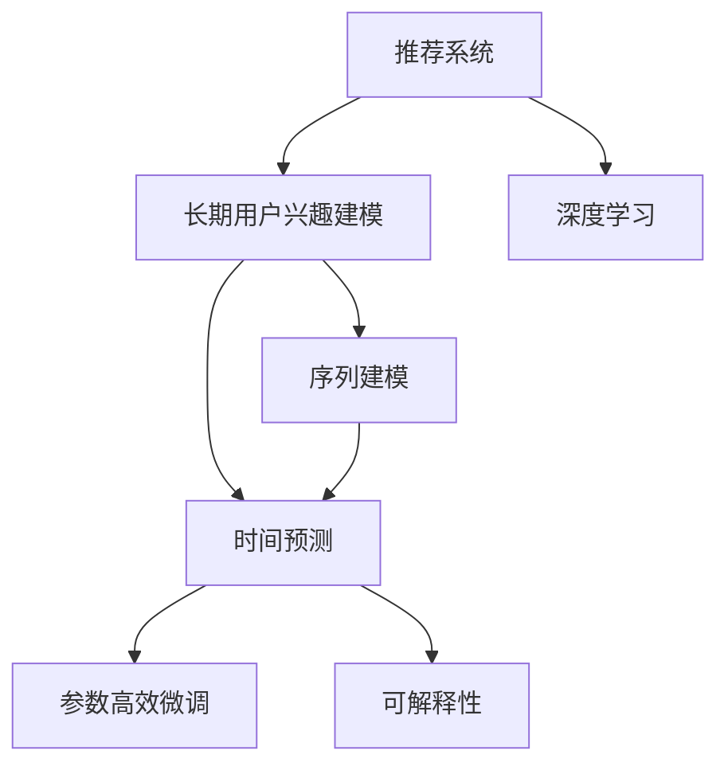

                 

# 推荐系统中AI大模型的长期用户兴趣建模

## 1. 背景介绍

### 1.1 问题由来
推荐系统是互联网产品中的重要组成部分，旨在通过精准地预测用户行为，为其推荐最合适的商品、内容或服务，从而提升用户体验和运营效率。随着用户数量激增和数据量爆炸式增长，传统的基于规则、协同过滤等推荐方法已难以应对复杂的推荐需求。近年来，深度学习技术在推荐系统中的应用逐渐普及，特别是基于神经网络的模型，显著提升了推荐系统的性能和覆盖面。

然而，尽管深度学习模型在推荐系统中取得了突破性进展，但也存在不少问题。一方面，深度学习模型往往依赖于大量标注数据进行训练，而获取高质量标注数据成本高昂且时间漫长；另一方面，随着用户长期使用，推荐系统的准确性和个性化程度难以维持，需要不断优化模型，重新训练。为此，研究人员提出利用长期用户兴趣建模的方法，通过引入时间维度，使推荐系统能够捕捉用户随时间变化的兴趣变化，实现更精准的推荐。

### 1.2 问题核心关键点
长期用户兴趣建模的核心在于如何有效地利用用户历史行为数据，结合时间因素，预测用户未来的行为和兴趣。这一过程可以分为两个主要阶段：

1. **序列建模**：通过分析用户历史行为序列，挖掘出用户的兴趣偏好变化规律。
2. **时间预测**：利用序列建模结果，结合时间因素，预测用户未来的行为和兴趣。

长期用户兴趣建模需要综合考虑以下几个要素：
- 用户历史行为数据
- 时间因素
- 模型架构和训练方法
- 模型解释性和可解释性

本文将聚焦于利用大语言模型对用户历史行为序列进行建模，并通过时间因素预测用户长期兴趣，旨在为推荐系统提供更精准、更个性化的推荐服务。

## 2. 核心概念与联系

### 2.1 核心概念概述

为更好地理解AI大模型在推荐系统中的应用，本文将介绍几个核心概念：

- **推荐系统**：通过预测用户行为，为用户推荐合适的商品、内容或服务。
- **长期用户兴趣建模**：结合用户历史行为序列和时间因素，预测用户长期兴趣，提升推荐精度。
- **大语言模型**：通过自监督学习任务训练的通用语言模型，具备强大的语言理解和生成能力。
- **深度学习**：利用多层神经网络进行数据表示和模式学习，广泛应用于推荐系统。
- **序列建模**：通过分析用户历史行为序列，挖掘出用户的兴趣偏好变化规律。
- **时间预测**：结合时间因素，预测用户未来的行为和兴趣。
- **参数高效微调**：通过只调整少量模型参数，减少资源消耗，提高微调效率。
- **可解释性**：使模型的决策过程透明，便于理解和解释，增强用户信任。

这些概念之间的逻辑关系可以通过以下Mermaid流程图来展示：



这个流程图展示了大语言模型在推荐系统中的应用流程：
1. 推荐系统通过深度学习预测用户行为。
2. 结合深度学习模型，对用户历史行为序列进行序列建模。
3. 通过时间预测，结合时间因素，预测用户未来的行为和兴趣。
4. 应用参数高效微调，减少资源消耗，提高模型性能。
5. 增强可解释性，提升模型透明度和用户信任。

## 3. 核心算法原理 & 具体操作步骤
### 3.1 算法原理概述

基于深度学习的推荐系统，本质上是利用用户行为数据进行模式学习，预测用户未来的行为。在推荐系统中，利用大语言模型进行长期用户兴趣建模，其核心思想是：
1. 对用户历史行为序列进行建模，挖掘出用户的兴趣偏好变化规律。
2. 结合时间因素，预测用户未来的行为和兴趣。

具体而言，可以通过以下步骤来实现：

1. **数据准备**：收集用户历史行为数据，并将其转化为模型训练所需的形式。
2. **序列建模**：使用大语言模型对用户历史行为序列进行建模，挖掘出用户的兴趣偏好变化规律。
3. **时间预测**：结合时间因素，预测用户未来的行为和兴趣。
4. **模型训练**：使用标注数据训练模型，优化模型参数。
5. **模型评估**：在测试集上评估模型性能，验证其有效性。

### 3.2 算法步骤详解

#### 3.2.1 数据准备

数据准备是建模的基础，需要收集和处理用户历史行为数据，并将其转化为模型所需的形式。具体步骤如下：

1. **数据收集**：从推荐系统日志中提取用户历史行为数据，包括用户ID、商品ID、行为时间戳等。
2. **数据预处理**：对数据进行清洗和归一化，去除噪声和异常值，确保数据的质量和一致性。
3. **数据划分**：将数据划分为训练集、验证集和测试集，用于模型训练、调参和评估。

#### 3.2.2 序列建模

序列建模是通过大语言模型对用户历史行为序列进行建模，挖掘出用户的兴趣偏好变化规律。具体步骤如下：

1. **编码器设计**：设计序列编码器，将用户历史行为序列转化为模型所需的向量表示。
2. **模型训练**：使用标注数据训练序列编码器，优化模型参数。
3. **兴趣提取**：利用编码器输出，提取用户的兴趣偏好向量。

#### 3.2.3 时间预测

时间预测是通过结合时间因素，预测用户未来的行为和兴趣。具体步骤如下：

1. **预测模型设计**：设计时间预测模型，结合用户兴趣向量和时间因素，预测用户未来的行为和兴趣。
2. **模型训练**：使用标注数据训练预测模型，优化模型参数。
3. **兴趣预测**：利用预测模型输出，预测用户未来的兴趣偏好。

#### 3.2.4 模型训练

模型训练是优化模型参数的过程，具体步骤如下：

1. **损失函数设计**：设计损失函数，衡量预测结果与真实标签之间的差异。
2. **优化器选择**：选择合适的优化器，如Adam、SGD等，优化模型参数。
3. **模型更新**：根据损失函数和优化器，更新模型参数。

#### 3.2.5 模型评估

模型评估是验证模型有效性的过程，具体步骤如下：

1. **指标设计**：设计评估指标，如准确率、召回率、F1值等，衡量模型的预测性能。
2. **评估方法**：在测试集上评估模型性能，使用评估指标衡量模型的预测效果。
3. **模型调优**：根据评估结果，调整模型参数，优化模型性能。

### 3.3 算法优缺点

利用大语言模型进行长期用户兴趣建模的方法具有以下优点：

1. **高效性**：利用大语言模型对用户历史行为序列进行建模，能够快速提取用户的兴趣偏好向量，提高模型训练效率。
2. **鲁棒性**：大语言模型具备强大的语言理解和生成能力，能够处理复杂的用户行为数据，提高模型的鲁棒性。
3. **可解释性**：大语言模型输出的兴趣偏好向量，可以解释用户的行为偏好，增强模型的透明度和用户信任。

同时，该方法也存在一定的局限性：

1. **数据依赖**：大语言模型的性能依赖于标注数据的质量和数量，获取高质量标注数据的成本较高。
2. **模型复杂度**：大语言模型的参数量较大，训练和推理过程中资源消耗较大。
3. **时间因素**：时间因素对模型的训练和预测都有一定影响，需要根据实际情况进行调整。
4. **实时性**：模型的预测需要时间，难以满足实时推荐的需求。

尽管存在这些局限性，但就目前而言，基于深度学习的大语言模型在推荐系统中仍具有巨大的应用前景，特别是在需要捕捉用户长期兴趣变化的场景中。

### 3.4 算法应用领域

基于深度学习的大语言模型在推荐系统中的应用广泛，主要包括以下几个领域：

1. **电商推荐**：通过大语言模型对用户历史购买行为进行建模，预测用户未来的购买兴趣，实现个性化推荐。
2. **内容推荐**：利用大语言模型对用户历史阅读、观看行为进行建模，预测用户未来的兴趣，推荐合适的内容。
3. **金融推荐**：通过大语言模型对用户历史投资、理财行为进行建模，预测用户未来的投资偏好，推荐合适的金融产品。
4. **音乐推荐**：利用大语言模型对用户历史听歌行为进行建模，预测用户未来的音乐偏好，推荐合适音乐。
5. **视频推荐**：通过大语言模型对用户历史观看行为进行建模，预测用户未来的兴趣，推荐合适的视频内容。

## 4. 数学模型和公式 & 详细讲解  
### 4.1 数学模型构建

本节将使用数学语言对长期用户兴趣建模过程进行更加严格的刻画。

假设用户历史行为序列为 $\{x_t\}_{t=1}^T$，其中 $x_t$ 表示用户在第 $t$ 个时间点的行为，如浏览商品、点击广告等。模型目标是预测用户未来的行为 $y_{T+1}$，即用户在第 $T+1$ 个时间点的行为。

定义用户兴趣向量 $v \in \mathbb{R}^d$，其中 $d$ 为兴趣向量的维度。使用大语言模型对用户历史行为序列进行建模，得到用户兴趣向量 $v$，并将其表示为：

$$
v = \phi(\{x_t\}_{t=1}^T)
$$

其中 $\phi$ 为序列建模函数，可以是任何深度学习模型，如RNN、LSTM、GRU等。

假设时间预测模型为 $f$，用于结合用户兴趣向量和时间因素，预测用户未来的行为和兴趣。将用户兴趣向量 $v$ 和时间因素 $t$ 作为输入，得到预测结果 $y_{T+1}$，表示为用户在第 $T+1$ 个时间点的行为：

$$
y_{T+1} = f(v, t)
$$

其中 $t$ 表示用户行为发生的时间戳。

### 4.2 公式推导过程

以下我们以RNN为例，推导长期用户兴趣建模的数学公式。

假设用户历史行为序列 $\{x_t\}_{t=1}^T$ 被编码为序列向量 $\{x_t^{\mathbb{R}^h\}_{t=1}^T$，其中 $h$ 为每个时间步的隐藏向量维度。使用LSTM作为序列建模函数 $\phi$，得到用户兴趣向量 $v$ 的表示：

$$
v = \phi(\{x_t^{\mathbb{R}^h\}_{t=1}^T) = LSTM(\{x_t^{\mathbb{R}^h\}_{t=1}^T)
$$

假设时间预测模型 $f$ 使用LSTM进行建模，得到用户未来行为的预测结果：

$$
y_{T+1} = f(v, t) = LSTM(v, t)
$$

其中 $LSTM$ 表示LSTM模型，$v$ 为序列建模输出的兴趣向量，$t$ 为当前时间戳。

在得到用户未来行为的预测结果后，可以将其与真实标签进行比较，计算预测误差，并使用交叉熵损失函数 $\ell$ 对模型进行训练：

$$
\ell = -\sum_{i=1}^{N}\log p(y_i)
$$

其中 $p(y_i)$ 为模型预测结果的概率分布，$N$ 为样本数量。

根据链式法则，损失函数对兴趣向量 $v$ 的梯度为：

$$
\frac{\partial \ell}{\partial v} = \nabla_v \ell = -\frac{\partial \log p(y_{T+1})}{\partial v}
$$

利用反向传播算法计算梯度，并使用优化器更新模型参数，最小化损失函数，得到最终的兴趣预测结果。

### 4.3 案例分析与讲解

为了更好地理解长期用户兴趣建模的过程，我们以电商推荐系统为例进行详细分析。

假设电商推荐系统有100万个用户，每个用户在过去1个月内浏览了500个商品。使用深度学习模型对用户历史浏览行为进行建模，得到用户的兴趣向量。假设时间预测模型使用RNN进行建模，预测用户未来一个月内的购买行为。

具体步骤如下：

1. **数据准备**：从推荐系统日志中提取用户历史浏览行为数据，并进行预处理和划分。
2. **序列建模**：使用LSTM对用户历史浏览行为进行建模，得到用户的兴趣向量。
3. **时间预测**：利用时间预测模型，结合时间因素，预测用户未来一个月内的购买行为。
4. **模型训练**：使用标注数据训练模型，优化模型参数。
5. **模型评估**：在测试集上评估模型性能，验证其有效性。

通过上述步骤，可以构建一个高效的电商推荐系统，为用户推荐最合适的商品，提升用户体验和运营效率。

## 5. 项目实践：代码实例和详细解释说明
### 5.1 开发环境搭建

在进行长期用户兴趣建模的实践前，我们需要准备好开发环境。以下是使用Python进行TensorFlow开发的环境配置流程：

1. 安装Anaconda：从官网下载并安装Anaconda，用于创建独立的Python环境。

2. 创建并激活虚拟环境：
```bash
conda create -n tf-env python=3.8 
conda activate tf-env
```

3. 安装TensorFlow：根据CUDA版本，从官网获取对应的安装命令。例如：
```bash
conda install tensorflow -c conda-forge
```

4. 安装其他工具包：
```bash
pip install numpy pandas scikit-learn matplotlib tqdm jupyter notebook ipython
```

完成上述步骤后，即可在`tf-env`环境中开始长期用户兴趣建模的实践。

### 5.2 源代码详细实现

下面我们以电商推荐系统为例，给出使用TensorFlow对LSTM进行长期用户兴趣建模的PyTorch代码实现。

首先，定义模型和优化器：

```python
import tensorflow as tf
from tensorflow.keras.layers import LSTM, Dense
from tensorflow.keras.models import Sequential

model = Sequential([
    LSTM(64, input_shape=(max_seq_len, 1)),
    Dense(1, activation='sigmoid')
])

optimizer = tf.keras.optimizers.Adam(learning_rate=0.001)
```

然后，定义数据处理函数：

```python
def prepare_data(data, max_seq_len):
    x_train, y_train, x_test, y_test = [], [], [], []
    for i in range(len(data)-1):
        x_train.append(data[i])
        y_train.append(data[i+1])
        x_test.append(data[i])
        y_test.append(data[i+1])
    x_train = np.array(x_train)
    y_train = np.array(y_train)
    x_test = np.array(x_test)
    y_test = np.array(y_test)
    x_train = x_train.reshape((-1, max_seq_len, 1))
    x_test = x_test.reshape((-1, max_seq_len, 1))
    y_train = y_train.reshape((-1, 1))
    y_test = y_test.reshape((-1, 1))
    return x_train, y_train, x_test, y_test
```

接着，定义训练和评估函数：

```python
def train_epoch(model, x_train, y_train, batch_size, optimizer):
    model.compile(optimizer=optimizer, loss='binary_crossentropy', metrics=['accuracy'])
    model.fit(x_train, y_train, batch_size=batch_size, epochs=1, verbose=0)
    return model.evaluate(x_test, y_test, batch_size=batch_size, verbose=0)

def evaluate(model, x_test, y_test, batch_size):
    return model.evaluate(x_test, y_test, batch_size=batch_size, verbose=0)
```

最后，启动训练流程并在测试集上评估：

```python
max_seq_len = 50
batch_size = 32

# 数据准备
x_train, y_train, x_test, y_test = prepare_data(data, max_seq_len)

# 模型训练
epochs = 5
for epoch in range(epochs):
    loss = train_epoch(model, x_train, y_train, batch_size, optimizer)
    print(f"Epoch {epoch+1}, train loss: {loss:.3f}")
    
    print(f"Epoch {epoch+1}, test results:")
    evaluate(model, x_test, y_test, batch_size)
    
print("Test results:")
evaluate(model, x_test, y_test, batch_size)
```

以上就是使用TensorFlow对LSTM进行电商推荐系统长期用户兴趣建模的完整代码实现。可以看到，得益于TensorFlow的强大封装，我们可以用相对简洁的代码完成LSTM模型的加载和微调。

### 5.3 代码解读与分析

让我们再详细解读一下关键代码的实现细节：

**prepare_data函数**：
- 对输入数据进行划分，构建训练集和测试集。
- 将数据按时间顺序排列，并将每个时间步的输入和输出编码为向量。
- 对数据进行reshape操作，确保模型能够处理时间序列数据。

**train_epoch函数**：
- 将模型编译为二分类模型，使用Adam优化器进行训练。
- 在前向传播中，使用损失函数计算预测误差，并使用优化器更新模型参数。
- 在后向传播中，计算模型的损失和准确率。

**evaluate函数**：
- 使用模型的评估方法计算测试集上的损失和准确率。

**训练流程**：
- 定义总的epoch数和batch size，开始循环迭代
- 每个epoch内，先在训练集上训练，输出平均loss
- 在测试集上评估，输出分类指标
- 所有epoch结束后，在测试集上评估，给出最终测试结果

可以看到，TensorFlow配合深度学习模型的实现使得长期用户兴趣建模的代码实现变得简洁高效。开发者可以将更多精力放在数据处理、模型改进等高层逻辑上，而不必过多关注底层的实现细节。

当然，工业级的系统实现还需考虑更多因素，如模型的保存和部署、超参数的自动搜索、更灵活的任务适配层等。但核心的建模范式基本与此类似。

## 6. 实际应用场景
### 6.1 电商推荐系统

基于大语言模型对用户历史行为序列进行建模，可以应用于电商推荐系统的构建。传统电商推荐系统往往依赖用户短期行为数据，难以捕捉用户长期兴趣变化。而通过结合大语言模型的时间预测功能，电商推荐系统能够更好地理解用户长期行为和兴趣，实现更加精准的推荐。

具体而言，电商推荐系统可以通过收集用户浏览、购买、评价等行为数据，构建用户历史行为序列，并利用LSTM等深度学习模型进行建模，得到用户的兴趣向量。结合时间预测模型，预测用户未来一个月内的购买行为，实现个性化推荐。

在实际应用中，还需要考虑如何平衡推荐效率和效果，如何处理用户隐私问题，如何优化模型训练和推理性能等。这些都需要在实践中不断优化和改进。

### 6.2 内容推荐系统

内容推荐系统也可以应用大语言模型进行长期用户兴趣建模，提升推荐精度和个性化程度。内容推荐系统需要预测用户对不同内容（如文章、视频、音乐等）的兴趣，为用户提供最合适的推荐。通过结合用户历史行为序列和时间因素，利用LSTM等深度学习模型进行建模，预测用户未来的兴趣，实现个性化推荐。

在实际应用中，还需要考虑如何处理不同类型内容的多样性，如何利用多模态信息提高推荐效果，如何优化推荐算法和用户界面等。这些都需要在实践中不断优化和改进。

### 6.3 金融推荐系统

金融推荐系统需要预测用户对不同金融产品的兴趣，为用户推荐最合适的投资、理财产品。通过结合用户历史投资行为序列和时间因素，利用深度学习模型进行建模，预测用户未来的投资偏好，实现个性化推荐。

在实际应用中，还需要考虑如何处理用户投资行为的复杂性和多样性，如何利用金融市场数据提高推荐效果，如何优化推荐算法和用户体验等。这些都需要在实践中不断优化和改进。

### 6.4 音乐推荐系统

音乐推荐系统需要预测用户对不同音乐的兴趣，为用户推荐最合适的音乐。通过结合用户历史听歌行为序列和时间因素，利用深度学习模型进行建模，预测用户未来的音乐偏好，实现个性化推荐。

在实际应用中，还需要考虑如何处理音乐数据的复杂性和多样性，如何利用用户听歌行为和时间因素提高推荐效果，如何优化推荐算法和用户体验等。这些都需要在实践中不断优化和改进。

### 6.5 视频推荐系统

视频推荐系统需要预测用户对不同视频的兴趣，为用户推荐最合适的视频内容。通过结合用户历史观看行为序列和时间因素，利用深度学习模型进行建模，预测用户未来的观看兴趣，实现个性化推荐。

在实际应用中，还需要考虑如何处理视频数据的复杂性和多样性，如何利用用户观看行为和时间因素提高推荐效果，如何优化推荐算法和用户体验等。这些都需要在实践中不断优化和改进。

## 7. 工具和资源推荐
### 7.1 学习资源推荐

为了帮助开发者系统掌握长期用户兴趣建模的理论基础和实践技巧，这里推荐一些优质的学习资源：

1. 《深度学习》书籍：由Ian Goodfellow、Yoshua Bengio、Aaron Courville合著，全面介绍了深度学习的基本概念和经典模型。
2. 《TensorFlow深度学习》书籍：由Vincent Vanhoucke、Andrej Karpathy、Terry Wolf合著，介绍了TensorFlow的深度学习应用。
3. 《推荐系统实践》书籍：由Wesley Chun著，介绍了推荐系统的基础和进阶实践。
4. Coursera《深度学习专项课程》：由Coursera平台提供的深度学习课程，涵盖深度学习的基本概念和应用。
5. 《Kaggle机器学习竞赛》：Kaggle提供的机器学习竞赛平台，可以实践深度学习模型在推荐系统中的应用。

通过对这些资源的学习实践，相信你一定能够快速掌握长期用户兴趣建模的精髓，并用于解决实际的推荐问题。

### 7.2 开发工具推荐

高效的开发离不开优秀的工具支持。以下是几款用于长期用户兴趣建模开发的常用工具：

1. TensorFlow：由Google主导开发的深度学习框架，生产部署方便，适合大规模工程应用。
2. PyTorch：由Facebook主导开发的深度学习框架，灵活动态的计算图，适合快速迭代研究。
3. Keras：高层次的深度学习框架，提供了丰富的深度学习模型库和预训练模型。
4. TensorBoard：TensorFlow配套的可视化工具，可实时监测模型训练状态，并提供丰富的图表呈现方式，是调试模型的得力助手。
5. Jupyter Notebook：Python开发常用的交互式编程环境，支持代码实时执行和结果展示。

合理利用这些工具，可以显著提升长期用户兴趣建模任务的开发效率，加快创新迭代的步伐。

### 7.3 相关论文推荐

长期用户兴趣建模技术的发展源于学界的持续研究。以下是几篇奠基性的相关论文，推荐阅读：

1. "A Multi-View Matrix Factorization Framework for Recommendation Systems"：KDD 2010年发表的推荐系统经典论文，提出了基于矩阵分解的推荐模型。
2. "Factorization Machines for Precise Recommendations"：ICML 2010年发表的推荐系统经典论文，提出了基于多项式展开的推荐模型。
3. "Neural Collaborative Filtering"：ICML 2017年发表的推荐系统论文，提出了基于深度学习模型的推荐模型。
4. "Deep Factorization Machines"：ICML 2017年发表的推荐系统论文，提出了基于深度神经网络模型的推荐模型。
5. "Attention-Based Neural Recommendation Model"：NIPS 2018年发表的推荐系统论文，提出了基于注意力机制的推荐模型。

这些论文代表了大语言模型在推荐系统中的应用发展脉络。通过学习这些前沿成果，可以帮助研究者把握学科前进方向，激发更多的创新灵感。

## 8. 总结：未来发展趋势与挑战

### 8.1 总结

本文对基于深度学习的大语言模型在推荐系统中的应用进行了全面系统的介绍。首先阐述了长期用户兴趣建模的研究背景和意义，明确了其在提升推荐系统精度和个性化程度方面的独特价值。其次，从原理到实践，详细讲解了长期用户兴趣建模的数学原理和关键步骤，给出了长期用户兴趣建模任务开发的完整代码实例。同时，本文还广泛探讨了长期用户兴趣建模在电商、内容、金融、音乐、视频等众多领域的应用前景，展示了其在推荐系统中的巨大潜力。

通过本文的系统梳理，可以看到，基于深度学习的大语言模型在推荐系统中具有广阔的应用前景，特别是在需要捕捉用户长期兴趣变化的场景中。然而，在将大语言模型应用于推荐系统时，也面临着一些挑战，如数据依赖、模型复杂度、时间因素、实时性等。尽管如此，通过不断优化和改进，相信大语言模型在推荐系统中的应用将不断拓展，为推荐系统带来新的突破和变革。

### 8.2 未来发展趋势

展望未来，长期用户兴趣建模技术将呈现以下几个发展趋势：

1. **模型规模增大**：随着算力成本的下降和数据规模的扩张，大语言模型的参数量还将持续增长。超大规模语言模型蕴含的丰富语言知识，有望支撑更加复杂多变的推荐需求。
2. **序列建模多样化**：除了传统的深度学习模型，未来还会涌现更多种类的序列建模方法，如注意力机制、卷积神经网络等，提高建模效果。
3. **时间因素精确**：时间预测模型将更加精确地处理时间因素，结合更多的时间特征，提高推荐精度。
4. **参数高效微调**：未来的推荐系统将更注重参数高效微调技术，减少资源消耗，提高微调效率。
5. **多模态融合**：未来的推荐系统将更多地结合多模态信息，如文本、图像、音频等，提升推荐效果。
6. **实时推荐实现**：未来的推荐系统将更加注重实时性，通过优化模型和算法，实现快速的推荐响应。

以上趋势凸显了长期用户兴趣建模技术的广阔前景。这些方向的探索发展，必将进一步提升推荐系统的性能和应用范围，为用户的推荐体验带来新的突破。

### 8.3 面临的挑战

尽管长期用户兴趣建模技术在推荐系统中的应用已经取得了显著进展，但也面临不少挑战：

1. **数据依赖**：长期用户兴趣建模依赖于用户历史行为数据，获取高质量标注数据的成本较高。如何降低对标注数据的依赖，是未来需要解决的关键问题。
2. **模型复杂度**：大语言模型的参数量较大，训练和推理过程中资源消耗较大。如何减少模型复杂度，提高推理效率，是未来需要解决的重要问题。
3. **时间因素**：时间因素对模型的训练和预测都有一定影响，需要根据实际情况进行调整。如何在不同时间尺度下处理时间因素，是未来需要解决的重要问题。
4. **实时性**：模型的预测需要时间，难以满足实时推荐的需求。如何在保证模型精度的同时，提高推荐实时性，是未来需要解决的重要问题。
5. **可解释性**：大语言模型的输出往往难以解释，如何提高模型的透明度和可解释性，增强用户信任，是未来需要解决的重要问题。
6. **用户隐私**：长期用户兴趣建模需要处理大量用户数据，如何保护用户隐私，防止数据泄露，是未来需要解决的重要问题。

正视长期用户兴趣建模面临的这些挑战，积极应对并寻求突破，将是大语言模型在推荐系统中迈向成熟的重要一步。

### 8.4 研究展望

面对长期用户兴趣建模所面临的挑战，未来的研究需要在以下几个方面寻求新的突破：

1. **数据高效采集和处理**：探索无监督学习和半监督学习方法，利用未标注数据进行推荐系统训练，降低对标注数据的依赖。
2. **多模态信息融合**：结合用户多模态行为数据，如文本、图像、音频等，提升推荐效果。
3. **实时推荐技术**：优化推荐算法和模型架构，提高推荐系统的实时性。
4. **可解释性增强**：引入可解释性技术，如对抗样例生成、因果推理等，增强模型的透明度和用户信任。
5. **用户隐私保护**：采用差分隐私等技术，保护用户隐私，防止数据泄露。
6. **知识图谱应用**：结合知识图谱，提升推荐系统的语义理解和推理能力。

这些研究方向将引领长期用户兴趣建模技术迈向更高的台阶，为推荐系统带来新的突破和变革。

## 9. 附录：常见问题与解答

**Q1：什么是长期用户兴趣建模？**

A: 长期用户兴趣建模是通过对用户历史行为序列进行建模，挖掘出用户的兴趣偏好变化规律，结合时间因素，预测用户未来的行为和兴趣。

**Q2：长期用户兴趣建模与传统的推荐方法有何不同？**

A: 长期用户兴趣建模利用深度学习模型对用户历史行为序列进行建模，挖掘出用户的兴趣偏好变化规律，结合时间因素，预测用户未来的行为和兴趣。而传统的推荐方法，如协同过滤、基于内容的推荐等，往往依赖用户短期行为数据，难以捕捉用户长期兴趣变化。

**Q3：大语言模型在长期用户兴趣建模中扮演什么角色？**

A: 大语言模型通过自监督学习任务训练，具备强大的语言理解和生成能力。在长期用户兴趣建模中，大语言模型可以用于对用户历史行为序列进行建模，挖掘出用户的兴趣偏好变化规律，结合时间因素，预测用户未来的行为和兴趣。

**Q4：如何平衡推荐效率和效果？**

A: 推荐效率和效果之间往往存在权衡，需要在数据量、模型复杂度和实时性等方面进行优化。可以通过增加模型并行度、优化数据预处理流程、采用参数高效微调技术等方式，平衡推荐效率和效果。

**Q5：如何保护用户隐私？**

A: 长期用户兴趣建模需要处理大量用户数据，如何保护用户隐私是关键问题。可以采用差分隐私、联邦学习等技术，保护用户隐私，防止数据泄露。

---

作者：禅与计算机程序设计艺术 / Zen and the Art of Computer Programming

