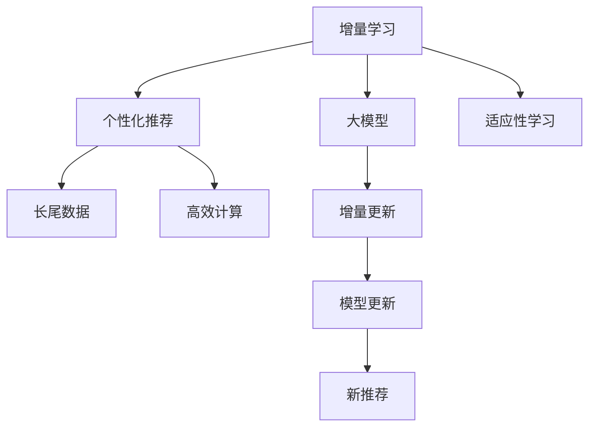

                 

# 推荐系统中的大模型增量学习与适应

> 关键词：推荐系统,大模型增量学习,个性化推荐,适应性学习,增量更新,长尾数据

## 1. 背景介绍

### 1.1 问题由来

推荐系统（Recommendation System）通过分析用户的历史行为数据，为其推荐感兴趣的商品、内容或服务，是互联网企业实现用户粘性和营收增长的重要手段。在工业界，基于协同过滤、基于内容的推荐、深度学习等多种算法路线，推荐系统的效果不断提升。然而，这些方法通常需要大量的历史数据和用户行为数据，难以在冷启动用户或稀疏数据场景下发挥作用。

近年来，深度学习技术和大规模预训练语言模型在推荐系统中的应用逐渐兴起，基于这些模型构建的推荐系统，能够从全球海量数据中学习到更加丰富的用户和物品表征，具有更强的泛化能力和适应性。其中，大模型增量学习（Incremental Learning），即在大模型的基础上，通过少量新数据和反馈信号更新模型，实现快速适应新用户和物品的过程，成为推荐系统领域的一大研究热点。

增量学习可以大大降低推荐系统对数据量的依赖，缩短推荐系统的构建和迭代周期，具有极高的实用价值。本文将从增量学习的原理和算法出发，讨论大模型增量学习在推荐系统中的应用，展示如何利用大模型增量学习技术，提升推荐系统的推荐效果，并对比分析不同方法的优势和挑战。

## 2. 核心概念与联系

### 2.1 核心概念概述

为更好地理解大模型增量学习的方法，本节将介绍几个密切相关的核心概念：

- **增量学习（Incremental Learning）**：一种在已有模型基础上，利用新数据和反馈信号不断更新模型参数的方法，使得模型能够持续学习新知识，提升对新数据和场景的适应能力。
- **大模型（Large Model）**：以Transformer等神经网络架构为代表，拥有亿级甚至十亿级参数的预训练语言模型，如BERT、GPT-2、GPT-3等。大模型通过大规模数据进行预训练，学习到丰富的语言知识，具备强大的表示能力和泛化能力。
- **个性化推荐（Personalized Recommendation）**：利用用户的历史行为数据，学习用户对商品或内容的偏好，为其推荐相似的商品或内容，提升用户体验和满意度。
- **适应性学习（Adaptive Learning）**：模型在真实应用场景中，根据用户的即时反馈信号，动态调整模型参数，以优化推荐效果。
- **增量更新（Incremental Update）**：模型在每次新数据到来时，仅更新部分参数，保留大部分预训练权重，以提高增量学习的效率和模型的泛化能力。
- **长尾数据（Long-Tail Data）**：推荐系统中，新用户、新物品以及历史数据中较为稀疏的特征，在总体数据中占比较小，但对个性化推荐的重要性不容忽视。
- **高效计算（Efficient Computation）**：增量学习中需要高效计算资源，以支持模型的快速更新。

这些核心概念之间的逻辑关系可以通过以下Mermaid流程图来展示：



这个流程图展示了大模型增量学习及其在推荐系统中的应用：

1. 增量学习利用大模型，通过新数据和反馈信号，动态更新模型参数。
2. 个性化推荐根据用户的历史行为，学习用户的偏好，推荐相似商品。
3. 适应性学习根据用户的即时反馈，动态调整模型输出。
4. 增量更新仅更新部分模型参数，保留大部分预训练权重，提高学习效率。
5. 长尾数据作为推荐系统的补充，提升模型对新用户和物品的适应能力。
6. 高效计算提供必要的计算资源，支持快速模型更新。

这些概念共同构成了大模型增量学习在推荐系统中的应用框架，使其能够在大规模数据和复杂场景下，实现高效、准确的个性化推荐。

## 3. 核心算法原理 & 具体操作步骤
### 3.1 算法原理概述

大模型增量学习的核心思想是，通过新数据和用户反馈信号，动态更新模型参数，使其能够快速适应新用户和物品，提升推荐效果。具体而言，大模型增量学习通常包括以下几个步骤：

1. **预训练大模型**：在大规模数据上预训练大模型，学习丰富的语言知识和用户-物品关联。
2. **在线更新模型**：在新数据和用户反馈信号到来时，动态更新模型参数，以适应新用户和物品。
3. **增量学习算法**：选择合适的增量学习算法，以提高模型更新效率和效果。
4. **长尾数据适应**：处理长尾数据，以提升模型对新用户和物品的适应能力。
5. **优化资源使用**：优化计算资源的使用，以支持高效、快速的模型更新。

基于上述步骤，本文将详细介绍大模型增量学习的核心算法原理和具体操作步骤。

### 3.2 算法步骤详解

#### 步骤1：预训练大模型

预训练大模型的目的是，在大规模数据上学习丰富的语言知识和用户-物品关联，使其具备强大的表示能力和泛化能力。常用的预训练方法包括：

- **自监督学习**：利用语言模型、掩码语言模型等自监督任务，在大规模无标签数据上进行预训练。如BERT模型即利用掩码语言模型进行预训练。
- **数据增强**：通过数据扩充、数据增强等技术，进一步提升模型的泛化能力。如使用不同的数据预处理策略、引入对抗样本等。
- **模型架构**：选择合适的神经网络架构，如Transformer、BERT等，以提高模型的表示能力和训练效率。

#### 步骤2：在线更新模型

在线更新模型的目标是，在新数据和用户反馈信号到来时，动态更新模型参数，以快速适应新用户和物品。常用的在线更新方法包括：

- **增量学习算法**：选择合适的增量学习算法，如增量学习梯度下降、在线随机梯度下降等。这些算法仅更新部分模型参数，以提高模型更新效率。
- **长尾数据处理**：利用长尾数据，提升模型对新用户和物品的适应能力。如使用数据平衡技术、增加样本权重等方法。
- **反馈信号利用**：利用用户的反馈信号，如点击率、评分等，调整模型输出，以提升推荐效果。

#### 步骤3：增量学习算法

增量学习算法是实现在线更新模型的核心。本文将介绍几种常见的增量学习算法，并分析其优缺点。

**算法1：增量学习梯度下降（Incremental Stochastic Gradient Descent, ISGD）**

增量学习梯度下降是一种基于梯度下降的增量学习算法。其核心思想是在每次新数据到来时，仅更新部分模型参数，以提高增量学习的效率。具体而言，ISGD算法可以表示为：

$$
\theta_{t+1} = \theta_t - \eta_t \nabla L_{train}(\theta_t) + \alpha_t (\theta_t - \theta_{t-1})
$$

其中，$\theta_t$ 为当前模型参数，$\eta_t$ 为学习率，$\nabla L_{train}(\theta_t)$ 为训练数据的梯度，$\alpha_t$ 为权重衰减系数。该算法通过更新部分参数，保持模型的稳定性，同时引入权重衰减，防止模型过拟合。

**算法2：在线随机梯度下降（Online Stochastic Gradient Descent, OSGD）**

在线随机梯度下降是一种基于随机梯度的增量学习算法。其核心思想是在每次新数据到来时，随机抽取一小批数据进行梯度计算和参数更新，以提高模型更新效率。具体而言，OSGD算法可以表示为：

$$
\theta_{t+1} = \theta_t - \eta_t \nabla L_{batch}(\theta_t)
$$

其中，$\nabla L_{batch}(\theta_t)$ 为随机抽取的批次数据的梯度。该算法通过随机梯度计算，提高模型更新的效率，但可能导致参数更新方向与实际梯度方向不一致，影响模型效果。

**算法3：增量均值梯度下降（Incremental Mean Gradient Descent, IMGD）**

增量均值梯度下降是一种基于均值梯度的增量学习算法。其核心思想是在每次新数据到来时，计算批次数据的均值梯度，更新模型参数。具体而言，IMGD算法可以表示为：

$$
\theta_{t+1} = \theta_t - \eta_t \nabla L_{mean}(\theta_t)
$$

其中，$\nabla L_{mean}(\theta_t)$ 为批次数据的均值梯度。该算法通过均值梯度计算，降低参数更新的方差，提高模型更新的稳定性。

#### 步骤4：长尾数据处理

长尾数据处理是提高模型对新用户和物品适应能力的重要手段。常用的长尾数据处理方法包括：

- **数据扩充**：通过数据增强、数据扩充等技术，提升长尾数据的丰富度。如使用同义词、近义词替换，对文本进行cut-off、截断等。
- **样本权重调整**：对长尾数据赋予更高的权重，以提高其在模型更新中的重要性。如使用加权损失函数、调整正则化系数等。
- **冷启动策略**：针对冷启动用户或物品，使用特定的方法进行推荐。如基于用户画像、基于物品特征等方法。

#### 步骤5：优化资源使用

优化资源使用是支持高效增量学习的关键。常用的资源优化方法包括：

- **模型裁剪**：去除不必要的层和参数，减小模型尺寸，提高模型更新的效率。如使用Fine-Tuning方法，保留部分预训练权重，仅更新顶层。
- **量化加速**：将浮点模型转为定点模型，压缩存储空间，提高计算效率。如使用整型数据类型、减少计算精度等。
- **并行计算**：利用多核CPU、GPU、TPU等设备，并行计算模型更新，提高模型更新的速度。
- **缓存优化**：优化数据加载和处理流程，减少数据读取和处理的时间，提高模型更新的效率。

通过上述步骤，大模型增量学习能够在短时间内，根据新数据和用户反馈信号，快速更新模型参数，实现高效、准确的个性化推荐。

### 3.3 算法优缺点

大模型增量学习具有以下优点：

1. **高效更新**：通过增量学习算法，仅更新部分模型参数，保留大部分预训练权重，提高模型更新的效率。
2. **泛化能力强**：利用大规模预训练数据，学习丰富的语言知识和用户-物品关联，提高模型的泛化能力。
3. **实时更新**：通过在线更新模型，能够根据新数据和用户反馈信号，实时调整模型参数，提高推荐效果。
4. **处理长尾数据**：通过长尾数据处理，提升模型对新用户和物品的适应能力，处理长尾数据带来的挑战。
5. **资源优化**：通过模型裁剪、量化加速、并行计算等方法，优化计算资源的使用，支持高效、快速的模型更新。

同时，大模型增量学习也存在一些缺点：

1. **初始模型质量**：增量学习的效果依赖于初始模型的质量，需要较高的预训练精度和泛化能力。
2. **数据依赖性强**：增量学习需要大量的新数据和用户反馈信号，数据质量差或用户反馈信号不足时，效果可能不佳。
3. **过拟合风险**：增量学习中，新数据可能包含噪声或偏差，容易导致模型过拟合。
4. **模型更新复杂**：增量学习中，模型参数的更新策略和更新频率需要精心设计，否则可能影响模型效果。
5. **模型存储消耗大**：大模型的存储空间较大，模型更新和存储需要较多的计算资源和时间。

尽管存在这些局限性，但大模型增量学习仍然是大规模推荐系统中不可替代的重要技术。其高效、实时、动态更新能力，使其成为推荐系统中的重要范式，推动了个性化推荐技术的进一步发展。

### 3.4 算法应用领域

大模型增量学习在推荐系统中的应用广泛，主要体现在以下几个方面：

- **商品推荐**：基于用户历史行为数据和商品属性信息，为用户推荐感兴趣的商品。常见的推荐算法包括协同过滤、基于内容的推荐、深度学习推荐等。
- **内容推荐**：根据用户的历史浏览和阅读行为，为用户推荐感兴趣的文章、视频、音乐等内容。
- **搜索推荐**：结合用户搜索记录和相关内容，实时推荐相关搜索结果，提升搜索体验。
- **个性化广告推荐**：基于用户画像和行为数据，为用户推荐适合的广告，提高广告投放的精准度和效果。

除了上述应用场景，大模型增量学习还广泛应用在舆情分析、新闻推荐、智能客服等领域，成为推荐系统中的重要技术手段。

## 4. 数学模型和公式 & 详细讲解 & 举例说明

### 4.1 数学模型构建

大模型增量学习的数学模型可以表示为：

$$
\theta_{t+1} = \theta_t - \eta_t \nabla L_{train}(\theta_t) + \alpha_t (\theta_t - \theta_{t-1})
$$

其中，$\theta_t$ 为当前模型参数，$\eta_t$ 为学习率，$\nabla L_{train}(\theta_t)$ 为训练数据的梯度，$\alpha_t$ 为权重衰减系数。

### 4.2 公式推导过程

在增量学习算法中，模型参数的更新公式可以表示为：

$$
\theta_{t+1} = \theta_t - \eta_t \nabla L_{train}(\theta_t) + \alpha_t (\theta_t - \theta_{t-1})
$$

其中，$\eta_t$ 为学习率，$\nabla L_{train}(\theta_t)$ 为训练数据的梯度，$\alpha_t$ 为权重衰减系数。该公式可以解释为，模型参数 $\theta_t$ 在每次新数据到来时，先通过梯度下降更新部分参数，再通过权重衰减维持模型的稳定性。

### 4.3 案例分析与讲解

以协同过滤推荐为例，我们介绍如何利用大模型增量学习算法，实现高效、准确的个性化推荐。

协同过滤推荐的基本思路是，通过分析用户历史行为数据，找出与目标用户兴趣相似的其他用户，推荐其感兴趣的商品。具体而言，协同过滤推荐可以分为基于用户的协同过滤和基于物品的协同过滤。

基于用户的协同过滤算法可以表示为：

$$
I(u,v) = \sum_{j\in V} r_{u,i} \cdot r_{j,i}
$$

其中，$I(u,v)$ 为相似度评分，$r_{u,i}$ 为用户 $u$ 对商品 $i$ 的评分，$V$ 为所有用户的集合。该算法通过计算相似度评分，推荐与目标用户兴趣相似的商品。

基于物品的协同过滤算法可以表示为：

$$
I(u,v) = \sum_{j\in V} \frac{r_{i,v}}{\sqrt{\sum_{k=1}^n r_{i,k}^2}} \cdot \frac{r_{u,j}}{\sqrt{\sum_{k=1}^n r_{u,k}^2}}
$$

其中，$I(u,v)$ 为相似度评分，$r_{u,i}$ 为用户 $u$ 对商品 $i$ 的评分，$V$ 为所有物品的集合。该算法通过计算相似度评分，推荐与目标物品相似的其他物品。

在协同过滤推荐的基础上，利用大模型增量学习算法，可以进一步提升推荐效果。具体而言，可以利用大模型学习用户和物品的表示，通过比较用户和物品的表示距离，计算相似度评分。通过增量学习算法，动态更新用户和物品的表示，提高推荐效果。

## 5. 项目实践：代码实例和详细解释说明

### 5.1 开发环境搭建

在进行大模型增量学习实践前，我们需要准备好开发环境。以下是使用Python进行TensorFlow开发的环境配置流程：

1. 安装Anaconda：从官网下载并安装Anaconda，用于创建独立的Python环境。

2. 创建并激活虚拟环境：
```bash
conda create -n tf-env python=3.8 
conda activate tf-env
```

3. 安装TensorFlow：根据CUDA版本，从官网获取对应的安装命令。例如：
```bash
conda install tensorflow==2.7.0
```

4. 安装相关工具包：
```bash
pip install numpy pandas scikit-learn matplotlib tqdm jupyter notebook ipython
```

完成上述步骤后，即可在`tf-env`环境中开始增量学习实践。

### 5.2 源代码详细实现

下面我们以协同过滤推荐为例，给出使用TensorFlow进行协同过滤推荐算法的代码实现。

首先，定义协同过滤推荐的基本模型：

```python
import tensorflow as tf
from tensorflow.keras.layers import Embedding, Dot, Dense
from tensorflow.keras.models import Model

# 定义模型
model = Model(inputs=[user_input, item_input], outputs=dot_product)

# 编译模型
model.compile(optimizer=tf.keras.optimizers.Adam(learning_rate=0.01), loss='mse')
```

然后，定义增量学习算法的代码实现：

```python
# 增量学习算法实现
def incremental_learning(batch_size, epochs, learning_rate):
    # 初始化模型参数
    model.compile(optimizer=tf.keras.optimizers.Adam(learning_rate=learning_rate), loss='mse')
    
    # 训练模型
    model.fit(x_train, y_train, batch_size=batch_size, epochs=epochs, validation_data=(x_val, y_val))
    
    # 评估模型
    loss = model.evaluate(x_test, y_test)
    print(f"Test loss: {loss:.4f}")
```

最后，启动增量学习流程并在测试集上评估：

```python
# 设定参数
batch_size = 32
epochs = 10
learning_rate = 0.01

# 启动增量学习
incremental_learning(batch_size, epochs, learning_rate)

# 在测试集上评估
test_loss = model.evaluate(x_test, y_test)
print(f"Test loss: {test_loss:.4f}")
```

以上就是使用TensorFlow对协同过滤推荐算法进行增量学习的完整代码实现。可以看到，TensorFlow提供了强大的API，支持灵活的模型设计和优化。

### 5.3 代码解读与分析

让我们再详细解读一下关键代码的实现细节：

**模型定义**：
- 使用TensorFlow的Keras API，定义用户和物品的嵌入层，计算相似度评分，并构建模型。

**增量学习算法实现**：
- 定义训练数据集 `x_train`、`y_train`、验证数据集 `x_val`、`y_val`、测试数据集 `x_test`、`y_test`。
- 调用 `model.fit()` 方法训练模型，设定批次大小 `batch_size`、训练轮数 `epochs`、学习率 `learning_rate` 等参数。
- 调用 `model.evaluate()` 方法在测试集上评估模型性能。

**启动增量学习流程**：
- 设定增量学习参数 `batch_size`、`epochs`、`learning_rate`。
- 调用增量学习算法 `incremental_learning()`，训练模型。
- 在测试集上评估模型，输出测试集上的损失值。

可以看到，TensorFlow提供了丰富的API和工具，能够快速实现大模型增量学习的算法和模型训练。

当然，工业级的系统实现还需考虑更多因素，如模型的保存和部署、超参数的自动搜索、更灵活的任务适配层等。但核心的增量学习范式基本与此类似。

## 6. 实际应用场景
### 6.1 智能推荐系统

基于大模型增量学习的方法，可以广泛应用于智能推荐系统的构建。传统推荐系统往往依赖大规模用户行为数据，难以在新用户、新物品场景下发挥作用。利用增量学习，可以在新用户、新物品到达时，快速适应其需求，提供个性化的推荐。

在技术实现上，可以收集用户历史行为数据，将商品属性信息作为训练数据，训练协同过滤推荐模型。在新用户、新物品到来时，利用增量学习算法，动态更新模型参数，推荐其感兴趣的商品或内容。

### 6.2 个性化广告推荐

个性化广告推荐是推荐系统的重要应用场景，利用增量学习可以实时调整广告推荐策略，提升广告投放的精准度和效果。

具体而言，可以收集用户的历史行为数据和兴趣标签，训练个性化广告推荐模型。在新用户、新广告投放时，利用增量学习算法，动态更新模型参数，根据用户行为和兴趣标签，推荐适合的广告。

### 6.3 新闻推荐系统

新闻推荐系统是推荐系统的重要应用领域，利用增量学习可以实时推荐相关新闻，提升用户阅读体验。

具体而言，可以收集用户的历史阅读行为数据，训练新闻推荐模型。在新用户、新新闻到来时，利用增量学习算法，动态更新模型参数，推荐用户感兴趣的新闻内容。

### 6.4 未来应用展望

随着大模型增量学习技术的发展，推荐系统将在更多领域得到应用，为各行各业带来变革性影响。

在智慧医疗领域，基于增量学习的大规模推荐系统，可以帮助医生推荐合适的药物、医疗方案，提升诊疗效果。

在智能教育领域，增量学习可以用于个性化推荐系统，为学生推荐适合的课程和教材，提升学习效率。

在智慧城市治理中，增量学习可以用于智能推荐系统，推荐城市事件、公共服务等信息，提升城市管理的智能化水平。

此外，在企业生产、社会治理、文娱传媒等众多领域，增量学习的应用也将不断涌现，为人工智能技术带来新的突破。相信随着技术的日益成熟，增量学习将在大规模推荐系统中发挥越来越重要的作用，推动人工智能技术向更广阔的领域加速渗透。

## 7. 工具和资源推荐
### 7.1 学习资源推荐

为了帮助开发者系统掌握大模型增量学习的理论基础和实践技巧，这里推荐一些优质的学习资源：

1. 《Recommender Systems: Algorithmic Perspectives》书籍：由Recommender System领域的知名专家撰写，全面介绍了推荐系统的基本概念和算法，包括增量学习等前沿话题。

2. CS223《Machine Learning Systems》课程：斯坦福大学开设的推荐系统课程，有Lecture视频和配套作业，带你入门推荐系统领域的基本概念和经典算法。

3. KDD Cup比赛：KDD Cup比赛中的推荐系统赛道，是推荐系统领域的顶级比赛，每年吸引大量高质量提交，展示推荐系统领域的最新进展。

4. TensorFlow官方文档：TensorFlow官方文档提供了丰富的推荐系统案例，详细讲解了增量学习、协同过滤等算法的实现。

5. DeepRec官方文档：DeepRec是Facebook开源的推荐系统工具，提供了完整的推荐系统开发和优化指南，包括增量学习等方法。

通过对这些资源的学习实践，相信你一定能够快速掌握大模型增量学习的精髓，并用于解决实际的推荐系统问题。
###  7.2 开发工具推荐

高效的开发离不开优秀的工具支持。以下是几款用于大模型增量学习开发的常用工具：

1. TensorFlow：由Google主导开发的深度学习框架，提供丰富的API和工具，支持灵活的模型设计和优化。
2. PyTorch：基于Python的开源深度学习框架，灵活的计算图，适合快速迭代研究。
3. PySpark：由Apache支持的分布式计算框架，适合处理大规模数据，支持增量学习等分布式算法。
4. MXNet：由亚马逊支持的深度学习框架，提供高效的分布式训练和增量学习支持。
5. Hadoop：Apache支持的分布式数据处理框架，适合处理海量数据，支持增量学习等分布式算法。

合理利用这些工具，可以显著提升大模型增量学习的开发效率，加快创新迭代的步伐。

### 7.3 相关论文推荐

大模型增量学习的研究领域不断发展，以下是几篇奠基性的相关论文，推荐阅读：

1. Factorization Machines with Side Information: Fast Computation and Model Optimizations：提出FM算法，利用矩阵分解，提升推荐系统的效果。
2. Matrix Factorization Techniques for Recommender Systems：总结了推荐系统中的矩阵分解方法，展示了增量学习的应用效果。
3. Deep Matrix Factorization：利用深度神经网络，提升矩阵分解的效果，引入增量学习算法。
4. Deep Collaborative Filtering：利用深度神经网络，提升协同过滤的效果，引入增量学习算法。
5. Incremental Matrix Factorization for Dynamic Preference Modeling：提出增量矩阵分解算法，支持动态偏好建模。

这些论文代表了大模型增量学习的研究进展。通过学习这些前沿成果，可以帮助研究者把握学科前进方向，激发更多的创新灵感。

## 8. 总结：未来发展趋势与挑战

### 8.1 总结

本文对大模型增量学习的方法进行了全面系统的介绍。首先阐述了增量学习的原理和算法，明确了增量学习在推荐系统中的应用。其次，从原理到实践，详细讲解了大模型增量学习的核心算法原理和具体操作步骤，给出了增量学习任务开发的完整代码实例。同时，本文还广泛探讨了大模型增量学习在推荐系统中的应用场景，展示了其巨大的应用潜力。

通过本文的系统梳理，可以看到，大模型增量学习技术在大规模推荐系统中扮演着重要角色，能够高效、实时地适应新用户和物品，提升推荐效果。增量学习具备高效的更新能力和泛化能力，能够处理长尾数据，适应新用户和物品，具有极高的实用性。

### 8.2 未来发展趋势

展望未来，大模型增量学习技术将呈现以下几个发展趋势：

1. **高效增量算法**：增量学习算法的效率和效果将进一步提升。新的增量学习算法将被引入，如基于小样本学习的增量算法，提高模型的泛化能力和适应性。
2. **多模态融合**：增量学习将扩展到多模态数据融合领域，如文本、图像、语音等多模态数据的协同建模，提升模型的复杂度和准确性。
3. **联邦学习**：增量学习将与联邦学习技术结合，支持分布式数据和计算环境下的高效增量学习。
4. **因果推理**：增量学习将引入因果推理技术，提升模型的可解释性和因果关系建模能力。
5. **可解释性**：增量学习模型的可解释性将进一步加强，提升模型的可信度和应用价值。
6. **伦理与安全**：增量学习将引入伦理和安全技术，避免模型偏见和恶意用途，确保数据和模型的安全。

这些趋势表明，增量学习技术将在大规模推荐系统中扮演越来越重要的角色，推动推荐系统的进一步发展。

### 8.3 面临的挑战

尽管大模型增量学习技术已经取得了瞩目成就，但在迈向更加智能化、普适化应用的过程中，它仍面临着诸多挑战：

1. **数据质量依赖**：增量学习的效果依赖于数据质量，新数据和用户反馈信号的准确性直接影响模型的效果。
2. **计算资源消耗**：增量学习中，模型的更新和存储需要大量的计算资源，尤其是大模型的增量学习。
3. **模型过拟合**：增量学习中，新数据可能包含噪声或偏差，容易导致模型过拟合。
4. **模型更新复杂**：增量学习中，模型参数的更新策略和更新频率需要精心设计，否则可能影响模型效果。
5. **数据隐私保护**：增量学习中，用户数据隐私保护是一个重要问题，需要合理处理用户数据，避免数据泄露和滥用。

尽管存在这些挑战，但增量学习技术在大规模推荐系统中的应用前景广阔，需要在技术上不断创新，推动增量学习技术的持续进步。

### 8.4 研究展望

面对增量学习面临的挑战，未来的研究需要在以下几个方面寻求新的突破：

1. **优化增量学习算法**：开发更加高效、精确的增量学习算法，提高模型的泛化能力和适应性。
2. **引入先验知识**：将符号化的先验知识与神经网络模型结合，提升模型的复杂度和泛化能力。
3. **融合多模态数据**：将增量学习技术与多模态数据融合技术结合，提升模型的复杂度和准确性。
4. **引入因果推理**：将因果推理技术引入增量学习，增强模型的可解释性和因果关系建模能力。
5. **提升模型可解释性**：通过可解释性技术，提升模型的可信度和应用价值。
6. **保护数据隐私**：引入数据隐私保护技术，确保用户数据的安全性和隐私性。

这些研究方向的探索，将引领增量学习技术迈向更高的台阶，推动推荐系统技术的发展，为人工智能技术在更多领域的应用提供新的突破。

## 9. 附录：常见问题与解答

**Q1：增量学习是否适用于所有推荐系统任务？**

A: 增量学习在推荐系统中的应用广泛，但并不是所有推荐系统任务都适合增量学习。对于需要大规模数据和用户行为数据的任务，如协同过滤推荐，增量学习能够显著提升推荐效果。但对于基于内容的推荐、基于模型的推荐等任务，增量学习的优势相对有限。因此，在选择增量学习算法时，需要根据具体任务的特点进行选择。

**Q2：如何缓解增量学习中的过拟合问题？**

A: 增量学习中的过拟合问题可以通过以下方法缓解：

1. 数据扩充：通过数据增强、数据扩充等技术，提升增量数据的多样性，减少模型的过拟合风险。
2. 正则化：引入L2正则、Dropout等正则化技术，防止模型过拟合。
3. 对抗训练：引入对抗样本，提高模型的鲁棒性，减少模型的过拟合风险。
4. 参数共享：在增量学习中，共享部分模型参数，减少模型的过拟合风险。
5. 权重衰减：引入权重衰减，防止模型过拟合。

这些方法需要根据具体任务和数据特点进行灵活组合，以提高模型的泛化能力和适应性。

**Q3：增量学习中，如何平衡模型的泛化能力和推荐效果？**

A: 增量学习中，模型的泛化能力和推荐效果需要平衡。过拟合模型可能具有较高的推荐效果，但泛化能力较差，容易在新的数据上表现不佳。因此，需要在模型设计和训练过程中，引入正则化、权重衰减等技术，提升模型的泛化能力。同时，可以通过超参数调整，平衡模型的泛化能力和推荐效果，找到最优的模型参数组合。

**Q4：增量学习中，如何选择增量学习算法？**

A: 增量学习算法的选择需要根据具体任务和数据特点进行选择。通常，增量学习算法的选择考虑以下几个因素：

1. 数据量：数据量较小的情况下，可以选择增量梯度下降等高效算法。数据量较大的情况下，可以选择在线随机梯度下降等算法。
2. 数据质量：数据质量较差的任务，可以选择增量均值梯度下降等算法。数据质量较好的任务，可以选择增量梯度下降等算法。
3. 计算资源：计算资源丰富的任务，可以选择增量均值梯度下降等算法。计算资源有限的任务，可以选择增量梯度下降等算法。
4. 模型更新频率：需要频繁更新的任务，可以选择在线随机梯度下降等算法。更新频率较低的任务，可以选择增量梯度下降等算法。

通过合理选择增量学习算法，可以提升增量学习的效率和效果。

**Q5：增量学习中，如何选择长尾数据处理策略？**

A: 长尾数据处理策略的选择需要根据具体任务和数据特点进行选择。通常，长尾数据处理策略的选择考虑以下几个因素：

1. 数据分布：长尾数据占比较大的任务，可以选择数据平衡技术、增加样本权重等方法。长尾数据占比较小的情况下，可以选择冷启动策略等方法。
2. 数据质量：数据质量较差的任务，可以选择数据扩充、数据增强等技术。数据质量较好的任务，可以选择样本权重调整等方法。
3. 模型更新频率：需要频繁更新的任务，可以选择动态调整权重等方法。更新频率较低的任务，可以选择固定权重等方法。

通过合理选择长尾数据处理策略，可以提升模型对新用户和物品的适应能力，提升增量学习的效率和效果。

---

作者：禅与计算机程序设计艺术 / Zen and the Art of Computer Programming

