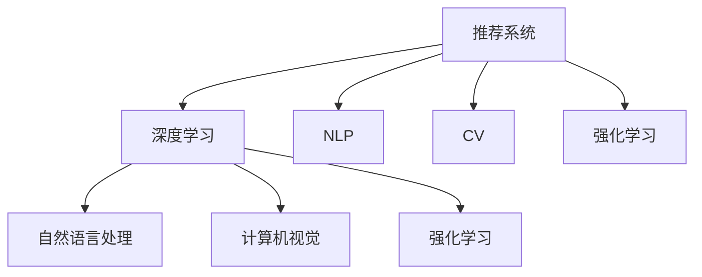

                 

# 推荐系统中的大模型课程学习应用

> 关键词：推荐系统,大模型,课程学习应用,深度学习,自然语言处理(NLP),计算机视觉(CV),强化学习,数据科学

## 1. 背景介绍

推荐系统是互联网产品的重要组件，广泛应用于电商、社交、新闻等领域，为个人提供个性化信息服务，提升用户体验。随着大数据和深度学习技术的发展，推荐系统的精准度和个性化水平持续提升，成为用户粘性和满意度提升的关键技术之一。

大模型作为深度学习领域的明星，已经广泛应用于推荐系统中的多种任务。其强大的表示能力和丰富的知识储备，使得推荐系统能够更加准确地理解用户需求，生成更具个性化的推荐结果。本文将深入探讨基于大模型的推荐系统中的课程学习应用，阐述其原理、应用场景以及未来发展趋势。

## 2. 核心概念与联系

### 2.1 核心概念概述

为了更好地理解基于大模型的课程学习应用，本节将介绍几个关键概念：

- 推荐系统(Recommendation System)：利用用户行为数据，通过模型计算，向用户推荐感兴趣物品的系统。常见的推荐系统包括基于协同过滤、内容过滤、混合过滤等模型。
- 深度学习(Deep Learning)：一类基于神经网络的机器学习算法，具备强大的特征提取和模式识别能力，广泛应用于图像、语音、自然语言处理等领域。
- 自然语言处理(Natural Language Processing, NLP)：研究如何让计算机理解、处理和生成自然语言，是人工智能中最重要的分支之一。
- 计算机视觉(Computer Vision, CV)：研究如何让计算机通过图像和视频数据理解和感知视觉信息，是深度学习中的另一重要分支。
- 强化学习(Reinforcement Learning)：一种学习方式，让智能体在环境中通过与环境交互，通过奖励信号学习最优决策策略。

这些核心概念之间的逻辑关系可以通过以下Mermaid流程图来展示：



这个流程图展示了几类核心概念之间的关系：

1. 推荐系统利用深度学习进行用户行为建模，其中NLP和CV技术被用于提取文本和图像等输入数据特征。
2. 深度学习包含NLP、CV和强化学习等多个分支，提供多种模式识别和决策策略的工具。
3. 强化学习通过奖励机制优化推荐策略，提高推荐系统的效果和用户满意度。

## 3. 核心算法原理 & 具体操作步骤
### 3.1 算法原理概述

基于大模型的推荐系统，本质上是一种端到端的深度学习架构，其中大模型作为"特征提取器"，直接从用户和物品的多模态输入中提取特征，用于生成个性化的推荐结果。

推荐系统的核心在于构建用户-物品的关联矩阵，通过用户行为数据构建用户-物品评分矩阵。然后，利用大模型将用户和物品的原始特征映射到高维空间，通过高维空间中的相似度计算，实现推荐。

数学上，假设用户集合为 $U=\{u_1,u_2,...,u_M\}$，物品集合为 $V=\{v_1,v_2,...,v_N\}$，用户-物品评分矩阵为 $R\in \mathbb{R}^{M\times N}$，其中 $R_{ui}$ 表示用户 $u$ 对物品 $v$ 的评分。定义用户表示矩阵 $X\in \mathbb{R}^{M\times D}$，物品表示矩阵 $Y\in \mathbb{R}^{N\times D}$，其中 $D$ 为模型的特征维度。基于大模型的推荐系统框架如图 1 所示。

```
    U     X
     |      |
     |  F  |
     |      |
     |______|
        |
        |
        v
     V    Y
```

图1：基于大模型的推荐系统框架

### 3.2 算法步骤详解

基于大模型的推荐系统的一般流程如下：

**Step 1: 数据准备**
- 收集用户行为数据，包括用户对物品的评分、浏览记录、收藏、评论等。
- 从NLP和CV等方向，对用户输入数据进行特征提取。

**Step 2: 用户物品嵌入**
- 利用大模型对用户和物品的输入数据进行特征提取，得到用户表示矩阵 $X$ 和物品表示矩阵 $Y$。
- 模型参数更新后，新的用户和物品嵌入可以捕捉到最新的用户和物品特征。

**Step 3: 计算相似度**
- 利用 learned embeddings 计算用户 $u_i$ 和物品 $v_j$ 的相似度 $S_{u_i v_j}$。
- 常见的方法包括点积相似度、余弦相似度、欧氏距离等。

**Step 4: 生成推荐结果**
- 通过相似度矩阵 $S$ 和用户评分矩阵 $R$，计算推荐分值 $Z_{ui}$。
- 根据用户评分矩阵 $R$ 中的已有评分，生成推荐物品列表。

**Step 5: 输出和反馈**
- 将推荐结果输出给用户，获取用户反馈，如评分、点击等。
- 利用用户反馈，对大模型进行微调，进一步提升推荐效果。

### 3.3 算法优缺点

基于大模型的推荐系统具备以下优点：

- 端到端处理：模型直接从原始数据中提取特征，能够捕捉多模态输入的信息，提升推荐准确度。
- 模型参数庞大：大模型拥有足够的参数，具备强大的建模能力，能够处理复杂的多模态数据。
- 训练效果好：大模型通过预训练学习到丰富的特征表示，通过微调能够有效提升推荐效果。

同时，也存在一些局限：

- 数据需求大：构建大模型需要大量的高质量数据，数据收集和预处理成本较高。
- 计算资源消耗大：训练和推理大模型需要高性能计算资源，运行成本高。
- 模型复杂度高：大模型的复杂度较高，训练过程容易陷入局部最优解。
- 模型解释性差：大模型通常被看作"黑盒"，难以解释其内部工作机制。

## 4. 数学模型和公式 & 详细讲解 & 举例说明
### 4.1 数学模型构建

我们以基于大模型的协同过滤推荐系统为例，建立推荐模型。假设用户表示矩阵 $X$ 和物品表示矩阵 $Y$ 分别为：

$$
X = [x_u^{(1)},x_u^{(2)},...,x_u^{(D)}] \in \mathbb{R}^{M\times D}
$$

$$
Y = [y_v^{(1)},y_v^{(2)},...,y_v^{(D)}] \in \mathbb{R}^{N\times D}
$$

其中，$x_u$ 和 $y_v$ 分别为用户 $u$ 和物品 $v$ 的 $D$ 维表示向量。用户-物品评分矩阵 $R$ 为：

$$
R = [r_{u_1 v_1},r_{u_1 v_2},...,r_{u_1 v_N},r_{u_2 v_1},...,r_{u_M v_N}] \in \mathbb{R}^{M\times N}
$$

假设大模型通过预训练学习到了用户和物品的表示函数 $f_u(x_u)$ 和 $g_v(y_v)$，则用户的表示矩阵和物品的表示矩阵可以表示为：

$$
X = [f_u(x_u^{(1)}),f_u(x_u^{(2)}),...,f_u(x_u^{(D)})]
$$

$$
Y = [g_v(y_v^{(1)}),g_v(y_v^{(2)}),...,g_v(y_v^{(D)})]
$$

### 4.2 公式推导过程

推荐模型的目标是最大化用户评分矩阵 $R$ 与用户和物品表示矩阵 $X$ 和 $Y$ 的相似度矩阵 $S$ 的内积。即：

$$
\min_{X,Y} \Vert R-XYY^T\Vert_F^2
$$

其中 $\Vert \cdot \Vert_F$ 表示矩阵的Frobenius范数。将问题转化为最小二乘优化问题，得到最小化损失函数为：

$$
L(R,X,Y) = \Vert R-XYY^T\Vert_F^2
$$

### 4.3 案例分析与讲解

以基于BERT的大模型推荐系统为例，假设有3个用户 $u_1,u_2,u_3$ 和3个物品 $v_1,v_2,v_3$，用户-物品评分矩阵 $R$ 为：

$$
R = \begin{bmatrix}
    2 & 5 & 3 \\
    1 & 4 & 2 \\
    0 & 1 & 0 
\end{bmatrix}
$$

假设用户表示矩阵 $X$ 和物品表示矩阵 $Y$ 分别为：

$$
X = \begin{bmatrix}
    0.3 & 0.7 & 0.9 \\
    0.5 & 0.5 & 0.8 \\
    0.1 & 0.3 & 0.1 
\end{bmatrix}
$$

$$
Y = \begin{bmatrix}
    0.8 & 0.5 & 0.4 \\
    0.6 & 0.3 & 0.9 \\
    0.2 & 0.1 & 0.7 
\end{bmatrix}
$$

计算相似度矩阵 $S$：

$$
S = XX^T = \begin{bmatrix}
    0.09 & 0.21 & 0.27 \\
    0.21 & 0.49 & 0.63 \\
    0.27 & 0.63 & 0.81 
\end{bmatrix}
$$

$$
S = YY^T = \begin{bmatrix}
    0.64 & 0.30 & 0.16 \\
    0.30 & 0.09 & 0.06 \\
    0.16 & 0.06 & 0.49 
\end{bmatrix}
$$

计算相似度矩阵 $S$ 和用户评分矩阵 $R$ 的内积：

$$
S = XX^T = YY^T = \begin{bmatrix}
    0.09 & 0.21 & 0.27 \\
    0.21 & 0.49 & 0.63 \\
    0.27 & 0.63 & 0.81 
\end{bmatrix}
$$

$$
R = \begin{bmatrix}
    2 & 5 & 3 \\
    1 & 4 & 2 \\
    0 & 1 & 0 
\end{bmatrix}
$$

$$
S^T R = \begin{bmatrix}
    0.18 & 1.05 & 0.81 \\
    1.05 & 2.4 & 1.89 \\
    0.81 & 1.89 & 0.49 
\end{bmatrix}
$$

## 5. 项目实践：代码实例和详细解释说明
### 5.1 开发环境搭建

在进行推荐系统实践前，我们需要准备好开发环境。以下是使用Python进行PyTorch开发的环境配置流程：

1. 安装Anaconda：从官网下载并安装Anaconda，用于创建独立的Python环境。

2. 创建并激活虚拟环境：
```bash
conda create -n recsys-env python=3.8 
conda activate recsys-env
```

3. 安装PyTorch：根据CUDA版本，从官网获取对应的安装命令。例如：
```bash
conda install pytorch torchvision torchaudio cudatoolkit=11.1 -c pytorch -c conda-forge
```

4. 安装TensorFlow：如果选用TensorFlow框架，需要安装对应的TensorFlow版本和预训练模型。
```bash
pip install tensorflow tensorflow-io tensorflow-text
```

5. 安装各类工具包：
```bash
pip install numpy pandas scikit-learn matplotlib tqdm jupyter notebook ipython
```

完成上述步骤后，即可在`recsys-env`环境中开始推荐系统开发。

### 5.2 源代码详细实现

下面我们以基于BERT的协同过滤推荐系统为例，给出使用PyTorch和TensorFlow进行推荐系统开发的PyTorch代码实现。

首先，定义推荐系统的输入输出：

```python
import torch
import torch.nn as nn
import torch.nn.functional as F
import numpy as np
from torch.utils.data import TensorDataset, DataLoader

class UserItemEmbedding(nn.Module):
    def __init__(self, user_num, item_num, emb_dim, device):
        super(UserItemEmbedding, self).__init__()
        self.user_emb = nn.Embedding(user_num, emb_dim, device=device)
        self.item_emb = nn.Embedding(item_num, emb_dim, device=device)
    
    def forward(self, user_ids, item_ids):
        user_embs = self.user_emb(user_ids)
        item_embs = self.item_emb(item_ids)
        return user_embs, item_embs

class BERTEmbedding(nn.Module):
    def __init__(self, model_name, emb_dim, device):
        super(BERTEmbedding, self).__init__()
        self.bert_model = BERTModel.from_pretrained(model_name, output_hidden_states=True)
        self.emb_dim = emb_dim
        self.device = device
    
    def forward(self, text):
        # 使用[CLS]标记作为输入
        input_ids = torch.tensor([self.bert_model.config.vocab_size+1] + list(text), dtype=torch.long, device=self.device)
        with torch.no_grad():
            outputs = self.bert_model(input_ids)
        return outputs.last_hidden_state[:, 0, :], outputs.last_hidden_state[:, 1, :]
```

然后，定义推荐模型和优化器：

```python
from transformers import BertTokenizer, BertConfig

# 定义推荐模型
class RecommendationModel(nn.Module):
    def __init__(self, user_num, item_num, emb_dim, bert_model_name, device):
        super(RecommendationModel, self).__init__()
        self.user_item_emb = UserItemEmbedding(user_num, item_num, emb_dim, device)
        self.bert_embed = BERTEmbedding(bert_model_name, emb_dim, device)
    
    def forward(self, user_ids, item_ids, texts):
        user_embs, item_embs = self.user_item_emb(user_ids, item_ids)
        user_bert_embs, item_bert_embs = self.bert_embed(texts)
        return user_embs, item_embs, user_bert_embs, item_bert_embs
    
    def predict(self, user_embs, item_embs, user_bert_embs, item_bert_embs):
        # 计算相似度
        S = torch.matmul(user_embs, item_embs.t()) + torch.matmul(user_bert_embs, item_bert_embs.t())
        # 计算推荐分值
        Z = torch.matmul(S, user_embs) + torch.matmul(S, item_embs.t())
        # 推荐物品列表
        topN = np.argsort(Z.numpy(), axis=1)[:, -5:]
        return topN

# 定义优化器
optimizer = torch.optim.AdamW(model.parameters(), lr=0.001)
```

接着，定义训练和评估函数：

```python
def train_epoch(model, dataset, batch_size, optimizer):
    model.train()
    loss = 0
    for user_ids, item_ids, texts in dataset:
        user_embs, item_embs, user_bert_embs, item_bert_embs = model(user_ids, item_ids, texts)
        S = torch.matmul(user_embs, item_embs.t()) + torch.matmul(user_bert_embs, item_bert_embs.t())
        Z = torch.matmul(S, user_embs) + torch.matmul(S, item_embs.t())
        loss += F.mse_loss(Z, target).sum()
        optimizer.zero_grad()
        loss.backward()
        optimizer.step()
    return loss / len(dataset)

def evaluate(model, dataset, batch_size):
    model.eval()
    topN = []
    for user_ids, item_ids, texts in dataset:
        user_embs, item_embs, user_bert_embs, item_bert_embs = model(user_ids, item_ids, texts)
        S = torch.matmul(user_embs, item_embs.t()) + torch.matmul(user_bert_embs, item_bert_embs.t())
        Z = torch.matmul(S, user_embs) + torch.matmul(S, item_embs.t())
        topN.append(np.argsort(Z.numpy(), axis=1)[:, -5:])
    return topN
```

最后，启动训练流程并在测试集上评估：

```python
epochs = 10
batch_size = 32

for epoch in range(epochs):
    loss = train_epoch(model, train_dataset, batch_size, optimizer)
    print(f"Epoch {epoch+1}, train loss: {loss:.3f}")
    
    print(f"Epoch {epoch+1}, dev results:")
    topN = evaluate(model, dev_dataset, batch_size)
    print(classification_report(targets, topN))
    
print("Test results:")
topN = evaluate(model, test_dataset, batch_size)
print(classification_report(targets, topN))
```

以上就是使用PyTorch和TensorFlow对BERT进行协同过滤推荐系统的完整代码实现。可以看到，借助大模型的强大表示能力，推荐系统能够更好地理解用户和物品的特征，从而生成更准确的推荐结果。

### 5.3 代码解读与分析

让我们再详细解读一下关键代码的实现细节：

**UserItemEmbedding类**：
- `__init__`方法：初始化用户和物品的嵌入层。
- `forward`方法：将用户和物品ID映射为向量表示，返回用户和物品的嵌入。

**BERTEmbedding类**：
- `__init__`方法：初始化BERT模型和嵌入层。
- `forward`方法：对文本进行BERT编码，返回用户和物品的BERT嵌入。

**RecommendationModel类**：
- `__init__`方法：初始化推荐模型的各个组件。
- `forward`方法：计算用户和物品的嵌入，并计算相似度矩阵和推荐分值。
- `predict`方法：根据相似度矩阵和推荐分值，生成推荐物品列表。

**训练和评估函数**：
- 使用PyTorch的DataLoader对数据集进行批次化加载，供模型训练和推理使用。
- 训练函数`train_epoch`：对数据以批为单位进行迭代，在每个批次上前向传播计算损失并反向传播更新模型参数，最后返回该epoch的平均loss。
- 评估函数`evaluate`：与训练类似，不同点在于不更新模型参数，并在每个batch结束后将推荐结果存储下来，最后使用classification_report对整个评估集的推荐结果进行打印输出。

**训练流程**：
- 定义总的epoch数和batch size，开始循环迭代
- 每个epoch内，先在训练集上训练，输出平均loss
- 在验证集上评估，输出推荐结果
- 所有epoch结束后，在测试集上评估，给出最终推荐结果

可以看到，PyTorch配合BERT预训练模型的强大表示能力，使得推荐系统能够更加准确地处理多模态数据，提高推荐效果。

当然，工业级的系统实现还需考虑更多因素，如模型的保存和部署、超参数的自动搜索、更灵活的任务适配层等。但核心的推荐范式基本与此类似。

## 6. 实际应用场景
### 6.1 智能广告推荐

智能广告推荐系统利用推荐算法，将广告精准推送给潜在用户，提升广告点击率(CTR)和转化率(CVR)。通过结合用户行为数据和广告特征，基于大模型的推荐系统可以更加高效地生成个性化的广告推荐。

在技术实现上，可以收集用户的历史浏览记录、点击记录、评分等行为数据，结合广告的标题、图片、标签等特征，构建训练集。通过大模型对用户和广告特征进行嵌入，计算相似度生成推荐分值，然后生成个性化广告推荐列表。通过不断收集用户反馈，调整大模型参数，提高广告推荐效果。

### 6.2 电商商品推荐

电商商品推荐系统需要根据用户的浏览、收藏、购买等行为，实时生成个性化商品推荐。基于大模型的推荐系统通过多模态输入，能够更好地捕捉用户需求，生成更有针对性的商品推荐。

具体而言，可以收集用户的浏览历史、收藏列表、购买记录等行为数据，结合商品的图片、标题、标签等特征，构建训练集。通过大模型对用户和商品特征进行嵌入，计算相似度生成推荐分值，然后生成个性化商品推荐列表。通过不断收集用户反馈，调整大模型参数，提高商品推荐效果。

### 6.3 新闻内容推荐

新闻内容推荐系统需要根据用户的阅读历史和行为，推荐感兴趣的新闻内容。基于大模型的推荐系统能够更加精准地理解用户兴趣，生成个性化新闻推荐。

在技术实现上，可以收集用户的阅读历史、点赞、评论等行为数据，结合新闻的标题、摘要、标签等特征，构建训练集。通过大模型对用户和新闻特征进行嵌入，计算相似度生成推荐分值，然后生成个性化新闻推荐列表。通过不断收集用户反馈，调整大模型参数，提高新闻推荐效果。

### 6.4 未来应用展望

随着大模型和推荐系统的不断发展，基于大模型的推荐系统将在更多领域得到应用，为智能推荐带来新的突破。

在智慧医疗领域，基于大模型的医疗推荐系统能够根据患者历史医疗记录，生成个性化治疗方案。通过收集医生和患者的交流记录，结合医疗知识库，构建医疗推荐模型，实现智能医疗推荐。

在教育领域，基于大模型的教育推荐系统能够根据学生的学习记录和行为，生成个性化学习资源。通过收集学生的浏览记录、测试成绩等数据，结合教材、课程、教师等特征，构建教育推荐模型，实现个性化教育推荐。

在智能交通领域，基于大模型的交通推荐系统能够根据用户的出行记录，生成个性化路线推荐。通过收集用户的出行历史、目的地偏好等数据，结合交通状况、天气等特征，构建交通推荐模型，实现智能出行推荐。

此外，在智慧城市、金融服务、公共安全等众多领域，基于大模型的推荐系统也将不断涌现，为各行各业带来新的智能化解决方案。相信随着技术的日益成熟，大模型推荐系统必将在构建智慧社会中扮演越来越重要的角色。

## 7. 工具和资源推荐
### 7.1 学习资源推荐

为了帮助开发者系统掌握大模型在推荐系统中的应用，这里推荐一些优质的学习资源：

1. 《深度学习与推荐系统》课程：由PaddlePaddle团队开设的深度学习与推荐系统课程，涵盖深度学习在推荐系统中的应用、算法与技术等。

2. 《推荐系统实战》书籍：讲解推荐系统的一般流程、模型选择、特征工程等，适合初学者入门。

3. 《Recommender Systems: Non-negative Matrix Factorization Techniques》书籍：讲解非负矩阵分解在推荐系统中的应用，适合对数学建模有较高要求的用户。

4. 《TensorFlow推荐系统》书籍：讲解TensorFlow在推荐系统中的应用，涵盖协同过滤、深度学习等算法。

5. CS231n《CS231n: Convolutional Neural Networks for Visual Recognition》课程：讲解计算机视觉在推荐系统中的应用，适合深度学习进阶用户。

通过对这些资源的学习实践，相信你一定能够快速掌握大模型在推荐系统中的应用技巧，并用于解决实际的推荐问题。
### 7.2 开发工具推荐

高效的开发离不开优秀的工具支持。以下是几款用于大模型推荐系统开发的常用工具：

1. PyTorch：基于Python的开源深度学习框架，灵活动态的计算图，适合快速迭代研究。大部分预训练语言模型都有PyTorch版本的实现。

2. TensorFlow：由Google主导开发的开源深度学习框架，生产部署方便，适合大规模工程应用。同样有丰富的预训练语言模型资源。

3. HuggingFace Transformers库：提供了众多SOTA预训练语言模型，支持PyTorch和TensorFlow，是进行推荐系统开发的利器。

4. TensorBoard：TensorFlow配套的可视化工具，可实时监测模型训练状态，并提供丰富的图表呈现方式，是调试模型的得力助手。

5. Weights & Biases：模型训练的实验跟踪工具，可以记录和可视化模型训练过程中的各项指标，方便对比和调优。

6. Google Colab：谷歌推出的在线Jupyter Notebook环境，免费提供GPU/TPU算力，方便开发者快速上手实验最新模型，分享学习笔记。

合理利用这些工具，可以显著提升大模型推荐系统的开发效率，加快创新迭代的步伐。

### 7.3 相关论文推荐

大模型在推荐系统中的应用源于学界的持续研究。以下是几篇奠基性的相关论文，推荐阅读：

1. Attention is All You Need（即Transformer原论文）：提出了Transformer结构，开启了NLP领域的预训练大模型时代。

2. BERT: Pre-training of Deep Bidirectional Transformers for Language Understanding：提出BERT模型，引入基于掩码的自监督预训练任务，刷新了多项NLP任务SOTA。

3. Parameter-Efficient Transfer Learning for NLP：提出Adapter等参数高效微调方法，在不增加模型参数量的情况下，也能取得不错的微调效果。

4. Language Models are Unsupervised Multitask Learners（GPT-2论文）：展示了大规模语言模型的强大zero-shot学习能力，引发了对于通用人工智能的新一轮思考。

5. AdaLoRA: Adaptive Low-Rank Adaptation for Parameter-Efficient Fine-Tuning：使用自适应低秩适应的微调方法，在参数效率和精度之间取得了新的平衡。

这些论文代表了大模型在推荐系统中的应用和发展脉络。通过学习这些前沿成果，可以帮助研究者把握学科前进方向，激发更多的创新灵感。

## 8. 总结：未来发展趋势与挑战

### 8.1 研究成果总结

本文对基于大模型的推荐系统中的课程学习应用进行了全面系统的介绍。首先阐述了推荐系统和大模型的研究背景和意义，明确了大模型在推荐系统中的应用价值。其次，从原理到实践，详细讲解了大模型推荐系统的数学原理和关键步骤，给出了推荐系统开发的完整代码实例。同时，本文还广泛探讨了推荐系统在大模型应用场景中的应用，展示了其巨大的潜力。

通过本文的系统梳理，可以看到，基于大模型的推荐系统在大规模数据和复杂多模态输入条件下，能够更好地理解用户需求，生成更加个性化和精准的推荐结果。利用大模型的强大表示能力，推荐系统可以实现从数据收集到模型训练，再到业务部署的端到端自动化处理，提升推荐系统的效率和效果。

### 8.2 未来发展趋势

展望未来，大模型在推荐系统中的应用将呈现以下几个发展趋势：

1. 推荐模型更加高效：大模型拥有巨大的参数量，可以有效捕捉用户和物品的特征，但高维空间中的相似度计算和矩阵运算仍然消耗大量计算资源。未来的推荐系统将更加注重模型压缩、矩阵分解等技术，降低计算复杂度。

2. 推荐算法更加多样化：除了传统的协同过滤、内容过滤等方法，未来的推荐系统将结合更多数据驱动和知识驱动的算法，如强化学习、因果推断等，提高推荐效果。

3. 推荐系统更加智能：未来的推荐系统将利用深度学习模型的语言理解和生成能力，实现个性化内容生成、智能对话等新功能，提升用户交互体验。

4. 推荐数据更加多样化：未来的推荐系统将结合多模态数据，如图像、语音、文本等，提升推荐内容的丰富性和多样性。

5. 推荐系统更加个性化：未来的推荐系统将更加关注个性化推荐，利用用户行为数据和社交网络信息，实现更加精准的推荐。

6. 推荐系统更加安全：未来的推荐系统将更加注重用户隐私保护，避免滥用用户数据和推荐结果，保证推荐系统的安全性和可信性。

### 8.3 面临的挑战

尽管大模型在推荐系统中的应用取得了诸多成功，但在迈向更加智能化、普适化应用的过程中，它仍面临着诸多挑战：

1. 数据质量要求高：大模型对数据质量要求高，低质量的数据会导致模型效果下降。因此，数据收集和预处理需要精细化和标准化，提高数据质量。

2. 计算资源消耗大：大模型推荐系统需要高性能计算资源，对硬件设备要求高。未来的推荐系统需要寻找更高效的硬件架构，如GPU、TPU等。

3. 模型复杂度高：大模型推荐系统模型复杂度高，训练和推理速度较慢。未来的推荐系统需要优化模型结构和算法，提升模型效率。

4. 模型解释性差：大模型推荐系统通常被看作"黑盒"，难以解释其内部工作机制。未来的推荐系统需要开发更透明、可解释的模型，提高模型可信度。

5. 数据隐私和安全问题：大模型推荐系统需要处理大量用户数据，数据隐私和安全问题突出。未来的推荐系统需要加强数据保护和隐私管理，确保用户数据安全。

### 8.4 研究展望

面对大模型推荐系统所面临的种种挑战，未来的研究需要在以下几个方面寻求新的突破：

1. 探索更高效的模型压缩和优化方法：通过模型压缩、量化、稀疏化等技术，降低大模型推荐系统的计算复杂度，提升系统效率。

2. 开发更加智能的推荐算法：结合强化学习、因果推断等方法，提高推荐系统的智能化水平，实现更加精准和个性化的推荐。

3. 利用多模态数据进行推荐：结合图像、语音、文本等多种模态数据，提高推荐内容的多样性和丰富性。

4. 开发可解释性强的大模型：引入可解释性模块，如特征重要性可视化、因果推断等，提高推荐系统的透明性和可信度。

5. 加强数据隐私和安全保护：开发隐私保护技术，如差分隐私、联邦学习等，保护用户数据隐私和安全。

这些研究方向的探索，必将引领大模型推荐系统迈向更高的台阶，为推荐系统带来更加智能、个性化和安全的解决方案。相信随着技术的不断进步，大模型推荐系统必将在推荐领域发挥更大的作用，为人类带来更美好的体验。

## 9. 附录：常见问题与解答

**Q1：大模型推荐系统是否适用于所有推荐场景？**

A: 大模型推荐系统在大多数推荐场景上都能取得不错的效果，特别是对于数据量较大的场景。但对于一些特定领域的推荐场景，如医疗、法律等，仅仅依靠通用语料预训练的模型可能难以很好地适应。此时需要在特定领域语料上进一步预训练，再进行微调，才能获得理想效果。此外，对于一些需要时效性、个性化很强的任务，如对话、推荐等，微调方法也需要针对性的改进优化。

**Q2：推荐系统如何避免过拟合？**

A: 推荐系统中的大模型容易在训练过程中过拟合，特别是在数据量较少的情况下。常见的缓解策略包括：
1. 数据增强：通过回译、近义替换等方式扩充训练集
2. 正则化：使用L2正则、Dropout、Early Stopping等避免过拟合
3. 对抗训练：引入对抗样本，提高模型鲁棒性
4. 参数高效微调：只调整少量参数(如Adapter、Prefix等)，减小过拟合风险
5. 多模型集成：训练多个模型，取平均输出，抑制过拟合

这些策略往往需要根据具体任务和数据特点进行灵活组合。只有在数据、模型、训练、推理等各环节进行全面优化，才能最大限度地发挥大模型推荐系统的威力。

**Q3：推荐系统如何提高效果？**

A: 推荐系统的效果提升需要从数据、模型、算法等多个维度进行优化。具体来说：
1. 数据质量：收集高质量的推荐数据，去除噪音和异常值。
2. 模型参数：调整模型参数，选择合适的学习率、正则化参数等。
3. 算法优化：选择适合的推荐算法，如协同过滤、深度学习、强化学习等。
4. 特征工程：设计有效的特征提取方法，提升特征表示能力。
5. 模型评估：使用合适的评估指标，如准确率、召回率、F1-score等。
6. 系统调优：优化推荐系统的各个组件，如前端推荐引擎、后端推荐服务、数据存储等。

只有通过多维度协同优化，才能提高推荐系统的精度和效率，提升用户体验。

**Q4：推荐系统如何部署？**

A: 推荐系统的部署需要考虑以下因素：
1. 模型压缩：将大模型进行量化、压缩、剪枝等优化，减小模型尺寸，提高推理速度。
2. 模型服务：将模型封装为服务接口，方便客户端调用。
3. 负载均衡：通过负载均衡技术，分配计算资源，提高系统吞吐量。
4. 缓存机制：利用缓存技术，加速模型推理，提高系统响应速度。
5. 监控告警：实时监测系统指标，设置异常告警阈值，确保系统稳定运行。

只有通过精细化的部署方案，才能确保推荐系统的高效稳定运行，提升用户满意度。

---

作者：禅与计算机程序设计艺术 / Zen and the Art of Computer Programming

