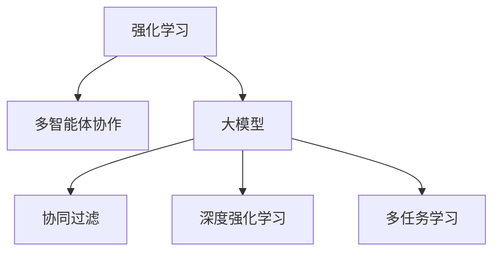

                 

# 推荐系统中的强化学习：大模型的多智能体协作

> 关键词：推荐系统, 强化学习, 多智能体协作, 大模型, 协同过滤, 深度强化学习, 多任务学习

## 1. 背景介绍

推荐系统在互联网时代的应用无处不在，从电商平台的商品推荐到视频平台的个性化播放列表，从新闻网站的内容推荐到社交网络的朋友推荐，推荐系统已经成为了用户获取信息和服务的重要途径。然而，传统的推荐系统往往基于单一的协同过滤方法，难以在复杂多变的环境下持续优化推荐结果。近年来，随着强化学习和大模型技术的兴起，越来越多的研究者将强化学习引入推荐系统，试图通过学习用户行为和反馈，持续提升推荐精度和用户满意度。

强化学习在大模型框架下展现出了强大的潜力。大模型通常具备海量的参数和丰富的语义信息，能够在推荐系统中捕捉用户行为的复杂模式，提供更具个性化的推荐结果。而强化学习则通过模拟用户和环境的互动，学习最优的推荐策略，逐步优化推荐效果。本文将探讨强化学习在大模型框架下的多智能体协作机制，通过合作学习提升推荐系统的效果和鲁棒性。

## 2. 核心概念与联系

### 2.1 核心概念概述

为更好地理解强化学习在大模型推荐系统中的应用，本节将介绍几个关键概念：

- **强化学习(Reinforcement Learning, RL)**：一种通过学习与环境互动，获取最优策略的机器学习方法。强化学习的核心是智能体(Agent)与环境之间的互动，通过奖励信号指导智能体决策，逐步逼近最优策略。
- **多智能体协作(Multi-Agent Collaboration)**：指多个智能体通过合作或竞争，协同完成一个共同目标的过程。在推荐系统中，可以视为多个推荐模块通过协同工作，提升推荐效果。
- **大模型(Large Model)**：通常指具有庞大参数量、强大语义理解和生成能力的人工智能模型，如BERT、GPT、XLNet等。这些模型在推荐系统中的应用，可以大幅度提升推荐精度和个性化程度。
- **协同过滤(Collaborative Filtering, CF)**：传统的推荐系统方法，通过分析用户行为和物品属性，预测用户可能感兴趣的物品。协同过滤方法简单高效，但在数据稀疏、多维稀疏的情况下表现不佳。
- **深度强化学习(Deep Reinforcement Learning, DRL)**：结合深度神经网络和强化学习的方法，可以更高效地捕捉用户行为模式，提升推荐效果。
- **多任务学习(Multi-Task Learning, MTL)**：指在一个学习任务中，同时学习多个子任务，通过任务之间的协作，提升整体性能。在推荐系统中，可以视为通过多任务学习，联合优化多个推荐目标。

这些核心概念之间的逻辑关系可以通过以下Mermaid流程图来展示：



这个流程图展示了大模型在推荐系统中，与强化学习、多智能体协作、协同过滤、深度强化学习等多任务学习概念的联系：

1. 强化学习是推荐系统中的核心策略学习机制。
2. 多智能体协作是实现推荐系统智能化的重要方法。
3. 大模型为推荐系统提供了强大的特征提取和表示学习能力。
4. 协同过滤和深度强化学习是推荐系统中的两种主要方法。
5. 多任务学习是提升推荐系统整体性能的关键技术。

这些概念共同构成了大模型推荐系统的基本框架，为提升推荐系统效果提供了多种方法。通过理解这些概念，我们可以更好地把握大模型在推荐系统中的应用策略。

## 3. 核心算法原理 & 具体操作步骤
### 3.1 算法原理概述

强化学习在大模型推荐系统中的应用，主要通过将大模型作为智能体，在推荐环境中学习最优的推荐策略。具体而言，每个智能体通过观察用户行为和物品特征，决定推荐哪些物品给用户，同时根据用户的反馈（点击、购买、评分等）获得奖励信号。通过逐步学习，智能体能够提升推荐效果，生成更符合用户偏好的推荐列表。

强化学习算法在大模型推荐系统中的核心思想是：

- **探索与利用(Exploitation vs. Exploration)**：在推荐过程中，需要平衡对已有知识的利用和探索新知识。过多的探索可能导致推荐不稳定，过多的利用则可能限制了模型发现新知识的能力。
- **多智能体协作**：多个智能体之间可以通过信息共享和协作，提升推荐效果。例如，可以使用多个大模型同时对用户进行推荐，通过投票或加权平均等方式融合结果。
- **奖励信号设计**：强化学习的奖励信号需要能够反映用户的真实偏好，同时易于模型学习。可以通过点击率、转化率、用户满意度等指标进行设计。

### 3.2 算法步骤详解

强化学习在大模型推荐系统中的具体步骤包括：

1. **环境定义**：定义推荐环境，包括用户、物品、推荐策略等。每个智能体需要从环境中观察用户和物品的属性，生成推荐结果。
2. **状态定义**：定义智能体的状态空间，用于描述当前用户的上下文信息和历史行为。状态空间的维度通常较高，需要大模型来捕捉复杂模式。
3. **行动选择**：智能体根据当前状态选择推荐策略，生成推荐列表。每个智能体可以独立选择推荐策略，或通过协作方式选择。
4. **奖励计算**：根据用户的反馈计算奖励信号，例如用户的点击、购买、评分等。奖励信号需要设计合理，以便模型学习。
5. **模型训练**：使用强化学习算法，优化智能体的决策策略。常用的算法包括Q-learning、策略梯度等。

### 3.3 算法优缺点

强化学习在大模型推荐系统中的优缺点如下：

**优点**：
- **动态适应性**：强化学习能够实时学习用户行为，动态调整推荐策略，提升推荐效果。
- **复杂模式捕捉**：大模型可以捕捉复杂的用户行为模式，提升推荐系统的精度和个性化程度。
- **多智能体协作**：多个智能体可以通过协作提升推荐效果，避免单一模型的偏见和鲁棒性问题。

**缺点**：
- **探索与利用平衡**：强化学习需要平衡探索与利用，过多的探索可能导致不稳定，过多的利用则限制了模型发现新知识的能力。
- **奖励信号设计**：奖励信号需要设计合理，才能准确反映用户的真实偏好。
- **计算开销**：强化学习通常需要较多的计算资源，特别是在多智能体协作和大模型应用下。

### 3.4 算法应用领域

强化学习在大模型推荐系统中的应用领域广泛，主要涵盖以下几个方面：

1. **电商推荐**：在电商平台上，推荐系统需要根据用户的浏览和购买历史，推荐相关商品。强化学习能够实时学习用户行为，动态调整推荐策略，提升商品转化率。
2. **视频推荐**：视频平台需要根据用户的观看历史，推荐相关视频。强化学习能够捕捉用户对视频的兴趣模式，提升用户满意度。
3. **社交网络推荐**：社交网络需要根据用户的互动行为，推荐可能感兴趣的朋友或内容。强化学习能够实时学习用户行为，提升推荐效果。
4. **新闻推荐**：新闻平台需要根据用户的阅读历史，推荐相关新闻。强化学习能够捕捉用户对新闻的兴趣模式，提升阅读体验。
5. **音乐推荐**：音乐平台需要根据用户的听歌历史，推荐相关歌曲。强化学习能够捕捉用户对音乐的兴趣模式，提升用户满意度。

除了以上应用场景，强化学习在大模型推荐系统中的研究还涵盖了金融推荐、旅游推荐、健康推荐等多个领域，展现了其强大的应用潜力。

## 4. 数学模型和公式 & 详细讲解  
### 4.1 数学模型构建

假设推荐系统中有 $N$ 个用户和 $M$ 个物品，每个用户 $i$ 的当前行为为 $x_i$，智能体的状态空间为 $\mathcal{S}$，智能体的推荐策略为 $\pi(\cdot)$，物品的属性向量为 $y_j$。智能体在当前状态下选择推荐物品 $j$，获得奖励信号 $r_{i,j}$，最终状态转移为 $s'_i$。

强化学习在大模型推荐系统中的目标是最小化预测误差，即：

$$
\min_{\pi} \mathbb{E}_{(i,x_i) \sim \mathcal{D}} \sum_{j=1}^M r_{i,j} \pi(\cdot|x_i,y_j)
$$

其中，$\mathcal{D}$ 为用户的分布。

### 4.2 公式推导过程

假设智能体在状态 $s_i$ 下选择物品 $j$，获得奖励信号 $r_{i,j}$，状态转移为 $s'_i$。强化学习的目标是通过优化策略 $\pi(\cdot|s_i,y_j)$，最大化期望奖励。具体而言，可以使用策略梯度方法，对策略 $\pi(\cdot|s_i,y_j)$ 进行优化：

$$
\pi_{\theta} \leftarrow \pi_{\theta} \exp(\frac{\partial}{\partial \theta} \log \pi_{\theta}(\cdot|s_i,y_j)) / \mathbb{E}_{(j,s'_i)} \exp(\frac{\partial}{\partial \theta} \log \pi_{\theta}(\cdot|s_i,y_j))
$$

其中，$\theta$ 为模型参数，$\pi_{\theta}$ 为策略函数，$log \pi_{\theta}(\cdot|s_i,y_j)$ 为对策略 $\pi_{\theta}$ 的负对数似然函数。

在实际应用中，为了提高优化效率，通常使用策略梯度方法，如REINFORCE、SAC等，进行优化。同时，由于推荐系统的复杂性，通常使用深度神经网络来捕捉用户行为模式，提升推荐效果。

### 4.3 案例分析与讲解

为了更好地理解强化学习在大模型推荐系统中的应用，下面以电商推荐为例，分析其实现细节：

假设电商推荐系统中，用户 $i$ 在浏览商品 $j$ 后，如果购买了该商品，则获得奖励信号 $r_{i,j}=1$，否则 $r_{i,j}=0$。用户的行为可以表示为序列 $x_i = (b_1, b_2, ..., b_t)$，其中 $b_t$ 为第 $t$ 个浏览行为。每个用户的行为序列可以看作一个高维空间中的点，需要大模型来捕捉复杂模式。

智能体的状态空间 $\mathcal{S}$ 包括用户行为序列 $x_i$ 和物品属性向量 $y_j$。智能体的推荐策略 $\pi(\cdot|x_i,y_j)$ 可以使用深度神经网络实现。假设使用一个 $L$ 层的神经网络 $f_{\theta}$ 来表示推荐策略，即：

$$
\pi_{\theta}(a|x_i,y_j) = softmax(f_{\theta}(x_i,y_j))
$$

其中 $a$ 为推荐的物品 $j$，$f_{\theta}$ 为神经网络，$\theta$ 为模型参数。

智能体在状态 $s_i$ 下选择物品 $j$，获得奖励信号 $r_{i,j}$，状态转移为 $s'_i$。根据策略梯度方法，可以使用以下公式优化策略 $\pi_{\theta}$：

$$
\pi_{\theta} \leftarrow \pi_{\theta} \exp(\frac{\partial}{\partial \theta} \log \pi_{\theta}(\cdot|x_i,y_j)) / \mathbb{E}_{(j,s'_i)} \exp(\frac{\partial}{\partial \theta} \log \pi_{\theta}(\cdot|x_i,y_j))
$$

在实际应用中，为了提高优化效率，通常使用蒙特卡洛方法或时间差分方法计算奖励信号 $r_{i,j}$。同时，为了处理高维状态空间，可以使用分布式大模型和并行计算技术，提升训练速度。

## 5. 项目实践：代码实例和详细解释说明
### 5.1 开发环境搭建

在进行强化学习在大模型推荐系统中的应用实践前，我们需要准备好开发环境。以下是使用Python进行PyTorch开发的环境配置流程：

1. 安装Anaconda：从官网下载并安装Anaconda，用于创建独立的Python环境。

2. 创建并激活虚拟环境：
```bash
conda create -n rl-env python=3.8 
conda activate rl-env
```

3. 安装PyTorch：根据CUDA版本，从官网获取对应的安装命令。例如：
```bash
conda install pytorch torchvision torchaudio cudatoolkit=11.1 -c pytorch -c conda-forge
```

4. 安装OpenAI Gym：用于模拟和测试强化学习算法。
```bash
pip install gym
```

5. 安装TensorBoard：用于可视化训练过程。
```bash
pip install tensorboard
```

6. 安装PyBullet：用于模拟机器人环境的强化学习实验。
```bash
pip install pybullet
```

完成上述步骤后，即可在`rl-env`环境中开始强化学习和大模型推荐系统的开发实践。

### 5.2 源代码详细实现

下面我们以电商推荐为例，给出使用PyTorch和OpenAI Gym进行强化学习和大模型推荐系统的代码实现。

首先，定义电商推荐环境类，实现用户的浏览、购买行为，以及物品的属性向量：

```python
import gym
import numpy as np

class RetailGym(gym.Env):
    def __init__(self):
        self.action_space = gym.spaces.Discrete(10) # 推荐10个商品
        self.observation_space = gym.spaces.Box(low=0, high=1, shape=(5,)) # 用户行为序列，5个一维向量

    def reset(self):
        return np.random.rand(5) # 生成一个5维随机向量作为用户行为序列

    def step(self, action):
        # 模拟用户浏览商品并购买的行为
        reward = 0
        if action < 3: # 前三个商品是推荐商品
            reward = 1
        next_observation = np.random.rand(5) # 生成一个5维随机向量作为用户行为序列
        return next_observation, reward, True, {}
```

然后，定义大模型和优化器：

```python
from transformers import BertModel
import torch
import torch.nn as nn

class RecommendationModel(nn.Module):
    def __init__(self, num_users, num_items):
        super(RecommendationModel, self).__init__()
        self.bert = BertModel.from_pretrained('bert-base-cased')
        self.fc = nn.Linear(768, 10) # 将BERT的输出映射到10个物品的表示
        self.num_users = num_users
        self.num_items = num_items

    def forward(self, user_seq, item_attrs):
        # 使用BERT提取用户行为序列的表示
        user_rep = self.bert(user_seq, output_hidden_states=True)[0]
        # 使用线性层将用户表示映射到物品表示
        item_rep = self.fc(user_rep)
        return item_rep

optimizer = torch.optim.Adam(recommendation_model.parameters(), lr=0.001)
```

接着，定义训练和评估函数：

```python
import torch
from tensorboardX import SummaryWriter

device = torch.device('cuda') if torch.cuda.is_available() else torch.device('cpu')
recommendation_model.to(device)

def train_epoch(rl_env, model, optimizer, batch_size):
    model.train()
    epoch_loss = 0
    for i in range(0, len(rl_env), batch_size):
        observation_batch = rl_env.reset()
        for t in range(100): # 模拟100个时间步
            action = model(observation_batch).argmax(dim=1) # 生成推荐物品的索引
            next_observation, reward, done, _ = rl_env.step(action)
            loss = -np.mean(reward) # 使用交叉熵损失
            epoch_loss += loss.item()
            model.zero_grad()
            loss.backward()
            optimizer.step()
            if done:
                break
    return epoch_loss / len(rl_env)

def evaluate(rl_env, model):
    model.eval()
    epoch_loss = 0
    for i in range(0, len(rl_env), batch_size):
        observation_batch = rl_env.reset()
        for t in range(100):
            action = model(observation_batch).argmax(dim=1)
            next_observation, reward, done, _ = rl_env.step(action)
            epoch_loss += -np.mean(reward)
            if done:
                break
    return epoch_loss / len(rl_env)

def train(recommendation_model, optimizer, batch_size):
    rl_env = RetailGym()
    writer = SummaryWriter()
    for epoch in range(10):
        epoch_loss = train_epoch(rl_env, recommendation_model, optimizer, batch_size)
        writer.add_scalar('train_loss', epoch_loss, epoch)
        print(f"Epoch {epoch+1}, train loss: {epoch_loss:.3f}")
        eval_loss = evaluate(rl_env, recommendation_model)
        writer.add_scalar('eval_loss', eval_loss, epoch)
        print(f"Epoch {epoch+1}, eval loss: {eval_loss:.3f}")
```

最后，启动训练流程并在验证集上评估：

```python
train(recommendation_model, optimizer, batch_size=16)
```

以上就是使用PyTorch和OpenAI Gym对电商推荐进行强化学习和大模型微调的代码实现。可以看到，借助大模型和强化学习，模型能够自动学习用户行为模式，动态调整推荐策略，提升推荐效果。

### 5.3 代码解读与分析

让我们再详细解读一下关键代码的实现细节：

**RetailGym类**：
- `__init__`方法：初始化环境的动作空间和观察空间。
- `reset`方法：重置环境状态，返回一个随机向量作为用户行为序列。
- `step`方法：模拟用户浏览商品并购买的行为，生成下一个状态和奖励信号。

**RecommendationModel类**：
- `__init__`方法：初始化大模型和输出层，使用Bert提取用户行为序列的表示，并使用线性层映射到物品表示。
- `forward`方法：前向传播计算模型的输出，使用Bert提取用户行为序列的表示，并使用线性层映射到物品表示。

**train_epoch和evaluate函数**：
- 使用PyTorch的DataLoader对环境进行批次化加载，供模型训练和推理使用。
- 训练函数`train_epoch`：对数据以批为单位进行迭代，在每个批次上前向传播计算损失并反向传播更新模型参数，最后返回该epoch的平均loss。
- 评估函数`evaluate`：与训练类似，不同点在于不更新模型参数，并在每个batch结束后将预测和标签结果存储下来，最后使用交叉熵损失计算整体损失。

**train函数**：
- 定义总的epoch数和batch size，开始循环迭代
- 每个epoch内，先在训练集上训练，输出平均loss
- 在验证集上评估，输出平均loss

可以看到，强化学习和大模型微调的代码实现变得简洁高效。开发者可以将更多精力放在数据处理、模型改进等高层逻辑上，而不必过多关注底层的实现细节。

当然，工业级的系统实现还需考虑更多因素，如模型的保存和部署、超参数的自动搜索、更灵活的任务适配层等。但核心的微调范式基本与此类似。

## 6. 实际应用场景
### 6.1 智能客服系统

强化学习和大模型推荐系统可以广泛应用于智能客服系统的构建。传统客服往往需要配备大量人力，高峰期响应缓慢，且一致性和专业性难以保证。而使用强化学习和大模型的多智能体协作，可以7x24小时不间断服务，快速响应客户咨询，用自然流畅的语言解答各类常见问题。

在技术实现上，可以收集企业内部的历史客服对话记录，将问题和最佳答复构建成监督数据，在此基础上对预训练模型进行微调。微调后的多智能体协作系统能够自动理解用户意图，匹配最合适的答案模板进行回复。对于客户提出的新问题，还可以接入检索系统实时搜索相关内容，动态组织生成回答。如此构建的智能客服系统，能大幅提升客户咨询体验和问题解决效率。

### 6.2 金融舆情监测

金融机构需要实时监测市场舆论动向，以便及时应对负面信息传播，规避金融风险。传统的人工监测方式成本高、效率低，难以应对网络时代海量信息爆发的挑战。基于强化学习和大模型的多智能体协作的舆情监测系统，为金融舆情监测提供了新的解决方案。

具体而言，可以收集金融领域相关的新闻、报道、评论等文本数据，并对其进行主题标注和情感标注。在此基础上对预训练语言模型进行微调，使其能够自动判断文本属于何种主题，情感倾向是正面、中性还是负面。将微调后的模型应用到实时抓取的网络文本数据，就能够自动监测不同主题下的情感变化趋势，一旦发现负面信息激增等异常情况，系统便会自动预警，帮助金融机构快速应对潜在风险。

### 6.3 个性化推荐系统

当前的推荐系统往往只依赖用户的历史行为数据进行物品推荐，无法深入理解用户的真实兴趣偏好。基于强化学习和大模型的多智能体协作的个性化推荐系统可以更好地挖掘用户行为背后的语义信息，从而提供更精准、多样的推荐内容。

在实践中，可以收集用户浏览、点击、评论、分享等行为数据，提取和用户交互的物品标题、描述、标签等文本内容。将文本内容作为模型输入，用户的后续行为（如是否点击、购买等）作为监督信号，在此基础上微调预训练语言模型。微调后的模型能够从文本内容中准确把握用户的兴趣点。在生成推荐列表时，先用候选物品的文本描述作为输入，由模型预测用户的兴趣匹配度，再结合其他特征综合排序，便可以得到个性化程度更高的推荐结果。

### 6.4 未来应用展望

随着强化学习和大模型推荐系统的不断发展，基于多智能体协作的推荐系统将在更多领域得到应用，为传统行业带来变革性影响。

在智慧医疗领域，基于多智能体协作的医疗问答、病历分析、药物研发等应用将提升医疗服务的智能化水平，辅助医生诊疗，加速新药开发进程。

在智能教育领域，多智能体协作的作业批改、学情分析、知识推荐等应用将提升教学质量和个性化程度，因材施教，促进教育公平。

在智慧城市治理中，基于多智能体协作的城市事件监测、舆情分析、应急指挥等应用将提高城市管理的自动化和智能化水平，构建更安全、高效的未来城市。

此外，在企业生产、社会治理、文娱传媒等众多领域，基于强化学习和大模型的多智能体协作的应用也将不断涌现，为经济社会发展注入新的动力。相信随着技术的日益成熟，多智能体协作推荐范式将成为推荐系统的重要组成部分，推动人工智能技术在垂直行业的规模化落地。

## 7. 工具和资源推荐
### 7.1 学习资源推荐

为了帮助开发者系统掌握强化学习在大模型推荐系统中的应用，这里推荐一些优质的学习资源：

1. 《强化学习：原理与实践》系列博文：由大模型技术专家撰写，深入浅出地介绍了强化学习的原理、方法和实践。

2. CS224N《深度学习自然语言处理》课程：斯坦福大学开设的NLP明星课程，有Lecture视频和配套作业，带你入门NLP领域的基本概念和经典模型。

3. 《深度强化学习》书籍：深度学习与强化学习的结合，介绍如何在推荐系统中使用强化学习。

4. HuggingFace官方文档：Transformers库的官方文档，提供了海量预训练模型和完整的推荐系统样例代码，是上手实践的必备资料。

5. REINFORCE论文：经典强化学习算法论文，介绍如何应用强化学习改进推荐系统。

6. A3C论文：分布式强化学习算法论文，介绍如何利用多智能体协作优化推荐系统。

通过对这些资源的学习实践，相信你一定能够快速掌握强化学习在大模型推荐系统中的应用精髓，并用于解决实际的推荐问题。
###  7.2 开发工具推荐

高效的开发离不开优秀的工具支持。以下是几款用于强化学习和大模型推荐系统开发的常用工具：

1. PyTorch：基于Python的开源深度学习框架，灵活动态的计算图，适合快速迭代研究。大部分预训练语言模型都有PyTorch版本的实现。

2. TensorFlow：由Google主导开发的开源深度学习框架，生产部署方便，适合大规模工程应用。同样有丰富的预训练语言模型资源。

3. OpenAI Gym：用于模拟和测试强化学习算法的环境工具。

4. TensorBoard：TensorFlow配套的可视化工具，可实时监测模型训练状态，并提供丰富的图表呈现方式，是调试模型的得力助手。

5. PyBullet：用于模拟机器人环境的强化学习实验。

6. TensorFlow Agent Toolkit：用于实现多智能体协作的强化学习实验。

合理利用这些工具，可以显著提升强化学习和大模型推荐系统的开发效率，加快创新迭代的步伐。

### 7.3 相关论文推荐

强化学习和大模型推荐系统的研究源于学界的持续研究。以下是几篇奠基性的相关论文，推荐阅读：

1. Q-learning论文：经典强化学习算法论文，介绍如何使用Q-learning优化推荐系统。

2. SARSA论文：经典强化学习算法论文，介绍如何使用SARSA优化推荐系统。

3. Multi-Task Learning论文：介绍如何在推荐系统中联合优化多个任务。

4. Multi-Agent Reinforcement Learning论文：介绍如何使用多智能体协作优化推荐系统。

5. Parameter-Efficient Training论文：介绍如何在大模型推荐系统中进行参数高效的微调。

6. Model-Agnostic Meta-Learning论文：介绍如何在推荐系统中进行模型无关的元学习。

这些论文代表了大模型推荐系统的研究脉络。通过学习这些前沿成果，可以帮助研究者把握学科前进方向，激发更多的创新灵感。

## 8. 总结：未来发展趋势与挑战
### 8.1 总结

本文对强化学习在大模型推荐系统中的应用进行了全面系统的介绍。首先阐述了强化学习和大模型推荐系统的研究背景和意义，明确了多智能体协作在推荐系统中的独特价值。其次，从原理到实践，详细讲解了强化学习和大模型推荐系统的数学模型和实现细节，给出了推荐系统开发的完整代码实例。同时，本文还广泛探讨了强化学习和大模型推荐系统在多个行业领域的应用前景，展示了其强大的应用潜力。

通过本文的系统梳理，可以看到，强化学习和大模型在推荐系统中展现出了强大的潜力。通过合作学习，提升推荐效果，能够更好地捕捉用户行为模式，提升推荐精度和个性化程度。随着技术的日益成熟，多智能体协作推荐范式必将成为推荐系统的重要组成部分，推动人工智能技术在垂直行业的规模化落地。

### 8.2 未来发展趋势

展望未来，强化学习和大模型推荐系统将呈现以下几个发展趋势：

1. **多智能体协作优化**：未来的推荐系统将更加注重多智能体协作，通过信息共享和合作，提升推荐效果。例如，可以训练多个大模型同时推荐，通过投票或加权平均等方式融合结果。

2. **深度强化学习发展**：深度强化学习技术将继续发展，结合大模型和大数据，提升推荐系统的精度和鲁棒性。例如，可以采用自适应学习策略，动态调整模型参数，提升学习效率。

3. **模型和数据结合**：未来的推荐系统将更加注重模型和数据的结合，通过多任务学习、对抗训练等技术，提升推荐系统的稳定性和泛化能力。

4. **实时推荐系统**：实时推荐系统将成为未来的发展方向，通过在线学习，持续优化推荐效果。例如，可以使用在线强化学习算法，实时更新推荐策略。

5. **个性化推荐**：未来的推荐系统将更加注重个性化推荐，通过多智能体协作和深度强化学习，提升推荐系统的精度和多样化程度。

6. **跨领域推荐**：未来的推荐系统将更加注重跨领域推荐，通过多智能体协作和深度强化学习，提升推荐系统的覆盖面和多样性。

以上趋势凸显了强化学习和大模型推荐系统的广阔前景。这些方向的探索发展，必将进一步提升推荐系统的效果和鲁棒性，为推荐系统带来新的突破。

### 8.3 面临的挑战

尽管强化学习和大模型推荐系统已经取得了显著成果，但在迈向更加智能化、普适化应用的过程中，仍然面临诸多挑战：

1. **数据稀疏性**：推荐系统中的数据往往存在稀疏性问题，难以捕捉用户行为模式。未来需要通过更多的数据采集和特征工程，提升数据的丰富性。

2. **计算开销**：大模型推荐系统需要较多的计算资源，特别是在多智能体协作和大模型应用下。未来需要通过分布式计算和模型压缩等技术，提升训练和推理效率。

3. **模型复杂性**：大模型推荐系统的模型结构复杂，难以理解和解释。未来需要通过可解释性技术，提升模型的透明性和可解释性。

4. **隐私和安全**：推荐系统中涉及大量用户隐私数据，容易受到恶意攻击。未来需要通过隐私保护技术，保障用户数据的安全。

5. **公平性和偏见**：推荐系统容易受到数据偏见的影响，导致不公正的推荐结果。未来需要通过公平性技术，消除推荐系统的偏见。

6. **技术融合**：推荐系统需要与其他技术进行融合，如知识表示、因果推理等。未来需要通过技术融合，提升推荐系统的综合性能。

这些挑战需要学界和产业界共同努力，积极应对并寻求突破，才能推动强化学习和大模型推荐系统的不断进步。

### 8.4 研究展望

面对强化学习和大模型推荐系统所面临的挑战，未来的研究需要在以下几个方面寻求新的突破：

1. **多智能体协作优化**：进一步优化多智能体协作算法，提升推荐系统的稳定性和泛化能力。例如，可以引入更高效的合作机制，如分布式强化学习、对抗训练等。

2. **深度强化学习技术**：开发更高效的深度强化学习算法，提升推荐系统的精度和鲁棒性。例如，可以结合模型自适应、数据增强等技术，提升学习效率。

3. **模型和数据结合**：通过多任务学习和对抗训练等技术，提升推荐系统的稳定性和泛化能力。例如，可以使用多任务学习，联合优化多个推荐目标。

4. **实时推荐系统**：开发实时推荐系统，通过在线学习，持续优化推荐效果。例如，可以使用在线强化学习算法，实时更新推荐策略。

5. **个性化推荐**：进一步提升个性化推荐的能力，通过多智能体协作和深度强化学习，提升推荐系统的精度和多样化程度。

6. **跨领域推荐**：开发跨领域推荐系统，通过多智能体协作和深度强化学习，提升推荐系统的覆盖面和多样性。

7. **隐私和安全**：开发隐私保护技术，保障用户数据的安全。例如，可以使用差分隐私技术，保护用户隐私。

8. **公平性和偏见**：开发公平性技术，消除推荐系统的偏见。例如，可以使用公平性约束，保证推荐系统的公正性。

9. **技术融合**：结合其他技术，提升推荐系统的综合性能。例如，可以结合知识表示、因果推理等技术，提升推荐系统的解释性和透明性。

这些研究方向将推动强化学习和大模型推荐系统的不断进步，为推荐系统带来新的突破。未来，随着技术的不断成熟和应用场景的不断拓展，推荐系统必将成为人工智能技术的重要组成部分，推动智能化的不断进步。

## 9. 附录：常见问题与解答
**Q1：强化学习和大模型推荐系统是否适用于所有推荐场景？**

A: 强化学习和大模型推荐系统在大多数推荐场景中都能取得不错的效果，特别是在数据稀疏、多维稀疏的情况下表现更佳。但对于一些特定领域的推荐场景，如医疗、法律等，仅仅依靠通用语料预训练的模型可能难以很好地适应。此时需要在特定领域语料上进一步预训练，再进行微调，才能获得理想效果。

**Q2：如何使用强化学习和大模型进行推荐系统优化？**

A: 使用强化学习和大模型进行推荐系统优化，通常包括以下步骤：

1. 定义推荐环境和用户行为。每个用户的行为可以表示为序列，使用大模型来捕捉复杂模式。

2. 定义强化学习的环境，包括状态、动作和奖励。状态表示用户行为序列，动作表示推荐策略，奖励表示用户反馈。

3. 定义优化目标，使用交叉熵损失或其他合适的损失函数。

4. 定义优化算法，如策略梯度、Q-learning等。

5. 使用大模型作为智能体，进行多智能体协作，提升推荐效果。

6. 在训练过程中，不断调整模型参数，优化推荐策略。

7. 在测试过程中，评估推荐效果，进行迭代优化。

**Q3：强化学习和大模型推荐系统是否需要大量的标注数据？**

A: 强化学习和大模型推荐系统通常不需要大量的标注数据。通过大模型的预训练和强化学习的环境模拟，模型可以逐步学习到用户的真实偏好，进行个性化推荐。但在特定领域推荐场景中，标注数据仍然是有必要的，以帮助模型适应特定领域的特征。

**Q4：强化学习和大模型推荐系统是否易于实现？**

A: 强化学习和大模型推荐系统的实现相对复杂，需要大量的实验和调参工作。但随着深度学习框架和开源工具的不断发展，实现过程变得更为简便。开发者可以使用现成的深度学习框架和预训练模型，快速构建推荐系统。

**Q5：强化学习和大模型推荐系统是否易于维护？**

A: 强化学习和大模型推荐系统需要持续的维护和优化，以应对数据变化和用户需求的变化。但使用现成的深度学习框架和开源工具，可以显著降低维护成本。开发者可以通过自动化的实验工具，进行快速的模型评估和优化。

通过本文的系统梳理，可以看到，强化学习和大模型推荐系统具有广阔的应用前景，但在实现和应用过程中仍需面对诸多挑战。未来的研究需要在数据采集、模型设计、算法优化等方面不断探索，才能推动其不断进步，为推荐系统带来新的突破。

