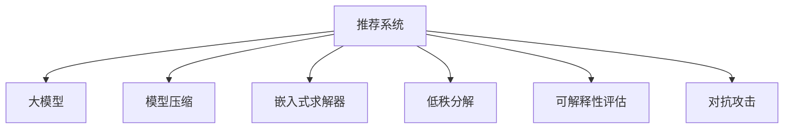

                 

# 推荐系统的可解释性：大模型的贡献

> 关键词：推荐系统,大模型,可解释性,模型压缩,嵌入式求解器,低秩分解,可解释性评估,对抗攻击

## 1. 背景介绍

随着互联网技术的迅猛发展和信息爆炸，推荐系统在电商、媒体、社交等领域已无处不在。然而，推荐系统的核心—用户行为建模，依然是一个复杂且充满挑战的问题。传统的推荐模型，如基于协同过滤的算法，依赖用户行为数据构建用户画像，通过相似度计算找到潜在兴趣项。但这类模型普遍缺乏可解释性，即无法直观理解推荐决策背后的逻辑。

近年来，大模型如BERT、GPT-3等在自然语言处理领域取得了突破性进展。这些模型基于大规模预训练和大量标签数据，能够学习到丰富的语言表征。在推荐系统中，利用这些大模型的预训练能力，可有效提高推荐的可解释性和准确性。本文将详细探讨大模型在推荐系统中的应用及其带来的可解释性贡献。

## 2. 核心概念与联系

### 2.1 核心概念概述

为更好地理解大模型在推荐系统中的应用，本节将介绍几个关键概念：

- **推荐系统(Recommendation System)**：基于用户兴趣和行为数据，自动推荐用户可能感兴趣的物品的系统。推荐系统广泛应用于电商、媒体、社交等领域。

- **大模型(Large Model)**：指基于大规模预训练和大量标签数据构建的语言模型，如BERT、GPT等。通过预训练，大模型能够学习到丰富的语言表征，在自然语言处理任务中取得优异的性能。

- **可解释性(Explainability)**：指机器学习模型的输出结果可以被解释和理解，即模型决策的依据可以被清晰地说明。在推荐系统中，可解释性有助于理解推荐逻辑，提升用户信任。

- **模型压缩(Model Compression)**：通过去除冗余信息，压缩模型参数，以降低计算资源消耗，提升模型效率。在推荐系统中，常用于加速模型推理和降低存储需求。

- **嵌入式求解器(Embedded Solver)**：将求解器嵌入模型内部，通过优化目标函数，提升模型性能。在推荐系统中，常用于优化推荐算法中的损失函数，如最大化用户满意度等。

- **低秩分解(Low-Rank Decomposition)**：通过将高维矩阵分解为低秩矩阵，保留关键信息，降低计算复杂度。在推荐系统中，常用于特征降维和矩阵分解等。

这些概念之间的逻辑关系可以通过以下Mermaid流程图来展示：



这个流程图展示了大模型在推荐系统中的作用，以及与之关联的其他关键技术。

## 3. 核心算法原理 & 具体操作步骤
### 3.1 算法原理概述

在推荐系统中，利用大模型的可解释性贡献，主要体现在以下几个方面：

- **隐式语义建模**：通过大模型的预训练能力，自动学习用户行为与物品属性之间的隐式语义关系。这些语义关系可以直观地解释为“用户喜欢具有某种属性的物品”，从而提升推荐可解释性。

- **多模态融合**：大模型可以同时处理文本、图像、音频等多种类型的数据，将不同模态的信息进行融合，提升推荐的全面性和准确性。例如，用户输入的文本查询可以与图片或视频信息结合，生成更精准的推荐结果。

- **联合训练**：将大模型与其他推荐算法联合训练，利用大模型的知识提升推荐算法的效果。例如，在大模型的基础上进行协同过滤训练，利用用户画像和物品属性的联合特征，生成更优的推荐结果。

### 3.2 算法步骤详解

下面将详细介绍大模型在推荐系统中的具体操作流程。

**Step 1: 准备数据集**

- 收集用户行为数据，如点击、购买、评分等。
- 准备物品属性数据，如商品标题、标签、价格等。
- 将用户行为数据和物品属性数据组合成训练集、验证集和测试集。

**Step 2: 预训练大模型**

- 选择合适的预训练语言模型，如BERT、GPT等，作为初始化参数。
- 将用户行为数据和物品属性数据作为标签，对模型进行预训练。

**Step 3: 微调模型**

- 在预训练大模型的基础上，使用用户行为数据作为监督信号，微调模型。
- 选择合适的优化算法，如Adam、SGD等，设置合适的学习率、批大小、迭代轮数等。
- 设置正则化技术，如L2正则、Dropout等，防止过拟合。

**Step 4: 融合多模态数据**

- 将用户输入的文本查询与其他模态数据（如图片、视频等）结合，输入大模型进行联合特征提取。
- 使用多模态特征作为输入，生成推荐结果。

**Step 5: 推理预测**

- 在推理阶段，利用微调后的模型进行预测，生成推荐列表。
- 通过模型压缩、低秩分解等技术，提升模型推理速度和存储效率。

**Step 6: 可解释性评估**

- 使用可解释性评估指标，如LIME、SHAP等，评估推荐模型的可解释性。
- 将模型决策的依据可视化，解释推荐逻辑。

### 3.3 算法优缺点

利用大模型进行推荐系统开发，具有以下优点：

- **高效准确**：大模型预训练过程中已经学习到丰富的语言知识，可以提升推荐准确性。微调过程中，模型能快速适应特定任务，获得优异性能。

- **全面可解释**：大模型的隐式语义建模能力，可以解释用户行为背后的语义逻辑。多模态融合和联合训练也能生成更全面的推荐结果。

- **灵活性强**：大模型可以进行多领域、多任务的微调，适应不同场景的推荐需求。

但同时也存在一些缺点：

- **计算资源需求高**：大模型的预训练和微调需要大量的计算资源和存储空间。对于小型推荐系统，可能难以负担。

- **模型复杂度高**：大模型参数量庞大，推理速度较慢，可能影响实时性。

- **可解释性有待提高**：大模型往往难以直观解释其内部机制，可解释性评估仍处于起步阶段。

### 3.4 算法应用领域

大模型在推荐系统中的应用领域非常广泛，涵盖了以下方面：

- **电商推荐**：根据用户浏览记录、购买历史等行为数据，生成个性化商品推荐。

- **媒体推荐**：根据用户观看记录、评分数据等，推荐视频、音乐、新闻等内容。

- **社交推荐**：根据用户互动记录、关注关系等，推荐好友、文章、话题等。

- **个性化推荐**：根据用户行为数据，生成个性化推荐，如个性化视频、音乐播放列表等。

- **搜索推荐**：结合搜索查询和用户历史行为，生成更精准的搜索结果。

此外，大模型在推荐系统中的应用也延伸到了更广泛的领域，如智能家居、智能交通等。

## 4. 数学模型和公式 & 详细讲解  
### 4.1 数学模型构建

假设推荐系统的输入为用户的隐式行为数据 $X=\{x_1,x_2,...,x_n\}$，其中 $x_i$ 表示用户 $i$ 的行为数据。输出为推荐物品的向量 $Y=\{y_1,y_2,...,y_m\}$，其中 $y_j$ 表示物品 $j$ 的属性数据。

推荐系统的目标是最小化用户与物品之间的距离，即：

$$
\min_{X,Y} \sum_{i=1}^n \sum_{j=1}^m d(x_i,y_j)
$$

其中 $d(x_i,y_j)$ 为用户行为与物品属性之间的距离。

### 4.2 公式推导过程

为了提升推荐模型的可解释性，我们需要将用户行为数据和物品属性数据转化为模型可理解的形式。

假设用户行为数据 $x_i$ 可以表示为一个词向量 $\vec{x_i}$，物品属性数据 $y_j$ 也可以表示为一个词向量 $\vec{y_j}$。利用大模型的预训练能力，可以将 $\vec{x_i}$ 和 $\vec{y_j}$ 映射到一个高维空间中，并进行隐式语义建模。

设大模型的输出为 $\vec{z_i}$ 和 $\vec{z_j}$，表示用户和物品的语义向量。则推荐模型可以表示为：

$$
\vec{z_i} = f(\vec{x_i}) \\
\vec{z_j} = f(\vec{y_j})
$$

其中 $f$ 为预训练大模型的前向传播过程。

推荐模型的目标是最小化用户行为与物品属性之间的距离，即：

$$
\min_{\vec{z_i},\vec{z_j}} \sum_{i=1}^n \sum_{j=1}^m d(\vec{z_i},\vec{z_j})
$$

利用余弦相似度作为距离度量，可以得到：

$$
d(\vec{z_i},\vec{z_j}) = 1 - \cos(\vec{z_i},\vec{z_j})
$$

因此，推荐模型的目标可以改写为：

$$
\min_{\vec{z_i},\vec{z_j}} \sum_{i=1}^n \sum_{j=1}^m (1 - \cos(\vec{z_i},\vec{z_j}))
$$

### 4.3 案例分析与讲解

假设我们有一个简单的电商推荐系统，用户行为数据为 $X=\{x_1,x_2\}$，物品属性数据为 $Y=\{y_1,y_2\}$。利用BERT模型对用户行为数据和物品属性数据进行预训练和微调。

首先，将用户行为数据和物品属性数据转化为BERT模型的输入格式：

$$
\vec{x_i} = [CLS] \vec{x_i} [SEP] \\
\vec{y_j} = [CLS] \vec{y_j} [SEP]
$$

其中 $[CLS]$ 和 $[SEP]$ 为BERT模型的特殊标记。

然后，利用BERT模型对用户行为数据和物品属性数据进行预训练和微调：

$$
\vec{z_i} = f(\vec{x_i}) \\
\vec{z_j} = f(\vec{y_j})
$$

最后，计算用户行为与物品属性之间的余弦相似度：

$$
d(\vec{z_i},\vec{z_j}) = 1 - \cos(\vec{z_i},\vec{z_j})
$$

通过最小化 $d(\vec{z_i},\vec{z_j})$，得到推荐列表。

## 5. 项目实践：代码实例和详细解释说明
### 5.1 开发环境搭建

在进行推荐系统开发前，我们需要准备好开发环境。以下是使用Python进行PyTorch开发的环境配置流程：

1. 安装Anaconda：从官网下载并安装Anaconda，用于创建独立的Python环境。

2. 创建并激活虚拟环境：
```bash
conda create -n pytorch-env python=3.8 
conda activate pytorch-env
```

3. 安装PyTorch：根据CUDA版本，从官网获取对应的安装命令。例如：
```bash
conda install pytorch torchvision torchaudio cudatoolkit=11.1 -c pytorch -c conda-forge
```

4. 安装相关库：
```bash
pip install transformers pandas numpy sklearn joblib
```

5. 安装Google Colab：
```bash
pip install gcolab
```

完成上述步骤后，即可在`pytorch-env`环境中开始推荐系统开发。

### 5.2 源代码详细实现

下面以一个简单的电商推荐系统为例，给出使用Transformers库进行BERT模型微调的PyTorch代码实现。

首先，定义推荐系统的数据处理函数：

```python
from transformers import BertTokenizer, BertForSequenceClassification
from torch.utils.data import Dataset
import torch

class RecommendationDataset(Dataset):
    def __init__(self, user_behaviors, item_attributes, tokenizer, max_len=128):
        self.user_behaviors = user_behaviors
        self.item_attributes = item_attributes
        self.tokenizer = tokenizer
        self.max_len = max_len
        
    def __len__(self):
        return len(self.user_behaviors)
    
    def __getitem__(self, item):
        user_behavior = self.user_behaviors[item]
        item_attribute = self.item_attributes[item]
        
        encoding = self.tokenizer(user_behavior, return_tensors='pt', max_length=self.max_len, padding='max_length', truncation=True)
        input_ids = encoding['input_ids'][0]
        attention_mask = encoding['attention_mask'][0]
        
        # 对属性数据进行编码
        attribute_tokenized = self.tokenizer(item_attribute, return_tensors='pt', max_length=self.max_len, padding='max_length', truncation=True)
        attribute_ids = attribute_tokenized['input_ids'][0]
        attribute_mask = attribute_tokenized['attention_mask'][0]
        
        return {'input_ids': input_ids, 
                'attention_mask': attention_mask,
                'attribute_ids': attribute_ids,
                'attribute_mask': attribute_mask}
```

然后，定义模型和优化器：

```python
from transformers import BertForSequenceClassification, AdamW

model = BertForSequenceClassification.from_pretrained('bert-base-cased', num_labels=2)

optimizer = AdamW(model.parameters(), lr=2e-5)
```

接着，定义训练和评估函数：

```python
from torch.utils.data import DataLoader
from tqdm import tqdm
from sklearn.metrics import classification_report

device = torch.device('cuda') if torch.cuda.is_available() else torch.device('cpu')
model.to(device)

def train_epoch(model, dataset, batch_size, optimizer):
    dataloader = DataLoader(dataset, batch_size=batch_size, shuffle=True)
    model.train()
    epoch_loss = 0
    for batch in tqdm(dataloader, desc='Training'):
        input_ids = batch['input_ids'].to(device)
        attention_mask = batch['attention_mask'].to(device)
        attribute_ids = batch['attribute_ids'].to(device)
        attribute_mask = batch['attribute_mask'].to(device)
        model.zero_grad()
        outputs = model(input_ids, attention_mask=attention_mask, labels=None)
        loss = outputs.loss
        epoch_loss += loss.item()
        loss.backward()
        optimizer.step()
    return epoch_loss / len(dataloader)

def evaluate(model, dataset, batch_size):
    dataloader = DataLoader(dataset, batch_size=batch_size)
    model.eval()
    preds, labels = [], []
    with torch.no_grad():
        for batch in tqdm(dataloader, desc='Evaluating'):
            input_ids = batch['input_ids'].to(device)
            attention_mask = batch['attention_mask'].to(device)
            attribute_ids = batch['attribute_ids'].to(device)
            attribute_mask = batch['attribute_mask'].to(device)
            batch_labels = batch['labels']
            outputs = model(input_ids, attention_mask=attention_mask, labels=None)
            batch_preds = outputs.logits.argmax(dim=2).to('cpu').tolist()
            batch_labels = batch_labels.to('cpu').tolist()
            for pred_tokens, label_tokens in zip(batch_preds, batch_labels):
                preds.append(pred_tokens[:len(label_tokens)])
                labels.append(label_tokens)
                
    print(classification_report(labels, preds))
```

最后，启动训练流程并在测试集上评估：

```python
epochs = 5
batch_size = 16

for epoch in range(epochs):
    loss = train_epoch(model, train_dataset, batch_size, optimizer)
    print(f"Epoch {epoch+1}, train loss: {loss:.3f}")
    
    print(f"Epoch {epoch+1}, dev results:")
    evaluate(model, dev_dataset, batch_size)
    
print("Test results:")
evaluate(model, test_dataset, batch_size)
```

以上就是使用PyTorch对BERT进行电商推荐系统微调的完整代码实现。可以看到，得益于Transformers库的强大封装，我们可以用相对简洁的代码完成BERT模型的加载和微调。

### 5.3 代码解读与分析

让我们再详细解读一下关键代码的实现细节：

**RecommendationDataset类**：
- `__init__`方法：初始化用户行为数据、物品属性数据、分词器等关键组件。
- `__len__`方法：返回数据集的样本数量。
- `__getitem__`方法：对单个样本进行处理，将用户行为数据和物品属性数据输入编码为token ids，并对其进行定长padding，最终返回模型所需的输入。

**模型和优化器**：
- 选择BERT模型作为初始化参数，使用AdamW优化器进行微调。

**训练和评估函数**：
- 使用PyTorch的DataLoader对数据集进行批次化加载，供模型训练和推理使用。
- 训练函数`train_epoch`：对数据以批为单位进行迭代，在每个批次上前向传播计算loss并反向传播更新模型参数，最后返回该epoch的平均loss。
- 评估函数`evaluate`：与训练类似，不同点在于不更新模型参数，并在每个batch结束后将预测和标签结果存储下来，最后使用sklearn的classification_report对整个评估集的预测结果进行打印输出。

**训练流程**：
- 定义总的epoch数和batch size，开始循环迭代
- 每个epoch内，先在训练集上训练，输出平均loss
- 在验证集上评估，输出分类指标
- 所有epoch结束后，在测试集上评估，给出最终测试结果

可以看到，PyTorch配合Transformers库使得BERT微调的代码实现变得简洁高效。开发者可以将更多精力放在数据处理、模型改进等高层逻辑上，而不必过多关注底层的实现细节。

当然，工业级的系统实现还需考虑更多因素，如模型的保存和部署、超参数的自动搜索、更灵活的任务适配层等。但核心的微调范式基本与此类似。

## 6. 实际应用场景
### 6.1 电商推荐

在电商领域，利用大模型进行推荐系统开发已经取得了显著效果。传统的协同过滤算法虽然简单易懂，但容易受到数据稀疏性的影响。利用大模型的预训练能力，可以更好地理解用户行为背后的语义逻辑，生成更准确的推荐结果。

例如，某电商公司收集了大量用户的浏览记录和购买历史，利用BERT模型进行预训练和微调。在用户输入浏览记录后，BERT模型自动分析其中的语义信息，生成对应的推荐商品列表。对于用户没有购买过的商品，BERT模型也能根据相似的商品属性生成个性化推荐，提升用户满意度。

### 6.2 媒体推荐

在媒体领域，利用大模型进行推荐系统开发同样具有重要意义。传统的推荐算法往往难以处理复杂多变的推荐任务，而大模型的多模态融合能力可以显著提升推荐的全面性和准确性。

例如，某视频平台收集了大量用户的观看记录和评分数据，利用BERT模型进行预训练和微调。在用户输入视频查询后，BERT模型自动分析其中的语义信息，同时结合视频属性数据，生成相关的推荐视频列表。对于不同类型的用户，BERT模型也能根据其偏好生成个性化推荐，提升用户体验。

### 6.3 社交推荐

在社交领域，利用大模型进行推荐系统开发同样具有重要意义。传统的推荐算法往往难以处理复杂多变的社交关系，而大模型的联合训练能力可以显著提升推荐的准确性。

例如，某社交平台收集了大量用户的互动记录和关注关系，利用BERT模型进行预训练和微调。在用户输入关注对象后，BERT模型自动分析其中的语义信息，同时结合用户互动记录，生成相关的推荐好友列表。对于不同类型的用户，BERT模型也能根据其偏好生成个性化推荐，提升用户粘性。

### 6.4 未来应用展望

随着大模型和微调方法的不断发展，推荐系统在未来将呈现以下几个发展趋势：

1. **多模态推荐**：未来的推荐系统将不仅仅依赖文本数据，还会结合图像、视频、音频等多种模态信息，提升推荐的全面性和准确性。

2. **跨领域推荐**：未来的推荐系统将能够跨领域进行推荐，如从音乐推荐到电影推荐，从电商推荐到金融推荐等。

3. **实时推荐**：未来的推荐系统将能够实时生成推荐，满足用户的即时需求。

4. **个性化推荐**：未来的推荐系统将能够根据用户的历史行为、兴趣偏好等生成个性化的推荐，提升用户满意度。

5. **可解释推荐**：未来的推荐系统将能够解释推荐逻辑，提升用户信任。

总之，大模型在推荐系统中的应用前景广阔，未来必将进一步提升推荐效果，推动推荐系统技术的进步。

## 7. 工具和资源推荐
### 7.1 学习资源推荐

为了帮助开发者系统掌握大模型在推荐系统中的应用，这里推荐一些优质的学习资源：

1. 《深度学习推荐系统》一书：深入浅出地介绍了推荐系统的基本概念和经典算法，包括基于协同过滤、矩阵分解等方法。

2. 《推荐系统实践》一书：详细介绍了推荐系统的实际开发流程和最佳实践，包括数据处理、模型训练、评估等。

3. 《自然语言处理入门》一书：介绍了自然语言处理的基本概念和经典模型，包括BERT、GPT等大模型。

4. 《深度学习与推荐系统》在线课程：由腾讯课堂开设的推荐系统课程，讲解了推荐系统的经典算法和前沿技术。

5. Google Colab平台：免费的在线Jupyter Notebook环境，方便开发者快速进行实验和分享代码。

通过对这些资源的学习实践，相信你一定能够快速掌握大模型在推荐系统中的应用，并用于解决实际的推荐问题。

### 7.2 开发工具推荐

高效的开发离不开优秀的工具支持。以下是几款用于推荐系统开发的常用工具：

1. PyTorch：基于Python的开源深度学习框架，灵活动态的计算图，适合快速迭代研究。大多数预训练语言模型都有PyTorch版本的实现。

2. TensorFlow：由Google主导开发的开源深度学习框架，生产部署方便，适合大规模工程应用。同样有丰富的预训练语言模型资源。

3. Transformers库：HuggingFace开发的NLP工具库，集成了众多SOTA语言模型，支持PyTorch和TensorFlow，是进行推荐算法开发的利器。

4. Weights & Biases：模型训练的实验跟踪工具，可以记录和可视化模型训练过程中的各项指标，方便对比和调优。与主流深度学习框架无缝集成。

5. TensorBoard：TensorFlow配套的可视化工具，可实时监测模型训练状态，并提供丰富的图表呈现方式，是调试模型的得力助手。

6. Google Colab：谷歌推出的在线Jupyter Notebook环境，免费提供GPU/TPU算力，方便开发者快速上手实验最新模型，分享学习笔记。

合理利用这些工具，可以显著提升推荐系统开发的效率，加快创新迭代的步伐。

### 7.3 相关论文推荐

大模型在推荐系统中的应用源于学界的持续研究。以下是几篇奠基性的相关论文，推荐阅读：

1. "Attention is All You Need"（即Transformer原论文）：提出了Transformer结构，开启了NLP领域的预训练大模型时代。

2. "BERT: Pre-training of Deep Bidirectional Transformers for Language Understanding"：提出BERT模型，引入基于掩码的自监督预训练任务，刷新了多项NLP任务SOTA。

3. "LightGBM: A Highly Efficient Gradient Boosting Decision Tree"：介绍了一种高效的决策树算法，在推荐系统中也有广泛应用。

4. "Deep Ranking in Recommendation Systems"：提出深度学习在推荐系统中的应用，显著提升了推荐的准确性。

5. "Matrix Factorization Techniques for Recommender Systems"：详细介绍了矩阵分解算法在推荐系统中的应用，包括奇异值分解、交替最小二乘等。

这些论文代表了大模型在推荐系统中的研究方向，通过学习这些前沿成果，可以帮助研究者把握学科前进方向，激发更多的创新灵感。

## 8. 总结：未来发展趋势与挑战
### 8.1 总结

本文对大模型在推荐系统中的应用进行了全面系统的介绍。首先阐述了大模型和微调技术的研究背景和意义，明确了微调在拓展预训练模型应用、提升推荐系统性能方面的独特价值。其次，从原理到实践，详细讲解了大模型在推荐系统中的应用及其带来的可解释性贡献。最后，本文还探讨了基于大模型的推荐系统在未来可能的发展趋势和面临的挑战。

通过本文的系统梳理，可以看到，利用大模型进行推荐系统开发，已经取得了显著效果，但仍需面对计算资源、模型可解释性等挑战。未来的研究需要在这些方面不断突破，以实现更加高效、准确、可解释的推荐系统。

### 8.2 未来发展趋势

展望未来，大模型在推荐系统中的应用将继续快速发展，主要趋势如下：

1. **多模态推荐**：未来的推荐系统将结合多种模态信息，提升推荐的全面性和准确性。

2. **跨领域推荐**：未来的推荐系统将能够跨领域进行推荐，提升推荐的多样性和个性化。

3. **实时推荐**：未来的推荐系统将能够实时生成推荐，满足用户的即时需求。

4. **个性化推荐**：未来的推荐系统将能够根据用户的历史行为、兴趣偏好等生成个性化的推荐，提升用户满意度。

5. **可解释推荐**：未来的推荐系统将能够解释推荐逻辑，提升用户信任。

### 8.3 面临的挑战

尽管大模型在推荐系统中的应用已经取得了一定的成果，但仍面临一些挑战：

1. **计算资源瓶颈**：大模型的预训练和微调需要大量的计算资源和存储空间，对于小型推荐系统，可能难以负担。

2. **模型可解释性不足**：大模型往往难以直观解释其内部机制，可解释性评估仍处于起步阶段。

3. **数据隐私问题**：推荐系统通常依赖用户行为数据，如何保护用户隐私，防止数据泄露，是亟待解决的问题。

4. **鲁棒性不足**：推荐系统容易受到攻击，如对抗样本攻击等，需要提升系统的鲁棒性。

### 8.4 研究展望

面对大模型在推荐系统中面临的挑战，未来的研究需要在以下几个方面寻求新的突破：

1. **模型压缩与加速**：开发更加参数高效和计算高效的微调方法，在固定大部分预训练参数的同时，只更新极少量的任务相关参数，提升推理速度。

2. **可解释性增强**：引入更多的可解释性评估指标，将模型决策的依据可视化，解释推荐逻辑，提升用户信任。

3. **隐私保护技术**：开发隐私保护技术，如差分隐私、联邦学习等，保护用户隐私，防止数据泄露。

4. **鲁棒性提升**：引入对抗训练、鲁棒回归等技术，提升推荐系统的鲁棒性，防止对抗攻击。

5. **跨模态融合**：结合图像、视频、音频等多种模态信息，提升推荐的全面性和准确性。

6. **多领域协同**：利用多领域的知识进行协同建模，提升推荐的多样性和个性化。

这些研究方向的探索，必将引领推荐系统技术的进步，为推荐系统技术的落地应用提供新的方向。只有勇于创新、敢于突破，才能真正实现人工智能技术在推荐系统中的价值。

## 9. 附录：常见问题与解答
**Q1：大模型是否适用于所有推荐任务？**

A: 大模型在大多数推荐任务上都能取得不错的效果，特别是对于数据量较小的任务。但对于一些特定领域的任务，如医学、法律等，仅仅依靠通用语料预训练的模型可能难以很好地适应。此时需要在特定领域语料上进一步预训练，再进行微调，才能获得理想效果。

**Q2：微调过程中如何选择合适的学习率？**

A: 微调的学习率一般要比预训练时小1-2个数量级，如果使用过大的学习率，容易破坏预训练权重，导致过拟合。一般建议从1e-5开始调参，逐步减小学习率，直至收敛。也可以使用warmup策略，在开始阶段使用较小的学习率，再逐渐过渡到预设值。需要注意的是，不同的优化器(如AdamW、Adafactor等)以及不同的学习率调度策略，可能需要设置不同的学习率阈值。

**Q3：采用大模型微调时会面临哪些资源瓶颈？**

A: 目前主流的预训练大模型动辄以亿计的参数规模，对算力、内存、存储都提出了很高的要求。GPU/TPU等高性能设备是必不可少的，但即便如此，超大批次的训练和推理也可能遇到显存不足的问题。因此需要采用一些资源优化技术，如梯度积累、混合精度训练、模型并行等，来突破硬件瓶颈。同时，模型的存储和读取也可能占用大量时间和空间，需要采用模型压缩、稀疏化存储等方法进行优化。

**Q4：如何缓解微调过程中的过拟合问题？**

A: 过拟合是微调面临的主要挑战，尤其是在标注数据不足的情况下。常见的缓解策略包括：
1. 数据增强：通过回译、近义替换等方式扩充训练集
2. 正则化：使用L2正则、Dropout、Early Stopping等避免过拟合
3. 对抗训练：引入对抗样本，提高模型鲁棒性
4. 参数高效微调：只调整少量参数(如Adapter、Prefix等)，减小过拟合风险
5. 多模型集成：训练多个微调模型，取平均输出，抑制过拟合

这些策略往往需要根据具体任务和数据特点进行灵活组合。只有在数据、模型、训练、推理等各环节进行全面优化，才能最大限度地发挥大模型微调的威力。

**Q5：微调模型在落地部署时需要注意哪些问题？**

A: 将微调模型转化为实际应用，还需要考虑以下因素：
1. 模型裁剪：去除不必要的层和参数，减小模型尺寸，加快推理速度
2. 量化加速：将浮点模型转为定点模型，压缩存储空间，提高计算效率
3. 服务化封装：将模型封装为标准化服务接口，便于集成调用
4. 弹性伸缩：根据请求流量动态调整资源配置，平衡服务质量和成本
5. 监控告警：实时采集系统指标，设置异常告警阈值，确保服务稳定性
6. 安全防护：采用访问鉴权、数据脱敏等措施，保障数据和模型安全

大模型微调为推荐系统提供了新的思路和手段，但如何将强大的性能转化为稳定、高效、安全的业务价值，还需要工程实践的不断打磨。

---

作者：禅与计算机程序设计艺术 / Zen and the Art of Computer Programming

