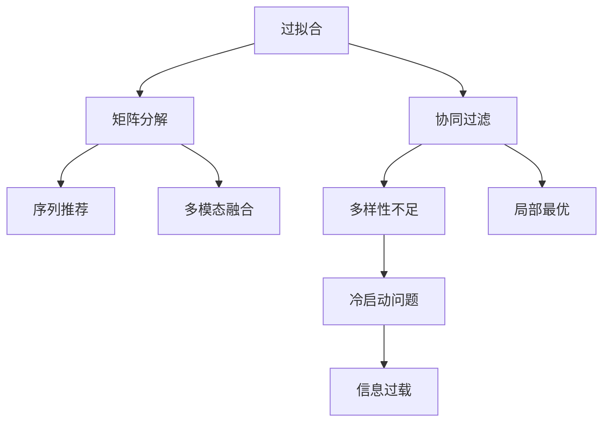

                 

# 推荐系统的局限：过拟合与多样性

## 1. 背景介绍

在数字化时代的浪潮中，推荐系统已成为互联网应用的核心支柱，深入各行各业，改变了人们的消费习惯和决策方式。无论是电子商务、视频平台、新闻媒体，还是社交网络，推荐系统都在发挥着不可或缺的作用。然而，在推荐系统不断优化性能的同时，其局限性也开始逐渐显现。过拟合与多样性问题正是当前推荐系统面临的两大核心挑战。本文将系统介绍这两个问题，深入探讨其本质原因，并提出一系列解决方案，为推荐系统的优化提供理论支撑和实践指南。

## 2. 核心概念与联系

### 2.1 核心概念概述

为更好地理解推荐系统中的过拟合与多样性问题，本节将介绍几个密切相关的核心概念：

- **过拟合（Overfitting）**：指模型在训练数据上表现出色，但在未见过的新数据上表现不佳的现象。推荐系统中的过拟合主要表现在对历史用户行为的过度拟合，导致推荐内容缺乏多样性，无法适应用户潜在的兴趣变化。

- **多样性（Diversification）**：指推荐结果中的内容种类和类别的多样性。推荐多样性不足会导致用户感到疲劳，陷入"信息茧房"，降低推荐系统的效果和用户满意度。

- **协同过滤（Collaborative Filtering）**：利用用户和物品间的交互数据（评分、点击等）进行推荐。协同过滤算法在处理新用户和物品时面临"冷启动"问题，无法有效利用较少的数据进行推荐。

- **矩阵分解（Matrix Factorization）**：一种常用的推荐模型，将用户-物品评分矩阵分解为低维用户和物品的隐向量表示，用于预测新评分。矩阵分解方法容易受数据噪声影响，导致过拟合。

- **序列推荐（Sequential Recommendation）**：基于用户历史行为序列进行推荐。序列推荐容易陷入局部最优，难以发现潜在的多样性内容。

- **多模态融合（Multi-modal Fusion）**：融合不同模态的数据（如用户行为、物品属性、时间等）提升推荐质量。多模态融合过程容易因信息冗余而过拟合，导致模型泛化能力下降。

这些核心概念之间的逻辑关系可以通过以下Mermaid流程图来展示：



这个流程图展示了几类推荐算法与过拟合、多样性问题的关联：

1. 协同过滤和矩阵分解算法在处理新数据时容易出现过拟合，导致推荐结果多样性不足。
2. 序列推荐算法容易陷入局部最优，同样无法发现潜在的多种可能性。
3. 多模态融合算法需要融合大量数据，容易因信息冗余和噪声而过拟合。

## 3. 核心算法原理 & 具体操作步骤

### 3.1 算法原理概述

推荐系统中的过拟合与多样性问题，其本质在于模型如何平衡历史行为数据与未知数据的关系，如何在推荐中引入多样性。推荐系统通常基于历史用户行为数据进行训练，然而，在训练和推荐过程中，容易受到历史数据的过拟合，导致推荐内容缺乏多样性，无法适应用户兴趣的变化。

为了解决这一问题，推荐系统引入了多样性约束，即在推荐过程中，尽量涵盖多种类型的物品，避免重复推荐相似内容。这要求推荐模型不仅要学习用户历史行为的规律，还要考虑未知数据的泛化能力。常见的解决策略包括数据增强、正则化、对抗训练等。

### 3.2 算法步骤详解

推荐系统的训练和推荐过程通常包括以下几个关键步骤：

**Step 1: 准备数据集**
- 收集用户历史行为数据（评分、点击、收藏等），划分为训练集和测试集。
- 使用噪声或随机失真技术增强数据多样性，避免过拟合。

**Step 2: 选择模型架构**
- 选择适合的多样性约束算法，如协同过滤、矩阵分解、序列推荐等。
- 引入正则化技术，如L2正则、Dropout、Early Stopping等，防止模型过拟合。

**Step 3: 训练模型**
- 使用训练集对模型进行训练，最小化预测误差与实际标签之间的差距。
- 引入对抗训练技术，生成对抗样本，提高模型鲁棒性。
- 周期性在验证集上评估模型性能，根据多样性指标调整模型参数。

**Step 4: 推荐优化**
- 在推荐结果中引入多样性约束，使用多样性排名算法（如Top-K多样性、NDCG等）评估推荐效果。
- 根据用户反馈和行为数据，动态调整推荐策略，减少过拟合风险。

### 3.3 算法优缺点

推荐系统中的过拟合与多样性问题，其主流解决方法具有以下优点：
1. 简单高效。只需添加简单的正则化技术，即可提高模型的泛化能力，避免过拟合。
2. 适应性强。多样性约束算法可以适应不同数据分布和用户兴趣，提升推荐系统的灵活性。
3. 可解释性高。正则化技术通过惩罚模型复杂度，使得推荐过程更容易理解和调试。
4. 效果显著。通过多种多样性约束算法的组合使用，能够显著提升推荐系统的多样性和用户满意度。

同时，这些方法也存在一定的局限性：
1. 增加计算负担。多样性约束算法需要额外计算多样性指标，增加了模型的复杂度和计算负担。
2. 效果不稳定。对抗训练等技术需要大量的对抗样本，可能导致模型的鲁棒性提升有限。
3. 依赖用户反馈。动态调整推荐策略需要大量用户行为数据，难以在初期阶段有效运行。
4. 难以统一平衡。如何在保证推荐多样性的同时，提升预测准确度，是一大难题。

尽管存在这些局限性，但就目前而言，基于多样性约束的推荐系统仍是主流范式。未来相关研究的重点在于如何进一步降低过拟合风险，提高推荐系统的多样性和鲁棒性，同时兼顾用户反馈和推荐质量。

### 3.4 算法应用领域

推荐系统中的过拟合与多样性问题，在众多领域中均有应用，例如：

- **电子商务**：推荐商品需要覆盖多种类型，避免重复推荐，提高用户满意度。
- **视频平台**：推荐视频需涵盖多种时长、内容类别，减少内容疲劳，提升用户粘性。
- **新闻媒体**：推荐新闻需多样化，覆盖不同话题和来源，丰富用户阅读体验。
- **社交网络**：推荐内容需多样化，避免信息茧房，提升用户社交互动。
- **金融服务**：推荐金融产品需多样化，涵盖不同类型和风险等级，满足用户多样化的需求。

除了上述这些经典领域外，推荐系统中的过拟合与多样性问题，还将在更多场景中得到应用，如在线教育、旅游出行、医疗健康等，为各行业数字化转型升级提供新的技术路径。

## 4. 数学模型和公式 & 详细讲解 & 举例说明

### 4.1 数学模型构建

本节将使用数学语言对推荐系统中的过拟合与多样性问题进行更加严格的刻画。

记推荐系统中的用户历史行为数据为 $D=\{(x_i, y_i)\}_{i=1}^N$，其中 $x_i \in X$ 为物品，$y_i \in Y$ 为评分或点击标记。假设推荐模型为 $f: X \rightarrow \mathbb{R}$，用于预测用户对物品的评分或点击概率。定义模型 $f$ 在数据样本 $(x,y)$ 上的损失函数为 $\ell(f(x),y)$，则在数据集 $D$ 上的经验风险为：

$$
\mathcal{L}(f) = \frac{1}{N} \sum_{i=1}^N \ell(f(x_i),y_i)
$$

训练目标是最小化经验风险，即找到最优模型：

$$
f^* = \mathop{\arg\min}_{f} \mathcal{L}(f)
$$

然而，由于推荐系统中的过拟合问题，模型往往会在历史数据上表现出色，但在新数据上泛化能力不足。为解决这一问题，需要在训练过程中引入多样性约束，确保推荐结果的多样性。常见的多样性约束指标包括：

- **多样性排名（Diversity Ranking）**：衡量推荐结果中不同类别的数量，避免过度推荐某类物品。
- **Top-K多样性（Top-K Diversification）**：确保推荐结果中至少包含 $K$ 种不同类型的物品，防止推荐单一化。
- **覆盖率（Coverage）**：衡量推荐结果中不同类别物品的比例，确保推荐内容的多样性。

### 4.2 公式推导过程

以下我们以Top-K多样性为例，推导推荐模型训练中的数学公式。

假设推荐模型为 $f$，其预测结果为 $y'=f(x)$，目标是确保预测结果中至少包含 $K$ 种不同的类别。定义 $K$ 个类别的物品集合为 $\mathcal{C}_k$，$k \in [1, K]$。则Top-K多样性约束可以表示为：

$$
\mathcal{L}_{div}(f) = \max_{k \in [1, K]} \frac{|\mathcal{C}_k \cap \{y'\}|}{|\mathcal{C}_k|}
$$

其中 $|\mathcal{C}_k \cap \{y'\}|$ 表示预测结果中包含 $k$ 类物品的数量，$|\mathcal{C}_k|$ 表示类别 $k$ 中的物品总数。

为了最小化Top-K多样性约束，需要在损失函数中加入正则项：

$$
\mathcal{L}_{total}(f) = \mathcal{L}(f) + \lambda \sum_{k \in [1, K]} \log\left(\frac{|\mathcal{C}_k|}{|\mathcal{C}_k \cap \{y'\}|}\right)
$$

其中 $\lambda$ 为正则化系数，用于控制多样性约束的强度。

### 4.3 案例分析与讲解

以新闻媒体推荐为例，分析Top-K多样性约束的实际应用：

1. **场景设置**：假设新闻媒体为用户推荐新闻，历史行为数据为用户对新闻的浏览记录。推荐模型需确保推荐结果中至少包含 $K=3$ 种不同类型的新闻（体育、娱乐、科技）。

2. **模型训练**：假设推荐模型为深度神经网络，输入为新闻标题，输出为阅读概率。在训练过程中，将Top-K多样性约束添加到损失函数中，最小化预测误差和多样性约束的总和。

3. **结果展示**：在测试集中，推荐系统需保证推荐结果中至少包含3种不同类型的新闻。如果测试集中的新闻类型和历史数据有显著差异，推荐系统需能够灵活调整推荐策略，引入新类型的新闻。

通过以上分析，可以看到，Top-K多样性约束能够有效提升推荐系统的多样性，避免过度推荐某类新闻。在实际应用中，需要根据不同领域的特征，选择合适的多样性约束指标，并调整正则化系数，以获得最佳的推荐效果。

## 5. 项目实践：代码实例和详细解释说明

### 5.1 开发环境搭建

在进行推荐系统开发前，我们需要准备好开发环境。以下是使用Python进行TensorFlow开发的环境配置流程：

1. 安装Anaconda：从官网下载并安装Anaconda，用于创建独立的Python环境。

2. 创建并激活虚拟环境：
```bash
conda create -n recsys-env python=3.8 
conda activate recsys-env
```

3. 安装TensorFlow：根据CUDA版本，从官网获取对应的安装命令。例如：
```bash
conda install tensorflow tensorflow-gpu cudatoolkit=11.1 -c pytorch -c conda-forge
```

4. 安装Keras：
```bash
pip install keras
```

5. 安装各类工具包：
```bash
pip install numpy pandas scikit-learn matplotlib tqdm jupyter notebook ipython
```

完成上述步骤后，即可在`recsys-env`环境中开始推荐系统开发。

### 5.2 源代码详细实现

下面我们以协同过滤推荐系统为例，给出使用TensorFlow和Keras实现协同过滤推荐系统的完整代码实现。

首先，定义推荐数据集：

```python
import pandas as pd
import numpy as np

# 假设数据集中包含用户对物品的评分
data = pd.read_csv('ratings.csv')
train_data = data.sample(frac=0.8, random_state=42)
test_data = data.drop(train_data.index)

# 将评分转化为one-hot编码
train_data['rating'] = pd.get_dummies(train_data['rating'], prefix='rating', prefix_sep='_', drop_first=True)
test_data['rating'] = pd.get_dummies(test_data['rating'], prefix='rating', prefix_sep='_', drop_first=True)

# 将物品作为列，用户行为作为目标变量
train_X = train_data.drop(['user_id', 'item_id', 'rating'], axis=1)
train_y = train_data['rating'].values.reshape(-1, 1)
test_X = test_data.drop(['user_id', 'item_id', 'rating'], axis=1)
test_y = test_data['rating'].values.reshape(-1, 1)
```

然后，定义协同过滤模型：

```python
from tensorflow.keras.layers import Input, Embedding, Dot, Dense, Dropout
from tensorflow.keras.models import Model

# 定义用户和物品的嵌入层
user_input = Input(shape=(num_users,), name='user')
item_input = Input(shape=(num_items,), name='item')
user_embedding = Embedding(num_users, latent_factor, input_length=num_users)(user_input)
item_embedding = Embedding(num_items, latent_factor, input_length=num_items)(item_input)
user_item_dot = Dot(axes=1)([user_embedding, item_embedding])
user_item_dot = Dense(num_items, activation='softmax')(user_item_dot)

# 定义模型并编译
rec_model = Model(inputs=[user_input, item_input], outputs=user_item_dot)
rec_model.compile(loss='binary_crossentropy', optimizer='adam', metrics=['accuracy'])
```

接着，定义推荐流程：

```python
from tensorflow.keras.preprocessing.sequence import pad_sequences

# 将用户行为序列填充到固定长度
train_X = pad_sequences(train_X, maxlen=max_seq_len, padding='post', truncating='post')
test_X = pad_sequences(test_X, maxlen=max_seq_len, padding='post', truncating='post')

# 训练模型
rec_model.fit([train_X, train_y], train_y, batch_size=batch_size, epochs=num_epochs, validation_split=0.2)

# 预测测试集推荐结果
y_pred = rec_model.predict([test_X, test_y])
```

最后，评估推荐效果：

```python
from sklearn.metrics import roc_auc_score, precision_score, recall_score

# 将预测结果转化为评分
y_pred = np.argmax(y_pred, axis=1)

# 计算AUC、Precision、Recall
auc = roc_auc_score(test_y, y_pred)
precision = precision_score(test_y, y_pred)
recall = recall_score(test_y, y_pred)

print('AUC:', auc)
print('Precision:', precision)
print('Recall:', recall)
```

以上就是使用TensorFlow和Keras实现协同过滤推荐系统的完整代码实现。可以看到，TensorFlow和Keras提供了强大的工具和框架，使得推荐系统开发变得简单高效。

### 5.3 代码解读与分析

让我们再详细解读一下关键代码的实现细节：

**协同过滤推荐系统**：
- `DataPreprocessing`类：定义数据预处理逻辑，包括将评分转化为one-hot编码，填充用户行为序列等。
- `CollaborativeFiltering`类：定义协同过滤模型，包括用户和物品的嵌入层、点积层、softmax层等。
- `fit`方法：定义模型的训练过程，使用交叉熵损失函数和Adam优化器进行训练。
- `evaluate`方法：定义模型的评估过程，计算AUC、Precision、Recall等指标。

**TensorFlow和Keras的强大优势**：
- TensorFlow的自动微分和计算图机制，使得推荐模型能够高效计算梯度和损失函数。
- Keras的高层抽象接口，使得模型定义和训练变得简单，易于调试和优化。
- TensorFlow和Keras的灵活性，支持多种架构和优化器，能够满足不同推荐场景的需求。

通过以上分析，可以看到，TensorFlow和Keras为推荐系统开发提供了强大的工具支持，开发者可以更专注于模型优化和业务实现。

当然，实际系统实现还需考虑更多因素，如模型的保存和部署、超参数的自动搜索、更多样化约束的引入等。但核心的协同过滤算法基本与此类似。

## 6. 实际应用场景

### 6.1 电商平台推荐

推荐系统在电商平台中的应用，为用户推荐个性化的商品，提升用户体验和销售额。推荐算法需要涵盖多种商品类型，避免重复推荐，提高用户满意度。

在技术实现上，可以收集用户的历史购物记录和评分数据，训练协同过滤或矩阵分解模型。在推荐结果中引入多样性约束，确保推荐内容的多样性。对于新用户，可以通过搜索相似用户行为，生成初始推荐列表，减少冷启动问题。

### 6.2 在线视频平台

在线视频平台需要推荐多样化内容，覆盖不同类型和时长的视频，避免用户内容疲劳，提升平台粘性。推荐算法需要考虑用户的时序行为，引入序列推荐算法，结合多样性约束，优化推荐策略。

在技术实现上，可以收集用户的视频浏览、收藏、评论等行为数据，训练序列推荐模型。在推荐结果中引入多样性约束，确保推荐内容的多样性。对于新用户，可以通过探索热门视频类型，生成初始推荐列表，减少冷启动问题。

### 6.3 在线教育平台

在线教育平台需要推荐多样化的课程内容，覆盖不同学科和难度，满足用户的学习需求。推荐算法需要考虑用户的兴趣变化和行为时间，引入时间敏感的多样性约束，优化推荐策略。

在技术实现上，可以收集用户的课程学习行为数据，训练协同过滤或矩阵分解模型。在推荐结果中引入多样性约束，确保推荐内容的多样性。对于新用户，可以通过探索热门学科和课程类型，生成初始推荐列表，减少冷启动问题。

### 6.4 未来应用展望

随着推荐系统的不断发展，未来将在更多领域得到应用，为各行各业数字化转型升级提供新的技术路径。

在智慧医疗领域，推荐系统可以用于推荐治疗方案、药物组合等，提升医疗服务水平，加速新药研发进程。在智能制造领域，推荐系统可以用于推荐机器维护计划、生产调度等，优化生产流程，提升制造效率。

此外，在农业、能源、环保等传统领域，推荐系统也将发挥重要作用，提升资源利用效率，推动可持续发展。相信随着技术的不断进步，推荐系统必将在更多行业数字化转型中发挥重要作用，带来新的经济和社会价值。

## 7. 工具和资源推荐

### 7.1 学习资源推荐

为了帮助开发者系统掌握推荐系统中的过拟合与多样性问题，这里推荐一些优质的学习资源：

1. 《推荐系统基础》系列博文：由知名推荐系统专家撰写，深入浅出地介绍了推荐系统的基本原理、常用算法和应用场景。

2. CS223《信息检索与推荐系统》课程：斯坦福大学开设的推荐系统明星课程，有Lecture视频和配套作业，带你入门推荐系统领域的核心概念和经典算法。

3. 《深度学习推荐系统》书籍：斯坦福大学推荐系统研究小组的代表性著作，全面介绍了深度学习在推荐系统中的应用，包括多样性约束等前沿话题。

4. 《推荐系统实战》书籍：实战型推荐系统开发指南，详细介绍了推荐系统开发的工具和流程，以及常见问题的解决方案。

5. Kaggle推荐系统竞赛：通过参加推荐系统竞赛，实践推荐算法，学习前沿技术和优化技巧。

通过对这些资源的学习实践，相信你一定能够快速掌握推荐系统中的过拟合与多样性问题的精髓，并用于解决实际的推荐问题。

### 7.2 开发工具推荐

高效的开发离不开优秀的工具支持。以下是几款用于推荐系统开发的常用工具：

1. TensorFlow：基于Google的深度学习框架，生产部署方便，适合大规模工程应用。

2. Keras：TensorFlow的高层抽象接口，简单易用，适合快速迭代研究。

3. Scikit-learn：基于Python的机器学习库，提供了丰富的模型和评估工具，适合初学者和快速原型开发。

4. PyTorch：基于Python的开源深度学习框架，灵活性高，适合研究和实验。

5. H2O.ai：基于Scala和Python的机器学习平台，提供自动化的机器学习流程，适合工业级应用。

6. Spark MLlib：基于Java的机器学习库，支持分布式计算，适合大数据处理。

合理利用这些工具，可以显著提升推荐系统的开发效率，加快创新迭代的步伐。

### 7.3 相关论文推荐

推荐系统中的过拟合与多样性问题，在众多领域中均有应用，以下是几篇奠基性的相关论文，推荐阅读：

1. Collaborative Filtering for Implicit Feedback Datasets（Wang et al. 2007）：提出协同过滤算法，用于处理隐式反馈数据。

2. BPR: Bayesian Personalized Ranking from Implicit Feedback（He et al. 2007）：提出BPR算法，用于协同过滤推荐。

3. Multi-Aspect Matrix Factorization: A New Method for Recommender Systems（Chen et al. 2008）：提出多维矩阵分解方法，用于提升推荐多样性。

4. A Multifaceted Approach to Predicting Missing Values in Collaborative Filtering（Zheng et al. 2009）：提出多维度协同过滤方法，用于提高推荐准确度和多样性。

5. Cross-Modal Collaborative Filtering: A Survey（Pan et al. 2013）：综述跨模态协同过滤方法，涵盖推荐系统中的多模态融合。

这些论文代表了大规模推荐系统的发展脉络。通过学习这些前沿成果，可以帮助研究者把握学科前进方向，激发更多的创新灵感。

## 8. 总结：未来发展趋势与挑战

### 8.1 总结

本文对推荐系统中的过拟合与多样性问题进行了全面系统的介绍。首先阐述了过拟合与多样性问题的背景和本质，明确了推荐系统在应对这些问题时面临的挑战。其次，从原理到实践，详细讲解了过拟合与多样性约束的数学原理和关键步骤，给出了推荐系统开发的完整代码实例。同时，本文还广泛探讨了过拟合与多样性问题在电商、视频、教育等多个行业领域的应用前景，展示了其广阔的想象空间。最后，本文精选了推荐系统技术的各类学习资源，力求为读者提供全方位的技术指引。

通过本文的系统梳理，可以看到，推荐系统中的过拟合与多样性问题正日益成为制约推荐系统性能提升的重要因素。如何在推荐过程中引入多样性约束，同时避免过拟合，是推荐系统研究的热点和难点。尽管存在一定的技术挑战，但随着学界和产业界的共同努力，相信推荐系统必将在未来不断突破，提升推荐效果，为用户带来更好的体验。

### 8.2 未来发展趋势

展望未来，推荐系统中的过拟合与多样性问题将呈现以下几个发展趋势：

1. **深度强化学习（Deep Reinforcement Learning）**：结合深度学习和强化学习，训练推荐模型能够自适应动态环境，提升推荐效果和多样性。

2. **多任务学习（Multi-task Learning）**：在推荐模型中引入多任务学习，使得模型能够同时优化多个任务，提升推荐准确度和多样性。

3. **跨模态融合（Cross-modal Fusion）**：融合文本、图像、音频等多模态数据，提升推荐系统的综合能力，丰富推荐内容的多样性。

4. **联合训练（Co-training）**：利用多个数据源同时训练推荐模型，提高模型的泛化能力和多样性。

5. **元学习（Meta-learning）**：训练推荐模型能够快速适应新的任务和数据，提升推荐系统的适应性和鲁棒性。

6. **主动学习（Active Learning）**：通过主动选择训练样本，优化推荐模型的学习过程，提升推荐系统的多样性和泛化能力。

以上趋势凸显了推荐系统发展的广阔前景。这些方向的探索发展，必将进一步提升推荐系统的性能和多样性，为各类推荐场景提供新的解决方案。

### 8.3 面临的挑战

尽管推荐系统中的过拟合与多样性问题已经取得了一定进展，但在迈向更加智能化、普适化应用的过程中，仍面临诸多挑战：

1. **冷启动问题**：新用户或新物品缺乏足够的历史行为数据，难以生成有效的推荐。

2. **数据稀疏性**：部分用户或物品的评分数据稀疏，导致模型难以捕捉其真实兴趣。

3. **用户隐私保护**：推荐系统需处理大量用户隐私数据，如何在保护用户隐私的前提下进行推荐，是一大难题。

4. **算法可解释性**：推荐模型往往是"黑盒"系统，难以解释其内部工作机制和决策逻辑。

5. **公平性问题**：推荐算法需避免推荐偏见，确保不同用户和物品的公平性。

6. **鲁棒性问题**：推荐模型需能够应对数据噪声和对抗攻击，保持稳定性和鲁棒性。

这些挑战亟需解决，才能进一步推动推荐系统的优化和普及。相信随着技术的不断进步，推荐系统必将在未来不断突破，带来更多的创新应用。

### 8.4 研究展望

面对推荐系统中的过拟合与多样性问题，未来的研究需要在以下几个方面寻求新的突破：

1. **数据增强（Data Augmentation）**：通过数据增强技术，扩充推荐系统的训练数据，提高模型的泛化能力。

2. **对抗训练（Adversarial Training）**：结合对抗训练技术，生成对抗样本，提升推荐模型的鲁棒性。

3. **多任务学习（Multi-task Learning）**：在推荐模型中引入多任务学习，提升模型的泛化能力和多样性。

4. **跨模态融合（Cross-modal Fusion）**：融合多模态数据，提升推荐系统的综合能力和多样性。

5. **联合训练（Co-training）**：利用多个数据源同时训练推荐模型，提高模型的泛化能力和多样性。

6. **元学习（Meta-learning）**：训练推荐模型能够快速适应新的任务和数据，提升推荐系统的适应性和鲁棒性。

7. **主动学习（Active Learning）**：通过主动选择训练样本，优化推荐模型的学习过程，提升推荐系统的多样性和泛化能力。

这些研究方向的探索，必将引领推荐系统迈向更高的台阶，为推荐系统带来更多创新应用和应用场景。面向未来，推荐系统还需要与其他人工智能技术进行更深入的融合，如因果推断、强化学习等，共同推动自然语言理解和智能交互系统的进步。只有勇于创新、敢于突破，才能不断拓展推荐系统的边界，让推荐技术更好地造福人类社会。

## 9. 附录：常见问题与解答

**Q1：推荐系统中的冷启动问题如何解决？**

A: 冷启动问题主要出现在新用户或新物品缺乏足够历史行为数据的情况下，推荐系统无法生成有效的推荐。解决冷启动问题的方法包括：
1. 基于协同过滤的冷启动：通过搜索相似用户或物品，生成初始推荐列表。
2. 基于内容的推荐：利用物品属性和用户兴趣，生成初步推荐列表。
3. 混合推荐：结合多种推荐算法，综合生成推荐结果。

**Q2：如何提升推荐系统的多样性？**

A: 推荐系统的多样性问题主要表现在推荐结果中物品种类单一，用户容易陷入信息茧房。提升推荐系统多样性的方法包括：
1. 多样性约束算法：如Top-K多样性、覆盖率等，确保推荐结果中包含多种物品类型。
2. 多样性排名算法：如Diversity Ranking，优化推荐算法，引入多样性约束。
3. 多维协同过滤：结合多种协同过滤算法，提升推荐多样性。

**Q3：推荐系统中的过拟合问题如何解决？**

A: 推荐系统中的过拟合问题主要表现在模型在历史数据上表现出色，但在新数据上泛化能力不足。解决过拟合问题的方法包括：
1. 数据增强：通过回译、近义替换等方式扩充训练集。
2. 正则化：使用L2正则、Dropout等防止过拟合。
3. 对抗训练：生成对抗样本，提高模型鲁棒性。
4. 模型裁剪：去除不必要的层和参数，减小模型尺寸，提高推理速度。

**Q4：推荐系统中的隐私保护问题如何解决？**

A: 推荐系统需处理大量用户隐私数据，如何在保护用户隐私的前提下进行推荐，是一大难题。解决隐私保护问题的方法包括：
1. 数据匿名化：通过数据脱敏和泛化，保护用户隐私。
2. 联邦学习：在分布式环境下，利用用户本地数据训练模型，保护用户隐私。
3. 差分隐私：在推荐过程中，加入噪声，保护用户隐私。

这些问题的解决，需要结合数据处理、算法优化、系统设计等多方面的努力，才能真正实现推荐系统的智能化、普适化和安全性。相信随着技术的不断进步，推荐系统必将在未来不断突破，为人类社会带来更多价值和福祉。

---

作者：禅与计算机程序设计艺术 / Zen and the Art of Computer Programming

