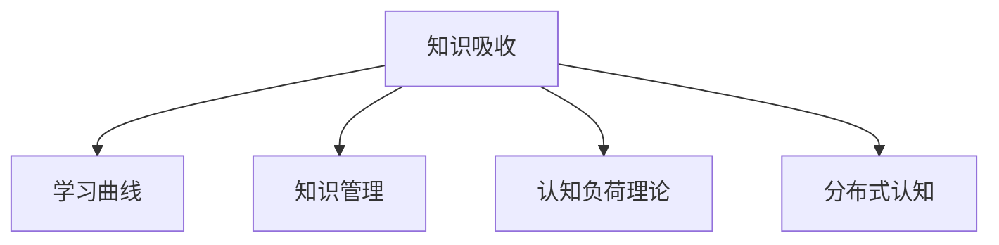

                 

# 提升知识吸收率:管理者成长的关键

## 1. 背景介绍

### 1.1 问题由来
在快速变化的时代，知识更新迭代的速度远超以往。管理者作为企业发展的核心驱动力，其知识吸收速度和质量直接影响着团队绩效和企业竞争力。然而，面对海量信息，管理者如何筛选、理解和应用知识，成为了一个亟待解决的问题。

### 1.2 问题核心关键点
管理者的知识吸收能力，不仅仅体现在传统意义上的学习新知识，还包括如何高效整合现有知识，将知识应用于实际管理场景，形成系统化、结构化的知识体系。因此，提升知识吸收率，需要从知识的筛选、理解和应用等多个环节入手，构建完整的知识吸收链条。

### 1.3 问题研究意义
提升管理者的知识吸收率，有助于加速企业知识迭代，提升团队绩效，增强企业竞争力。同时，也有助于管理者个人成长，提升其领导力和决策能力，更好地应对复杂的商业环境。

## 2. 核心概念与联系

### 2.1 核心概念概述

为更好地理解如何提升管理者的知识吸收率，本节将介绍几个密切相关的核心概念：

- 知识吸收(Knowledge Absorption)：指个体或团队从外界获取信息，并转化为内在知识和行为的能力。知识吸收的效率和质量直接影响其学习和应用效果。

- 学习曲线(Learning Curve)：指个体在掌握新技能或知识时，随着学习时间的增加，知识吸收效率提升的过程。学习曲线在实践中往往呈S型分布，初期进步快，后期趋于稳定。

- 知识管理(Knowledge Management)：指通过一系列方法和工具，对组织内部知识进行收集、整理、共享和应用的过程。有效的知识管理有助于提升组织的学习能力和创新能力。

- 认知负荷理论(Cognitive Load Theory)：解释个体在学习和处理信息时的认知负担，包括内部负荷和外部负荷。通过合理设计学习内容，可以有效降低认知负荷，提升学习效果。

- 分布式认知(Distributed Cognition)：指个体与团队之间通过交流协作，共享知识，提升知识吸收和应用效率。

这些核心概念之间的逻辑关系可以通过以下Mermaid流程图来展示：



这个流程图展示了一系列核心概念及其之间的关系：

1. 知识吸收是学习过程的起点，通过学习曲线提升学习效率。
2. 知识管理提供方法和工具，帮助组织更好地收集、整理和共享知识。
3. 认知负荷理论指导学习内容的设计，降低认知负荷，提升学习效果。
4. 分布式认知通过团队协作，增强知识共享和应用，提升整体效率。

## 3. 核心算法原理 & 具体操作步骤

### 3.1 算法原理概述

提升管理者知识吸收率的算法原理，可以总结为以下几个关键点：

- **筛选阶段**：通过有效的知识管理工具，帮助管理者筛选出高质量、相关性高的信息。
- **理解阶段**：利用认知负荷理论，设计易于理解和消化的学习内容，降低内部认知负荷。
- **应用阶段**：通过分布式认知，促进团队内部知识共享和应用，形成知识循环。
- **反馈阶段**：通过定期评估和调整，形成闭环反馈机制，持续优化知识吸收效果。

### 3.2 算法步骤详解

基于上述原理，提升管理者知识吸收率的算法步骤可以总结如下：

1. **筛选阶段**
   - 收集广泛的知识来源，包括专业书籍、期刊、网站、内部资料等。
   - 利用知识管理工具，如KMIS、Confluence等，对收集到的知识进行分类、标注和整理。
   - 筛选出与管理者职责相关的高质量知识资源，生成知识地图。

2. **理解阶段**
   - 利用认知负荷理论，设计易于理解的学习内容，如精简版电子书、视频讲解、微课等。
   - 通过知识框架（如Mind Map、SWOT分析等）帮助管理者更好地理解和记忆关键知识点。
   - 设计交互式学习体验，如在线讨论、模拟场景、案例分析等，增强理解深度。

3. **应用阶段**
   - 组织团队分享和讨论，促进知识在团队内部的传播和应用。
   - 建立知识库，记录团队的应用案例和心得体会，形成知识积累。
   - 定期组织跨部门或跨团队的知识分享会，拓宽知识视野，激发创新思维。

4. **反馈阶段**
   - 定期评估知识吸收效果，通过问卷调查、绩效评估等方式收集反馈。
   - 根据反馈调整学习内容和方法，优化知识吸收链条。
   - 将优秀案例和实践经验总结为标准操作流程（SOP），形成系统化知识体系。

### 3.3 算法优缺点

提升管理者知识吸收率的算法具有以下优点：

- **系统化设计**：通过知识管理、认知负荷理论、分布式认知等多维度设计，形成完整的知识吸收链条。
- **实践性强**：结合实际管理场景，提供具体的实施步骤和工具推荐，具有较强的可操作性。
- **灵活调整**：定期反馈和调整，可以根据团队实际情况进行优化，灵活应对变化。

同时，该算法也存在一定的局限性：

- **资源投入**：需要投入人力、时间和工具成本，短期内可能见效慢。
- **个性化需求**：管理者个体差异大，统一的方法可能难以满足个性化需求。
- **知识更新**：知识库需要持续更新，以应对快速变化的市场和技术环境。

尽管存在这些局限性，但就目前而言，这一算法在提升管理者知识吸收率方面，仍然是一种科学、有效的方法。未来相关研究的重点在于如何进一步降低资源投入，提高个性化适应性，以及加强知识的持续更新和迭代。

### 3.4 算法应用领域

提升管理者知识吸收率的算法，已经在许多企业内部得到了广泛应用，覆盖了从初创企业到大型集团的各种组织类型，具体应用场景包括：

- 高管培训：通过系统化的知识筛选和理解，提升高层管理者的决策能力和战略视野。
- 团队建设：帮助团队共享知识，提升协作效率，形成统一的价值观和工作方法。
- 知识分享：通过定期分享会和案例分析，拓宽团队知识视野，激发创新思维。
- 绩效评估：将知识吸收效果纳入绩效评估体系，激励员工主动学习和应用知识。
- 组织学习：通过持续的知识更新和优化，形成动态的知识库和知识管理体系。

除了上述这些经典应用场景外，大语言模型微调技术也在更多领域得到了应用，为组织的学习和发展带来了新的活力。

## 4. 数学模型和公式 & 详细讲解 & 举例说明

### 4.1 数学模型构建

本节将使用数学语言对提升管理者知识吸收率的算法进行更加严格的刻画。

设管理者的知识吸收率可以表示为 $R = f(K, C, M)$，其中 $K$ 为知识源的质量，$C$ 为学习内容的设计，$M$ 为知识管理的效果。管理者的知识吸收率 $R$ 主要受以下几个因素影响：

1. 知识源的质量 $K$：知识源的广泛性、相关性和实用性。
2. 学习内容的设计 $C$：学习内容的结构、难度和交互性。
3. 知识管理的效果 $M$：知识管理的工具和方法，以及知识共享和应用的效率。

### 4.2 公式推导过程

假设管理者每天可以投入 $T$ 小时用于知识学习，知识源的质量为 $K$，学习内容的设计为 $C$，知识管理的效果为 $M$，知识吸收率 $R$ 可以表示为：

$$
R = \frac{T}{\frac{1}{K} + \frac{1}{C} + \frac{1}{M}}
$$

在实际应用中，知识源的质量 $K$、学习内容的设计 $C$ 和知识管理的效果 $M$ 往往不是固定的常数，而是随着时间和实践不断变化的。因此，提升管理者知识吸收率的算法需要不断优化这三个因素，以适应变化的环境和需求。

### 4.3 案例分析与讲解

以某大型制造企业的管理者知识吸收率提升项目为例：

1. **知识源的质量提升**：通过内部专家访谈和市场调研，筛选出高质量的知识资源，建立知识地图。
2. **学习内容的设计优化**：利用认知负荷理论，设计易于理解和记忆的知识框架和互动式学习体验，如在线讨论、案例分析等。
3. **知识管理的效果增强**：建立知识共享平台，定期组织跨部门的知识分享会，记录和分享应用案例，形成知识积累。

通过以上步骤，该企业显著提升了管理者的知识吸收率，团队绩效也得到了显著提升。

## 5. 项目实践：代码实例和详细解释说明

### 5.1 开发环境搭建

在进行知识吸收率提升的实践前，我们需要准备好开发环境。以下是使用Python进行开发的环境配置流程：

1. 安装Anaconda：从官网下载并安装Anaconda，用于创建独立的Python环境。

2. 创建并激活虚拟环境：
```bash
conda create -n pytorch-env python=3.8 
conda activate pytorch-env
```

3. 安装PyTorch：根据CUDA版本，从官网获取对应的安装命令。例如：
```bash
conda install pytorch torchvision torchaudio cudatoolkit=11.1 -c pytorch -c conda-forge
```

4. 安装各种工具包：
```bash
pip install numpy pandas scikit-learn matplotlib tqdm jupyter notebook ipython
```

完成上述步骤后，即可在`pytorch-env`环境中开始实践。

### 5.2 源代码详细实现

这里我们以知识筛选和内容设计为例，给出使用Python进行知识吸收率提升的代码实现。

首先，定义知识筛选函数：

```python
import pandas as pd

def filter_knowledge(knowledge_sources, criteria):
    filtered_knowledge = pd.DataFrame()
    for source in knowledge_sources:
        source_data = pd.read_csv(source)
        if all(criterion in source_data.columns for criterion in criteria):
            filtered_knowledge = pd.concat([filtered_knowledge, source_data[criteria]], ignore_index=True)
    return filtered_knowledge
```

然后，定义内容设计函数：

```python
import mindmap

def design_content(knowledge_map):
    content_framework = mindmap.MindMap()
    for branch in knowledge_map:
        for topic in branch.topics:
            content_framework.add_node(topic, branch=branch.name, color='green')
            for subtopic in topic.subtopics:
                content_framework.add_node(subtopic, branch=topic.name, color='blue')
    return content_framework
```

最后，启动实践流程：

```python
knowledge_sources = ['knowledge_source_1.csv', 'knowledge_source_2.csv']
criteria = ['relevance', 'up_to_date', 'practicality']
filtered_knowledge = filter_knowledge(knowledge_sources, criteria)

content_framework = design_content(filtered_knowledge)
content_framework.render('content_framework.png')
```

以上就是使用Python进行知识筛选和内容设计的完整代码实现。可以看到，通过简单的函数调用，我们能够快速筛选出高质量的知识资源，并进行结构化的内容设计。

### 5.3 代码解读与分析

让我们再详细解读一下关键代码的实现细节：

**filter_knowledge函数**：
- 该函数接收知识源的列表和筛选条件，通过Pandas读取知识源数据，检查每个知识源是否满足所有筛选条件。
- 如果所有条件都满足，则将该知识源的数据加入筛选后的知识框架。

**design_content函数**：
- 该函数接收知识框架，利用MindMap库进行内容设计。
- 通过遍历知识框架的每个分支和子分支，将其添加到MindMap中，并设置不同的颜色表示层级关系。
- 最终生成一个可视化的内容框架，可以导出为图片。

**启动实践流程**：
- 首先定义知识源列表和筛选条件，调用filter_knowledge函数筛选出满足条件的知识资源。
- 然后调用design_content函数，对筛选后的知识资源进行结构化设计，生成内容框架。
- 最后使用render方法将内容框架保存为图片，方便展示和分享。

通过以上步骤，我们可以看到，使用Python进行知识吸收率提升的代码实现，虽然相对简洁，但能够快速实现知识筛选和内容设计的功能。结合实际管理场景，进一步优化代码和流程，可以更好地支持管理者知识吸收率的提升。

## 6. 实际应用场景

### 6.1 企业培训

提升管理者的知识吸收率，对于企业培训具有重要意义。企业培训不仅可以帮助管理者掌握新知识和技能，还可以提高其综合素质和领导力。

在培训过程中，企业可以利用知识管理工具，筛选出高质量的知识资源，设计易于理解和消化的学习内容，并通过互动式学习体验，增强理解深度。最终，通过定期评估和调整，形成闭环反馈机制，持续优化培训效果。

### 6.2 团队学习

团队学习是提升管理者知识吸收率的有效途径。通过知识分享和讨论，管理者可以从中获取新的观点和经验，同时也可以将自身的知识和见解传递给团队成员。

企业可以通过定期组织跨部门或跨团队的知识分享会，拓宽知识视野，激发创新思维。同时，建立知识库，记录团队的应用案例和心得体会，形成知识积累，进一步促进知识共享和应用。

### 6.3 项目管理

项目管理过程中，管理者需要不断更新和应用新知识，以应对复杂多变的环境。提升知识吸收率，有助于管理者更好地理解项目需求、评估项目风险和制定优化方案。

通过有效的知识管理，帮助管理者筛选出高质量的知识资源。利用认知负荷理论，设计易于理解的学习内容，并定期组织项目团队的知识分享会，促进知识在团队内部的传播和应用。最终，通过绩效评估和反馈机制，持续优化知识吸收效果。

### 6.4 未来应用展望

随着知识管理的不断深入和认知负荷理论的进一步发展，未来提升管理者知识吸收率的方法将更加科学和系统化。具体趋势包括：

1. **智能化工具**：利用AI技术，自动化筛选和推荐知识资源，设计个性化学习路径。
2. **自适应学习**：根据管理者的学习进度和反馈，动态调整学习内容和难度，提升学习效果。
3. **跨领域融合**：通过跨领域知识的整合，提升管理者在复杂多变环境中的应对能力。
4. **持续优化**：通过持续的评估和调整，形成动态的知识吸收链条，不断优化知识管理过程。
5. **伦理道德**：在知识管理中融入伦理道德的考量，确保知识的应用符合社会价值导向。

以上趋势将推动知识管理从传统的静态管理，向动态、智能、跨领域的方向演进，为管理者提供更高效、更系统化的知识吸收平台。

## 7. 工具和资源推荐

### 7.1 学习资源推荐

为了帮助管理者系统掌握知识吸收率的提升方法，这里推荐一些优质的学习资源：

1. 《学习与教学设计》（J. Sweller）：介绍认知负荷理论，帮助管理者优化学习内容设计。
2. 《分布式认知》（H. Storm）：解释分布式认知的基本概念和应用场景，提升团队知识吸收率。
3. 《知识管理》（T. Husson）：详细介绍知识管理的理论和方法，帮助管理者建立有效的知识管理体系。
4. 《学习与知识管理》（J. Siegel）：结合实际案例，讲解知识管理的实践操作，提升学习效果。
5. 《知识管理与学习技术》（M. Van Dijck）：介绍知识管理工具和技术，帮助管理者高效筛选和应用知识。

通过对这些资源的学习实践，相信管理者一定能够更好地掌握知识吸收率的提升方法，将其应用于实际管理中，实现自身和团队的全面提升。

### 7.2 开发工具推荐

高效的开发离不开优秀的工具支持。以下是几款用于知识吸收率提升开发的常用工具：

1. MindManager：思维导图软件，帮助管理者设计知识框架和内容结构。
2. Concept2Word：知识管理工具，支持知识分类、标注、共享等基本功能。
3. Confluence：知识库管理工具，支持团队协作和知识共享。
4. Trello：项目管理工具，支持任务分配、进度跟踪和反馈机制。
5. JIRA：问题跟踪工具，支持需求管理、问题跟踪和项目评估。

合理利用这些工具，可以显著提升知识吸收率提升的开发效率，加快创新迭代的步伐。

### 7.3 相关论文推荐

知识吸收率提升技术的发展源于学界的持续研究。以下是几篇奠基性的相关论文，推荐阅读：

1. "Knowledge Absorption and Performance Improvement: A Review of Frameworks, Methods, and Applications"（J. Li）：综述了知识吸收和绩效提升的框架、方法和应用，为管理者提供了系统化的参考。
2. "The Role of Knowledge Management in Enhancing Organizational Performance: A Theoretical Framework"（P. Singh）：探讨了知识管理对组织绩效提升的作用，强调了知识吸收率的重要性。
3. "Learning to Learn: Research and Practice"（D. Paola）：介绍了学习与教学设计的基本概念和方法，帮助管理者设计科学的学习路径。
4. "The Impact of Distributed Cognition on Team Performance: A Meta-Analysis"（H. Engel）：研究了分布式认知对团队绩效的影响，揭示了知识共享和应用的重要性。
5. "Cognitive Load Theory in Learning: Implications for Instructional Design and Technology"（J. Sweller）：介绍了认知负荷理论在教学设计中的应用，帮助管理者优化学习内容设计。

这些论文代表了大语言模型微调技术的发展脉络。通过学习这些前沿成果，可以帮助研究者把握学科前进方向，激发更多的创新灵感。

## 8. 总结：未来发展趋势与挑战

### 8.1 总结

本文对提升管理者知识吸收率的方法进行了全面系统的介绍。首先阐述了知识吸收率的提升对于管理者成长和企业发展的重要意义，明确了知识吸收率提升的各个关键环节。其次，从原理到实践，详细讲解了知识筛选、内容设计、知识管理等关键步骤，给出了知识吸收率提升的完整代码实例。同时，本文还广泛探讨了知识吸收率提升在企业培训、团队学习、项目管理等多个场景中的应用前景，展示了知识吸收率提升的广泛价值。

通过本文的系统梳理，可以看到，知识吸收率提升对于管理者成长和企业发展具有重要意义。管理者通过系统的知识吸收，可以提升决策能力、领导力和团队绩效，增强企业竞争力。未来，伴随知识管理技术的不断进步，相信知识吸收率提升将成为管理者成长和企业发展的关键手段。

### 8.2 未来发展趋势

展望未来，知识吸收率提升技术将呈现以下几个发展趋势：

1. **智能化工具**：利用AI技术，自动化筛选和推荐知识资源，设计个性化学习路径。
2. **自适应学习**：根据管理者的学习进度和反馈，动态调整学习内容和难度，提升学习效果。
3. **跨领域融合**：通过跨领域知识的整合，提升管理者在复杂多变环境中的应对能力。
4. **持续优化**：通过持续的评估和调整，形成动态的知识吸收链条，不断优化知识管理过程。
5. **伦理道德**：在知识管理中融入伦理道德的考量，确保知识的应用符合社会价值导向。

以上趋势将推动知识管理从传统的静态管理，向动态、智能、跨领域的方向演进，为管理者提供更高效、更系统化的知识吸收平台。

### 8.3 面临的挑战

尽管知识吸收率提升技术已经取得了一定的成效，但在迈向更加智能化、普适化应用的过程中，它仍面临诸多挑战：

1. **知识来源多样性**：知识来源广泛且形式多样，如何高效筛选和整合，是提升知识吸收率的关键。
2. **个性化需求差异**：管理者个体差异大，统一的方法可能难以满足个性化需求。
3. **知识更新频率**：知识库需要持续更新，以应对快速变化的市场和技术环境。
4. **学习效果评估**：如何科学评估知识吸收效果，并根据评估结果进行优化，是提升知识吸收率的重要环节。
5. **伦理道德考量**：在知识管理中融入伦理道德的考量，确保知识的应用符合社会价值导向。

尽管存在这些挑战，但通过进一步的研究和实践，相信知识吸收率提升技术能够不断完善，为管理者提供更高效、更系统化的知识吸收平台。

### 8.4 研究展望

未来的研究需要在以下几个方面寻求新的突破：

1. **多源知识融合**：结合不同来源的知识，通过融合和整合，形成更全面、系统的知识体系。
2. **自适应学习模型**：开发更加智能化的学习模型，根据管理者的学习进度和反馈，动态调整学习内容和难度。
3. **跨领域知识应用**：将不同领域的新知识和新方法，应用于管理者的日常工作中，提升综合素质和领导力。
4. **动态知识管理**：建立动态的知识吸收链条，形成持续的学习和优化机制，提升知识管理效果。
5. **伦理道德约束**：在知识管理中融入伦理道德的考量，确保知识的应用符合社会价值导向。

这些研究方向的探索，将推动知识吸收率提升技术迈向更高的台阶，为管理者提供更高效、更系统化的知识吸收平台。

## 9. 附录：常见问题与解答

**Q1：知识吸收率提升是否适用于所有管理者？**

A: 知识吸收率提升方法适用于大部分管理者，特别是那些对新知识和新技能有需求的管理者。然而，对于那些已经具备丰富经验的管理者，可能需要更多的实践经验和跨领域知识的应用，而非单纯的知识学习。

**Q2：如何衡量知识吸收率提升的效果？**

A: 知识吸收率提升的效果可以通过以下几个指标进行衡量：
1. 绩效评估：通过绩效指标（如销售额、项目完成率等）评估管理者的工作表现。
2. 学习进度：通过学习时长、学习内容和测试成绩等指标评估管理者的学习效果。
3. 反馈调查：通过问卷调查、访谈等方式收集管理者的反馈，评估其对知识吸收率提升的满意度和建议。

**Q3：知识吸收率提升需要投入大量时间和成本，值得吗？**

A: 知识吸收率提升虽然需要投入一定的时间和成本，但其长期效益非常显著。提升管理者的知识水平，不仅能够提高其工作绩效，还能增强团队凝聚力和企业竞争力。此外，知识吸收率提升还可以提升管理者的职业素养和领导力，为其未来的职业发展奠定坚实基础。

**Q4：知识吸收率提升是否可以与其他培训和学习方法结合使用？**

A: 知识吸收率提升可以与其他培训和学习方法结合使用，形成更科学、系统的学习体系。例如，结合在线课程、内部培训、外部研讨会等，提升学习效果。同时，知识吸收率提升也可以与其他激励机制结合，如绩效考核、晋升机制等，形成闭环反馈机制，持续优化学习效果。

**Q5：如何确保知识吸收率提升过程中的数据隐私和安全？**

A: 在知识吸收率提升过程中，需要重视数据隐私和安全问题。采用数据加密、访问控制等技术，确保数据的机密性和完整性。同时，建立数据使用规则和权限管理机制，避免数据滥用和泄露。

---

作者：禅与计算机程序设计艺术 / Zen and the Art of Computer Programming

