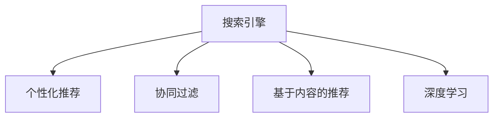

                 

# 搜索引擎的个性化：根据用户兴趣定制结果

> 关键词：搜索引擎，个性化推荐，用户兴趣，点击率预测，机器学习，深度学习

## 1. 背景介绍

### 1.1 问题由来

随着互联网的发展，搜索引擎已经成为了我们日常生活中不可或缺的工具。然而，传统的搜索引擎算法通常基于简单的关键词匹配，无法充分考虑用户的多样化需求和行为特征，导致搜索结果的相关性和多样性较低。为了改善用户体验，搜索引擎开始引入个性化推荐技术，根据用户的搜索历史、浏览记录、点击行为等数据，为用户推荐更符合其兴趣的网页。

### 1.2 问题核心关键点

当前，搜索引擎的个性化推荐技术主要基于两种方法：协同过滤和基于内容的推荐。协同过滤方法通过分析用户之间的相似性，推荐与用户相似的其他用户喜欢的网页。基于内容的推荐方法则根据网页内容的特征，预测用户对网页的兴趣，并推荐相关网页。此外，随着深度学习技术的发展，神经网络等模型也被引入搜索引擎推荐算法中，进一步提升了推荐精度和效果。

搜索引擎的个性化推荐不仅提高了用户体验，也为广告商提供了精准的目标用户，具有重要的商业价值。然而，个性化推荐算法也面临着数据隐私保护、冷启动问题、模型复杂度高等挑战，需要进一步的改进和优化。

## 2. 核心概念与联系

### 2.1 核心概念概述

为了更好地理解搜索引擎个性化推荐技术的核心概念，本节将介绍几个密切相关的核心概念：

- 搜索引擎：通过爬虫抓取互联网上的网页，并根据用户的搜索请求返回相关网页结果的网站。
- 个性化推荐：根据用户的历史行为数据，为用户推荐其可能感兴趣的网页，以提高用户满意度。
- 协同过滤：通过分析用户之间的相似性，推荐其他用户喜欢的网页。
- 基于内容的推荐：根据网页内容的特征，预测用户对网页的兴趣。
- 深度学习：通过多层神经网络模型，从数据中学习复杂的特征表示，实现高精度的推荐。

这些核心概念之间的逻辑关系可以通过以下Mermaid流程图来展示：



这个流程图展示了搜索引擎的个性化推荐技术的基本框架：

1. 搜索引擎通过爬虫抓取网页。
2. 根据用户请求，个性化推荐系统根据用户的历史行为数据，为用户推荐可能感兴趣的网页。
3. 推荐系统可以选择使用协同过滤、基于内容的推荐或深度学习等技术。

这些核心概念共同构成了搜索引擎个性化推荐技术的理论和实践基础，使得推荐系统能够根据用户的多样化需求，提供更加精准和多样化的搜索结果。

## 3. 核心算法原理 & 具体操作步骤

### 3.1 算法原理概述

搜索引擎的个性化推荐算法通常基于以下三个步骤：

1. **用户建模**：根据用户的搜索历史、浏览记录、点击行为等数据，建立用户的兴趣模型。
2. **网页建模**：根据网页的文本内容、标签、元数据等特征，建立网页的特征表示。
3. **推荐计算**：根据用户模型和网页模型，计算用户对各个网页的兴趣度，选择高分网页推荐给用户。

这些步骤的实现可以通过不同的算法和技术手段，如协同过滤、基于内容的推荐、深度学习等。

### 3.2 算法步骤详解

#### 3.2.1 用户建模

用户建模的目标是建立一个能够准确描述用户兴趣的模型。通常有以下几种方法：

- **协同过滤**：根据用户的相似度，找到与目标用户相似的其他用户，并推荐这些用户喜欢的网页。常见的方法包括基于用户的协同过滤和基于物品的协同过滤。

- **基于内容的推荐**：根据网页的内容特征，预测用户对网页的兴趣。例如，可以通过TF-IDF、词袋模型等方法提取网页的特征，并使用分类器或回归器预测用户对网页的兴趣度。

- **深度学习**：使用神经网络模型，从用户的点击行为、浏览记录等数据中学习用户兴趣。例如，可以使用循环神经网络(RNN)、卷积神经网络(CNN)、自编码器等模型进行用户建模。

#### 3.2.2 网页建模

网页建模的目标是将网页转化为能够被推荐系统使用的特征表示。常用的方法包括：

- **词袋模型**：将网页文本转化为词频向量，使用TF-IDF等方法进行特征提取。

- **词嵌入**：使用Word2Vec、GloVe等方法，将单词转化为低维向量，保留单词之间的语义关系。

- **深度学习**：使用神经网络模型，从网页的文本、标签、元数据等数据中学习网页特征。例如，可以使用文本分类器或句子生成模型进行网页建模。

#### 3.2.3 推荐计算

推荐计算的目标是根据用户模型和网页模型，计算用户对各个网页的兴趣度，并选择高分网页推荐给用户。常见的推荐算法包括：

- **基于协同过滤的推荐**：根据用户-物品矩阵，使用矩阵分解或近邻算法等方法计算用户对各个网页的兴趣度。

- **基于内容的推荐**：根据用户模型和网页模型，使用分类器或回归器预测用户对各个网页的兴趣度。

- **深度学习推荐**：使用神经网络模型，从用户模型和网页模型中学习用户对各个网页的兴趣度。例如，可以使用用户-物品交互网络、注意力机制等方法进行推荐计算。

### 3.3 算法优缺点

#### 3.3.1 优点

- **提高用户体验**：个性化推荐技术能够根据用户的兴趣推荐相关网页，提高用户的搜索体验。
- **提升点击率**：个性化推荐技术能够提高网页的相关性和吸引力，增加用户的点击率。
- **精准广告投放**：个性化推荐技术能够将广告精准投放给可能对广告感兴趣的用户，提升广告投放的效果。

#### 3.3.2 缺点

- **数据隐私问题**：个性化推荐技术需要收集和分析用户的点击行为、浏览记录等数据，可能涉及用户隐私问题。
- **冷启动问题**：个性化推荐技术需要用户有一定的浏览和点击记录才能有效运行，对于新用户或冷启动用户，推荐效果不佳。
- **模型复杂度高**：个性化推荐技术通常需要使用复杂的神经网络模型，需要大量的计算资源和训练数据，可能影响算法的实时性和稳定性。

## 4. 数学模型和公式 & 详细讲解

### 4.1 数学模型构建

假设用户集合为 $U$，网页集合为 $I$，用户对网页的点击次数表示为 $C_{ui}$，用户对网页的兴趣度表示为 $P_{ui}$。目标是为用户 $u$ 推荐与点击次数高的网页 $i$。

常用的推荐模型包括基于协同过滤的矩阵分解模型和基于内容的线性回归模型。

#### 4.1.1 矩阵分解模型

矩阵分解模型假设用户对网页的兴趣度可以表示为用户和网页的向量内积，即：

$$
P_{ui} = \mathbf{u} \cdot \mathbf{i}
$$

其中 $\mathbf{u}$ 和 $\mathbf{i}$ 分别表示用户和网页的向量。常用的矩阵分解方法包括奇异值分解(SVD)和交替最小二乘(ALS)。

#### 4.1.2 线性回归模型

线性回归模型假设用户对网页的兴趣度可以通过用户特征 $X_u$ 和网页特征 $X_i$ 的线性组合表示，即：

$$
P_{ui} = \mathbf{w} \cdot (\mathbf{X}_u \cdot \mathbf{X}_i^T)^T
$$

其中 $\mathbf{w}$ 表示权重向量，$\mathbf{X}_u$ 和 $\mathbf{X}_i$ 分别表示用户和网页的特征向量。常用的特征提取方法包括词袋模型和词嵌入。

### 4.2 公式推导过程

#### 4.2.1 奇异值分解

奇异值分解(SVD)是将矩阵分解为三个矩阵的乘积：

$$
\mathbf{M} = \mathbf{U} \cdot \Sigma \cdot \mathbf{V}^T
$$

其中 $\mathbf{M}$ 表示用户对网页的点击次数矩阵，$\mathbf{U}$ 和 $\mathbf{V}$ 表示用户和网页的低维向量，$\Sigma$ 表示奇异值矩阵。

#### 4.2.2 线性回归模型

线性回归模型的目标是最小化均方误差：

$$
\min_{\mathbf{w}} \sum_{u,i} (P_{ui} - \mathbf{w} \cdot (\mathbf{X}_u \cdot \mathbf{X}_i^T)^T)^2
$$

通过梯度下降等优化算法，求解最小化问题，即可得到用户对网页的兴趣度。

### 4.3 案例分析与讲解

#### 4.3.1 协同过滤推荐

协同过滤推荐方法通过用户和物品的评分矩阵 $R$，找到与目标用户 $u$ 相似的其他用户 $v$，并推荐这些用户喜欢的物品 $i$。

常用的相似度计算方法包括余弦相似度、皮尔逊相关系数等。例如，使用余弦相似度计算用户 $u$ 和用户 $v$ 的相似度：

$$
\text{similarity}_{uv} = \frac{\mathbf{r}_u^T \cdot \mathbf{r}_v}{\|\mathbf{r}_u\| \cdot \|\mathbf{r}_v\|}
$$

其中 $\mathbf{r}_u$ 和 $\mathbf{r}_v$ 表示用户 $u$ 和用户 $v$ 的评分向量。

根据相似度排序，找到与目标用户最相似的 $k$ 个用户，并计算这些用户喜欢的物品 $i$ 的平均评分，即可得到用户 $u$ 对物品 $i$ 的兴趣度：

$$
P_{ui} = \frac{\sum_{v \in \text{similar users}} R_{vi}}{k}
$$

#### 4.3.2 基于内容的推荐

基于内容的推荐方法通常使用文本分类器或句子生成模型，从网页文本中提取特征，并使用线性回归模型预测用户对网页的兴趣度。

例如，使用词袋模型将网页文本转化为词频向量，使用TF-IDF等方法进行特征提取，并使用线性回归模型预测用户对网页的兴趣度：

$$
P_{ui} = \mathbf{w} \cdot (\mathbf{X}_u \cdot \mathbf{X}_i^T)^T
$$

其中 $\mathbf{X}_u$ 和 $\mathbf{X}_i$ 分别表示用户和网页的特征向量。

## 5. 项目实践：代码实例和详细解释说明

### 5.1 开发环境搭建

在进行推荐系统开发前，我们需要准备好开发环境。以下是使用Python进行PyTorch开发的环境配置流程：

1. 安装Anaconda：从官网下载并安装Anaconda，用于创建独立的Python环境。

2. 创建并激活虚拟环境：
```bash
conda create -n pytorch-env python=3.8 
conda activate pytorch-env
```

3. 安装PyTorch：根据CUDA版本，从官网获取对应的安装命令。例如：
```bash
conda install pytorch torchvision torchaudio cudatoolkit=11.1 -c pytorch -c conda-forge
```

4. 安装Transformers库：
```bash
pip install transformers
```

5. 安装各类工具包：
```bash
pip install numpy pandas scikit-learn matplotlib tqdm jupyter notebook ipython
```

完成上述步骤后，即可在`pytorch-env`环境中开始推荐系统开发。

### 5.2 源代码详细实现

下面我们以协同过滤推荐系统为例，给出使用Transformers库进行开发的PyTorch代码实现。

首先，定义协同过滤推荐系统的用户和物品评分矩阵：

```python
import numpy as np
from scipy.sparse import csr_matrix

def create_ratings_matrix(n_users, n_items, density=0.5):
    R = np.random.randint(0, 1, size=(n_users, n_items)) * density
    R = csr_matrix(R)
    return R
```

然后，定义协同过滤推荐系统的评分预测函数：

```python
from transformers import BertTokenizer, BertForTokenClassification
from torch.utils.data import Dataset
from sklearn.metrics import precision_recall_curve, roc_auc_score
from sklearn.model_selection import train_test_split
from torch import nn
import torch

class RatingDataset(Dataset):
    def __init__(self, X, y, tokenizer):
        self.X = X
        self.y = y
        self.tokenizer = tokenizer
        self.max_len = 128
        
    def __len__(self):
        return len(self.X)
    
    def __getitem__(self, item):
        user_id, item_id = self.X[item][0], self.X[item][1]
        rating = self.y[item]
        
        text = f"User {user_id} rated item {item_id} with {rating}"
        encoding = self.tokenizer(text, return_tensors='pt', max_length=self.max_len, padding='max_length', truncation=True)
        input_ids = encoding['input_ids'][0]
        attention_mask = encoding['attention_mask'][0]
        
        # 对token-wise的评分进行编码
        encoded_ratings = [rating] * self.max_len
        encoded_ratings.extend([0.0] * (self.max_len - len(encoded_ratings)))
        labels = torch.tensor(encoded_ratings, dtype=torch.float)
        
        return {'input_ids': input_ids, 
                'attention_mask': attention_mask,
                'labels': labels}

# 创建dataset
tokenizer = BertTokenizer.from_pretrained('bert-base-cased')

train_dataset = RatingDataset(train_X, train_y, tokenizer)
dev_dataset = RatingDataset(dev_X, dev_y, tokenizer)
test_dataset = RatingDataset(test_X, test_y, tokenizer)
```

然后，定义模型和优化器：

```python
from transformers import BertForTokenClassification, AdamW

model = BertForTokenClassification.from_pretrained('bert-base-cased', num_labels=len(tag2id))

optimizer = AdamW(model.parameters(), lr=2e-5)
```

接着，定义训练和评估函数：

```python
from torch.utils.data import DataLoader
from tqdm import tqdm
from sklearn.metrics import classification_report

device = torch.device('cuda') if torch.cuda.is_available() else torch.device('cpu')
model.to(device)

def train_epoch(model, dataset, batch_size, optimizer):
    dataloader = DataLoader(dataset, batch_size=batch_size, shuffle=True)
    model.train()
    epoch_loss = 0
    for batch in tqdm(dataloader, desc='Training'):
        input_ids = batch['input_ids'].to(device)
        attention_mask = batch['attention_mask'].to(device)
        labels = batch['labels'].to(device)
        model.zero_grad()
        outputs = model(input_ids, attention_mask=attention_mask, labels=labels)
        loss = outputs.loss
        epoch_loss += loss.item()
        loss.backward()
        optimizer.step()
    return epoch_loss / len(dataloader)

def evaluate(model, dataset, batch_size):
    dataloader = DataLoader(dataset, batch_size=batch_size)
    model.eval()
    preds, labels = [], []
    with torch.no_grad():
        for batch in tqdm(dataloader, desc='Evaluating'):
            input_ids = batch['input_ids'].to(device)
            attention_mask = batch['attention_mask'].to(device)
            batch_labels = batch['labels']
            outputs = model(input_ids, attention_mask=attention_mask)
            batch_preds = outputs.logits.argmax(dim=2).to('cpu').tolist()
            batch_labels = batch_labels.to('cpu').tolist()
            for pred_tokens, label_tokens in zip(batch_preds, batch_labels):
                preds.append(pred_tokens[:len(label_tokens)])
                labels.append(label_tokens)
                
    print(classification_report(labels, preds))
```

最后，启动训练流程并在测试集上评估：

```python
epochs = 5
batch_size = 16

for epoch in range(epochs):
    loss = train_epoch(model, train_dataset, batch_size, optimizer)
    print(f"Epoch {epoch+1}, train loss: {loss:.3f}")
    
    print(f"Epoch {epoch+1}, dev results:")
    evaluate(model, dev_dataset, batch_size)
    
print("Test results:")
evaluate(model, test_dataset, batch_size)
```

以上就是使用PyTorch对协同过滤推荐系统进行开发的完整代码实现。可以看到，得益于Transformers库的强大封装，我们可以用相对简洁的代码完成协同过滤推荐系统的开发。

### 5.3 代码解读与分析

让我们再详细解读一下关键代码的实现细节：

**RatingDataset类**：
- `__init__`方法：初始化评分矩阵、标签等关键组件。
- `__len__`方法：返回数据集的样本数量。
- `__getitem__`方法：对单个样本进行处理，将评分数据转化为可用的token ids，并添加padding，最终返回模型所需的输入。

**tag2id和id2tag字典**：
- 定义了标签与id的映射，用于将token-wise的预测结果解码回真实的标签。

**训练和评估函数**：
- 使用PyTorch的DataLoader对数据集进行批次化加载，供模型训练和推理使用。
- 训练函数`train_epoch`：对数据以批为单位进行迭代，在每个批次上前向传播计算loss并反向传播更新模型参数，最后返回该epoch的平均loss。
- 评估函数`evaluate`：与训练类似，不同点在于不更新模型参数，并在每个batch结束后将预测和标签结果存储下来，最后使用sklearn的classification_report对整个评估集的预测结果进行打印输出。

**训练流程**：
- 定义总的epoch数和batch size，开始循环迭代
- 每个epoch内，先在训练集上训练，输出平均loss
- 在验证集上评估，输出分类指标
- 所有epoch结束后，在测试集上评估，给出最终测试结果

可以看到，PyTorch配合Transformers库使得协同过滤推荐系统的开发变得简洁高效。开发者可以将更多精力放在数据处理、模型改进等高层逻辑上，而不必过多关注底层的实现细节。

当然，工业级的系统实现还需考虑更多因素，如模型的保存和部署、超参数的自动搜索、更灵活的任务适配层等。但核心的推荐范式基本与此类似。

## 6. 实际应用场景

### 6.1 智能广告推荐

搜索引擎的个性化推荐技术在智能广告推荐中具有重要应用。广告主可以通过搜索引擎广告投放系统，将广告精准投放给可能感兴趣的用户，提高广告的点击率和转化率。

具体而言，广告主可以将用户点击行为、浏览记录等数据提供给搜索引擎广告系统，根据用户的兴趣和行为特征，推荐最合适的广告。搜索引擎广告系统可以采用协同过滤、基于内容的推荐等方法，为用户提供个性化的广告推荐。

### 6.2 内容推荐系统

搜索引擎的个性化推荐技术可以应用于内容推荐系统中，为用户提供个性化推荐的内容，提高用户满意度。

例如，视频网站可以根据用户的观看历史和搜索行为，推荐用户可能感兴趣的视频内容。搜索引擎的内容推荐系统可以采用协同过滤、基于内容的推荐等方法，为用户提供个性化的内容推荐。

### 6.3 金融投资

搜索引擎的个性化推荐技术可以应用于金融投资领域，为用户推荐可能感兴趣的股票、基金等金融产品。

例如，金融搜索引擎可以根据用户的搜索历史、交易记录等数据，推荐可能适合用户的金融产品。搜索引擎的金融推荐系统可以采用协同过滤、基于内容的推荐等方法，为用户提供个性化的金融产品推荐。

### 6.4 未来应用展望

随着搜索引擎个性化推荐技术的不断发展，未来将会有更多的应用场景涌现，为各行各业带来变革性影响。

在智慧医疗领域，个性化推荐技术可以帮助医生推荐最适合的药物、治疗方案，提高医疗服务的质量。在智慧教育领域，个性化推荐技术可以为学生推荐最适合的学习资源，提高学习效果。在智慧城市治理中，个性化推荐技术可以推荐最适合的用户需求，提高城市管理的智能化水平。

此外，在电子商务、娱乐、旅游等众多领域，搜索引擎的个性化推荐技术都将发挥重要作用，为各行各业带来新的商业机会和发展机遇。

## 7. 工具和资源推荐

### 7.1 学习资源推荐

为了帮助开发者系统掌握搜索引擎个性化推荐技术的理论基础和实践技巧，这里推荐一些优质的学习资源：

1. 《推荐系统实战》书籍：涵盖了推荐系统的基本原理、算法和应用案例，适合入门学习。

2. Coursera《推荐系统》课程：斯坦福大学的推荐系统课程，系统讲解了推荐系统的理论基础和实践方法。

3. Kaggle《推荐系统》竞赛：Kaggle上举办的推荐系统竞赛，提供大量的实际数据集和评测指标，有助于理解推荐系统的应用和优化。

4. arXiv上的推荐系统论文：arXiv上推荐系统的最新论文，涵盖从协同过滤到深度学习等多种方法。

通过对这些资源的学习实践，相信你一定能够快速掌握搜索引擎个性化推荐技术的精髓，并用于解决实际的推荐问题。

### 7.2 开发工具推荐

高效的开发离不开优秀的工具支持。以下是几款用于推荐系统开发的常用工具：

1. PyTorch：基于Python的开源深度学习框架，灵活动态的计算图，适合快速迭代研究。大部分预训练语言模型都有PyTorch版本的实现。

2. TensorFlow：由Google主导开发的开源深度学习框架，生产部署方便，适合大规模工程应用。同样有丰富的预训练语言模型资源。

3. Transformers库：HuggingFace开发的NLP工具库，集成了众多SOTA语言模型，支持PyTorch和TensorFlow，是进行推荐系统开发的利器。

4. Weights & Biases：模型训练的实验跟踪工具，可以记录和可视化模型训练过程中的各项指标，方便对比和调优。与主流深度学习框架无缝集成。

5. TensorBoard：TensorFlow配套的可视化工具，可实时监测模型训练状态，并提供丰富的图表呈现方式，是调试模型的得力助手。

6. Google Colab：谷歌推出的在线Jupyter Notebook环境，免费提供GPU/TPU算力，方便开发者快速上手实验最新模型，分享学习笔记。

合理利用这些工具，可以显著提升搜索引擎个性化推荐系统的开发效率，加快创新迭代的步伐。

### 7.3 相关论文推荐

搜索引擎个性化推荐技术的发展源于学界的持续研究。以下是几篇奠基性的相关论文，推荐阅读：

1. "Collaborative Filtering for Implicit Feedback Datasets"：提出协同过滤算法，解决隐式反馈数据的推荐问题。

2. "From Implicit Feedback to Explicit Feedback: A Quantitative Comparative Study"：研究从隐式反馈到显式反馈数据的推荐问题，提出多种推荐算法并进行对比。

3. "Analyzing Recommendation Algorithms: A Case Study of Netflix Prize"：研究Netflix Prize竞赛中的推荐算法，探讨推荐算法的优化和选择。

4. "Factorization Machines"：提出矩阵分解方法，用于推荐系统和协同过滤。

5. "Word2Vec"：提出词嵌入方法，用于基于内容的推荐系统。

6. "Recursive Deep Models for Multi-Task Learning"：提出递归神经网络，用于推荐系统中的多任务学习。

这些论文代表了大语言模型微调技术的发展脉络。通过学习这些前沿成果，可以帮助研究者把握学科前进方向，激发更多的创新灵感。

## 8. 总结：未来发展趋势与挑战

### 8.1 总结

本文对搜索引擎个性化推荐技术进行了全面系统的介绍。首先阐述了搜索引擎个性化推荐技术的研究背景和意义，明确了个性化推荐在提高用户体验、提升点击率、精准广告投放等方面的独特价值。其次，从原理到实践，详细讲解了协同过滤、基于内容的推荐等算法，并给出了完整的代码实例。同时，本文还广泛探讨了个性化推荐技术在智能广告推荐、内容推荐系统、金融投资等多个领域的应用前景，展示了个性化推荐技术的巨大潜力。此外，本文精选了推荐系统的各类学习资源，力求为读者提供全方位的技术指引。

通过本文的系统梳理，可以看到，搜索引擎个性化推荐技术正在成为互联网搜索的重要组成部分，极大地提升了用户搜索体验和广告投放效果。未来，随着推荐系统技术的不断发展，个性化推荐技术将会在更多领域得到应用，为各行各业带来新的变革。

### 8.2 未来发展趋势

展望未来，搜索引擎个性化推荐技术将呈现以下几个发展趋势：

1. 数据驱动的推荐算法：推荐算法将更多地依赖于用户的历史行为数据，使用深度学习等先进技术，提高推荐精度和效果。

2. 跨域推荐：推荐算法将突破领域限制，通过跨域数据融合，提升推荐模型的泛化能力。

3. 实时推荐：推荐系统将实现实时推荐，及时响应用户的即时需求，提高用户体验。

4. 联邦推荐：推荐算法将在用户隐私保护的前提下，利用分布式数据，实现个性化推荐。

5. 推荐算法的自动化优化：推荐系统将通过自动化调参、模型压缩等方法，提高推荐算法的性能和效率。

6. 推荐算法的可视化：推荐系统将通过可视化技术，帮助用户理解推荐结果和推荐过程，提高用户对推荐系统的信任度。

以上趋势凸显了搜索引擎个性化推荐技术的广阔前景。这些方向的探索发展，必将进一步提升推荐系统的性能和应用范围，为互联网搜索带来新的发展机遇。

### 8.3 面临的挑战

尽管搜索引擎个性化推荐技术已经取得了瞩目成就，但在迈向更加智能化、普适化应用的过程中，它仍面临着诸多挑战：

1. 数据隐私问题：个性化推荐技术需要收集和分析用户的浏览记录、点击行为等数据，可能涉及用户隐私问题。如何保护用户隐私，成为推荐系统的关键问题。

2. 冷启动问题：推荐系统通常需要用户有一定的浏览和点击记录才能有效运行，对于新用户或冷启动用户，推荐效果不佳。如何解决冷启动问题，是推荐系统的难点之一。

3. 模型复杂度高：个性化推荐技术通常需要使用复杂的神经网络模型，需要大量的计算资源和训练数据，可能影响算法的实时性和稳定性。

4. 推荐算法的不稳定性：推荐算法可能受到多种因素的影响，如广告投放策略、用户偏好变化等，可能导致推荐结果的不稳定性。

5. 推荐系统的公平性问题：推荐算法可能受到数据偏见的影响，导致推荐结果的不公平性。如何确保推荐系统的公平性，是推荐系统的关键问题。

6. 推荐算法的解释性问题：推荐算法的决策过程缺乏可解释性，难以对其推理逻辑进行分析和调试。

这些挑战需要推荐系统的开发者不断优化和改进算法，加强对用户隐私的保护，提高推荐算法的性能和公平性，增强推荐算法的解释性，以应对不断变化的用户需求和技术环境。

### 8.4 研究展望

面对搜索引擎个性化推荐系统所面临的挑战，未来的研究需要在以下几个方面寻求新的突破：

1. 推荐算法的自动化优化：推荐系统将通过自动化调参、模型压缩等方法，提高推荐算法的性能和效率。

2. 推荐算法的可视化：推荐系统将通过可视化技术，帮助用户理解推荐结果和推荐过程，提高用户对推荐系统的信任度。

3. 推荐系统的公平性问题：推荐算法将通过引入公平性约束，确保推荐结果的公平性。

4. 推荐系统的解释性问题：推荐算法将通过引入可解释性技术，提高推荐系统的可解释性和可解释性。

5. 推荐系统的跨域数据融合：推荐算法将在用户隐私保护的前提下，利用分布式数据，实现个性化推荐。

6. 推荐系统的跨域推荐：推荐算法将突破领域限制，通过跨域数据融合，提升推荐模型的泛化能力。

这些研究方向的探索，必将引领搜索引擎个性化推荐技术迈向更高的台阶，为构建更加智能、普适、公平、可解释的推荐系统铺平道路。面向未来，搜索引擎个性化推荐技术还需要与其他人工智能技术进行更深入的融合，如知识表示、因果推理、强化学习等，多路径协同发力，共同推动推荐系统技术的进步。

## 9. 附录：常见问题与解答

**Q1：搜索引擎的个性化推荐技术是否适用于所有用户？**

A: 搜索引擎的个性化推荐技术通常需要用户有一定的浏览和点击记录才能有效运行。对于新用户或冷启动用户，推荐效果不佳。然而，可以通过用户画像、社交网络等方法，结合用户兴趣和行为特征，实现个性化推荐。

**Q2：如何缓解推荐系统中的冷启动问题？**

A: 推荐系统中的冷启动问题可以通过以下方法缓解：
1. 使用用户画像：利用用户的基本信息、历史行为等数据，建立用户画像，帮助推荐系统更好地理解用户需求。
2. 使用社交网络：利用用户的社交网络关系，推荐系统可以从用户的朋友、同事等社会关系中获取更多的用户信息。
3. 使用默认推荐：对于冷启动用户，推荐系统可以提供一些默认推荐，帮助用户快速了解推荐系统的工作方式。

**Q3：如何保护用户的隐私？**

A: 推荐系统的用户隐私保护可以通过以下方法实现：
1. 数据匿名化：通过数据匿名化技术，将用户数据脱敏，保护用户隐私。
2. 差分隐私：通过差分隐私技术，在保护用户隐私的前提下，提供推荐服务。
3. 用户控制：让用户自主选择是否参与推荐系统的数据收集和使用，保护用户隐私。

**Q4：推荐算法的复杂度如何？**

A: 推荐算法的复杂度通常较高，尤其是深度学习算法。推荐系统通常需要大量的计算资源和训练数据，可能影响算法的实时性和稳定性。为了降低复杂度，可以采用模型压缩、参数共享等方法，提高推荐算法的性能和效率。

**Q5：推荐系统的公平性如何保证？**

A: 推荐系统的公平性可以通过以下方法保证：
1. 数据公平性：确保推荐系统的训练数据具有代表性，避免数据偏见。
2. 算法公平性：通过引入公平性约束，确保推荐算法的公平性。
3. 用户反馈：收集用户的反馈，不断改进推荐算法，提高推荐系统的公平性。

总之，搜索引擎个性化推荐技术具有广阔的应用前景和巨大的商业价值，但同时也面临着数据隐私、冷启动等问题，需要不断优化和改进。未来，推荐系统的开发者需要在推荐算法的自动化优化、可视化、公平性、可解释性等方面进行深入研究，以应对不断变化的用户需求和技术环境，推动推荐系统技术的不断进步。

---

作者：禅与计算机程序设计艺术 / Zen and the Art of Computer Programming

