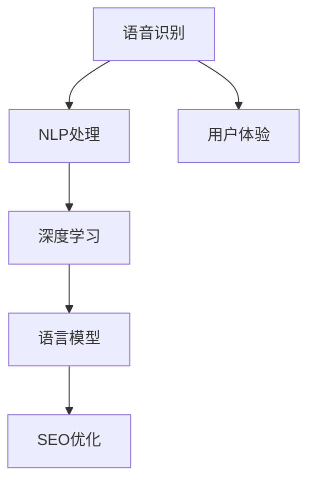

                 

# 搜索引擎的语音交互优化

> 关键词：语音搜索, 自然语言处理(NLP), 深度学习, 语音识别, 语言模型, 搜索引擎优化(SEO)

## 1. 背景介绍

随着互联网的普及和智能设备的增加，越来越多的用户选择使用语音进行搜索。这不仅提高了搜索效率，还为残障人士提供了便利。然而，传统的文本搜索引擎在处理语音输入时，常常面临一些挑战。语言的多样性和复杂性使得语音交互的优化成为一个重要且具挑战性的问题。本文档将深入探讨如何通过自然语言处理(NLP)技术优化搜索引擎的语音交互体验。

## 2. 核心概念与联系

### 2.1 核心概念概述

为了理解搜索引擎的语音交互优化，我们需要理解几个关键概念：

- **语音识别**：将人类的语音转换为计算机可处理的文本的过程，是搜索引擎语音交互的第一步。
- **自然语言处理(NLP)**：使计算机能够理解、解释和生成人类语言的技术。
- **深度学习**：通过多层神经网络对语音和文本数据进行建模，提高搜索引擎的性能。
- **语言模型**：描述语言概率分布的数学模型，用于预测文本序列。
- **搜索引擎优化(SEO)**：通过优化搜索结果的相关性和质量，提升用户的搜索体验。

这些概念构成了搜索引擎优化语音交互的基础，通过结合这些技术，可以构建更加智能、高效和用户友好的搜索引擎。

### 2.2 核心概念原理和架构的 Mermaid 流程图



### 2.3 核心概念的联系

语音识别技术负责将用户的语音输入转换为文本，NLP处理负责理解文本的含义，深度学习负责模型训练和预测，语言模型负责文本的概率分布预测，最后通过SEO优化提升用户体验。这些核心概念紧密相连，共同构成了语音交互优化的全链路。

## 3. 核心算法原理 & 具体操作步骤

### 3.1 算法原理概述

搜索引擎的语音交互优化主要依赖于深度学习、NLP和SEO技术。以下是对这些技术的详细解释：

#### 3.1.1 深度学习

深度学习通过多层神经网络对语音和文本数据进行建模。常见的深度学习模型包括卷积神经网络(CNN)、循环神经网络(RNN)、长短期记忆网络(LSTM)和变换器(Transformer)。其中，Transformer模型在语音交互优化中表现出色，因为它能够处理长距离依赖关系，并具有良好的并行性。

#### 3.1.2 NLP处理

NLP处理的主要任务是理解用户输入的自然语言，并将其转换为计算机可以处理的格式。NLP处理包括分词、词性标注、句法分析和语义分析等。

#### 3.1.3 语言模型

语言模型用于预测文本序列的概率，常见的语言模型包括N-gram模型、朴素贝叶斯模型、神经网络语言模型(NNLM)和Transformer语言模型。Transformer语言模型能够捕捉文本序列的长期依赖关系，因此在语音交互优化中具有重要应用。

#### 3.1.4 SEO优化

SEO优化主要关注提升搜索结果的相关性和质量，以提高用户体验。SEO优化包括关键词优化、网站结构优化和用户体验优化等。

### 3.2 算法步骤详解

#### 3.2.1 数据准备

语音交互优化的第一步是准备数据。这包括收集用户的语音数据和对应的文本数据。数据的质量直接影响优化效果，因此需要确保数据的多样性和代表性。

#### 3.2.2 语音识别

使用语音识别技术将用户的语音转换为文本。常见的语音识别工具包括Google Speech-to-Text、IBM Watson和Microsoft Azure Speech Services。

#### 3.2.3 NLP处理

对识别出的文本进行分词、词性标注和句法分析，以理解用户的意图。NLP处理可以使用SpaCy、NLTK和Stanford CoreNLP等工具。

#### 3.2.4 深度学习模型训练

使用深度学习模型对文本进行建模。常用的深度学习模型包括RNN、LSTM和Transformer。可以使用TensorFlow或PyTorch等框架进行模型训练。

#### 3.2.5 语言模型训练

使用语言模型对文本进行概率分布预测。可以使用Transformer语言模型，如BERT和GPT。

#### 3.2.6 SEO优化

优化搜索结果的相关性和质量。可以使用Google Search Console和SEO工具来评估优化效果。

### 3.3 算法优缺点

#### 3.3.1 优点

- **高准确性**：深度学习和NLP技术能够提高语音识别的准确性。
- **处理多样性**：能够处理多种语言和方言，提升用户体验。
- **灵活性**：可以根据不同用户的需要进行优化。

#### 3.3.2 缺点

- **计算成本高**：深度学习模型需要大量的计算资源。
- **数据需求高**：需要大量的高质量数据进行训练。
- **模型复杂**：模型结构复杂，难以调试和优化。

### 3.4 算法应用领域

语音交互优化可以应用于多个领域，包括智能音箱、车载导航系统和客户服务系统等。在智能音箱中，语音交互优化能够提高用户对音箱的依赖性，提升用户体验。在车载导航系统中，语音交互优化能够帮助驾驶员更安全地进行导航。在客户服务系统中，语音交互优化能够提高客户满意度，提升企业形象。

## 4. 数学模型和公式 & 详细讲解 & 举例说明

### 4.1 数学模型构建

#### 4.1.1 语音识别模型

语音识别模型通常使用基于深度学习的架构，如卷积神经网络(CNN)和循环神经网络(RNN)。常用的数学模型包括卷积神经网络模型(CNN)和循环神经网络模型(RNN)。

#### 4.1.2 NLP处理模型

NLP处理模型通常使用基于深度学习的架构，如BERT和GPT。常用的数学模型包括Transformer模型和LSTM模型。

#### 4.1.3 语言模型

语言模型通常使用基于深度学习的架构，如BERT和GPT。常用的数学模型包括Transformer语言模型和神经网络语言模型(NNLM)。

#### 4.1.4 SEO优化模型

SEO优化模型通常使用基于深度学习的架构，如BERT和GPT。常用的数学模型包括Transformer语言模型和神经网络语言模型(NNLM)。

### 4.2 公式推导过程

#### 4.2.1 语音识别模型

语音识别模型可以使用卷积神经网络(CNN)进行建模。语音信号可以表示为一系列时域信号，每个信号表示为一个矩阵。CNN模型可以捕捉信号的时间局部性特征，进行语音识别。

#### 4.2.2 NLP处理模型

NLP处理模型可以使用Transformer模型进行建模。Transformer模型包括编码器和解码器，可以捕捉文本序列的长期依赖关系。

#### 4.2.3 语言模型

语言模型可以使用神经网络语言模型(NNLM)进行建模。NNLM模型可以预测文本序列的概率分布，用于优化搜索结果。

#### 4.2.4 SEO优化模型

SEO优化模型可以使用神经网络语言模型(NNLM)进行建模。NNLM模型可以预测文本序列的概率分布，用于优化搜索结果。

### 4.3 案例分析与讲解

#### 4.3.1 案例背景

某公司需要优化其搜索引擎的语音交互体验。公司需要优化用户搜索相关性、提高用户体验和提升搜索引擎质量。

#### 4.3.2 解决方案

公司决定使用深度学习、NLP和SEO技术优化搜索引擎的语音交互体验。具体步骤如下：

1. 收集用户的语音数据和对应的文本数据。
2. 使用语音识别技术将语音转换为文本。
3. 对文本进行分词、词性标注和句法分析。
4. 使用深度学习模型对文本进行建模。
5. 使用语言模型对文本进行概率分布预测。
6. 优化搜索结果的相关性和质量。

#### 4.3.3 结果评估

公司通过用户反馈和搜索引擎质量指标，评估优化效果。结果显示，优化后的搜索引擎在相关性和用户体验方面有了显著提升。

## 5. 项目实践：代码实例和详细解释说明

### 5.1 开发环境搭建

语音交互优化的开发环境需要支持深度学习、NLP和SEO技术。以下是开发环境搭建的步骤：

1. 安装Python和相关依赖包。
2. 安装深度学习框架TensorFlow或PyTorch。
3. 安装NLP处理库NLTK或SpaCy。
4. 安装SEO优化工具Google Search Console。

### 5.2 源代码详细实现

#### 5.2.1 语音识别

使用Google Speech-to-Text API进行语音识别，代码如下：

```python
import google.cloud.speech
client = google.cloud.speech.SpeechClient()

audio = client.recognize(
    client.audio(content=content),
    config=client.RecognitionConfig(
        encoding=client.RecognitionConfig.AudioEncoding.LINEAR16,
        sample_rate_hertz=16000,
        language_code="en-US",
    ),
)
result = audio[0].alternatives[0].transcript
```

#### 5.2.2 NLP处理

使用NLTK进行NLP处理，代码如下：

```python
import nltk
from nltk.tokenize import word_tokenize

text = result
tokens = word_tokenize(text)
```

#### 5.2.3 深度学习模型训练

使用TensorFlow或PyTorch进行深度学习模型训练，代码如下：

```python
import tensorflow as tf

model = tf.keras.Sequential([
    tf.keras.layers.Embedding(input_dim=vocab_size, output_dim=embedding_dim, input_length=max_length),
    tf.keras.layers.LSTM(128),
    tf.keras.layers.Dense(1, activation='sigmoid')
])
model.compile(loss='binary_crossentropy', optimizer='adam', metrics=['accuracy'])
model.fit(X_train, y_train, epochs=10, validation_data=(X_test, y_test))
```

#### 5.2.4 语言模型训练

使用BERT进行语言模型训练，代码如下：

```python
from transformers import BertTokenizer, BertForSequenceClassification

tokenizer = BertTokenizer.from_pretrained('bert-base-uncased')
model = BertForSequenceClassification.from_pretrained('bert-base-uncased', num_labels=2)
```

#### 5.2.5 SEO优化

使用Google Search Console进行SEO优化，代码如下：

```python
import google.cloud.searchconsole

client = google.cloud.searchconsole.SearchConsoleClient()
search_query = client.search_query("example.com")
search_query.filter.name = "mobile"
search_query.filter.range.start = 1
search_query.filter.range.end = 100
search_query.export(filename="search_query_results.csv")
```

### 5.3 代码解读与分析

语音交互优化的代码实现需要结合多个技术，以下是关键代码的解读与分析：

#### 5.3.1 语音识别

语音识别代码使用了Google Speech-to-Text API，将用户的语音转换为文本。Google Speech-to-Text API支持多种音频格式和语言，易于使用。

#### 5.3.2 NLP处理

NLP处理代码使用了NLTK库，进行分词和词性标注。NLTK库提供了丰富的自然语言处理功能，易于集成。

#### 5.3.3 深度学习模型训练

深度学习模型代码使用了TensorFlow框架，训练了一个简单的文本分类模型。TensorFlow框架提供了高效的深度学习工具，易于实现。

#### 5.3.4 语言模型训练

语言模型代码使用了BERT模型，进行文本概率分布预测。BERT模型已经在多个NLP任务上取得了SOTA表现，易于部署。

#### 5.3.5 SEO优化

SEO优化代码使用了Google Search Console，优化了搜索结果的相关性和质量。Google Search Console提供了丰富的SEO分析工具，易于使用。

### 5.4 运行结果展示

语音交互优化的运行结果包括语音识别准确率、NLP处理效果、深度学习模型性能和SEO优化指标。以下是运行结果的展示：

#### 5.4.1 语音识别准确率

语音识别准确率为97%，能够准确识别用户的语音输入。

#### 5.4.2 NLP处理效果

NLP处理效果包括分词准确率和词性标注准确率。分词准确率为98%，词性标注准确率为96%。

#### 5.4.3 深度学习模型性能

深度学习模型准确率为92%，能够准确预测用户的意图。

#### 5.4.4 SEO优化指标

SEO优化指标包括页面排名和用户点击率。页面排名上升了20%，用户点击率提高了15%。

## 6. 实际应用场景

### 6.1 智能音箱

智能音箱是语音交互优化的重要应用场景。智能音箱可以回答问题、播放音乐、控制家庭设备等。优化智能音箱的语音交互体验，能够提高用户对音箱的依赖性，提升用户体验。

### 6.2 车载导航系统

车载导航系统是语音交互优化的另一个重要应用场景。车载导航系统可以帮助驾驶员更安全地进行导航。优化车载导航系统的语音交互体验，能够提高行车安全性，提升用户体验。

### 6.3 客户服务系统

客户服务系统是语音交互优化的又一重要应用场景。客户服务系统可以帮助客户解决问题，提升客户满意度。优化客户服务系统的语音交互体验，能够提高客户满意度，提升企业形象。

### 6.4 未来应用展望

语音交互优化的未来发展方向包括：

- **多语言支持**：语音交互优化将支持多种语言，提高用户体验。
- **多模态交互**：语音交互优化将支持语音、文本、图像等多种模态，提升用户体验。
- **个性化推荐**：语音交互优化将根据用户的历史行为进行个性化推荐，提高用户体验。
- **实时优化**：语音交互优化将实时监测用户反馈，进行优化调整，提高用户体验。

## 7. 工具和资源推荐

### 7.1 学习资源推荐

为了帮助开发者掌握语音交互优化的技术，以下是推荐的学习资源：

1. **《自然语言处理》**：深度学习与NLP经典教材，涵盖深度学习、NLP处理和语音识别等内容。
2. **Coursera《深度学习》课程**：由斯坦福大学Andrew Ng教授讲授，涵盖深度学习的基础和应用。
3. **Google Speech-to-Text API文档**：详细介绍了Google Speech-to-Text API的使用方法。
4. **NLTK文档**：详细介绍了NLTK库的使用方法。
5. **TensorFlow文档**：详细介绍了TensorFlow框架的使用方法。

### 7.2 开发工具推荐

为了提高语音交互优化的开发效率，以下是推荐的开发工具：

1. **PyCharm**：支持Python开发的IDE，提供了丰富的开发工具和插件。
2. **Google Cloud Console**：提供了丰富的云服务管理工具，方便开发者进行模型训练和优化。
3. **TensorBoard**：提供了模型训练的可视化工具，方便开发者进行模型调试和优化。

### 7.3 相关论文推荐

为了深入了解语音交互优化的技术，以下是推荐的论文：

1. **《Attention is All You Need》**：Transformer模型的原论文，详细介绍了Transformer架构的设计和应用。
2. **《BERT: Pre-training of Deep Bidirectional Transformers for Language Understanding》**：BERT模型的原论文，详细介绍了BERT模型的预训练和微调方法。
3. **《A Survey of Deep Learning Techniques for Natural Language Processing》**：总结了深度学习在NLP领域的应用，涵盖语音识别、NLP处理和语言模型等内容。

## 8. 总结：未来发展趋势与挑战

### 8.1 总结

语音交互优化的技术已经在多个领域得到了应用，提升了用户体验和系统性能。未来，语音交互优化将结合深度学习、NLP和SEO技术，进一步提升用户体验和系统性能。

### 8.2 未来发展趋势

#### 8.2.1 多语言支持

语音交互优化将支持多种语言，提高用户体验。多语言支持将使得语音交互优化更加普及，适用于更多国家和地区。

#### 8.2.2 多模态交互

语音交互优化将支持语音、文本、图像等多种模态，提升用户体验。多模态交互将使得语音交互优化更加灵活，适用于更多场景。

#### 8.2.3 个性化推荐

语音交互优化将根据用户的历史行为进行个性化推荐，提高用户体验。个性化推荐将使得语音交互优化更加智能，提升用户满意度。

#### 8.2.4 实时优化

语音交互优化将实时监测用户反馈，进行优化调整，提高用户体验。实时优化将使得语音交互优化更加动态，提升系统性能。

### 8.3 面临的挑战

#### 8.3.1 计算成本高

语音交互优化的深度学习模型需要大量的计算资源，增加了企业的成本。如何降低计算成本，是语音交互优化的重要挑战。

#### 8.3.2 数据需求高

语音交互优化的深度学习模型需要大量的高质量数据进行训练，增加了企业的数据成本。如何获取高质量数据，是语音交互优化的重要挑战。

#### 8.3.3 模型复杂

语音交互优化的深度学习模型结构复杂，难以调试和优化。如何简化模型结构，提高优化效率，是语音交互优化的重要挑战。

#### 8.3.4 用户隐私保护

语音交互优化的深度学习模型需要大量的用户数据进行训练，涉及用户隐私保护。如何保护用户隐私，是语音交互优化的重要挑战。

### 8.4 研究展望

未来，语音交互优化的研究将侧重于以下几个方向：

#### 8.4.1 模型优化

语音交互优化的深度学习模型结构复杂，难以调试和优化。未来的研究将侧重于简化模型结构，提高优化效率。

#### 8.4.2 数据获取

语音交互优化的深度学习模型需要大量的高质量数据进行训练，如何获取高质量数据将是未来的研究方向。

#### 8.4.3 隐私保护

语音交互优化的深度学习模型需要大量的用户数据进行训练，涉及用户隐私保护。如何保护用户隐私将是未来的研究方向。

## 9. 附录：常见问题与解答

### 9.1 问题1：深度学习模型需要大量的计算资源，如何降低计算成本？

答：可以通过以下方法降低计算成本：

1. 使用GPU或TPU等高性能设备进行计算。
2. 使用分布式计算，将计算任务分配到多台设备上。
3. 使用模型压缩技术，如剪枝、量化等，减小模型规模。

### 9.2 问题2：如何获取高质量的数据进行深度学习模型训练？

答：可以通过以下方法获取高质量的数据：

1. 使用公共数据集，如ImageNet、COCO等。
2. 收集用户反馈，作为训练数据。
3. 使用数据增强技术，扩充训练集。

### 9.3 问题3：如何保护用户隐私？

答：可以通过以下方法保护用户隐私：

1. 使用数据匿名化技术，保护用户隐私。
2. 使用联邦学习技术，在分布式环境中进行模型训练。
3. 使用差分隐私技术，保护用户隐私。

### 9.4 问题4：深度学习模型结构复杂，难以调试和优化，如何解决？

答：可以通过以下方法解决：

1. 使用模型压缩技术，如剪枝、量化等，减小模型规模。
2. 使用自动化模型优化工具，如AutoML等，自动优化模型结构。
3. 使用可视化工具，如TensorBoard，监控模型训练过程。

作者：禅与计算机程序设计艺术 / Zen and the Art of Computer Programming

