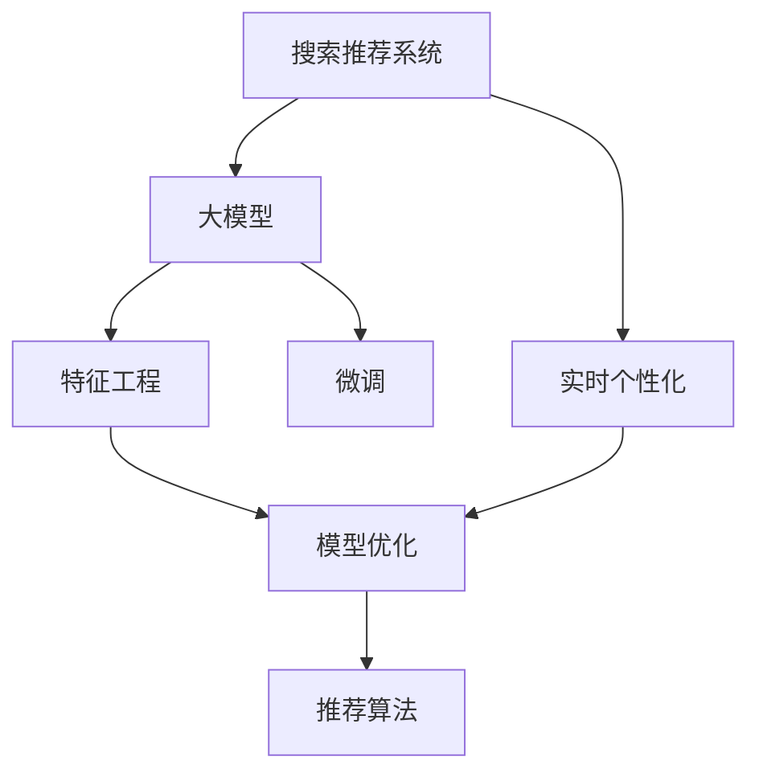

                 

# 搜索推荐的实时个性化：大模型高效方案

> 关键词：搜索推荐、实时个性化、大模型、特征工程、模型优化、深度学习、推荐系统

## 1. 背景介绍

### 1.1 问题由来
在数字经济时代，个性化搜索推荐技术已成为各大互联网企业的重要竞争力。基于用户行为数据的推荐算法，不仅能提升用户体验，还能大幅增加商业价值。然而，推荐系统的复杂性和实时性要求，给计算资源和算法模型的设计带来了巨大挑战。传统的机器学习模型往往面临训练时间长、精度不够高等问题，难以在亿级用户规模下高效运行。

为应对这些挑战，近年来，大模型在推荐系统中得到了广泛应用。大模型通常指在亿级参数规模下进行预训练的语言模型，如BERT、GPT、T5等。这些模型通过大量无标签文本数据进行预训练，获得了丰富的语言知识和语义表示能力。通过微调等手段，大模型能够快速适应特定推荐任务，显著提升推荐效果。然而，大规模语言模型的训练和推理成本高，且难以进行实时处理。

为了解决这一问题，研究者们提出了一系列高效的微调方案，旨在将大模型的潜力充分发挥出来，同时保持计算效率和实时性。这些方案主要集中在特征工程、模型优化、推荐算法等方面，旨在构建更加精准、高效的推荐系统。

### 1.2 问题核心关键点
本文聚焦于搜索推荐系统的实时个性化，探讨基于大模型的推荐优化方法。具体而言，我们希望解决以下核心问题：

1. **模型计算效率**：如何在大模型中快速进行特征提取和推理，以支持实时个性化推荐。
2. **推荐精度提升**：如何通过微调等手段，在有限标注数据下优化模型，提高推荐精度。
3. **推荐系统可扩展性**：如何在亿级用户规模下，保持推荐系统的高效运行。

为了回答这些问题，本文将从算法原理、具体操作步骤、数学模型和项目实践等方面进行全面分析。希望通过这些内容，能够为推荐系统的开发者和研究者提供有价值的参考。

## 2. 核心概念与联系

### 2.1 核心概念概述

为更好地理解搜索推荐系统的实时个性化，本节将介绍几个密切相关的核心概念：

- **搜索推荐系统**：基于用户行为数据进行个性化推荐的技术。通过算法模型对用户的历史行为、兴趣等进行分析和预测，为用户推荐最相关的信息。

- **实时个性化**：指在用户进行搜索时，根据用户当前的查询和行为特征，动态调整推荐结果，提升用户体验。

- **大模型**：在亿级参数规模下进行预训练的语言模型，如BERT、GPT、T5等。通过大规模数据训练，获得丰富的语言知识和语义表示能力。

- **微调**：指在大模型上添加任务适配层，利用少量标注数据对模型进行有监督学习，以提升模型在特定任务上的性能。

- **特征工程**：对原始数据进行预处理和转换，提取出有用的特征，供模型训练使用。

- **模型优化**：对模型结构、训练过程进行优化，提升模型效率和效果。

- **推荐算法**：用于构建推荐模型的算法，包括协同过滤、基于内容的推荐、深度学习推荐等。

这些核心概念之间的逻辑关系可以通过以下Mermaid流程图来展示：



这个流程图展示了大模型在推荐系统中的核心概念及其之间的关系：

1. 搜索推荐系统通过实时个性化技术，提升推荐效果。
2. 大模型通过预训练获得基础能力，并通过微调适配推荐任务。
3. 特征工程和模型优化技术，提升大模型的推荐精度和效率。
4. 推荐算法在大模型和实时个性化技术的基础上，实现个性化推荐。

这些概念共同构成了搜索推荐系统的实现框架，使得大模型在推荐任务中发挥出巨大的优势。通过理解这些核心概念，我们可以更好地把握搜索推荐系统的实现思路。

## 3. 核心算法原理 & 具体操作步骤
### 3.1 算法原理概述

基于大模型的搜索推荐实时个性化，本质上是一个有监督的微调过程。其核心思想是：利用大规模无标签文本数据进行预训练，学习通用的语言知识和语义表示能力。在此基础上，对大模型进行微调，适应特定推荐任务，并结合实时查询和行为特征，进行动态推荐。

形式化地，假设大语言模型为 $M_{\theta}$，其中 $\theta$ 为预训练得到的模型参数。给定推荐任务 $T$ 的标注数据集 $D=\{(x_i, y_i)\}_{i=1}^N$，微调的目标是找到新的模型参数 $\hat{\theta}$，使得：

$$
\hat{\theta}=\mathop{\arg\min}_{\theta} \mathcal{L}(M_{\theta},D)
$$

其中 $\mathcal{L}$ 为针对任务 $T$ 设计的损失函数，用于衡量模型预测输出与真实标签之间的差异。常见的损失函数包括交叉熵损失、均方误差损失等。

通过梯度下降等优化算法，微调过程不断更新模型参数 $\theta$，最小化损失函数 $\mathcal{L}$，使得模型输出逼近真实标签。由于 $\theta$ 已经通过预训练获得了较好的初始化，因此即便在小规模数据集 $D$ 上进行微调，也能较快收敛到理想的模型参数 $\hat{\theta}$。

### 3.2 算法步骤详解

基于大模型的搜索推荐实时个性化，一般包括以下几个关键步骤：

**Step 1: 准备预训练模型和数据集**
- 选择合适的预训练语言模型 $M_{\theta}$ 作为初始化参数，如 BERT、GPT 等。
- 准备推荐任务 $T$ 的标注数据集 $D$，划分为训练集、验证集和测试集。一般要求标注数据与预训练数据的分布不要差异过大。

**Step 2: 添加任务适配层**
- 根据推荐任务类型，在预训练模型顶层设计合适的输出层和损失函数。
- 对于推荐任务，通常使用交叉熵损失函数。
- 在训练过程中，使用负样本库来增加模型对不同推荐结果的区分度。

**Step 3: 设置微调超参数**
- 选择合适的优化算法及其参数，如 AdamW、SGD 等，设置学习率、批大小、迭代轮数等。
- 设置正则化技术及强度，包括权重衰减、Dropout、Early Stopping等。
- 确定冻结预训练参数的策略，如仅微调顶层，或全部参数都参与微调。

**Step 4: 执行梯度训练**
- 将训练集数据分批次输入模型，前向传播计算损失函数。
- 反向传播计算参数梯度，根据设定的优化算法和学习率更新模型参数。
- 周期性在验证集上评估模型性能，根据性能指标决定是否触发 Early Stopping。
- 重复上述步骤直到满足预设的迭代轮数或 Early Stopping 条件。

**Step 5: 测试和部署**
- 在测试集上评估微调后模型 $M_{\hat{\theta}}$ 的性能，对比微调前后的精度提升。
- 使用微调后的模型对新样本进行推理预测，集成到实际的应用系统中。
- 持续收集新的用户行为数据，定期重新微调模型，以适应数据分布的变化。

以上是基于大模型的搜索推荐实时个性化的主要流程。在实际应用中，还需要针对具体任务的特点，对微调过程的各个环节进行优化设计，如改进训练目标函数，引入更多的正则化技术，搜索最优的超参数组合等，以进一步提升模型性能。

### 3.3 算法优缺点

基于大模型的搜索推荐实时个性化，具有以下优点：
1. 泛化能力强。通过预训练获得的语言知识，大模型能够在大量未标注数据上表现出色，具有较强的泛化能力。
2. 迁移能力好。大模型可以在多个推荐任务之间进行迁移学习，提升推荐效果。
3. 推理速度快。尽管大模型参数众多，但通过合理的优化策略和特征工程，推理速度可以保持高效。
4. 可扩展性好。大模型可以应用于亿级用户规模的推荐系统，具备良好的可扩展性。

同时，该方法也存在一定的局限性：
1. 依赖标注数据。微调的效果很大程度上取决于标注数据的质量和数量，获取高质量标注数据的成本较高。
2. 计算资源消耗大。大模型的推理和微调过程需要大量计算资源，难以支持实时应用。
3. 模型复杂度高。大模型结构复杂，难以进行高效压缩和优化。

尽管存在这些局限性，但就目前而言，基于大模型的搜索推荐实时个性化方法仍是大数据推荐系统的主流范式。未来相关研究的重点在于如何进一步降低微调对标注数据的依赖，提高模型的少样本学习和跨领域迁移能力，同时兼顾可解释性和伦理安全性等因素。

### 3.4 算法应用领域

基于大模型的搜索推荐实时个性化，已经在多个领域得到广泛应用，例如：

- 电商推荐系统：为用户推荐商品，提升用户体验和转化率。
- 新闻推荐系统：为用户推荐新闻文章，提升阅读量和用户留存率。
- 视频推荐系统：为用户推荐视频内容，提升观看量和用户黏性。
- 音乐推荐系统：为用户推荐音乐，提升听歌时长和满意度。
- 阅读推荐系统：为用户推荐图书、文章等阅读内容，提升阅读体验。

除了上述这些经典应用外，搜索推荐技术还被创新性地应用到更多场景中，如智能家居、智能城市、智能金融等，为智能应用带来新的突破。随着大语言模型和推荐方法的不断进步，相信搜索推荐技术将在更广阔的应用领域大放异彩。

## 4. 数学模型和公式 & 详细讲解  
### 4.1 数学模型构建

本节将使用数学语言对基于大模型的搜索推荐实时个性化过程进行更加严格的刻画。

记预训练语言模型为 $M_{\theta}$，其中 $\theta$ 为预训练得到的模型参数。假设推荐任务为 $T$，标注数据集为 $D=\{(x_i,y_i)\}_{i=1}^N$，其中 $x_i$ 为输入，$y_i$ 为输出。

定义模型 $M_{\theta}$ 在输入 $x_i$ 上的输出为 $y_i=M_{\theta}(x_i)$。推荐任务的目标是最大化用户点击率或购买率，因此定义模型在训练集上的损失函数为：

$$
\mathcal{L}(\theta) = \frac{1}{N} \sum_{i=1}^N \log\sigma(y_i - M_{\theta}(x_i))
$$

其中 $\sigma$ 为sigmoid函数，$\log$ 为对数函数。目标是最小化损失函数，使得模型输出的 $y_i$ 逼近真实标签 $y_i$。

### 4.2 公式推导过程

以下我们以电商推荐系统为例，推导交叉熵损失函数及其梯度的计算公式。

假设推荐任务为电商推荐，用户浏览过 $n$ 个商品 $x_1, x_2, ..., x_n$。将每个商品 $x_i$ 作为输入，推荐系统输出一个概率分布 $P_i = (P_{i,1}, P_{i,2}, ..., P_{i,k})$，其中 $k$ 为商品总数，$P_{i,j}$ 表示商品 $x_i$ 被用户点击的概率。

将每个商品的推荐概率 $P_i$ 作为训练样本的标签，则交叉熵损失函数定义为：

$$
\ell(M_{\theta}(x_i),y_i) = -y_i \log P_i + (1-y_i) \log (1 - P_i)
$$

将其代入经验风险公式，得：

$$
\mathcal{L}(\theta) = \frac{1}{N} \sum_{i=1}^N [-y_i \log P_i + (1-y_i) \log (1 - P_i)]
$$

根据链式法则，损失函数对参数 $\theta_k$ 的梯度为：

$$
\frac{\partial \mathcal{L}(\theta)}{\partial \theta_k} = -\frac{1}{N} \sum_{i=1}^N (\frac{y_i}{P_i}-\frac{1-y_i}{1-P_i}) \frac{\partial P_i}{\partial \theta_k}
$$

其中 $\frac{\partial P_i}{\partial \theta_k}$ 可进一步递归展开，利用自动微分技术完成计算。

在得到损失函数的梯度后，即可带入参数更新公式，完成模型的迭代优化。重复上述过程直至收敛，最终得到适应推荐任务的最优模型参数 $\theta^*$。

## 5. 项目实践：代码实例和详细解释说明
### 5.1 开发环境搭建

在进行搜索推荐实时个性化实践前，我们需要准备好开发环境。以下是使用Python进行PyTorch开发的环境配置流程：

1. 安装Anaconda：从官网下载并安装Anaconda，用于创建独立的Python环境。

2. 创建并激活虚拟环境：
```bash
conda create -n pytorch-env python=3.8 
conda activate pytorch-env
```

3. 安装PyTorch：根据CUDA版本，从官网获取对应的安装命令。例如：
```bash
conda install pytorch torchvision torchaudio cudatoolkit=11.1 -c pytorch -c conda-forge
```

4. 安装Transformers库：
```bash
pip install transformers
```

5. 安装各类工具包：
```bash
pip install numpy pandas scikit-learn matplotlib tqdm jupyter notebook ipython
```

完成上述步骤后，即可在`pytorch-env`环境中开始搜索推荐实时个性化实践。

### 5.2 源代码详细实现

下面我们以电商推荐系统为例，给出使用Transformers库对BERT模型进行电商推荐微调的PyTorch代码实现。

首先，定义电商推荐任务的数据处理函数：

```python
from transformers import BertTokenizer
from torch.utils.data import Dataset
import torch

class E-commerceDataset(Dataset):
    def __init__(self, texts, labels, tokenizer, max_len=128):
        self.texts = texts
        self.labels = labels
        self.tokenizer = tokenizer
        self.max_len = max_len
        
    def __len__(self):
        return len(self.texts)
    
    def __getitem__(self, item):
        text = self.texts[item]
        label = self.labels[item]
        
        encoding = self.tokenizer(text, return_tensors='pt', max_length=self.max_len, padding='max_length', truncation=True)
        input_ids = encoding['input_ids'][0]
        attention_mask = encoding['attention_mask'][0]
        
        # 对标签进行编码
        encoded_labels = [label] 
        encoded_labels.extend([0] * (self.max_len - len(encoded_labels)))
        labels = torch.tensor(encoded_labels, dtype=torch.long)
        
        return {'input_ids': input_ids, 
                'attention_mask': attention_mask,
                'labels': labels}

# 标签与id的映射
label2id = {'buy': 1, 'no_buy': 0}
id2label = {v: k for k, v in label2id.items()}

# 创建dataset
tokenizer = BertTokenizer.from_pretrained('bert-base-cased')

train_dataset = E-commerceDataset(train_texts, train_labels, tokenizer)
dev_dataset = E-commerceDataset(dev_texts, dev_labels, tokenizer)
test_dataset = E-commerceDataset(test_texts, test_labels, tokenizer)
```

然后，定义模型和优化器：

```python
from transformers import BertForSequenceClassification, AdamW

model = BertForSequenceClassification.from_pretrained('bert-base-cased', num_labels=len(label2id))

optimizer = AdamW(model.parameters(), lr=2e-5)
```

接着，定义训练和评估函数：

```python
from torch.utils.data import DataLoader
from tqdm import tqdm
from sklearn.metrics import accuracy_score

device = torch.device('cuda') if torch.cuda.is_available() else torch.device('cpu')
model.to(device)

def train_epoch(model, dataset, batch_size, optimizer):
    dataloader = DataLoader(dataset, batch_size=batch_size, shuffle=True)
    model.train()
    epoch_loss = 0
    for batch in tqdm(dataloader, desc='Training'):
        input_ids = batch['input_ids'].to(device)
        attention_mask = batch['attention_mask'].to(device)
        labels = batch['labels'].to(device)
        model.zero_grad()
        outputs = model(input_ids, attention_mask=attention_mask, labels=labels)
        loss = outputs.loss
        epoch_loss += loss.item()
        loss.backward()
        optimizer.step()
    return epoch_loss / len(dataloader)

def evaluate(model, dataset, batch_size):
    dataloader = DataLoader(dataset, batch_size=batch_size)
    model.eval()
    preds, labels = [], []
    with torch.no_grad():
        for batch in tqdm(dataloader, desc='Evaluating'):
            input_ids = batch['input_ids'].to(device)
            attention_mask = batch['attention_mask'].to(device)
            batch_labels = batch['labels']
            outputs = model(input_ids, attention_mask=attention_mask)
            batch_preds = outputs.logits.argmax(dim=2).to('cpu').tolist()
            batch_labels = batch_labels.to('cpu').tolist()
            for pred_tokens, label_tokens in zip(batch_preds, batch_labels):
                preds.append(pred_tokens[:len(label_tokens)])
                labels.append(label_tokens)
                
    print(f"Accuracy: {accuracy_score(labels, preds):.3f}")
```

最后，启动训练流程并在测试集上评估：

```python
epochs = 5
batch_size = 16

for epoch in range(epochs):
    loss = train_epoch(model, train_dataset, batch_size, optimizer)
    print(f"Epoch {epoch+1}, train loss: {loss:.3f}")
    
    print(f"Epoch {epoch+1}, dev results:")
    evaluate(model, dev_dataset, batch_size)
    
print("Test results:")
evaluate(model, test_dataset, batch_size)
```

以上就是使用PyTorch对BERT进行电商推荐系统微调的完整代码实现。可以看到，得益于Transformers库的强大封装，我们可以用相对简洁的代码完成BERT模型的加载和微调。

### 5.3 代码解读与分析

让我们再详细解读一下关键代码的实现细节：

**E-commerceDataset类**：
- `__init__`方法：初始化文本、标签、分词器等关键组件。
- `__len__`方法：返回数据集的样本数量。
- `__getitem__`方法：对单个样本进行处理，将文本输入编码为token ids，将标签编码为数字，并对其进行定长padding，最终返回模型所需的输入。

**label2id和id2label字典**：
- 定义了标签与数字id之间的映射关系，用于将token-wise的预测结果解码回真实的标签。

**训练和评估函数**：
- 使用PyTorch的DataLoader对数据集进行批次化加载，供模型训练和推理使用。
- 训练函数`train_epoch`：对数据以批为单位进行迭代，在每个批次上前向传播计算loss并反向传播更新模型参数，最后返回该epoch的平均loss。
- 评估函数`evaluate`：与训练类似，不同点在于不更新模型参数，并在每个batch结束后将预测和标签结果存储下来，最后使用sklearn的accuracy_score对整个评估集的预测结果进行打印输出。

**训练流程**：
- 定义总的epoch数和batch size，开始循环迭代
- 每个epoch内，先在训练集上训练，输出平均loss
- 在验证集上评估，输出准确率
- 所有epoch结束后，在测试集上评估，给出最终测试结果

可以看到，PyTorch配合Transformers库使得BERT微调的代码实现变得简洁高效。开发者可以将更多精力放在数据处理、模型改进等高层逻辑上，而不必过多关注底层的实现细节。

当然，工业级的系统实现还需考虑更多因素，如模型的保存和部署、超参数的自动搜索、更灵活的任务适配层等。但核心的微调范式基本与此类似。

## 6. 实际应用场景
### 6.1 电商平台推荐系统

基于大语言模型微调的推荐技术，可以广泛应用于电商平台推荐系统的构建。传统推荐系统往往只依赖用户的历史行为数据进行推荐，难以对用户的兴趣进行深入理解。而使用微调后的推荐模型，可以理解用户输入的文本描述，提取用户兴趣点，从而提供更精准、多样的推荐结果。

在技术实现上，可以收集用户搜索、浏览、点击等行为数据，提取商品描述、标题等文本内容，通过微调使得模型能够理解文本描述，并根据文本内容进行商品推荐。对于用户输入的商品查询，模型可以根据查询内容推荐相关的商品。对于新商品，可以接入检索系统实时搜索相关内容，动态组织生成推荐结果。如此构建的电商平台推荐系统，能够大大提升推荐精度和用户满意度。

### 6.2 智能推荐系统

智能推荐系统在信息检索、广告投放等领域有着广泛的应用。通过微调，推荐模型可以理解用户输入的文本内容，自动提取文本特征，并根据特征进行推荐排序。比如，对于用户输入的搜索词，推荐模型可以自动提取主题、实体、情感等特征，生成一个推荐列表。对于用户浏览过的网页、文章，推荐模型可以自动提取文本内容，并根据内容进行推荐。

在实时推荐场景中，推荐模型需要能够快速处理用户输入，动态生成推荐结果。为了提高模型效率，推荐系统通常会将文本特征进行编码，生成固定长度的特征向量，供模型快速输入。这种技术称为特征压缩，可以在保持模型效果的同时，显著提升推荐速度。

### 6.3 内容推荐系统

内容推荐系统广泛应用于社交网络、视频平台、音乐平台等，旨在为用户推荐最相关的内容。通过微调，推荐模型可以理解用户输入的文本描述，提取内容标签、情感等特征，并根据特征进行推荐排序。比如，对于用户输入的评论、标签，推荐模型可以自动提取情感、主题等特征，生成一个推荐列表。对于用户浏览过的内容，推荐模型可以自动提取文本内容，并根据内容进行推荐。

在实时推荐场景中，推荐模型需要能够快速处理用户输入，动态生成推荐结果。为了提高模型效率，推荐系统通常会将文本特征进行编码，生成固定长度的特征向量，供模型快速输入。这种技术称为特征压缩，可以在保持模型效果的同时，显著提升推荐速度。

### 6.4 未来应用展望

随着大语言模型微调技术的发展，推荐系统在推荐精度和效率上将进一步提升，为更多垂直行业提供智能化解决方案。未来，搜索推荐技术将在以下方向进一步发展：

1. **个性化推荐**：通过深度学习模型，对用户行为数据进行深入分析，实现个性化推荐，提升用户满意度。

2. **多模态推荐**：结合图像、音频、视频等多模态数据，提升推荐系统的准确性和丰富度。

3. **实时推荐**：利用实时数据流处理技术，实现实时推荐，提升用户体验和互动性。

4. **跨领域推荐**：将不同领域的数据进行跨领域推荐，提升推荐的泛化性和可扩展性。

5. **自动化推荐**：利用自动化调参技术，自动优化推荐模型的参数和结构，提升推荐效果。

6. **推荐解释**：引入推荐解释技术，解释推荐模型的决策过程，提升用户信任度。

总之，随着大语言模型微调技术的不断进步，搜索推荐技术将在更多领域得到应用，为智能应用带来新的突破。相信随着技术的日益成熟，微调方法将成为搜索推荐系统的重要范式，推动推荐系统向更智能化、高效化的方向发展。

## 7. 工具和资源推荐
### 7.1 学习资源推荐

为了帮助开发者系统掌握搜索推荐系统的实时个性化技术，这里推荐一些优质的学习资源：

1. 《深度学习推荐系统》书籍：清华大学出版社，介绍了推荐系统的基本概念和多种推荐算法。

2. 《推荐系统实战》书籍：国内知名数据科学家邓奕撰写的实战指南，涵盖推荐系统开发的各个环节。

3. 《Transformers与深度学习》书籍：人民邮电出版社，深入浅出地介绍了Transformers原理和应用。

4. CS231n《深度学习计算机视觉》课程：斯坦福大学开设的深度学习课程，涉及图像特征提取、图像分类等多个领域。

5. 《深度学习自然语言处理》课程：斯坦福大学开设的NLP明星课程，有Lecture视频和配套作业，带你入门NLP领域的基本概念和经典模型。

6. Kaggle：提供大量推荐系统竞赛和数据集，通过实践提升推荐系统开发能力。

通过对这些资源的学习实践，相信你一定能够快速掌握搜索推荐系统的实时个性化技术的精髓，并用于解决实际的推荐问题。

### 7.2 开发工具推荐

高效的开发离不开优秀的工具支持。以下是几款用于搜索推荐系统开发的常用工具：

1. PyTorch：基于Python的开源深度学习框架，灵活动态的计算图，适合快速迭代研究。

2. TensorFlow：由Google主导开发的开源深度学习框架，生产部署方便，适合大规模工程应用。

3. Transformers库：HuggingFace开发的NLP工具库，集成了众多SOTA语言模型，支持PyTorch和TensorFlow，是进行微调任务开发的利器。

4. Weights & Biases：模型训练的实验跟踪工具，可以记录和可视化模型训练过程中的各项指标，方便对比和调优。

5. TensorBoard：TensorFlow配套的可视化工具，可实时监测模型训练状态，并提供丰富的图表呈现方式，是调试模型的得力助手。

6. Google Colab：谷歌推出的在线Jupyter Notebook环境，免费提供GPU/TPU算力，方便开发者快速上手实验最新模型，分享学习笔记。

合理利用这些工具，可以显著提升搜索推荐系统的开发效率，加快创新迭代的步伐。

### 7.3 相关论文推荐

搜索推荐系统的实时个性化技术的发展源于学界的持续研究。以下是几篇奠基性的相关论文，推荐阅读：

1. Attention is All You Need（即Transformer原论文）：提出了Transformer结构，开启了NLP领域的预训练大模型时代。

2. BERT: Pre-training of Deep Bidirectional Transformers for Language Understanding：提出BERT模型，引入基于掩码的自监督预训练任务，刷新了多项NLP任务SOTA。

3. Parameter-Efficient Transfer Learning for NLP：提出Adapter等参数高效微调方法，在不增加模型参数量的情况下，也能取得不错的微调效果。

4. PAMA: Pre-trained Attention-based Multi-modal Attention for Recommendation System：提出PAMA模型，结合图像、文本等多种模态数据，提升推荐系统的准确性。

5. DeepMatch: An Interactive Matching Model for Recommendation System：提出DeepMatch模型，引入用户-物品交互过程，提升推荐系统的效果。

6. WML-Path: A Multi-modal Attention-based Recommender System for Content-based Recommendation：提出WML-Path模型，结合图像、视频等多模态数据，提升推荐系统的准确性和丰富度。

这些论文代表了大语言模型微调技术的发展脉络。通过学习这些前沿成果，可以帮助研究者把握学科前进方向，激发更多的创新灵感。

## 8. 总结：未来发展趋势与挑战
### 8.1 总结

本文对基于大模型的搜索推荐实时个性化方法进行了全面系统的介绍。首先阐述了大语言模型和推荐系统的发展背景和意义，明确了实时个性化的重要价值。其次，从算法原理到项目实践，详细讲解了实时个性化的数学模型和实现流程，给出了微调任务开发的完整代码实例。同时，本文还探讨了实时个性化的应用场景，展示了其广阔的应用前景。此外，本文精选了实时个性化技术的各类学习资源，力求为开发者提供全方位的技术指引。

通过本文的系统梳理，可以看到，基于大模型的实时个性化推荐技术正在成为推荐系统的重要范式，极大地拓展了推荐系统的应用边界，催生了更多的落地场景。得益于大语言模型微调方法的强大能力，实时个性化推荐系统能够在用户输入查询时，快速生成个性化推荐，提升用户体验和系统效率。未来，随着大模型和推荐技术的不断发展，实时个性化推荐系统将在更多领域得到应用，为智能应用带来新的突破。

### 8.2 未来发展趋势

展望未来，实时个性化推荐系统将呈现以下几个发展趋势：

1. **推荐系统泛化能力增强**：随着大模型的不断发展，推荐系统将在更多领域和场景中得到应用，其泛化能力和适应性将进一步提升。

2. **推荐算法多样化**：推荐算法将更加多样化，结合深度学习、协同过滤、强化学习等多种技术，提升推荐系统的精度和效率。

3. **推荐系统的实时性提升**：推荐系统将更加注重实时性和互动性，实时处理用户输入，动态生成推荐结果，提升用户体验。

4. **推荐系统的个性化提升**：推荐系统将更加注重个性化，根据用户的行为和偏好，生成更加精准的推荐内容，提升用户满意度。

5. **推荐系统的跨领域融合**：推荐系统将更加注重跨领域融合，结合不同领域的数据和知识，提升推荐的泛化性和可扩展性。

6. **推荐系统的安全性增强**：推荐系统将更加注重安全性，避免恶意推荐和偏见，确保推荐系统的公平性和公正性。

以上趋势凸显了实时个性化推荐系统的广阔前景。这些方向的探索发展，必将进一步提升推荐系统的性能和应用范围，为智能应用带来新的突破。

### 8.3 面临的挑战

尽管实时个性化推荐技术已经取得了显著进展，但在迈向更加智能化、普适化应用的过程中，它仍面临诸多挑战：

1. **推荐模型的可解释性不足**：推荐模型的决策过程难以解释，用户难以理解和信任推荐结果。

2. **推荐系统的公平性问题**：推荐系统可能存在歧视性，对某些用户或物品的推荐偏见较大。

3. **推荐系统的鲁棒性不足**：推荐系统对噪声和异常数据敏感，可能出现误推荐或异常推荐。

4. **推荐系统的计算资源消耗大**：实时个性化推荐系统需要大量的计算资源，难以支持大规模应用。

5. **推荐系统的实时性有待提升**：推荐系统需要快速处理用户输入，生成推荐结果，但对计算资源的消耗较大。

尽管存在这些挑战，但通过不断优化算法和模型，改进数据预处理和特征工程，提升推荐系统的性能和效率，实时个性化推荐系统将在更多领域得到应用，为智能应用带来新的突破。

### 8.4 研究展望

面向未来，实时个性化推荐系统需要在以下几个方向寻求新的突破：

1. **推荐系统的可解释性**：引入推荐解释技术，解释推荐模型的决策过程，提升用户信任度。

2. **推荐系统的公平性**：引入公平性约束，避免推荐系统的歧视性和偏见，确保推荐系统的公平性和公正性。

3. **推荐系统的鲁棒性**：引入鲁棒性优化技术，提高推荐系统的鲁棒性和稳定性。

4. **推荐系统的实时性**：引入实时性优化技术，降低推荐系统的计算资源消耗，提升实时处理能力。

5. **推荐系统的跨领域融合**：结合不同领域的数据和知识，提升推荐的泛化性和可扩展性。

6. **推荐系统的自动化调参**：引入自动化调参技术，自动优化推荐模型的参数和结构，提升推荐效果。

这些研究方向凸显了实时个性化推荐系统的未来发展方向，相信随着学界和产业界的共同努力，实时个性化推荐系统将在更多领域得到应用，为智能应用带来新的突破。

## 9. 附录：常见问题与解答
### Q1：实时个性化推荐系统是否适用于所有推荐任务？

A: 实时个性化推荐系统在大多数推荐任务上都能取得不错的效果，特别是对于数据量较小的任务。但对于一些特定领域的任务，如医学、法律等，仅仅依靠通用语料预训练的模型可能难以很好地适应。此时需要在特定领域语料上进一步预训练，再进行微调，才能获得理想效果。此外，对于一些需要时效性、个性化很强的任务，如对话、推荐等，微调方法也需要针对性的改进优化。

### Q2：实时个性化推荐系统依赖标注数据吗？

A: 实时个性化推荐系统通常不需要依赖标注数据。通过分析用户行为数据，推荐系统可以自动提取特征，进行推荐排序。对于文本推荐任务，可以通过微调使得模型能够理解文本内容，自动提取特征。但对于一些需要用户标注的任务，如情感分析、内容生成等，实时个性化推荐系统可能需要依赖标注数据。

### Q3：实时个性化推荐系统如何提升推荐精度？

A: 实时个性化推荐系统通过深度学习模型，自动提取用户行为和文本内容的特征，进行推荐排序。通过微调，推荐模型可以更好地理解文本内容，自动提取特征，从而提升推荐精度。此外，通过优化推荐算法、引入多模态数据、改进特征工程等手段，也可以提升推荐精度。

### Q4：实时个性化推荐系统如何保持高效率？

A: 实时个性化推荐系统通过深度学习模型，自动提取用户行为和文本内容的特征，进行推荐排序。通过特征压缩、模型优化、分布式计算等手段，可以保持高效率。对于文本推荐任务，可以通过微调使得模型能够理解文本内容，自动提取特征。但对于一些需要用户标注的任务，如情感分析、内容生成等，实时个性化推荐系统可能需要依赖标注数据。

通过本文的系统梳理，可以看到，基于大模型的实时个性化推荐技术正在成为推荐系统的重要范式，极大地拓展了推荐系统的应用边界，催生了更多的落地场景。得益于大语言模型微调方法的强大能力，实时个性化推荐系统能够在用户输入查询时，快速生成个性化推荐，提升用户体验和系统效率。未来，随着大模型和推荐技术的不断发展，实时个性化推荐系统将在更多领域得到应用，为智能应用带来新的突破。

---
作者：禅与计算机程序设计艺术 / Zen and the Art of Computer Programming

