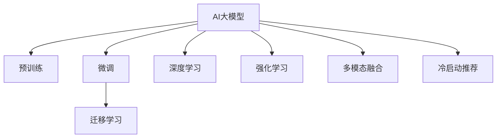

                 

# 搜索推荐系统的AI 大模型应用：提高电商平台的转化率、用户体验与盈利能力

## 1. 背景介绍

### 1.1 问题由来
随着电商平台的发展，用户触达数量和交易额的迅速增长，如何提高用户体验、增强用户粘性、优化运营效率和提升转化率成为了各大电商公司关注的焦点。搜索引擎推荐系统作为电商平台的核心模块，直接关系着用户搜索体验和转化率。传统的搜索推荐系统基于规则和统计模型，存在计算复杂度高、模型效果欠佳等问题。

与此同时，AI大模型的技术突破带来了新的契机。深度学习技术已经在图像、语音、自然语言处理等领域取得显著成果。在搜索推荐系统领域，AI大模型的应用同样具有巨大潜力。AI大模型凭借其强大的数据建模能力，在用户行为预测、个性化推荐、广告优化等方面提供了有力支持，从而推动了电商平台的创新发展。

### 1.2 问题核心关键点
AI大模型在搜索推荐系统中的应用，核心关键点包括：
1. 大规模预训练模型：通过大规模无标签数据进行预训练，学习通用知识，构建强大的语言模型。
2. 微调与迁移学习：在大模型基础上进行微调或迁移学习，适应特定的电商搜索场景。
3. 深度学习与强化学习：利用深度学习进行行为预测与特征提取，利用强化学习进行推荐策略优化。
4. 用户行为理解：通过用户点击、浏览、购买等行为数据，学习用户偏好和兴趣。
5. 多模态信息融合：将图像、视频、文本等多种信息进行融合，提升推荐效果。
6. 冷启动问题：通过多维数据源和先验知识，解决新用户和冷启动推荐问题。
7. 鲁棒性与泛化能力：在大规模数据上进行微调，增强模型鲁棒性与泛化能力。

## 2. 核心概念与联系

### 2.1 核心概念概述

为更好地理解AI大模型在搜索推荐系统中的应用，本节将介绍几个密切相关的核心概念：

- AI大模型：基于大规模无标签数据进行预训练，学习通用知识，适用于多种任务的大规模深度学习模型。
- 预训练与微调：在大规模无标签数据上进行预训练，在特定任务上利用少量标注数据进行微调，优化模型性能。
- 迁移学习：将一个领域学习到的知识迁移到另一个领域，提高模型在新领域的表现。
- 深度学习：通过神经网络模型对数据进行复杂映射，提取特征，建立模型。
- 强化学习：通过与环境的交互，不断优化行为策略，提升模型性能。
- 多模态融合：将不同类型数据源进行融合，提升模型对真实世界的理解能力。
- 冷启动推荐：针对新用户和冷启动推荐场景，利用先验知识进行推荐。

这些核心概念之间的逻辑关系可以通过以下Mermaid流程图来展示：



这个流程图展示了大模型在搜索推荐系统中的关键技术流程：

1. 大模型通过预训练获得通用知识。
2. 微调和迁移学习对特定任务进行适配。
3. 深度学习进行行为预测与特征提取。
4. 强化学习优化推荐策略。
5. 多模态融合提升推荐效果。
6. 冷启动推荐利用先验知识解决新用户问题。

这些核心概念共同构成了搜索推荐系统的技术基础，使得AI大模型能够广泛应用于电商平台的个性化推荐、广告优化和搜索排序等环节，提升用户体验和平台盈利能力。

## 3. 核心算法原理 & 具体操作步骤
### 3.1 算法原理概述

AI大模型在搜索推荐系统中的应用，其核心算法原理基于深度学习与强化学习，具体包括以下几个方面：

- **预训练大模型**：在大规模无标签数据上预训练，学习通用的语言、图像等知识表示。
- **微调**：在特定任务上进行微调，优化模型在该任务上的性能。
- **迁移学习**：将预训练模型应用于新任务，减少标注数据需求，提高模型泛化能力。
- **深度学习**：通过神经网络模型提取特征，预测用户行为。
- **强化学习**：利用与环境的交互，不断优化推荐策略，提升模型效果。

这些算法原理的结合，使得AI大模型能够充分利用大规模数据，提高推荐系统的精准性和个性化程度。

### 3.2 算法步骤详解

基于AI大模型的搜索推荐系统通常包含以下几个关键步骤：

**Step 1: 准备数据与模型**
- 收集电商平台的点击、浏览、购买等行为数据，构建训练集和验证集。
- 选择预训练大模型，如BERT、GPT-2等，作为初始化参数。

**Step 2: 添加任务适配层**
- 设计适合电商搜索推荐场景的任务适配层，如添加点击率预测输出层、广告点击率预测输出层等。
- 设计合适的损失函数，如交叉熵损失、负对数似然损失等。

**Step 3: 设置微调超参数**
- 选择合适的优化算法及其参数，如AdamW、SGD等，设置学习率、批大小、迭代轮数等。
- 设置正则化技术及强度，包括权重衰减、Dropout、Early Stopping等。
- 确定冻结预训练参数的策略，如仅微调顶层，或全部参数都参与微调。

**Step 4: 执行梯度训练**
- 将训练集数据分批次输入模型，前向传播计算损失函数。
- 反向传播计算参数梯度，根据设定的优化算法和学习率更新模型参数。
- 周期性在验证集上评估模型性能，根据性能指标决定是否触发Early Stopping。
- 重复上述步骤直到满足预设的迭代轮数或Early Stopping条件。

**Step 5: 测试和部署**
- 在测试集上评估微调后模型的性能，对比微调前后的精度提升。
- 使用微调后的模型进行推荐系统上线部署，实时进行行为预测与推荐。
- 持续收集新的数据，定期重新微调模型，以适应数据分布的变化。

### 3.3 算法优缺点

AI大模型在搜索推荐系统中的应用，具有以下优点：
1. 高效学习：利用大规模数据预训练，学习通用知识，适用于多种任务。
2. 个性化推荐：通过用户行为预测，提供个性化推荐，提升用户体验。
3. 优化广告效果：利用深度学习与强化学习，优化广告投放策略，提升广告转化率。
4. 鲁棒性高：在预训练阶段学习知识表示，具有较强的泛化能力。

同时，该方法也存在一些局限性：
1. 对数据质量依赖高：模型效果很大程度上取决于数据质量和标注数据的数量。
2. 计算成本高：大规模模型训练和推理计算量大，对算力有较高要求。
3. 过拟合风险：在大规模数据上微调，容易引入噪声，导致过拟合。
4. 冷启动问题：新用户和冷启动推荐效果较差。

尽管存在这些局限性，但就目前而言，基于AI大模型的搜索推荐系统仍是大数据时代的必然选择。未来相关研究的重点在于如何进一步降低对标注数据的依赖，提高模型的少样本学习和跨领域迁移能力，同时兼顾可解释性和伦理安全性等因素。

### 3.4 算法应用领域

AI大模型在搜索推荐系统中的应用，在电商平台的各个环节都得到了广泛应用，例如：

- **搜索排序**：通过用户查询行为预测，优化搜索结果排序，提高用户满意度。
- **个性化推荐**：根据用户行为预测，提供个性化商品推荐，提升转化率。
- **广告优化**：利用深度学习与强化学习，优化广告投放策略，提升广告转化率。
- **品牌广告推荐**：基于用户兴趣和行为预测，推荐品牌广告，提高品牌曝光度。
- **商品关联推荐**：根据用户购买行为，推荐相关商品，提高交叉销售率。
- **购物车推荐**：根据用户浏览行为，推荐购物车商品，提升购物体验。

除了上述这些经典任务外，AI大模型在电商平台的创新应用也在不断涌现，如可控商品生成、意图识别、情感分析等，为电商平台带来了全新的突破。

## 4. 数学模型和公式 & 详细讲解  
### 4.1 数学模型构建

基于AI大模型的搜索推荐系统，其数学模型构建主要包含以下步骤：

1. **预训练模型选择**：选择适合电商搜索推荐场景的预训练大模型，如BERT、GPT-2等。
2. **任务适配层设计**：设计适合电商推荐场景的任务适配层，如点击率预测输出层、广告点击率预测输出层等。
3. **损失函数选择**：选择合适的损失函数，如交叉熵损失、负对数似然损失等。

### 4.2 公式推导过程

以点击率预测为例，假设有 $N$ 个用户样本，每个用户有 $D$ 个特征 $x_i=(x_{i1},x_{i2},...,x_{id})$，模型的输出为 $y_i$，点击率为 $c_i$。点击率预测的目标是最大化预测点击率与真实点击率之间的相似度，即：

$$
\max_{\theta} \sum_{i=1}^N \log p(y_i; \theta) \log c_i
$$

其中 $p(y_i; \theta)$ 为模型的点击率预测概率。

假设使用二分类任务，模型的预测概率为 $p(y_i; \theta) = \sigma(\langle x_i; \theta \rangle)$，其中 $\langle \cdot; \cdot \rangle$ 为点积运算，$\sigma$ 为sigmoid函数。则上述目标函数可以表示为：

$$
\max_{\theta} \sum_{i=1}^N \log \sigma(\langle x_i; \theta \rangle) \log c_i
$$

通过反向传播算法，可以计算出参数 $\theta$ 的梯度，并更新模型参数。

### 4.3 案例分析与讲解

以电商平台的个性化推荐系统为例，介绍如何使用AI大模型进行推荐预测。假设用户 $u$ 点击了商品 $i$，记为 $c_{ui}=1$，未点击为 $0$。模型的输入为商品 $i$ 的特征向量 $x_i$，模型的输出为商品 $i$ 的点击率 $p_{ui}$。假设使用二分类任务，模型的预测概率为 $p_{ui} = \sigma(\langle x_i; \theta \rangle)$，其中 $\langle \cdot; \cdot \rangle$ 为点积运算，$\sigma$ 为sigmoid函数。

假设模型已经在大规模用户点击数据上进行预训练，学习到了用户和商品的特征表示。在进行微调时，将用户 $u$ 的点击行为 $c_{ui}$ 作为监督信号，更新模型参数 $\theta$，使得模型能够更准确地预测用户 $u$ 对商品 $i$ 的点击率。具体实现步骤如下：

1. **模型初始化**：选择预训练模型，如BERT、GPT-2等，作为初始化参数。
2. **任务适配层设计**：设计适合电商推荐场景的任务适配层，如点击率预测输出层、广告点击率预测输出层等。
3. **损失函数选择**：选择合适的损失函数，如交叉熵损失、负对数似然损失等。
4. **模型训练**：将用户 $u$ 的点击行为 $c_{ui}$ 作为监督信号，利用梯度下降等优化算法，更新模型参数 $\theta$，使得模型能够更准确地预测用户 $u$ 对商品 $i$ 的点击率。

## 5. 项目实践：代码实例和详细解释说明
### 5.1 开发环境搭建

在进行搜索推荐系统开发前，我们需要准备好开发环境。以下是使用Python进行TensorFlow开发的环境配置流程：

1. 安装Anaconda：从官网下载并安装Anaconda，用于创建独立的Python环境。

2. 创建并激活虚拟环境：
```bash
conda create -n tf-env python=3.8 
conda activate tf-env
```

3. 安装TensorFlow：根据CUDA版本，从官网获取对应的安装命令。例如：
```bash
conda install tensorflow-gpu=2.5.0 -c tf -c conda-forge
```

4. 安装相关库：
```bash
pip install numpy pandas scikit-learn matplotlib tensorflow-io tqdm jupyter notebook ipython
```

完成上述步骤后，即可在`tf-env`环境中开始搜索推荐系统的开发。

### 5.2 源代码详细实现

下面我们以点击率预测任务为例，给出使用TensorFlow进行搜索推荐系统开发的PyTorch代码实现。

首先，定义训练数据和标签：

```python
import numpy as np
import pandas as pd
from tensorflow.keras.layers import Input, Dense
from tensorflow.keras.models import Model

# 读取数据
data = pd.read_csv('train.csv')

# 分割训练集和验证集
train_data = data[:8000]
valid_data = data[8000:]

# 特征工程
train_features = train_data[['feat1', 'feat2', 'feat3']]
valid_features = valid_data[['feat1', 'feat2', 'feat3']]

# 点击率标签
train_labels = train_data['label']
valid_labels = valid_data['label']
```

然后，定义模型和损失函数：

```python
# 定义输入层
input_layer = Input(shape=(3,))

# 定义隐藏层
hidden_layer = Dense(64, activation='relu')(input_layer)

# 定义输出层
output_layer = Dense(1, activation='sigmoid')(hidden_layer)

# 定义模型
model = Model(inputs=input_layer, outputs=output_layer)

# 定义损失函数
loss_fn = tf.keras.losses.BinaryCrossentropy()

# 编译模型
model.compile(optimizer='adam', loss=loss_fn, metrics=['accuracy'])
```

接着，定义训练函数和评估函数：

```python
# 训练函数
def train_model(model, train_data, train_labels, valid_data, valid_labels, epochs=10, batch_size=32):
    model.fit(train_data, train_labels, epochs=epochs, batch_size=batch_size, validation_data=(valid_data, valid_labels))

# 评估函数
def evaluate_model(model, test_data, test_labels, batch_size=32):
    test_loss, test_acc = model.evaluate(test_data, test_labels, batch_size=batch_size)
    return test_loss, test_acc
```

最后，启动训练流程并在验证集上评估：

```python
# 训练模型
train_model(model, train_features, train_labels, valid_features, valid_labels)

# 在验证集上评估模型
test_loss, test_acc = evaluate_model(model, valid_features, valid_labels)
print(f'验证集损失: {test_loss:.4f}, 验证集准确率: {test_acc:.4f}')
```

以上就是使用TensorFlow进行搜索推荐系统开发的完整代码实现。可以看到，TensorFlow提供了丰富的Keras API，使得模型搭建、训练和评估过程变得简单易懂。

### 5.3 代码解读与分析

让我们再详细解读一下关键代码的实现细节：

**train_model函数**：
- 通过Keras API定义模型结构，包括输入层、隐藏层和输出层。
- 编译模型，设置优化器为Adam，损失函数为二分类交叉熵。
- 调用`fit`方法进行模型训练，设置训练轮数和批大小。

**evaluate_model函数**：
- 调用`evaluate`方法对模型在测试集上进行评估，返回损失和准确率。

**训练流程**：
- 首先定义训练集和验证集的数据和标签。
- 接着调用`train_model`函数进行模型训练，设置训练轮数和批大小。
- 最后调用`evaluate_model`函数在验证集上评估模型，输出验证集损失和准确率。

可以看出，TensorFlow的Keras API极大地简化了模型搭建和训练过程，使得开发者能够快速上手进行搜索推荐系统的开发。

当然，实际的电商推荐系统可能包含更多复杂环节，如用户行为表示、推荐算法优化等。但核心的搜索推荐逻辑与上述示例类似，需要根据具体业务场景进行调整。

## 6. 实际应用场景
### 6.1 智能搜索推荐

基于AI大模型的搜索推荐系统，在电商平台的智能搜索推荐中得到了广泛应用。传统的搜索推荐系统通常依赖于统计模型和规则，难以捕捉用户真正的搜索意图。而利用AI大模型的强大语言理解能力，可以更精准地解析用户查询，从而提供更加智能、个性化的搜索结果。

例如，当用户输入“T恤”，AI大模型可以理解“T恤”的多种含义（品牌、材质、风格等），提供更广泛的搜索结果，满足用户多方面的需求。同时，AI大模型还可以结合用户历史行为，推荐与用户兴趣相关的商品，提高点击率。

### 6.2 精准广告投放

广告投放是电商平台的另一重要环节。传统的广告投放通常依赖人工经验和规则，难以精准匹配用户需求。而利用AI大模型，可以更精准地预测用户行为，优化广告投放策略，提升广告转化率。

例如，通过收集用户点击、浏览、购买等行为数据，AI大模型可以学习到用户对不同商品、广告的兴趣，预测用户是否会点击某个广告。基于这些预测结果，平台可以调整广告投放策略，优化广告预算分配，实现更高的广告转化率。

### 6.3 个性化商品推荐

个性化推荐是电商平台的核心功能之一。传统的推荐系统通常依赖用户历史行为和商品属性进行推荐，难以捕捉用户的个性化需求。而利用AI大模型，可以通过用户行为预测，提供更加个性化、多样化的推荐，提升用户体验。

例如，当用户购买了一件衣服，AI大模型可以理解该衣服的设计风格、品牌等信息，推荐相关的商品。同时，AI大模型还可以结合用户偏好、商品属性等信息，生成更具创意的推荐商品，提升用户满意度。

### 6.4 未来应用展望

随着AI大模型的不断发展，搜索推荐系统在电商平台的创新应用也将不断涌现，为电商平台带来更多的机遇与挑战：

1. 多模态融合：结合图像、视频、文本等多种数据源，提升推荐效果。
2. 用户画像构建：通过多维数据源和先验知识，构建更加全面、准确的用户画像，提升推荐精准度。
3. 动态推荐算法：利用强化学习算法，动态调整推荐策略，提升推荐效果。
4. 跨平台推荐：构建跨平台的用户画像，实现跨平台的推荐效果。
5. 实时推荐：通过实时数据流处理技术，实现实时推荐，提高用户满意度。
6. 推荐系统优化：结合A/B测试等手段，优化推荐算法，提升推荐效果。

以上趋势凸显了AI大模型在搜索推荐系统中的巨大潜力。这些方向的探索发展，将进一步提升电商平台的用户体验和转化率，推动电商行业的持续创新。

## 7. 工具和资源推荐
### 7.1 学习资源推荐

为了帮助开发者系统掌握搜索推荐系统的AI大模型应用，这里推荐一些优质的学习资源：

1. **《深度学习》课程**：斯坦福大学开设的深度学习经典课程，系统介绍了深度学习的原理和应用。
2. **《TensorFlow实战》书籍**：TensorFlow官方书籍，详细介绍了TensorFlow的使用方法和应用案例。
3. **Kaggle竞赛**：Kaggle平台上有大量搜索推荐系统竞赛，可以实践和展示AI大模型的应用效果。
4. **NIPS论文**：搜索推荐系统领域的前沿论文，可以了解最新的研究成果和应用方向。
5. **Google Colab**：谷歌提供的在线Jupyter Notebook环境，可以免费进行模型训练和调试。

通过对这些资源的学习实践，相信你一定能够快速掌握搜索推荐系统的AI大模型应用，并用于解决实际的电商问题。

### 7.2 开发工具推荐

高效的开发离不开优秀的工具支持。以下是几款用于搜索推荐系统开发的常用工具：

1. **TensorFlow**：Google主导的开源深度学习框架，支持分布式训练，适用于大规模模型训练。
2. **Keras**：TensorFlow的高级API，使得模型搭建和训练过程变得简单易懂。
3. **Scikit-learn**：经典的Python机器学习库，提供了多种常用的机器学习算法和工具。
4. **Jupyter Notebook**：基于Web的交互式编程环境，可以方便地进行代码调试和展示。
5. **TensorBoard**：TensorFlow的可视化工具，可以实时监测模型训练状态，并提供丰富的图表呈现方式。

合理利用这些工具，可以显著提升搜索推荐系统的开发效率，加快创新迭代的步伐。

### 7.3 相关论文推荐

搜索推荐系统领域的研究成果丰富，以下是几篇具有代表性的相关论文，推荐阅读：

1. **《点击率预测的深度学习模型》**：介绍深度学习在点击率预测中的应用，包括多层感知机、卷积神经网络等。
2. **《个性化推荐系统的最新进展》**：综述了个性化推荐系统的最新进展，介绍了基于协同过滤、基于内容推荐、混合推荐等多种推荐算法。
3. **《强化学习在推荐系统中的应用》**：介绍强化学习在推荐系统中的应用，包括基于Q-learning、SARSA等算法。
4. **《搜索排序的深度学习模型》**：介绍深度学习在搜索排序中的应用，包括CTR模型、DeepFM等。

这些论文代表了大模型在搜索推荐系统领域的发展脉络。通过学习这些前沿成果，可以帮助研究者把握学科前进方向，激发更多的创新灵感。

## 8. 总结：未来发展趋势与挑战

### 8.1 总结

本文对基于AI大模型的搜索推荐系统进行了全面系统的介绍。首先阐述了搜索推荐系统在大规模数据时代的重要性，明确了大模型在提高电商平台转化率、用户体验与盈利能力方面的独特价值。其次，从原理到实践，详细讲解了大模型的核心算法原理和微调方法，给出了搜索推荐系统开发的完整代码实例。同时，本文还广泛探讨了AI大模型在电商平台的多个应用场景，展示了其巨大的潜力。

通过本文的系统梳理，可以看到，基于AI大模型的搜索推荐系统正在成为电商平台的创新引擎，极大地提升了电商平台的运营效率和用户体验。未来，伴随预训练语言模型和微调方法的持续演进，相信AI大模型将会在更广泛的领域得到应用，推动人工智能技术在各行业的持续创新。

### 8.2 未来发展趋势

展望未来，搜索推荐系统中的AI大模型应用将呈现以下几个发展趋势：

1. **多模态融合**：结合图像、视频、文本等多种数据源，提升推荐效果。
2. **个性化推荐**：利用多维数据源和先验知识，构建更加全面、准确的用户画像，提升推荐精准度。
3. **动态推荐算法**：利用强化学习算法，动态调整推荐策略，提升推荐效果。
4. **实时推荐**：通过实时数据流处理技术，实现实时推荐，提高用户满意度。
5. **推荐系统优化**：结合A/B测试等手段，优化推荐算法，提升推荐效果。
6. **跨平台推荐**：构建跨平台的用户画像，实现跨平台的推荐效果。

以上趋势凸显了AI大模型在搜索推荐系统中的巨大潜力。这些方向的探索发展，将进一步提升电商平台的运营效率和用户体验，推动电商行业的持续创新。

### 8.3 面临的挑战

尽管AI大模型在搜索推荐系统中已经取得了显著成果，但在迈向更加智能化、普适化应用的过程中，仍然面临诸多挑战：

1. **数据质量瓶颈**：推荐系统的性能很大程度上取决于数据质量和标注数据的数量，获取高质量标注数据的成本较高。
2. **模型鲁棒性不足**：AI大模型面对域外数据时，泛化性能往往大打折扣，难以应对数据分布的变化。
3. **计算成本高**：大规模模型训练和推理计算量大，对算力有较高要求，难以支持实时推荐。
4. **冷启动问题**：新用户和冷启动推荐效果较差，难以解决新用户推荐难题。
5. **可解释性不足**：AI大模型通常缺乏可解释性，难以对其决策过程进行分析和调试。
6. **安全性问题**：预训练语言模型可能学习到有偏见、有害的信息，存在安全风险。

正视这些挑战，积极应对并寻求突破，将是大模型搜索推荐系统走向成熟的必然选择。相信随着学界和产业界的共同努力，这些挑战终将一一被克服，大模型搜索推荐系统必将在构建智能电商生态中扮演越来越重要的角色。

### 8.4 研究展望

面向未来，大模型搜索推荐系统的研究需要在以下几个方面寻求新的突破：

1. **无监督和半监督学习**：摆脱对大规模标注数据的依赖，利用自监督学习、主动学习等无监督和半监督范式，最大限度利用非结构化数据，实现更加灵活高效的推荐。
2. **参数高效微调**：开发更加参数高效的微调方法，在固定大部分预训练参数的同时，只更新极少量的任务相关参数。
3. **因果推断与强化学习**：引入因果推断和强化学习思想，增强推荐模型的因果关系，学习更加普适、鲁棒的语言表征。
4. **多模态数据融合**：将图像、视频、文本等多种信息进行融合，提升模型对真实世界的理解能力。
5. **跨领域迁移学习**：利用迁移学习，将预训练模型应用于不同领域，提高模型在新领域的表现。
6. **知识图谱与规则融合**：将符号化的先验知识，如知识图谱、逻辑规则等，与神经网络模型进行巧妙融合，引导微调过程学习更准确、合理的语言模型。

这些研究方向的探索，将引领大模型搜索推荐系统技术迈向更高的台阶，为构建安全、可靠、可解释、可控的智能推荐系统铺平道路。面向未来，大模型搜索推荐系统还需要与其他人工智能技术进行更深入的融合，如知识表示、因果推理、强化学习等，多路径协同发力，共同推动搜索推荐系统的进步。只有勇于创新、敢于突破，才能不断拓展AI大模型的边界，让智能推荐系统更好地服务于电商平台的运营发展。

## 9. 附录：常见问题与解答

**Q1: 大模型搜索推荐系统是否适用于所有电商平台？**

A: 大模型搜索推荐系统在大多数电商平台中都能取得不错的效果，特别是对于数据量较大的平台。但对于一些特定领域的电商平台，如生鲜、奢侈品等，仍然需要根据具体情况进行调整和优化。

**Q2: 如何在电商搜索推荐中提高模型的鲁棒性和泛化能力？**

A: 提高模型的鲁棒性和泛化能力，可以从以下几个方面入手：
1. 数据增强：通过回译、近义替换等方式扩充训练集，增加数据多样性。
2. 正则化：使用L2正则、Dropout等正则化技术，防止模型过拟合。
3. 对抗训练：引入对抗样本，提高模型鲁棒性。
4. 多模态融合：结合图像、视频、文本等多种信息，提升模型对真实世界的理解能力。
5. 多领域迁移学习：利用迁移学习，将预训练模型应用于不同领域，提高模型在新领域的表现。

**Q3: 如何优化电商平台的搜索排序算法？**

A: 优化搜索排序算法，可以从以下几个方面入手：
1. 点击率预测模型：使用深度学习模型（如多层感知机、卷积神经网络等）进行点击率预测，提升模型效果。
2. 特征工程：提取有用的特征，优化特征表示方法，提高模型性能。
3. 排序算法：使用先进的排序算法（如TopK排序、LR排序等），优化搜索结果排序。
4. 实时计算：利用实时数据流处理技术，实现实时推荐，提高用户满意度。
5. A/B测试：通过A/B测试，不断优化搜索排序算法，提升用户体验。

**Q4: 如何提高电商平台的个性化推荐效果？**

A: 提高电商平台的个性化推荐效果，可以从以下几个方面入手：
1. 用户画像构建：利用多维数据源和先验知识，构建更加全面、准确的用户画像，提升推荐精准度。
2. 深度学习与强化学习：利用深度学习进行行为预测与特征提取，利用强化学习进行推荐策略优化，提升推荐效果。
3. 多模态融合：结合图像、视频、文本等多种信息，提升推荐效果。
4. 推荐算法优化：结合A/B测试等手段，优化推荐算法，提升推荐效果。

通过不断优化搜索推荐系统中的AI大模型应用，可以显著提升电商平台的运营效率和用户体验，推动电商行业的持续创新发展。

