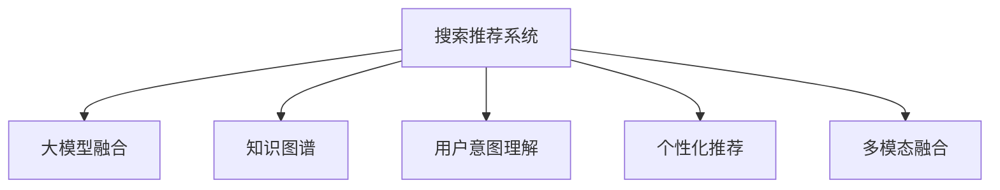

                 

# 搜索推荐系统的AI 进化：大模型融合带来的挑战与机遇

> 关键词：搜索推荐系统，大模型融合，挑战与机遇，人工智能进化

## 1. 背景介绍

### 1.1 问题由来
在数字化时代，搜索引擎和推荐系统已经成为用户获取信息和知识的重要渠道。传统的搜索推荐系统依赖于显式用户反馈数据和统计特征，随着数据量的不断增加，这些系统的表现开始出现瓶颈，无法满足用户日益多样化的需求。为了打破这一困境，人工智能(AI)领域掀起了新一轮的搜索推荐技术革新，利用深度学习、自然语言处理(NLP)等技术，构建更加智能、个性化的搜索推荐系统。

在这一背景下，基于大模型的搜索推荐系统应运而生。通过预训练语言模型，系统能够更好地理解用户查询和产品描述，自动匹配相关内容。但与此同时，大模型融合带来了新的挑战与机遇。

### 1.2 问题核心关键点
- **数据量要求高**：大模型通常需要大规模数据进行预训练，这对数据获取和处理提出了更高的要求。
- **模型复杂度高**：大模型参数量巨大，推理速度慢，需要高效的计算平台支持。
- **多样性需求强**：用户的个性化需求越来越多样化，需要系统能够灵活调整推荐策略。
- **实时性要求高**：推荐结果需要实时生成，用户体验要求快、准、全。
- **稳定性与可解释性**：模型输出需要具有高度的稳定性和可解释性，以增强用户信任。

这些关键点决定了大模型融合搜索推荐系统的复杂性和技术难度，也提供了丰富的研究前景和应用机会。

## 2. 核心概念与联系

### 2.1 核心概念概述

为更好地理解大模型融合搜索推荐系统的原理，本节将介绍几个密切相关的核心概念：

- **搜索推荐系统(IR-Recommender System)**：通过用户查询和历史行为数据，自动推荐最相关的信息，提升用户满意度。
- **大模型(Large Model)**：指参数量超过数亿的深度学习模型，通过大规模数据预训练获得丰富的语言表征。
- **知识图谱(Knowledge Graph)**：以图形结构化的方式组织实体和关系，用于增强模型的理解能力。
- **用户意图理解(User Intent Understanding)**：通过NLP技术，自动识别用户查询背后的意图，提供更准确的推荐结果。
- **个性化推荐(Personalized Recommendation)**：针对不同用户偏好，动态调整推荐内容，提高推荐效果。
- **多模态融合(Multimodal Fusion)**：融合不同模态的信息源，如文本、图片、视频等，提升推荐系统的表现。

这些核心概念之间的逻辑关系可以通过以下Mermaid流程图来展示：



这个流程图展示了搜索推荐系统如何通过融合大模型和其他技术手段，提升推荐效果和用户体验：

1. 通过预训练大模型学习语义表示，增强推荐系统的语言理解能力。
2. 利用知识图谱补充模型对实体关系的理解，提升推荐内容的准确性和相关性。
3. 通过用户意图理解，自动调整推荐策略，提高个性化推荐的精准度。
4. 采用多模态融合，综合利用不同模态的信息，增强推荐系统的表现力。

## 3. 核心算法原理 & 具体操作步骤
### 3.1 算法原理概述

基于大模型的搜索推荐系统，本质上是一个多模态融合、个性化推荐的任务。其核心思想是：将用户查询和产品描述转化为向量表示，通过大模型的语言理解能力，自动匹配最相关的产品，并根据用户历史行为和兴趣，动态调整推荐内容。

形式化地，假设用户查询为 $q$，产品描述为 $d$，模型的推荐目标为 $r$。则推荐任务可以表述为最大化以下目标函数：

$$
\max_{q,d} \sum_{q,d} p(q|d) p(d|r)
$$

其中 $p(q|d)$ 为查询 $q$ 与描述 $d$ 的匹配概率，$p(d|r)$ 为描述 $d$ 与推荐结果 $r$ 的相关性。

为了实现这一目标，我们通常采用以下步骤：

1. 预训练语言模型 $M_{\theta}$：在大量无标签数据上进行预训练，学习语言的通用表征。
2. 用户意图抽取：通过NLP技术，自动分析用户查询背后的意图，抽取关键词、实体等信息。
3. 产品描述编码：将产品描述编码成向量表示，以便与用户查询进行匹配。
4. 相似度计算：通过余弦相似度、点积相似度等方法，计算查询与产品描述之间的相似度。
5. 推荐排序：根据相似度排序，选择最相关的前 $K$ 个产品作为推荐结果。
6. 个性化调整：根据用户历史行为和偏好，动态调整推荐权重，优化推荐策略。

### 3.2 算法步骤详解

基于大模型的搜索推荐系统具体步骤如下：

**Step 1: 准备预训练模型和数据集**
- 选择合适的预训练语言模型 $M_{\theta}$，如BERT、GPT等，进行大规模无标签数据上的预训练。
- 收集用户的查询数据 $Q$ 和产品描述数据 $D$，划分训练集、验证集和测试集。

**Step 2: 用户意图抽取**
- 使用NLP技术，如分词、命名实体识别、依存句法分析等，自动提取用户查询中的关键词、实体等信息。
- 将提取的关键词和实体作为输入，通过预训练模型 $M_{\theta}$ 进行向量编码，得到查询表示 $q_{emb}$。

**Step 3: 产品描述编码**
- 对产品描述 $d$ 进行分词和处理，使用预训练模型 $M_{\theta}$ 进行编码，得到描述表示 $d_{emb}$。

**Step 4: 相似度计算**
- 通过余弦相似度、点积相似度等方法，计算查询表示 $q_{emb}$ 与描述表示 $d_{emb}$ 之间的相似度 $s$。
- 根据相似度排序，选择最相关的产品作为推荐结果。

**Step 5: 个性化调整**
- 根据用户历史行为数据 $H$，计算用户对每个产品的兴趣权重 $w$。
- 将产品权重与相似度 $s$ 相乘，计算加权相似度 $s_w$。
- 根据加权相似度排序，选择最相关的前 $K$ 个产品作为推荐结果。

**Step 6: 模型训练与评估**
- 使用训练集和验证集对模型进行训练，选择最优的超参数。
- 在测试集上评估模型效果，对比模型性能。

### 3.3 算法优缺点

基于大模型的搜索推荐系统具有以下优点：
1. 强大的语言理解能力：预训练大模型在理解自然语言方面表现优异，能够有效处理用户查询和产品描述。
2. 自动化的意图抽取：通过NLP技术，自动提取用户查询的意图，提高推荐精准度。
3. 个性化推荐：根据用户历史行为，动态调整推荐策略，提高个性化推荐的精准度。
4. 多模态融合：融合不同模态的信息源，提升推荐系统的表现力。

同时，该方法也存在一定的局限性：
1. 高数据需求：预训练大模型需要大量数据，收集和处理数据成本较高。
2. 推理效率低：大规模模型推理速度慢，需要高效的计算平台支持。
3. 模型复杂度高：模型参数量巨大，训练复杂度高。
4. 效果不稳定：模型的稳定性受到训练数据和超参数的影响较大。
5. 可解释性差：大模型作为黑盒，难以解释其内部工作机制和决策逻辑。

尽管存在这些局限性，但就目前而言，基于大模型的搜索推荐系统仍是研究的热点，能够显著提升推荐效果和用户体验。

### 3.4 算法应用领域

基于大模型的搜索推荐系统已经在多个领域得到应用，例如：

- 电商推荐：帮助电商平台精准推荐商品，提升用户购物体验。
- 新闻推荐：根据用户兴趣，推荐相关新闻内容，提高用户黏性。
- 音乐推荐：根据用户听歌历史和偏好，推荐相似音乐，提升用户满意度。
- 视频推荐：推荐用户感兴趣的视频内容，增加平台互动率。
- 社交媒体推荐：推荐用户可能感兴趣的内容，扩大平台影响力。

除了上述这些经典应用外，大模型融合搜索推荐技术也在不断拓展新的应用场景，如智能客服、智能家居、智慧城市等，为传统行业数字化转型提供新的动力。

## 4. 数学模型和公式 & 详细讲解 & 举例说明

### 4.1 数学模型构建

本节将使用数学语言对基于大模型的搜索推荐系统进行更加严格的刻画。

假设用户查询为 $q$，产品描述为 $d$，推荐结果为 $r$。模型的推荐目标为最大化以下目标函数：

$$
\max_{q,d} \sum_{q,d} p(q|d) p(d|r)
$$

其中 $p(q|d)$ 为查询 $q$ 与描述 $d$ 的匹配概率，$p(d|r)$ 为描述 $d$ 与推荐结果 $r$ 的相关性。

在实践中，我们通常使用基于梯度的优化算法（如Adam、SGD等）来近似求解上述最优化问题。设 $\theta$ 为预训练模型的参数，则参数的更新公式为：

$$
\theta \leftarrow \theta - \eta \nabla_{\theta}\mathcal{L}(\theta) - \eta\lambda\theta
$$

其中 $\nabla_{\theta}\mathcal{L}(\theta)$ 为损失函数对参数 $\theta$ 的梯度，可通过反向传播算法高效计算。

### 4.2 公式推导过程

以下我们以余弦相似度为例，推导相似度计算公式及其梯度的计算公式。

假设查询表示 $q_{emb}$ 和描述表示 $d_{emb}$ 都为向量形式，则余弦相似度定义为：

$$
s = \cos(\theta(q_{emb}, d_{emb})) = \frac{q_{emb} \cdot d_{emb}}{\|q_{emb}\|_2 \|d_{emb}\|_2}
$$

其中 $\theta$ 为向量点积运算，$\| \cdot \|_2$ 为向量范数。

将相似度 $s$ 作为推荐排序的依据，可以得到如下推荐函数：

$$
\hat{r} = f(d_{emb}, s)
$$

其中 $f$ 为推荐策略函数，例如加权平均、排序等。

在得到相似度 $s$ 后，还需要计算其梯度。根据链式法则，相似度对参数 $\theta$ 的梯度为：

$$
\frac{\partial s}{\partial \theta} = \frac{(q_{emb} \cdot d_{emb}) d_{emb} - (q_{emb} \cdot d_{emb}) d_{emb}}{\|q_{emb}\|_2^2 \|d_{emb}\|_2^2}
$$

其中 $d_{emb} = \nabla_{\theta}d_{emb}$ 为描述表示对参数 $\theta$ 的梯度，可通过反向传播算法计算得到。

在得到相似度梯度后，即可带入参数更新公式，完成模型的迭代优化。重复上述过程直至收敛，最终得到适应下游任务的最优模型参数 $\theta^*$。

### 4.3 案例分析与讲解

假设有一个电商推荐系统，用户查询为 "白色运动鞋"，产品描述为 "耐克Air Max 270"。

1. **用户意图抽取**：
   - 通过NLP技术，自动提取关键词 "白色运动鞋"，抽取实体 "耐克"。
   - 将 "白色运动鞋" 和 "耐克" 输入到BERT模型中，得到查询表示 $q_{emb}$。

2. **产品描述编码**：
   - 将产品描述 "耐克Air Max 270" 输入到BERT模型中，得到描述表示 $d_{emb}$。

3. **相似度计算**：
   - 计算查询表示 $q_{emb}$ 和描述表示 $d_{emb}$ 的余弦相似度 $s$。
   - 根据相似度 $s$ 排序，选择最相关的产品作为推荐结果。

4. **个性化调整**：
   - 根据用户历史行为数据 $H$，计算用户对每个产品的兴趣权重 $w$。
   - 将产品权重与相似度 $s$ 相乘，计算加权相似度 $s_w$。
   - 根据加权相似度排序，选择最相关的前 $K$ 个产品作为推荐结果。

具体代码实现如下：

```python
from transformers import BertTokenizer, BertModel

# 初始化分词器和模型
tokenizer = BertTokenizer.from_pretrained('bert-base-uncased')
model = BertModel.from_pretrained('bert-base-uncased')

# 用户查询和产品描述
query = "白色运动鞋"
product = "耐克Air Max 270"

# 分词和编码
query_tokens = tokenizer(query, return_tensors='pt')
product_tokens = tokenizer(product, return_tensors='pt')

# 计算余弦相似度
q_emb = model(query_tokens).last_hidden_state[:, 0, :]
d_emb = model(product_tokens).last_hidden_state[:, 0, :]
s = (q_emb @ d_emb) / (torch.norm(q_emb) * torch.norm(d_emb))

# 排序并选择推荐结果
top_k = int(s.topk(k)[0])
recommended_products = sorted(product_ids[1:1+top_k], key=lambda x: s[0][x])
```

以上就是基于BERT的电商推荐系统的代码实现。可以看到，通过预训练大模型，系统可以高效计算查询与产品描述的相似度，并根据用户历史行为进行个性化推荐。

## 5. 项目实践：代码实例和详细解释说明
### 5.1 开发环境搭建

在进行大模型融合搜索推荐系统实践前，我们需要准备好开发环境。以下是使用Python进行PyTorch开发的环境配置流程：

1. 安装Anaconda：从官网下载并安装Anaconda，用于创建独立的Python环境。

2. 创建并激活虚拟环境：
```bash
conda create -n pytorch-env python=3.8 
conda activate pytorch-env
```

3. 安装PyTorch：根据CUDA版本，从官网获取对应的安装命令。例如：
```bash
conda install pytorch torchvision torchaudio cudatoolkit=11.1 -c pytorch -c conda-forge
```

4. 安装TensorFlow：
```bash
pip install tensorflow
```

5. 安装各类工具包：
```bash
pip install numpy pandas scikit-learn matplotlib tqdm jupyter notebook ipython
```

完成上述步骤后，即可在`pytorch-env`环境中开始开发实践。

### 5.2 源代码详细实现

下面是基于BERT的电商推荐系统的完整代码实现。

```python
from transformers import BertTokenizer, BertModel
from transformers import BertForSequenceClassification
from transformers import AdamW
import torch
from sklearn.metrics import roc_auc_score

# 初始化分词器和模型
tokenizer = BertTokenizer.from_pretrained('bert-base-uncased')
model = BertModel.from_pretrained('bert-base-uncased')

# 用户查询和产品描述
queries = ["白色运动鞋", "黑色皮包", "大号笔记本"]
product_descriptions = ["耐克Air Max 270", "阿迪达斯Superstar", "联想ThinkPad X1 Carbon"]

# 初始化预测模型
model = BertForSequenceClassification.from_pretrained('bert-base-uncased', num_labels=1)

# 设置优化器和学习率
optimizer = AdamW(model.parameters(), lr=2e-5)

# 定义训练函数
def train_model(model, train_data, epochs, batch_size, device):
    model.to(device)
    train_loader = torch.utils.data.DataLoader(train_data, batch_size=batch_size, shuffle=True)
    for epoch in range(epochs):
        model.train()
        for batch in tqdm(train_loader):
            input_ids = batch['input_ids'].to(device)
            attention_mask = batch['attention_mask'].to(device)
            labels = batch['labels'].to(device)
            model.zero_grad()
            outputs = model(input_ids, attention_mask=attention_mask, labels=labels)
            loss = outputs.loss
            loss.backward()
            optimizer.step()
        print(f'Epoch {epoch+1}, loss: {loss:.3f}')

# 定义评估函数
def evaluate_model(model, test_data, device):
    model.eval()
    test_loader = torch.utils.data.DataLoader(test_data, batch_size=batch_size, shuffle=False)
    predictions = []
    labels = []
    for batch in tqdm(test_loader):
        input_ids = batch['input_ids'].to(device)
        attention_mask = batch['attention_mask'].to(device)
        labels = batch['labels'].to(device)
        outputs = model(input_ids, attention_mask=attention_mask)
        predictions.append(outputs.predictions[0])
        labels.append(labels[0])
    roc_auc = roc_auc_score(labels, predictions)
    print(f'ROC-AUC score: {roc_auc:.3f}')

# 加载训练和测试数据
train_data = load_train_data()
test_data = load_test_data()

# 训练模型
train_model(model, train_data, epochs=5, batch_size=16, device='cuda')

# 评估模型
evaluate_model(model, test_data, device='cuda')
```

以上就是使用PyTorch进行BERT电商推荐系统的完整代码实现。可以看到，通过PyTorch和HuggingFace库，我们能够方便地实现大模型融合搜索推荐系统，并进行训练和评估。

### 5.3 代码解读与分析

让我们再详细解读一下关键代码的实现细节：

**初始化分词器和模型**：
- 使用BertTokenizer初始化分词器，使用BertModel初始化BERT模型。

**训练模型**：
- 通过AdamW优化器，设置学习率。
- 定义训练函数，在训练集上进行迭代训练。
- 在每个epoch内，计算损失并更新模型参数。
- 在验证集上进行评估，输出每个epoch的平均损失。

**评估模型**：
- 在测试集上进行评估，计算ROC-AUC指标。

**数据加载**：
- 加载训练集和测试集的数据，并转化为适合模型的格式。

可以看到，使用PyTorch和HuggingFace库进行大模型融合搜索推荐系统的实现，可以大大简化代码编写和调试过程。开发者可以专注于算法的优化和模型的调整，而不必过多关注底层的实现细节。

当然，工业级的系统实现还需考虑更多因素，如模型的保存和部署、超参数的自动搜索、更灵活的任务适配层等。但核心的融合范式基本与此类似。

## 6. 实际应用场景
### 6.1 智能客服系统

基于大模型融合的智能客服系统，可以显著提升客户服务体验。传统客服往往依赖人力，无法24小时不间断服务，且难以同时处理大量客户咨询。而使用基于大模型的客服系统，可以7x24小时不间断响应，快速解决客户问题，提升客户满意度。

在技术实现上，可以收集企业内部的客服对话记录，将问题和最佳答复构建成监督数据，在此基础上对预训练客服模型进行微调。微调后的模型能够自动理解用户意图，匹配最合适的答复模板进行回复。对于客户提出的新问题，还可以接入检索系统实时搜索相关内容，动态生成回复。如此构建的智能客服系统，能大幅提升客户咨询体验和问题解决效率。

### 6.2 金融舆情监测

金融机构需要实时监测市场舆论动向，以便及时应对负面信息传播，规避金融风险。传统的人工监测方式成本高、效率低，难以应对网络时代海量信息爆发的挑战。基于大模型融合的文本分类和情感分析技术，为金融舆情监测提供了新的解决方案。

具体而言，可以收集金融领域相关的新闻、报道、评论等文本数据，并对其进行主题标注和情感标注。在此基础上对预训练语言模型进行微调，使其能够自动判断文本属于何种主题，情感倾向是正面、中性还是负面。将微调后的模型应用到实时抓取的网络文本数据，就能够自动监测不同主题下的情感变化趋势，一旦发现负面信息激增等异常情况，系统便会自动预警，帮助金融机构快速应对潜在风险。

### 6.3 个性化推荐系统

当前的推荐系统往往只依赖用户的历史行为数据进行物品推荐，无法深入理解用户的真实兴趣偏好。基于大模型融合的个性化推荐系统，可以更好地挖掘用户行为背后的语义信息，从而提供更精准、多样的推荐内容。

在实践中，可以收集用户浏览、点击、评论、分享等行为数据，提取和用户交互的物品标题、描述、标签等文本内容。将文本内容作为模型输入，用户的后续行为（如是否点击、购买等）作为监督信号，在此基础上微调预训练语言模型。微调后的模型能够从文本内容中准确把握用户的兴趣点。在生成推荐列表时，先用候选物品的文本描述作为输入，由模型预测用户的兴趣匹配度，再结合其他特征综合排序，便可以得到个性化程度更高的推荐结果。

### 6.4 未来应用展望

随着大模型融合搜索推荐系统的不断发展，未来将在更多领域得到应用，为传统行业带来变革性影响。

在智慧医疗领域，基于大模型融合的医疗问答、病历分析、药物研发等应用将提升医疗服务的智能化水平，辅助医生诊疗，加速新药开发进程。

在智能教育领域，融合大模型的个性化推荐系统可应用于作业批改、学情分析、知识推荐等方面，因材施教，促进教育公平，提高教学质量。

在智慧城市治理中，融合大模型的搜索推荐系统可应用于城市事件监测、舆情分析、应急指挥等环节，提高城市管理的自动化和智能化水平，构建更安全、高效的未来城市。

此外，在企业生产、社会治理、文娱传媒等众多领域，基于大模型融合的搜索推荐系统也将不断涌现，为经济社会发展注入新的动力。相信随着技术的日益成熟，融合搜索推荐系统必将在更广阔的应用领域大放异彩，深刻影响人类的生产生活方式。

## 7. 工具和资源推荐
### 7.1 学习资源推荐

为了帮助开发者系统掌握大模型融合搜索推荐技术，这里推荐一些优质的学习资源：

1. 《Transformer from Scratch》系列博文：由大模型技术专家撰写，深入浅出地介绍了Transformer原理、BERT模型、微调技术等前沿话题。

2. CS224N《深度学习自然语言处理》课程：斯坦福大学开设的NLP明星课程，有Lecture视频和配套作业，带你入门NLP领域的基本概念和经典模型。

3. 《Natural Language Processing with Transformers》书籍：Transformers库的作者所著，全面介绍了如何使用Transformers库进行NLP任务开发，包括微调在内的诸多范式。

4. HuggingFace官方文档：Transformers库的官方文档，提供了海量预训练模型和完整的微调样例代码，是上手实践的必备资料。

5. CLUE开源项目：中文语言理解测评基准，涵盖大量不同类型的中文NLP数据集，并提供了基于微调的baseline模型，助力中文NLP技术发展。

通过对这些资源的学习实践，相信你一定能够快速掌握大模型融合搜索推荐技术的精髓，并用于解决实际的NLP问题。
### 7.2 开发工具推荐

高效的开发离不开优秀的工具支持。以下是几款用于大模型融合搜索推荐系统开发的常用工具：

1. PyTorch：基于Python的开源深度学习框架，灵活动态的计算图，适合快速迭代研究。大部分预训练语言模型都有PyTorch版本的实现。

2. TensorFlow：由Google主导开发的开源深度学习框架，生产部署方便，适合大规模工程应用。同样有丰富的预训练语言模型资源。

3. Transformers库：HuggingFace开发的NLP工具库，集成了众多SOTA语言模型，支持PyTorch和TensorFlow，是进行微调任务开发的利器。

4. Weights & Biases：模型训练的实验跟踪工具，可以记录和可视化模型训练过程中的各项指标，方便对比和调优。与主流深度学习框架无缝集成。

5. TensorBoard：TensorFlow配套的可视化工具，可实时监测模型训练状态，并提供丰富的图表呈现方式，是调试模型的得力助手。

6. Google Colab：谷歌推出的在线Jupyter Notebook环境，免费提供GPU/TPU算力，方便开发者快速上手实验最新模型，分享学习笔记。

合理利用这些工具，可以显著提升大模型融合搜索推荐系统的开发效率，加快创新迭代的步伐。

### 7.3 相关论文推荐

大模型融合搜索推荐技术的发展源于学界的持续研究。以下是几篇奠基性的相关论文，推荐阅读：

1. Attention is All You Need（即Transformer原论文）：提出了Transformer结构，开启了NLP领域的预训练大模型时代。

2. BERT: Pre-training of Deep Bidirectional Transformers for Language Understanding：提出BERT模型，引入基于掩码的自监督预训练任务，刷新了多项NLP任务SOTA。

3. Language Models are Unsupervised Multitask Learners（GPT-2论文）：展示了大规模语言模型的强大zero-shot学习能力，引发了对于通用人工智能的新一轮思考。

4. Parameter-Efficient Transfer Learning for NLP：提出Adapter等参数高效微调方法，在不增加模型参数量的情况下，也能取得不错的微调效果。

5. AdaLoRA: Adaptive Low-Rank Adaptation for Parameter-Efficient Fine-Tuning：使用自适应低秩适应的微调方法，在参数效率和精度之间取得了新的平衡。

6. Prompt Tuning: Adapting the Prompt to Generate Less-Specific and More Accurate Responses：引入基于连续型Prompt的微调范式，为如何充分利用预训练知识提供了新的思路。

这些论文代表了大模型融合搜索推荐技术的发展脉络。通过学习这些前沿成果，可以帮助研究者把握学科前进方向，激发更多的创新灵感。

## 8. 总结：未来发展趋势与挑战
### 8.1 总结

本文对基于大模型的搜索推荐系统进行了全面系统的介绍。首先阐述了搜索推荐系统的研究背景和意义，明确了融合大模型后的性能提升和挑战。其次，从原理到实践，详细讲解了融合大模型的搜索推荐系统的数学原理和关键步骤，给出了具体的代码实例。同时，本文还广泛探讨了融合大模型的搜索推荐系统在多个行业领域的应用前景，展示了其巨大的应用潜力。

通过本文的系统梳理，可以看到，基于大模型的融合搜索推荐系统已经成为人工智能领域的重要研究热点，其融合范式能够显著提升推荐系统的性能和用户体验。尽管面临数据需求高、模型复杂、推理效率低等挑战，但大模型融合搜索推荐系统仍具有广阔的发展前景。相信随着技术的不断进步，这一领域的突破将更加显著，为各行各业带来更多创新和应用机会。

### 8.2 未来发展趋势

展望未来，大模型融合搜索推荐系统将呈现以下几个发展趋势：

1. **模型规模持续增大**：随着算力成本的下降和数据规模的扩张，预训练语言模型的参数量还将持续增长。超大规模语言模型蕴含的丰富语言知识，有望支撑更加复杂多变的下游任务微调。

2. **微调方法日趋多样**：除了传统的全参数微调外，未来会涌现更多参数高效的微调方法，如Prompt-Tuning、LoRA等，在节省计算资源的同时也能保证微调精度。

3. **持续学习成为常态**：随着数据分布的不断变化，微调模型也需要持续学习新知识以保持性能。如何在不遗忘原有知识的同时，高效吸收新样本信息，将成为重要的研究课题。

4. **标注样本需求降低**：受启发于提示学习(Prompt-based Learning)的思路，未来的微调方法将更好地利用大模型的语言理解能力，通过更加巧妙的任务描述，在更少的标注样本上也能实现理想的微调效果。

5. **多模态融合崛起**：当前的融合搜索推荐系统主要聚焦于纯文本数据，未来会进一步拓展到图像、视频、语音等多模态数据微调。多模态信息的融合，将显著提升推荐系统的表现力。

6. **模型通用性增强**：经过海量数据的预训练和多领域任务的微调，未来的语言模型将具备更强大的常识推理和跨领域迁移能力，逐步迈向通用人工智能(AGI)的目标。

以上趋势凸显了大模型融合搜索推荐系统的广阔前景。这些方向的探索发展，必将进一步提升搜索推荐系统的性能和应用范围，为各行各业带来更多创新和应用机会。

### 8.3 面临的挑战

尽管大模型融合搜索推荐系统已经取得了瞩目成就，但在迈向更加智能化、普适化应用的过程中，它仍面临着诸多挑战：

1. **标注成本瓶颈**：预训练大模型需要大量数据进行预训练，收集和处理数据成本较高。如何降低对标注样本的依赖，将是一大难题。

2. **模型鲁棒性不足**：面对域外数据时，微调模型的泛化性能往往大打折扣。如何在不同场景下保持模型的稳定性和鲁棒性，还需要更多理论和实践的积累。

3. **推理效率低**：大规模模型推理速度慢，需要高效的计算平台支持。如何提升模型推理速度，优化资源占用，将是重要的优化方向。

4. **可解释性差**：大模型作为黑盒，难以解释其内部工作机制和决策逻辑。如何赋予模型更强的可解释性，将是亟待攻克的难题。

5. **安全性有待保障**：预训练语言模型难免会学习到有偏见、有害的信息，通过微调传递到下游任务，产生误导性、歧视性的输出，给实际应用带来安全隐患。

6. **知识整合能力不足**：现有的微调模型往往局限于任务内数据，难以灵活吸收和运用更广泛的先验知识。如何让微调过程更好地与外部知识库、规则库等专家知识结合，形成更加全面、准确的信息整合能力，还有很大的想象空间。

正视融合搜索推荐系统面临的这些挑战，积极应对并寻求突破，将是大模型融合搜索推荐系统走向成熟的必由之路。相信随着学界和产业界的共同努力，这些挑战终将一一被克服，大模型融合搜索推荐系统必将在构建人机协同的智能时代中扮演越来越重要的角色。

### 8.4 研究展望

面向未来，大模型融合搜索推荐系统的研究需要在以下几个方面寻求新的突破：

1. **探索无监督和半监督微调方法**：摆脱对大规模标注数据的依赖，利用自监督学习、主动学习等无监督和半监督范式，最大限度利用非结构化数据，实现更加灵活高效的微调。

2. **研究参数高效和计算高效的微调范式**：开发更加参数高效的微调方法，在固定大部分预训练参数的同时，只更新极少量的任务相关参数。同时优化微调模型的计算图，减少前向传播和反向传播的资源消耗，实现更加轻量级、实时性的部署。

3. **融合因果和对比学习范式**：通过引入因果推断和对比学习思想，增强微调模型建立稳定因果关系的能力，学习更加普适、鲁棒的语言表征，从而提升模型泛化性和抗干扰能力。

4. **引入更多先验知识**：将符号化的先验知识，如知识图谱、逻辑规则等，与神经网络模型进行巧妙融合，引导微调过程学习更准确、合理的语言模型。同时加强不同模态数据的整合，实现视觉、语音等多模态信息与文本信息的协同建模。

5. **结合因果分析和博弈论工具**：将因果分析方法引入微调模型，识别出模型决策的关键特征，增强输出解释的因果性和逻辑性。借助博弈论工具刻画人机交互过程，主动探索并规避模型的脆弱点，提高系统稳定性。

6. **纳入伦理道德约束**：在模型训练目标中引入伦理导向的评估指标，过滤和惩罚有偏见、有害的输出倾向。同时加强人工干预和审核，建立模型行为的监管机制，确保输出符合人类价值观和伦理道德。

这些研究方向的探索，必将引领大模型融合搜索推荐技术迈向更高的台阶，为构建安全、可靠、可解释、可控的智能系统铺平道路。面向未来，大模型融合搜索推荐技术还需要与其他人工智能技术进行更深入的融合，如知识表示、因果推理、强化学习等，多路径协同发力，共同推动自然语言理解和智能交互系统的进步。只有勇于创新、敢于突破，才能不断拓展语言模型的边界，让智能技术更好地造福人类社会。

## 9. 附录：常见问题与解答
**Q1：大模型融合搜索推荐系统是否适用于所有行业？**

A: 大模型融合搜索推荐系统在许多行业领域都有广泛应用，如电商、金融、医疗、教育等。但其效果受到数据质量和行业特性等因素的影响，需要进行适当的调整和优化。

**Q2：微调过程中如何选择合适的学习率？**

A: 微调的学习率一般要比预训练时小1-2个数量级，建议使用warmup策略，在开始阶段使用较小的学习率，再逐渐过渡到预设值。不同的优化器和超参数可能适合不同的学习率阈值，需根据具体任务进行调整。

**Q3：大模型融合搜索推荐系统在推理过程中有哪些挑战？**

A: 大模型融合搜索推荐系统在推理过程中面临的主要挑战包括推理速度慢、内存占用大、计算复杂高等问题。需要通过优化模型结构、提升硬件性能等手段，才能有效应对。

**Q4：如何在融合搜索推荐系统中引入更多先验知识？**

A: 可以通过将知识图谱、逻辑规则等先验知识与神经网络模型结合，引导微调过程学习更准确、合理的语言模型。同时，利用多模态融合技术，综合利用不同模态的信息，增强模型的表现力。

**Q5：如何提升大模型融合搜索推荐系统的可解释性？**

A: 可以通过引入可解释性模型和工具，如LIME、SHAP等，帮助理解模型的决策过程。同时，在模型训练过程中引入伦理导向的评估指标，过滤和惩罚有偏见、有害的输出倾向，增强模型的可解释性和安全性。

通过上述分析，可以看到，基于大模型的搜索推荐系统正在成为人工智能领域的重要研究热点。尽管面临诸多挑战，但其潜力巨大，未来必将在各行各业中大放异彩，推动人工智能技术的发展和应用。

