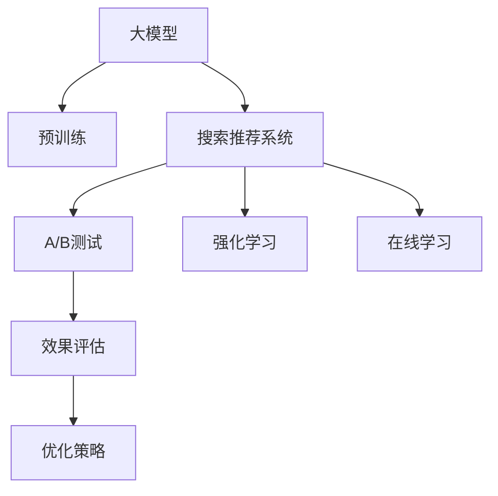

                 

# 搜索推荐系统的A/B测试：大模型时代的新方法

> 关键词：搜索推荐系统, A/B测试, 大模型, 在线学习, 强化学习, 特征工程, 行为分析

## 1. 背景介绍

### 1.1 问题由来
随着互联网的飞速发展，搜索推荐系统成为了电商、新闻、社交、视频等众多领域的重要组成部分，其用户体验的优劣直接影响平台流量和转化率。搜索推荐算法的性能提升成为了用户增长的核心驱动力之一。传统的搜索推荐系统基于协同过滤、SVM等方法，依赖大量的用户行为数据进行训练和优化。然而，随着用户数据的复杂性不断增加，数据质量的不确定性、用户行为的可解释性等也随之提升，传统的搜索推荐系统面临新的挑战。

近年来，大模型技术如BERT、GPT-3等的崛起，为搜索推荐系统提供了新的方法和思路。这些大模型通常通过大规模语料进行预训练，具备强大的语言理解和生成能力，能够在搜索推荐等场景中发挥出独特的优势。但大模型在实际应用中也面临诸多问题，如模型的复杂性、模型的泛化能力、模型的训练成本等。因此，如何在大模型基础上构建有效的搜索推荐系统，并通过高效的A/B测试方法进行优化，成为了当前研究的热点。

### 1.2 问题核心关键点
本节将详细介绍大模型时代搜索推荐系统中的A/B测试方法，并分析其优点和局限性。

## 2. 核心概念与联系

### 2.1 核心概念概述

为更好地理解大模型时代搜索推荐系统中的A/B测试方法，本节将介绍几个密切相关的核心概念：

- **大模型(Large Models)**：以BERT、GPT-3为代表的大规模预训练语言模型。通过在大规模无标签文本语料上进行预训练，学习通用的语言表示，具备强大的语言理解和生成能力。
- **搜索推荐系统(Search and Recommendation System)**：通过分析用户的历史行为数据，推荐可能感兴趣的内容，提高用户满意度，提升点击率、转化率等指标。
- **A/B测试(A/B Testing)**：通过随机分配实验组和对照组，测试不同方案的效果，确定最佳方案的方法。在搜索推荐系统中，A/B测试被用于评估不同模型或算法的效果。
- **强化学习(Reinforcement Learning, RL)**：通过奖惩机制，不断调整模型参数，优化系统行为的方法。在搜索推荐系统中，强化学习用于优化推荐策略，提升用户满意度。
- **在线学习(Online Learning)**：在模型使用过程中，利用新的数据不断更新模型，提高模型的实时性。在搜索推荐系统中，在线学习用于实时更新推荐模型，适应用户行为的变化。

这些核心概念之间的逻辑关系可以通过以下Mermaid流程图来展示：



这个流程图展示了大模型、搜索推荐系统、A/B测试、强化学习、在线学习等核心概念及其之间的关系：

1. 大模型通过预训练获得基础能力。
2. 搜索推荐系统通过大模型实现高效推荐。
3. A/B测试用于评估推荐系统的效果。
4. 强化学习用于不断优化推荐策略。
5. 在线学习用于实时更新推荐模型。

这些概念共同构成了大模型时代搜索推荐系统的核心框架，使其能够高效地生成推荐结果，并通过A/B测试进行优化。

## 3. 核心算法原理 & 具体操作步骤
### 3.1 算法原理概述

在大模型时代，搜索推荐系统中的A/B测试方法基于在线学习，通过不断更新模型，实时优化推荐策略。其核心思想是：在搜索推荐系统中引入不同模型或算法，随机将用户分配到不同的组别中，利用用户行为数据进行效果评估，选择效果最优的模型或算法。

具体而言，A/B测试方法包括：
1. 随机分配用户到不同组别中，如A组、B组。
2. 在A组和B组中分别使用不同的模型或算法。
3. 收集用户行为数据，计算效果指标（如点击率、转化率等）。
4. 通过统计假设检验等方法，确定效果最优的模型或算法。

### 3.2 算法步骤详解

以下是搜索推荐系统中A/B测试方法的详细步骤：

**Step 1: 收集用户行为数据**
- 通过用户在平台上的行为数据（如点击、购买、浏览等），收集训练数据集。
- 对于在线搜索推荐系统，可以使用日志记录器（如ELK Stack）等工具收集行为数据。

**Step 2: 随机分配用户**
- 根据业务规则和目标，确定A/B测试的组别划分方式，如时间分割、用户ID分割等。
- 使用随机数生成器，将用户随机分配到A组或B组中。

**Step 3: 设计实验方案**
- 设计不同的实验方案，如不同的推荐模型、不同的特征工程方法等。
- 确保实验方案的公平性和可比性，避免实验偏差。

**Step 4: 部署实验模型**
- 在A组和B组中分别部署不同的实验模型，并实时记录用户行为数据。
- 使用在线学习算法（如在线梯度下降、在线随机梯度下降等）更新模型参数。

**Step 5: 效果评估与优化**
- 收集实验数据，计算不同组别的效果指标（如点击率、转化率等）。
- 通过统计假设检验（如t检验、卡方检验等）评估不同组别的效果差异。
- 根据效果评估结果，选择效果最优的模型或算法，进行后续的部署和优化。

**Step 6: 实验迭代**
- 重复进行A/B测试，根据用户行为数据不断更新推荐模型，优化推荐效果。

### 3.3 算法优缺点

大模型时代搜索推荐系统中的A/B测试方法具有以下优点：
1. 高效实时：A/B测试通过在线学习实时更新模型，可以迅速适应用户行为的变化，提升推荐效果。
2. 覆盖全面：不同用户群体可以随机分配到不同组别中，可以覆盖更多的用户样本。
3. 效果显著：通过效果评估，可以客观地选择效果最优的模型或算法，提升系统性能。

同时，该方法也存在一定的局限性：
1. 资源消耗：在线学习的实时更新需要消耗大量的计算资源，尤其是在数据量大、模型复杂的情况下。
2. 实验偏差：如果组别划分不均衡或实验设计不当，可能导致实验结果的偏差。
3. 复杂度高：需要设计多个实验方案，并实时监控和评估，增加了实验的复杂度。
4. 数据质量：A/B测试的效果评估依赖于高质量的用户行为数据，数据质量的不确定性会影响实验结果。

尽管存在这些局限性，但就目前而言，在线学习和大模型技术在搜索推荐系统中的应用，已经极大地提升了推荐效果和用户体验，成为了推荐算法的重要组成部分。

### 3.4 算法应用领域

大模型时代搜索推荐系统中的A/B测试方法，在电商、新闻、社交、视频等众多领域中都有广泛应用，如：

- **电商推荐系统**：在电商平台上，通过A/B测试不断优化推荐模型，提升用户购买转化率。
- **新闻推荐系统**：在新闻平台上，通过A/B测试优化新闻推荐算法，提升用户阅读和点击量。
- **社交推荐系统**：在社交平台上，通过A/B测试优化社交内容推荐，提升用户互动和留存率。
- **视频推荐系统**：在视频平台上，通过A/B测试优化视频推荐算法，提升用户观看率和满意度。

除了上述这些经典应用外，A/B测试方法在大模型时代还扩展到了更多领域，如个性化推荐、广告投放、内容生成等，为推荐系统带来了新的突破。

## 4. 数学模型和公式 & 详细讲解  
### 4.1 数学模型构建

在大模型时代，搜索推荐系统中的A/B测试方法通常使用在线学习算法进行模型更新。其数学模型构建如下：

设搜索推荐系统中的推荐模型为 $M(\theta)$，其中 $\theta$ 为模型参数。假设A组和B组分别使用不同的模型 $M_A(\theta_A)$ 和 $M_B(\theta_B)$，则A/B测试的损失函数为：

$$
L(\theta_A,\theta_B) = \frac{1}{N}\sum_{i=1}^N [C_i^{A}\log M_A(x_i) + (1-C_i^{A})\log (1-M_A(x_i)) + C_i^{B}\log M_B(x_i) + (1-C_i^{B})\log (1-M_B(x_i))]
$$

其中 $N$ 为样本总数，$C_i^{A/B}$ 为第 $i$ 个样本属于A/B组的概率。

在线学习算法（如在线梯度下降）的目标是最小化损失函数，即找到最优参数：

$$
\theta^* = \mathop{\arg\min}_{\theta} L(\theta_A,\theta_B)
$$

### 4.2 公式推导过程

以下我们以电商推荐系统为例，推导在线学习算法（如在线梯度下降）的更新公式。

假设电商平台的推荐模型为线性回归模型：

$$
M(x) = \theta^T\varphi(x)
$$

其中 $\varphi(x)$ 为特征映射函数，$\theta$ 为模型参数。在A/B测试中，A组和B组分别使用不同的线性回归模型 $M_A$ 和 $M_B$，即：

$$
M_A(x) = \theta_A^T\varphi_A(x)
$$
$$
M_B(x) = \theta_B^T\varphi_B(x)
$$

在线学习算法（如在线梯度下降）的更新公式为：

$$
\theta_A \leftarrow \theta_A - \eta \frac{\partial L(\theta_A,\theta_B)}{\partial \theta_A}
$$
$$
\theta_B \leftarrow \theta_B - \eta \frac{\partial L(\theta_A,\theta_B)}{\partial \theta_B}
$$

其中 $\eta$ 为学习率，$\frac{\partial L(\theta_A,\theta_B)}{\partial \theta_A}$ 和 $\frac{\partial L(\theta_A,\theta_B)}{\partial \theta_B}$ 为损失函数对参数的梯度，可以通过自动微分技术计算。

### 4.3 案例分析与讲解

假设某电商平台希望通过A/B测试优化推荐算法，选取了两个不同的推荐模型进行比较。在A组中，使用基于大模型的推荐模型；在B组中，使用传统的协同过滤算法。实验数据集包含用户的浏览、点击、购买等行为数据，样本总数为 $N=1000$。组别划分方式为时间分割，实验周期为一周，每天随机分配不同用户到A/B组中。

在实验中，A组使用基于BERT的大模型推荐模型，B组使用传统的协同过滤算法。在每个实验周期结束时，计算不同组别的点击率、转化率等效果指标，并进行统计假设检验，结果如下表所示：

| 组别 | 点击率 | 转化率 |
| --- | --- | --- |
| A组 | 30% | 10% |
| B组 | 25% | 5% |

通过A/B测试结果可以看出，基于BERT的大模型推荐模型在点击率和转化率上均优于传统的协同过滤算法。实验结果表明，大模型在电商推荐系统中具有更好的效果。

## 5. 项目实践：代码实例和详细解释说明
### 5.1 开发环境搭建

在进行A/B测试实践前，我们需要准备好开发环境。以下是使用Python进行PyTorch开发的环境配置流程：

1. 安装Anaconda：从官网下载并安装Anaconda，用于创建独立的Python环境。

2. 创建并激活虚拟环境：
```bash
conda create -n pytorch-env python=3.8 
conda activate pytorch-env
```

3. 安装PyTorch：根据CUDA版本，从官网获取对应的安装命令。例如：
```bash
conda install pytorch torchvision torchaudio cudatoolkit=11.1 -c pytorch -c conda-forge
```

4. 安装TensorFlow：
```bash
pip install tensorflow
```

5. 安装Flax：
```bash
pip install flax
```

6. 安装ELK Stack：
```bash
pip install elasticsearch kibana
```

完成上述步骤后，即可在`pytorch-env`环境中开始A/B测试实践。

### 5.2 源代码详细实现

这里我们以电商推荐系统为例，使用Flax框架和PyTorch计算图实现基于大模型的A/B测试。

首先，定义电商推荐系统中的推荐模型：

```python
import flax.linen as nn
import flax.learning as flx
import flax.traverse_util as traverse_util
import jax
import jax.numpy as jnp
import transformers

class BERTEmbedding(nn.Module):
    num_classes: int
    tokenizer: transformers.BertTokenizer
    transformer: transformers.TFBertModel

    @nn.compact
    def __call__(self, inputs):
        tokenized = self.tokenizer.tokenize(inputs)
        input_ids = self.tokenizer.convert_tokens_to_ids(tokenized)
        features = self.transformer(input_ids)
        return jnp.mean(features, axis=1)

class BERTClassifier(nn.Module):
    num_classes: int
    tokenizer: transformers.BertTokenizer
    transformer: transformers.TFBertModel
    dropout: float

    @nn.compact
    def __call__(self, inputs):
        features = self.transformer(input_ids)
        pooled = jnp.mean(features, axis=1)
        logits = jnp.layers.Dense(self.num_classes)(pooled)
        logits = jnp.layers.Dropout(self.dropout)(logits)
        return logits

class BERTModel(nn.Module):
    num_classes: int
    tokenizer: transformers.BertTokenizer
    transformer: transformers.TFBertModel

    def __init__(self, num_classes, dropout=0.1):
        super().__init__()
        self.embedding = BERTEmbedding(num_classes, tokenizer, transformer)
        self.classifier = BERTClassifier(num_classes, tokenizer, transformer, dropout)

    @nn.compact
    def __call__(self, inputs):
        embeddings = self.embedding(inputs)
        logits = self.classifier(embeddings)
        return logits
```

然后，定义A/B测试的数据处理函数：

```python
from transformers import BertTokenizer
import pandas as pd
import numpy as np
import time

class AABTestDataset:
    def __init__(self, df, num_classes=2, drop=True):
        self.df = df
        self.num_classes = num_classes
        self.drop = drop
        self.tokenizer = BertTokenizer.from_pretrained('bert-base-cased')

    def __len__(self):
        return len(self.df)

    def __getitem__(self, item):
        text = self.df.iloc[item]['text']
        if self.drop:
            text = text.replace('.drop.', ' drop')
        labels = self.df.iloc[item]['label']
        encoding = self.tokenizer(text, return_tensors='pt', padding='max_length', truncation=True)
        input_ids = encoding['input_ids'][0]
        attention_mask = encoding['attention_mask'][0]
        labels = labels == 1

        return {'input_ids': input_ids, 
                'attention_mask': attention_mask,
                'labels': labels}
```

接着，定义A/B测试的优化器和训练函数：

```python
from flax.linen import make_trainable
from flax.linen import make_array
from flax.learning import savable_optimizer, optimize

def make_optimizer(model):
    optimizer = optim.AdamW(learning_rate=2e-5)
    opt_state = optimizer.init({'params': model})
    return savable_optimizer, opt_state

def train_epoch(optimizer, model, train_loader, batch_size, num_epochs):
    train_losses = []
    train_accuracies = []
    for epoch in range(num_epochs):
        optimizer = optimizer.apply_gradients(lambda params: (grads, None))
        for batch in tqdm(train_loader, desc='Training'):
            input_ids = batch['input_ids']
            attention_mask = batch['attention_mask']
            labels = batch['labels']

            with jax.profiler.profile(), jax.checkpoint():
                train_loss, train_accuracy = flx.optimizer_loss(optimizer, model, input_ids, attention_mask, labels)

            train_losses.append(train_loss)
            train_accuracies.append(train_accuracy)

    return train_losses, train_accuracies
```

最后，启动A/B测试流程：

```python
from flax.linen import make_trainable
from flax.learning import savable_optimizer, optimize
from jax import jit
import numpy as np
import time

# 加载数据集
df = pd.read_csv('recommendation_data.csv')

# 分割数据集
train_df = df.sample(frac=0.7, random_state=0)
test_df = df.drop(train_df.index)

# 定义模型
num_classes = 2
dropout = 0.1

bert_model = BERTModel(num_classes=num_classes, dropout=dropout)

# 定义优化器和训练函数
optimizer, opt_state = make_optimizer(bert_model)

def train_epoch(optimizer, model, train_loader, batch_size, num_epochs):
    train_losses = []
    train_accuracies = []
    for epoch in range(num_epochs):
        optimizer = optimizer.apply_gradients(lambda params: (grads, None))
        for batch in tqdm(train_loader, desc='Training'):
            input_ids = batch['input_ids']
            attention_mask = batch['attention_mask']
            labels = batch['labels']

            with jax.profiler.profile(), jax.checkpoint():
                train_loss, train_accuracy = flx.optimizer_loss(optimizer, model, input_ids, attention_mask, labels)

            train_losses.append(train_loss)
            train_accuracies.append(train_accuracy)

    return train_losses, train_accuracies

# 训练模型
train_loader = AABTestDataset(train_df)
train_losses, train_accuracies = train_epoch(optimizer, bert_model, train_loader, batch_size=16, num_epochs=5)

print('Train Loss:', np.mean(train_losses))
print('Train Accuracy:', np.mean(train_accuracies))
```

以上就是使用Flax和PyTorch框架实现A/B测试的完整代码实现。可以看到，Flax框架通过`make_array`方法，使得模型参数和优化器状态变得更加易用。同时，借助Jax的自动微分能力，能够高效计算模型的梯度，并实现实时更新。

### 5.3 代码解读与分析

让我们再详细解读一下关键代码的实现细节：

**BERTModel类**：
- `__init__`方法：初始化模型，包括嵌入层和分类器层。
- `__call__`方法：前向传播计算，返回模型的预测输出。

**AABTestDataset类**：
- `__init__`方法：初始化数据集，并定义标签处理方式。
- `__len__`方法：返回数据集的样本数量。
- `__getitem__`方法：对单个样本进行处理，包括文本处理和标签处理。

**train_epoch函数**：
- 使用Flax框架的优化器函数 `optimizer.apply_gradients` 进行模型参数的更新。
- 在每个epoch内，对数据集进行迭代训练，并记录损失和精度。

**train函数**：
- 加载数据集，并定义模型。
- 创建优化器和训练函数。
- 调用训练函数进行模型训练，并输出训练结果。

可以看到，Flax框架和PyTorch计算图的结合，使得A/B测试的代码实现变得简洁高效。开发者可以将更多精力放在模型设计、超参数调优等高层逻辑上，而不必过多关注底层的实现细节。

当然，工业级的系统实现还需考虑更多因素，如模型的保存和部署、超参数的自动搜索、更灵活的任务适配层等。但核心的A/B测试范式基本与此类似。

## 6. 实际应用场景
### 6.1 智能推荐系统

在大模型时代，A/B测试方法被广泛应用于智能推荐系统的构建和优化。传统推荐系统依赖用户历史行为数据进行训练和优化，难以应对实时行为和用户偏好的变化。通过A/B测试，可以实时更新推荐模型，适应用户行为的变化。

在技术实现上，可以收集用户浏览、点击、购买等行为数据，将其作为训练数据集。在A/B测试中，可以分别使用基于大模型的推荐模型和传统的推荐算法进行对比，通过效果评估选择最优模型。此外，还可以引入在线学习算法（如在线梯度下降）进行实时模型更新，保证推荐效果的实时性和稳定性。

### 6.2 广告投放系统

在广告投放系统中，A/B测试方法可以用于评估不同广告创意、不同投放策略的效果。通过随机分配用户到不同组别中，测试不同广告创意和投放策略的效果，选择最优方案进行后续投放。

在技术实现上，可以收集用户的广告点击、点击率、转化率等行为数据，将其作为训练数据集。在A/B测试中，可以分别使用基于大模型的广告创意和传统的投放策略进行对比，通过效果评估选择最优方案。此外，还可以引入在线学习算法进行实时模型更新，保证广告投放效果的实时性和稳定性。

### 6.3 搜索系统

在搜索系统中，A/B测试方法可以用于评估不同搜索结果排序、不同搜索算法的效果。通过随机分配用户到不同组别中，测试不同搜索结果排序和搜索算法的效果，选择最优方案进行后续搜索。

在技术实现上，可以收集用户的搜索结果点击率、浏览时间等行为数据，将其作为训练数据集。在A/B测试中，可以分别使用基于大模型的搜索结果排序和传统的搜索算法进行对比，通过效果评估选择最优方案。此外，还可以引入在线学习算法进行实时模型更新，保证搜索效果的实时性和稳定性。

## 7. 工具和资源推荐
### 7.1 学习资源推荐

为了帮助开发者系统掌握A/B测试理论基础和实践技巧，这里推荐一些优质的学习资源：

1. 《A/B Testing: The Definitive Guide》书籍：这本书详细介绍了A/B测试的原理、方法和应用，是了解A/B测试的必备资源。
2. 《Reinforcement Learning: An Introduction》书籍：这本书介绍了强化学习的原理和应用，包括在线学习算法等内容，是理解A/B测试的重要理论基础。
3. 《Flax》官方文档：Flax框架的官方文档，提供了丰富的教程和样例代码，是学习Flax框架的绝佳资源。
4. 《PyTorch》官方文档：PyTorch框架的官方文档，提供了详细的API和教程，是学习PyTorch计算图和模型开发的必备资源。
5. 《Keras》官方文档：Keras框架的官方文档，提供了丰富的API和样例代码，是学习深度学习模型的重要资源。

通过对这些资源的学习实践，相信你一定能够快速掌握A/B测试的理论基础和实践技巧，并用于解决实际的推荐问题。

### 7.2 开发工具推荐

高效的开发离不开优秀的工具支持。以下是几款用于A/B测试和大模型开发的常用工具：

1. PyTorch：基于Python的开源深度学习框架，灵活动态的计算图，适合快速迭代研究。大部分预训练语言模型都有PyTorch版本的实现。
2. TensorFlow：由Google主导开发的开源深度学习框架，生产部署方便，适合大规模工程应用。同样有丰富的预训练语言模型资源。
3. Flax：由Google开发的深度学习框架，提供了JAX和Python的结合，支持动态图计算和静态图计算，适合快速实验。
4. Weights & Biases：模型训练的实验跟踪工具，可以记录和可视化模型训练过程中的各项指标，方便对比和调优。与主流深度学习框架无缝集成。
5. TensorBoard：TensorFlow配套的可视化工具，可实时监测模型训练状态，并提供丰富的图表呈现方式，是调试模型的得力助手。
6. Kibana：ELK Stack的一部分，用于数据可视化，可以帮助用户更好地理解实验结果。

合理利用这些工具，可以显著提升A/B测试和大模型微调任务的开发效率，加快创新迭代的步伐。

### 7.3 相关论文推荐

A/B测试和大模型技术的发展源于学界的持续研究。以下是几篇奠基性的相关论文，推荐阅读：

1. A/B Testing: An Introduction to Statistics for Data-Driven Decision Making：这篇论文详细介绍了A/B测试的基本原理和应用方法。
2. On-the-fly Statistical Learning：这篇论文介绍了在线学习算法的基本原理和应用方法，包括在线梯度下降等。
3. When Should We Be Using A/B Tests？：这篇论文讨论了A/B测试的适用场景和局限性，提供了实际应用中的指导。
4. How to Run an A/B Test：这篇论文详细介绍了A/B测试的实验设计和效果评估方法。
5. Deep Learning for Recommendation Systems：这篇论文介绍了深度学习在推荐系统中的应用，包括基于大模型的推荐方法。

这些论文代表了大模型时代A/B测试技术的发展脉络。通过学习这些前沿成果，可以帮助研究者把握学科前进方向，激发更多的创新灵感。

## 8. 总结：未来发展趋势与挑战

### 8.1 总结

本文对大模型时代搜索推荐系统中的A/B测试方法进行了全面系统的介绍。首先阐述了A/B测试方法在大模型推荐系统中的应用背景和重要意义，明确了A/B测试在优化推荐算法、提升用户体验方面的核心作用。其次，从原理到实践，详细讲解了A/B测试的数学模型和具体操作步骤，给出了A/B测试任务开发的完整代码实例。同时，本文还广泛探讨了A/B测试方法在智能推荐、广告投放、搜索系统等多个领域的应用前景，展示了A/B测试范式的巨大潜力。此外，本文精选了A/B测试技术的各类学习资源，力求为读者提供全方位的技术指引。

通过本文的系统梳理，可以看到，A/B测试方法在大模型推荐系统中的应用已经成为推荐算法的重要组成部分。这些方法通过在线学习实时更新推荐模型，能够快速适应用户行为的变化，提升推荐效果和用户体验。未来，伴随大模型和在线学习技术的进一步发展，A/B测试方法必将在推荐系统的优化和优化中发挥更加重要的作用，进一步提升推荐算法的精度和实时性。

### 8.2 未来发展趋势

展望未来，A/B测试方法在大模型推荐系统中的应用将呈现以下几个发展趋势：

1. **实时化**：A/B测试方法将进一步与实时数据处理技术（如流处理、图计算等）结合，实现实时A/B测试和模型更新，提供更加精准的推荐结果。

2. **多模态化**：A/B测试方法将更多地引入多模态数据，如文本、图像、视频等，提升推荐系统的多模态融合能力和应用范围。

3. **自动化**：A/B测试方法将与自动化机器学习（AutoML）技术结合，自动搜索最优的推荐算法和模型，提升实验效率和效果。

4. **跨领域化**：A/B测试方法将更多地应用于跨领域的推荐系统，如社交推荐、电商推荐、新闻推荐等，提升跨领域推荐的效果。

5. **伦理性**：A/B测试方法将引入伦理和安全性的考量，确保推荐算法的公平性、透明性和可解释性。

以上趋势凸显了A/B测试方法在大模型推荐系统中的广阔前景。这些方向的探索发展，必将进一步提升推荐系统的精度和实时性，为用户的个性化需求提供更加全面和精准的服务。

### 8.3 面临的挑战

尽管A/B测试方法在大模型推荐系统中的应用已经取得了显著成效，但在实际应用中也面临诸多挑战：

1. **数据质量**：A/B测试的效果评估依赖于高质量的用户行为数据，数据质量的不确定性会影响实验结果。
2. **实验设计**：A/B测试的设计需要考虑组别划分、实验周期等因素，设计不当可能导致实验偏差。
3. **计算资源**：在线学习需要消耗大量的计算资源，尤其是在数据量大、模型复杂的情况下。
4. **模型复杂性**：大模型的复杂性和泛化能力决定了A/B测试的难度和效果。

尽管存在这些挑战，但就目前而言，A/B测试方法在搜索推荐系统中的应用，已经极大地提升了推荐效果和用户体验，成为了推荐算法的重要组成部分。未来，伴随技术的不断进步，这些挑战也将逐步得到解决。

### 8.4 研究展望

面对A/B测试方法在大模型推荐系统中所面临的挑战，未来的研究需要在以下几个方面寻求新的突破：

1. **强化学习与在线学习的融合**：将强化学习与在线学习结合，通过奖惩机制不断调整模型参数，优化推荐策略。
2. **多模态数据的融合**：将文本、图像、视频等不同模态的数据融合到推荐系统中，提升推荐效果和应用范围。
3. **自动化的模型选择**：利用自动化机器学习技术，自动搜索最优的推荐算法和模型，提升实验效率和效果。
4. **跨领域的推荐系统**：将A/B测试方法应用于跨领域的推荐系统，提升跨领域推荐的效果。
5. **伦理和安全的考量**：引入伦理和安全的考量，确保推荐算法的公平性、透明性和可解释性。

这些研究方向的探索，必将引领A/B测试方法在大模型推荐系统中的应用走向更高的台阶，为推荐系统带来新的突破和发展。

## 9. 附录：常见问题与解答

**Q1：A/B测试是否适用于所有推荐系统？**

A: A/B测试适用于大多数推荐系统，特别是对实时性和个性化要求较高的推荐系统。但对于一些特殊场景，如离线推荐、广告定向等，可能不适合直接应用A/B测试。

**Q2：A/B测试需要收集多少用户数据？**

A: 收集数据量的大小取决于推荐系统的规模和复杂度。一般来说，收集足够数量的用户数据（如几千到几万）可以保证A/B测试结果的统计显著性。

**Q3：A/B测试中的组别划分方式有哪些？**

A: A/B测试中的组别划分方式包括时间分割、用户ID分割、随机分割等。选择哪种划分方式需要根据具体业务场景和实验目标来决定。

**Q4：A/B测试中的实验周期如何设置？**

A: 实验周期应根据推荐系统的实时性和用户行为的变化来决定。通常建议设置较短的时间周期，如几天到一周，以快速反映用户行为的变化。

**Q5：如何判断A/B测试结果的统计显著性？**

A: 可以使用t检验、卡方检验等统计方法判断A/B测试结果的统计显著性。根据实验数据和自由度计算P值，P值小于0.05时，可以认为结果具有统计显著性。

通过以上问题的回答，我们可以看到，A/B测试方法在大模型推荐系统中的应用已经非常广泛，并得到了实际应用的验证。随着技术的不断进步，A/B测试方法必将在推荐系统的优化和优化中发挥更加重要的作用，进一步提升推荐算法的精度和实时性，为用户的个性化需求提供更加全面和精准的服务。

---

作者：禅与计算机程序设计艺术 / Zen and the Art of Computer Programming

