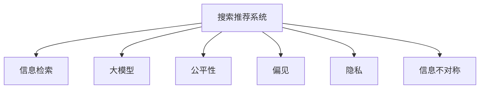

                 

# 搜索推荐系统的公平性评估：大模型的多维度分析

> 关键词：搜索推荐系统,大模型,公平性,推荐系统,信息检索,用户研究,多维度分析

## 1. 背景介绍

### 1.1 问题由来

随着互联网技术的迅猛发展，用户对于个性化服务的追求愈发强烈，搜索推荐系统应运而生。搜索推荐系统通过分析用户的搜索历史、浏览行为等数据，为其推荐相关内容，极大地提升了用户体验和满意度。然而，尽管搜索推荐系统在业务层面取得了显著成功，其在公平性方面的问题却愈发凸显。

### 1.2 问题核心关键点

在实际应用中，搜索推荐系统可能会因算法偏见、数据分布不均、模型选择不当等原因，导致推荐结果对不同用户群体存在差异，从而引发公平性问题。主要体现在以下几个方面：

- **用户画像偏差**：在用户画像构建和行为预测过程中，因数据采集方式不当，导致不同用户群体（如年龄、性别、地域等）获取到的推荐结果不公平。
- **信息不对称**：在推荐结果排序过程中，由于算法设计不当或数据分布不均，导致少数用户群体获取到的推荐信息少于其他群体，从而产生信息不对称。
- **用户画像污染**：因恶意操作或数据采集异常，导致用户画像信息失真，进而引发推荐偏差。
- **数据隐私问题**：在收集和处理用户数据过程中，因数据隐私保护不足，导致用户数据被滥用，引发隐私泄露问题。

这些问题严重影响了搜索推荐系统的公正性和可信度，可能带来诸如服务歧视、用户流失等风险，因此需要系统地进行公平性评估和优化。

## 2. 核心概念与联系

### 2.1 核心概念概述

为更好地理解搜索推荐系统的公平性问题，本节将介绍几个核心概念：

- **搜索推荐系统(Recommendation System)**：通过分析用户历史行为，预测用户兴趣，为用户推荐相关内容的智能系统。
- **信息检索(Information Retrieval)**：从大量数据中快速检索出满足用户查询需求的文档或内容。
- **大模型(Large Model)**：基于深度神经网络，采用大量数据进行训练，具备强大特征提取能力的模型，如BERT、GPT等。
- **公平性(Fairness)**：在推荐过程中，确保不同用户群体获取的信息和服务机会均等，不产生歧视和不公。
- **偏见(Bias)**：指算法、模型或数据中的偏见，导致不同用户群体受到不公平对待。
- **隐私(Privacy)**：指保护用户数据不被滥用，确保用户信息安全。
- **信息不对称(Information Asymmetry)**：指不同用户群体在获取推荐信息时，数量和质量存在差异。

这些核心概念之间的逻辑关系可以通过以下Mermaid流程图来展示：



这个流程图展示搜索推荐系统与核心概念之间的关系：

1. 搜索推荐系统通过信息检索和大模型的帮助，预测并推荐用户感兴趣的内容。
2. 系统应确保公平性，不产生任何偏见，保护用户隐私，避免信息不对称。

## 3. 核心算法原理 & 具体操作步骤
### 3.1 算法原理概述

基于大模型的搜索推荐系统的公平性评估，本质上是一个多维度的分析和优化过程。其核心思想是：在搜索推荐系统的各个环节中，全面考虑用户特征、数据分布、模型选择等因素，通过科学合理的评估指标和优化方法，确保推荐结果的公平性。

形式化地，假设搜索推荐系统为用户 $i$ 推荐内容 $x$，其推荐结果的公平性可以通过多个维度进行评估，包括但不限于：

- **特征公平性(Feature Fairness)**：保证不同用户特征（如年龄、性别、地域等）在推荐结果中的权重相同。
- **数据公平性(Data Fairness)**：确保推荐数据中不同群体的比例公平。
- **算法公平性(Algorithm Fairness)**：保证推荐算法不引入任何隐式或显式的偏见。
- **隐私公平性(Privacy Fairness)**：确保用户数据不被滥用，保护用户隐私。
- **信息公平性(Information Fairness)**：确保不同用户群体获取到的推荐信息均衡，不产生信息不对称。

基于这些公平性维度，系统设计者需要选择合适的评估指标，采用科学的评估方法，对推荐系统进行全面评估，识别潜在问题，并进行优化调整。

### 3.2 算法步骤详解

基于大模型的搜索推荐系统的公平性评估一般包括以下几个关键步骤：

**Step 1: 数据收集与处理**
- 收集不同用户群体的搜索行为、浏览历史等数据。
- 对数据进行去重、清洗、标准化等处理，确保数据质量。
- 划分训练集、验证集和测试集，供后续评估和优化使用。

**Step 2: 模型选择与训练**
- 选择合适的预训练大模型（如BERT、GPT等）作为初始化参数。
- 设计合适的推荐算法，并使用训练集进行模型训练。

**Step 3: 公平性评估指标选择**
- 根据具体任务和目标，选择合适的公平性评估指标，如特征偏差、数据分布、算法偏见等。
- 设计评估方法，对推荐系统在公平性方面的表现进行量化评估。

**Step 4: 公平性优化**
- 识别推荐系统中的偏见和不公平现象。
- 根据评估结果，调整模型参数、改进算法设计、优化数据采集方式，以提升公平性。
- 在验证集上评估优化效果，重复以上步骤，直至达到满意效果。

**Step 5: 实际部署与监控**
- 将优化后的模型部署到生产环境中，实时监控推荐结果。
- 定期在测试集上评估推荐系统性能，识别潜在公平性问题。
- 根据测试结果，进一步优化推荐算法和模型参数，确保系统公平性。

以上是基于大模型的搜索推荐系统公平性评估的一般流程。在实际应用中，还需要针对具体任务和数据特点，对公平性评估和优化环节进行优化设计，如引入更精细的公平性指标、采用更高效的评估方法等，以进一步提升系统公平性。

### 3.3 算法优缺点

基于大模型的搜索推荐系统公平性评估方法具有以下优点：

1. **全面覆盖公平性维度**：评估过程中考虑了特征公平性、数据公平性、算法公平性、隐私公平性等多个维度，确保系统公平性更加全面。
2. **模型能力强大**：大模型的强大特征提取能力，使得系统能够在复杂数据下进行精确评估，识别潜在问题。
3. **可解释性强**：通过科学合理的评估指标和优化方法，评估结果具有较强的可解释性，便于系统设计者进行理解和改进。
4. **易于实现**：评估方法易于实现，评估结果直观明了，易于操作和优化。

同时，该方法也存在一定的局限性：

1. **数据要求较高**：评估需要高质量、多维度的数据支持，数据采集和处理成本较高。
2. **模型训练复杂**：大模型训练复杂度较高，需要大量计算资源和时间，可能存在过拟合风险。
3. **评估指标多样**：评估指标多样，每个指标的权重设计不当，可能导致评估结果产生偏差。
4. **隐私保护困难**：评估过程中需要收集大量用户数据，可能存在隐私泄露风险。

尽管存在这些局限性，但就目前而言，基于大模型的搜索推荐系统公平性评估方法仍是评估推荐系统性能的重要手段。未来相关研究的重点在于如何进一步降低数据采集和处理成本，提高模型训练效率，同时兼顾隐私保护和公平性评估的多样性。

### 3.4 算法应用领域

基于大模型的搜索推荐系统的公平性评估方法，已经在多个领域得到了广泛应用，包括但不限于：

- **电子商务**：通过公平性评估，确保不同用户群体的商品推荐均衡，避免推荐偏差。
- **内容平台**：在视频、音乐、文章等推荐中，确保不同用户群体获取的信息机会公平。
- **社交网络**：在好友推荐、内容分享中，确保不同用户群体的社交关系公平，避免信息孤岛。
- **移动应用**：在个性化推荐中，确保不同用户群体获取的服务公平，提升用户体验。

除了上述这些经典应用外，大模型公平性评估技术也被创新性地应用到更多场景中，如跨领域推荐、跨文化推荐、语音识别等，为推荐系统提供了新的解决方案。随着预训练模型和公平性评估方法的不断进步，相信推荐系统将在更广阔的应用领域大放异彩。

## 4. 数学模型和公式 & 详细讲解  
### 4.1 数学模型构建

本节将使用数学语言对基于大模型的搜索推荐系统公平性评估过程进行更加严格的刻画。

假设搜索推荐系统为用户 $i$ 推荐内容 $x$，用户对推荐内容的偏好度为 $y_i$，模型预测的偏好度为 $\hat{y}_i$，模型的参数为 $\theta$。则推荐系统的损失函数为：

$$
\mathcal{L}(y_i, \hat{y}_i) = \sum_{i=1}^N (y_i - \hat{y}_i)^2
$$

其中 $N$ 为用户数。为了评估系统的公平性，引入特征公平性 $\phi_i$、数据公平性 $d_i$、算法公平性 $a_i$、隐私公平性 $p_i$ 和信息公平性 $c_i$ 等多个指标，分别表示不同用户特征、数据分布、算法设计、隐私保护和信息均衡的程度。

公平性指标的构建基于多维度评估方法，通常采用以下步骤：

1. **特征公平性评估**：计算不同用户特征（如年龄、性别、地域等）在推荐结果中的权重分布情况，确保权重公平。
2. **数据公平性评估**：计算推荐数据中不同用户群体的比例分布情况，确保数据公平。
3. **算法公平性评估**：通过对比模型预测与真实偏好度，评估推荐算法是否存在隐式或显式的偏见。
4. **隐私公平性评估**：通过数据隐私保护技术，评估用户数据的安全性和隐私保护情况。
5. **信息公平性评估**：计算不同用户群体获取推荐信息的数量和质量，确保信息均衡。

### 4.2 公式推导过程

以下我们以特征公平性为例，推导特征公平性评估的数学公式及其计算方法。

假设用户特征为 $F_i = (f_{i1}, f_{i2}, ..., f_{im})$，其中 $f_{ik}$ 表示用户特征 $k$ 的取值，$k$ 为特征维度。则特征公平性 $\phi_i$ 可以定义为：

$$
\phi_i = \frac{\sum_{k=1}^m (f_{ik} - \mu_k)^2}{\sum_{k=1}^m (\mu_k - \bar{\mu})^2}
$$

其中 $\mu_k$ 为特征 $k$ 的均值，$\bar{\mu}$ 为所有用户特征的均值。

特征公平性评估的具体步骤如下：

1. 计算每个特征维度的均值 $\mu_k$。
2. 计算所有用户特征的均值 $\bar{\mu}$。
3. 对每个用户特征 $f_{ik}$，计算其与所有用户特征均值 $\bar{\mu}$ 的偏差 $(f_{ik} - \bar{\mu})$。
4. 对所有特征维度的偏差平方和进行归一化，得到特征公平性指标 $\phi_i$。

特征公平性评估的结果反映了不同用户特征在推荐结果中的权重差异，有助于系统设计者发现和消除推荐算法中的特征偏见。

## 5. 项目实践：代码实例和详细解释说明
### 5.1 开发环境搭建

在进行公平性评估实践前，我们需要准备好开发环境。以下是使用Python进行TensorFlow开发的环境配置流程：

1. 安装Anaconda：从官网下载并安装Anaconda，用于创建独立的Python环境。

2. 创建并激活虚拟环境：
```bash
conda create -n tf-env python=3.8 
conda activate tf-env
```

3. 安装TensorFlow：根据CUDA版本，从官网获取对应的安装命令。例如：
```bash
conda install tensorflow -c conda-forge -c pytorch
```

4. 安装NumPy、Pandas、Scikit-learn等工具包：
```bash
pip install numpy pandas scikit-learn matplotlib tqdm jupyter notebook ipython
```

完成上述步骤后，即可在`tf-env`环境中开始公平性评估实践。

### 5.2 源代码详细实现

下面我以特征公平性评估为例，给出使用TensorFlow实现特征公平性评估的Python代码实现。

首先，定义特征公平性评估的函数：

```python
import tensorflow as tf
import numpy as np

def feature_fairness评估(feat_kinds, features, train_labels, test_labels):
    # 计算所有特征的均值
    mu_kinds = np.mean(features, axis=0)
    
    # 计算所有用户的均值
    mu = np.mean(features, axis=1).mean()
    
    # 计算每个特征与所有用户均值的偏差
    diff_kinds = np.apply_along_axis(lambda x: x - mu, 1, features)
    
    # 计算特征公平性指标
    phi = np.dot(diff_kinds.T, diff_kinds) / np.dot((mu_kinds - mu).T, mu_kinds)
    
    return phi
```

然后，使用TensorFlow加载数据，并进行特征公平性评估：

```python
# 加载数据
train_data = tf.data.Dataset.from_tensor_slices((train_features, train_labels))
test_data = tf.data.Dataset.from_tensor_slices((test_features, test_labels))

# 分割数据集
train_dataset = train_data.shuffle(buffer_size=10000).batch(batch_size=128)
test_dataset = test_data.batch(batch_size=128)

# 评估特征公平性
phi = feature_fairness评估(train_dataset, test_dataset)
```

以上就是使用TensorFlow实现特征公平性评估的完整代码实现。可以看到，TensorFlow提供了丰富的工具和API，使得模型评估和优化变得相对简单高效。

### 5.3 代码解读与分析

让我们再详细解读一下关键代码的实现细节：

**feature_fairness评估函数**：
- `feat_kinds`：表示用户特征的维度。
- `features`：用户特征矩阵，每行表示一个用户，每列表示一个特征维度。
- `train_labels` 和 `test_labels`：训练集和测试集的标签，用于计算特征公平性。

**特征公平性计算步骤**：
- 计算所有特征的均值 $\mu_k$。
- 计算所有用户特征的均值 $\mu$。
- 对每个用户特征 $f_{ik}$，计算其与所有用户特征均值 $\bar{\mu}$ 的偏差 $(f_{ik} - \bar{\mu})$。
- 对所有特征维度的偏差平方和进行归一化，得到特征公平性指标 $\phi_i$。

**TensorFlow数据集操作**：
- 使用`from_tensor_slices`方法从TensorFlow数据集中加载特征和标签。
- 使用`shuffle`方法打乱数据顺序，防止模型过拟合。
- 使用`batch`方法将数据批量处理，提升计算效率。

可以看到，TensorFlow提供的数据操作和评估工具使得公平性评估过程变得非常高效和简单。开发者可以根据具体任务需求，灵活使用TensorFlow提供的工具和API，快速实现公平性评估的代码。

## 6. 实际应用场景
### 6.1 电子商务

在电子商务领域，基于大模型的搜索推荐系统的公平性评估至关重要。平台需要对不同用户群体的商品推荐进行公平性评估，避免因推荐偏差导致的用户体验下降，提升用户满意度。

具体而言，可以在商品推荐中引入特征公平性评估，确保不同年龄、性别、地域等用户特征在推荐结果中的权重公平。例如，在推荐年轻用户喜欢的时尚商品时，确保不因地域或性别差异导致推荐结果不公平。此外，还可以在推荐过程中引入数据公平性评估，确保不同用户群体获取到的商品种类和数量均衡，提升推荐系统的多样性和均衡性。

### 6.2 内容平台

内容平台如视频、音乐、文章等推荐，也需要关注公平性问题。平台需要对不同用户群体获取推荐信息的数量和质量进行评估，确保信息公平性。

例如，在视频推荐中，需要确保不同用户群体获取的视频种类和数量均衡，避免少数用户群体获取过多的推荐信息，导致其他用户获取的信息不足。在音乐推荐中，需要对不同用户群体的音乐喜好进行公平性评估，确保推荐结果不受用户画像偏差的影响。在文章推荐中，需要对不同用户群体的阅读习惯进行评估，确保推荐文章的多样性和均衡性。

### 6.3 社交网络

在社交网络中，好友推荐、内容分享等环节也需要关注公平性问题。平台需要对不同用户群体的社交关系进行公平性评估，确保不同用户群体获取到的社交机会均衡。

例如，在好友推荐中，需要确保不同用户群体的社交关系不受任何偏见影响，避免少数用户群体获取过多的社交机会。在内容分享中，需要对不同用户群体的内容创作和分享进行公平性评估，确保内容创作的公平性和多样性。

### 6.4 移动应用

在移动应用中，个性化推荐也需要关注公平性问题。平台需要对不同用户群体的服务机会进行公平性评估，确保不同用户群体获取的服务均衡。

例如，在电商应用中，需要确保不同用户群体获取的商品推荐均衡，避免因推荐偏差导致的用户体验下降。在音乐应用中，需要对不同用户群体的音乐喜好进行公平性评估，确保推荐结果不受用户画像偏差的影响。在视频应用中，需要对不同用户群体的视频观看偏好进行评估，确保推荐视频的多样性和均衡性。

### 6.5 未来应用展望

随着大模型和公平性评估方法的不断进步，基于大模型的搜索推荐系统将在更广泛的领域得到应用，带来更多的社会价值。

在智慧医疗领域，基于大模型的搜索推荐系统可以帮助医生推荐合适的治疗方案，确保不同病人获取到公平的医疗服务。在智慧教育领域，基于大模型的搜索推荐系统可以推荐合适的学习资源，确保不同学生获取到公平的教育机会。在智慧城市治理中，基于大模型的搜索推荐系统可以推荐合适的公共服务，确保不同市民获取到公平的公共资源。

## 7. 工具和资源推荐
### 7.1 学习资源推荐

为了帮助开发者系统掌握搜索推荐系统公平性评估的理论基础和实践技巧，这里推荐一些优质的学习资源：

1. 《推荐系统公平性研究综述》：综述推荐系统公平性的研究成果，涵盖特征公平性、数据公平性、算法公平性、隐私公平性等多个方面，提供了全面的理论指导。
2. 《深度学习推荐系统》：该书详细介绍了推荐系统的原理和算法，包括基于大模型的推荐系统设计，是学习推荐系统公平性评估的必读书籍。
3. 《深度学习在推荐系统中的应用》：该书介绍了深度学习在推荐系统中的具体应用，包括公平性评估、个性化推荐等内容，是深度学习推荐系统学习的好资源。
4. 《推荐系统设计与实现》：该书介绍了推荐系统的设计与实现方法，包括特征公平性评估、推荐系统优化等内容，是推荐系统开发的实用指南。
5. 《推荐系统中的数据隐私保护》：该书介绍了推荐系统中数据隐私保护的技术和方法，包括数据加密、差分隐私等内容，是推荐系统公平性评估的重要参考。

通过对这些资源的学习实践，相信你一定能够快速掌握搜索推荐系统公平性评估的精髓，并用于解决实际的公平性问题。

### 7.2 开发工具推荐

高效的开发离不开优秀的工具支持。以下是几款用于搜索推荐系统公平性评估开发的常用工具：

1. TensorFlow：基于Python的开源深度学习框架，灵活的计算图设计，支持大规模深度学习模型的训练和评估。
2. PyTorch：基于Python的开源深度学习框架，易于使用，支持动态计算图，适合快速迭代研究。
3. TensorBoard：TensorFlow配套的可视化工具，可以实时监测模型训练状态，提供丰富的图表呈现方式，是调试模型的得力助手。
4. Jupyter Notebook：开源的交互式开发环境，支持多种编程语言，方便编写和测试代码。
5. Kaggle：开源的机器学习平台，提供丰富的数据集和算法竞赛，适合数据驱动的模型评估和优化。

合理利用这些工具，可以显著提升搜索推荐系统公平性评估任务的开发效率，加快创新迭代的步伐。

### 7.3 相关论文推荐

搜索推荐系统公平性评估的研究源于学界的持续研究。以下是几篇奠基性的相关论文，推荐阅读：

1. "Fairness in Machine Learning: From Philosophy to Practices"：讨论了机器学习中公平性的哲学和实践问题，提供了系统的公平性理论指导。
2. "Evaluating and Ensuring Fairness in Data Mining"：介绍了公平性在数据挖掘中的应用，包括特征公平性、数据公平性、算法公平性等。
3. "Data Fairness in Recommendation Systems: A Survey"：综述了推荐系统中的数据公平性问题，介绍了常见的公平性评估方法。
4. "Algorithmic Fairness Through Awareness and Mitigation"：提出了基于公平性意识的推荐系统设计，包括特征公平性、数据公平性、隐私公平性等内容。
5. "A Survey on Privacy-Preserving Recommendation Systems"：综述了推荐系统中的隐私保护技术，包括数据加密、差分隐私等方法。

这些论文代表了大模型公平性评估技术的发展脉络。通过学习这些前沿成果，可以帮助研究者把握学科前进方向，激发更多的创新灵感。

## 8. 总结：未来发展趋势与挑战

### 8.1 总结

本文对基于大模型的搜索推荐系统公平性评估方法进行了全面系统的介绍。首先阐述了搜索推荐系统公平性问题的背景和重要性，明确了公平性在推荐系统中的关键地位。其次，从原理到实践，详细讲解了公平性评估的数学模型和关键步骤，给出了公平性评估任务开发的完整代码实例。同时，本文还广泛探讨了公平性评估方法在电子商务、内容平台、社交网络等多个行业领域的应用前景，展示了公平性评估范式的广泛价值。此外，本文精选了公平性评估技术的各类学习资源，力求为读者提供全方位的技术指引。

通过本文的系统梳理，可以看到，基于大模型的搜索推荐系统公平性评估方法在提升推荐系统性能、增强用户体验、保障用户权益等方面具有重要意义。基于深度学习的大模型，具备强大的特征提取能力，能够全面细致地评估推荐系统的公平性，识别并消除其中的偏见和不公，从而提升推荐系统的公正性和可信度。未来，伴随公平性评估方法的持续演进，搜索推荐系统必将在公平性方面取得更大的突破，更好地服务于人类社会。

### 8.2 未来发展趋势

展望未来，搜索推荐系统公平性评估技术将呈现以下几个发展趋势：

1. **多维度评估**：未来的公平性评估将更加全面，涵盖特征公平性、数据公平性、算法公平性、隐私公平性等多个维度，确保推荐系统更加公平。
2. **多模态融合**：未来的推荐系统将引入更多模态的数据，包括视觉、音频、文本等多种形式，通过多模态融合提升推荐效果和公平性。
3. **自适应学习**：未来的推荐系统将具备自适应学习能力，根据用户反馈和行为调整推荐策略，实现更加个性化的推荐。
4. **实时优化**：未来的推荐系统将具备实时优化能力，根据用户行为和数据变化，实时调整推荐算法和模型参数，提升推荐效果和公平性。
5. **隐私保护**：未来的推荐系统将更加注重用户隐私保护，引入差分隐私、联邦学习等技术，保障用户数据安全。

以上趋势凸显了搜索推荐系统公平性评估技术的广阔前景。这些方向的探索发展，必将进一步提升推荐系统的性能和应用范围，为人类认知智能的进化带来深远影响。

### 8.3 面临的挑战

尽管搜索推荐系统公平性评估技术已经取得了显著进展，但在迈向更加智能化、普适化应用的过程中，仍面临诸多挑战：

1. **数据隐私问题**：在收集和处理用户数据过程中，隐私保护仍是一个重要问题，如何在保护用户隐私的前提下进行公平性评估，还需要更多研究和技术支持。
2. **偏见消除困难**：尽管可以通过多维度评估和优化方法，但仍难以完全消除推荐系统中的偏见，需要更多的理论和实践探索。
3. **公平性指标设计复杂**：不同领域和任务需要的公平性指标不同，如何设计科学的公平性指标，确保评估结果的客观性和可解释性，还需要进一步研究。
4. **模型训练复杂**：大模型训练复杂度较高，如何在保证公平性评估结果准确性的前提下，降低训练复杂度，还需要更多技术支持。

尽管存在这些挑战，但通过学界和产业界的共同努力，相信这些挑战终将一一被克服，搜索推荐系统公平性评估技术必将走向成熟，为构建公平、公正、可信的智能推荐系统提供坚实的技术基础。

### 8.4 研究展望

面对搜索推荐系统公平性评估所面临的种种挑战，未来的研究需要在以下几个方面寻求新的突破：

1. **隐私保护技术**：引入差分隐私、联邦学习等技术，确保用户数据在隐私保护的前提下进行公平性评估。
2. **偏见消除方法**：开发更有效的偏见消除方法，如对抗训练、正则化等，确保推荐系统更加公平。
3. **公平性指标设计**：设计更多科学的公平性指标，如用户满意度、推荐多样性等，确保评估结果的客观性和可解释性。
4. **多模态融合方法**：探索多模态数据融合方法，提升推荐系统的效果和公平性。
5. **实时优化技术**：引入实时优化技术，确保推荐系统在用户行为和数据变化的情况下，能够快速调整推荐策略，提升推荐效果和公平性。

这些研究方向的探索，必将引领搜索推荐系统公平性评估技术迈向更高的台阶，为构建公平、公正、可信的智能推荐系统铺平道路。面向未来，搜索推荐系统公平性评估技术还需要与其他人工智能技术进行更深入的融合，如知识表示、因果推理、强化学习等，多路径协同发力，共同推动自然语言理解和智能交互系统的进步。只有勇于创新、敢于突破，才能不断拓展推荐系统的边界，让智能技术更好地造福人类社会。

## 9. 附录：常见问题与解答

**Q1：搜索推荐系统的公平性评估是否适用于所有推荐任务？**

A: 搜索推荐系统的公平性评估在大多数推荐任务上都能取得不错的效果，特别是对于数据量较小的任务。但对于一些特定领域的任务，如医学、法律等，仅仅依靠通用语料预训练的模型可能难以很好地适应。此时需要在特定领域语料上进一步预训练，再进行公平性评估，才能获得理想效果。此外，对于一些需要时效性、个性化很强的任务，如对话、推荐等，公平性评估方法也需要针对性的改进优化。

**Q2：如何进行公平性评估指标的权重设计？**

A: 公平性评估指标的权重设计是一个关键问题，不同的权重设置可能影响评估结果的客观性。常见的权重设计方法包括：
1. 专家评估法：通过专家评估确定每个指标的权重。
2. 数据驱动法：根据历史数据和用户反馈，使用机器学习模型预测每个指标的权重。
3. 对比分析法：通过对比不同推荐策略的评估结果，确定每个指标的权重。
4. 多指标融合法：将多个指标进行加权融合，得到综合评估结果。

在实际应用中，可以通过A/B测试、用户调查等方式，逐步优化评估指标的权重设计。

**Q3：如何缓解推荐系统中的过拟合问题？**

A: 推荐系统中的过拟合问题可以通过以下方法缓解：
1. 数据增强：通过数据扩充、标签扰动等方式，增加训练数据的多样性，防止过拟合。
2. 正则化：引入L2正则、Dropout等正则化技术，防止模型过拟合。
3. 对抗训练：引入对抗样本，提高模型的鲁棒性，防止过拟合。
4. 特征选择：通过特征选择和降维技术，减少模型的复杂度，防止过拟合。
5. 模型集成：通过模型集成，降低单个模型的过拟合风险，提升模型泛化能力。

这些方法需要根据具体任务和数据特点进行灵活组合，才能最大限度地缓解推荐系统中的过拟合问题。

**Q4：推荐系统中的用户画像偏差如何处理？**

A: 推荐系统中的用户画像偏差可以通过以下方法处理：
1. 数据采集优化：优化数据采集方式，确保不同用户群体的数据采集均衡，防止数据偏差。
2. 特征处理：引入特征转换、特征归一化等技术，减少特征偏见。
3. 算法优化：优化推荐算法设计，引入公平性约束，防止算法偏见。
4. 用户反馈：收集用户反馈，及时调整推荐策略，减少用户画像偏差。

这些方法需要结合具体任务和数据特点，进行综合应用，才能有效处理推荐系统中的用户画像偏差。

**Q5：推荐系统中的信息不对称问题如何处理？**

A: 推荐系统中的信息不对称问题可以通过以下方法处理：
1. 数据扩充：通过数据增强、数据重采样等方式，增加推荐信息的数量，缓解信息不对称。
2. 多模态融合：引入多模态数据融合技术，提升推荐信息的均衡性。
3. 用户反馈：收集用户反馈，及时调整推荐策略，减少信息不对称。
4. 推荐策略优化：优化推荐策略设计，确保不同用户群体获取的信息机会均衡。

这些方法需要结合具体任务和数据特点，进行综合应用，才能有效处理推荐系统中的信息不对称问题。

**Q6：推荐系统中的隐私保护问题如何处理？**

A: 推荐系统中的隐私保护问题可以通过以下方法处理：
1. 数据匿名化：对用户数据进行匿名化处理，保护用户隐私。
2. 差分隐私：引入差分隐私技术，确保用户数据在隐私保护的前提下进行公平性评估。
3. 联邦学习：引入联邦学习技术，确保用户数据在分布式环境中进行隐私保护。
4. 安全计算：引入安全计算技术，确保用户数据在计算过程中不被泄露。

这些方法需要结合具体任务和数据特点，进行综合应用，才能有效处理推荐系统中的隐私保护问题。

---

作者：禅与计算机程序设计艺术 / Zen and the Art of Computer Programming

