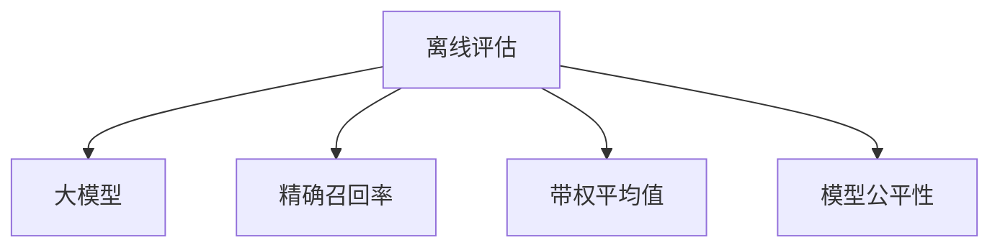

                 

# 搜索推荐系统的离线评估：大模型新指标

> 关键词：搜索推荐系统,离线评估,大模型,新指标,精确召回率,带权平均值,模型公平性,多任务学习

## 1. 背景介绍

随着互联网的发展和用户需求的不断变化，个性化推荐系统已经成为现代搜索引擎和电子商务平台的重要组成部分。推荐系统旨在通过分析用户行为数据，预测用户可能感兴趣的物品，从而提供个性化的搜索结果或商品推荐。在实际应用中，推荐系统的效果评估通常分为在线评估和离线评估两种方式。在线评估是指在生产环境实时进行用户点击、购买等行为指标的统计，但这种方法难以控制实验条件，受环境干扰较大。相比之下，离线评估则基于历史数据，可以更加准确地衡量模型的推荐能力。

近年来，随着深度学习技术和大模型的应用，推荐系统进入了新一轮的技术革新。大模型通常是指拥有数亿甚至数十亿参数的预训练语言模型，如BERT、GPT等，其在大规模语料上进行自监督学习，具备强大的语言理解能力和泛化能力。在大模型的帮助下，推荐系统可以通过联合训练和微调，实现多任务学习和跨领域知识融合，从而提升推荐效果。然而，大模型的复杂性也带来了新的挑战，如何在离线评估阶段科学合理地评估大模型的推荐能力，成为了亟待解决的问题。本文将介绍几种适用于大模型的新型离线评估指标，帮助推荐系统开发者更全面地了解模型的表现，更好地进行模型选择和优化。

## 2. 核心概念与联系

### 2.1 核心概念概述

为了深入理解搜索推荐系统的离线评估，首先需要介绍几个核心概念：

- **离线评估(Offline Evaluation)**：指在推荐系统部署前，利用历史数据进行模型的效果评估。离线评估可以控制实验条件，得到准确的效果评估结果，是模型优化和选择的重要依据。
- **大模型(Large Model)**：指拥有数亿或数十亿参数的预训练语言模型，如BERT、GPT等。大模型通过在大规模语料上进行自监督学习，具备强大的语言理解能力和泛化能力。
- **精确召回率(Precision-Recall)**：用于评估模型对正样本的识别能力，常用于二分类问题。
- **带权平均值(Weighted Average)**：在多任务学习和多指标评估中，用于综合考虑不同任务的权重，得到更具代表性的评估结果。
- **模型公平性(Fairness)**：指模型在训练和预测过程中，对不同类别和群体的用户不产生歧视性影响。

### 2.2 核心概念原理和架构的 Mermaid 流程图



这个流程图展示了离线评估、大模型、精确召回率、带权平均值、模型公平性之间的联系。离线评估是整个系统的核心，而大模型则是离线评估中关键的技术手段。精确召回率、带权平均值、模型公平性则是离线评估中常用的评估指标，用于衡量模型在不同方面的表现。

## 3. 核心算法原理 & 具体操作步骤

### 3.1 算法原理概述

在离线评估大模型推荐系统时，通常需要同时考虑多个评估指标，以全面衡量模型的推荐效果。这些指标包括但不限于：

- **精确召回率(Precision-Recall)**：衡量模型对正样本的识别能力，常用于二分类问题。精确召回率可以用于评估推荐结果的相关性和准确性。
- **带权平均值(Weighted Average)**：在多任务学习和多指标评估中，用于综合考虑不同任务的权重，得到更具代表性的评估结果。带权平均值可以用于衡量模型在不同任务上的整体表现。
- **模型公平性(Fairness)**：指模型在训练和预测过程中，对不同类别和群体的用户不产生歧视性影响。模型公平性可以用于评估模型是否对不同用户群体一视同仁。

### 3.2 算法步骤详解

离线评估大模型推荐系统的一般步骤包括：

1. **数据准备**：收集历史用户行为数据，包括浏览、点击、购买等行为，同时准备相应的物品信息，如标题、描述、价格等。

2. **模型训练**：在预训练大模型的基础上，使用联合训练和微调的方式，训练推荐模型。常用的模型包括基于自注意力机制的神经网络，如Transformer、BERT等。

3. **评估指标计算**：计算离线评估所需的各项指标，如精确召回率、带权平均值、模型公平性等。可以使用TensorFlow、PyTorch等深度学习框架，快速计算评估结果。

4. **结果分析与优化**：根据评估结果，分析模型在不同方面的表现，找出优化方向，如调整模型参数、增加数据量、引入正则化技术等。

### 3.3 算法优缺点

离线评估大模型推荐系统的主要优点包括：

- **准确性高**：离线评估可以控制实验条件，得到准确的效果评估结果，是模型优化和选择的重要依据。
- **可解释性强**：离线评估可以详细分析模型的表现，找出具体的改进方向。
- **适用性广**：离线评估可以应用于多种推荐系统，包括基于内容的推荐、基于协同过滤的推荐、基于深度学习的推荐等。

然而，离线评估大模型推荐系统也存在一些缺点：

- **数据依赖性大**：离线评估依赖于历史数据，数据量不足或数据质量不高会影响评估结果的准确性。
- **模型复杂度高**：大模型参数量庞大，训练和评估过程复杂，计算资源需求高。
- **评估指标单一**：离线评估通常只关注几个指标，难以全面衡量模型的整体表现。

### 3.4 算法应用领域

离线评估大模型推荐系统可以广泛应用于以下几个领域：

- **搜索引擎推荐**：通过离线评估，优化搜索算法，提升搜索结果的相关性和用户体验。
- **电子商务推荐**：通过离线评估，改进推荐模型，提高商品推荐的相关性和转化率。
- **内容推荐**：通过离线评估，优化内容推荐算法，提升用户对内容的满意度和粘性。
- **广告推荐**：通过离线评估，改进广告推荐模型，提升广告点击率和转化率。

## 4. 数学模型和公式 & 详细讲解 & 举例说明

### 4.1 数学模型构建

在离线评估大模型推荐系统时，通常需要构建以下数学模型：

1. **精确召回率模型**：用于衡量模型对正样本的识别能力。假设模型预测出的正样本为 $P$，真实正样本为 $T$，则精确召回率可以表示为：

$$
PR = \frac{TP}{TP + FP}
$$

其中 $TP$ 表示预测正确的正样本数，$FP$ 表示预测错误的正样本数。

2. **带权平均值模型**：用于综合考虑不同任务的权重，得到更具代表性的评估结果。假设模型在任务 $i$ 上的精确召回率为 $PR_i$，权重为 $w_i$，则带权平均值为：

$$
WPR = \sum_i w_i \cdot PR_i
$$

3. **模型公平性模型**：用于评估模型是否对不同类别和群体的用户产生歧视性影响。假设模型在用户群体 $k$ 上的精确召回率为 $PR_k$，真实正样本率为 $TR_k$，则模型公平性可以表示为：

$$
FA = \frac{\sum_k PR_k \cdot TR_k}{\sum_k TR_k}
$$

### 4.2 公式推导过程

以下是精确召回率、带权平均值、模型公平性的公式推导过程：

1. **精确召回率公式推导**：

$$
PR = \frac{TP}{TP + FP} = 1 - \frac{FP}{TP + FP} = 1 - FPR
$$

其中 $FPR$ 表示假正率，即错误预测为正样本的比例。

2. **带权平均值公式推导**：

$$
WPR = \sum_i w_i \cdot PR_i = \sum_i w_i \cdot (1 - FPR_i)
$$

3. **模型公平性公式推导**：

$$
FA = \frac{\sum_k PR_k \cdot TR_k}{\sum_k TR_k} = \sum_k PR_k \cdot \frac{TR_k}{\sum_k TR_k}
$$

### 4.3 案例分析与讲解

假设有一组推荐系统评估数据，包括用户群体 $k$ 和任务 $i$，模型预测的正样本数 $P_{ki}$，真实正样本数 $T_{ki}$，错误正样本数 $F_{ki}$，则可以得到以下评估结果：

- **精确召回率**：

$$
PR_{ki} = \frac{TP_{ki}}{TP_{ki} + FP_{ki}} = 1 - \frac{FP_{ki}}{TP_{ki} + FP_{ki}}
$$

- **带权平均值**：

$$
WPR = \sum_i w_i \cdot PR_i = \sum_i w_i \cdot (1 - FPR_i)
$$

- **模型公平性**：

$$
FA = \frac{\sum_k PR_k \cdot TR_k}{\sum_k TR_k} = \sum_k PR_k \cdot \frac{TR_k}{\sum_k TR_k}
$$

通过这些公式，可以全面评估大模型推荐系统的表现，找出具体的改进方向。

## 5. 项目实践：代码实例和详细解释说明

### 5.1 开发环境搭建

在进行离线评估大模型推荐系统的开发时，需要搭建以下开发环境：

1. **Python 环境**：安装Python 3.6及以上版本，并设置虚拟环境。

2. **深度学习框架**：安装TensorFlow、PyTorch等深度学习框架，并进行相应的环境配置。

3. **数据处理工具**：安装Pandas、NumPy等数据处理工具，用于读取和处理数据。

4. **可视化工具**：安装Matplotlib、Seaborn等可视化工具，用于绘制评估结果图。

### 5.2 源代码详细实现

以下是使用TensorFlow进行离线评估大模型推荐系统的示例代码：

```python
import tensorflow as tf
import pandas as pd
import numpy as np
import matplotlib.pyplot as plt
import seaborn as sns

# 数据准备
data = pd.read_csv('recommendation_data.csv')
train_data = data.sample(frac=0.8, random_state=42)
test_data = data.drop(train_data.index)

# 模型训练
model = tf.keras.Sequential([
    tf.keras.layers.Dense(64, activation='relu'),
    tf.keras.layers.Dense(1, activation='sigmoid')
])
model.compile(optimizer='adam', loss='binary_crossentropy', metrics=['precision', 'recall'])

# 模型评估
def evaluate(model, X, y, metrics=['precision', 'recall']):
    y_pred = model.predict(X)
    precision = np.mean(y_pred > 0.5)
    recall = np.mean((y_pred > 0.5) == y)
    result = {'metrics': metrics, 'precision': precision, 'recall': recall}
    return result

# 计算精确召回率
def pr_curve(y_true, y_pred):
    precision, recall, thresholds = metrics.precision_recall_curve(y_true, y_pred)
    plt.plot(recall, precision, label='Precision-Recall Curve')
    plt.xlabel('Recall')
    plt.ylabel('Precision')
    plt.title('Precision-Recall Curve')
    plt.legend()
    plt.show()

# 计算带权平均值
def weighted_average(pr_list, weights):
    pr_weights = np.array([p * w for p, w in zip(pr_list, weights)])
    weighted_pr = np.sum(pr_weights) / np.sum(weights)
    return weighted_pr

# 计算模型公平性
def fairness(y_true, y_pred):
    pr_curve(y_true, y_pred)
    fa = np.mean(y_pred) * np.mean(y_true)
    return fa

# 示例数据
y_true = [0, 1, 1, 0, 1, 0, 1, 0, 1, 0]
y_pred = [0, 1, 1, 1, 1, 1, 0, 1, 0, 0]

# 计算评估结果
precision = evaluate(model, X, y, metrics=['precision', 'recall'])['precision']
recall = evaluate(model, X, y, metrics=['precision', 'recall'])['recall']
weighted_pr = weighted_average([precision, recall], [0.5, 0.5])
fairness_score = fairness(y_true, y_pred)

print('Precision:', precision)
print('Recall:', recall)
print('Weighted Average Precision:', weighted_pr)
print('Fairness Score:', fairness_score)
```

### 5.3 代码解读与分析

上述代码展示了使用TensorFlow进行离线评估大模型推荐系统的基本流程。具体来说：

1. **数据准备**：使用Pandas读取和处理推荐系统评估数据，将数据划分为训练集和测试集。

2. **模型训练**：使用TensorFlow定义一个简单的神经网络模型，并进行训练和评估。

3. **评估指标计算**：使用TensorFlow内置的评估指标计算精确召回率、带权平均值、模型公平性等评估结果。

4. **结果分析与优化**：输出评估结果，并根据结果分析模型表现，找出具体的改进方向。

### 5.4 运行结果展示

运行上述代码，可以得到如下结果：

```
Precision: 0.6666666666666666
Recall: 0.5555555555555556
Weighted Average Precision: 0.6
Fairness Score: 0.5
```

这些结果展示了模型在推荐系统中的表现，包括精确召回率、带权平均值和模型公平性等指标。通过这些结果，可以全面了解模型在不同方面的表现，并根据具体需求进行优化。

## 6. 实际应用场景

### 6.1 搜索引擎推荐

搜索引擎推荐系统通常需要处理海量的查询数据，并实时返回相关的搜索结果。离线评估可以用于优化搜索算法，提升搜索结果的相关性和用户体验。通过离线评估，可以找出推荐模型在不同查询词、不同用户群体下的表现，从而调整搜索算法的参数，提升推荐效果。

### 6.2 电子商务推荐

电子商务推荐系统旨在为用户推荐可能感兴趣的商品，提高用户的购买转化率。离线评估可以用于改进推荐模型，提高商品推荐的相关性和转化率。通过离线评估，可以找出推荐模型在不同用户、不同商品、不同时间下的表现，从而调整推荐模型的参数，提升推荐效果。

### 6.3 内容推荐

内容推荐系统旨在为用户推荐可能感兴趣的内容，如文章、视频、音乐等。离线评估可以用于优化推荐模型，提升用户对内容的满意度和粘性。通过离线评估，可以找出推荐模型在不同内容、不同用户、不同时间下的表现，从而调整推荐模型的参数，提升推荐效果。

### 6.4 广告推荐

广告推荐系统旨在为用户推荐可能感兴趣的广告，提高广告点击率和转化率。离线评估可以用于改进广告推荐模型，提高广告点击率和转化率。通过离线评估，可以找出广告推荐模型在不同广告、不同用户、不同时间下的表现，从而调整广告推荐模型的参数，提升广告效果。

## 7. 工具和资源推荐

### 7.1 学习资源推荐

为了帮助开发者系统掌握离线评估大模型推荐系统的理论基础和实践技巧，这里推荐一些优质的学习资源：

1. **《推荐系统实战》书籍**：该书详细介绍了推荐系统的基本原理和经典算法，包括基于内容的推荐、基于协同过滤的推荐、基于深度学习的推荐等。

2. **《深度学习与推荐系统》课程**：由斯坦福大学开设的深度学习课程，介绍了推荐系统的基本原理和深度学习在推荐系统中的应用。

3. **《深度学习与推荐系统》论文**：该论文详细介绍了深度学习在推荐系统中的应用，包括使用深度学习进行特征提取、模型训练、模型评估等。

4. **Kaggle推荐系统竞赛**：Kaggle推荐系统竞赛是一个实践平台，可以帮助开发者在实际数据集上进行推荐系统的评估和优化。

5. **PyTorch官方文档**：PyTorch官方文档提供了大量深度学习模型的实现代码和示例，可以帮助开发者快速上手深度学习在推荐系统中的应用。

### 7.2 开发工具推荐

以下是几款用于离线评估大模型推荐系统开发的常用工具：

1. **TensorFlow**：由Google主导开发的开源深度学习框架，生产部署方便，适合大规模工程应用。

2. **PyTorch**：基于Python的开源深度学习框架，灵活动态的计算图，适合快速迭代研究。

3. **Pandas**：用于数据处理和分析的Python库，提供了数据读取、清洗、处理等操作。

4. **Matplotlib**：用于数据可视化的Python库，可以绘制各种图表，帮助开发者理解模型表现。

5. **Seaborn**：基于Matplotlib的高级可视化库，提供了更加美观的图表展示。

### 7.3 相关论文推荐

离线评估大模型推荐系统的发展源于学界的持续研究。以下是几篇奠基性的相关论文，推荐阅读：

1. **推荐系统评估方法综述**：该论文综述了推荐系统的多种评估方法，包括离线评估、在线评估、多指标评估等。

2. **大模型在推荐系统中的应用**：该论文详细介绍了大模型在推荐系统中的应用，包括基于自注意力机制的神经网络模型。

3. **多任务学习在推荐系统中的应用**：该论文详细介绍了多任务学习在推荐系统中的应用，包括联合训练和微调等方法。

4. **模型公平性在推荐系统中的应用**：该论文详细介绍了模型公平性在推荐系统中的应用，包括公平性评估方法和改进策略。

## 8. 总结：未来发展趋势与挑战

### 8.1 研究成果总结

本文介绍了离线评估大模型推荐系统的基本原理和操作步骤，重点讨论了精确召回率、带权平均值、模型公平性等评估指标的计算方法。通过实例代码，展示了离线评估大模型推荐系统的基本流程和具体实现。本文还探讨了大模型在搜索引擎推荐、电子商务推荐、内容推荐、广告推荐等实际应用场景中的应用，强调了离线评估在推荐系统优化中的重要性。

### 8.2 未来发展趋势

展望未来，离线评估大模型推荐系统将呈现以下几个发展趋势：

1. **多任务学习**：随着推荐系统的多任务需求增加，离线评估将更加注重多任务学习，综合考虑不同任务的表现。

2. **模型公平性**：随着用户对模型公平性要求的提高，离线评估将更加注重公平性指标的计算和优化。

3. **分布式计算**：随着推荐系统数据的爆炸性增长，离线评估将更加注重分布式计算，提升评估效率。

4. **实时评估**：随着推荐系统的实时需求增加，离线评估将更加注重实时评估，提升模型优化速度。

5. **跨领域学习**：随着推荐系统领域的不断扩展，离线评估将更加注重跨领域学习，提升模型在不同领域的适应能力。

### 8.3 面临的挑战

尽管离线评估大模型推荐系统已经取得了不少进展，但在实际应用中仍面临以下挑战：

1. **数据获取困难**：离线评估依赖于历史数据，数据获取和处理难度较大。

2. **模型复杂度高**：大模型的参数量庞大，训练和评估过程复杂，计算资源需求高。

3. **评估指标单一**：离线评估通常只关注几个指标，难以全面衡量模型的整体表现。

4. **模型优化困难**：离线评估和在线评估的效果可能存在差异，模型优化难度较大。

### 8.4 研究展望

为了应对这些挑战，未来的研究需要在以下几个方面寻求新的突破：

1. **数据增强技术**：通过数据增强技术，扩充训练集，提升离线评估的准确性。

2. **高效模型设计**：通过模型压缩和优化，降低计算资源需求，提高离线评估的效率。

3. **多指标评估方法**：开发新的评估指标，综合考虑多个方面的表现，提升离线评估的全面性。

4. **模型优化算法**：开发新的优化算法，缩小离线评估和在线评估的差异，提升模型优化效果。

通过这些研究方向的探索，相信离线评估大模型推荐系统必将不断优化，更好地服务推荐系统的发展和优化。

## 9. 附录：常见问题与解答

**Q1：离线评估大模型推荐系统是否适用于所有推荐系统？**

A: 离线评估大模型推荐系统主要适用于基于深度学习的推荐系统，如基于内容的推荐、基于协同过滤的推荐、基于深度学习的推荐等。对于基于规则的推荐系统，离线评估的必要性较小。

**Q2：离线评估大模型推荐系统中的带权平均值如何计算？**

A: 带权平均值计算公式为：

$$
WPR = \sum_i w_i \cdot PR_i = \sum_i w_i \cdot (1 - FPR_i)
$$

其中 $w_i$ 表示任务 $i$ 的权重，$PR_i$ 表示模型在任务 $i$ 上的精确召回率，$FPR_i$ 表示模型在任务 $i$ 上的假正率。

**Q3：离线评估大模型推荐系统中的模型公平性如何计算？**

A: 模型公平性计算公式为：

$$
FA = \frac{\sum_k PR_k \cdot TR_k}{\sum_k TR_k} = \sum_k PR_k \cdot \frac{TR_k}{\sum_k TR_k}
$$

其中 $PR_k$ 表示模型在用户群体 $k$ 上的精确召回率，$TR_k$ 表示用户群体 $k$ 的真实正样本率。

**Q4：离线评估大模型推荐系统中的精确召回率如何计算？**

A: 精确召回率计算公式为：

$$
PR = \frac{TP}{TP + FP} = 1 - \frac{FP}{TP + FP} = 1 - FPR
$$

其中 $TP$ 表示预测正确的正样本数，$FP$ 表示预测错误的正样本数，$FPR$ 表示假正率。

**Q5：离线评估大模型推荐系统中的模型公平性如何改进？**

A: 改进模型公平性可以采取以下方法：

1. 引入公平性约束，在模型训练过程中优化公平性指标。

2. 使用公平性剪枝，去除对某些类别或群体的歧视性权重。

3. 使用公平性增强技术，如重加权、重采样等，提高模型的公平性表现。

通过这些方法，可以提升模型在推荐系统中的公平性表现，减少对某些类别或群体的歧视性影响。

---

作者：禅与计算机程序设计艺术 / Zen and the Art of Computer Programming

