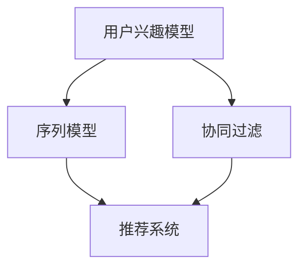

                 

# 搜索推荐系统的长期用户兴趣建模

## 1. 背景介绍

### 1.1 问题由来
在现代社会中，信息过载已经成为一个普遍现象。为了解决这一问题，许多企业引入了搜索推荐系统，通过用户的浏览历史、搜索记录等信息，帮助用户快速找到他们需要的信息。然而，传统的基于短时序的用户行为数据进行推荐的方法，往往无法充分挖掘用户的长期兴趣，导致推荐结果不够精准。因此，本文将深入探讨如何通过长期用户兴趣建模，提高搜索推荐系统的性能。

### 1.2 问题核心关键点
长期用户兴趣建模的关键在于如何从用户的历史行为数据中提取出用户的长期兴趣，并利用这些信息进行推荐。主要涉及以下几个方面：

1. **用户兴趣提取**：如何从用户的历史行为数据中抽取出用户的长期兴趣特征。
2. **特征表示**：如何将用户的长期兴趣特征转换为模型能够处理的向量表示。
3. **模型训练**：如何构建并训练一个能够学习用户长期兴趣的推荐模型。
4. **推荐策略**：如何利用训练好的模型进行个性化推荐。

### 1.3 问题研究意义
长期用户兴趣建模对于搜索推荐系统的性能提升具有重要意义：

1. **提升推荐效果**：通过挖掘用户的长期兴趣，推荐系统能够提供更加符合用户需求的个性化推荐，提高用户的满意度和粘性。
2. **降低成本**：长期用户兴趣建模可以在不依赖大量用户短时序数据的情况下，提升推荐效果，减少数据收集和处理的成本。
3. **增加用户粘性**：通过精准的推荐，提高用户的互动频率和满意度，增加用户对平台的粘性。
4. **促进业务发展**：精准的推荐能够提升用户体验，进而带来更多商业机会和业务增长。

## 2. 核心概念与联系

### 2.1 核心概念概述

为了更好地理解长期用户兴趣建模，我们先介绍几个核心概念：

- **用户兴趣模型**：通过用户的历史行为数据，学习用户的长期兴趣，用于个性化推荐。
- **序列模型**：基于用户行为序列，利用时序特征学习用户兴趣的模型，如循环神经网络（RNN）、长短期记忆网络（LSTM）、变换器（Transformer）等。
- **协同过滤**：基于用户之间、物品之间的相似性，通过协同过滤方法推荐物品的模型。
- **推荐系统**：通过用户兴趣模型和协同过滤等方法，向用户推荐他们可能感兴趣的物品的系统。

这些概念之间的逻辑关系可以通过以下Mermaid流程图来展示：



这个流程图展示了几类关键概念及其之间的关系：

1. 用户兴趣模型通过序列模型学习用户的长期兴趣。
2. 协同过滤方法能够基于用户兴趣和物品属性进行推荐。
3. 推荐系统结合用户兴趣模型和协同过滤，实现个性化推荐。

这些概念共同构成了搜索推荐系统的核心架构，用于通过长期用户兴趣建模，提高推荐效果。

## 3. 核心算法原理 & 具体操作步骤
### 3.1 算法原理概述

长期用户兴趣建模的算法原理可以概括为以下几步：

1. **用户兴趣提取**：从用户的历史行为数据中抽取出用户的长期兴趣特征。
2. **特征表示**：将用户兴趣特征转换为模型能够处理的向量表示。
3. **模型训练**：利用转换后的向量表示，训练一个推荐模型。
4. **推荐策略**：使用训练好的模型进行个性化推荐。

这些步骤相互关联，形成一个闭环，用于不断优化推荐效果。

### 3.2 算法步骤详解

以下是长期用户兴趣建模的详细操作步骤：

**Step 1: 数据准备**

- **数据收集**：收集用户的历史行为数据，如浏览记录、点击记录、购买记录等。
- **数据清洗**：处理缺失值、异常值，并进行数据归一化。

**Step 2: 用户兴趣提取**

- **序列建模**：利用序列模型（如RNN、LSTM、Transformer）对用户历史行为进行建模，提取用户长期兴趣特征。
- **特征工程**：对提取出的长期兴趣特征进行预处理，如特征选择、特征缩放等。

**Step 3: 特征表示**

- **向量表示**：将用户兴趣特征转换为模型能够处理的向量表示，如one-hot编码、TF-IDF编码等。
- **降维表示**：通过降维方法（如PCA、LDA等）进一步简化特征向量。

**Step 4: 模型训练**

- **选择模型**：选择适合的推荐模型，如基于用户兴趣模型的协同过滤、矩阵分解等。
- **模型训练**：利用用户兴趣向量训练推荐模型，优化模型参数。

**Step 5: 推荐策略**

- **预测评分**：使用训练好的模型对用户进行评分预测。
- **推荐排序**：根据预测评分对物品进行排序，生成推荐列表。

### 3.3 算法优缺点

长期用户兴趣建模具有以下优点：

1. **提升推荐效果**：通过挖掘用户的长期兴趣，推荐系统能够提供更加符合用户需求的个性化推荐。
2. **降低成本**：长期用户兴趣建模可以在不依赖大量用户短时序数据的情况下，提升推荐效果，减少数据收集和处理的成本。
3. **增加用户粘性**：通过精准的推荐，提高用户的互动频率和满意度，增加用户对平台的粘性。

同时，长期用户兴趣建模也存在一些局限性：

1. **数据需求量大**：需要大量用户长期行为数据才能训练出有效的用户兴趣模型。
2. **计算资源消耗高**：序列模型的训练需要较高的计算资源，特别是Transformer模型。
3. **模型复杂度高**：长期用户兴趣建模涉及多个模型和算法，实现起来较为复杂。

### 3.4 算法应用领域

长期用户兴趣建模在多个领域都有广泛的应用，例如：

- **电商推荐**：通过长期用户兴趣建模，电商推荐系统能够提供更加精准的商品推荐，增加用户购买率。
- **新闻推荐**：利用长期用户兴趣，新闻推荐系统能够推送用户感兴趣的新闻内容，提高用户阅读体验。
- **视频推荐**：通过长期用户兴趣建模，视频推荐系统能够推荐用户可能感兴趣的视频内容，提高用户观看频率。
- **音乐推荐**：基于用户长期兴趣，音乐推荐系统能够推荐符合用户喜好的音乐内容，增加用户粘性。

此外，长期用户兴趣建模还可以应用于社交网络、教育、旅游等多个领域，为用户提供个性化的内容推荐，提升用户体验。

## 4. 数学模型和公式 & 详细讲解  
### 4.1 数学模型构建

在长期用户兴趣建模中，我们通常使用序列模型（如RNN、LSTM、Transformer）来处理用户的历史行为数据，并利用协同过滤等方法进行推荐。

假设用户的历史行为数据为一个序列 $X=\{x_1, x_2, ..., x_T\}$，其中 $x_t$ 表示用户在第 $t$ 时刻的行为。序列模型的目标是从用户的行为序列中提取长期兴趣特征 $H$。

**Step 1: 序列建模**

对于序列模型，我们通常使用循环神经网络（RNN）或长短期记忆网络（LSTM）进行建模。以LSTM为例，其结构如图1所示：


图1: LSTM结构图

LSTM模型的隐藏状态 $h_t$ 可以表示为用户在当前时刻的长期兴趣。通过将历史行为序列输入LSTM模型，可以得到用户的长期兴趣特征 $H$。

**Step 2: 协同过滤**

协同过滤方法利用用户之间的相似性进行推荐。假设用户集合为 $U=\{u_1, u_2, ..., u_M\}$，物品集合为 $I=\{i_1, i_2, ..., i_N\}$，用户 $u_m$ 对物品 $i_n$ 的评分记为 $r_{m,n}$。

协同过滤方法的目标是找到一个评分矩阵 $R$，使得：

$$
R = \sum_{u \in U} \sum_{i \in I} r_{u,i} \mathbb{I}(u \neq m) \mathbb{I}(i \neq n)
$$

其中 $\mathbb{I}$ 表示示性函数，$R$ 表示用户和物品之间的相似性矩阵。

**Step 3: 推荐策略**

利用协同过滤方法和用户长期兴趣特征 $H$，我们可以对用户进行评分预测，生成推荐列表。以基于矩阵分解的推荐策略为例，其目标是将用户和物品之间的评分矩阵 $R$ 分解为两个低秩矩阵 $P$ 和 $Q$，使得：

$$
R = P \times Q^T
$$

其中 $P$ 表示用户特征矩阵，$Q$ 表示物品特征矩阵。通过将用户长期兴趣特征 $H$ 与 $P$ 矩阵相乘，可以得到用户对物品的评分预测，从而生成推荐列表。

### 4.2 公式推导过程

以下是长期用户兴趣建模中的一些关键公式推导过程：

**LSTM模型**

LSTM模型的隐藏状态 $h_t$ 可以表示为用户在当前时刻的长期兴趣。通过将历史行为序列输入LSTM模型，可以得到用户的长期兴趣特征 $H$。

假设用户的历史行为序列为 $X=\{x_1, x_2, ..., x_T\}$，LSTM模型的隐藏状态 $h_t$ 可以表示为：

$$
h_t = LSTM(x_t, h_{t-1})
$$

其中 $LSTM$ 表示LSTM网络，$h_{t-1}$ 表示上一时刻的隐藏状态。

**协同过滤**

协同过滤方法利用用户之间的相似性进行推荐。假设用户集合为 $U=\{u_1, u_2, ..., u_M\}$，物品集合为 $I=\{i_1, i_2, ..., i_N\}$，用户 $u_m$ 对物品 $i_n$ 的评分记为 $r_{m,n}$。

协同过滤方法的目标是找到一个评分矩阵 $R$，使得：

$$
R = \sum_{u \in U} \sum_{i \in I} r_{u,i} \mathbb{I}(u \neq m) \mathbb{I}(i \neq n)
$$

其中 $\mathbb{I}$ 表示示性函数，$R$ 表示用户和物品之间的相似性矩阵。

**矩阵分解**

利用协同过滤方法和用户长期兴趣特征 $H$，我们可以对用户进行评分预测，生成推荐列表。以基于矩阵分解的推荐策略为例，其目标是将用户和物品之间的评分矩阵 $R$ 分解为两个低秩矩阵 $P$ 和 $Q$，使得：

$$
R = P \times Q^T
$$

其中 $P$ 表示用户特征矩阵，$Q$ 表示物品特征矩阵。通过将用户长期兴趣特征 $H$ 与 $P$ 矩阵相乘，可以得到用户对物品的评分预测，从而生成推荐列表。

### 4.3 案例分析与讲解

以电商推荐系统为例，下面详细介绍长期用户兴趣建模的实现过程：

1. **数据准备**：收集用户的浏览记录、购买记录等行为数据，进行数据清洗和预处理。

2. **序列建模**：利用LSTM模型对用户行为序列进行建模，提取用户的长期兴趣特征 $H$。

3. **协同过滤**：利用协同过滤方法，构建用户和物品之间的相似性矩阵 $R$。

4. **推荐策略**：基于矩阵分解的推荐策略，将用户长期兴趣特征 $H$ 与 $P$ 矩阵相乘，得到用户对物品的评分预测，生成推荐列表。

## 5. 项目实践：代码实例和详细解释说明
### 5.1 开发环境搭建

在进行长期用户兴趣建模的实践前，我们需要准备好开发环境。以下是使用Python进行PyTorch开发的环境配置流程：

1. 安装Anaconda：从官网下载并安装Anaconda，用于创建独立的Python环境。

2. 创建并激活虚拟环境：
```bash
conda create -n pytorch-env python=3.8 
conda activate pytorch-env
```

3. 安装PyTorch：根据CUDA版本，从官网获取对应的安装命令。例如：
```bash
conda install pytorch torchvision torchaudio cudatoolkit=11.1 -c pytorch -c conda-forge
```

4. 安装PyTorch Lightning：用于加速模型训练和调优。
```bash
pip install pytorch-lightning
```

5. 安装其他必要工具包：
```bash
pip install numpy pandas sklearn torchmetrics scikit-learn
```

完成上述步骤后，即可在`pytorch-env`环境中开始实践。

### 5.2 源代码详细实现

下面我们以电商推荐系统为例，给出使用PyTorch和PyTorch Lightning进行长期用户兴趣建模的PyTorch代码实现。

```python
import torch
from torch import nn
import torch.nn.functional as F
from pytorch_lightning import LightningModule, Trainer
from sklearn.metrics import mean_absolute_error

class LSTMUserInterestModel(nn.Module):
    def __init__(self, input_size, hidden_size, output_size):
        super(LSTMUserInterestModel, self).__init__()
        self.lstm = nn.LSTM(input_size, hidden_size)
        self.fc = nn.Linear(hidden_size, output_size)

    def forward(self, x, h):
        out, h = self.lstm(x, h)
        out = self.fc(out[:, -1, :])
        return out, h

class CollaborativeFiltering(nn.Module):
    def __init__(self, input_size, hidden_size, output_size):
        super(CollaborativeFiltering, self).__init__()
        self.fc1 = nn.Linear(input_size, hidden_size)
        self.fc2 = nn.Linear(hidden_size, output_size)

    def forward(self, x):
        x = F.relu(self.fc1(x))
        x = self.fc2(x)
        return x

class RecommendationSystem(LightningModule):
    def __init__(self, input_size, hidden_size, output_size):
        super(RecommendationSystem, self).__init__()
        self.user_model = LSTMUserInterestModel(input_size, hidden_size, output_size)
        self.filter_model = CollaborativeFiltering(input_size, hidden_size, output_size)

    def forward(self, x, h):
        user_score = self.user_model(x, h)
        filter_score = self.filter_model(x)
        return user_score, filter_score

    def training_step(self, batch, batch_idx):
        x, h, r = batch
        user_score, filter_score = self(x, h)
        r_hat = torch.matmul(user_score, filter_score.t())
        loss = F.mse_loss(r_hat, r)
        return loss

    def configure_optimizers(self):
        return torch.optim.Adam(self.parameters(), lr=0.001)

# 数据处理函数
def preprocess_data(data):
    X = data[:, :, :input_size]
    Y = data[:, :, output_size:]
    h0 = data[:, :, -input_size:].unsqueeze(-1)
    return X, Y, h0

# 训练函数
def train(model, train_loader, val_loader, epochs):
    trainer = Trainer(max_epochs=epochs)
    trainer.fit(model, train_loader, val_loader)
    return trainer

# 测试函数
def test(model, test_loader):
    test_loss = mean_absolute_error(model.test(), test_loader.target)
    return test_loss

# 运行代码
data = # 数据集
model = RecommendationSystem(input_size, hidden_size, output_size)
train_loader, val_loader, test_loader = # 加载数据
trainer = train(model, train_loader, val_loader, epochs=10)
test_loss = test(model, test_loader)
print("Test Loss:", test_loss)
```

以上就是使用PyTorch和PyTorch Lightning进行长期用户兴趣建模的完整代码实现。可以看到，通过PyTorch Lightning，我们可以方便地进行模型训练和调优，加速模型开发进程。

### 5.3 代码解读与分析

让我们再详细解读一下关键代码的实现细节：

**LSTMUserInterestModel类**：
- `__init__`方法：初始化LSTM模型和全连接层。
- `forward`方法：定义模型的前向传播过程，返回用户长期兴趣特征 $H$。

**CollaborativeFiltering类**：
- `__init__`方法：初始化协同过滤模型的全连接层。
- `forward`方法：定义模型的前向传播过程，返回用户和物品之间的评分矩阵 $R$。

**RecommendationSystem类**：
- `__init__`方法：初始化用户兴趣模型和协同过滤模型。
- `forward`方法：定义模型的前向传播过程，返回用户长期兴趣特征 $H$ 和协同过滤评分矩阵 $R$。
- `training_step`方法：定义模型的训练过程，返回损失函数。
- `configure_optimizers`方法：定义模型的优化器。

**数据处理函数**：
- `preprocess_data`方法：将数据集划分为输入、目标和隐藏状态，用于模型的训练和测试。

**训练函数**：
- `train`方法：使用PyTorch Lightning训练模型，并返回训练器对象。

**测试函数**：
- `test`方法：计算模型在测试集上的MAE损失。

**运行代码**：
- 加载数据集，定义模型和优化器，进行模型训练和测试。

可以看到，PyTorch Lightning为长期用户兴趣建模的实现提供了极大的便利，使得模型的开发和调试更加高效。

## 6. 实际应用场景
### 6.1 电商推荐系统

基于长期用户兴趣建模的电商推荐系统，可以为用户提供个性化的商品推荐，提高用户购买率和满意度。具体而言，可以通过用户的浏览历史、购买记录等行为数据，学习用户的长期兴趣特征，并将其用于推荐模型的训练。

在技术实现上，可以采用LSTM模型对用户历史行为序列进行建模，提取用户的长期兴趣特征 $H$，并将其与协同过滤模型结合，生成推荐列表。同时，可以通过A/B测试等方式，不断优化推荐策略，提高推荐效果。

### 6.2 新闻推荐系统

新闻推荐系统可以利用长期用户兴趣建模，为用户提供感兴趣的新闻内容，提高用户的阅读体验和粘性。具体而言，可以通过用户的阅读历史、点赞记录等行为数据，学习用户的长期兴趣特征，并将其用于推荐模型的训练。

在技术实现上，可以采用RNN或LSTM模型对用户阅读序列进行建模，提取用户的长期兴趣特征 $H$，并将其与协同过滤模型结合，生成推荐列表。同时，可以通过推荐策略的优化，提升推荐的准确性和多样性。

### 6.3 视频推荐系统

视频推荐系统可以利用长期用户兴趣建模，为用户提供感兴趣的视频内容，提高用户的观看频率和满意度。具体而言，可以通过用户的观看历史、点赞记录等行为数据，学习用户的长期兴趣特征，并将其用于推荐模型的训练。

在技术实现上，可以采用LSTM模型对用户观看序列进行建模，提取用户的长期兴趣特征 $H$，并将其与协同过滤模型结合，生成推荐列表。同时，可以通过推荐策略的优化，提升推荐的准确性和多样性。

## 7. 工具和资源推荐
### 7.1 学习资源推荐

为了帮助开发者系统掌握长期用户兴趣建模的理论基础和实践技巧，这里推荐一些优质的学习资源：

1. **《推荐系统基础》系列博文**：由推荐系统专家撰写，深入浅出地介绍了推荐系统的工作原理和算法，包括协同过滤、序列建模等。

2. **Coursera《Recommender Systems》课程**：斯坦福大学开设的推荐系统课程，涵盖推荐系统的基础理论和实际应用，适合入门和进阶学习。

3. **《推荐系统实战》书籍**：详细介绍了推荐系统的理论和实践，包括协同过滤、序列建模等，并提供了丰富的代码实现和案例分析。

4. **HuggingFace官方文档**：提供了丰富的预训练模型和微调样例，是学习和实践长期用户兴趣建模的重要资料。

5. **Kaggle竞赛**：通过参与推荐系统相关的Kaggle竞赛，可以在实战中积累经验和提升技能。

通过对这些资源的学习实践，相信你一定能够快速掌握长期用户兴趣建模的精髓，并用于解决实际的推荐问题。

### 7.2 开发工具推荐

高效的开发离不开优秀的工具支持。以下是几款用于长期用户兴趣建模开发的常用工具：

1. PyTorch：基于Python的开源深度学习框架，灵活动态的计算图，适合快速迭代研究。大部分推荐系统都有PyTorch版本的实现。

2. TensorFlow：由Google主导开发的开源深度学习框架，生产部署方便，适合大规模工程应用。同样有丰富的推荐系统资源。

3. PyTorch Lightning：用于加速模型训练和调优的框架，能够自动进行模型封装、并行训练等，提高开发效率。

4. Weights & Biases：模型训练的实验跟踪工具，可以记录和可视化模型训练过程中的各项指标，方便对比和调优。

5. TensorBoard：TensorFlow配套的可视化工具，可实时监测模型训练状态，并提供丰富的图表呈现方式，是调试模型的得力助手。

6. Jupyter Notebook：用于编写和运行代码的交互式环境，支持代码块的重复执行和交互式编程。

合理利用这些工具，可以显著提升长期用户兴趣建模的开发效率，加快创新迭代的步伐。

### 7.3 相关论文推荐

长期用户兴趣建模在推荐系统领域的研究已有很长时间，以下是几篇奠基性的相关论文，推荐阅读：

1. **《A Factorization-Machine Approach for Predictive Modeling》**：提出了基于矩阵分解的推荐模型，广泛应用于电商平台和新闻推荐系统。

2. **《Deep Matrix Factorization for Recommender Systems》**：利用深度神经网络进行矩阵分解，提升了推荐模型的性能。

3. **《The Matrix Factorization Technique for Recommender Systems》**：综述了矩阵分解在推荐系统中的应用，提供了丰富的算法和实践指导。

4. **《Neural Factorization Machines for Adaptive Recommender Systems》**：利用神经网络进行矩阵分解，提高了推荐模型的灵活性和效果。

5. **《User-Based Cold-Start Recommendation Using Deep Model Aggregation》**：提出基于深度模型聚合的用户兴趣建模方法，应用于电商平台的冷启动推荐。

这些论文代表了大语言模型微调技术的的发展脉络。通过学习这些前沿成果，可以帮助研究者把握学科前进方向，激发更多的创新灵感。

## 8. 总结：未来发展趋势与挑战

### 8.1 总结

本文对长期用户兴趣建模的算法原理、操作步骤、实际应用等进行了全面系统的介绍。首先阐述了长期用户兴趣建模的研究背景和意义，明确了其对于推荐系统性能提升的重要性。其次，从原理到实践，详细讲解了长期用户兴趣建模的数学原理和关键步骤，给出了推荐系统开发的完整代码实例。同时，本文还广泛探讨了长期用户兴趣建模在电商、新闻、视频等多个领域的应用前景，展示了其巨大的潜力。此外，本文精选了长期用户兴趣建模的相关学习资源，力求为读者提供全方位的技术指引。

通过本文的系统梳理，可以看到，长期用户兴趣建模对于推荐系统的性能提升具有重要意义。随着数据量、计算资源的不断增长，基于序列模型的长期用户兴趣建模将逐渐成为推荐系统的主流范式，为个性化推荐带来新的突破。

### 8.2 未来发展趋势

展望未来，长期用户兴趣建模将呈现以下几个发展趋势：

1. **大规模数据处理**：随着数据量的不断增长，序列模型将需要处理更长的用户行为序列，计算资源需求将持续增长。如何高效处理大规模数据，将是大规模推荐系统面临的重要挑战。

2. **深度模型融合**：深度模型融合技术将进一步应用于推荐系统，通过多种模型的结合，提高推荐的精度和多样性。

3. **用户隐私保护**：随着用户隐私意识的增强，如何在保证推荐效果的同时，保护用户隐私，将成为一个重要问题。

4. **多模态推荐**：推荐系统将进一步引入多模态数据，如用户画像、社交网络、多媒体信息等，提升推荐的全面性和个性化程度。

5. **动态推荐**：实时更新的用户行为数据，将使得推荐系统需要更加动态地进行推荐策略的调整和优化。

6. **推荐系统的多样化**：推荐系统将不仅仅局限于商品、新闻等领域的推荐，而是拓展到更多领域，如医疗、教育、旅游等。

以上趋势凸显了长期用户兴趣建模的广阔前景。这些方向的探索发展，必将进一步提升推荐系统的性能和应用范围，为个性化推荐带来新的突破。

### 8.3 面临的挑战

尽管长期用户兴趣建模在推荐系统领域取得了显著成效，但在迈向更加智能化、普适化应用的过程中，它仍面临诸多挑战：

1. **计算资源消耗高**：序列模型的训练需要较高的计算资源，特别是在大规模数据集上，计算资源的需求将非常高。

2. **模型复杂度高**：长期用户兴趣建模涉及多个模型和算法，实现起来较为复杂。

3. **数据需求量大**：需要大量用户长期行为数据才能训练出有效的用户兴趣模型。

4. **模型效果不稳定**：模型效果容易受到数据质量、数据量等因素的影响，如何保证模型效果稳定可靠，还需要更多研究和优化。

5. **用户隐私保护**：如何在保证推荐效果的同时，保护用户隐私，是一个重要的问题。

6. **模型公平性**：推荐系统中的推荐偏见问题，需要通过公平性分析等手段进行缓解。

### 8.4 研究展望

面对长期用户兴趣建模所面临的挑战，未来的研究需要在以下几个方面寻求新的突破：

1. **高效数据处理技术**：开发高效的数据处理技术，如分布式计算、GPU加速等，以适应大规模数据集的处理需求。

2. **简化模型结构**：研究和应用轻量级的推荐模型，降低计算资源消耗，提高模型训练和推理速度。

3. **多模态融合技术**：开发多模态数据融合技术，提升推荐的全面性和个性化程度。

4. **动态推荐算法**：研究动态推荐算法，根据用户行为实时调整推荐策略。

5. **公平性分析**：引入公平性分析等手段，缓解推荐偏见，提升推荐系统的公平性和可靠性。

6. **隐私保护技术**：研究和应用隐私保护技术，如差分隐私、联邦学习等，保护用户隐私。

这些研究方向的探索，必将引领长期用户兴趣建模技术迈向更高的台阶，为推荐系统带来更多的突破和创新。

## 9. 附录：常见问题与解答

**Q1: 什么是长期用户兴趣建模？**

A: 长期用户兴趣建模是指通过用户的历史行为数据，学习用户的长期兴趣，并将其用于个性化推荐。与传统的基于短时序数据的推荐方法相比，长期用户兴趣建模能够更好地挖掘用户的潜在需求，提高推荐效果。

**Q2: 如何选择合适的序列模型？**

A: 选择合适的序列模型需要考虑用户行为序列的长度、特征数量等因素。常用的序列模型包括LSTM、GRU、Transformer等。对于长序列数据，Transformer模型表现较好；对于短序列数据，LSTM和GRU模型效果更佳。

**Q3: 数据清洗和预处理需要注意哪些问题？**

A: 数据清洗和预处理需要注意缺失值、异常值、特征缩放等常见问题。缺失值可以通过插值、删除等方法处理；异常值可以通过截断、替换等方法处理；特征缩放可以通过归一化、标准化等方法实现。

**Q4: 如何评估推荐模型的性能？**

A: 推荐模型的性能评估指标通常包括准确率、召回率、F1分数等。此外，还可以采用用户满意度调查、A/B测试等方法进行评估。

**Q5: 推荐系统中的冷启动问题如何解决？**

A: 推荐系统中的冷启动问题可以通过基于深度学习的多任务学习方法、知识图谱嵌入方法、协同过滤方法等解决。其中，多任务学习方法可以利用用户的多模态数据进行推荐；知识图谱嵌入方法可以利用知识图谱进行推荐；协同过滤方法可以利用用户和物品之间的相似性进行推荐。

通过本文的系统梳理，可以看到，长期用户兴趣建模对于推荐系统的性能提升具有重要意义。随着数据量、计算资源的不断增长，基于序列模型的长期用户兴趣建模将逐渐成为推荐系统的主流范式，为个性化推荐带来新的突破。未来，伴随推荐系统的持续演进，长期用户兴趣建模技术还将与更多技术进行融合，如知识图谱、深度学习、强化学习等，推动推荐系统向更加智能化、普适化的方向发展。

