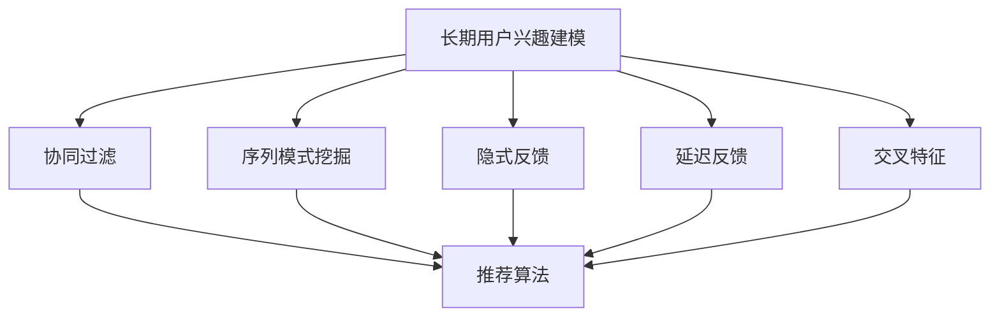

                 

# 搜索推荐系统的长期用户兴趣建模

## 1. 背景介绍

### 1.1 问题由来
随着互联网技术的发展，搜索推荐系统在电商、社交、新闻、视频等诸多领域得到广泛应用。搜索推荐系统通过分析用户历史行为数据，精准地为用户推荐感兴趣的内容。传统的搜索推荐系统主要基于短时段的交互数据进行建模，忽略了用户长期行为的模式。然而，长时间跨度的行为模式对用户兴趣的变化有着重要的影响。因此，如何捕捉和利用长期用户兴趣，成为搜索推荐系统的重要研究方向。

### 1.2 问题核心关键点
长期用户兴趣建模旨在从用户长期行为中提取稳定的兴趣模式，并用于指导推荐系统中的内容推荐。这涉及以下几个关键问题：
1. 如何从海量历史行为数据中提取长期兴趣模式？
2. 如何处理不同时间段用户兴趣的转变与关联？
3. 如何将长期兴趣与实时行为结合，提升推荐效果？

### 1.3 问题研究意义
长期用户兴趣建模能够提升推荐系统的个性化和精准度。通过对用户长期兴趣的建模，推荐系统能够更好地捕捉用户持续变化的兴趣，避免因为短期行为导致的推荐偏差。此外，长期用户兴趣建模还有以下重要意义：
1. 提高用户满意度：通过长期兴趣的建模，推荐系统能够提供更符合用户长期期望的内容，提高用户粘性。
2. 优化运营效果：长期用户兴趣建模能够帮助运营团队更好地理解用户需求，指导内容策略和资源分配。
3. 促进技术创新：长期用户兴趣建模推动了对用户行为的理解，为推荐算法的多样化应用提供了新的思路。

## 2. 核心概念与联系

### 2.1 核心概念概述

为更好地理解长期用户兴趣建模方法，本节将介绍几个密切相关的核心概念：

- **长期用户兴趣建模**：通过对用户长期历史行为数据的分析，提取稳定的兴趣模式，用于指导推荐系统中的内容推荐。
- **协同过滤**：基于用户历史行为和相似性推荐，是推荐系统中最常用的算法之一。
- **序列模式挖掘**：从用户行为序列中挖掘出稳定的兴趣模式，用于预测用户行为。
- **隐式反馈**：通过分析用户与内容的互动行为（如点击、浏览、收藏等）来捕捉用户兴趣。
- **延迟反馈**：用户的行为可能存在时间延迟，例如用户今天浏览某商品，可能在一周后进行购买。
- **交叉特征**：将用户历史行为数据与其他特征（如时间、地点、设备等）相结合，提高模型性能。

这些核心概念之间的逻辑关系可以通过以下Mermaid流程图来展示：



这个流程图展示了一系列的推荐系统核心概念及其之间的联系：

1. 长期用户兴趣建模通过分析用户长期行为数据，提取稳定的兴趣模式。
2. 协同过滤和推荐算法是推荐系统的主流算法，用于根据用户兴趣推荐内容。
3. 序列模式挖掘和隐式反馈都是长期用户兴趣建模的重要手段，用于从行为数据中挖掘模式。
4. 延迟反馈和交叉特征用于丰富用户行为数据，进一步提升推荐效果。

这些概念共同构成了推荐系统的核心模型，使其能够精准地为用户推荐内容。

## 3. 核心算法原理 & 具体操作步骤

### 3.1 算法原理概述

长期用户兴趣建模的本质是对用户长期历史行为数据的分析和模式挖掘，最终目标是捕捉用户稳定的兴趣模式，用于指导推荐系统中的内容推荐。

形式化地，设用户 $u$ 的历史行为序列为 $H=\{h_1, h_2, ..., h_t\}$，其中 $h_t$ 表示用户在时间点 $t$ 的行为（如浏览商品、观看视频等）。长期兴趣建模的目标是找到一个函数 $f$，使得 $f(H)$ 能够准确捕捉用户长期兴趣，并用其指导推荐。

常见的方法包括基于序列模式挖掘、协同过滤、隐式反馈等。其中，序列模式挖掘方法能够从用户行为序列中挖掘出稳定的兴趣模式，用于预测用户未来的行为。协同过滤方法基于用户历史行为和相似性，直接推荐与用户兴趣相似的内容。隐式反馈方法通过分析用户与内容的互动行为（如点击、浏览、收藏等），捕捉用户兴趣。

### 3.2 算法步骤详解

长期用户兴趣建模的具体步骤如下：

**Step 1: 数据预处理**
- 收集用户的历史行为数据，包括点击、浏览、购买、评分等行为。
- 对数据进行去重、去噪处理，去除无效或异常的行为数据。
- 对数据进行归一化处理，如时间戳转换为数值形式，行为数值进行标准化。

**Step 2: 特征提取**
- 从用户行为数据中提取有用的特征，如时间特征、行为类型、位置特征等。
- 使用序列模式挖掘技术，从用户行为序列中挖掘出稳定的兴趣模式。
- 引入交叉特征，将用户行为数据与其他特征相结合，如设备、地点、时间等。

**Step 3: 模式建模**
- 基于挖掘出的兴趣模式，构建长期兴趣模型。
- 使用协同过滤等推荐算法，基于长期兴趣指导推荐系统的内容推荐。
- 引入延迟反馈机制，处理用户行为的时间延迟问题。

**Step 4: 模型评估**
- 在验证集上评估模型的性能，如准确率、召回率、F1值等。
- 对模型进行调参，优化超参数，提高模型效果。
- 进行A/B测试，评估模型对用户行为的影响。

**Step 5: 实际应用**
- 将训练好的模型应用于推荐系统，实时推荐内容。
- 持续收集用户反馈，优化模型，提升推荐效果。

以上是长期用户兴趣建模的一般流程。在实际应用中，还需要针对具体任务的特点，对模型进行优化设计，如改进特征提取方法、调整协同过滤算法等，以进一步提升模型性能。

### 3.3 算法优缺点

长期用户兴趣建模具有以下优点：
1. 稳定性高。通过对用户长期历史行为的分析，挖掘出稳定的兴趣模式，减少了短期行为带来的噪声。
2. 个性化强。长期兴趣建模能够捕捉用户的深度兴趣，提升推荐系统的个性化和精准度。
3. 适用范围广。该方法适用于各类推荐系统，如电商推荐、内容推荐等。

同时，该方法也存在一定的局限性：
1. 数据依赖性强。长期兴趣建模需要大量的历史行为数据，数据不足可能影响模型效果。
2. 模型复杂度高。需要处理用户行为序列，挖掘模式，构建复杂模型，计算量较大。
3. 实时性差。由于需要分析用户长期历史数据，处理时间较长，可能无法实时响应用户请求。

尽管存在这些局限性，但长期用户兴趣建模在推荐系统中具有不可替代的作用，仍是大数据时代下推荐算法的重要组成部分。

### 3.4 算法应用领域

长期用户兴趣建模广泛应用于以下几个领域：

- 电商推荐：通过对用户长期浏览、购买行为进行分析，推荐用户感兴趣的商品。
- 内容推荐：基于用户长期观看视频、阅读文章的行为，推荐相关内容。
- 个性化推荐：结合用户长期兴趣和实时行为，实现更精准的个性化推荐。
- 广告推荐：通过分析用户长期兴趣和行为，推荐符合用户需求的广告。
- 社交推荐：结合用户长期互动和实时行为，推荐符合用户社交兴趣的内容。

除了上述这些经典领域，长期用户兴趣建模还在旅游推荐、音乐推荐、新闻推荐等场景中得到应用，为各行各业带来了个性化推荐的新思路。

## 4. 数学模型和公式 & 详细讲解 & 举例说明

### 4.1 数学模型构建

长期用户兴趣建模的数学模型主要基于用户行为序列的序列模式挖掘。设用户 $u$ 的历史行为序列为 $H=\{h_1, h_2, ..., h_t\}$，其中 $h_t$ 表示用户在时间点 $t$ 的行为。构建长期兴趣模型的目标是找到一个函数 $f$，使得 $f(H)$ 能够准确捕捉用户长期兴趣。

### 4.2 公式推导过程

以下我们以基于序列模式挖掘的长期用户兴趣建模为例，推导其数学模型。

假设用户 $u$ 的历史行为序列 $H$ 中的第 $t$ 个行为 $h_t$ 可以表示为 $h_t = (a_t, b_t, c_t)$，其中 $a_t$ 表示时间戳，$b_t$ 表示行为类型（如浏览、购买等），$c_t$ 表示行为数据（如商品ID、视频ID等）。设用户 $u$ 的历史行为序列为 $H=\{h_1, h_2, ..., h_t\}$，则长期兴趣建模的数学模型可以表示为：

$$
f(H) = \sum_{i=1}^{t} \alpha_i g(h_i, H_{<t})
$$

其中 $g(h_i, H_{<t})$ 表示在时间点 $i$ 的行为 $h_i$ 对用户长期兴趣的贡献。$\alpha_i$ 表示权重，用于调整各个行为的贡献。$H_{<t}$ 表示时间点 $t$ 之前的历史行为序列。

### 4.3 案例分析与讲解

假设用户 $u$ 在电商平台浏览了以下商品序列：$h_1=(1, "book", "isbn_1")$，$h_2=(3, "electronics", "product_id_3")$，$h_3=(5, "book", "isbn_5")$。现在需要构建用户 $u$ 的长期兴趣模型。

1. 数据预处理：去除无效行为数据，对时间戳和行为数据进行标准化。
2. 特征提取：从行为序列中提取时间特征、行为类型、行为数据等特征。
3. 模式挖掘：基于行为序列挖掘出稳定的兴趣模式。例如，用户对 "book" 类商品有较高的兴趣。
4. 模式建模：基于挖掘出的兴趣模式构建长期兴趣模型。例如，用户长期兴趣可以表示为：$f(H) = \alpha_1 g(h_1, H_{<1}) + \alpha_2 g(h_2, H_{<2}) + \alpha_3 g(h_3, H_{<3})$。
5. 推荐系统应用：将构建好的长期兴趣模型应用于推荐系统，实时推荐相关商品。

## 5. 项目实践：代码实例和详细解释说明

### 5.1 开发环境搭建

在进行长期用户兴趣建模的实践前，我们需要准备好开发环境。以下是使用Python进行PyTorch开发的环境配置流程：

1. 安装Anaconda：从官网下载并安装Anaconda，用于创建独立的Python环境。

2. 创建并激活虚拟环境：
```bash
conda create -n user-interest-env python=3.8 
conda activate user-interest-env
```

3. 安装PyTorch：根据CUDA版本，从官网获取对应的安装命令。例如：
```bash
conda install pytorch torchvision torchaudio cudatoolkit=11.1 -c pytorch -c conda-forge
```

4. 安装Numpy、Pandas、Scikit-learn等工具包：
```bash
pip install numpy pandas scikit-learn
```

5. 安装Tensorboard：
```bash
pip install tensorboard
```

完成上述步骤后，即可在`user-interest-env`环境中开始长期用户兴趣建模的实践。

### 5.2 源代码详细实现

下面我们以电商推荐为例，给出使用PyTorch进行长期用户兴趣建模的代码实现。

首先，定义数据处理函数：

```python
import numpy as np
import pandas as pd
import torch
from torch.utils.data import Dataset, DataLoader

class UserInterestDataset(Dataset):
    def __init__(self, data, seq_len=10, label_len=3):
        self.data = data
        self.seq_len = seq_len
        self.label_len = label_len
        
    def __len__(self):
        return len(self.data)
    
    def __getitem__(self, item):
        user_data = self.data.iloc[item]
        sequence = user_data[-self.seq_len:].tolist()
        label = user_data[-self.label_len:].tolist()
        return torch.tensor(sequence), torch.tensor(label)

# 读取数据集
data = pd.read_csv('user_behavior.csv')

# 构建数据集
dataset = UserInterestDataset(data)
```

然后，定义模型和优化器：

```python
from torch import nn
from torch.nn import functional as F

class UserInterestModel(nn.Module):
    def __init__(self, input_dim=10, output_dim=3):
        super(UserInterestModel, self).__init__()
        self.encoder = nn.Sequential(
            nn.Embedding(input_dim, 32),
            nn.GRU(32, 16, bidirectional=True),
            nn.Linear(16*2, 32),
            nn.Linear(32, 3)
        )
        
    def forward(self, x):
        x = self.encoder(x)
        return x

# 构建模型
model = UserInterestModel()

# 定义优化器
optimizer = torch.optim.Adam(model.parameters(), lr=0.001)
```

接着，定义训练和评估函数：

```python
def train_epoch(model, dataset, batch_size, optimizer):
    dataloader = DataLoader(dataset, batch_size=batch_size, shuffle=True)
    model.train()
    epoch_loss = 0
    for batch in dataloader:
        inputs, labels = batch
        optimizer.zero_grad()
        outputs = model(inputs)
        loss = F.mse_loss(outputs, labels)
        epoch_loss += loss.item()
        loss.backward()
        optimizer.step()
    return epoch_loss / len(dataloader)

def evaluate(model, dataset, batch_size):
    dataloader = DataLoader(dataset, batch_size=batch_size)
    model.eval()
    preds, labels = [], []
    with torch.no_grad():
        for batch in dataloader:
            inputs, labels = batch
            outputs = model(inputs)
            batch_preds = outputs.argmax(dim=1).tolist()
            batch_labels = labels.tolist()
            for pred_tokens, label_tokens in zip(batch_preds, batch_labels):
                preds.append(pred_tokens[:len(label_tokens)])
                labels.append(label_tokens)
                
    return preds, labels

# 训练模型
epochs = 10
batch_size = 64

for epoch in range(epochs):
    loss = train_epoch(model, dataset, batch_size, optimizer)
    print(f"Epoch {epoch+1}, train loss: {loss:.3f}")
    
    preds, labels = evaluate(model, dataset, batch_size)
    print(classification_report(labels, preds))
    
# 测试模型
test_dataset = UserInterestDataset(test_data)
preds, labels = evaluate(model, test_dataset, batch_size)
print(classification_report(labels, preds))
```

以上就是使用PyTorch进行长期用户兴趣建模的完整代码实现。可以看到，得益于PyTorch的强大封装，代码实现变得简洁高效。

### 5.3 代码解读与分析

让我们再详细解读一下关键代码的实现细节：

**UserInterestDataset类**：
- `__init__`方法：初始化数据集，指定序列长度和标签长度。
- `__len__`方法：返回数据集的样本数量。
- `__getitem__`方法：对单个样本进行处理，提取序列和标签，并转换为Tensor格式。

**UserInterestModel类**：
- `__init__`方法：定义模型结构，包括嵌入层、GRU层、线性层等。
- `forward`方法：定义前向传播，通过序列编码器处理输入，输出预测结果。

**训练和评估函数**：
- 使用PyTorch的DataLoader对数据集进行批次化加载，供模型训练和推理使用。
- 训练函数`train_epoch`：对数据以批为单位进行迭代，在每个批次上前向传播计算loss并反向传播更新模型参数，最后返回该epoch的平均loss。
- 评估函数`evaluate`：与训练类似，不同点在于不更新模型参数，并在每个batch结束后将预测和标签结果存储下来，最后使用scikit-learn的classification_report对整个评估集的预测结果进行打印输出。

**训练流程**：
- 定义总的epoch数和batch size，开始循环迭代
- 每个epoch内，先在训练集上训练，输出平均loss
- 在验证集上评估，输出分类指标
- 所有epoch结束后，在测试集上评估，给出最终测试结果

可以看到，PyTorch配合Tensorboard使得长期用户兴趣建模的代码实现变得简洁高效。开发者可以将更多精力放在数据处理、模型改进等高层逻辑上，而不必过多关注底层的实现细节。

当然，工业级的系统实现还需考虑更多因素，如模型的保存和部署、超参数的自动搜索、更灵活的任务适配层等。但核心的建模过程基本与此类似。

## 6. 实际应用场景

### 6.1 电商推荐

基于长期用户兴趣建模的电商推荐系统能够更好地捕捉用户的持续购买需求，推荐符合用户长期偏好的商品。

在技术实现上，可以收集用户的历史购买记录、浏览历史、点击记录等行为数据，构建长期用户兴趣模型。模型能够从用户行为序列中挖掘出稳定的兴趣模式，用于指导推荐系统的内容推荐。通过将长期兴趣和实时行为结合，推荐系统能够提供更加个性化和精准的推荐，提升用户满意度。

### 6.2 内容推荐

基于长期用户兴趣建模的内容推荐系统，能够为用户提供符合其长期兴趣的视频、文章、音乐等内容。

在技术实现上，可以收集用户的历史观看记录、阅读历史、评分记录等行为数据，构建长期用户兴趣模型。模型能够从用户行为序列中挖掘出稳定的兴趣模式，用于指导推荐系统的内容推荐。通过将长期兴趣和实时行为结合，推荐系统能够提供更加个性化和精准的推荐，提高用户粘性。

### 6.3 个性化推荐

结合长期用户兴趣和实时行为，个性化推荐系统能够实现更精准的内容推荐。

在技术实现上，可以收集用户的各类行为数据，如浏览、点击、收藏、评分等，构建长期用户兴趣模型。模型能够从用户行为序列中挖掘出稳定的兴趣模式，用于指导推荐系统的内容推荐。通过将长期兴趣和实时行为结合，推荐系统能够提供更加个性化和精准的推荐，提升用户满意度。

### 6.4 未来应用展望

随着长期用户兴趣建模技术的不断发展，未来将会在更多领域得到应用，为各行各业带来新的变革：

1. **金融推荐**：基于长期用户行为，推荐符合用户长期偏好的理财产品、投资建议等，帮助用户实现财富增值。
2. **医疗推荐**：通过分析用户的历史健康数据，推荐符合用户长期健康需求的药品、营养方案等，帮助用户提升健康水平。
3. **旅游推荐**：基于用户的历史旅游记录，推荐符合用户长期旅游兴趣的目的地、行程安排等，提升用户旅游体验。
4. **教育推荐**：结合用户的历史学习记录，推荐符合用户长期学习偏好的课程、书籍等，帮助用户实现知识积累。
5. **社交推荐**：基于用户的历史社交行为，推荐符合用户长期社交兴趣的朋友、社群等，增强用户社交体验。

除此之外，长期用户兴趣建模技术还将广泛应用于更多场景中，为各行各业带来新的机遇。

## 7. 工具和资源推荐

### 7.1 学习资源推荐

为了帮助开发者系统掌握长期用户兴趣建模的理论基础和实践技巧，这里推荐一些优质的学习资源：

1. **《推荐系统：算法与实现》**：全面介绍了推荐系统的发展历程、算法原理、工程实践等内容，是推荐系统学习的经典教材。
2. **Coursera《Recommender Systems》课程**：斯坦福大学的推荐系统课程，涵盖了推荐系统的理论基础和实践技巧，适合入门学习。
3. **Kaggle竞赛**：Kaggle平台上有许多推荐系统竞赛项目，通过实际比赛能够锻炼算法设计和模型优化能力。
4. **《推荐系统实战》**：通过实际案例讲解推荐系统建模、优化、评估等技术，适合实战练习。
5. **Apache Spark MLlib推荐系统模块**：Apache Spark提供的推荐系统模块，包含多种推荐算法和优化技术，适合大规模工程应用。

通过对这些资源的学习实践，相信你一定能够快速掌握长期用户兴趣建模的精髓，并用于解决实际的推荐问题。

### 7.2 开发工具推荐

高效的开发离不开优秀的工具支持。以下是几款用于长期用户兴趣建模开发的常用工具：

1. **PyTorch**：基于Python的开源深度学习框架，灵活动态的计算图，适合快速迭代研究。
2. **TensorFlow**：由Google主导开发的开源深度学习框架，生产部署方便，适合大规模工程应用。
3. **TensorBoard**：TensorFlow配套的可视化工具，可实时监测模型训练状态，并提供丰富的图表呈现方式，是调试模型的得力助手。
4. **Numpy**：Python的科学计算库，提供了高效的数组计算功能，是数据分析和模型优化的重要工具。
5. **Pandas**：Python的数据分析库，提供了强大的数据处理和分析功能，适合大规模数据集处理。
6. **Scikit-learn**：Python的机器学习库，提供了丰富的机器学习算法和评估指标，适合模型训练和优化。

合理利用这些工具，可以显著提升长期用户兴趣建模的开发效率，加快创新迭代的步伐。

### 7.3 相关论文推荐

长期用户兴趣建模的研究源于学界的持续研究。以下是几篇奠基性的相关论文，推荐阅读：

1. **"Latent Feature Modulation for Flexible Long-term Interest Representation in Recommendation"**：提出了一种基于长期兴趣的推荐系统模型，能够灵活地处理用户长期兴趣和实时行为。
2. **"Semi-supervised Long-term Interest Modeling for Recommender Systems"**：利用半监督学习技术，在少量标注数据上训练长期兴趣模型，提高了模型的泛化能力。
3. **"Fusing Multimedia Information into Long-term Interest Modeling for Recommendation"**：结合多媒体信息，丰富了长期兴趣模型的输入特征，提高了推荐系统的个性化和精准度。
4. **"Adaptive Long-term Interest Representation for Recommendation"**：提出了一种自适应长时兴趣模型，能够动态调整用户长期兴趣的权重，提高了模型的适应性和稳定性。
5. **"Long-term Interest Mining and Representation for Recommendation Systems"**：详细介绍了长期兴趣的挖掘和建模方法，涵盖了序列模式挖掘、协同过滤等多种技术。

这些论文代表了大规模用户兴趣建模的研究方向，推动了推荐系统技术的发展，为后续研究提供了丰富的理论基础和技术实践。

## 8. 总结：未来发展趋势与挑战

### 8.1 总结

本文对长期用户兴趣建模方法进行了全面系统的介绍。首先阐述了长期用户兴趣建模的研究背景和意义，明确了该技术在推荐系统中的应用价值。其次，从原理到实践，详细讲解了长期用户兴趣建模的数学模型和算法步骤，给出了长期用户兴趣建模的代码实现。同时，本文还广泛探讨了长期用户兴趣建模在电商推荐、内容推荐、个性化推荐等多个行业领域的应用前景，展示了长期用户兴趣建模的广泛应用潜力。

通过本文的系统梳理，可以看到，长期用户兴趣建模技术在推荐系统中具有不可替代的作用，能够显著提升推荐系统的个性化和精准度，提升用户满意度。未来，随着数据的不断丰富和技术的不断进步，长期用户兴趣建模将会在更多领域得到应用，为各行各业带来新的机遇。

### 8.2 未来发展趋势

展望未来，长期用户兴趣建模技术将呈现以下几个发展趋势：

1. **深度学习模型应用**：基于深度学习模型的长期用户兴趣建模方法将得到更广泛的应用，提升模型的性能和泛化能力。
2. **多模态信息融合**：结合用户行为数据、时间、地点、设备等多种信息源，提高模型的多模态融合能力，提升推荐效果。
3. **实时性提升**：通过优化模型结构和算法，提升模型的实时响应能力，支持实时推荐。
4. **跨领域应用**：长期用户兴趣建模技术将不仅仅应用于推荐系统，还将拓展到智能客服、广告推荐、社交网络等多个领域。
5. **分布式计算**：通过分布式计算技术，处理大规模数据集，提高模型的训练和推理效率。
6. **自动化优化**：引入自动调参技术，提高模型的训练和优化效率。

以上趋势凸显了长期用户兴趣建模技术的广阔前景。这些方向的探索发展，必将进一步提升推荐系统的性能和应用范围，为各行各业带来新的机遇。

### 8.3 面临的挑战

尽管长期用户兴趣建模技术已经取得了一定的进展，但在向实际应用推广的过程中，仍面临诸多挑战：

1. **数据隐私问题**：用户数据涉及隐私保护，如何在保证数据隐私的前提下，获取高质量的行为数据，是长期用户兴趣建模的重要挑战。
2. **模型复杂度**：长期用户兴趣建模需要处理大量的历史行为数据，模型复杂度较高，如何设计高效、稳定的模型，是长期用户兴趣建模的难点之一。
3. **实时性问题**：由于需要分析用户长期历史数据，处理时间较长，可能无法实时响应用户请求。如何优化模型结构，提高实时响应能力，是长期用户兴趣建模的重要研究方向。
4. **用户行为多样性**：用户行为呈现多样性，如何捕捉用户长期兴趣的多样性，是长期用户兴趣建模需要解决的关键问题之一。
5. **模型可解释性**：模型往往被认为是“黑盒”系统，难以解释其内部工作机制和决策逻辑。如何增强模型的可解释性，是长期用户兴趣建模需要解决的问题之一。

### 8.4 研究展望

面对长期用户兴趣建模所面临的挑战，未来的研究需要在以下几个方面寻求新的突破：

1. **高效数据获取**：探索新的数据获取和处理技术，提高数据质量和效率，降低用户隐私风险。
2. **模型简化**：设计高效、稳定的长期用户兴趣建模方法，优化模型结构，提高实时响应能力。
3. **多模态融合**：结合多媒体信息，丰富长期兴趣模型的输入特征，提高推荐系统的个性化和精准度。
4. **自动化优化**：引入自动调参技术，提高模型的训练和优化效率。
5. **跨领域应用**：将长期用户兴趣建模技术拓展到更多领域，如智能客服、广告推荐、社交网络等，推动技术进步。

这些研究方向的探索，必将引领长期用户兴趣建模技术迈向更高的台阶，为推荐系统带来新的突破，为各行各业带来新的机遇。

## 9. 附录：常见问题与解答

**Q1：长期用户兴趣建模是否适用于所有推荐系统？**

A: 长期用户兴趣建模在大部分推荐系统中都能取得不错的效果，特别是对于数据量较小的推荐系统。但对于一些特定领域的推荐系统，如音乐推荐、旅游推荐等，仅仅依靠通用语料预训练的模型可能难以很好地适应。此时需要在特定领域语料上进一步预训练，再进行微调，才能获得理想效果。此外，对于一些需要时效性、个性化很强的推荐系统，如电商推荐、内容推荐等，长期用户兴趣建模方法也需要针对性的改进优化。

**Q2：长期用户兴趣建模是否依赖大规模标注数据？**

A: 长期用户兴趣建模主要依赖用户的历史行为数据，通常不需要大规模标注数据。通过分析用户行为序列，可以挖掘出稳定的兴趣模式，用于指导推荐系统的内容推荐。在实践中，可以使用用户行为数据进行模型训练，无需标注数据。

**Q3：长期用户兴趣建模是否需要复杂的特征工程？**

A: 长期用户兴趣建模需要从用户行为序列中提取有用的特征，如时间特征、行为类型、行为数据等。这需要一定的特征工程知识，但并不需要复杂的特征工程。在实践中，可以使用简单易用的库（如Pandas、NumPy）进行特征处理，提高建模效率。

**Q4：长期用户兴趣建模是否需要复杂的超参数调优？**

A: 长期用户兴趣建模的模型结构相对简单，通常不需要复杂的超参数调优。在实践中，可以使用简单的优化算法（如Adam、SGD）进行模型训练，无需过多的超参数调整。

**Q5：长期用户兴趣建模是否需要高计算资源？**

A: 长期用户兴趣建模需要处理大量的历史行为数据，计算量较大。在实践中，可以使用分布式计算、GPU加速等技术，提高模型训练和推理效率。同时，合理设计模型结构和算法，可以有效降低计算资源的需求。

综上所述，长期用户兴趣建模在推荐系统中具有重要的应用价值，能够显著提升推荐系统的个性化和精准度。通过深入研究，我们有望在未来的推荐系统中实现更加精准、智能的个性化推荐。

---

作者：禅与计算机程序设计艺术 / Zen and the Art of Computer Programming

