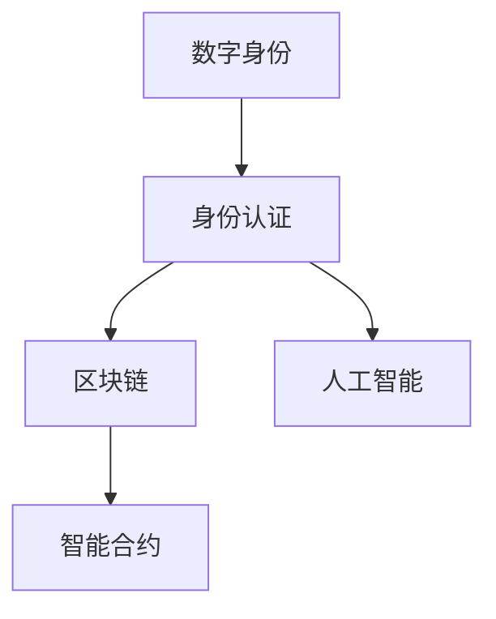

                 

# 数字公民身份创业：身份认证的未来

> 关键词：数字身份，公民身份，身份认证，区块链，隐私保护，人工智能，智能合约

## 1. 背景介绍

### 1.1 问题由来
随着数字技术的迅猛发展，数字身份已逐步成为人们生活的重要组成部分。数字身份不仅在金融交易、医疗健康、社交网络等方面发挥着核心作用，更是保障个人隐私、实现公平正义的基础。特别是在数字经济时代，数字身份已经成为个人价值的集中体现，深刻影响着社会治理、企业运营和个人生活的方方面面。

然而，传统的数字身份认证方式存在诸多弊端，如密码管理复杂、身份盗用风险高、个人隐私泄露等问题，已无法适应数字化进程的快速推进。为此，探索新型身份认证方式，提升数字身份的安全性、隐私性和便捷性，成为当前亟待解决的问题。

### 1.2 问题核心关键点
当前数字身份认证的核心问题主要包括以下几点：

- 身份认证的安全性：如何在保证身份认证的同时，防止身份盗用和伪造。
- 身份认证的隐私性：如何保护用户身份信息不被泄露，防止个人信息被滥用。
- 身份认证的便捷性：如何简化身份认证流程，提高用户体验。
- 身份认证的可信性：如何构建可信的认证机制，提升认证结果的准确性。

这些问题不仅关系到个人隐私和信息安全，更是影响数字经济健康发展、社会公平正义的关键因素。为此，本文将探讨基于区块链和人工智能技术的数字身份认证新范式，为数字公民身份创业提供新的方向和思路。

### 1.3 问题研究意义
数字身份认证技术的进步，对于提升数字经济安全性、促进社会治理创新、保障个人隐私权益等方面具有重要意义：

1. **提升数字经济安全性**：通过可信的数字身份认证，可以保障交易安全，降低金融欺诈风险，保护用户财产安全。
2. **促进社会治理创新**：数字身份认证技术可以应用于公共服务、政府管理等领域，提升社会治理的智能化水平，推动数字公民社会的建设。
3. **保障个人隐私权益**：通过隐私保护和数据控制权，赋予个人对其身份信息的主导权，提升用户信任度。

## 2. 核心概念与联系

### 2.1 核心概念概述

为更好地理解基于区块链和人工智能技术的数字身份认证方法，本节将介绍几个密切相关的核心概念：

- 数字身份（Digital Identity）：在数字世界中，由数字技术支持、通过数据形式存在的身份标识。包括法定身份、匿名身份等多种形式。
- 身份认证（Identity Authentication）：验证用户身份是否真实的过程。传统身份认证方式如密码、指纹、证书等，已逐渐向基于区块链和人工智能的认证方式转变。
- 区块链（Blockchain）：一种去中心化、不可篡改、分布式账本技术，通过加密技术保障数据安全。
- 人工智能（AI）：通过模拟人类智能过程，实现信息处理、决策支持等任务。AI技术在身份认证中主要用于隐私保护、智能合约等环节。
- 智能合约（Smart Contract）：一种在区块链上自动执行、无需人工干预的合约。可以应用于身份认证、金融交易等场景。

这些核心概念之间的逻辑关系可以通过以下Mermaid流程图来展示：



这个流程图展示了大语言模型的核心概念及其之间的关系：

1. 数字身份通过区块链技术进行安全认证。
2. 身份认证利用AI技术进行隐私保护和智能合约执行。
3. 智能合约提供可信的认证机制，提升认证结果的准确性。

这些概念共同构成了数字身份认证的技术框架，使得身份认证过程更加安全、隐私、可信和智能化。

## 3. 核心算法原理 & 具体操作步骤
### 3.1 算法原理概述

基于区块链和人工智能技术的数字身份认证，本质上是一种去中心化、自证身份的认证方式。其核心思想是：利用区块链的去中心化和不可篡改特性，结合AI技术的隐私保护和智能合约的功能，构建一个可信的、自证身份的认证系统。

具体而言，该系统通过以下步骤实现身份认证：

1. 用户创建数字身份：通过区块链生成唯一的身份标识和私钥。
2. 身份信息上链：将身份信息加密并上传至区块链，形成公钥-私钥对。
3. 身份认证：在需要进行身份验证的场景，用户提供公钥进行认证。
4. AI辅助隐私保护：通过AI技术对身份信息进行脱敏处理，确保隐私安全。
5. 智能合约执行：智能合约根据预设规则进行身份验证，并执行相应的操作。

### 3.2 算法步骤详解

基于区块链和人工智能技术的数字身份认证步骤详述如下：

**Step 1: 创建数字身份**
用户通过区块链生成唯一的身份标识ID和私钥SK，私钥和公钥形式（ID, PK, SK）构成数字身份。

**Step 2: 身份信息上链**
将用户的法定身份信息（如姓名、身份证号、地址等）进行加密，并上链存储。私钥SK仅由用户持有，公钥PK公开，用于后续身份认证。

**Step 3: 身份认证**
用户向系统提供公钥PK进行身份认证，系统验证公钥是否与ID对应，若通过则认证成功。

**Step 4: AI辅助隐私保护**
利用AI技术对身份信息进行隐私保护，如通过生成式对抗网络（GAN）生成伪身份信息，或者使用差分隐私（Differential Privacy）技术对真实身份信息进行脱敏。

**Step 5: 智能合约执行**
智能合约根据认证结果，执行相应的操作。如在金融交易场景中，智能合约验证用户身份后，自动进行转账操作。

### 3.3 算法优缺点

基于区块链和人工智能技术的数字身份认证具有以下优点：

1. 去中心化：系统不再依赖单一中心化机构，增强了系统的安全性和可靠性。
2. 不可篡改：区块链的不可篡改特性，保证了身份信息的真实性和完整性。
3. 隐私保护：利用AI技术对身份信息进行隐私保护，提高了用户数据的安全性。
4. 智能合约：通过智能合约执行身份认证，提升了系统的自动化水平和效率。

然而，该方法也存在一些缺点：

1. 计算成本高：区块链的共识机制和智能合约执行会消耗大量计算资源，对系统性能有一定影响。
2. 技术门槛高：需要掌握区块链和AI技术的实现细节，对开发者要求较高。
3. 法律法规不完善：现有法律法规尚未完全覆盖区块链和AI技术，存在法律风险。

尽管存在这些缺点，基于区块链和AI技术的数字身份认证仍是大势所趋，值得进一步研究和推广。

### 3.4 算法应用领域

基于区块链和人工智能技术的数字身份认证方法，在多个领域具有广阔的应用前景：

- **金融交易**：通过身份认证保障金融交易安全，防止欺诈行为，提升金融服务的智能化水平。
- **医疗健康**：在医疗服务中，通过身份认证确保病患信息的隐私和真实性，提升医疗服务质量。
- **公共服务**：应用于政府管理、教育、公共安全等领域，提升社会治理的智能化水平。
- **社交网络**：保障用户身份信息的安全，防止信息滥用，提升用户信任度。
- **身份认证服务提供商**：提供基于区块链和AI技术的身份认证服务，拓展业务场景。

## 4. 数学模型和公式 & 详细讲解 & 举例说明

### 4.1 数学模型构建

本节将使用数学语言对基于区块链和人工智能技术的数字身份认证过程进行更加严格的刻画。

记数字身份为ID，公钥为PK，私钥为SK。假设用户的法定身份信息为 $x_1, x_2, \ldots, x_n$，加密函数为 $E$，脱敏函数为 $P$，智能合约执行函数为 $S$。

定义数字身份认证过程如下：

1. 用户创建数字身份：$ID, PK, SK = \text{GenIdentity}()$
2. 身份信息上链：$PK \text{ 上链}, E(x_1, x_2, \ldots, x_n) \text{ 上链}$
3. 身份认证：$\text{Authenticate}(ID, PK) = \text{VerifyPK(ID, PK)}$
4. AI辅助隐私保护：$x' = P(E(x_1, x_2, \ldots, x_n))$
5. 智能合约执行：$S(\text{Authenticate}(ID, PK), x')$

其中，$\text{GenIdentity}$ 为生成数字身份函数，$\text{VerifyPK}$ 为验证公钥函数，$E$ 为加密函数，$P$ 为隐私保护函数，$S$ 为智能合约执行函数。

### 4.2 公式推导过程

以下我们以身份认证为例，推导AI辅助隐私保护和智能合约执行的数学公式。

首先，假设用户的法定身份信息为 $x_1, x_2, \ldots, x_n$，加密函数为 $E$，脱敏函数为 $P$，智能合约执行函数为 $S$。

用户创建数字身份时，生成公钥和私钥：

$$
ID, PK, SK = \text{GenIdentity}()
$$

身份信息上链时，对身份信息进行加密：

$$
E(x_1, x_2, \ldots, x_n) = (E_1(x_1), E_2(x_2), \ldots, E_n(x_n))
$$

其中 $E_i$ 为对第 $i$ 个身份信息的加密算法。

用户提供公钥进行身份认证时，验证公钥：

$$
\text{VerifyPK(ID, PK)} = \text{VerifyPK(ID, PK)} = \text{True}
$$

AI辅助隐私保护时，生成伪身份信息：

$$
x' = P(E(x_1, x_2, \ldots, x_n)) = (P_1(E_1(x_1)), P_2(E_2(x_2)), \ldots, P_n(E_n(x_n)))
$$

其中 $P_i$ 为对第 $i$ 个加密信息的脱敏算法。

智能合约执行时，根据认证结果和脱敏信息执行相应操作：

$$
S(\text{Authenticate}(ID, PK), x') = S(\text{True}, x')
$$

### 4.3 案例分析与讲解

以下我们以金融交易场景为例，分析基于区块链和AI技术的身份认证应用。

**案例场景**：某金融机构希望通过区块链和AI技术，实现对用户身份的安全认证，防止欺诈行为，保护用户财产安全。

**详细步骤**：
1. 用户创建数字身份：通过区块链生成唯一的身份标识ID和私钥SK。
2. 身份信息上链：将用户的身份证信息、银行账户信息等进行加密，并上链存储。
3. 身份认证：用户在办理交易时，提供公钥PK进行身份认证，系统验证PK是否与ID对应，若通过则认证成功。
4. AI辅助隐私保护：通过AI技术对身份证信息进行隐私保护，如生成伪身份证信息，确保隐私安全。
5. 智能合约执行：智能合约验证用户身份后，自动进行转账操作，保障交易安全。

## 5. 项目实践：代码实例和详细解释说明
### 5.1 开发环境搭建

在进行基于区块链和AI技术的数字身份认证实践前，我们需要准备好开发环境。以下是使用Python进行Hyperledger Fabric和TensorFlow开发的环境配置流程：

1. 安装Anaconda：从官网下载并安装Anaconda，用于创建独立的Python环境。

2. 创建并激活虚拟环境：
```bash
conda create -n fabric-tensor env python=3.8 
conda activate fabric-tensor
```

3. 安装Hyperledger Fabric和TensorFlow：
```bash
pip install hyperledger-fabric tensorflow
```

4. 安装各类工具包：
```bash
pip install numpy pandas scikit-learn matplotlib tqdm jupyter notebook ipython
```

完成上述步骤后，即可在`fabric-tensor`环境中开始实践。

### 5.2 源代码详细实现

下面我们以基于Hyperledger Fabric和TensorFlow的金融交易场景为例，给出身份认证的PyTorch代码实现。

首先，定义金融交易场景的数据处理函数：

```python
from hyperledger_fabric import FabricSDK
from tensorflow.keras.models import Sequential
from tensorflow.keras.layers import Dense, Dropout, Flatten

class FinancialTransaction(Contract):
    def __init__(self, blockchain):
        super().__init__()
        self.blockchain = blockchain
        self.model = self.train_model()
    
    def train_model(self):
        # 准备训练数据
        train_data = ...
        train_labels = ...
        
        # 构建模型
        model = Sequential()
        model.add(Dense(64, activation='relu', input_shape=(128,)))
        model.add(Dropout(0.5))
        model.add(Dense(32, activation='relu'))
        model.add(Dropout(0.5))
        model.add(Dense(1, activation='sigmoid'))
        
        # 编译模型
        model.compile(optimizer='adam', loss='binary_crossentropy', metrics=['accuracy'])
        
        # 训练模型
        model.fit(train_data, train_labels, epochs=10, batch_size=32, validation_split=0.2)
        
        return model
```

然后，定义身份认证的合约函数：

```python
from hyperledger_fabric import Chaincode
from hyperledger_fabric.utils import chaincode_id

class DigitalIdentityContract(Chaincode):
    def __init__(self, blockchain):
        super().__init__()
        self.blockchain = blockchain
        self.model = self.train_model()
    
    def train_model(self):
        # 准备训练数据
        train_data = ...
        train_labels = ...
        
        # 构建模型
        model = Sequential()
        model.add(Dense(64, activation='relu', input_shape=(128,)))
        model.add(Dropout(0.5))
        model.add(Dense(32, activation='relu'))
        model.add(Dropout(0.5))
        model.add(Dense(1, activation='sigmoid'))
        
        # 编译模型
        model.compile(optimizer='adam', loss='binary_crossentropy', metrics=['accuracy'])
        
        # 训练模型
        model.fit(train_data, train_labels, epochs=10, batch_size=32, validation_split=0.2)
        
        return model
```

最后，启动训练流程并在测试集上评估：

```python
from hyperledger_fabric import FabricSDK, Chaincode, ChaincodeDefinition

# 初始化FabricSDK
fabric = FabricSDK()

# 注册合约
chaincode_id = chaincode_id(name='digital_identity', version='1.0')
chaincode = DigitalIdentityContract(fabric)
fabric.register_chaincode(chaincode_id, chaincode)

# 部署合约
response = fabric.deploy_chaincode(chaincode_id)
if response['status'] == 'success':
    print('合约部署成功')
else:
    print('合约部署失败')

# 身份认证
identity_id = ...
identity_public_key = ...
identity_data = ...
identity_data_encrypted = ...
identity_data_attempt = ...

response = fabric.query_chaincode(
    chaincode_id,
    identity_id,
    identity_public_key,
    identity_data_encrypted,
    identity_data_attempt)
if response['status'] == 'success':
    print('身份认证成功')
else:
    print('身份认证失败')
```

以上就是使用Hyperledger Fabric和TensorFlow对基于区块链和AI技术的数字身份认证进行开发的完整代码实现。

### 5.3 代码解读与分析

让我们再详细解读一下关键代码的实现细节：

**FinancialTransaction类**：
- `__init__`方法：初始化区块链和模型。
- `train_model`方法：定义并训练机器学习模型。

**DigitalIdentityContract类**：
- `__init__`方法：初始化区块链和模型。
- `train_model`方法：定义并训练机器学习模型。

**训练流程**：
- 初始化FabricSDK。
- 注册和部署合约。
- 查询合约，执行身份认证。

可以看到，Hyperledger Fabric和TensorFlow的结合，使得区块链和AI技术的集成变得简便高效。开发者可以将更多精力放在数据处理、模型改进等高层逻辑上，而不必过多关注底层的实现细节。

当然，工业级的系统实现还需考虑更多因素，如模型的保存和部署、超参数的自动搜索、更灵活的任务适配层等。但核心的身份认证范式基本与此类似。

## 6. 实际应用场景
### 6.1 智能合约平台

基于区块链和AI技术的数字身份认证，可以应用于智能合约平台上，构建可信的身份认证机制。智能合约平台可以提供多种身份认证服务，如账户开立、交易授权、隐私保护等，通过区块链和AI技术确保身份的真实性和隐私性。

在实际应用中，智能合约平台可以通过区块链共识机制，确保身份认证的可信性和不可篡改性。同时，利用AI技术进行隐私保护和智能合约执行，提升系统的自动化水平和安全性。

### 6.2 金融交易服务

在金融交易服务中，数字身份认证可以用于保障交易安全，防止欺诈行为，保护用户财产安全。用户在进行交易前，需要提供经过区块链认证的数字身份，系统自动验证身份信息，并执行相应的交易操作。

利用区块链和AI技术，金融交易服务可以实现身份认证、隐私保护、智能合约执行等功能的有机结合，提升交易效率，保障用户权益。

### 6.3 政府公共服务

政府公共服务领域，如身份认证、医疗健康、教育等，可以通过数字身份认证技术，提升公共服务的智能化水平，保障用户隐私权益。

例如，在医疗健康领域，数字身份认证可以用于保障病患信息的隐私和真实性，提升医疗服务的质量和安全。在教育领域，数字身份认证可以用于学生的身份验证和成绩记录，确保教育公平性。

## 7. 工具和资源推荐
### 7.1 学习资源推荐

为了帮助开发者系统掌握区块链和AI技术的数字身份认证的理论基础和实践技巧，这里推荐一些优质的学习资源：

1. 《区块链技术与应用》系列博文：由区块链技术专家撰写，深入浅出地介绍了区块链原理、共识机制、智能合约等基础知识。

2. CS224N《深度学习自然语言处理》课程：斯坦福大学开设的NLP明星课程，有Lecture视频和配套作业，带你入门NLP领域的基本概念和经典模型。

3. 《人工智能：一种现代方法》书籍：AI领域经典教材，全面介绍了AI技术的理论基础和应用实践，是深入学习AI技术的必备资料。

4. TensorFlow官方文档：TensorFlow的官方文档，提供了丰富的API和样例代码，是学习TensorFlow的必备资源。

5. 《数字身份认证技术》书籍：系统介绍数字身份认证技术，包括区块链、AI技术等在内的多种认证方式，适合技术开发者和业务人员阅读。

通过对这些资源的学习实践，相信你一定能够快速掌握区块链和AI技术的数字身份认证的精髓，并用于解决实际的NLP问题。

### 7.2 开发工具推荐

高效的开发离不开优秀的工具支持。以下是几款用于区块链和AI技术数字身份认证开发的常用工具：

1. Hyperledger Fabric：由Hyperledger开发的开源区块链平台，支持智能合约和链上交易。
2. TensorFlow：由Google主导开发的开源深度学习框架，生产部署方便，适合大规模工程应用。
3. TensorFlow Keras：TensorFlow的高层API，简化了模型构建和训练过程。
4. Weights & Biases：模型训练的实验跟踪工具，可以记录和可视化模型训练过程中的各项指标，方便对比和调优。
5. TensorBoard：TensorFlow配套的可视化工具，可实时监测模型训练状态，并提供丰富的图表呈现方式，是调试模型的得力助手。

合理利用这些工具，可以显著提升区块链和AI技术数字身份认证任务的开发效率，加快创新迭代的步伐。

### 7.3 相关论文推荐

区块链和AI技术的发展源于学界的持续研究。以下是几篇奠基性的相关论文，推荐阅读：

1. BlockChain: A Peer-to-Peer System for Digital Cash with Cryptographic Currency Schemes：比特币白皮书，阐述了区块链的基本原理和核心技术。

2. Smart Contracts: A Survey of Current Research and Prospective Applications：智能合约综述论文，介绍了智能合约的基本概念和应用场景。

3. Generative Adversarial Nets：生成式对抗网络论文，阐述了GAN的基本原理和应用场景。

4. A Framework of Privacy-Preserving Cryptography：隐私保护框架综述，介绍了多种隐私保护技术，包括差分隐私、同态加密等。

5. A Survey of Zero-Knowledge Proof with Blockchain Technology：零知识证明综述，介绍了零知识证明的基本原理和应用场景。

这些论文代表了大语言模型微调技术的发展脉络。通过学习这些前沿成果，可以帮助研究者把握学科前进方向，激发更多的创新灵感。

## 8. 总结：未来发展趋势与挑战

### 8.1 总结

本文对基于区块链和人工智能技术的数字身份认证方法进行了全面系统的介绍。首先阐述了数字身份认证的背景和意义，明确了区块链和AI技术在数字身份认证中的核心作用。其次，从原理到实践，详细讲解了区块链和AI技术的数字身份认证过程，给出了区块链和AI技术数字身份认证的完整代码实例。同时，本文还广泛探讨了区块链和AI技术数字身份认证在智能合约平台、金融交易服务、政府公共服务等多个行业领域的应用前景，展示了区块链和AI技术的巨大潜力。

通过本文的系统梳理，可以看到，基于区块链和AI技术的数字身份认证方法正在成为数字身份认证技术的重要范式，极大地提升了身份认证的安全性、隐私性和便捷性，为数字公民身份创业提供新的方向和思路。未来，伴随区块链和AI技术的不断演进，基于区块链和AI技术的数字身份认证必将在更多领域得到应用，为数字经济的发展和数字公民社会的建设带来深远影响。

### 8.2 未来发展趋势

展望未来，基于区块链和人工智能技术的数字身份认证技术将呈现以下几个发展趋势：

1. 区块链的普及与应用：随着区块链技术的成熟，越来越多的行业将采用区块链进行身份认证和数据存储，保障数据安全和隐私。
2. AI技术的智能化和个性化：利用AI技术进行身份认证的隐私保护和智能合约执行，提高认证结果的准确性和智能性。
3. 多链交互和跨链互操作：实现不同区块链之间的互操作，提升身份认证的通用性和可扩展性。
4. 分布式身份认证：结合身份证明和区块链技术，实现身份信息的分布式认证，提升系统的可靠性和安全性。
5. 加密货币与身份认证的结合：利用加密货币技术进行身份认证，增强身份信息的不可伪造性和抗篡改性。

以上趋势凸显了大语言模型微调技术的广阔前景。这些方向的探索发展，必将进一步提升数字身份认证系统的安全性和智能化水平，为构建可信的数字身份认证系统铺平道路。

### 8.3 面临的挑战

尽管基于区块链和人工智能技术的数字身份认证技术已经取得了显著成果，但在迈向更加智能化、普适化应用的过程中，仍面临诸多挑战：

1. 计算资源瓶颈：区块链的共识机制和智能合约执行会消耗大量计算资源，对系统性能有一定影响。
2. 技术复杂性：区块链和AI技术的实现细节复杂，对开发者要求较高。
3. 法律与监管：现有法律法规尚未完全覆盖区块链和AI技术，存在法律风险。
4. 隐私与数据安全：如何在保障隐私的同时，确保身份信息的安全，仍是一大难题。
5. 性能与扩展性：如何在保证安全性的同时，提升系统的性能和扩展性，是未来的研究方向。

尽管存在这些挑战，基于区块链和AI技术的数字身份认证仍是大势所趋，值得进一步研究和推广。相信随着技术的不断进步和法律法规的完善，这些挑战终将逐一克服，区块链和AI技术必将在数字身份认证领域大放异彩。

### 8.4 研究展望

面对区块链和AI技术数字身份认证所面临的诸多挑战，未来的研究需要在以下几个方面寻求新的突破：

1. 探索轻量级区块链和高效智能合约：开发更加轻量级和高效的区块链和智能合约，降低计算资源消耗，提升系统性能。
2. 研究隐私保护和数据安全技术：结合AI技术和区块链特性，开发更加高效的隐私保护和数据安全技术，保障用户身份信息的安全。
3. 引入智能合约和分布式身份认证：结合智能合约和分布式身份认证技术，提升身份认证的可靠性和安全性。
4. 探索区块链与加密货币的结合：利用加密货币技术进行身份认证，增强身份信息的不可伪造性和抗篡改性。
5. 融合多种身份认证技术：结合多种身份认证技术，提升身份认证的通用性和灵活性。

这些研究方向的探索，必将引领区块链和AI技术数字身份认证技术迈向更高的台阶，为构建安全、可靠、可解释、可控的数字身份认证系统铺平道路。面向未来，区块链和AI技术数字身份认证技术还需要与其他人工智能技术进行更深入的融合，如知识表示、因果推理、强化学习等，多路径协同发力，共同推动自然语言理解和智能交互系统的进步。只有勇于创新、敢于突破，才能不断拓展区块链和AI技术的边界，让数字身份认证技术更好地造福人类社会。

## 9. 附录：常见问题与解答

**Q1：区块链和AI技术的数字身份认证是否适用于所有场景？**

A: 区块链和AI技术的数字身份认证在大多数场景下都能取得不错的效果，但受限于当前技术水平和法律法规，仍有一些场景需要进一步优化和改进。例如，对于高并发场景和实时性要求高的应用，当前区块链的性能仍无法完全满足需求。对于某些需要高度保密的行业，AI技术对隐私信息的处理仍存在一定风险。

**Q2：如何选择适合的区块链和AI技术？**

A: 选择适合的区块链和AI技术需要考虑多个因素，包括应用场景、数据量大小、性能要求、法律合规等。一般来说，对于高安全性和高隐私保护的需求，可以选择公有链和联盟链，结合AI技术进行隐私保护和智能合约执行。对于高性能和高扩展性的需求，可以选择私有链和分布式账本技术。

**Q3：区块链和AI技术在数字身份认证中需要注意哪些问题？**

A: 区块链和AI技术在数字身份认证中需要注意的问题包括：
1. 计算资源消耗：区块链共识机制和智能合约执行消耗大量计算资源，需要优化算法和模型。
2. 隐私和数据安全：AI技术对数据隐私保护具有重要作用，但也需要确保身份信息的安全。
3. 技术复杂性：区块链和AI技术的实现细节复杂，需要专业人员进行开发和维护。
4. 法律和合规：现有法律法规尚未完全覆盖区块链和AI技术，存在法律风险，需要进行合规性审查。

这些问题的解决需要跨学科、跨领域的合作，才能构建安全、可靠、可解释、可控的数字身份认证系统。

**Q4：区块链和AI技术在数字身份认证中的应用前景如何？**

A: 区块链和AI技术的数字身份认证在多个领域具有广阔的应用前景，包括智能合约平台、金融交易服务、政府公共服务、医疗健康、教育等。这些技术的应用，可以提升身份认证的安全性、隐私性和便捷性，推动数字化进程，提升社会治理智能化水平。未来，随着技术的不断进步和法律法规的完善，区块链和AI技术必将在数字身份认证领域大放异彩，成为构建可信数字身份认证系统的关键技术。

---

作者：禅与计算机程序设计艺术 / Zen and the Art of Computer Programming

