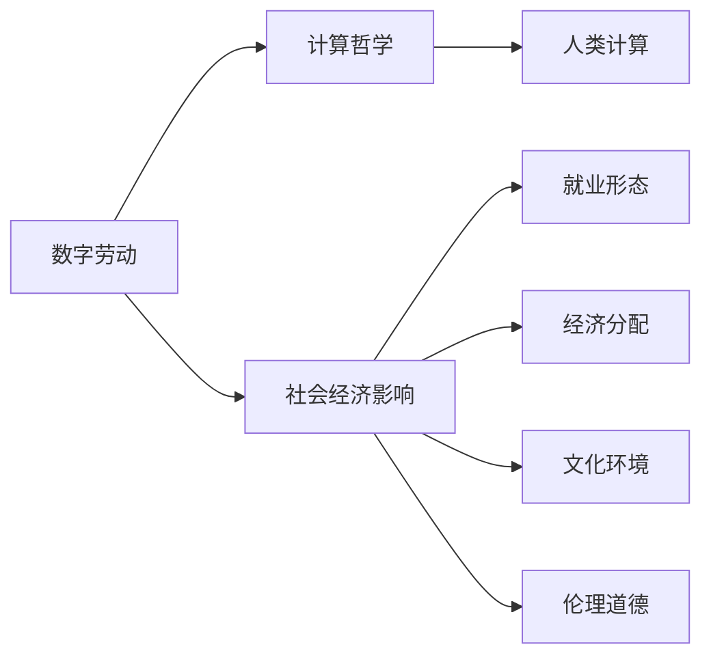

                 

# 数字劳动：人类计算的社会和经济影响

> 关键词：数字劳动，计算哲学，社会经济影响，人类计算，AI驱动

## 1. 背景介绍

### 1.1 问题由来
数字劳动的概念最早由英国学者利兹·安迪(Leah Andreski)于1977年提出，用以描述数字时代的生产劳动。如今，随着信息技术的飞速发展，数据已成为新时代的“石油”，各类数字化平台在采集、处理和分析海量数据的过程中，创造了前所未有的经济价值。数字劳动便是这种数据采集、处理和分析活动的总称，它贯穿于大数据的采集、存储、传输、处理、分析和应用的每一个环节。

**数字劳动**作为一种新型生产形式，不仅改变了传统的经济结构和就业形态，还对社会伦理、经济制度、文化环境等方面产生了深远影响。了解数字劳动的内涵及其社会经济影响，对制定科学的政策法规，实现可持续发展，构建数字时代的公平公正社会具有重要意义。

### 1.2 问题核心关键点
本文将深入探讨数字劳动的概念、本质及其对社会经济的影响。具体而言，将从以下几个方面展开讨论：

- **数字劳动的内涵与形式**：明确数字劳动的核心内容与不同形式。
- **数字劳动的经济价值与分配**：分析数字劳动在经济中的地位与价值分配问题。
- **数字劳动的社会影响**：探讨数字劳动对社会结构、文化环境、伦理道德等的影响。
- **数字劳动的挑战与对策**：剖析数字劳动面临的挑战，提出相应的对策和建议。

这些关键点构成了理解数字劳动及其社会经济影响的逻辑框架，帮助我们全面、深入地把握这一新兴领域的脉络。

## 2. 核心概念与联系

### 2.1 核心概念概述

为了更好地理解数字劳动的内涵及其对社会经济的影响，我们首先需要明确几个核心概念：

- **数字劳动**：指在数字化平台上，通过对数据进行采集、存储、传输、处理和分析等活动，创造经济价值的过程。数字劳动包括但不限于数据收集、数据标注、模型训练、算法优化、服务部署等环节。

- **计算哲学**：探究计算和智能在哲学上的意义和地位，关注计算与人类智能的辩证关系，以及人工智能对人类社会的影响。

- **社会经济影响**：指数字劳动对社会经济结构、就业形态、分配机制、文化环境等方面的影响，包括正面的促进作用和潜在的负面影响。

- **人类计算**：指利用计算机等技术工具，通过符号化、数字化等手段，进行认知活动、思维活动、决策活动的过程。

这些概念之间有着紧密的联系，共同构成了数字劳动的研究框架。数字劳动作为人类计算的一种形式，其本质是利用计算技术进行信息处理和价值创造。而计算哲学和社会经济学则是帮助我们理解这一过程的理论工具，有助于揭示其背后的社会经济动因和影响。

### 2.2 核心概念原理和架构的 Mermaid 流程图(Mermaid 流程节点中不要有括号、逗号等特殊字符)



这个流程图展示了数字劳动与计算哲学、社会经济影响、人类计算等核心概念之间的逻辑关系：

1. 数字劳动通过计算哲学的方法，将人类智能转化为机器可执行的算法和模型。
2. 数字劳动对社会经济的影响，涉及就业形态、经济分配、文化环境、伦理道德等多个方面。
3. 数字劳动本质上是一种人类计算活动，依赖于机器和计算技术。
4. 社会经济影响进一步揭示数字劳动对社会结构和文化环境的深远影响。

## 3. 核心算法原理 & 具体操作步骤

### 3.1 算法原理概述

数字劳动的核心算法原理，主要体现在以下几个方面：

- **数据采集与预处理**：通过自动化工具和算法，从各类数据源（如社交媒体、互联网应用、物联网设备等）中高效采集数据，并进行清洗、标注、分类等预处理工作。
- **机器学习与深度学习**：利用机器学习算法和深度学习模型，对数据进行特征提取、模型训练、参数优化等处理，提取数据中的潜在模式和规律。
- **分布式计算与存储**：通过分布式计算框架（如Hadoop、Spark等）和云存储平台（如AWS、阿里云等），实现大规模数据的并行处理和高效存储。
- **服务部署与调用**：将训练好的模型和算法封装成标准化服务，通过API接口进行调用，提供高效、可靠、灵活的数据服务。

这些算法原理构成了数字劳动的基石，通过不断优化和创新，逐步实现了数据的自动化处理和智能化分析。

### 3.2 算法步骤详解

数字劳动的算法步骤通常包括以下几个关键步骤：

**Step 1: 数据采集与预处理**
- 确定数据源，采用爬虫、API接口等方式采集原始数据。
- 对数据进行去重、清洗、标准化处理，去除噪声和异常值。
- 对数据进行标注和分类，构建数据集。

**Step 2: 模型训练与优化**
- 选择合适的机器学习或深度学习模型，进行特征提取和模型训练。
- 通过交叉验证、超参数调优等方法，优化模型性能。
- 使用GPU、TPU等高性能计算资源，加速模型训练。

**Step 3: 服务部署与接口化**
- 将训练好的模型和算法封装成API接口，实现快速调用。
- 部署到云端或边缘计算平台，提供高效的服务支持。
- 实时监测模型性能，定期更新模型和数据。

**Step 4: 数据可视化与分析**
- 利用数据可视化工具（如Tableau、Power BI等），展示数据分析结果。
- 通过仪表盘、报告等方式，为决策者提供数据支持。
- 进行预测性分析，评估模型效果和潜在风险。

### 3.3 算法优缺点

数字劳动的算法具有以下优点：

- **高效性**：自动化数据处理和算法优化，极大地提高了数据处理的效率和精度。
- **灵活性**：支持多种数据源和模型算法，能够快速适应不同应用场景。
- **可扩展性**：分布式计算和存储技术，支持大规模数据处理和存储。

同时，数字劳动的算法也存在一些缺点：

- **依赖技术基础设施**：对计算资源、存储设备等技术基础设施的依赖较大。
- **数据隐私和安全问题**：数据采集和处理过程中，存在隐私泄露和数据安全问题。
- **算法偏见和公平性**：算法模型可能存在偏见，导致数据分析和应用中的不公平现象。
- **技术复杂性**：需要具备较高的技术门槛，一般需要数据科学、机器学习等专业背景。

### 3.4 算法应用领域

数字劳动的算法广泛应用于以下领域：

- **大数据分析**：通过数据清洗、特征提取、模型训练等技术，对海量数据进行深入分析和挖掘。
- **智能推荐系统**：利用算法对用户行为进行分析和预测，提供个性化的推荐服务。
- **物联网应用**：通过传感器数据采集、模型训练等，实现设备智能控制和优化。
- **金融风控**：利用算法进行信用评估、风险预测、反欺诈检测等。
- **医疗健康**：通过数据分析和模型预测，提升医疗服务质量和效率。
- **智能制造**：通过数据采集和算法优化，实现生产过程的智能化和自动化。

这些领域展示了数字劳动算法的广泛应用和巨大价值，同时也揭示了其潜在的风险和挑战。

## 4. 数学模型和公式 & 详细讲解 & 举例说明

### 4.1 数学模型构建

在数字劳动中，常见的数学模型包括线性回归、逻辑回归、支持向量机、决策树、随机森林、神经网络等。以下以线性回归模型为例，进行详细讲解。

假设我们要构建一个简单的线性回归模型，用于预测房价。设输入特征为 $x_1, x_2, \ldots, x_n$，输出为 $y$。根据线性回归的原理，模型可以表示为：

$$
y = \theta_0 + \sum_{i=1}^{n} \theta_i x_i + \epsilon
$$

其中 $\theta_0$ 为截距，$\theta_i$ 为权重，$\epsilon$ 为误差项。

### 4.2 公式推导过程

线性回归模型的参数估计通常采用最小二乘法（Ordinary Least Squares, OLS），其目标是最小化实际值与预测值之间的误差平方和：

$$
\sum_{i=1}^{N} (y_i - \hat{y}_i)^2
$$

其中 $y_i$ 为实际房价，$\hat{y}_i$ 为模型预测房价，$N$ 为样本数量。

对上述目标函数求导，得到参数估计的公式：

$$
\hat{\theta} = (\mathbf{X}^T \mathbf{X})^{-1} \mathbf{X}^T \mathbf{y}
$$

其中 $\mathbf{X}$ 为特征矩阵，$\mathbf{y}$ 为目标向量。

### 4.3 案例分析与讲解

以某城市房价预测为例，我们收集了该城市的历史房价数据，以及各个小区的面积、地理位置等特征数据。通过构建线性回归模型，我们可以对未来房价进行预测。

假设特征矩阵 $\mathbf{X}$ 为：

$$
\mathbf{X} = \begin{bmatrix}
1 & 面积1 & 地理位置1 \\
1 & 面积2 & 地理位置2 \\
\vdots & \vdots & \vdots \\
1 & 面积N & 地理位置N
\end{bmatrix}
$$

目标向量 $\mathbf{y}$ 为：

$$
\mathbf{y} = \begin{bmatrix}
房价1 \\
房价2 \\
\vdots \\
房价N
\end{bmatrix}
$$

通过计算得到参数估计 $\hat{\theta}$，进而可以预测新小区的房价。

## 5. 项目实践：代码实例和详细解释说明

### 5.1 开发环境搭建

在进行数字劳动的算法实践前，我们需要准备好开发环境。以下是使用Python进行PyTorch开发的环境配置流程：

1. 安装Anaconda：从官网下载并安装Anaconda，用于创建独立的Python环境。

2. 创建并激活虚拟环境：
```bash
conda create -n pytorch-env python=3.8 
conda activate pytorch-env
```

3. 安装PyTorch：根据CUDA版本，从官网获取对应的安装命令。例如：
```bash
conda install pytorch torchvision torchaudio cudatoolkit=11.1 -c pytorch -c conda-forge
```

4. 安装TensorFlow：
```bash
pip install tensorflow
```

5. 安装Pandas和Numpy：
```bash
pip install pandas numpy
```

完成上述步骤后，即可在`pytorch-env`环境中开始数字劳动的算法实践。

### 5.2 源代码详细实现

下面是使用PyTorch构建和训练线性回归模型的代码实现：

```python
import torch
import torch.nn as nn
import torch.optim as optim
import pandas as pd
from sklearn.model_selection import train_test_split

# 加载数据
data = pd.read_csv('house_prices.csv')
X = data[['area', 'location']]
y = data['price']

# 划分训练集和测试集
X_train, X_test, y_train, y_test = train_test_split(X, y, test_size=0.2, random_state=42)

# 构建模型
model = nn.Linear(X.shape[1], 1)
criterion = nn.MSELoss()
optimizer = optim.SGD(model.parameters(), lr=0.01)

# 训练模型
for epoch in range(100):
    optimizer.zero_grad()
    y_pred = model(X_train)
    loss = criterion(y_pred, y_train)
    loss.backward()
    optimizer.step()

    if epoch % 10 == 0:
        print(f'Epoch {epoch}, Loss: {loss.item()}')

# 测试模型
model.eval()
with torch.no_grad():
    y_pred = model(X_test)
    loss = criterion(y_pred, y_test)
    print(f'Test Loss: {loss.item()}')
```

### 5.3 代码解读与分析

让我们再详细解读一下关键代码的实现细节：

**数据加载和预处理**：
- 使用Pandas加载CSV格式的数据集，将特征和标签分开。
- 使用train_test_split将数据集分为训练集和测试集。

**模型构建**：
- 定义线性回归模型，输入特征为X，输出为1。
- 定义均方误差损失函数。
- 使用随机梯度下降优化器。

**训练模型**：
- 在每个epoch内，将模型参数置为零梯度。
- 使用模型对训练集进行前向传播，计算损失函数。
- 反向传播计算梯度，并更新模型参数。
- 周期性输出损失值。

**测试模型**：
- 将模型置为评估模式。
- 使用模型对测试集进行前向传播，计算损失函数。
- 输出测试损失值。

可以看到，PyTorch提供了强大的模型构建和训练功能，可以快速构建和优化数字劳动中的线性回归模型。

## 6. 实际应用场景

### 6.1 金融风控

在金融领域，数字劳动通过大数据分析，能够实时监控交易行为，识别欺诈风险。具体而言，银行可以通过数字劳动收集用户的交易数据，建立模型进行风险预测，及时发现和处理异常交易，保护客户资金安全。

### 6.2 智能推荐系统

电子商务平台通过数字劳动，利用用户行为数据和商品信息，进行深度学习和推荐算法优化。通过智能推荐系统，平台能够更好地匹配用户需求和商品供应，提升用户体验和销售额。

### 6.3 智慧城市

智慧城市通过数字劳动，对城市数据进行全面分析和智能化管理。例如，通过数据分析和预测模型，城市可以优化交通流量、提升公共安全、改善环境质量等，提升城市的运行效率和管理水平。

### 6.4 未来应用展望

未来，数字劳动将随着人工智能和物联网技术的进一步发展，涵盖更多领域和场景。例如：

- **医疗健康**：通过数字劳动，医疗机构可以分析患者的病历数据，提供精准的诊疗方案和健康管理服务。
- **智能制造**：通过数字劳动，生产企业可以实现设备的智能化控制和优化，提高生产效率和产品质量。
- **社会治理**：通过数字劳动，政府部门可以对社会数据进行全面分析和预测，优化政策制定和资源分配。

这些未来应用场景展示了数字劳动的广阔前景，也预示着其对社会经济将产生深远的影响。

## 7. 工具和资源推荐

### 7.1 学习资源推荐

为了帮助开发者系统掌握数字劳动的理论基础和实践技巧，这里推荐一些优质的学习资源：

1. 《计算哲学导论》：一本经典著作，系统介绍了计算哲学的基本概念和重要思想。
2. 《人工智能：一种现代方法》：深入浅出地讲解了人工智能的理论基础和应用技术。
3. 《机器学习实战》：通过实例讲解，帮助读者理解机器学习算法和应用。
4. 《大数据之路》：介绍大数据技术和应用，涵盖数据采集、存储、处理和分析等环节。
5. 《深度学习》（Ian Goodfellow等著）：全面介绍深度学习的原理和应用，是深度学习领域的经典教材。
6. 《Python数据科学手册》：介绍Python在数据科学中的应用，包括数据处理、可视化和分析等。

通过这些资源的学习实践，相信你一定能够全面掌握数字劳动的理论和实践技能。

### 7.2 开发工具推荐

高效的开发离不开优秀的工具支持。以下是几款用于数字劳动开发的常用工具：

1. PyTorch：基于Python的开源深度学习框架，灵活动态的计算图，适合快速迭代研究。
2. TensorFlow：由Google主导开发的开源深度学习框架，生产部署方便，适合大规模工程应用。
3. Pandas：数据处理和分析工具，提供数据清洗、统计和可视化功能。
4. Numpy：数值计算库，提供高效的多维数组运算。
5. TensorBoard：TensorFlow配套的可视化工具，可实时监测模型训练状态，并提供丰富的图表呈现方式。
6. Jupyter Notebook：交互式编程环境，支持Python和其他多种语言。

合理利用这些工具，可以显著提升数字劳动任务的开发效率，加快创新迭代的步伐。

### 7.3 相关论文推荐

数字劳动和人工智能领域的最新研究成果，通常发表在顶级学术期刊和会议上。以下是几篇重要的相关论文，推荐阅读：

1. "Human Computation: Computing as a Subset of Human Capabilities"（1993年，Tommaso di Noto）：提出计算是人类智能的一部分，探讨计算与人类思维的关系。
2. "Data-Driven Modeling of the World"（2011年，Claude Shannon）：讨论数据驱动的模型构建，强调数据在智能系统中的重要性。
3. "Big Data: Principles and Best Practices of Scalable Real-time Data Systems"（2012年，Jeff Dean等）：介绍大数据处理的基本原理和最佳实践，涵盖数据采集、存储、处理和分析等环节。
4. "Google's Machine Learning Research", Special Issue of the Journal of the ACM"（2017年，Fei-Fei Li等）：综述Google在机器学习和深度学习领域的最新研究成果。
5. "Towards AI-Driven Digital Infrastructure for Smart Cities"（2021年，Konstantinos Katsikas等）：探讨智能城市中的AI驱动数字基础设施，分析其在智慧城市中的应用潜力。

这些论文代表了数字劳动和人工智能领域的最新研究成果，对于深入理解数字劳动的本质和应用具有重要意义。

## 8. 总结：未来发展趋势与挑战

### 8.1 研究成果总结

本文对数字劳动的概念、本质及其对社会经济的影响进行了全面系统的介绍。首先，明确了数字劳动的内涵、形式及其在社会经济中的地位。其次，详细讲解了数字劳动的核心算法原理和操作步骤，并通过案例分析展示了数字劳动在实际应用中的具体应用。最后，探讨了数字劳动面临的挑战和未来发展趋势，提出了相应的对策和建议。

通过本文的系统梳理，可以看到，数字劳动作为一种新型生产形式，已经深刻影响了现代社会的经济结构和就业形态。同时，数字劳动的算法具有高效性、灵活性和可扩展性，但也面临着技术依赖、隐私风险、算法偏见等挑战。这些问题的解决，将依赖于技术创新、伦理规范和社会政策的协同推进。

### 8.2 未来发展趋势

展望未来，数字劳动的发展趋势如下：

1. **智能算法的普及**：随着人工智能技术的不断成熟，更多智能算法将被广泛应用于数字劳动中，提升数据处理和分析的智能化水平。
2. **数据隐私保护**：数字劳动对数据隐私的依赖较大，未来需要在隐私保护和安全方面投入更多研究，确保数据使用过程中的合法性和安全性。
3. **跨学科融合**：数字劳动与经济、社会、伦理等多个学科的融合将不断深化，形成更加全面、系统的应用框架。
4. **人机协同**：未来数字劳动将更加注重人机协同，实现智能与人类智能的有效结合，提升系统的灵活性和适应性。
5. **持续学习与优化**：数字劳动系统需要具备持续学习的能力，及时更新模型和算法，适应数据分布的变化，保持高性能。

### 8.3 面临的挑战

尽管数字劳动带来了诸多机遇，但同时也面临诸多挑战：

1. **技术复杂性**：数字劳动涉及多个学科的交叉，技术门槛较高，一般需要具备较高的技术背景。
2. **数据隐私和安全**：数字劳动需要采集和处理大量的数据，数据隐私和安全问题亟待解决。
3. **算法偏见和公平性**：数字劳动的算法可能存在偏见，导致数据分析和应用中的不公平现象。
4. **资源消耗**：数字劳动需要大量的计算资源和存储设备，存在硬件资源消耗较大等问题。
5. **社会伦理问题**：数字劳动可能导致就业结构的变化，如何保障就业公平和社会稳定需要更多研究。

### 8.4 研究展望

为了应对这些挑战，未来的研究需要在以下几个方面进行深入探索：

1. **低资源计算模型**：开发更高效、低资源消耗的计算模型，降低对计算资源和存储设备的依赖。
2. **数据隐私保护技术**：研究数据隐私保护技术，确保数据使用的合法性和安全性。
3. **公平性和透明性**：建立算法的公平性和透明性评估机制，消除算法偏见，提高算法的可解释性。
4. **跨学科合作**：推动计算机科学、经济、社会、伦理等多个学科的交叉合作，形成更加全面的研究框架。
5. **可持续发展**：探索数字劳动的可持续发展路径，平衡经济效益与社会责任。

这些研究方向的探索，将推动数字劳动技术向更加智能化、普适化和可持续化的方向发展，为构建数字时代的公平公正社会提供有力支撑。总之，数字劳动作为一种新型生产形式，具有广阔的应用前景，但需要在技术、伦理、社会等多个层面进行深入研究，方能实现其潜在的巨大价值。

## 9. 附录：常见问题与解答

**Q1：数字劳动是否只涉及计算和数据处理？**

A: 数字劳动不仅涉及计算和数据处理，还包括了数据采集、存储、传输、分析、可视化和应用等多个环节。数字劳动的核心是通过计算和算法，对数据进行价值创造和智能应用。

**Q2：数字劳动对就业形态的影响是什么？**

A: 数字劳动对就业形态的影响主要体现在以下几个方面：
1. **新就业机会**：数字劳动催生了大量的数据标注、模型训练、算法优化等新就业岗位。
2. **岗位变化**：传统岗位可能被自动化技术替代，但同时也会产生新的岗位需求，如数据科学家、算法工程师等。
3. **技能要求**：数字劳动对从业者的技能要求更高，需要具备数据分析、编程、机器学习等专业知识。

**Q3：如何保证数字劳动的公平性和透明性？**

A: 保证数字劳动的公平性和透明性，可以从以下几个方面入手：
1. **算法透明性**：公开算法的实现过程和参数设置，确保算法的可解释性。
2. **数据公平性**：采用公平性评估指标，确保算法对不同群体具有公平性。
3. **隐私保护**：采用匿名化、去标识化等技术手段，保护用户隐私。
4. **用户参与**：让用户在算法设计、数据处理等环节中参与决策，增加透明度和公平性。

**Q4：数字劳动的未来发展方向是什么？**

A: 数字劳动的未来发展方向包括：
1. **智能化提升**：引入更多智能算法和AI技术，提升数据处理和分析的智能化水平。
2. **跨学科融合**：推动数字劳动与经济、社会、伦理等学科的融合，形成更加全面的应用框架。
3. **人机协同**：实现人机协同，提升系统的灵活性和适应性。
4. **可持续发展**：探索数字劳动的可持续发展路径，平衡经济效益与社会责任。

通过这些措施，数字劳动将实现更加智能化、普适化和可持续化的发展，为构建数字时代的公平公正社会提供有力支撑。

---

作者：禅与计算机程序设计艺术 / Zen and the Art of Computer Programming

