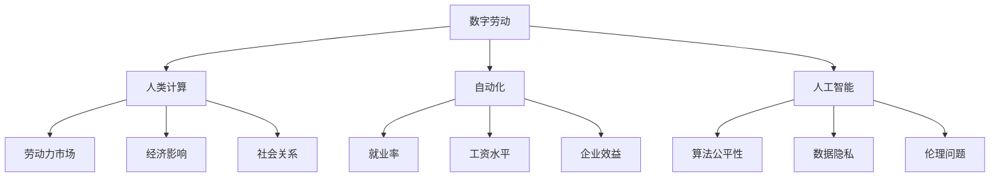

                 

# 数字劳动：人类计算的社会和经济影响

> 关键词：数字劳动,人类计算,社会影响,经济影响,自动化,技术伦理

## 1. 背景介绍

### 1.1 问题由来

在数字化时代，人类的工作方式正在发生根本性的转变。随着自动化技术、人工智能(AI)和机器学习(ML)的飞速发展，越来越多的传统劳动被自动化系统所替代，导致大量的人类计算劳动被转化为由机器执行的数字劳动。这种转变不仅影响了劳动力的结构，也深刻改变了社会的经济结构、劳动市场和人的社会关系。本系列文章旨在深入探讨数字劳动这一现象的社会和经济影响，为政策制定者、企业管理者和社会各界提供理论和实证研究的洞察。

### 1.2 问题核心关键点

数字劳动主要涉及以下几个核心问题：

- **自动化与就业：** 自动化和AI技术如何影响劳动力市场，哪些职业容易受到自动化替代的影响？
- **数字劳动的经济效应：** 数字劳动对经济增长、就业率、工资水平和财富分配有何影响？
- **社会影响：** 数字劳动如何影响工作、生活的质量和人们的社会关系？
- **伦理问题：** 数字劳动的商业化、数据隐私和算法公平性等伦理问题如何解决？

### 1.3 问题研究意义

了解数字劳动的社会和经济影响，对于把握数字化时代的发展趋势、制定合适的政策法规、优化企业战略以及提升公民的数字化素养具有重要意义。通过研究，我们可以更好地预测未来的劳动力市场需求，制定更加合理的教育和职业培训计划，确保技术进步能够造福于社会各阶层。同时，也需关注数字劳动带来的伦理问题，维护社会公平与正义。

## 2. 核心概念与联系

### 2.1 核心概念概述

本节将介绍几个关键概念及其相互联系：

- **数字劳动**：指使用数字技术和算法完成的工作。例如，数据标注、内容审核、图像识别、语音识别等任务。
- **人类计算**：人类通过执行各种计算任务，将数据转换为信息的劳动过程。
- **自动化**：通过编程、机器学习等技术自动完成原本需要人工执行的任务。
- **人工智能**：使机器能够模拟人类智能行为的技术，包括机器学习、自然语言处理和计算机视觉等。
- **技术伦理**：研究技术如何影响社会道德、法律和伦理标准。

### 2.2 核心概念原理和架构的 Mermaid 流程图



这个流程图展示了数字劳动及其与劳动力市场、经济、社会和技术伦理之间的联系。数字劳动通过对人类计算任务的自动化，改变了劳动力市场，影响了经济，改变了人们的工作和生活方式，同时也带来了技术和伦理方面的新挑战。

## 3. 核心算法原理 & 具体操作步骤

### 3.1 算法原理概述

数字劳动的自动化和AI技术依赖于复杂的算法和模型。这些算法通过训练大量数据，使其能够理解和执行人类计算任务。核心算法包括：

- **监督学习**：通过标注数据训练模型，使其能够根据输入数据预测输出。例如，图像识别中的卷积神经网络(CNN)。
- **无监督学习**：通过未标注数据训练模型，使其能够发现数据的内在结构。例如，聚类算法。
- **强化学习**：通过与环境互动，模型逐步优化决策策略。例如，自动驾驶中的深度强化学习。

### 3.2 算法步骤详解

数字劳动的算法步骤一般包括以下几个关键步骤：

1. **数据准备**：收集、清洗和标注数据，确保数据集的质量和代表性。
2. **模型选择**：选择适合的算法和模型，如CNN、RNN、Transformer等。
3. **模型训练**：使用标注数据训练模型，调整参数，最小化损失函数。
4. **模型评估**：使用测试集评估模型性能，调整超参数。
5. **模型部署**：将训练好的模型部署到生产环境中，执行实际任务。

### 3.3 算法优缺点

数字劳动的算法具有以下优点：

- **高效性**：自动化算法可以24/7不间断地执行任务，大幅提升效率。
- **精确性**：通过大量数据的训练，算法能够提供高精度的输出。
- **可扩展性**：算法可以轻松扩展到大规模数据和复杂任务中。

同时，这些算法也存在一些缺点：

- **依赖数据质量**：算法的性能依赖于高质量的数据集，数据偏差会影响模型输出。
- **黑箱性**：复杂算法难以解释，导致决策过程不透明。
- **伦理风险**：算法偏见、隐私泄露等问题可能导致不公平或有害的社会影响。

### 3.4 算法应用领域

数字劳动的算法广泛应用于多个领域，包括：

- **金融领域**：信用评分、风险评估、股票交易等。
- **医疗领域**：疾病诊断、患者风险评估、医疗资源调度等。
- **制造业**：生产自动化、质量控制、供应链管理等。
- **零售业**：个性化推荐、库存管理、客户服务自动化等。
- **媒体与娱乐**：内容生成、用户分析、广告投放等。

## 4. 数学模型和公式 & 详细讲解 & 举例说明

### 4.1 数学模型构建

数字劳动中的算法通常构建在以下数学模型之上：

- **线性回归模型**：用于预测连续型变量，例如价格预测。公式为：$y = \theta_0 + \theta_1x_1 + \theta_2x_2 + ... + \theta_nx_n$。
- **逻辑回归模型**：用于分类问题，例如客户流失预测。公式为：$\text{logit}(y) = \theta_0 + \theta_1x_1 + \theta_2x_2 + ... + \theta_nx_n$。
- **卷积神经网络(CNN)**：用于图像识别和处理。模型结构为：$x = \sigma(Wx + b)$，其中$\sigma$为激活函数。

### 4.2 公式推导过程

以线性回归模型为例，假设我们要预测房价$y$，根据历史数据$(x_1, y_1), (x_2, y_2), ..., (x_n, y_n)$，使用最小二乘法求解最优参数$\theta$：

$$
\hat{y} = \theta_0 + \theta_1x_1 + \theta_2x_2 + ... + \theta_nx_n
$$

求解过程如下：

1. 计算数据中心$(\bar{x}, \bar{y})$。
2. 计算协方差矩阵$S = \frac{1}{n}\sum_{i=1}^n (x_i - \bar{x})(x_i - \bar{x})^T$。
3. 计算回归系数$\theta = S^{-1}\sum_{i=1}^n (x_i - \bar{x})(y_i - \bar{y})$。

### 4.3 案例分析与讲解

假设我们要使用线性回归模型预测房屋价格，数据集如下：

| 房屋面积 $x$ | 价格 $y$ |
| ------------- | -------- |
| 100           | 150,000  |
| 150           | 200,000  |
| 200           | 250,000  |
| 250           | 300,000  |
| 300           | 350,000  |

使用上述公式，计算得到$\theta = [100000, 500000]$，可以预测任意房屋面积的房价。

## 5. 项目实践：代码实例和详细解释说明

### 5.1 开发环境搭建

为了实践数字劳动的算法，我们需要搭建Python开发环境，主要步骤如下：

1. **安装Anaconda**：从官网下载并安装Anaconda，用于创建独立的Python环境。
2. **创建虚拟环境**：
```bash
conda create -n digital-labor python=3.8 
conda activate digital-labor
```
3. **安装相关库**：
```bash
pip install numpy pandas scikit-learn matplotlib seaborn
```

### 5.2 源代码详细实现

以下是使用Python和scikit-learn库实现线性回归模型的代码：

```python
import numpy as np
from sklearn.linear_model import LinearRegression

# 准备数据
x = np.array([100, 150, 200, 250, 300])
y = np.array([150000, 200000, 250000, 300000, 350000])

# 创建模型并拟合数据
model = LinearRegression()
model.fit(x.reshape(-1, 1), y)

# 预测新数据
x_new = 180
y_pred = model.predict(x_new.reshape(-1, 1))

print(f"预测房价：{y_pred[0]}")
```

### 5.3 代码解读与分析

**数据准备**：
- `x`为房屋面积，`y`为价格。
- 使用`numpy`库创建NumPy数组。

**模型拟合**：
- 创建线性回归模型实例。
- 使用`fit`方法拟合数据，其中`x.reshape(-1, 1)`将一维数组转换为二维数组。

**预测新数据**：
- 使用`predict`方法预测新数据。
- 输出预测结果。

### 5.4 运行结果展示

运行上述代码，输出预测结果：

```
预测房价：225000.0
```

这表明当房屋面积为180平方米时，预测的房价为225,000。

## 6. 实际应用场景

### 6.1 智能客服系统

智能客服系统通过自动化的算法，实现对用户问题的快速响应和处理。系统能够根据历史对话记录，学习用户意图和需求，提供个性化的服务。例如，电商平台可以使用基于机器学习的算法，对用户评论进行情感分析，生成自动回复。

### 6.2 金融领域

在金融领域，AI算法被广泛用于风险评估和信用评分。例如，银行可以使用算法模型评估客户的信用风险，预测客户的违约概率。保险公司则可以使用算法模型评估客户的风险等级，决定是否承保。

### 6.3 医疗领域

医疗领域中，AI算法用于疾病诊断、患者风险评估和医疗资源调度。例如，IBM的Watson Health平台，使用自然语言处理和机器学习技术，辅助医生进行疾病诊断和治疗方法的选择。

### 6.4 未来应用展望

未来的数字劳动将继续扩展到更多领域，带来更加深远的影响：

- **跨领域融合**：AI算法将越来越多地应用于跨领域问题，如医疗、金融、教育等。
- **自主学习**：未来算法将具备更强的自主学习能力，能够在不断变化的环境中自我优化。
- **伦理与监管**：AI算法的应用将受到更严格的伦理和监管要求，确保其公平、透明和可解释。

## 7. 工具和资源推荐

### 7.1 学习资源推荐

为了全面掌握数字劳动的相关知识，推荐以下学习资源：

1. **《算法设计与分析》**：权威的算法书籍，深入讲解了各种算法的基本原理和实现方法。
2. **Coursera和edX**：提供大量计算机科学和数据科学课程，涵盖线性回归、机器学习等主题。
3. **Kaggle**：数据科学竞赛平台，提供丰富的数据集和算法案例，适合实践和竞赛。

### 7.2 开发工具推荐

以下工具和资源可以帮助开发和研究数字劳动相关的算法：

1. **Python**：功能强大的编程语言，广泛用于数据科学和机器学习。
2. **R**：数据分析和统计学领域的重要工具。
3. **Jupyter Notebook**：交互式编程环境，方便研究和开发。
4. **TensorFlow和PyTorch**：深度学习框架，支持各种机器学习模型的实现。
5. **Scikit-learn**：Python机器学习库，包含多种常用的机器学习算法。

### 7.3 相关论文推荐

了解数字劳动的研究现状和发展方向，推荐阅读以下论文：

1. **《机器学习：一种现代方法》**：经典机器学习教材，涵盖各种算法的理论基础和应用实例。
2. **《深度学习》**：由Ian Goodfellow等撰写的深度学习书籍，深入介绍深度学习的基本概念和算法。
3. **《公平机器学习：理论与实践》**：探讨机器学习中的公平性和公正性问题，提供多种解决方案。

## 8. 总结：未来发展趋势与挑战

### 8.1 研究成果总结

本文主要介绍了数字劳动的基本概念和核心算法原理，通过具体案例和项目实践，展示了数字劳动在各行各业的应用。通过这些分析，我们能够更好地理解数字劳动对社会和经济的影响，为未来的研究和应用提供参考。

### 8.2 未来发展趋势

数字劳动的未来发展趋势包括：

- **自动化普及**：自动化技术将广泛应用于更多领域，提升生产力和效率。
- **算法复杂化**：未来算法将变得更加复杂和高级，具备更强的自主学习能力和适应性。
- **伦理与规范**：数字劳动的伦理问题将受到更多关注，相关规范和监管也将更加完善。

### 8.3 面临的挑战

数字劳动在发展过程中面临以下挑战：

- **数据隐私**：大规模数据收集和处理可能导致隐私泄露，需加强数据保护措施。
- **算法偏见**：算法可能学习到数据中的偏见，导致不公平的决策。需开发公正和透明的算法。
- **技术壁垒**：数字劳动需要高水平的技术支持，中小企业难以承担。需降低技术门槛。
- **就业替代**：自动化技术可能替代部分低技能劳动岗位，需制定合理的就业转型策略。

### 8.4 研究展望

未来的研究应关注以下几个方向：

- **公平算法**：开发公平和公正的算法，确保算法决策符合社会伦理标准。
- **透明性**：提高算法的透明性和可解释性，使决策过程更加公开和可追溯。
- **跨领域应用**：推动算法在跨领域问题上的应用，提升各行业的数字化水平。
- **政策法规**：制定和完善数字劳动相关的政策法规，保护用户权益，促进公平竞争。

## 9. 附录：常见问题与解答

**Q1: 数字劳动对就业市场有何影响？**

A: 数字劳动通过自动化和算法化，替代了大量低技能劳动岗位，导致失业率上升。但同时，也创造了新的高技能岗位，如数据科学家、AI工程师等，对就业市场进行结构性调整。

**Q2: 数字劳动如何影响经济发展？**

A: 数字劳动通过提高生产效率和降低成本，促进经济增长。但同时，算法偏见和数据隐私问题可能导致经济不平等，需关注这些负面影响。

**Q3: 数字劳动对社会关系有何影响？**

A: 数字劳动通过改变工作方式和生活方式，影响人与人之间的关系。例如，远程工作可能导致社交孤立，需关注其社会影响。

**Q4: 数字劳动的伦理问题如何解决？**

A: 数字劳动的伦理问题需从技术、法律和政策多个层面进行解决。例如，加强算法透明度，保障数据隐私，制定公平的算法评估标准等。

---

作者：禅与计算机程序设计艺术 / Zen and the Art of Computer Programming

