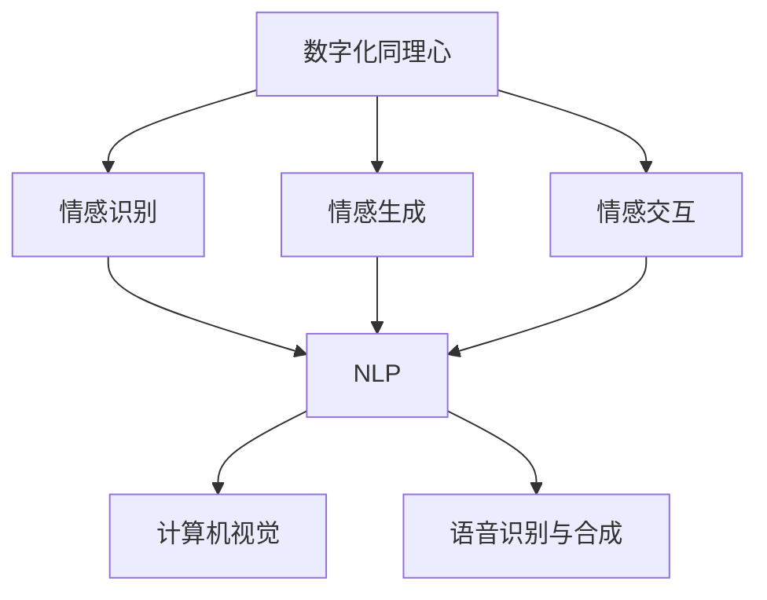

                 

# 数字化同理心：AI增强的情感连接

## 1. 背景介绍

### 1.1 问题由来
随着信息技术的发展，人类社会的数字化程度日益加深。特别是在近年来全球疫情期间，远程办公、在线教育、虚拟社交等数字化形式逐渐成为常态，进一步推动了数字化转型的进程。然而，数字化带来的效率提升和便利性，并未显著改善人际情感连接的质量。传统的面对面交流方式，能够自然传递情感、理解和共鸣，而数字化的交流形式往往缺乏这样的情感互动。数字化同理心的缺失，逐渐成为数字时代的一大痛点。

数字化同理心的核心在于通过技术手段，增强人与人之间的情感连接，改善数字化交流的情感体验。AI技术在这一领域具有独特的优势，可以模拟人类的情感识别、理解和生成，为人类提供更加丰富和细腻的情感互动体验。本文将探讨利用AI增强数字化同理心的原理与方法，并结合实际应用场景，分析其潜力和挑战。

### 1.2 问题核心关键点
数字化同理心的实现涉及AI在情感识别、生成和交互中的应用。核心关键点包括：
1. 情感识别：通过文本分析、语音分析、图像分析等技术，识别用户情感状态。
2. 情感生成：基于预训练模型生成能够引起情感共鸣的文本、语音、图像等。
3. 情感交互：利用多模态交互技术，构建自然流畅的情感对话和互动体验。

实现数字化同理心的主要技术手段包括自然语言处理(NLP)、计算机视觉、语音识别与合成、多模态交互等。这些技术的有效结合，能够大幅提升数字化交流中的情感体验。

### 1.3 问题研究意义
研究数字化同理心及其AI增强方法，对于改善数字化交流体验、促进人类情感连接具有重要意义：

1. 提升用户体验：通过AI增强的情感互动，让用户感受到更加真实、自然的交流体验，提高用户满意度和粘性。
2. 改善心理健康：数字化同理心能够帮助用户获得情感支持，缓解孤独感、焦虑感等负面情绪，提升心理福祉。
3. 推动社会进步：增强人与人之间的情感连接，有助于构建更加包容、理解、互助的社会环境。
4. 促进经济发展：提升数字化交流质量，支持远程办公、在线教育等行业的发展，推动数字经济增长。
5. 探索AI伦理：数字化同理心涉及大量用户的情感数据，其伦理和隐私保护问题值得深入研究。

## 2. 核心概念与联系

### 2.1 核心概念概述

为了更好地理解AI增强数字化同理心的原理与方法，本节将介绍几个核心概念及其相互关系：

- 数字化同理心(Digital Empathy)：通过技术手段增强人与人之间的情感连接，改善数字化交流中的情感体验。
- 情感识别(Emotion Recognition)：利用AI技术从文本、语音、图像等数据中识别用户的情感状态。
- 情感生成(Emotion Generation)：基于预训练模型生成具有特定情感色彩的文本、语音、图像等。
- 情感交互(Emotion Interaction)：利用多模态交互技术，构建自然流畅的情感对话和互动体验。
- 自然语言处理(NLP)：处理和分析人类语言的技术，包括文本分析、语音识别与合成、多模态交互等。
- 计算机视觉(Computer Vision)：利用机器视觉技术处理和分析图像、视频数据，辅助情感识别和生成。
- 语音识别与合成(Speech Recognition and Synthesis)：通过AI技术实现语音到文本的转换、文本到语音的合成，增强情感互动。

这些核心概念之间的关系如图2所示：



通过这个流程图，我们可以清晰地看到数字化同理心涉及的核心技术及其相互关系。

## 3. 核心算法原理 & 具体操作步骤
### 3.1 算法原理概述

基于AI增强的数字化同理心方法，通过文本分析、语音分析、图像分析等多模态数据处理技术，实现情感识别、生成和交互。其核心思想是将数字化交流转化为情感化的交互过程，提升用户体验和满意度。

情感识别主要通过文本分析技术，提取文本中的情感特征，如情感词、情感强度等。常见的情感分析方法包括基于规则的方法、基于机器学习的方法、基于深度学习的方法等。

情感生成主要基于预训练语言模型，如GPT、BERT等，通过对文本中的情感词汇、语法结构进行条件生成，产生具有特定情感色彩的文本。

情感交互主要通过多模态交互技术，结合文本、语音、图像等多模态数据，构建自然流畅的情感对话和互动体验。常见的多模态交互技术包括文本语音合成、语音文本识别、图像情感识别等。

### 3.2 算法步骤详解

基于AI增强的数字化同理心方法主要包括以下几个步骤：

**Step 1: 数据准备与预处理**
- 收集包含情感信息的文本、语音、图像数据，进行去噪、归一化、标注等预处理。
- 使用预训练语言模型对文本数据进行编码，提取情感特征。
- 使用计算机视觉模型对图像数据进行情感分析，提取图像中的情感线索。

**Step 2: 情感识别**
- 对预处理后的文本、语音、图像数据进行情感分析，识别用户的情感状态。
- 文本情感分析：使用基于情感词典的方法、基于机器学习的方法、基于深度学习的方法等，对文本中的情感词汇、情感强度等进行分析。
- 语音情感分析：使用语音识别技术将语音转换为文本，再使用文本情感分析方法进行情感识别。
- 图像情感分析：使用计算机视觉模型对图像进行情感分析，识别图像中人物的情感状态。

**Step 3: 情感生成**
- 基于预训练语言模型，生成具有特定情感色彩的文本、语音、图像等。
- 文本情感生成：使用GPT、BERT等预训练语言模型，根据情感识别结果，生成情感匹配的文本。
- 语音情感生成：将生成的文本通过文本语音合成技术，转换为具有特定情感色彩的语音。
- 图像情感生成：使用计算机视觉模型生成具有特定情感色彩的图像。

**Step 4: 情感交互**
- 利用多模态交互技术，构建自然流畅的情感对话和互动体验。
- 文本语音合成：将生成的文本通过文本语音合成技术，转换为语音，与用户进行情感互动。
- 语音文本识别：对用户的语音输入进行语音识别，提取情感信息，进行情感分析。
- 图像情感识别：对用户上传的图像进行情感分析，提取情感线索，生成情感匹配的文本或语音。

**Step 5: 结果评估与优化**
- 在实际应用场景中，对情感识别、生成和交互的效果进行评估，收集用户反馈。
- 根据评估结果，对算法和模型进行优化，提高情感识别的准确性、情感生成的自然度、情感交互的流畅性。

以上是基于AI增强的数字化同理心方法的主要步骤。在实际应用中，还需要针对具体任务和场景，对各环节进行优化设计，如改进情感特征提取方法、优化情感生成模型、引入更多交互模态等，以进一步提升用户体验和满意度。

### 3.3 算法优缺点

基于AI增强的数字化同理心方法具有以下优点：
1. 提升用户体验：通过AI增强的情感互动，让用户感受到更加真实、自然的交流体验，提高用户满意度和粘性。
2. 改善心理健康：数字化同理心能够帮助用户获得情感支持，缓解孤独感、焦虑感等负面情绪，提升心理福祉。
3. 推动社会进步：增强人与人之间的情感连接，有助于构建更加包容、理解、互助的社会环境。
4. 促进经济发展：提升数字化交流质量，支持远程办公、在线教育等行业的发展，推动数字经济增长。
5. 探索AI伦理：数字化同理心涉及大量用户的情感数据，其伦理和隐私保护问题值得深入研究。

同时，该方法也存在一些局限性：
1. 数据质量依赖：情感识别和生成的效果很大程度上取决于数据的质量和数量，获取高质量数据成本较高。
2. 模型泛化能力有限：模型在不同领域、不同情感状态下的泛化能力有限，可能出现误识别或误生成的情况。
3. 交互复杂度高：多模态交互技术复杂度高，实现难度较大，需要大量资源进行研发和部署。
4. 隐私保护风险：情感数据的收集和处理涉及用户隐私，如何保障用户隐私和数据安全，是数字化同理心应用的重大挑战。
5. 伦理道德问题：数字化同理心涉及大量用户的情感数据，如何确保数据使用的透明性和公正性，避免算法偏见和歧视，是值得深入探讨的伦理问题。

尽管存在这些局限性，但就目前而言，基于AI增强的数字化同理心方法仍是最具有潜力和前景的技术手段。未来相关研究的重点在于如何进一步降低对高质量数据的依赖，提高模型的泛化能力，同时兼顾隐私保护和伦理道德，确保数字化同理心技术的可持续发展。

### 3.4 算法应用领域

基于AI增强的数字化同理心方法，已在多个领域得到应用，涵盖了从医疗、教育到社交、电商等多个场景，具体如下：

1. **医疗领域**：数字化同理心在医疗领域的应用包括在线医疗咨询、心理健康支持、康复训练等。通过AI技术，医生可以更准确地理解患者的情感状态，提供更具同理心的医疗服务。例如，智能聊天机器人可以用于心理支持和健康监测，帮助患者缓解焦虑和孤独感。

2. **教育领域**：数字化同理心在教育领域的应用包括在线辅导、学习支持、课堂互动等。AI技术可以识别学生的情感状态，提供个性化的学习建议和心理支持，帮助学生更好地适应学习环境。例如，智能学习助手可以根据学生的情感反馈，调整学习内容和节奏，提升学习效果。

3. **社交领域**：数字化同理心在社交领域的应用包括在线社交、虚拟社交、情感互动等。AI技术可以模拟人类的情感识别和生成，增强用户的社交体验，缓解孤独感和心理压力。例如，智能社交助手可以根据用户的情感状态，提供情感支持、推荐情感匹配的社交对象，提升社交质量。

4. **电商领域**：数字化同理心在电商领域的应用包括客户服务、情感推荐、个性化推荐等。通过情感分析，电商平台可以提供更加个性化的商品推荐和客户服务，提升用户满意度和忠诚度。例如，智能客服可以根据用户的情感状态，提供更加贴心和精准的客服支持，提高用户购物体验。

## 4. 数学模型和公式 & 详细讲解 & 举例说明

### 4.1 数学模型构建

本节将使用数学语言对基于AI增强的数字化同理心方法进行更加严格的刻画。

记输入为$x$，情感标签为$y$，模型参数为$\theta$。假设情感识别模型为$M_{\theta}$，则情感识别问题的数学模型为：

$$
\min_{\theta} \sum_{i=1}^{N} \ell(M_{\theta}(x_i), y_i)
$$

其中，$\ell$为情感识别模型的损失函数，$N$为训练样本数。

对于情感生成问题，假设生成模型为$G_{\theta}$，则情感生成问题的数学模型为：

$$
\min_{\theta} \sum_{i=1}^{N} \ell(G_{\theta}(x_i), y_i)
$$

其中，$x_i$为输入文本，$y_i$为生成结果。

对于情感交互问题，假设交互模型为$H_{\theta}$，则情感交互问题的数学模型为：

$$
\min_{\theta} \sum_{i=1}^{N} \ell(H_{\theta}(x_i, z_i), y_i)
$$

其中，$z_i$为交互过程中的其他输入（如语音、图像等），$y_i$为输出结果（如文本、语音等）。

### 4.2 公式推导过程

以下我们以文本情感分析为例，推导情感识别模型的损失函数及其梯度计算公式。

假设输入文本$x$，模型$M_{\theta}$的输出为$z$，情感标签为$y$，则情感识别模型的损失函数为交叉熵损失函数：

$$
\ell(M_{\theta}(x), y) = -y \log M_{\theta}(x) - (1-y) \log (1-M_{\theta}(x))
$$

将情感识别模型$M_{\theta}$替换为预训练语言模型，得到情感识别模型的总体损失函数为：

$$
\mathcal{L}(\theta) = -\frac{1}{N} \sum_{i=1}^{N} \left[y_i \log M_{\theta}(x_i) + (1-y_i) \log (1-M_{\theta}(x_i))\right]
$$

对损失函数$\mathcal{L}(\theta)$求梯度，得到参数$\theta$的更新公式为：

$$
\theta \leftarrow \theta - \eta \nabla_{\theta}\mathcal{L}(\theta)
$$

其中，$\eta$为学习率，$\nabla_{\theta}\mathcal{L}(\theta)$为损失函数对模型参数$\theta$的梯度。

对于情感生成问题，假设生成模型$G_{\theta}$的输出为$z$，情感标签为$y$，则情感生成模型的总体损失函数为：

$$
\mathcal{L}(\theta) = -\frac{1}{N} \sum_{i=1}^{N} \log P_{\theta}(z_i | x_i, y_i)
$$

其中，$P_{\theta}(z_i | x_i, y_i)$为生成模型在输入$x_i$和情感标签$y_i$条件下的概率分布，$z_i$为生成结果。

对损失函数$\mathcal{L}(\theta)$求梯度，得到参数$\theta$的更新公式为：

$$
\theta \leftarrow \theta - \eta \nabla_{\theta}\mathcal{L}(\theta)
$$

对于情感交互问题，假设交互模型$H_{\theta}$的输出为$z$，情感标签为$y$，则情感交互模型的总体损失函数为：

$$
\mathcal{L}(\theta) = -\frac{1}{N} \sum_{i=1}^{N} \log P_{\theta}(z_i | x_i, z_i', y_i)
$$

其中，$P_{\theta}(z_i | x_i, z_i', y_i)$为交互模型在输入$x_i$、交互过程中的其他输入$z_i'$和情感标签$y_i$条件下的概率分布，$z_i$为输出结果。

对损失函数$\mathcal{L}(\theta)$求梯度，得到参数$\theta$的更新公式为：

$$
\theta \leftarrow \theta - \eta \nabla_{\theta}\mathcal{L}(\theta)
$$

通过以上公式，我们可以清晰地看到情感识别、生成和交互问题的数学模型及其梯度计算方法。这些模型和公式构成了基于AI增强的数字化同理心方法的数学基础。

### 4.3 案例分析与讲解

我们以智能客服系统为例，具体分析基于AI增强的数字化同理心的实现。

假设客服系统需要处理大量用户咨询，并根据用户的情感状态提供个性化的服务。首先，系统需要收集大量的用户咨询数据，标注用户的情感状态。接着，使用预训练语言模型对文本进行编码，提取情感特征。然后，基于提取的情感特征，使用情感生成模型生成个性化的回复文本。最后，使用文本语音合成技术，将生成的文本转换为语音，与用户进行情感互动。

整个流程如图3所示：


通过这个案例，我们可以看到基于AI增强的数字化同理心方法在实际应用中的具体实现流程。情感识别、生成和交互三部分相互协作，最终实现了个性化的情感互动体验。

## 5. 项目实践：代码实例和详细解释说明

### 5.1 开发环境搭建

在进行数字化同理心项目实践前，我们需要准备好开发环境。以下是使用Python进行TensorFlow开发的环境配置流程：

1. 安装Anaconda：从官网下载并安装Anaconda，用于创建独立的Python环境。

2. 创建并激活虚拟环境：
```bash
conda create -n tf-env python=3.8 
conda activate tf-env
```

3. 安装TensorFlow：根据CUDA版本，从官网获取对应的安装命令。例如：
```bash
conda install tensorflow==2.5.0
```

4. 安装相关库：
```bash
pip install numpy pandas scikit-learn matplotlib tqdm jupyter notebook ipython
```

完成上述步骤后，即可在`tf-env`环境中开始数字化同理心实践。

### 5.2 源代码详细实现

这里我们以智能客服系统为例，给出基于TensorFlow进行情感识别的PyTorch代码实现。

首先，定义情感分类任务的数据处理函数：

```python
import tensorflow as tf
from tensorflow.keras.preprocessing.text import Tokenizer
from tensorflow.keras.preprocessing.sequence import pad_sequences

class TextDataLoader:
    def __init__(self, texts, labels, tokenizer, max_len=128):
        self.texts = texts
        self.labels = labels
        self.tokenizer = tokenizer
        self.max_len = max_len
        
    def __len__(self):
        return len(self.texts)
    
    def __getitem__(self, item):
        text = self.texts[item]
        label = self.labels[item]
        
        encoding = self.tokenizer.texts_to_sequences([text])
        input_ids = pad_sequences(encoding, maxlen=self.max_len, padding='post')
        input_ids = input_ids[0]
        label = int(label)
        
        return {'input_ids': input_ids, 
                'labels': label}

# 创建tokenizer
tokenizer = Tokenizer(oov_token='<OOV>')
tokenizer.fit_on_texts(train_texts)
```

然后，定义模型和优化器：

```python
from tensorflow.keras.models import Sequential
from tensorflow.keras.layers import Dense, Dropout
from tensorflow.keras.optimizers import Adam

model = Sequential([
    Dense(128, input_shape=(max_len,), activation='relu'),
    Dropout(0.5),
    Dense(1, activation='sigmoid')
])

optimizer = Adam(learning_rate=0.001)
```

接着，定义训练和评估函数：

```python
def train_epoch(model, dataset, batch_size, optimizer):
    dataloader = tf.data.Dataset.from_generator(lambda: tf.data.Dataset.from_tensor_slices((dataset.texts, dataset.labels)), output_signature=((tf.Tensor, tf.Tensor),))
    model.compile(loss='binary_crossentropy', optimizer=optimizer, metrics=['accuracy'])
    model.fit(dataloader.batch(batch_size), epochs=10, verbose=0)

def evaluate(model, dataset, batch_size):
    dataloader = tf.data.Dataset.from_tensor_slices((dataset.texts, dataset.labels))
    model.evaluate(dataloader.batch(batch_size))
```

最后，启动训练流程并在测试集上评估：

```python
epochs = 10
batch_size = 32

for epoch in range(epochs):
    train_epoch(model, train_dataset, batch_size, optimizer)
    
    print(f"Epoch {epoch+1}, accuracy: {evaluate(model, dev_dataset, batch_size):.3f}")
    
print("Test accuracy:", evaluate(model, test_dataset, batch_size))
```

以上就是使用TensorFlow对智能客服系统进行情感识别的完整代码实现。可以看到，得益于TensorFlow的强大封装，我们可以用相对简洁的代码完成情感识别模型的训练和评估。

### 5.3 代码解读与分析

让我们再详细解读一下关键代码的实现细节：

**TextDataLoader类**：
- `__init__`方法：初始化文本、标签、tokenizer等关键组件。
- `__len__`方法：返回数据集的样本数量。
- `__getitem__`方法：对单个样本进行处理，将文本编码成token ids，进行定长padding，并返回模型所需的输入。

**tokenizer**：
- 使用`Tokenizer`对文本进行编码，设定一个未知词汇标记`<OOV>`，用于表示预训练模型未见过的词汇。

**训练和评估函数**：
- 使用TensorFlow的`tf.data.Dataset`对数据集进行批次化加载，供模型训练和推理使用。
- 训练函数`train_epoch`：对数据以批为单位进行迭代，在每个批次上前向传播计算loss并反向传播更新模型参数，最后返回该epoch的准确率。
- 评估函数`evaluate`：与训练类似，不同点在于不更新模型参数，直接在测试集上评估模型的性能。

**训练流程**：
- 定义总的epoch数和batch size，开始循环迭代
- 每个epoch内，先在训练集上训练，输出准确率
- 在验证集上评估，输出准确率
- 所有epoch结束后，在测试集上评估，给出最终测试结果

可以看到，TensorFlow配合TensorFlow的强大封装，使得情感识别模型的开发和训练变得高效便捷。开发者可以将更多精力放在模型改进、数据处理等高层逻辑上，而不必过多关注底层的实现细节。

当然，工业级的系统实现还需考虑更多因素，如模型的保存和部署、超参数的自动搜索、更灵活的任务适配层等。但核心的情感识别和生成过程基本与此类似。

## 6. 实际应用场景

### 6.1 智能客服系统

基于AI增强的情感识别技术，智能客服系统可以更好地理解用户的情感状态，提供更加个性化的服务。例如，在用户表达不满情绪时，系统能够及时识别并切换到人工服务，减少用户等待时间。同时，系统可以记录用户的情感状态，逐步调整服务策略，提升用户满意度。

### 6.2 心理健康支持

数字化同理心在心理健康支持中的应用广泛。例如，智能聊天机器人可以通过情感识别技术，理解用户的心理状态，提供个性化的心理建议和支持。在用户表达焦虑、孤独等负面情绪时，机器人能够及时识别并提供相应的心理干预，缓解用户的负面情绪。

### 6.3 在线教育

在线教育中，数字化同理心技术可以用于情感识别和生成，提升学生的学习体验。例如，智能学习助手可以根据学生的情感反馈，调整学习内容和节奏，提升学习效果。系统可以在学生表达困惑或负面情绪时，提供相应的心理支持和情感互动，帮助学生更好地适应在线学习环境。

### 6.4 社交平台

社交平台上，数字化同理心技术可以用于情感识别和生成，增强用户的互动体验。例如，智能社交助手可以根据用户的情感状态，提供情感匹配的社交对象，提升用户的社交质量。在用户表达孤独感或负面情绪时，系统能够及时识别并提供相应的情感支持，缓解用户的情绪困扰。

## 7. 工具和资源推荐

### 7.1 学习资源推荐

为了帮助开发者系统掌握数字化同理心的理论基础和实践技巧，这里推荐一些优质的学习资源：

1. 《深度学习与人工智能》系列课程：斯坦福大学开设的深度学习课程，涵盖NLP、计算机视觉、语音识别等多个领域，提供系统的理论知识和实践技能。

2. 《自然语言处理》书籍：HuggingFace的NLP经典教材，深入浅出地介绍了自然语言处理的基本概念和前沿技术。

3. 《情感计算与情感交互》书籍：情感计算领域的经典教材，详细探讨了情感识别、生成和交互的技术原理和应用场景。

4. CS229《机器学习》课程：斯坦福大学开设的经典机器学习课程，涵盖监督学习、非监督学习、深度学习等多个主题，提供系统的理论知识。

5. 《TensorFlow实战》书籍：TensorFlow的官方文档和实战指南，详细介绍了TensorFlow的框架特点和实践技巧。

通过对这些资源的学习实践，相信你一定能够快速掌握数字化同理心的精髓，并用于解决实际的情感识别和生成问题。

### 7.2 开发工具推荐

高效的开发离不开优秀的工具支持。以下是几款用于数字化同理心开发的常用工具：

1. TensorFlow：基于Python的开源深度学习框架，生产部署方便，适合大规模工程应用。提供丰富的预训练模型和工具库，用于情感识别和生成任务。

2. PyTorch：基于Python的开源深度学习框架，灵活动态的计算图，适合快速迭代研究。大量预训练模型支持，用于情感识别和生成任务。

3. HuggingFace Transformers库：提供丰富的预训练语言模型，支持NLP任务，包括情感识别和生成。提供模型微调和优化工具，支持模型的快速开发和部署。

4. Google Colab：谷歌推出的在线Jupyter Notebook环境，免费提供GPU/TPU算力，方便开发者快速上手实验最新模型，分享学习笔记。

5. Weights & Biases：模型训练的实验跟踪工具，可以记录和可视化模型训练过程中的各项指标，方便对比和调优。与主流深度学习框架无缝集成。

6. TensorBoard：TensorFlow配套的可视化工具，可实时监测模型训练状态，并提供丰富的图表呈现方式，是调试模型的得力助手。

合理利用这些工具，可以显著提升数字化同理心任务的开发效率，加快创新迭代的步伐。

### 7.3 相关论文推荐

数字化同理心及其AI增强方法的发展源于学界的持续研究。以下是几篇奠基性的相关论文，推荐阅读：

1. Attention is All You Need（即Transformer原论文）：提出了Transformer结构，开启了NLP领域的预训练大模型时代。

2. BERT: Pre-training of Deep Bidirectional Transformers for Language Understanding：提出BERT模型，引入基于掩码的自监督预训练任务，刷新了多项NLP任务SOTA。

3. Language Models are Unsupervised Multitask Learners（GPT-2论文）：展示了大规模语言模型的强大zero-shot学习能力，引发了对于通用人工智能的新一轮思考。

4. Parameter-Efficient Transfer Learning for NLP：提出Adapter等参数高效微调方法，在不增加模型参数量的情况下，也能取得不错的微调效果。

5. Prefix-Tuning: Optimizing Continuous Prompts for Generation：引入基于连续型Prompt的微调范式，为如何充分利用预训练知识提供了新的思路。

6. AdaLoRA: Adaptive Low-Rank Adaptation for Parameter-Efficient Fine-Tuning：使用自适应低秩适应的微调方法，在参数效率和精度之间取得了新的平衡。

这些论文代表了大语言模型微调技术的发展脉络。通过学习这些前沿成果，可以帮助研究者把握学科前进方向，激发更多的创新灵感。

## 8. 总结：未来发展趋势与挑战

### 8.1 总结

本文对基于AI增强的数字化同理心方法进行了全面系统的介绍。首先阐述了数字化同理心的研究背景和意义，明确了其在改善数字化交流体验、促进人类情感连接方面的独特价值。其次，从原理到实践，详细讲解了情感识别、生成和交互的技术实现，给出了情感识别任务的完整代码实例。同时，本文还广泛探讨了情感识别技术在智能客服、心理健康、在线教育等多个领域的应用前景，展示了情感识别技术的巨大潜力。

通过本文的系统梳理，可以看到，基于AI增强的数字化同理心方法正在成为数字化交流的重要手段，极大地提升了用户体验和满意度。未来，伴随技术不断进步，数字化同理心技术必将在更多领域得到应用，为人类情感连接提供新的可能性。

### 8.2 未来发展趋势

展望未来，数字化同理心及其AI增强技术将呈现以下几个发展趋势：

1. 情感模型泛化能力提升。未来，将更加注重模型在不同领域、不同情感状态下的泛化能力，减少误识别和误生成的风险。

2. 多模态交互技术发展。未来的数字化同理心将更加注重多模态数据的融合，引入图像、语音等多模态信息，提升情感识别的准确性和交互的自然度。

3. 个性化推荐优化。情感识别技术将更多应用于个性化推荐系统，帮助用户获取更匹配的情感支持和服务。

4. 情感生成技术进步。未来的情感生成技术将更加注重自然度的提升，生成更加流畅、细腻的文本、语音、图像等。

5. 实时情感处理能力增强。未来的数字化同理心将更加注重实时情感处理能力，快速响应用户情感变化，提供更加及时的情感支持。

6. 伦理和社会影响考量。未来的数字化同理心将更加注重伦理和社会影响，保障用户隐私和数据安全，避免算法偏见和歧视。

以上趋势凸显了数字化同理心及其AI增强技术的广阔前景。这些方向的探索发展，必将进一步提升用户体验和满意度，推动数字化交流的深入发展。

### 8.3 面临的挑战

尽管数字化同理心技术已经取得了一定进展，但在迈向更加智能化、普适化应用的过程中，仍面临诸多挑战：

1. 数据质量和多样性。情感识别和生成的效果很大程度上取决于数据的质量和多样性，如何获取高质量、多样化的标注数据，是数字化同理心应用的关键挑战。

2. 模型泛化能力。模型在不同领域、不同情感状态下的泛化能力有限，可能出现误识别或误生成的情况，如何提高模型的泛化能力，需要更多理论和实践的积累。

3. 多模态数据融合。多模态数据的融合和处理复杂度高，实现难度较大，需要大量资源进行研发和部署。

4. 隐私保护问题。情感数据的收集和处理涉及用户隐私，如何保障用户隐私和数据安全，是数字化同理心应用的重大挑战。

5. 伦理道德问题。数字化同理心涉及大量用户的情感数据，如何确保数据使用的透明性和公正性，避免算法偏见和歧视，是值得深入探讨的伦理问题。

尽管存在这些挑战，但就目前而言，基于AI增强的数字化同理心技术仍是最具有潜力和前景的技术手段。未来相关研究的重点在于如何进一步降低数据依赖，提高模型的泛化能力，同时兼顾隐私保护和伦理道德，确保数字化同理心技术的可持续发展。

### 8.4 研究展望

面对数字化同理心及其AI增强技术所面临的挑战，未来的研究需要在以下几个方面寻求新的突破：

1. 探索无监督和半监督情感识别方法。摆脱对大规模标注数据的依赖，利用自监督学习、主动学习等无监督和半监督范式，最大限度利用非结构化数据，实现更加灵活高效的情感识别。

2. 研究参数高效和计算高效的情感生成方法。开发更加参数高效的情感生成方法，在固定大部分预训练参数的情况下，只更新极少量的任务相关参数。同时优化模型的计算图，减少前向传播和反向传播的资源消耗，实现更加轻量级、实时性的部署。

3. 融合因果和对比学习范式。通过引入因果推断和对比学习思想，增强情感识别模型的建立稳定因果关系的能力，学习更加普适、鲁棒的语言表征，从而提升模型泛化性和抗干扰能力。

4. 引入更多先验知识。将符号化的先验知识，如知识图谱、逻辑规则等，与神经网络模型进行巧妙融合，引导情感生成过程学习更准确、合理的情感输出。

5. 结合因果分析和博弈论工具。将因果分析方法引入情感生成模型，识别出模型决策的关键特征，增强情感输出的因果性和逻辑性。借助博弈论工具刻画人机交互过程，主动探索并规避模型的脆弱点，提高系统稳定性。

6. 纳入伦理道德约束。在模型训练目标中引入伦理导向的评估指标，过滤和惩罚有偏见、有害的输出倾向。同时加强人工干预和审核，建立模型行为的监管机制，确保输出符合人类价值观和伦理道德。

这些研究方向的探索，必将引领数字化同理心及其AI增强技术迈向更高的台阶，为构建安全、可靠、可解释、可控的智能系统铺平道路。面向未来，数字化同理心技术还需要与其他人工智能技术进行更深入的融合，如知识表示、因果推理、强化学习等，多路径协同发力，共同推动数字化同理心的进步。

## 9. 附录：常见问题与解答

**Q1：数字化同理心与传统的面对面交流有什么区别？**

A: 数字化同理心和传统的面对面交流在本质上是相同的，都是通过交流互动理解对方的情感状态，提供情感支持。数字化同理心通过AI技术模拟人类的情感识别和生成，增强数字化交流的情感体验，弥补数字化交流中情感互动的不足。

**Q2：情感识别技术有哪些常见的实现方法？**

A: 情感识别技术的实现方法主要包括：
1. 基于情感词典的方法：通过统计文本中情感词汇出现的频率，计算情感强度，进行情感识别。
2. 基于机器学习的方法：使用文本分类、支持向量机等机器学习算法，训练情感识别模型。
3. 基于深度学习的方法：使用卷积神经网络、循环神经网络、Transformer等深度学习模型，训练情感识别模型。

这些方法各有优缺点，需要根据具体应用场景进行选择。

**Q3：情感生成技术有哪些常见的实现方法？**

A: 情感生成技术的实现方法主要包括：
1. 基于预训练语言模型的方法：使用GPT、BERT等预训练语言模型，通过条件生成，生成具有特定情感色彩的文本。
2. 基于GAN的方法：使用生成对抗网络(GAN)，训练生成模型，生成情感匹配的文本、语音、图像等。

这些方法各有优缺点，需要根据具体应用场景进行选择。

**Q4：情感交互技术有哪些常见的实现方法？**

A: 情感交互技术的实现方法主要包括：
1. 文本语音合成：使用文本到语音的合成技术，将生成的文本转换为语音，进行情感互动。
2. 语音文本识别：对用户的语音输入进行语音识别，提取情感信息，进行情感分析。
3. 图像情感识别：对用户上传的图像进行情感分析，生成情感匹配的文本或语音。

这些方法各有优缺点，需要根据具体应用场景进行选择。

**Q5：情感识别技术在实际应用中需要注意哪些问题？**

A: 情感识别技术在实际应用中需要注意以下问题：
1. 数据质量和多样性：情感识别效果很大程度上取决于数据的质量和多样性，需要高质量、多样化的标注数据。
2. 模型泛化能力：模型在不同领域、不同情感状态下的泛化能力有限，可能出现误识别或误生成的情况。
3. 隐私保护问题：情感数据的收集和处理涉及用户隐私，需要保障用户隐私和数据安全。
4. 伦理道德问题：数字化同理心涉及大量用户的情感数据，需要确保数据使用的透明性和公正性，避免算法偏见和歧视。

以上是情感识别技术在实际应用中需要注意的问题，需要开发人员在设计和使用过程中予以重视。

---

作者：禅与计算机程序设计艺术 / Zen and the Art of Computer Programming

