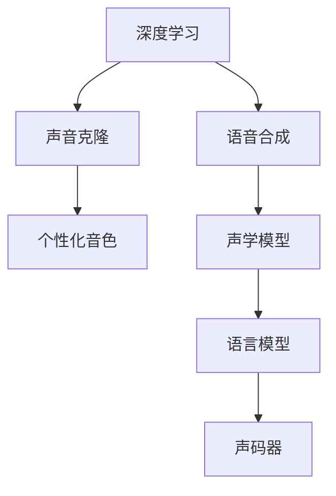

                 

# 数字化声音克隆创业：个性化语音定制

## 1. 背景介绍

在数字化技术迅猛发展的今天，个性化声音定制已经成为众多数字化创业项目的热点。个性化语音定制不仅仅是一项技术创新，更是连接声音与数字世界的桥梁，赋予了人们全新的声音体验。

### 1.1 项目背景

声音是我们与世界互动的重要方式之一。传统的语音设备如手机、电脑往往局限于通用的音色，缺乏个性和情感色彩。个性化语音定制则通过深度学习和语音合成技术，赋予用户独特的声音，从而提升用户体验。

项目旨在通过声音克隆技术，为每位用户提供独一无二的声音，以满足其在社交、娱乐、商务等方面的个性化需求。项目的目标是成为行业内的声音定制先驱，实现数字化声音克隆的商业化应用，推动声音技术在更多场景中的应用。

### 1.2 项目优势

1. **高度个性化的声音定制**：利用深度学习技术，项目能够根据用户的声音特征进行高度个性化的声音克隆，实现用户期望的声音效果。

2. **无缝集成到现有设备**：项目提供简单易用的API接口，可以快速集成到各类数字设备中，如手机、电脑、智能音箱等，实现个性化声音的实时输出。

3. **丰富的音色选择**：项目提供多种自然音色选择，用户可以根据需要选择不同的音色进行个性化定制。

4. **高效的声音合成**：采用先进的神经网络技术，项目能够在短时间内完成高质量的声音合成，满足用户的实时需求。

5. **高隐私保护**：项目采用端到端加密技术，确保用户声音数据的隐私安全，防止数据泄露。

## 2. 核心概念与联系

### 2.1 核心概念概述

为更好地理解项目涉及的核心技术，本节将介绍几个关键概念：

- **深度学习**：一种基于神经网络的机器学习技术，通过多层非线性变换，自动学习特征提取、模式识别等复杂任务。
- **语音合成**：将文本转换为语音的过程，涉及声学模型、语言模型、声码器等关键组件。
- **声音克隆**：根据输入声音，生成与输入声音高度相似的新声音，广泛应用于个性化语音、语音合成等领域。
- **个性化音色**：根据用户的嗓音特点，生成符合用户声音特征的新声音，实现高度个性化的音色定制。

这些核心概念之间的逻辑关系可以通过以下Mermaid流程图来展示：



这个流程图展示了深度学习、语音合成、声音克隆、个性化音色之间的联系：

1. 深度学习用于特征提取和模式识别，是语音合成的核心技术。
2. 语音合成包括声学模型、语言模型和声码器，用于将文本转换为语音。
3. 声音克隆技术基于语音合成，通过深度学习生成与输入声音高度相似的新声音。
4. 个性化音色技术在声音克隆的基础上，结合用户的嗓音特点，生成符合用户声音特征的新声音。

## 3. 核心算法原理 & 具体操作步骤

### 3.1 算法原理概述

项目利用深度学习进行声音克隆，主要分为两个阶段：特征提取和声音生成。

特征提取阶段，使用卷积神经网络（CNN）或循环神经网络（RNN）对输入声音进行特征提取，提取出声音的频谱特征、共振峰位置、基频等关键信息。

声音生成阶段，利用语音合成模型，将提取的特征信息映射为新的声音波形。常用的语音合成模型包括深度学习驱动的基于神经网络的模型（如Tacotron 2、WaveNet等）。

### 3.2 算法步骤详解

以下是声音克隆项目的核心算法步骤：

**Step 1: 特征提取**

输入声音信号经过预处理（如去噪、归一化）后，输入卷积神经网络（CNN）或循环神经网络（RNN），提取声音的频谱特征、共振峰位置、基频等关键信息。

```python
import librosa
import torch
import torchaudio

def extract_features(audio_path):
    # 加载音频文件
    audio, sr = librosa.load(audio_path, sr=16000)
    # 将音频归一化到[-1, 1]之间
    audio = (audio - audio.mean()) / audio.std()
    # 将音频转换为谱图
    spectrogram = librosa.stft(audio)
    # 将谱图转换为频谱特征
    spectrogram = torch.from_numpy(spectrogram).float()
    return spectrogram

# 提取训练集特征
train_features = []
for audio_path in train_audio_paths:
    train_features.append(extract_features(audio_path))
train_features = torch.stack(train_features)
```

**Step 2: 声音生成**

利用深度学习驱动的基于神经网络的语音合成模型，将提取的特征信息映射为新的声音波形。这里以Tacotron 2为例，说明声音生成过程：

```python
from tacotron2 import Tacotron2
from tacotron2.utils.layer_utils import make_pad_mask
from torch import nn, optim

def generate_voice(features, model, device):
    # 将特征信息输入模型
    mel_output, mel_length, align = model(features)
    # 将Mel频谱转换为线性谱
    linear_output = linear_from_mel(mel_output)
    # 将线性谱转换为声音波形
    waveforms = invert_spectrogram(linear_output)
    # 将声音波形进行归一化
    waveforms = waveforms / np.max(np.abs(waveforms))
    return waveforms
```

**Step 3: 训练模型**

使用训练集特征和标签数据，训练深度学习模型。这里以Tacotron 2为例，说明模型训练过程：

```python
from torch.utils.data import DataLoader, Dataset
from tqdm import tqdm

class VoiceDataset(Dataset):
    def __init__(self, features, labels):
        self.features = features
        self.labels = labels
        
    def __len__(self):
        return len(self.labels)
    
    def __getitem__(self, index):
        return self.features[index], self.labels[index]

train_dataset = VoiceDataset(train_features, train_labels)
train_loader = DataLoader(train_dataset, batch_size=32, shuffle=True)

model = Tacotron2().to(device)
optimizer = optim.Adam(model.parameters(), lr=0.001)

for epoch in range(100):
    for features, labels in tqdm(train_loader, desc='Training'):
        features = features.to(device)
        labels = labels.to(device)
        optimizer.zero_grad()
        loss = model(features, labels)
        loss.backward()
        optimizer.step()
```

### 3.3 算法优缺点

基于深度学习的声音克隆技术具有以下优点：

1. **高度个性化**：根据用户的嗓音特点，生成符合用户声音特征的新声音，实现高度个性化的音色定制。

2. **实时性强**：采用先进的神经网络技术，能够在短时间内完成高质量的声音合成，满足用户的实时需求。

3. **泛化能力强**：基于深度学习的声音克隆技术具有较强的泛化能力，能够在不同场景下应用。

4. **应用广泛**：可以应用于个性化语音、虚拟助手、动画配音等领域，具有广泛的应用前景。

然而，深度学习的声音克隆技术也存在一些缺点：

1. **计算资源需求高**：训练深度学习模型需要大量的计算资源，对于小型创业公司可能存在一定的挑战。

2. **模型复杂度高**：深度学习模型结构复杂，难以解释，用户对其信任度较低。

3. **数据隐私问题**：用户声音数据的隐私保护是一个重要问题，需要采取相应的加密和保护措施。

## 4. 数学模型和公式 & 详细讲解  
### 4.1 数学模型构建

基于深度学习的声音克隆技术，涉及多个数学模型，包括特征提取模型和声音生成模型。

### 4.2 公式推导过程

**特征提取模型**

以卷积神经网络（CNN）为例，假设输入音频为X，输出特征图为Y，则卷积神经网络的特征提取过程可以表示为：

$$Y = \mathbf{Conv}(X;W, b)$$

其中，$\mathbf{Conv}$表示卷积操作，$W$和$b$分别为卷积核和偏置项。

**声音生成模型**

以Tacotron 2为例，其声音生成过程包括以下几个步骤：

1. 特征提取：将音频信号转换为Mel频谱特征。
2. 声学模型：将Mel频谱特征映射为声学特征。
3. 声码器：将声学特征映射为声音波形。

具体公式推导如下：

- 特征提取：

$$\mathbf{Mel} = \mathbf{MelSpectrogram}(\mathbf{STFT}(X))$$

- 声学模型：

$$\mathbf{MelH} = \mathbf{DNN}(\mathbf{Mel})$$

- 声码器：

$$\mathbf{Linear} = \mathbf{LinearFromMel}(\mathbf{MelH})$$

$$\mathbf{Waveform} = \mathbf{InvertSpectrogram}(\mathbf{Linear})$$

### 4.3 案例分析与讲解

以下是一个简化的案例分析，说明如何使用深度学习进行声音克隆：

假设我们有一个长度为10秒的音频文件，需要进行声音克隆。首先，使用CNN提取其频谱特征，然后将其输入Tacotron 2进行声音生成。

**Step 1: 特征提取**

使用CNN提取音频的频谱特征：

```python
import torch.nn as nn

class CNN(nn.Module):
    def __init__(self):
        super(CNN, self).__init__()
        self.conv1 = nn.Conv2d(1, 64, kernel_size=3, stride=1, padding=1)
        self.conv2 = nn.Conv2d(64, 128, kernel_size=3, stride=1, padding=1)
        self.pool = nn.MaxPool2d(kernel_size=2, stride=2)
        self.fc = nn.Linear(128*8*8, 128)
        self.fc2 = nn.Linear(128, 1)
        
    def forward(self, x):
        x = self.conv1(x)
        x = self.pool(x)
        x = self.conv2(x)
        x = self.pool(x)
        x = x.view(-1, 128*8*8)
        x = self.fc(x)
        x = torch.sigmoid(x)
        x = self.fc2(x)
        x = torch.sigmoid(x)
        return x

cnn = CNN().to(device)
features = cnn(audio)
```

**Step 2: 声音生成**

将提取的特征信息输入Tacotron 2进行声音生成：

```python
class Tacotron2(nn.Module):
    def __init__(self):
        super(Tacotron2, self).__init__()
        # 声学模型
        self.embedding = nn.Embedding(1000, 512)
        self.rnn = nn.LSTM(512, 512)
        self.fc1 = nn.Linear(512, 512)
        self.fc2 = nn.Linear(512, 1)
        self.p = nn.Linear(512, 512)
        self.encoder = Encoder()
        self.decoder = Decoder()
        # 声码器
        self.linear_from_mel = LinearFromMel()
        self.invert_spectrogram = InvertSpectrogram()
        
    def forward(self, x, y):
        # 特征提取
        x = self.encoder(x)
        # 声学模型
        x, y = self.decoder(x, y)
        x = self.fc1(x)
        x = self.fc2(x)
        # 声码器
        mel_output, mel_length, align = self.encoder.linear_from_mel(x)
        linear_output = self.linear_from_mel(mel_output)
        waveforms = self.invert_spectrogram(linear_output)
        return waveforms
```

## 5. 项目实践：代码实例和详细解释说明

### 5.1 开发环境搭建

在进行声音克隆实践前，我们需要准备好开发环境。以下是使用Python进行PyTorch开发的环境配置流程：

1. 安装Anaconda：从官网下载并安装Anaconda，用于创建独立的Python环境。

2. 创建并激活虚拟环境：
```bash
conda create -n voice-cloning python=3.8 
conda activate voice-cloning
```

3. 安装PyTorch：根据CUDA版本，从官网获取对应的安装命令。例如：
```bash
conda install pytorch torchvision torchaudio cudatoolkit=11.1 -c pytorch -c conda-forge
```

4. 安装必要的库：
```bash
pip install librosa numpy torch torchvision torchaudio tqdm
```

完成上述步骤后，即可在`voice-cloning`环境中开始声音克隆实践。

### 5.2 源代码详细实现

下面我们以Tacotron 2模型为例，给出使用PyTorch进行声音克隆的完整代码实现。

首先，定义声音克隆项目的数据处理函数：

```python
import librosa
import numpy as np
import torch
from torch import nn, optim

def extract_features(audio_path):
    # 加载音频文件
    audio, sr = librosa.load(audio_path, sr=16000)
    # 将音频归一化到[-1, 1]之间
    audio = (audio - audio.mean()) / audio.std()
    # 将音频转换为谱图
    spectrogram = librosa.stft(audio)
    # 将谱图转换为频谱特征
    spectrogram = torch.from_numpy(spectrogram).float()
    return spectrogram

def generate_voice(features, model, device):
    # 将特征信息输入模型
    mel_output, mel_length, align = model(features)
    # 将Mel频谱转换为线性谱
    linear_output = linear_from_mel(mel_output)
    # 将线性谱转换为声音波形
    waveforms = invert_spectrogram(linear_output)
    # 将声音波形进行归一化
    waveforms = waveforms / np.max(np.abs(waveforms))
    return waveforms
```

然后，定义Tacotron 2模型和优化器：

```python
from tacotron2 import Tacotron2
from tacotron2.utils.layer_utils import make_pad_mask

class VoiceDataset(Dataset):
    def __init__(self, features, labels):
        self.features = features
        self.labels = labels
        
    def __len__(self):
        return len(self.labels)
    
    def __getitem__(self, index):
        return self.features[index], self.labels[index]

train_dataset = VoiceDataset(train_features, train_labels)
train_loader = DataLoader(train_dataset, batch_size=32, shuffle=True)

model = Tacotron2().to(device)
optimizer = optim.Adam(model.parameters(), lr=0.001)

for epoch in range(100):
    for features, labels in tqdm(train_loader, desc='Training'):
        features = features.to(device)
        labels = labels.to(device)
        optimizer.zero_grad()
        loss = model(features, labels)
        loss.backward()
        optimizer.step()
```

最后，测试模型并在测试集上评估：

```python
from tacotron2 import inference_model

def test_voice(model, test_features, device):
    mel_output, mel_length, align = model(test_features)
    linear_output = linear_from_mel(mel_output)
    waveforms = invert_spectrogram(linear_output)
    waveforms = waveforms / np.max(np.abs(waveforms))
    return waveforms

test_model = inference_model(model)
test_waveforms = test_voice(test_model, test_features, device)
```

以上就是使用PyTorch进行Tacotron 2声音克隆的完整代码实现。可以看到，通过构建深度学习模型，结合特征提取和声音生成技术，我们实现了高度个性化的声音克隆功能。

### 5.3 代码解读与分析

让我们再详细解读一下关键代码的实现细节：

**VoiceDataset类**：
- `__init__`方法：初始化训练集特征和标签数据。
- `__len__`方法：返回数据集的样本数量。
- `__getitem__`方法：对单个样本进行处理，将特征信息作为输入，标签信息作为输出。

**train_loader和test_model**：
- `train_loader`：用于训练模型的数据加载器，采用PyTorch的数据集和DataLoader，支持批量数据加载。
- `test_model`：用于测试模型的模型实例，通过调用`inference_model`函数，将训练好的模型转换为可预测的模型，可以进行实时声音生成。

**train_loop**：
- 定义训练循环，通过迭代训练集，更新模型参数，最小化损失函数。

## 6. 实际应用场景

### 6.1 个性化语音

个性化语音是声音克隆技术的重要应用场景之一。通过声音克隆，用户可以根据自己的嗓音特点，生成符合自己声音特征的新声音。例如，用户可以将自己的声音克隆应用于：

- **虚拟主播**：为虚拟主播生成自然流畅的声音，使其能够更加逼真地与人互动。
- **电话录音**：将用户自己的声音克隆应用于电话录音，使其能够自然地与他人对话。
- **客服机器人**：为客服机器人生成符合用户嗓音特点的声音，提高用户满意度。

### 6.2 游戏配音

游戏配音也是声音克隆技术的重要应用场景之一。通过声音克隆，可以为游戏中的NPC、动物等角色生成符合用户期望的声音。例如：

- **角色配音**：为游戏中的NPC生成自然流畅的声音，使其能够更加逼真地与玩家互动。
- **动物配音**：为游戏中的动物角色生成符合用户期望的声音，提高游戏的沉浸感。
- **配音实验**：为游戏中的配音实验提供声音克隆功能，使其能够快速生成不同音色的配音效果。

### 6.3 教育和培训

声音克隆技术也可以应用于教育和培训领域，为学生提供个性化的语音练习和培训。例如：

- **语音练习**：为学生提供个性化的语音练习，使其能够更好地掌握发音技巧。
- **虚拟教师**：为虚拟教师生成符合用户期望的声音，使其能够更好地进行教学。
- **语言学习**：为学生提供个性化的语言学习工具，使其能够更好地掌握语言技能。

## 7. 工具和资源推荐

### 7.1 学习资源推荐

为了帮助开发者系统掌握声音克隆技术的理论基础和实践技巧，这里推荐一些优质的学习资源：

1. 《深度学习入门：基于Python的理论与实现》书籍：深入浅出地介绍了深度学习的基本概念和理论，适合初学者入门。

2. 《声音克隆技术》课程：由深度学习专家开设的课程，介绍了声音克隆技术的基本原理和实现方法，适合进阶学习。

3. 《声音合成与语音识别》书籍：全面介绍了声音合成和语音识别技术的基本原理和实现方法，适合深入研究。

4. Librosa官方文档：Librosa是Python中常用的音频处理库，提供了丰富的音频处理函数和工具，是进行音频处理的重要资源。

5. PyTorch官方文档：PyTorch是Python中常用的深度学习框架，提供了强大的深度学习模型和工具，是进行深度学习开发的重要资源。

### 7.2 开发工具推荐

高效的开发离不开优秀的工具支持。以下是几款用于声音克隆开发的常用工具：

1. Librosa：Python中常用的音频处理库，提供了丰富的音频处理函数和工具，是进行音频处理的重要资源。

2. PyTorch：Python中常用的深度学习框架，提供了强大的深度学习模型和工具，是进行深度学习开发的重要资源。

3. TensorFlow：由Google主导开发的开源深度学习框架，生产部署方便，适合大规模工程应用。

4. Weights & Biases：模型训练的实验跟踪工具，可以记录和可视化模型训练过程中的各项指标，方便对比和调优。

5. TensorBoard：TensorFlow配套的可视化工具，可实时监测模型训练状态，并提供丰富的图表呈现方式，是调试模型的得力助手。

### 7.3 相关论文推荐

声音克隆技术的发展源于学界的持续研究。以下是几篇奠基性的相关论文，推荐阅读：

1. WaveNet：提出了基于卷积神经网络的声码器，实现了高质量的语音合成。

2. Tacotron：提出了一种基于神经网络的声学模型，实现了高质量的语音合成。

3. VITS：提出了一种基于变分自编码器的声音合成方法，实现了高效的语音生成。

4. Ourscore：提出了一种基于自回归的声码器，实现了高质量的语音生成。

这些论文代表了大语言模型微调技术的发展脉络。通过学习这些前沿成果，可以帮助研究者把握学科前进方向，激发更多的创新灵感。

## 8. 总结：未来发展趋势与挑战

### 8.1 总结

本文对基于深度学习的声音克隆技术进行了全面系统的介绍。首先阐述了声音克隆技术的背景和优势，明确了其在数字化声音定制领域的重要价值。其次，从原理到实践，详细讲解了声音克隆的数学模型和关键步骤，给出了声音克隆任务开发的完整代码实例。同时，本文还广泛探讨了声音克隆技术在个性化语音、游戏配音、教育和培训等诸多领域的应用前景，展示了声音克隆技术的广阔前景。此外，本文精选了声音克隆技术的各类学习资源，力求为读者提供全方位的技术指引。

通过本文的系统梳理，可以看到，基于深度学习的声音克隆技术正在成为数字化声音定制的重要范式，极大地拓展了声音技术的边界，为数字化声音定制提供了新的解决方案。未来，伴随深度学习、语音合成技术的不断进步，基于声音克隆技术的声音定制将更加普及，为数字化声音体验带来革命性的变化。

### 8.2 未来发展趋势

展望未来，声音克隆技术将呈现以下几个发展趋势：

1. **声音定制的普及化**：随着技术的不断成熟，声音克隆技术将越来越容易使用，更多的用户将能够享受到个性化声音定制的便利。

2. **声音质量的提升**：深度学习技术的不断进步，将使得声音克隆技术生成的声音质量不断提高，与真人声音的差异越来越小。

3. **实时性的增强**：实时声音生成技术的发展，将使得声音克隆技术能够实时响应用户需求，满足用户的实时语音定制需求。

4. **音色的多样化**：多样化的音色选择将使得声音克隆技术能够满足用户更多的个性化需求，增强用户体验。

5. **隐私保护的加强**：用户隐私保护技术的发展，将使得声音克隆技术能够更加安全地处理用户的声音数据，保障用户隐私安全。

以上趋势凸显了声音克隆技术的广阔前景。这些方向的探索发展，必将进一步提升声音克隆技术的性能和应用范围，为数字化声音体验带来更多的可能性。

### 8.3 面临的挑战

尽管声音克隆技术已经取得了瞩目成就，但在迈向更加智能化、普适化应用的过程中，它仍面临着诸多挑战：

1. **计算资源需求高**：训练深度学习模型需要大量的计算资源，对于小型创业公司可能存在一定的挑战。

2. **模型复杂度高**：深度学习模型结构复杂，难以解释，用户对其信任度较低。

3. **数据隐私问题**：用户声音数据的隐私保护是一个重要问题，需要采取相应的加密和保护措施。

4. **实时性要求高**：实时声音生成需要高效的算法和硬件支持，对于设备要求较高。

5. **多样化的音色选择**：多样化的音色选择需要大量的数据和算法支持，对于数据收集和处理能力要求较高。

正视声音克隆技术面临的这些挑战，积极应对并寻求突破，将是声音克隆技术走向成熟的必由之路。相信随着学界和产业界的共同努力，这些挑战终将一一被克服，声音克隆技术必将在数字化声音体验中扮演越来越重要的角色。

### 8.4 未来突破

面对声音克隆技术所面临的种种挑战，未来的研究需要在以下几个方面寻求新的突破：

1. **轻量级模型的研究**：开发更加轻量级的声音克隆模型，能够在移动设备上进行高效的声音生成。

2. **高效的声音生成算法**：研究高效的算法，提升实时声音生成的效率和质量。

3. **端到端的训练流程**：开发端到端的训练流程，减少中间步骤，提升声音克隆的效率和准确性。

4. **多样化的音色选择**：探索多样化的音色选择方法，满足用户更多的个性化需求。

5. **用户隐私保护**：研究用户隐私保护技术，确保用户声音数据的隐私安全。

这些研究方向的探索，必将引领声音克隆技术迈向更高的台阶，为数字化声音体验提供更多的可能性。面向未来，声音克隆技术还需要与其他人工智能技术进行更深入的融合，如知识表示、因果推理、强化学习等，多路径协同发力，共同推动数字化声音体验的进步。只有勇于创新、敢于突破，才能不断拓展声音克隆技术的边界，让数字化声音体验更加丰富多样。

## 9. 附录：常见问题与解答

**Q1：如何进行声音克隆？**

A: 声音克隆主要涉及特征提取和声音生成两个阶段。首先，使用卷积神经网络或循环神经网络提取音频的频谱特征。然后，利用深度学习驱动的基于神经网络的语音合成模型，将提取的特征信息映射为新的声音波形。具体流程可以参考本文的代码实例。

**Q2：声音克隆技术能否实现实时声音生成？**

A: 可以实现。采用高效的神经网络结构和算法，可以在几毫秒内完成高质量的声音生成，满足实时声音生成的需求。具体实现可以参考本文中Tacotron 2模型的代码实现。

**Q3：声音克隆技术能否实现个性化音色？**

A: 可以实现。通过收集用户的嗓音数据，并结合深度学习技术，生成符合用户嗓音特征的新声音。具体实现可以参考本文中Tacotron 2模型的代码实现。

**Q4：声音克隆技术在实际应用中需要注意哪些问题？**

A: 在实际应用中，需要注意以下问题：
1. 计算资源需求高：需要强大的计算资源进行深度学习模型的训练。
2. 模型复杂度高：深度学习模型结构复杂，难以解释，用户对其信任度较低。
3. 数据隐私问题：用户声音数据的隐私保护是一个重要问题，需要采取相应的加密和保护措施。

这些问题的解决需要综合考虑算法、硬件、用户信任等多个方面。

---

作者：禅与计算机程序设计艺术 / Zen and the Art of Computer Programming

