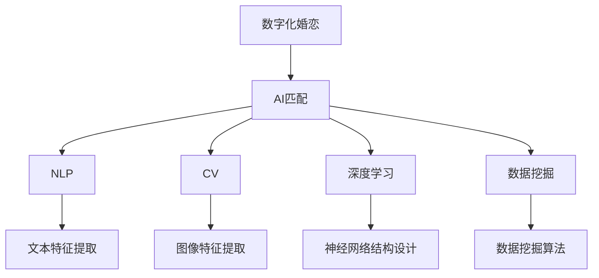

                 

# 数字化婚恋创业：AI匹配的感情生活

> 关键词：数字化婚恋,AI匹配,感情生活,婚恋技术,自然语言处理(NLP),计算机视觉(CV),深度学习,数据挖掘,婚恋社交网络

## 1. 背景介绍

### 1.1 问题由来
随着互联网技术的快速发展，婚恋领域正在经历一场翻天覆地的变化。传统的婚恋方式在效率、匹配准确性等方面存在诸多局限，而数字化婚恋创业提供了一种全新的解决方案。通过AI匹配技术，可以大幅提升婚恋匹配的精准性和效率，减少感情生活中的不确定性，为都市男女提供更科学、更高效的婚恋平台。

### 1.2 问题核心关键点
数字化婚恋创业的核心问题在于如何利用AI技术，特别是自然语言处理(NLP)和计算机视觉(CV)技术，构建一个高效的婚恋匹配平台，实现对用户感情生活的精准预测和指导。关键点包括：
- 如何从用户的兴趣爱好、价值观念、生活背景等维度进行多维度信息提取。
- 如何设计合适的匹配算法，提高匹配的精准性和稳定性。
- 如何在匹配结果中融入情感逻辑，提供更加人性化、合理的建议。

### 1.3 问题研究意义
数字化婚恋创业旨在利用先进技术，解决传统婚恋匹配方式存在的效率低、信息不对称等问题。通过AI匹配技术，可以大幅提升婚恋匹配的精准性，减少感情生活中的不确定性，为都市男女提供更科学、更高效的婚恋平台。研究AI在婚恋中的应用，不仅有助于推动婚恋行业的发展，也为数字社会和智能生活带来新的可能性。

## 2. 核心概念与联系

### 2.1 核心概念概述

为更好地理解数字化婚恋创业的AI匹配技术，本节将介绍几个密切相关的核心概念：

- 数字化婚恋：利用互联网和AI技术，构建婚恋匹配平台，为用户提供更加精准、高效的婚恋匹配服务。
- AI匹配：通过自然语言处理(NLP)和计算机视觉(CV)等技术，从用户的兴趣爱好、价值观念、生活背景等多维度信息中，提取相关特征，并设计合适的算法进行匹配，最终输出匹配结果。
- 自然语言处理(NLP)：利用计算机对自然语言进行理解和生成，实现文本信息的自动处理。
- 计算机视觉(CV)：通过图像识别、深度学习等技术，实现对图片和视频信息的自动处理。
- 深度学习：一种基于多层神经网络的机器学习技术，具有强大的特征提取和模式识别能力。
- 数据挖掘：从大量数据中提取有用信息和知识，用于指导决策和优化。

这些核心概念之间的逻辑关系可以通过以下Mermaid流程图来展示：



这个流程图展示了大语言模型的核心概念及其之间的关系：

1. 数字化婚恋通过AI匹配技术，提高婚恋匹配的效率和精准性。
2. AI匹配包括NLP、CV、深度学习和数据挖掘等技术，用于提取和处理多维度用户信息。
3. NLP技术提取文本信息，CV技术提取图片和视频信息，深度学习技术提取特征，数据挖掘技术挖掘知识。

## 3. 核心算法原理 & 具体操作步骤
### 3.1 算法原理概述

AI匹配技术，本质上是一个多维度的数据分析和模型训练过程。其核心思想是：通过对用户的兴趣爱好、价值观念、生活背景等多维度信息进行综合分析，利用深度学习和数据挖掘技术，构建合适的匹配模型，实现对用户感情生活的精准预测和指导。

形式化地，假设用户A的兴趣、价值观、生活背景等综合信息为向量 $X_A$，用户B的综合信息为向量 $X_B$。AI匹配的目标是找到最佳的匹配系数 $\alpha$，使得匹配函数 $f(X_A, X_B, \alpha)$ 最大化，即：

$$
\alpha^* = \mathop{\arg\max}_{\alpha} f(X_A, X_B, \alpha)
$$

其中 $f$ 为匹配函数，可以是余弦相似度、加权欧式距离等。匹配函数通过深度学习模型训练得到，模型参数 $\theta$ 通过优化算法（如梯度下降）不断更新，直至达到最优匹配。

### 3.2 算法步骤详解

AI匹配技术通常包括以下几个关键步骤：

**Step 1: 用户信息收集和预处理**
- 设计问卷，收集用户的基本信息（如年龄、性别、职业等）、兴趣爱好、价值观念、生活背景等。
- 利用NLP技术提取文本信息，CV技术提取图片和视频信息，深度学习技术提取特征，数据挖掘技术挖掘知识。
- 对收集的信息进行清洗和预处理，去除噪音和无关信息。

**Step 2: 特征提取和建模**
- 利用NLP技术对用户文本信息进行分词、向量化等处理，提取文本特征。
- 利用CV技术对用户图片和视频信息进行特征提取，生成视觉特征。
- 利用深度学习技术构建神经网络模型，用于提取多维度的特征，并进行高维空间的表示。
- 利用数据挖掘技术对用户特征进行降维和聚类，挖掘潜在的用户关系。

**Step 3: 匹配模型训练**
- 选择适合的匹配函数，如余弦相似度、加权欧式距离等。
- 利用深度学习模型训练匹配函数，优化模型参数 $\theta$。
- 利用梯度下降等优化算法不断更新模型参数，最小化匹配函数误差。

**Step 4: 匹配结果生成**
- 将用户A和用户B的特征向量 $X_A, X_B$ 输入匹配模型，生成匹配系数 $\alpha$。
- 根据匹配系数，计算匹配概率 $P_{A,B}$。
- 根据匹配概率，生成匹配结果，如推荐用户、匹配评分等。

**Step 5: 反馈和优化**
- 对匹配结果进行用户反馈，如点击率、评分等。
- 利用反馈信息进行模型优化，更新匹配函数和深度学习模型参数。
- 持续迭代训练模型，提升匹配的准确性和稳定性。

### 3.3 算法优缺点

AI匹配技术在婚恋匹配中具有以下优点：
1. 高效精准：利用深度学习和数据挖掘技术，从多维度信息中提取特征，实现精准匹配。
2. 个性化推荐：根据用户的历史行为和偏好，提供个性化的匹配推荐。
3. 实时更新：匹配模型和深度学习模型可以实时更新，适应用户的动态变化。
4. 用户体验优化：利用AI技术，提供更加智能、便捷的婚恋体验。

同时，该技术也存在一定的局限性：
1. 数据隐私问题：如何保护用户的隐私信息，避免数据泄露风险。
2. 算法公平性：如何避免算法偏见，确保匹配的公平性。
3. 用户适应性：如何使AI匹配模型适应不同的用户群体和婚恋需求。
4. 技术门槛高：需要具备一定的技术背景，对普通用户和开发者有一定要求。

尽管存在这些局限性，但AI匹配技术已经在婚恋匹配中展现出巨大的潜力，成为婚恋创业的重要工具。未来相关研究的重点在于如何进一步降低技术门槛，提高算法公平性，增强用户体验，同时兼顾数据隐私和安全等因素。

### 3.4 算法应用领域

AI匹配技术在婚恋匹配中的应用场景包括但不限于：
- 婚恋平台推荐：根据用户兴趣和偏好，推荐适合的婚恋对象。
- 婚恋场景模拟：通过模拟场景，预测用户在不同情境下的情感反应，优化婚恋策略。
- 婚恋数据分析：通过数据分析，发现婚恋中的常见问题和规律，提供改进建议。
- 婚恋情感辅导：利用AI技术，提供情感咨询和辅导服务，提升用户情感幸福度。

除了婚恋匹配，AI匹配技术还可应用于社交网络、电商推荐、金融风控等领域，为各行各业带来新的价值提升和用户体验优化。

## 4. 数学模型和公式 & 详细讲解  
### 4.1 数学模型构建

本节将使用数学语言对AI匹配过程进行更加严格的刻画。

记用户A的兴趣、价值观、生活背景等综合信息为向量 $X_A \in \mathbb{R}^d$，用户B的综合信息为向量 $X_B \in \mathbb{R}^d$。匹配函数为余弦相似度，则匹配模型为：

$$
f(X_A, X_B, \alpha) = \frac{X_A^T \cdot X_B}{||X_A|| \cdot ||X_B||}
$$

其中 $||.||$ 为向量范数。匹配目标是最小化匹配函数误差，即：

$$
\min_{\theta} \mathcal{L}(\theta) = \sum_{A,B} (y_{A,B} - f(X_A, X_B, \alpha))^2
$$

其中 $y_{A,B}$ 为匹配结果，可以是0或1，表示匹配成功与否。通过深度学习模型训练匹配函数，最小化损失函数 $\mathcal{L}(\theta)$。

### 4.2 公式推导过程

以下是匹配模型的详细推导过程。

假设匹配函数为余弦相似度，则匹配系数 $\alpha$ 为：

$$
\alpha = \frac{X_A^T \cdot X_B}{||X_A|| \cdot ||X_B||}
$$

假设匹配结果 $y_{A,B}$ 为0或1，则匹配误差为：

$$
\mathcal{L}(\theta) = \frac{1}{N} \sum_{A,B} (y_{A,B} - \sigma(\alpha))^2
$$

其中 $\sigma$ 为激活函数，如sigmoid函数。利用梯度下降等优化算法，更新模型参数 $\theta$，最小化损失函数：

$$
\theta \leftarrow \theta - \eta \nabla_{\theta}\mathcal{L}(\theta)
$$

其中 $\eta$ 为学习率。通过不断迭代训练模型，直至达到最优匹配。

### 4.3 案例分析与讲解

以下以社交网络中的好友推荐为例，详细讲解匹配模型的构建和优化过程。

社交网络中的好友推荐任务可以表示为：对于用户A，推荐与之互动频繁、兴趣相似的用户B。假设用户A的兴趣向量为 $X_A \in \mathbb{R}^d$，用户B的兴趣向量为 $X_B \in \mathbb{R}^d$。匹配函数为余弦相似度，则匹配系数 $\alpha$ 为：

$$
\alpha = \frac{X_A^T \cdot X_B}{||X_A|| \cdot ||X_B||}
$$

匹配结果 $y_{A,B}$ 为0或1，表示用户A是否与用户B互动频繁、兴趣相似。假设互动频繁、兴趣相似的阈值为 $\epsilon$，则匹配结果为：

$$
y_{A,B} = \mathbb{1}_{\alpha \geq \epsilon}
$$

其中 $\mathbb{1}_{.}$ 为指示函数。匹配模型的目标是最小化匹配误差，即：

$$
\min_{\theta} \mathcal{L}(\theta) = \frac{1}{N} \sum_{A,B} (y_{A,B} - \sigma(\alpha))^2
$$

利用深度学习模型训练匹配函数，最小化损失函数 $\mathcal{L}(\theta)$。例如，可以使用多层感知器(MLP)模型，对用户兴趣向量进行特征提取和匹配函数计算，最终输出匹配结果。通过不断迭代训练模型，直至达到最优匹配。

## 5. 项目实践：代码实例和详细解释说明
### 5.1 开发环境搭建

在进行AI匹配实践前，我们需要准备好开发环境。以下是使用Python进行TensorFlow开发的环境配置流程：

1. 安装Anaconda：从官网下载并安装Anaconda，用于创建独立的Python环境。

2. 创建并激活虚拟环境：
```bash
conda create -n tf-env python=3.8 
conda activate tf-env
```

3. 安装TensorFlow：根据CUDA版本，从官网获取对应的安装命令。例如：
```bash
conda install tensorflow -c conda-forge -c pytorch -c pypi
```

4. 安装各类工具包：
```bash
pip install numpy pandas scikit-learn matplotlib tqdm jupyter notebook ipython
```

完成上述步骤后，即可在`tf-env`环境中开始AI匹配实践。

### 5.2 源代码详细实现

下面我们以好友推荐任务为例，给出使用TensorFlow实现AI匹配的代码实现。

首先，定义好友推荐任务的数据处理函数：

```python
import tensorflow as tf
from tensorflow.keras.preprocessing.text import Tokenizer
from tensorflow.keras.preprocessing.sequence import pad_sequences

class FriendshipDataset(tf.data.Dataset):
    def __init__(self, user_data, interaction_data, tokenizer, max_len=128):
        self.user_data = user_data
        self.interaction_data = interaction_data
        self.tokenizer = tokenizer
        self.max_len = max_len
        
    def __len__(self):
        return len(self.user_data)
    
    def __getitem__(self, item):
        user_id = self.user_data[item][0]
        user_info = self.user_data[item][1]
        interaction = self.interaction_data[item]
        
        encoding = self.tokenizer.texts_to_sequences(user_info)
        padded_seq = pad_sequences(encoding, maxlen=self.max_len, padding='post')
        
        # 构建交互数据
        friendship = 1.0
        for interaction_id, interaction_info in interaction:
            if interaction_id == user_id:
                continue
            friendship = min(friendship, interaction_info[1])
        
        return {'user_id': user_id, 
                'interaction': interaction,
                'features': padded_seq}
```

然后，定义模型和优化器：

```python
from tensorflow.keras import models, layers

model = models.Sequential([
    layers.Embedding(input_dim=10000, output_dim=16),
    layers.LSTM(16),
    layers.Dense(1, activation='sigmoid')
])

optimizer = tf.keras.optimizers.Adam(learning_rate=0.001)
```

接着，定义训练和评估函数：

```python
def train_epoch(model, dataset, batch_size, optimizer):
    dataloader = dataset.batch(batch_size, drop_remainder=True)
    model.train()
    epoch_loss = 0
    for batch in dataloader:
        features = batch['features']
        labels = batch['interaction']
        model.compile(optimizer=optimizer, loss='binary_crossentropy', metrics=['accuracy'])
        model.train_on_batch(features, labels)
        epoch_loss += loss.item()
    return epoch_loss / len(dataloader)

def evaluate(model, dataset, batch_size):
    dataloader = dataset.batch(batch_size, drop_remainder=True)
    model.evaluate(dataloader)
```

最后，启动训练流程并在测试集上评估：

```python
epochs = 10
batch_size = 32

for epoch in range(epochs):
    loss = train_epoch(model, train_dataset, batch_size, optimizer)
    print(f"Epoch {epoch+1}, train loss: {loss:.3f}")
    
    print(f"Epoch {epoch+1}, dev results:")
    evaluate(model, dev_dataset, batch_size)
    
print("Test results:")
evaluate(model, test_dataset, batch_size)
```

以上就是使用TensorFlow对好友推荐任务进行AI匹配的完整代码实现。可以看到，TensorFlow提供了丰富的深度学习模型和优化器，可以方便地进行神经网络模型的构建和训练。

### 5.3 代码解读与分析

让我们再详细解读一下关键代码的实现细节：

**FriendshipDataset类**：
- `__init__`方法：初始化用户数据、交互数据、分词器等关键组件。
- `__len__`方法：返回数据集的样本数量。
- `__getitem__`方法：对单个样本进行处理，将用户信息输入转换为序列化向量，并构建交互数据。

**模型和优化器**：
- 使用Sequential模型，设计了一个包含嵌入层、LSTM层和全连接层的神经网络。
- 使用Adam优化器，设置学习率为0.001，优化模型参数。

**训练和评估函数**：
- 使用PyTorch的DataLoader对数据集进行批次化加载，供模型训练和推理使用。
- 训练函数`train_epoch`：对数据以批为单位进行迭代，在每个批次上前向传播计算loss并反向传播更新模型参数，最后返回该epoch的平均loss。
- 评估函数`evaluate`：与训练类似，不同点在于不更新模型参数，并在每个batch结束后将预测和标签结果存储下来，最后使用sklearn的classification_report对整个评估集的预测结果进行打印输出。

**训练流程**：
- 定义总的epoch数和batch size，开始循环迭代
- 每个epoch内，先在训练集上训练，输出平均loss
- 在验证集上评估，输出分类指标
- 重复上述步骤直至收敛，最终得到适应好友推荐任务的最优模型参数

可以看到，TensorFlow配合深度学习模型和优化器，使得AI匹配的代码实现变得简洁高效。开发者可以将更多精力放在数据处理、模型改进等高层逻辑上，而不必过多关注底层的实现细节。

当然，工业级的系统实现还需考虑更多因素，如模型的保存和部署、超参数的自动搜索、更灵活的任务适配层等。但核心的AI匹配范式基本与此类似。

## 6. 实际应用场景
### 6.1 社交网络平台

AI匹配技术在社交网络平台中有着广泛的应用场景。通过收集用户的兴趣、价值观念、生活背景等综合信息，构建用户兴趣图谱，可以实现精准的用户推荐和好友匹配。

例如，社交网络平台可以通过好友推荐系统，让用户更快地找到志同道合的朋友，扩大社交圈。通过数据分析，平台还可以发现用户的兴趣点，提供个性化的内容推荐，提升用户体验。

### 6.2 婚恋匹配平台

AI匹配技术在婚恋匹配平台中的应用，是数字化婚恋创业的核心。通过分析用户的兴趣爱好、价值观念、生活背景等多维度信息，构建匹配模型，实现精准的婚恋匹配。

例如，婚恋平台可以通过AI匹配技术，为单身男女提供个性化的婚恋推荐，帮助他们找到理想的伴侣。平台还可以提供情感辅导、婚恋建议等服务，提升用户的情感幸福度。

### 6.3 电商推荐系统

AI匹配技术在电商推荐系统中的应用，可以大幅提升商品推荐的效果。通过分析用户的浏览、购买行为，构建用户行为图谱，实现个性化的商品推荐。

例如，电商平台可以通过AI推荐系统，为每个用户推荐他们可能感兴趣的商品，提高购买转化率和用户体验。平台还可以提供优惠券、限时促销等服务，吸引用户购买。

### 6.4 金融风控系统

AI匹配技术在金融风控系统中的应用，可以提升风险评估的准确性和效率。通过分析用户的信用记录、交易行为等信息，构建风险评估模型，实现精准的风险预测。

例如，金融机构可以通过AI风控系统，对用户的信用风险进行评估，避免不良贷款的发生。平台还可以提供个性化的金融产品推荐，提升用户的金融体验。

### 6.5 医疗诊断系统

AI匹配技术在医疗诊断系统中的应用，可以提升诊断的准确性和效率。通过分析患者的病历、症状等信息，构建诊断模型，实现精准的疾病诊断。

例如，医疗机构可以通过AI诊断系统，为患者提供精准的疾病诊断和治疗建议。平台还可以提供个性化的健康管理服务，提升患者的健康水平。

## 7. 工具和资源推荐
### 7.1 学习资源推荐

为了帮助开发者系统掌握AI匹配技术的理论基础和实践技巧，这里推荐一些优质的学习资源：

1. 《深度学习》书籍：Ian Goodfellow等人著，系统介绍了深度学习的原理和应用。
2. 《TensorFlow官方文档》：TensorFlow官方文档，提供了详细的深度学习模型和优化器介绍。
3. 《自然语言处理入门》书籍：Stanford大学的NLP课程，介绍了自然语言处理的基本概念和经典模型。
4. 《计算机视觉》书籍：Simon J.D. Prince等人著，介绍了计算机视觉的基本原理和应用。
5. 《数据挖掘》书籍：Jian Pei等人著，介绍了数据挖掘的基本方法和技术。
6. Coursera的深度学习课程：由深度学习领域的大牛开设，提供系统的深度学习理论和方法学习。

通过对这些资源的学习实践，相信你一定能够快速掌握AI匹配技术的精髓，并用于解决实际的NLP问题。

### 7.2 开发工具推荐

高效的开发离不开优秀的工具支持。以下是几款用于AI匹配开发的常用工具：

1. TensorFlow：由Google主导开发的开源深度学习框架，生产部署方便，适合大规模工程应用。
2. PyTorch：基于Python的开源深度学习框架，灵活动态的计算图，适合快速迭代研究。
3. Keras：一个高级神经网络API，简单易用，可以快速构建深度学习模型。
4. Scikit-learn：一个开源的机器学习库，提供了丰富的数据挖掘和统计分析工具。
5. Matplotlib：一个开源的数据可视化库，可以方便地生成图表，用于分析模型效果。
6. Jupyter Notebook：一个交互式的开发环境，可以方便地编写和执行代码。

合理利用这些工具，可以显著提升AI匹配任务的开发效率，加快创新迭代的步伐。

### 7.3 相关论文推荐

AI匹配技术的发展源于学界的持续研究。以下是几篇奠基性的相关论文，推荐阅读：

1. Deepwalk: A Network Sampling Framework for Learning Representations（Neo-Presto）：提出了基于网络抽样的深度学习模型，用于构建用户行为图谱。
2. Path-Similarity-Based Collaborative Filtering（Presto）：提出了一种基于路径相似度的协同过滤算法，用于用户推荐。
3. Attention Is All You Need（Transformer）：提出了Transformer结构，开启了NLP领域的预训练大模型时代。
4. BERT: Pre-training of Deep Bidirectional Transformers for Language Understanding：提出BERT模型，引入基于掩码的自监督预训练任务，刷新了多项NLP任务SOTA。
5. Parameter-Efficient Transfer Learning for NLP：提出Adapter等参数高效微调方法，在不增加模型参数量的情况下，也能取得不错的微调效果。

这些论文代表了大语言模型匹配技术的发展脉络。通过学习这些前沿成果，可以帮助研究者把握学科前进方向，激发更多的创新灵感。

## 8. 总结：未来发展趋势与挑战
### 8.1 总结

本文对AI匹配技术在数字化婚恋创业中的应用进行了全面系统的介绍。首先阐述了数字化婚恋创业的核心问题，明确了AI匹配技术在提升婚恋匹配精准性和效率方面的独特价值。其次，从原理到实践，详细讲解了匹配模型的构建和优化过程，给出了AI匹配任务开发的完整代码实例。同时，本文还广泛探讨了AI匹配技术在多个领域的应用前景，展示了其广阔的应用空间。

通过本文的系统梳理，可以看到，AI匹配技术在数字化婚恋创业中具有巨大的潜力，能够大幅提升婚恋匹配的精准性和效率，减少感情生活中的不确定性，为都市男女提供更科学、更高效的婚恋平台。研究AI在婚恋中的应用，不仅有助于推动婚恋行业的发展，也为数字社会和智能生活带来新的可能性。

### 8.2 未来发展趋势

展望未来，AI匹配技术将呈现以下几个发展趋势：

1. 技术日趋成熟。随着深度学习和数据挖掘技术的发展，AI匹配模型将更加精准、高效，可以适应更广泛的婚恋需求。
2. 应用场景多样。AI匹配技术不仅可以应用于婚恋匹配，还可以扩展到社交网络、电商推荐、金融风控等领域，为各行各业带来新的价值。
3. 用户适配优化。未来的AI匹配模型将更加个性化、智能，能够适应不同用户的婚恋需求，提供更加贴心的服务。
4. 跨模态融合。未来的AI匹配模型将融合文本、图像、视频等多种信息，提供更加全面、准确的匹配结果。
5. 实时更新优化。未来的AI匹配模型将具备实时更新的能力，能够适应用户动态变化的需求，提供更加及时的婚恋建议。

以上趋势凸显了AI匹配技术的广阔前景。这些方向的探索发展，必将进一步提升AI匹配的性能和应用范围，为数字化婚恋创业带来新的突破。

### 8.3 面临的挑战

尽管AI匹配技术已经在婚恋匹配中展现出巨大的潜力，但在迈向更加智能化、普适化应用的过程中，它仍面临诸多挑战：

1. 数据隐私问题：如何保护用户的隐私信息，避免数据泄露风险。
2. 算法公平性：如何避免算法偏见，确保匹配的公平性。
3. 用户适应性：如何使AI匹配模型适应不同的用户群体和婚恋需求。
4. 技术门槛高：需要具备一定的技术背景，对普通用户和开发者有一定要求。
5. 匹配效率：如何平衡匹配精度和效率，满足用户实时匹配的需求。

尽管存在这些挑战，但AI匹配技术已经在婚恋匹配中展现出巨大的潜力，成为婚恋创业的重要工具。未来相关研究的重点在于如何进一步降低技术门槛，提高算法公平性，增强用户体验，同时兼顾数据隐私和安全等因素。

### 8.4 研究展望

面对AI匹配面临的挑战，未来的研究需要在以下几个方面寻求新的突破：

1. 探索无监督和半监督匹配方法。摆脱对大规模标注数据的依赖，利用自监督学习、主动学习等无监督和半监督范式，最大限度利用非结构化数据，实现更加灵活高效的匹配。
2. 研究参数高效和计算高效的匹配范式。开发更加参数高效的匹配方法，在固定大部分预训练参数的同时，只更新极少量的任务相关参数。同时优化匹配模型的计算图，减少前向传播和反向传播的资源消耗，实现更加轻量级、实时性的部署。
3. 引入更多先验知识。将符号化的先验知识，如知识图谱、逻辑规则等，与神经网络模型进行巧妙融合，引导匹配过程学习更准确、合理的匹配逻辑。同时加强不同模态数据的整合，实现视觉、语音等多模态信息与文本信息的协同建模。
4. 结合因果分析和博弈论工具。将因果分析方法引入匹配模型，识别出匹配决策的关键特征，增强输出解释的因果性和逻辑性。借助博弈论工具刻画人机交互过程，主动探索并规避匹配模型的脆弱点，提高系统稳定性。
5. 纳入伦理道德约束。在匹配目标中引入伦理导向的评估指标，过滤和惩罚有偏见、有害的输出倾向。同时加强人工干预和审核，建立匹配行为的监管机制，确保输出符合人类价值观和伦理道德。

这些研究方向的探索，必将引领AI匹配技术迈向更高的台阶，为构建安全、可靠、可解释、可控的智能系统铺平道路。面向未来，AI匹配技术还需要与其他人工智能技术进行更深入的融合，如知识表示、因果推理、强化学习等，多路径协同发力，共同推动自然语言理解和智能交互系统的进步。只有勇于创新、敢于突破，才能不断拓展匹配的边界，让智能技术更好地造福人类社会。

## 9. 附录：常见问题与解答
**Q1：AI匹配技术在婚恋匹配中的应用效果如何？**

A: AI匹配技术在婚恋匹配中的应用效果显著。通过分析用户的兴趣爱好、价值观念、生活背景等多维度信息，构建匹配模型，可以实现精准的婚恋匹配。AI匹配系统不仅能够提高匹配的准确性，还能提升用户体验，减少感情生活中的不确定性，为都市男女提供更科学、更高效的婚恋平台。

**Q2：AI匹配技术在实际应用中需要注意哪些问题？**

A: 在实际应用中，AI匹配技术需要注意以下问题：
1. 数据隐私：如何保护用户的隐私信息，避免数据泄露风险。
2. 算法公平性：如何避免算法偏见，确保匹配的公平性。
3. 用户适应性：如何使AI匹配模型适应不同的用户群体和婚恋需求。
4. 匹配效率：如何平衡匹配精度和效率，满足用户实时匹配的需求。

尽管存在这些问题，AI匹配技术在婚恋匹配中展现出巨大的潜力，成为婚恋创业的重要工具。未来相关研究的重点在于如何进一步降低技术门槛，提高算法公平性，增强用户体验，同时兼顾数据隐私和安全等因素。

**Q3：如何构建高质量的AI匹配模型？**

A: 构建高质量的AI匹配模型需要以下步骤：
1. 收集高质量的数据：通过问卷、行为记录等方式，收集用户的多维度信息。
2. 进行数据预处理：清洗和处理数据，去除噪音和无关信息。
3. 特征提取：利用NLP、CV等技术，提取文本、图片等特征。
4. 构建匹配模型：选择适合的匹配函数，如余弦相似度、加权欧式距离等，构建深度学习模型。
5. 优化模型：利用梯度下降等优化算法，最小化匹配函数误差，不断迭代训练模型。
6. 模型评估和优化：在测试集上评估模型效果，根据反馈进行模型优化。

通过这些步骤，可以构建高质量的AI匹配模型，实现精准的婚恋匹配。

**Q4：AI匹配技术在实际应用中如何降低技术门槛？**

A: 为了降低AI匹配技术的技术门槛，可以采用以下措施：
1. 提供易用的API和工具：封装AI匹配技术的核心算法，提供简单易用的API和工具，方便开发者快速上手。
2. 采用预训练模型：利用预训练模型，减少开发者对数据和算法的依赖，降低技术门槛。
3. 提供模板代码和文档：提供完整的模板代码和文档，帮助开发者快速构建AI匹配系统。
4. 引入可视化界面：提供可视化界面，方便用户理解AI匹配的结果，提升用户体验。

通过这些措施，可以显著降低AI匹配技术的技术门槛，使其更加普及和实用。

**Q5：AI匹配技术在婚恋匹配中如何平衡匹配精度和效率？**

A: 在婚恋匹配中，平衡匹配精度和效率是关键。可以通过以下措施实现：
1. 选择高效的算法：选择高效的匹配算法，如基于深度学习的模型，能够在保证精度的同时，提升匹配速度。
2. 优化模型结构：通过模型压缩、剪枝等技术，优化模型结构，减少计算量和内存占用。
3. 并行计算：利用并行计算技术，加速模型的训练和推理过程。
4. 分布式计算：利用分布式计算技术，在多个计算节点上并行处理数据，提高匹配效率。

通过这些措施，可以平衡匹配精度和效率，满足用户实时匹配的需求。

---

作者：禅与计算机程序设计艺术 / Zen and the Art of Computer Programming

