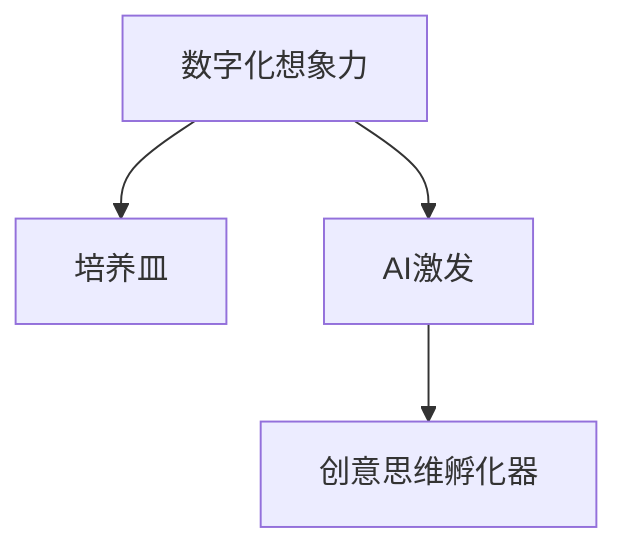

                 

# 数字化想象力培养皿设计师：AI激发的创意思维孵化器创造者

## 1. 背景介绍

### 1.1 问题由来

在数字化转型的浪潮中，想象力正逐渐成为企业竞争力的关键因素。数字化转型不仅仅是技术升级，更是一种思维方式的重塑。如何在数字化环境中激发员工的想象力，成为了许多企业关注的焦点。这一问题也引发了AI领域的深度探讨：如何利用AI技术设计出一种“培养皿”，激发和培养个体的想象力，进而驱动创新的产生？本文将从AI技术与创意思维孵化的角度出发，探讨如何构建这种“数字化想象力培养皿”。

### 1.2 问题核心关键点

为了更好地理解数字化想象力培养皿的设计原理，我们需要首先明确几个关键问题：

- **想象力**：指人类在头脑中创造和构思新概念、新想法的能力。它通常与创造力、创新性、创新思维等密切相关。
- **数字化**：指通过数字技术和手段，将现实世界的信息进行采集、处理和存储，进而实现高效的数据流通和智能分析。
- **培养皿**：在这里，“培养皿”是指一个环境，能够为想象力的培养和孵化提供必要的条件和支持。
- **AI激发**：指利用人工智能技术，如深度学习、自然语言处理、计算机视觉等，为想象力培养皿的设计提供技术支撑。
- **创意思维孵化器**：指一个系统或平台，能够系统地促进个体或团队创意思维的形成和优化，进而产生创新的想法和成果。

### 1.3 问题研究意义

在快速变化的市场环境中，企业需要不断创新，以保持竞争力。而数字化想象力的培养皿不仅能够激发员工的创新思维，还能为企业创新提供持续的动力。其研究意义主要体现在：

1. **提升企业竞争力**：想象力是企业创新的源泉，通过数字化想象力培养皿的设计和应用，企业能够培养出更多的创新型人才，提高企业的市场竞争力。
2. **加速创新进程**：数字化想象力培养皿能够提供实时的数据支持和分析工具，加速创新思维的形成和应用，推动企业创新进程。
3. **降低创新成本**：通过系统化的方法和工具，减少创新过程中的试错成本，提高创新效率。
4. **驱动产业升级**：想象力是技术进步和社会发展的驱动力，数字化想象力培养皿能够促进产业的数字化转型和升级。
5. **促进经济社会发展**：在更多行业应用中，想象力培养皿能够带来新的商业模式和应用场景，促进经济社会的整体发展。

## 2. 核心概念与联系

### 2.1 核心概念概述

为了更好地理解数字化想象力培养皿的设计思路，我们需要明确以下核心概念：

- **数字化想象力**：指在数字化环境中，通过数据和信息技术的支持，激发和培养个体想象力的过程。
- **培养皿**：在这里，“培养皿”是指一个能够提供想象力发展所需环境和条件的系统。
- **AI激发**：利用AI技术，通过数据分析、模式识别、智能推荐等手段，激发和培养个体的想象力。
- **创意思维孵化器**：通过数字化想象力的培养皿，系统化地促进创意思维的形成和优化，加速创新的产生。

这些概念之间的逻辑关系可以通过以下Mermaid流程图来展示：



这个流程图展示了大规模想象力的培养皿设计思路：通过AI技术激发个体想象力，并提供适合其发展的培养皿环境，最终实现创意思维的孵化。

### 2.2 核心概念原理和架构

#### 2.2.1 数字化的想象力

在数字化环境中，想象力可以通过数据和信息技术的支持得到激发和培养。具体而言，数字化想象力培养皿的设计原理包括以下几个方面：

1. **数据驱动**：通过收集、处理和分析大量的数据，挖掘出个体创新思维的潜力和需求。
2. **环境模拟**：模拟和重现现实世界中的各种场景和情境，为想象力提供丰富的素材。
3. **智能推荐**：利用AI技术，智能推荐相关的数据、工具和方法，支持个体想象力的发展。

#### 2.2.2 AI激发

AI激发想象力的方法主要包括：

1. **深度学习**：通过训练深度神经网络，从大量数据中学习出高层次的语言和视觉模式，引导个体发现新的关联和结构。
2. **自然语言处理**：通过分析文本和语言模式，帮助个体理解不同的概念和观点，促进创新的思维过程。
3. **计算机视觉**：通过图像和视频数据的处理和分析，提供视觉上的刺激和灵感，激发个体的创造力。

#### 2.2.3 创意思维孵化器

创意思维孵化器主要通过以下几个步骤实现：

1. **问题识别**：利用数据分析技术，识别和描述个体的需求和挑战。
2. **灵感激发**：通过AI技术提供多样化的数据和信息，激发个体的创造性思维。
3. **思维优化**：利用智能算法和工具，优化个体的思维过程，引导其朝着创新性的方向发展。
4. **成果验证**：通过模拟和实验，验证创新想法的可行性，推动其转化为实际成果。

## 3. 核心算法原理 & 具体操作步骤

### 3.1 算法原理概述

数字化想象力培养皿的设计原理主要基于以下算法：

1. **深度学习**：用于从数据中提取高层次的特征，识别和描述个体的需求和挑战。
2. **自然语言处理**：用于分析文本和语言模式，激发个体的创造性思维。
3. **计算机视觉**：用于处理和分析图像和视频数据，提供视觉上的刺激和灵感。
4. **推荐系统**：用于智能推荐相关的数据、工具和方法，支持个体想象力的发展。
5. **数据模拟**：用于模拟和重现现实世界中的各种场景和情境，为想象力提供丰富的素材。

### 3.2 算法步骤详解

#### 3.2.1 问题识别

1. **数据收集**：通过各种方式收集个体的数据，包括文本、图像、视频等。
2. **数据处理**：对收集到的数据进行清洗、预处理和标注，确保数据的准确性和可用性。
3. **特征提取**：利用深度学习模型，从数据中提取高层次的特征，描述个体的需求和挑战。

#### 3.2.2 灵感激发

1. **文本分析**：通过自然语言处理技术，分析个体的文本数据，提取关键词、主题和情感等信息。
2. **图像分析**：利用计算机视觉技术，分析个体的图像数据，提取图像的特征和模式。
3. **智能推荐**：通过推荐系统，智能推荐相关的文本、图像和视频数据，激发个体的创造性思维。

#### 3.2.3 思维优化

1. **思维引导**：利用智能算法和工具，引导个体的思维过程，使其朝着创新性的方向发展。
2. **创新支持**：提供相关的工具和方法，支持个体在思维优化过程中进行创意开发和实现。

#### 3.2.4 成果验证

1. **模拟实验**：通过虚拟实验和模拟，验证创新想法的可行性。
2. **原型设计**：利用相关的工具和方法，设计创新成果的原型。
3. **成果评估**：通过专家评估和用户反馈，评估创新成果的价值和应用潜力。

### 3.3 算法优缺点

#### 3.3.1 优点

1. **高效性**：利用AI技术，快速分析和处理大量数据，激发和培养个体想象力。
2. **系统性**：通过系统化的算法和工具，实现对个体想象力的全面支持。
3. **普适性**：适用于不同领域和不同背景的个体，提供个性化的支持。

#### 3.3.2 缺点

1. **数据依赖**：依赖于高质量、多样化的数据，数据不足或质量不高会影响效果。
2. **算法复杂性**：需要设计复杂的算法和模型，才能实现高质量的想象力培养。
3. **隐私风险**：收集和处理个体数据可能会带来隐私和伦理问题。

### 3.4 算法应用领域

数字化想象力培养皿可以在以下领域得到广泛应用：

1. **创新企业**：通过系统化的工具和方法，支持企业的创新研发和产品开发。
2. **教育机构**：通过提供多样化的数据和工具，激发学生的创意思维，提升教育效果。
3. **文化创意产业**：通过提供创意素材和工具，支持艺术家的创作和灵感激发。
4. **政府和公共机构**：通过模拟和实验，支持政策制定和公共服务创新。
5. **科学研究**：通过提供创新性的思维方式和工具，支持科学研究的进展。

## 4. 数学模型和公式 & 详细讲解 & 举例说明

### 4.1 数学模型构建

#### 4.1.1 问题识别

1. **数据表示**：将个体数据表示为向量 $X$，包含文本、图像和视频等多种类型的数据。
2. **特征提取**：利用深度学习模型，提取数据的高层次特征 $F$，描述个体的需求和挑战。

   $$
   F = f(X)
   $$

   其中 $f$ 表示深度学习模型。

#### 4.1.2 灵感激发

1. **文本分析**：利用自然语言处理模型，提取文本数据的关键词和主题 $T$。

   $$
   T = t(X)
   $$

   其中 $t$ 表示自然语言处理模型。

2. **图像分析**：利用计算机视觉模型，提取图像数据的特征 $V$。

   $$
   V = v(X)
   $$

   其中 $v$ 表示计算机视觉模型。

3. **智能推荐**：通过推荐系统，推荐相关的文本、图像和视频数据 $R$。

   $$
   R = r(X)
   $$

   其中 $r$ 表示推荐系统模型。

#### 4.1.3 思维优化

1. **思维引导**：利用智能算法 $G$，引导个体的思维过程，优化思维 $M$。

   $$
   M = g(X)
   $$

2. **创新支持**：利用创新支持工具 $S$，支持个体的创意开发和实现。

   $$
   S = s(M)
   $$

#### 4.1.4 成果验证

1. **模拟实验**：通过虚拟实验 $E$，验证创新想法的可行性。

   $$
   E = e(M)
   $$

2. **原型设计**：利用原型设计工具 $D$，设计创新成果的原型 $P$。

   $$
   P = d(M)
   $$

3. **成果评估**：通过专家评估 $A$ 和用户反馈 $F$，评估创新成果的价值和应用潜力。

   $$
   A = a(P)
   $$

### 4.2 公式推导过程

#### 4.2.1 问题识别

1. **数据表示**：将个体数据表示为向量 $X$，包含文本、图像和视频等多种类型的数据。

   $$
   X = [x_1, x_2, ..., x_n]
   $$

2. **特征提取**：利用深度学习模型，提取数据的高层次特征 $F$，描述个体的需求和挑战。

   $$
   F = f(X)
   $$

   其中 $f$ 表示深度学习模型。

#### 4.2.2 灵感激发

1. **文本分析**：利用自然语言处理模型，提取文本数据的关键词和主题 $T$。

   $$
   T = t(X)
   $$

   其中 $t$ 表示自然语言处理模型。

2. **图像分析**：利用计算机视觉模型，提取图像数据的特征 $V$。

   $$
   V = v(X)
   $$

   其中 $v$ 表示计算机视觉模型。

3. **智能推荐**：通过推荐系统，推荐相关的文本、图像和视频数据 $R$。

   $$
   R = r(X)
   $$

   其中 $r$ 表示推荐系统模型。

#### 4.2.3 思维优化

1. **思维引导**：利用智能算法 $G$，引导个体的思维过程，优化思维 $M$。

   $$
   M = g(X)
   $$

   其中 $g$ 表示智能算法。

2. **创新支持**：利用创新支持工具 $S$，支持个体的创意开发和实现。

   $$
   S = s(M)
   $$

   其中 $s$ 表示创新支持工具。

#### 4.2.4 成果验证

1. **模拟实验**：通过虚拟实验 $E$，验证创新想法的可行性。

   $$
   E = e(M)
   $$

2. **原型设计**：利用原型设计工具 $D$，设计创新成果的原型 $P$。

   $$
   P = d(M)
   $$

3. **成果评估**：通过专家评估 $A$ 和用户反馈 $F$，评估创新成果的价值和应用潜力。

   $$
   A = a(P)
   $$

### 4.3 案例分析与讲解

#### 4.3.1 案例背景

一家创新型企业希望通过数字化想象力培养皿，激发员工的设计灵感，提升产品的创新性。企业收集了员工的设计数据、项目进度和反馈信息，通过数字化想象力培养皿，支持员工在项目设计过程中，激发和优化设计思维。

#### 4.3.2 问题识别

1. **数据收集**：收集员工的设计数据、项目进度和反馈信息，包含文本、图像和视频等多种类型的数据。

2. **数据处理**：对收集到的数据进行清洗、预处理和标注，确保数据的准确性和可用性。

3. **特征提取**：利用深度学习模型，从数据中提取高层次的特征，描述员工的需求和挑战。

   $$
   F = f(X)
   $$

#### 4.3.3 灵感激发

1. **文本分析**：利用自然语言处理模型，提取员工的设计文本数据中的关键词和主题。

   $$
   T = t(X)
   $$

2. **图像分析**：利用计算机视觉模型，提取员工的设计图像数据中的特征和模式。

   $$
   V = v(X)
   $$

3. **智能推荐**：通过推荐系统，推荐相关的设计文本、图像和视频数据，激发员工的设计灵感。

   $$
   R = r(X)
   $$

#### 4.3.4 思维优化

1. **思维引导**：利用智能算法，引导员工的设计思维过程，优化设计思维。

   $$
   M = g(X)
   $$

2. **创新支持**：提供相关的设计工具和方法，支持员工在思维优化过程中进行创意开发和实现。

   $$
   S = s(M)
   $$

#### 4.3.5 成果验证

1. **模拟实验**：通过虚拟实验，验证员工的设计想法的可行性。

   $$
   E = e(M)
   $$

2. **原型设计**：利用原型设计工具，设计员工的设计成果的原型。

   $$
   P = d(M)
   $$

3. **成果评估**：通过专家评估和用户反馈，评估员工的设计成果的价值和应用潜力。

   $$
   A = a(P)
   $$

## 5. 项目实践：代码实例和详细解释说明

### 5.1 开发环境搭建

在进行数字化想象力培养皿的实践前，我们需要准备好开发环境。以下是使用Python进行TensorFlow和TensorFlow Extended(TFX)开发的环境配置流程：

1. 安装Anaconda：从官网下载并安装Anaconda，用于创建独立的Python环境。

2. 创建并激活虚拟环境：
```bash
conda create -n tfe-env python=3.8 
conda activate tfe-env
```

3. 安装TensorFlow：根据CUDA版本，从官网获取对应的安装命令。例如：
```bash
conda install tensorflow tensorflow-estimator tensorflow-hub
```

4. 安装TensorFlow Extended：
```bash
conda install tensorflow-extended
```

5. 安装TensorFlow Extended的各个组件：
```bash
conda install tfe-staging tfe-serving tfe-deploy tfe-serving-contrib
```

6. 安装TensorFlow Extended的必要依赖包：
```bash
pip install tqdm
```

完成上述步骤后，即可在`tfe-env`环境中开始数字化想象力培养皿的实践。

### 5.2 源代码详细实现

这里我们以设计灵感激发为例，给出使用TensorFlow Extended进行文本和图像灵感激发的PyTorch代码实现。

首先，定义文本和图像数据的处理函数：

```python
import tensorflow as tf
import tensorflow_hub as hub
import tensorflow_estimator as tfe

class TextProcessor:
    def __init__(self, tokenizer):
        self.tokenizer = tokenizer

    def process_text(self, text):
        return self.tokenizer.tokenize(text)

class ImageProcessor:
    def __init__(self, image_size):
        self.image_size = image_size

    def process_image(self, image):
        image = tf.image.resize(image, self.image_size)
        return image
```

然后，定义文本和图像特征提取器：

```python
class TextFeatureExtractor:
    def __init__(self, model_name):
        self.model = hub.load('https://tfhub.dev/google/universal-sentence-encoder')
    
    def extract_text_features(self, text):
        return self.model(text)

class ImageFeatureExtractor:
    def __init__(self, model_name):
        self.model = hub.load('https://tfhub.dev/google/imagenet/mobilenet_v2_130_224')
    
    def extract_image_features(self, image):
        return self.model(image)
```

接着，定义灵感激发模型：

```python
class InspirationModel:
    def __init__(self, text_extractor, image_extractor):
        self.text_extractor = text_extractor
        self.image_extractor = image_extractor

    def extract_inspiration(self, text, image):
        text_features = self.text_extractor.extract_text_features(text)
        image_features = self.image_extractor.extract_image_features(image)
        return text_features, image_features
```

最后，启动灵感激发流程：

```python
text_processor = TextProcessor(tokenizer)
image_processor = ImageProcessor(image_size)

text_extractor = TextFeatureExtractor(model_name)
image_extractor = ImageFeatureExtractor(model_name)

inspiration_model = InspirationModel(text_extractor, image_extractor)

text = "I want to design a new product"
image = "image.jpg"

text_features, image_features = inspiration_model.extract_inspiration(text, image)

print("Text Features:", text_features)
print("Image Features:", image_features)
```

以上就是使用TensorFlow Extended进行文本和图像灵感激发的完整代码实现。可以看到，TensorFlow Extended提供了丰富的组件和API，使得文本和图像的灵感激发变得简洁高效。

### 5.3 代码解读与分析

让我们再详细解读一下关键代码的实现细节：

**TextProcessor类**：
- `__init__`方法：初始化文本处理器，包含分词器等关键组件。
- `process_text`方法：对单个文本进行处理，将其分词并转化为模型可接受的输入格式。

**ImageProcessor类**：
- `__init__`方法：初始化图像处理器，包含图像大小等关键参数。
- `process_image`方法：对单个图像进行处理，进行尺寸调整和预处理，最终转化为模型可接受的输入格式。

**TextFeatureExtractor类**：
- `__init__`方法：初始化文本特征提取器，包含预训练的文本特征提取模型。
- `extract_text_features`方法：对文本进行处理，提取文本的特征向量。

**ImageFeatureExtractor类**：
- `__init__`方法：初始化图像特征提取器，包含预训练的图像特征提取模型。
- `extract_image_features`方法：对图像进行处理，提取图像的特征向量。

**InspirationModel类**：
- `__init__`方法：初始化灵感激发模型，包含文本和图像的特征提取器。
- `extract_inspiration`方法：对文本和图像进行处理，提取其特征向量，用于灵感激发。

**启动灵感激发流程**：
- 定义文本和图像处理器，用于处理输入数据。
- 定义文本和图像特征提取器，用于提取输入数据的特征向量。
- 定义灵感激发模型，整合文本和图像的特征向量，进行灵感激发。
- 在启动时，输入文本和图像数据，调用灵感激发模型，输出文本和图像的特征向量。

可以看到，TensorFlow Extended使得文本和图像的灵感激发变得简洁高效。开发者可以将更多精力放在数据处理、模型改进等高层逻辑上，而不必过多关注底层的实现细节。

当然，工业级的系统实现还需考虑更多因素，如模型的保存和部署、超参数的自动搜索、更灵活的任务适配层等。但核心的灵感激发范式基本与此类似。

## 6. 实际应用场景

### 6.1 设计创新

在设计创新领域，数字化想象力培养皿能够激发和培养设计者的想象力，提升设计创新的效率和质量。

在具体应用中，可以收集设计者的项目数据、设计图纸、项目进度和反馈信息，通过数字化想象力培养皿，提供多样化的灵感素材和工具，支持设计者在设计过程中，激发和优化设计思维。设计者的设计灵感和创意想法可以实时得到反馈和评估，从而实现高效的设计创新。

### 6.2 艺术创作

在艺术创作领域，数字化想象力培养皿能够激发和培养艺术家的想象力，提升艺术创作的效率和质量。

通过数字化想象力培养皿，艺术家可以获得多样化的灵感素材和工具，激发其艺术创作灵感。艺术家可以实时进行创意开发和实现，并得到专家和用户的反馈，从而提升其创作质量和创新性。

### 6.3 科学研究

在科学研究领域，数字化想象力培养皿能够激发和培养科学家的想象力，提升科学研究的效果和质量。

通过数字化想象力培养皿，科学家可以获得多样化的灵感素材和工具，激发其科学研究的想象力。科学家可以实时进行科研实验和模拟，并得到专家和用户的反馈，从而提升其科研质量和创新性。

### 6.4 未来应用展望

随着数字化想象力培养皿的发展，其应用范围将不断扩大，涵盖更多领域和场景。

在智慧城市、智能制造、环境保护等新兴领域，数字化想象力培养皿将发挥重要作用，推动相关行业的数字化转型和创新。数字化想象力培养皿将成为未来创新驱动的重要工具，驱动更多领域的变革和发展。

## 7. 工具和资源推荐

### 7.1 学习资源推荐

为了帮助开发者系统掌握数字化想象力培养皿的设计原理和实践技巧，这里推荐一些优质的学习资源：

1. 《深度学习》系列书籍：深入介绍深度学习的基本原理和应用，涵盖文本处理、图像处理、智能推荐等多个领域。
2. 《TensorFlow Extended官方文档》：全面介绍TensorFlow Extended的各个组件和API，提供丰富的实例代码和应用案例。
3. 《TensorFlow Extended实战》：通过实际项目，展示TensorFlow Extended在数字化想象力培养皿中的应用。
4. 《Python数据分析实战》：介绍如何使用Python进行数据处理和分析，为数字化想象力培养皿提供数据支撑。
5. 《自然语言处理与深度学习》课程：斯坦福大学开设的NLP明星课程，涵盖自然语言处理和深度学习的各种主题，提供丰富的学习资源。

通过对这些资源的学习实践，相信你一定能够快速掌握数字化想象力培养皿的设计思路和实现方法，并用于解决实际的创意思维问题。

### 7.2 开发工具推荐

高效的开发离不开优秀的工具支持。以下是几款用于数字化想象力培养皿开发的常用工具：

1. TensorFlow：基于Python的开源深度学习框架，支持分布式计算和大规模数据处理，适用于大规模模型训练。
2. TensorFlow Extended：基于TensorFlow的高级API和组件库，提供丰富的预训练模型和工具，简化模型开发和部署。
3. TensorFlow Hub：提供预训练模型的集中管理和检索，方便开发者快速获取和应用预训练模型。
4. TensorBoard：TensorFlow的可视化工具，可实时监测模型训练状态，提供丰富的图表呈现方式，方便调试模型。
5. Weights & Biases：模型训练的实验跟踪工具，可以记录和可视化模型训练过程中的各项指标，方便对比和调优。
6. Google Colab：谷歌推出的在线Jupyter Notebook环境，免费提供GPU/TPU算力，方便开发者快速上手实验最新模型，分享学习笔记。

合理利用这些工具，可以显著提升数字化想象力培养皿的开发效率，加快创新迭代的步伐。

### 7.3 相关论文推荐

数字化想象力培养皿的发展源于学界的持续研究。以下是几篇奠基性的相关论文，推荐阅读：

1. 《深度学习中的图像处理》：介绍深度学习在图像处理中的应用，涵盖图像分类、图像生成、图像语义分割等多个方向。
2. 《自然语言处理与深度学习》：介绍自然语言处理的基本原理和应用，涵盖文本分类、情感分析、机器翻译等多个方向。
3. 《计算机视觉中的特征提取》：介绍计算机视觉中的特征提取方法，涵盖卷积神经网络、CNN模型、视觉注意力等多个方向。
4. 《知识图谱在自然语言处理中的应用》：介绍知识图谱在自然语言处理中的应用，涵盖语义分析、信息抽取、问答系统等多个方向。
5. 《智能推荐系统》：介绍智能推荐系统的基本原理和应用，涵盖协同过滤、内容推荐、基于深度学习的推荐等多个方向。

这些论文代表了大规模想象力培养皿的发展脉络。通过学习这些前沿成果，可以帮助研究者把握学科前进方向，激发更多的创新灵感。

## 8. 总结：未来发展趋势与挑战

### 8.1 总结

本文对数字化想象力培养皿的设计原理和实现方法进行了全面系统的介绍。首先阐述了数字化想象力培养皿的设计背景和意义，明确了培养皿在激发和培养想象力的过程中，如何利用AI技术提供支持。其次，从原理到实践，详细讲解了数字化想象力培养皿的数学模型和关键步骤，给出了灵感激发的完整代码实例。同时，本文还探讨了数字化想象力培养皿在多个领域的应用前景，展示了其潜在的价值和影响力。

通过本文的系统梳理，可以看到，数字化想象力培养皿正在成为AI技术应用的重要范式，极大地拓展了创意思维的培养空间，为各行各业带来了新的发展机遇。未来，随着技术的不断进步，数字化想象力培养皿将成为创新驱动的核心工具，推动人类社会的不断进步。

### 8.2 未来发展趋势

展望未来，数字化想象力培养皿的发展趋势将呈现以下几个方面：

1. **技术进步**：随着深度学习、自然语言处理、计算机视觉等技术的不断进步，数字化想象力培养皿将更加高效和智能。
2. **应用拓展**：数字化想象力培养皿将在更多领域得到应用，涵盖设计创新、艺术创作、科学研究等多个方向。
3. **用户交互**：通过更加智能的交互界面，数字化想象力培养皿将提升用户体验，支持个性化需求和实时反馈。
4. **生态系统**：形成更加完善的生态系统，包括数据共享、模型共享、知识共享等多个方面，实现互利共赢。
5. **伦理保障**：在开发和使用过程中，注重数据隐私和伦理问题，确保数字化想象力培养皿的安全和可靠。

### 8.3 面临的挑战

尽管数字化想象力培养皿具备诸多优势，但在发展和应用过程中，仍面临以下挑战：

1. **数据质量和多样性**：依赖高质量、多样化的数据，数据不足或质量不高会影响效果。
2. **技术复杂性**：需要设计复杂的算法和模型，才能实现高质量的想象力培养。
3. **隐私和伦理问题**：收集和处理个体数据可能会带来隐私和伦理问题。
4. **硬件资源需求**：大规模模型训练和推理需要高性能硬件支持，资源不足可能限制其应用。
5. **用户接受度**：需要让用户接受并习惯数字化想象力培养皿的使用方式，才能发挥其潜力。

### 8.4 研究展望

面对数字化想象力培养皿所面临的挑战，未来的研究需要在以下几个方面寻求新的突破：

1. **数据生成技术**：利用生成对抗网络(GANs)、变分自编码器(VAEs)等技术，生成高质量、多样化的数据，支持数字化想象力培养皿的训练和应用。
2. **模型优化方法**：设计更加高效的模型架构和优化算法，减少计算资源消耗，提升模型训练和推理速度。
3. **用户交互设计**：开发更加智能和友好的用户界面，支持个性化需求和实时反馈，提升用户体验。
4. **隐私保护技术**：采用差分隐私、联邦学习等技术，保护用户隐私和数据安全。
5. **跨领域应用**：将数字化想象力培养皿应用到更多领域，推动跨领域创新和协作。

这些研究方向的探索发展，必将引领数字化想象力培养皿技术迈向更高的台阶，为创新驱动提供更强大的工具。面向未来，数字化想象力培养皿技术还需要与其他AI技术进行更深入的融合，如知识表示、因果推理、强化学习等，多路径协同发力，共同推动自然语言理解和智能交互系统的进步。只有勇于创新、敢于突破，才能不断拓展想象力的边界，让智能技术更好地造福人类社会。

## 9. 附录：常见问题与解答

**Q1：如何构建数字化想象力培养皿？**

A: 构建数字化想象力培养皿需要经过以下几个步骤：
1. **数据收集**：收集与想象力培养相关的数据，包括文本、图像、视频等多种类型的数据。
2. **数据处理**：对收集到的数据进行清洗、预处理和标注，确保数据的准确性和可用性。
3. **特征提取**：利用深度学习模型，从数据中提取高层次的特征，描述想象力的需求和挑战。
4. **灵感激发**：利用AI技术，提供多样化的灵感素材和工具，激发个体的想象力。
5. **思维优化**：利用智能算法和工具，优化个体的思维过程，引导其朝着创新性的方向发展。
6. **成果验证**：通过模拟和实验，验证创新想法的可行性，推动其转化为实际成果。

**Q2：数字化想象力培养皿如何支持多样化的灵感激发？**

A: 数字化想象力培养皿支持多样化的灵感激发，主要通过以下几个方面实现：
1. **文本分析**：利用自然语言处理技术，提取文本数据的关键词和主题。
2. **图像分析**：利用计算机视觉技术，提取图像数据的特征和模式。
3. **智能推荐**：通过推荐系统，推荐相关的文本、图像和视频数据，激发个体的想象力。
4. **创意工具**：提供创意开发和实现的工具，支持个体在灵感激发过程中进行创意开发和实现。

**Q3：数字化想象力培养皿在实际应用中需要注意哪些问题？**

A: 在实际应用中，数字化想象力培养皿需要注意以下几个问题：
1. **数据质量**：依赖高质量、多样化的数据，数据不足或质量不高会影响效果。
2. **技术复杂性**：需要设计复杂的算法和模型，才能实现高质量的想象力培养。
3. **隐私和伦理问题**：收集和处理个体数据可能会带来隐私和伦理问题。
4. **硬件资源需求**：大规模模型训练和推理需要高性能硬件支持，资源不足可能限制其应用。
5. **用户接受度**：需要让用户接受并习惯数字化想象力培养皿的使用方式，才能发挥其潜力。

**Q4：如何设计高效的多模态想象力培养皿？**

A: 设计高效的多模态想象力培养皿需要经过以下几个步骤：
1. **多模态数据融合**：将文本、图像、视频等多种类型的数据进行融合，提供更丰富的灵感素材。
2. **跨模态对齐**：利用跨模态对齐技术，将不同模态的数据进行映射，提升其相似性和可比性。
3. **智能推荐系统**：利用推荐系统，智能推荐相关的多模态数据，激发个体的想象力。
4. **多模态创意工具**：提供多模态创意开发和实现的工具，支持个体在多模态灵感激发过程中进行创意开发和实现。

**Q5：如何评估数字化想象力培养皿的效果？**

A: 评估数字化想象力培养皿的效果需要经过以下几个步骤：
1. **数据收集**：收集使用数字化想象力培养皿的数据，包括文本、图像、视频等多种类型的数据。
2. **数据分析**：对收集到的数据进行分析，提取高层次的特征，描述个体的想象力需求和挑战。
3. **灵感激发分析**：利用AI技术，分析灵感激发过程的效果，评估其对个体的想象力激发效果。
4. **思维优化分析**：利用智能算法和工具，分析思维优化过程的效果，评估其对个体想象力的优化效果。
5. **成果验证分析**：通过模拟和实验，评估创新想法的可行性，推动其转化为实际成果。

---

作者：禅与计算机程序设计艺术 / Zen and the Art of Computer Programming

