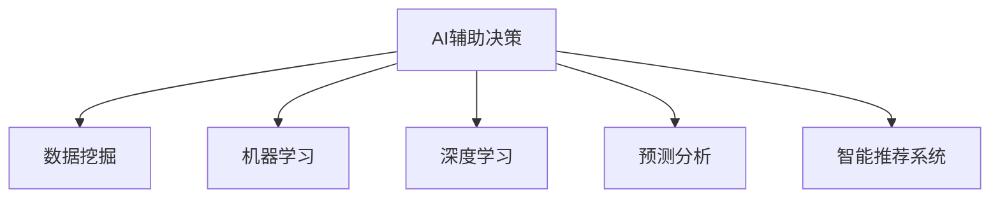

                 

# 数字化直觉：AI辅助的第六感

> 关键词：数字化转型,人工智能,决策辅助,预测分析,数据洞察,智能推荐系统

## 1. 背景介绍

### 1.1 问题由来
在当今数字化时代，数据已经成为推动企业创新和发展的关键要素。企业决策者需要迅速准确地从海量数据中获取有价值的信息，以支撑其战略规划、业务优化和市场预测。然而，面对日益增长的数据规模和复杂性，人工分析的方式已经难以胜任。人工智能（AI），尤其是机器学习、深度学习和数据挖掘技术，为解决这一问题提供了新的可能性。

AI辅助的第六感，即通过数字化技术，使决策者能够获得超越传统感官范围的洞察力。这种“第六感”不仅包括对当前数据环境的深度理解，还包括对未来趋势的预测和洞察。借助AI的强大能力，决策者能够从海量的数据中提取关键信息，做出更加科学和精准的决策。

### 1.2 问题核心关键点
AI辅助的第六感，本质上是一种通过数字化手段，利用AI技术对数据进行深度分析和处理，辅助人类做出更优决策的能力。它的核心关键点包括：

- 数据驱动：基于数据的洞察力和决策。
- 自动化：通过自动化工具和算法，提升数据处理效率。
- 智能学习：利用机器学习和深度学习算法，不断优化预测模型和决策规则。
- 可视化：将复杂的数据分析结果通过可视化手段呈现，增强决策者的直观理解。

这些关键点共同构成了AI辅助第六感的技术基础，使其成为数字化转型的重要工具。

### 1.3 问题研究意义
AI辅助的第六感在现代商业环境中具有重要意义：

1. **提高决策效率**：通过自动化数据处理和分析，显著提高决策速度和准确性。
2. **降低决策风险**：AI可以通过大量数据训练模型，降低主观判断带来的偏差。
3. **优化业务流程**：帮助企业发现和解决业务中的瓶颈，优化资源配置和运营效率。
4. **增强市场竞争力**：通过精确的市场预测和客户洞察，提升企业对市场的响应速度和竞争力。
5. **促进创新**：基于数据洞察的持续改进，推动企业创新和产品迭代。

## 2. 核心概念与联系

### 2.1 核心概念概述

为更好地理解AI辅助第六感的原理和架构，本节将介绍几个密切相关的核心概念：

- **AI辅助决策**：指利用AI技术，通过数据分析、模型训练和预测等手段，辅助人类做出更加科学和精准的决策。
- **数据挖掘**：从大量数据中提取有用信息、模式和知识的过程。
- **机器学习**：通过算法训练模型，使其能够自动从数据中学习规律，并进行预测或决策。
- **深度学习**：一种特殊的机器学习方法，通过多层神经网络进行特征提取和模式识别。
- **预测分析**：利用历史数据和模型，对未来趋势进行预测，帮助决策者提前布局。
- **智能推荐系统**：通过分析用户行为和偏好，推荐个性化的产品或服务，提升用户体验和满意度。

这些概念之间的逻辑关系可以通过以下Mermaid流程图来展示：



这个流程图展示了这个技术框架的核心概念及其之间的关系：

1. 数据挖掘和机器学习是AI辅助决策的基础技术手段。
2. 深度学习在特征提取和模式识别上提供了更加强大的能力。
3. 预测分析和智能推荐系统是AI辅助决策在特定场景下的具体应用。

这些概念共同构成了AI辅助第六感的技术框架，使其能够高效地处理和利用数据，支持企业决策。

## 3. 核心算法原理 & 具体操作步骤

### 3.1 算法原理概述

AI辅助第六感的核心算法原理，可以归纳为以下几个步骤：

1. **数据准备**：收集、清洗和预处理企业内部的数据集，包括业务数据、客户数据、市场数据等。
2. **特征提取**：通过数据挖掘和机器学习算法，从原始数据中提取有用的特征和模式。
3. **模型训练**：利用深度学习模型对历史数据进行训练，构建预测模型和决策规则。
4. **预测与洞察**：在新的数据上应用训练好的模型，进行预测分析，并提供决策洞察。
5. **决策支持**：将分析结果和预测结果以可视化的方式呈现给决策者，辅助其做出决策。

### 3.2 算法步骤详解

基于AI辅助第六感的技术原理，下面详细介绍其实现步骤：

**Step 1: 数据准备**

- 数据收集：从企业内部系统、外部市场和社交媒体等渠道，收集相关数据。
- 数据清洗：去除噪声、处理缺失值、标准化数据格式等。
- 数据预处理：进行特征工程，如特征选择、归一化等。

**Step 2: 特征提取**

- 使用数据挖掘算法，如关联规则挖掘、聚类分析等，提取有价值的模式和特征。
- 利用机器学习算法，如线性回归、决策树、随机森林等，构建特征模型。
- 引入深度学习算法，如卷积神经网络（CNN）、循环神经网络（RNN）等，进行更高级的特征提取。

**Step 3: 模型训练**

- 选择适合的深度学习模型，如卷积神经网络（CNN）、长短时记忆网络（LSTM）等。
- 定义模型结构，包括输入层、隐藏层和输出层。
- 设置训练参数，如学习率、批次大小等。
- 在标注数据集上训练模型，最小化损失函数。
- 进行模型验证和调优，选择最优模型。

**Step 4: 预测与洞察**

- 将新的数据输入训练好的模型，进行预测。
- 利用可视化工具，将预测结果以图表形式呈现。
- 结合业务场景，解读预测结果，提出决策建议。

**Step 5: 决策支持**

- 将预测结果和洞察提供给决策者。
- 通过报告、仪表盘等方式，展示关键指标和趋势。
- 设置预警机制，及时响应异常情况。

### 3.3 算法优缺点

AI辅助第六感具备以下优点：

1. **高效性**：通过自动化数据处理和模型训练，大幅度提升决策效率。
2. **准确性**：利用大量历史数据训练模型，提高预测和决策的准确性。
3. **可视化**：通过图表和报告，使决策过程更直观，易于理解。
4. **灵活性**：能够处理不同类型的数据，适应多种业务场景。

然而，它也存在一些缺点：

1. **数据质量依赖**：模型性能高度依赖于数据的质量和完整性。
2. **模型复杂性**：深度学习模型结构复杂，需要大量的计算资源和专业知识。
3. **解释性不足**：部分AI模型如深度学习，其内部决策过程难以解释，存在"黑盒"问题。
4. **隐私风险**：数据处理过程中可能涉及隐私泄露，需严格控制数据使用范围。

### 3.4 算法应用领域

AI辅助第六感在多个领域中得到了广泛应用：

- **零售业**：通过客户行为分析和市场预测，优化库存管理和促销策略。
- **金融业**：利用交易数据和市场情报，进行风险评估和投资决策。
- **制造业**：通过生产数据和设备运行状况，优化生产流程和设备维护。
- **医疗保健**：基于病患数据和医疗记录，提供个性化治疗方案和风险预测。
- **物流和供应链**：通过运输数据和市场需求，优化物流路径和供应链管理。
- **能源行业**：利用能源消耗数据，进行能源管理和需求预测。

## 4. 数学模型和公式 & 详细讲解 & 举例说明

### 4.1 数学模型构建

本节将使用数学语言对AI辅助第六感的技术原理进行严格描述。

假设企业内部数据集为 $D=\{(x_i,y_i)\}_{i=1}^N$，其中 $x_i$ 表示输入特征，$y_i$ 表示输出标签。目标是通过训练模型，使模型能够对新的输入 $x$ 进行预测 $\hat{y}$。数学模型可以表示为：

$$
\hat{y} = f(x; \theta)
$$

其中 $f(\cdot)$ 为模型函数，$\theta$ 为模型参数。模型的目标是最小化预测误差，即损失函数 $L(\theta)$：

$$
L(\theta) = \frac{1}{N} \sum_{i=1}^N (\hat{y}_i - y_i)^2
$$

优化目标是最小化损失函数 $L(\theta)$，即：

$$
\theta^* = \mathop{\arg\min}_{\theta} L(\theta)
$$

在实践中，我们通常使用梯度下降等优化算法，近似求解上述最优化问题。设 $\eta$ 为学习率，$\lambda$ 为正则化系数，则参数的更新公式为：

$$
\theta \leftarrow \theta - \eta \nabla_{\theta}L(\theta) - \eta\lambda\theta
$$

其中 $\nabla_{\theta}L(\theta)$ 为损失函数对参数 $\theta$ 的梯度，可通过反向传播算法高效计算。

### 4.2 公式推导过程

以二分类任务为例，推导最小二乘法的损失函数及其梯度计算公式。

假设模型 $f(\cdot)$ 在输入 $x$ 上的输出为 $\hat{y}=f(x; \theta)$，表示样本属于正类的概率。真实标签 $y \in \{0,1\}$。则二分类最小二乘损失函数定义为：

$$
L(\theta) = \frac{1}{N} \sum_{i=1}^N (\hat{y}_i - y_i)^2
$$

将其代入经验风险公式，得：

$$
L(\theta) = \frac{1}{N} \sum_{i=1}^N (\hat{y}_i - y_i)^2
$$

根据链式法则，损失函数对参数 $\theta_k$ 的梯度为：

$$
\frac{\partial L(\theta)}{\partial \theta_k} = \frac{2}{N} \sum_{i=1}^N (\hat{y}_i - y_i) \frac{\partial f(x_i; \theta)}{\partial \theta_k}
$$

其中 $\frac{\partial f(x_i; \theta)}{\partial \theta_k}$ 可进一步递归展开，利用自动微分技术完成计算。

在得到损失函数的梯度后，即可带入参数更新公式，完成模型的迭代优化。重复上述过程直至收敛，最终得到适应目标任务的模型参数 $\theta^*$。

### 4.3 案例分析与讲解

以一家零售企业的销售预测为例，展示AI辅助第六感的具体应用过程。

**Step 1: 数据准备**

- 收集历史销售数据，包括时间、地区、商品类别、价格等特征。
- 清洗数据，去除异常值和缺失值。
- 进行数据标准化，便于后续模型训练。

**Step 2: 特征提取**

- 使用时间序列分析，提取季节性、趋势性和周期性特征。
- 利用关联规则挖掘，提取商品之间的组合销售规律。
- 引入深度学习算法，如LSTM，进行时间序列建模。

**Step 3: 模型训练**

- 选择LSTM模型作为销售预测模型。
- 设置模型结构和超参数。
- 在历史销售数据上训练模型，最小化预测误差。
- 进行模型验证和调优，选择最优模型。

**Step 4: 预测与洞察**

- 将新的销售数据输入训练好的LSTM模型，进行预测。
- 利用可视化工具，展示销售趋势和预测结果。
- 结合业务场景，提出销售策略和库存管理建议。

**Step 5: 决策支持**

- 提供预测报告和销售洞察，辅助管理层做出决策。
- 设置销售预警机制，及时响应异常情况。

## 5. 项目实践：代码实例和详细解释说明

### 5.1 开发环境搭建

在进行AI辅助第六感项目实践前，我们需要准备好开发环境。以下是使用Python进行TensorFlow开发的环境配置流程：

1. 安装Anaconda：从官网下载并安装Anaconda，用于创建独立的Python环境。

2. 创建并激活虚拟环境：
```bash
conda create -n tf-env python=3.8 
conda activate tf-env
```

3. 安装TensorFlow：根据CUDA版本，从官网获取对应的安装命令。例如：
```bash
conda install tensorflow -c pytorch -c conda-forge
```

4. 安装各类工具包：
```bash
pip install numpy pandas scikit-learn matplotlib tqdm jupyter notebook ipython
```

完成上述步骤后，即可在`tf-env`环境中开始项目实践。

### 5.2 源代码详细实现

下面以销售预测为例，给出使用TensorFlow进行LSTM模型训练和预测的PyTorch代码实现。

```python
import tensorflow as tf
from tensorflow.keras.models import Sequential
from tensorflow.keras.layers import Dense, LSTM, Dropout
from tensorflow.keras.optimizers import Adam
import numpy as np
import pandas as pd

# 数据准备
train_data = pd.read_csv('sales_train.csv')
test_data = pd.read_csv('sales_test.csv')

# 数据处理
train_data['date'] = pd.to_datetime(train_data['date'])
train_data = train_data.set_index('date')
test_data['date'] = pd.to_datetime(test_data['date'])
test_data = test_data.set_index('date')

# 特征提取
features = ['region', 'category', 'price']
train_data = train_data[features].dropna()
test_data = test_data[features].dropna()

# 数据归一化
mean = train_data.mean()
std = train_data.std()
train_data = (train_data - mean) / std
test_data = (test_data - mean) / std

# 模型定义
model = Sequential()
model.add(LSTM(50, input_shape=(train_data.shape[1], 1)))
model.add(Dropout(0.2))
model.add(Dense(1, activation='sigmoid'))

# 模型编译
model.compile(loss='binary_crossentropy', optimizer=Adam(lr=0.001), metrics=['accuracy'])

# 模型训练
model.fit(train_data, epochs=50, batch_size=32, validation_data=test_data)

# 模型评估
test_pred = model.predict(test_data)
test_pred = (test_pred > 0.5).astype(int)
```

### 5.3 代码解读与分析

让我们再详细解读一下关键代码的实现细节：

**数据准备和处理**：
- 使用Pandas库读取和处理销售数据。
- 将日期转换为时间序列格式。
- 删除缺失值，并进行特征选择。
- 对特征进行归一化，以加速模型收敛。

**模型定义**：
- 定义一个包含LSTM和Dropout层的神经网络模型。
- LSTM层用于处理时间序列数据，Dropout层用于防止过拟合。
- 添加输出层，使用sigmoid激活函数，输出0或1的预测结果。

**模型编译**：
- 使用Adam优化器，设置学习率。
- 定义损失函数为二元交叉熵，用于二分类任务。
- 设置评价指标为准确率。

**模型训练**：
- 在训练数据上训练模型，设置训练轮数和批次大小。
- 在验证数据上评估模型性能，防止过拟合。

**模型评估**：
- 在测试数据上使用训练好的模型进行预测。
- 对预测结果进行二值化处理，得到0或1的最终预测结果。

通过以上代码，我们可以快速构建一个LSTM模型，并进行销售预测的训练和评估。当然，这只是一个简单的示例，实际项目中需要根据具体业务场景进行模型优化和参数调优。

## 6. 实际应用场景

### 6.1 智能客服系统

基于AI辅助第六感技术，智能客服系统能够通过客户的历史对话和行为数据，预测客户的需求和意图，提供个性化服务。例如，通过分析客户的查询历史和点击记录，智能客服系统可以提前预测客户的常见问题，并准备相应的回答模板。这样，当客户提出问题时，系统可以快速准确地提供答案，提升客户体验和满意度。

### 6.2 金融风控系统

在金融领域，AI辅助第六感技术可以帮助银行和金融机构进行风险评估和信用评分。通过分析客户的交易数据、信用记录和行为模式，AI模型可以预测客户的违约概率，辅助决策者做出贷款审批、信用评分等决策。例如，通过深度学习模型，银行可以识别高风险客户，提前采取措施，避免信用风险。

### 6.3 智能推荐系统

智能推荐系统通过分析用户的历史行为和偏好，预测用户的下一步需求，提供个性化的产品或内容推荐。例如，通过分析用户对商品、电影、音乐等的历史评价和互动记录，AI模型可以预测用户可能感兴趣的新产品，提升用户粘性和满意度。智能推荐系统已经成为电商、内容平台等领域的标配。

### 6.4 未来应用展望

随着AI辅助第六感技术的发展，未来将有更多的应用场景被开发和应用。例如：

- **医疗诊断**：通过分析患者的病历、症状和检查结果，AI模型可以辅助医生进行疾病诊断和治疗方案推荐。
- **教育辅导**：利用学生的学习记录和行为数据，AI模型可以预测学生的学习效果，提供个性化的学习建议和辅导。
- **物流管理**：通过分析货物的运输数据和市场需求，AI模型可以优化物流路径和仓储管理，降低运输成本。
- **能源管理**：利用能源消耗数据，AI模型可以进行能源需求预测，优化能源使用和调配。

## 7. 工具和资源推荐

### 7.1 学习资源推荐

为了帮助开发者系统掌握AI辅助第六感的技术基础和实践技巧，这里推荐一些优质的学习资源：

1. 《深度学习》系列书籍：Ian Goodfellow等著，深入浅出地介绍了深度学习的基本原理和应用实例。
2. TensorFlow官方文档：TensorFlow的官方文档，提供了丰富的API和示例代码，适合快速上手学习。
3. Kaggle平台：数据科学竞赛平台，提供了大量的数据集和机器学习挑战，适合实践和提升。
4. Coursera课程：Stanford大学等开设的机器学习课程，涵盖了从入门到高级的多个层次，适合不同水平的开发者。
5. GitHub项目：GitHub上开源的机器学习和深度学习项目，提供丰富的代码和实验参考。

通过这些资源的学习实践，相信你一定能够快速掌握AI辅助第六感的精髓，并用于解决实际的AI问题。

### 7.2 开发工具推荐

高效的开发离不开优秀的工具支持。以下是几款用于AI辅助第六感开发的常用工具：

1. TensorFlow：由Google主导开发的开源深度学习框架，生产部署方便，适合大规模工程应用。
2. PyTorch：基于Python的开源深度学习框架，灵活动态的计算图，适合快速迭代研究。
3. Keras：高层API，易于上手，适合快速构建和调试深度学习模型。
4. Weights & Biases：模型训练的实验跟踪工具，可以记录和可视化模型训练过程中的各项指标，方便对比和调优。
5. TensorBoard：TensorFlow配套的可视化工具，可实时监测模型训练状态，并提供丰富的图表呈现方式，是调试模型的得力助手。

合理利用这些工具，可以显著提升AI辅助第六感的开发效率，加快创新迭代的步伐。

### 7.3 相关论文推荐

AI辅助第六感技术的发展源于学界的持续研究。以下是几篇奠基性的相关论文，推荐阅读：

1. Hinton et al., "Deep Learning"（2012）：深度学习领域的开创性论文，介绍了深度学习的基本框架和应用场景。
2. LeCun et al., "Gradient-based Learning Applied to Document Recognition"（1989）：卷积神经网络的先驱性论文，奠定了图像处理领域的深度学习基础。
3. Goodfellow et al., "Generative Adversarial Networks"（2014）：生成对抗网络（GAN）的开创性论文，为生成模型提供了新的思路。
4. Bengio et al., "Representation Learning: A Review and New Perspectives"（2015）：深入讨论了深度学习的表示学习问题，对未来研究方向有重要启示。
5. Kingma et al., "Adam: A Method for Stochastic Optimization"（2014）：Adam优化器的提出，极大地提高了深度学习模型的训练效率。

这些论文代表了大语言模型微调技术的发展脉络。通过学习这些前沿成果，可以帮助研究者把握学科前进方向，激发更多的创新灵感。

## 8. 总结：未来发展趋势与挑战

### 8.1 总结

本文对AI辅助第六感的技术原理和应用进行了全面系统的介绍。首先阐述了AI辅助第六感的背景和研究意义，明确了其通过数字化手段辅助人类决策的核心价值。其次，从原理到实践，详细讲解了AI辅助第六感的数学模型和关键步骤，给出了具体项目的代码实例。同时，本文还广泛探讨了AI辅助第六感在多个行业领域的应用前景，展示了其在推动数字化转型中的巨大潜力。此外，本文精选了相关的学习资源和开发工具，力求为读者提供全方位的技术指引。

通过本文的系统梳理，可以看到，AI辅助第六感已经成为数字化转型的重要工具，其广泛的应用前景和显著的性能优势，必将深刻影响各行各业的决策过程。未来，随着AI技术的发展和数据的丰富，AI辅助第六感必将在更多领域得到应用，为人类认知智能的进化带来深远影响。

### 8.2 未来发展趋势

展望未来，AI辅助第六感技术将呈现以下几个发展趋势：

1. **数据量激增**：随着数字化进程的加快，企业内部的数据量将大幅增长，AI辅助第六感将能够处理更大规模的数据。
2. **模型复杂性提升**：深度学习模型的结构和层次将更加复杂，可以处理更高级的任务和更复杂的业务场景。
3. **跨领域应用拓展**：AI辅助第六感将拓展到更多行业和领域，如医疗、教育、交通等，带来更多创新应用。
4. **实时化增强**：实时数据处理和预测将更加重要，AI辅助第六感将能够进行实时分析和决策支持。
5. **多模态融合**：AI辅助第六感将整合多种数据源，包括文本、图像、视频、音频等，形成更全面、准确的信息整合能力。
6. **自动化决策**：在部分业务场景中，AI辅助第六感将能够自动完成决策，无需人工干预。

以上趋势凸显了AI辅助第六感技术的广阔前景。这些方向的探索发展，必将进一步提升AI辅助第六感的性能和应用范围，为数字化转型带来新的突破。

### 8.3 面临的挑战

尽管AI辅助第六感技术已经取得了瞩目成就，但在迈向更加智能化、普适化应用的过程中，它仍面临诸多挑战：

1. **数据隐私问题**：AI模型在处理数据时可能涉及隐私泄露，需严格控制数据使用范围。
2. **模型可解释性**：部分AI模型如深度学习，其内部决策过程难以解释，存在"黑盒"问题。
3. **算力资源限制**：AI辅助第六感需要大量的计算资源，特别是深度学习模型，可能面临硬件瓶颈。
4. **数据质量和多样性**：数据质量不高或数据分布不均，可能导致模型泛化能力不足。
5. **公平性和偏见**：AI模型可能学习到有偏见的数据，导致决策结果不公。

### 8.4 研究展望

面对AI辅助第六感所面临的挑战，未来的研究需要在以下几个方面寻求新的突破：

1. **数据隐私保护**：研究如何在保护隐私的前提下，高效利用数据。
2. **模型可解释性**：开发更可解释的AI模型，增强模型的透明度和可信度。
3. **模型优化和压缩**：通过模型压缩和优化，降低计算资源需求。
4. **数据质量和多样性**：通过数据增强和预处理，提升数据质量，增加数据多样性。
5. **公平性和偏见**：引入公平性约束，消除模型中的偏见和歧视。

这些研究方向的探索，必将引领AI辅助第六感技术迈向更高的台阶，为构建安全、可靠、可解释、可控的智能系统铺平道路。面向未来，AI辅助第六感技术还需要与其他人工智能技术进行更深入的融合，如知识表示、因果推理、强化学习等，多路径协同发力，共同推动人工智能技术的发展。只有勇于创新、敢于突破，才能不断拓展AI辅助第六感的边界，让智能技术更好地造福人类社会。

## 9. 附录：常见问题与解答

**Q1：AI辅助第六感是否适用于所有行业？**

A: AI辅助第六感在绝大多数行业中都能发挥作用，尤其是数据驱动型的行业，如金融、电商、医疗等。但对于一些传统行业，如制造业、农业等，由于数据量不足或数据复杂性高，可能需要结合行业特点进行定制化开发。

**Q2：如何选择合适的AI模型？**

A: 选择AI模型需要考虑多个因素，包括数据类型、业务场景、计算资源等。对于数据量较大、特征复杂的问题，深度学习模型如卷积神经网络、循环神经网络等可能更适合。而对于数据量较小、特征简单的问题，浅层模型如线性回归、决策树等可能更合适。

**Q3：AI辅助第六感是否需要大量的标注数据？**

A: 数据标注是一个资源密集型的过程，尤其是对于深度学习模型。然而，对于一些领域如文本分类、情感分析等，可以利用半监督学习和自监督学习，减少对标注数据的依赖。

**Q4：AI辅助第六感的性能如何评估？**

A: AI辅助第六感的性能评估可以从准确率、召回率、F1-score等指标入手，具体取决于业务场景。同时，可以通过A/B测试、在线实验等手段，验证模型在不同业务场景下的效果。

**Q5：AI辅助第六感是否需要持续更新和维护？**

A: AI辅助第六感模型需要定期进行更新和维护，以适应数据分布的变化和业务需求的调整。这包括重新训练模型、调整模型参数、更新数据集等。持续维护是确保模型长期有效的重要保障。

通过本文的系统梳理，可以看到，AI辅助第六感作为AI技术的重要应用方向，正在迅速崛起，为各行各业的决策辅助提供了新的工具和方法。未来，随着技术的不断演进和应用的不断深化，AI辅助第六感必将成为数字化转型的核心动力，深刻影响人类的生产生活方式。

