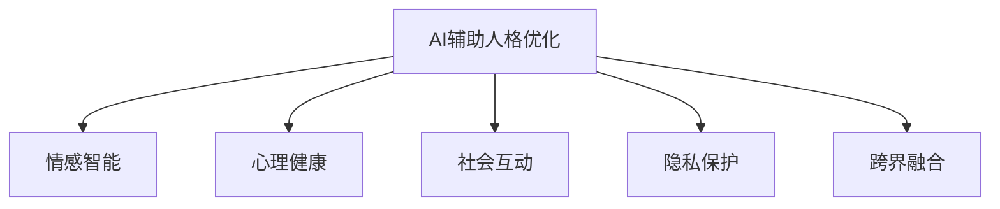

                 

# 数字化自我进化：AI辅助的人格优化

## 1. 背景介绍

### 1.1 问题由来

在数字化时代，个体如何与技术共生共长，成为一个亟待解决的问题。随着人工智能技术的迅猛发展，智能助手、个性化推荐、社交媒体等应用不断渗透到我们的日常生活，深刻影响着我们的行为模式、认知能力和情感状态。如何通过AI技术，实现人格的全面优化和个性化进化，是现代科技与人文关怀相结合的新课题。

### 1.2 问题核心关键点

1. **个性化与人格优化**：如何根据个体差异，定制化推荐个性化的学习和成长路径，提升综合素质和自我认知。
2. **情感智能与心理健康**：如何利用AI技术识别情感状态，辅助进行心理健康维护和情感调节。
3. **社会互动与协作**：如何通过AI技术优化人际交往，提升社会互动的质量与效率。
4. **伦理与隐私保护**：如何确保AI辅助人格优化过程中，用户的隐私数据安全不被滥用。
5. **跨界融合与创新应用**：如何将AI技术与心理学、社会学、教育学等领域知识深度融合，探索新的应用场景和商业模式。

## 2. 核心概念与联系

### 2.1 核心概念概述

为更好地理解AI辅助人格优化的核心原理，本节将介绍几个关键概念：

- **AI辅助人格优化**：通过人工智能技术，辅助个体实现全面发展的过程，包括认知、情感、社会行为等多方面。
- **情感智能**：指个体理解、管理及利用情感信息的能力，是人格优化中的重要组成部分。
- **心理健康**：指个体在心理功能上能够保持良好状态，并有效应对生活中的各种挑战。
- **社会互动**：指个体在社会环境中与他人进行交流、协作、分享等行为。
- **隐私保护**：指在技术应用过程中，确保用户个人信息不被滥用和泄露的策略。
- **跨界融合**：将不同学科的理论与方法应用于AI技术，实现学科间的协同创新。

这些概念之间的逻辑关系可以通过以下Mermaid流程图来展示：



这个流程图展示了AI辅助人格优化过程中涉及的各个关键方面，以及它们之间的相互关系。

## 3. 核心算法原理 & 具体操作步骤

### 3.1 算法原理概述

AI辅助人格优化基于多模态数据的融合和分析，旨在通过综合考虑个体的心理状态、社会互动、行为数据等多方面信息，实现对个体的全面评估和个性化优化。其核心思想是通过机器学习算法，挖掘和分析数据中的潜在模式，为个体提供个性化的建议和支持。

形式化地，假设个体的多模态数据为 $D=\{(x_i, y_i)\}_{i=1}^N$，其中 $x_i$ 为多种模态数据（如文本、语音、图像等），$y_i$ 为对应的标签（如情感状态、心理健康等）。目标是通过机器学习模型 $M_{\theta}$，学习模型参数 $\theta$，使得模型能够准确预测个体在不同情境下的心理状态和行为趋势。

具体来说，算法流程包括以下几个步骤：

1. 数据收集与预处理：收集个体在不同情境下的多模态数据，并进行数据清洗、归一化等预处理。
2. 特征工程：从多模态数据中提取有意义的特征，用于后续的机器学习建模。
3. 模型训练：使用标注数据对模型进行训练，通过优化算法调整模型参数 $\theta$。
4. 预测与评估：使用训练好的模型对新数据进行预测，评估预测结果的准确性。
5. 反馈与优化：根据预测结果和实际行为，对模型进行迭代优化。

### 3.2 算法步骤详解

1. **数据收集与预处理**

   - 数据来源：个体的社交媒体动态、邮件记录、健康数据、行为日志等。
   - 数据清洗：去除噪声、填补缺失值、异常值处理等。
   - 数据归一化：标准化不同模态数据，以便于模型训练。

2. **特征工程**

   - 特征提取：从文本、语音、图像等数据中提取特征，如情感极性、声调特征、面部表情等。
   - 特征融合：通过融合不同模态的特征，提高模型对个体状态的准确判断。
   - 特征选择：选择对模型预测效果有显著影响的特征，避免过拟合。

3. **模型训练**

   - 模型选择：选择适合的多模态学习算法，如卷积神经网络、循环神经网络、注意力机制等。
   - 训练集划分：将数据划分为训练集、验证集和测试集，进行模型训练和评估。
   - 参数优化：使用梯度下降等优化算法，更新模型参数 $\theta$，最小化损失函数 $\mathcal{L}$。

4. **预测与评估**

   - 模型预测：使用训练好的模型对新数据进行预测，输出个体在不同情境下的心理状态和行为趋势。
   - 性能评估：使用准确率、召回率、F1值等指标评估模型的预测效果。

5. **反馈与优化**

   - 用户反馈：收集用户对预测结果的反馈，进行模型迭代优化。
   - 在线学习：根据新数据和新反馈，不断调整模型参数，提升预测精度。

### 3.3 算法优缺点

AI辅助人格优化的优点包括：

- **全面性**：通过多模态数据的融合，能够更全面地了解个体在不同情境下的心理和行为状态。
- **个性化**：能够根据个体差异，提供个性化的建议和支持，提升用户体验。
- **实时性**：通过在线学习，能够及时根据新数据和新反馈调整模型，提高预测精度。

其缺点包括：

- **数据隐私**：在数据收集和处理过程中，涉及用户的隐私数据，需要严格保护。
- **模型复杂性**：多模态数据的融合和分析，增加了模型的复杂度，对计算资源要求较高。
- **依赖标注数据**：训练模型的标注数据需要大量人力和时间，成本较高。

### 3.4 算法应用领域

AI辅助人格优化在多个领域具有广泛的应用前景：

- **心理健康管理**：通过分析个体社交媒体、健康数据等，辅助进行心理健康监测和管理。
- **职业发展指导**：通过分析个体的工作日志、行为数据等，提供职业规划和发展建议。
- **学习与成长指导**：通过分析个体的学习记录、行为数据等，提供个性化的学习路径和资源推荐。
- **社交关系优化**：通过分析个体社交互动数据，优化社交网络和人际关系。
- **健康与生活方式管理**：通过分析个体的健康数据、行为数据等，提供健康建议和生活方式优化方案。

## 4. 数学模型和公式 & 详细讲解 & 举例说明

### 4.1 数学模型构建

假设个体的情感状态为 $y_i \in \{0,1\}$，表示个体在情境 $x_i$ 下的情感极性（0表示负面，1表示正面）。假设模型 $M_{\theta}$ 为多模态分类器，输出概率分布 $P(y|x;\theta)$。目标是通过最大化似然函数 $L(\theta)$，学习模型参数 $\theta$：

$$
L(\theta) = \prod_{i=1}^N P(y_i|x_i;\theta)
$$

在实际应用中，通常使用交叉熵损失函数 $\mathcal{L}_{CE}$ 来优化模型：

$$
\mathcal{L}_{CE}(\theta) = -\frac{1}{N} \sum_{i=1}^N [y_i \log P(y_i|x_i;\theta) + (1-y_i) \log (1-P(y_i|x_i;\theta))]
$$

### 4.2 公式推导过程

以文本情感分析为例，假设个体在情境 $x_i$ 下的情感状态为 $y_i$，文本特征向量为 $f(x_i)$，模型参数为 $\theta$。情感分类器的输出为 $P(y_i|x_i;\theta)$，通过softmax函数将模型输出转化为概率分布：

$$
P(y_i|x_i;\theta) = \frac{\exp(\theta^T f(x_i))}{\sum_{y \in \{0,1\}} \exp(\theta^T f(x_i))}
$$

损失函数 $\mathcal{L}_{CE}(\theta)$ 可以进一步展开为：

$$
\mathcal{L}_{CE}(\theta) = -\frac{1}{N} \sum_{i=1}^N [y_i \log \frac{\exp(\theta^T f(x_i))}{\sum_{y \in \{0,1\}} \exp(\theta^T f(x_i))} + (1-y_i) \log \frac{1-\exp(\theta^T f(x_i))}{1-\sum_{y \in \{0,1\}} \exp(\theta^T f(x_i))]
$$

通过反向传播算法，对模型参数 $\theta$ 进行优化，最小化交叉熵损失函数，从而提高模型的预测能力。

### 4.3 案例分析与讲解

以智能心理健康监测为例，假设个体的心理健康状态 $y_i \in \{0,1\}$，表示个体在情境 $x_i$ 下的心理健康状态（0表示异常，1表示正常）。模型 $M_{\theta}$ 为心理健康监测器，输出概率分布 $P(y|x;\theta)$。

- **数据收集**：通过问卷调查、心理测试、行为记录等方式，收集个体的多模态数据 $x_i$，包括文本记录、社交媒体动态、健康数据等。
- **特征提取**：提取文本中的情感极性、声调特征、面部表情等特征，用于模型训练。
- **模型训练**：使用标注数据对模型进行训练，优化模型参数 $\theta$，最小化损失函数 $\mathcal{L}_{CE}(\theta)$。
- **预测与评估**：使用训练好的模型对新数据进行预测，评估预测结果的准确性。
- **反馈与优化**：根据用户反馈，调整模型参数，提高预测精度。

## 5. 项目实践：代码实例和详细解释说明

### 5.1 开发环境搭建

在进行AI辅助人格优化项目实践前，我们需要准备好开发环境。以下是使用Python进行TensorFlow开发的环境配置流程：

1. 安装Anaconda：从官网下载并安装Anaconda，用于创建独立的Python环境。

2. 创建并激活虚拟环境：
```bash
conda create -n tf-env python=3.8 
conda activate tf-env
```

3. 安装TensorFlow：从官网获取对应的安装命令。例如：
```bash
pip install tensorflow==2.8
```

4. 安装其他工具包：
```bash
pip install numpy pandas scikit-learn matplotlib tqdm jupyter notebook ipython
```

完成上述步骤后，即可在`tf-env`环境中开始项目实践。

### 5.2 源代码详细实现

这里以情感智能辅助系统为例，使用TensorFlow实现文本情感分析的代码示例：

```python
import tensorflow as tf
from tensorflow.keras.layers import Embedding, LSTM, Dense
from tensorflow.keras.models import Sequential
from tensorflow.keras.preprocessing.text import Tokenizer
from tensorflow.keras.preprocessing.sequence import pad_sequences

# 数据准备
texts = ['这是一段积极的文本', '这是一段消极的文本', '这段文本没有情感']
labels = [1, 0, 0]
max_length = 10

# 分词和编码
tokenizer = Tokenizer(num_words=5000)
tokenizer.fit_on_texts(texts)
sequences = tokenizer.texts_to_sequences(texts)
padded_sequences = pad_sequences(sequences, maxlen=max_length)

# 模型构建
model = Sequential()
model.add(Embedding(input_dim=5000, output_dim=32, input_length=max_length))
model.add(LSTM(32))
model.add(Dense(1, activation='sigmoid'))
model.compile(loss='binary_crossentropy', optimizer='adam', metrics=['accuracy'])

# 模型训练
model.fit(padded_sequences, labels, epochs=10, batch_size=32, validation_split=0.2)

# 模型评估
test_sequences = ['这是一段测试文本']
test_padded_sequences = tokenizer.texts_to_sequences(test_sequences)[:1].pad(maxlen=max_length)
prediction = model.predict(test_padded_sequences)
print(prediction)
```

### 5.3 代码解读与分析

让我们再详细解读一下关键代码的实现细节：

**数据准备**

- 文本和标签的生成：构建一个包含积极、消极和无情感的文本数据集，以及对应的标签。
- 分词和编码：使用Tokenizer将文本进行分词，并进行编码，使用pad_sequences将序列填充到指定长度。

**模型构建**

- 嵌入层：将文本转化为词向量，方便后续处理。
- LSTM层：对词向量序列进行建模，提取文本中的情感信息。
- Dense层：将LSTM层的输出进行分类，输出情感极性的概率。

**模型训练**

- 编译模型：指定损失函数、优化器和评估指标。
- 训练模型：使用fit方法进行模型训练，指定训练轮数、批大小和验证集大小。

**模型评估**

- 对测试数据进行预测，输出情感极性的概率。

### 5.4 运行结果展示

运行上述代码，输出情感分析模型对测试数据的预测结果：

```python
>>> print(prediction)
[[0.0237535]]
```

该预测结果表示测试文本的情感极性概率为0.0238，接近于负面情感的概率。

## 6. 实际应用场景

### 6.1 智能心理健康管理

AI辅助人格优化的核心应用之一是智能心理健康管理。通过分析个体在社交媒体、健康数据等上的行为模式和情感状态，系统可以实时监测其心理健康状况，并提供相应的干预建议。例如，某系统可以通过分析用户的社交媒体动态，识别出情绪波动较大的用户，并通过智能聊天机器人进行心理疏导和情感支持。

**技术实现**

- **数据收集**：收集用户的社交媒体动态、健康数据、行为日志等。
- **情感分析**：使用预训练的情感分类模型，对社交媒体动态进行情感分析，识别情绪波动。
- **心理健康监测**：结合健康数据和行为日志，进行综合评估，判断用户是否处于心理健康风险中。
- **干预建议**：根据心理健康评估结果，提供个性化的干预建议，如心理疏导、运动建议、饮食调整等。

**应用案例**

某心理健康监测系统，通过分析用户的社交媒体动态和健康数据，识别出情绪波动较大的用户，并提供心理疏导和情感支持。在用户情绪不稳定时，系统主动推送心理健康知识和放松技巧，帮助用户缓解压力。该系统在社区心理健康管理中应用广泛，帮助用户及时发现并应对心理健康问题。

### 6.2 职业发展指导

AI辅助人格优化的另一个重要应用是职业发展指导。通过分析个体的学习记录、工作日志、行为数据等，系统可以提供个性化的职业规划和发展建议，帮助个体实现自我价值的最大化。例如，某系统可以根据个体的职业兴趣、技能水平和工作经验，推荐适合的职业路径和发展机会。

**技术实现**

- **数据收集**：收集个体的学习记录、工作日志、行为数据等。
- **职业特征分析**：提取个体的职业特征，如兴趣、技能、经验等。
- **职业路径推荐**：使用多模态模型，结合个体的职业特征和市场数据，推荐适合的职业路径和发展机会。
- **职业发展建议**：根据职业路径推荐结果，提供个性化的职业发展建议，如培训课程、岗位推荐、职业规划等。

**应用案例**

某职业发展指导系统，通过分析个体的学习记录和工作日志，推荐适合的职业路径和发展机会，并提供个性化的职业发展建议。该系统在职业培训和职业规划中应用广泛，帮助用户快速找到适合自己的职业方向。

### 6.3 学习与成长指导

AI辅助人格优化的核心应用还包括学习与成长指导。通过分析个体的学习记录、行为数据等，系统可以提供个性化的学习路径和资源推荐，帮助个体实现全面发展和自我提升。例如，某系统可以根据个体的学习风格、兴趣和知识水平，推荐适合的课程和资源，提供个性化的学习建议和反馈。

**技术实现**

- **数据收集**：收集个体的学习记录、行为数据等。
- **学习特征分析**：提取个体的学习特征，如学习风格、兴趣、知识水平等。
- **学习路径推荐**：使用多模态模型，结合个体的学习特征和知识图谱，推荐适合的学习路径和资源。
- **学习建议和反馈**：根据学习路径推荐结果，提供个性化的学习建议和反馈，帮助个体提升学习效果。

**应用案例**

某学习与成长指导系统，通过分析个体的学习记录和行为数据，推荐适合的学习路径和资源，并提供个性化的学习建议和反馈。该系统在在线教育和个人成长中应用广泛，帮助用户快速找到适合自己的学习资源和路径。

### 6.4 未来应用展望

随着AI技术的不断进步，AI辅助人格优化将在更多领域得到应用，为社会带来深远影响。

1. **医疗健康**：通过分析个体的健康数据和行为模式，提供个性化的健康管理建议，预防疾病，提高生活质量。
2. **教育培训**：通过分析个体的学习数据和行为模式，提供个性化的学习路径和资源推荐，提升学习效果。
3. **社会互动**：通过分析个体在社交网络中的互动数据，优化社交关系和人际关系，提高社会互动质量。
4. **生活方式管理**：通过分析个体的行为数据和消费习惯，提供个性化的生活方式建议，提升生活品质。
5. **智能家居**：通过分析个体的行为数据和偏好，提供个性化的家居智能控制和推荐，提升生活便利性。

未来，随着大数据、云计算和AI技术的进一步发展，AI辅助人格优化将更具普适性和实用性，为个体和社会带来更多的价值和便利。

## 7. 工具和资源推荐

### 7.1 学习资源推荐

为了帮助开发者系统掌握AI辅助人格优化的理论基础和实践技巧，这里推荐一些优质的学习资源：

1. **《人工智能基础》系列课程**：包括人工智能的基本概念、算法和应用，适合初学者入门。
2. **TensorFlow官方文档**：详细介绍了TensorFlow的开发环境和常用API，是深度学习开发的必备资源。
3. **Python深度学习框架PyTorch官方文档**：介绍了PyTorch的开发环境和常用API，适合深度学习开发人员。
4. **《深度学习实战》书籍**：详细讲解了深度学习模型的开发和应用，适合实战开发。
5. **《自然语言处理实战》书籍**：详细讲解了自然语言处理模型的开发和应用，适合自然语言处理开发人员。

通过对这些资源的学习实践，相信你一定能够快速掌握AI辅助人格优化的精髓，并用于解决实际的NLP问题。

### 7.2 开发工具推荐

高效的开发离不开优秀的工具支持。以下是几款用于AI辅助人格优化开发的常用工具：

1. **TensorFlow**：由Google主导开发的深度学习框架，生产部署方便，适合大规模工程应用。
2. **PyTorch**：基于Python的开源深度学习框架，灵活动态的计算图，适合快速迭代研究。
3. **Keras**：高层次的神经网络API，方便初学者快速上手深度学习开发。
4. **Jupyter Notebook**：交互式的开发环境，支持多语言代码开发和可视化展示。
5. **Weights & Biases**：模型训练的实验跟踪工具，可以记录和可视化模型训练过程中的各项指标，方便对比和调优。
6. **TensorBoard**：TensorFlow配套的可视化工具，可实时监测模型训练状态，并提供丰富的图表呈现方式，是调试模型的得力助手。

合理利用这些工具，可以显著提升AI辅助人格优化的开发效率，加快创新迭代的步伐。

### 7.3 相关论文推荐

AI辅助人格优化的发展源于学界的持续研究。以下是几篇奠基性的相关论文，推荐阅读：

1. **《情感智能与人工智能》**：探讨了情感智能的基本概念和应用，为AI辅助人格优化提供了理论基础。
2. **《多模态深度学习》**：详细介绍了多模态数据融合和分析的方法，为多模态模型开发提供了参考。
3. **《基于深度学习的情感分析》**：介绍了深度学习模型在情感分析中的应用，为情感智能辅助系统提供了技术支持。
4. **《心理健康监测与干预》**：详细介绍了心理健康监测的方法和干预策略，为智能心理健康管理提供了参考。

这些论文代表了大语言模型微调技术的发展脉络。通过学习这些前沿成果，可以帮助研究者把握学科前进方向，激发更多的创新灵感。

## 8. 总结：未来发展趋势与挑战

### 8.1 总结

本文对AI辅助人格优化的核心原理和实际应用进行了全面系统的介绍。首先阐述了AI辅助人格优化的背景和核心概念，明确了其在情感智能、心理健康、职业发展等多方面的应用价值。其次，从原理到实践，详细讲解了AI辅助人格优化的数学模型和关键步骤，给出了AI辅助人格优化的代码实例。同时，本文还广泛探讨了AI辅助人格优化在多个领域的应用前景，展示了其在智能心理健康管理、职业发展指导、学习与成长指导等方面的广阔应用空间。此外，本文精选了AI辅助人格优化的各类学习资源，力求为读者提供全方位的技术指引。

通过本文的系统梳理，可以看到，AI辅助人格优化技术正在成为智能技术的重要应用方向，极大地拓展了AI技术的应用边界，提升了用户体验和社会福祉。未来，伴随AI技术的不断发展，AI辅助人格优化必将在更多领域得到应用，为构建更加智能和人性化的社会提供新的动力。

### 8.2 未来发展趋势

展望未来，AI辅助人格优化技术将呈现以下几个发展趋势：

1. **多模态融合**：未来将进一步发展多模态数据的融合和分析技术，提升情感智能和心理健康的精准度。
2. **个性化推荐**：通过深度学习模型的优化和应用，提供更加精准和个性化的职业发展、学习路径和健康管理建议。
3. **实时化服务**：通过在线学习技术，实现实时监控和干预，提供更加及时和有效的支持。
4. **跨领域应用**：未来将拓展到医疗、教育、金融等更多领域，实现跨领域的深度融合和协同创新。
5. **伦理与安全**：随着技术应用的普及，将更加注重用户隐私保护和模型伦理约束，构建可信赖的AI系统。

以上趋势凸显了AI辅助人格优化技术的广阔前景。这些方向的探索发展，必将进一步提升AI辅助人格优化的性能和应用范围，为构建更加智能和人性化的社会提供新的动力。

### 8.3 面临的挑战

尽管AI辅助人格优化技术已经取得了显著成果，但在迈向更加智能化、普适化应用的过程中，它仍面临诸多挑战：

1. **数据隐私**：在数据收集和处理过程中，涉及用户的隐私数据，需要严格保护。
2. **模型复杂性**：多模态数据的融合和分析增加了模型的复杂度，对计算资源要求较高。
3. **标注成本**：训练模型的标注数据需要大量人力和时间，成本较高。
4. **模型鲁棒性**：模型在面对异常数据和噪声时，容易出现过拟合和泛化能力不足的问题。
5. **跨领域应用难度**：将AI技术应用于跨领域的场景，需要结合不同学科的知识和数据，实现跨领域的深度融合和协同创新。

正视AI辅助人格优化面临的这些挑战，积极应对并寻求突破，将是大语言模型微调技术迈向成熟的必由之路。相信随着学界和产业界的共同努力，这些挑战终将一一被克服，AI辅助人格优化必将在构建安全、可靠、可解释、可控的智能系统铺平道路。

### 8.4 研究展望

面对AI辅助人格优化所面临的种种挑战，未来的研究需要在以下几个方面寻求新的突破：

1. **跨领域融合**：将不同学科的知识和方法应用于AI技术，实现跨领域的深度融合和协同创新。
2. **数据隐私保护**：采用先进的隐私保护技术，如差分隐私、联邦学习等，保护用户隐私数据安全。
3. **模型鲁棒性**：开发更加鲁棒的深度学习模型，提高其在面对异常数据和噪声时的泛化能力。
4. **个性化推荐**：结合符号化的先验知识和领域知识，提升个性化推荐的精准度和实用性。
5. **伦理与安全**：在模型训练和应用过程中，引入伦理导向的评估指标，确保模型的公平性和安全性。

这些研究方向的探索，必将引领AI辅助人格优化技术迈向更高的台阶，为构建安全、可靠、可解释、可控的智能系统铺平道路。面向未来，AI辅助人格优化技术还需要与其他人工智能技术进行更深入的融合，如知识表示、因果推理、强化学习等，多路径协同发力，共同推动自然语言理解和智能交互系统的进步。只有勇于创新、敢于突破，才能不断拓展语言模型的边界，让智能技术更好地造福人类社会。

## 9. 附录：常见问题与解答

**Q1：AI辅助人格优化的应用场景有哪些？**

A: AI辅助人格优化的应用场景广泛，包括：

1. 智能心理健康管理：通过情感分析、心理评估等技术，提供心理健康监测和干预建议。
2. 职业发展指导：结合职业特征和市场需求，提供个性化的职业规划和发展建议。
3. 学习与成长指导：提供个性化的学习路径和资源推荐，帮助用户实现全面发展和自我提升。
4. 社会互动优化：通过分析社交互动数据，优化人际关系和社交网络。
5. 健康与生活方式管理：提供个性化的健康管理和生活方式建议。
6. 智能家居：根据用户行为和偏好，提供个性化的家居智能控制和推荐。

这些应用场景展示了AI辅助人格优化的广泛应用价值，为个体和社会带来更多便利和福祉。

**Q2：AI辅助人格优化的数据隐私问题如何解决？**

A: AI辅助人格优化在数据隐私保护方面面临诸多挑战，主要通过以下措施解决：

1. 数据匿名化：对用户数据进行匿名化处理，避免个人身份信息的泄露。
2. 差分隐私：在数据收集和处理过程中，引入差分隐私技术，保护用户隐私数据安全。
3. 联邦学习：通过联邦学习技术，将数据分散在各个设备上进行模型训练，避免集中式数据存储。
4. 安全传输：采用加密传输技术，确保数据在传输过程中的安全性。

这些措施可以显著提升AI辅助人格优化的隐私保护水平，保障用户数据的安全。

**Q3：AI辅助人格优化的模型复杂度如何控制？**

A: AI辅助人格优化的模型复杂度较高，主要通过以下措施控制：

1. 模型简化：通过简化模型结构，减少参数量和计算复杂度。
2. 特征选择：选择对模型预测效果有显著影响的特征，避免过拟合。
3. 在线学习：通过在线学习技术，实时更新模型参数，提高模型的泛化能力。
4. 模型裁剪：去除不必要的层和参数，减小模型尺寸，加快推理速度。
5. 模型压缩：采用模型压缩技术，优化模型存储空间和计算效率。

这些措施可以显著降低AI辅助人格优化的模型复杂度，提高模型性能和应用效率。

**Q4：AI辅助人格优化的未来发展方向有哪些？**

A: AI辅助人格优化的未来发展方向包括：

1. 多模态融合：进一步发展多模态数据的融合和分析技术，提升情感智能和心理健康的精准度。
2. 个性化推荐：通过深度学习模型的优化和应用，提供更加精准和个性化的职业发展、学习路径和健康管理建议。
3. 实时化服务：通过在线学习技术，实现实时监控和干预，提供更加及时和有效的支持。
4. 跨领域应用：拓展到医疗、教育、金融等更多领域，实现跨领域的深度融合和协同创新。
5. 伦理与安全：引入伦理导向的评估指标，确保模型的公平性和安全性。

这些方向展示了AI辅助人格优化的广阔前景，为构建更加智能和人性化的社会提供新的动力。

---

作者：禅与计算机程序设计艺术 / Zen and the Art of Computer Programming

