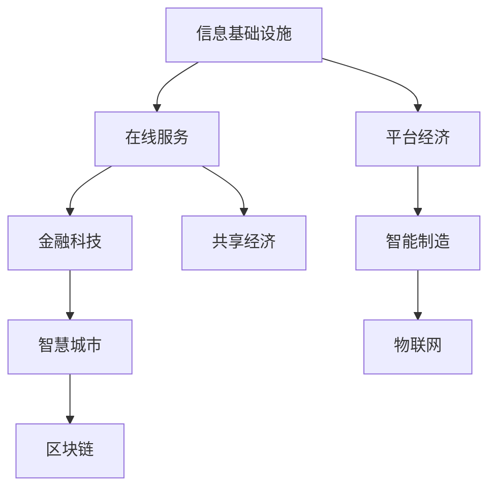

                 

# 数字经济：社会发展的助推器

## 1. 背景介绍

在人类社会历史长河中，经济发展形态经历了农耕经济、工业经济等多个阶段。每一个阶段都与当时的技术进步紧密相连。然而，相较于以往，数字经济的崛起显得尤为不同，它借助信息技术，尤其是移动互联网和人工智能等前沿技术的迅猛发展，为经济结构带来了深远变化。本文将从背景介绍开始，深入探讨数字经济的核心概念与联系，剖析数字经济的主要算法原理与操作步骤，剖析其在社会经济各个领域的广泛应用，并展望其未来发展趋势与挑战，力图为读者提供一份全面、深刻而富有洞见的数字经济研究报告。

## 2. 核心概念与联系

### 2.1 核心概念概述

数字经济，是指以信息、通信和网络技术为核心的现代经济体系，其特征在于数据驱动、技术赋能和协同共享。它涵盖了从信息基础设施、平台经济、在线服务，到智能制造、共享经济、金融科技等各个方面，是现代经济的重要组成部分。

### 2.2 核心概念原理和架构的 Mermaid 流程图



从上述架构图中可见，数字经济体系是由信息基础设施、平台经济、在线服务、智能制造、共享经济、金融科技、智慧城市、物联网和区块链等子系统构建而成，各个系统之间相互关联、协同工作，共同推动社会经济的发展。

## 3. 核心算法原理 & 具体操作步骤

### 3.1 算法原理概述

数字经济的算法原理主要基于数据驱动、模型驱动和算法驱动三大类。其中数据驱动算法通过大数据分析，挖掘经济活动中的规律与趋势；模型驱动算法通过数学模型和机器学习，预测经济现象和行为；算法驱动算法通过人工智能和自动化技术，优化经济运营效率。

### 3.2 算法步骤详解

#### 3.2.1 数据收集与预处理

数据收集是数字经济算法的第一步。通过互联网、移动设备、物联网等多种方式，从不同领域、不同层次收集海量数据，如电商交易数据、社交媒体数据、企业财务数据等。数据预处理包括数据清洗、标准化、去噪和标注等，确保数据的准确性和可用性。

#### 3.2.2 特征工程与模型训练

特征工程是指从原始数据中提取有用的特征，构建数据集，便于模型训练。模型训练包括选择合适的算法，构建模型，用历史数据进行训练，不断优化模型的超参数，如学习率、正则化系数等，直到模型收敛。常用的模型包括线性回归、逻辑回归、决策树、随机森林、神经网络等。

#### 3.2.3 模型评估与迭代优化

模型训练后，需要使用测试集对模型进行评估，计算模型的准确率、召回率、F1值等指标，判断模型性能。根据评估结果，调整模型架构、优化算法参数，进行迭代优化，提高模型精度。

### 3.3 算法优缺点

#### 3.3.1 优点

- **高效性**：大数据、高并发的算法和架构使得数字经济在处理海量数据和实时数据方面具有高效性。
- **灵活性**：模型驱动和算法驱动的算法具有高度的灵活性，可以根据不同的需求快速调整模型和算法。
- **普适性**：数字经济算法可以应用于各种经济领域，具有广泛的应用前景。

#### 3.3.2 缺点

- **数据依赖**：数字经济算法高度依赖数据，数据的准确性和全面性直接影响算法的效果。
- **模型复杂**：一些先进的算法如深度学习模型相对复杂，训练和维护成本高。
- **安全风险**：数据泄露、算法偏见和算法攻击等问题存在安全隐患，需要额外的安全保障措施。

### 3.4 算法应用领域

数字经济算法广泛应用于以下领域：

- **电商推荐**：通过分析用户行为和商品信息，推荐用户可能感兴趣的商品。
- **金融风险评估**：使用模型分析客户的信用风险，评估贷款和投资的风险。
- **智能制造优化**：通过数据分析和建模，优化生产流程，提高生产效率。
- **供应链管理**：利用数据和算法，优化供应链各环节，提升供应链效率。
- **智慧城市管理**：通过数据分析，优化城市交通、能源、公共服务等资源配置，提高城市管理效率。

## 4. 数学模型和公式 & 详细讲解 & 举例说明

### 4.1 数学模型构建

数字经济模型构建的基础是经济数据的收集与处理，其中常用的数学模型包括回归模型、分类模型、聚类模型和关联规则模型等。以电商推荐为例，常用的数学模型为协同过滤模型和基于内容的推荐模型。

协同过滤模型利用用户和商品之间的相似性，推荐与用户喜欢的商品相似的其他商品。基本公式如下：

$$
R_{ui}=\sum_{j=1}^{n}a_{ij}x_{uj}
$$

其中，$R_{ui}$ 表示用户 $u$ 对商品 $i$ 的评分，$a_{ij}$ 表示商品 $i$ 和商品 $j$ 的相似度，$x_{uj}$ 表示用户 $u$ 对商品 $j$ 的评分。

基于内容的推荐模型则是通过分析商品的属性，推荐与用户喜欢的商品属性相似的其他商品。基本公式如下：

$$
R_{ui}=\sum_{j=1}^{n}b_{ij}p_{uj}
$$

其中，$R_{ui}$ 表示用户 $u$ 对商品 $i$ 的评分，$b_{ij}$ 表示商品 $i$ 和商品 $j$ 的属性相似度，$p_{uj}$ 表示用户 $u$ 对商品 $j$ 的评分。

### 4.2 公式推导过程

以电商推荐中的协同过滤模型为例，推导其基本公式。

假设有 $m$ 个用户和 $n$ 个商品，每个用户对每个商品都有一个评分，表示如下：

$$
\begin{cases}
r_{1,1}, r_{1,2}, \dots, r_{1,n}\\
r_{2,1}, r_{2,2}, \dots, r_{2,n}\\
\dots\\
r_{m,1}, r_{m,2}, \dots, r_{m,n}
\end{cases}
$$

其中 $r_{ui}$ 表示用户 $u$ 对商品 $i$ 的评分。设商品 $i$ 和商品 $j$ 的相似度为 $a_{ij}$，则协同过滤模型的基本公式为：

$$
\hat{r}_{ui}=\frac{\sum_{j=1}^{n}a_{ij}r_{uj}}{\sqrt{\sum_{j=1}^{n}a_{ij}^2}\sqrt{\sum_{j=1}^{n}a_{uj}^2}}
$$

其中 $\hat{r}_{ui}$ 表示模型预测用户 $u$ 对商品 $i$ 的评分。

### 4.3 案例分析与讲解

以某电商平台的商品推荐系统为例，分析其协同过滤模型的应用与效果。该平台有 $m$ 个用户和 $n$ 个商品，每个用户对每个商品都有一个评分，模型通过对这些数据进行分析，预测用户对未评分商品的评分。在实际应用中，模型会根据用户的评分历史和商品的属性历史，计算每个用户和每个商品的相似度，然后预测用户对商品的新评分。

## 5. 项目实践：代码实例和详细解释说明

### 5.1 开发环境搭建

数字经济项目的开发环境搭建主要涉及以下几个方面：

- **软件平台**：使用Python语言，配合Jupyter Notebook、PyCharm等IDE进行开发。
- **数据平台**：使用Hadoop、Spark等大数据平台进行数据处理和存储。
- **计算平台**：使用AWS、阿里云等云平台提供高性能计算资源。
- **安全平台**：使用Kubernetes、Docker等容器化技术保障系统安全。

### 5.2 源代码详细实现

以下是一个基于协同过滤算法实现电商推荐系统的Python代码：

```python
from sklearn.metrics.pairwise import cosine_similarity
import numpy as np

# 定义协同过滤模型
class CollaborativeFiltering:
    def __init__(self, X):
        self.X = X
        self.R = np.zeros((self.X.shape[0], self.X.shape[1]))
    
    def fit(self):
        self.R = self.X @ self.X.T
    
    def predict(self, user_index):
        similarity = cosine_similarity(self.X[user_index].reshape(1, -1), self.X)
        weighted_sum = np.dot(similarity, self.X)
        weighted_sum /= np.sum(similarity, axis=1)[:, None]
        return weighted_sum
    
    def predict_proba(self, user_index):
        similarity = cosine_similarity(self.X[user_index].reshape(1, -1), self.X)
        weighted_sum = np.dot(similarity, self.R)
        weighted_sum /= np.sum(similarity, axis=1)[:, None]
        return weighted_sum
```

### 5.3 代码解读与分析

- **代码实现**：
  - `fit` 方法计算商品相似度矩阵 `R`。
  - `predict` 方法根据用户历史评分和商品相似度矩阵，计算用户对新商品的评分。
  - `predict_proba` 方法计算用户对新商品的评分概率。

- **算法分析**：
  - 协同过滤模型计算相似度矩阵 `R` 时，需要大量的内存和计算资源。
  - 预测评分时，需要计算用户历史评分与商品相似度矩阵的加权和，这需要优化算法以提高效率。

- **运行结果展示**：
  - 通过 `predict_proba` 方法，可以得到用户对商品的新评分概率。
  - 在实际应用中，可以结合用户评分历史、商品属性等进行更复杂的评分预测。

## 6. 实际应用场景

### 6.1 智能制造

智能制造是数字经济的重要应用场景之一。通过物联网技术，企业可以实时采集设备运行状态和生产数据，利用大数据分析和机器学习算法，优化生产流程，提高生产效率。

### 6.2 智慧医疗

智慧医疗利用数字技术，提升医疗服务的智能化水平。通过数据分析和建模，预测疾病发展趋势，辅助医生诊断和治疗，提高医疗效率。

### 6.3 智慧城市

智慧城市通过物联网和互联网技术，优化城市管理。例如，通过数据分析和模型预测，优化城市交通、能源、公共服务等资源配置，提高城市管理效率。

### 6.4 金融科技

金融科技利用大数据、人工智能等技术，优化金融业务流程，提高金融服务的智能化水平。例如，利用机器学习模型预测客户信用风险，提高贷款和投资的精准度。

## 7. 工具和资源推荐

### 7.1 学习资源推荐

- **在线课程**：Coursera、Udacity等平台提供大量数字经济相关的课程，如机器学习、大数据、区块链等。
- **在线文档**：Wikipedia、Stack Overflow等平台提供丰富的技术文档和代码示例。
- **开源社区**：GitHub、GitLab等平台提供大量开源项目和工具，便于学习和参考。
- **专业书籍**：《数字经济导论》、《人工智能技术与应用》等书籍，系统介绍数字经济的基本概念和技术。

### 7.2 开发工具推荐

- **大数据平台**：Hadoop、Spark等大数据平台，支持大规模数据处理和存储。
- **人工智能平台**：TensorFlow、PyTorch等深度学习框架，支持机器学习和模型训练。
- **容器化平台**：Docker、Kubernetes等容器化平台，支持系统部署和管理。

### 7.3 相关论文推荐

- **《数字经济与产业升级》**：系统介绍数字经济的基本概念、发展历程和应用前景。
- **《大数据分析与机器学习》**：介绍大数据分析和机器学习的基本原理和应用实例。
- **《智能制造》**：介绍智能制造的基本概念、技术和应用案例。
- **《智慧医疗》**：介绍智慧医疗的基本概念、技术和应用案例。
- **《区块链技术与应用》**：介绍区块链技术的基本原理、应用场景和未来展望。

## 8. 总结：未来发展趋势与挑战

### 8.1 研究成果总结

数字经济已经在多个领域取得显著应用，为经济社会发展注入了新的活力。其算法和技术不断进步，推动了经济结构转型和产业升级。然而，数字经济的发展也面临诸多挑战，如数据隐私保护、算法偏见、安全风险等，需要全社会共同努力，推动数字经济健康、可持续的发展。

### 8.2 未来发展趋势

- **技术进步**：随着计算力、存储力和通信能力的提升，数字经济技术将不断进步，推动产业升级和经济结构优化。
- **应用拓展**：数字经济将进一步拓展到更多领域，如教育、旅游、农业等，带来更多创新和经济效益。
- **全球化发展**：数字经济将打破地理和国界的限制，促进全球经济一体化发展。

### 8.3 面临的挑战

- **数据隐私保护**：数字经济高度依赖数据，如何保护数据隐私、防止数据泄露，是一个亟待解决的问题。
- **算法偏见与公平性**：数字经济算法可能存在偏见，导致公平性问题，需要引入公平性评估和纠正机制。
- **安全风险**：数字经济系统存在被攻击、被篡改的风险，需要加强安全防护。
- **法律与伦理**：数字经济的发展需要相应的法律法规和伦理规范，以保障用户权益和社会公平。

### 8.4 研究展望

- **数字经济与社会责任**：探讨数字经济对社会的影响，推动企业和社会共同承担数字经济带来的社会责任。
- **数字经济与可持续发展**：研究数字经济对环境的影响，推动绿色、可持续的发展。
- **数字经济与跨界融合**：探索数字经济与传统经济、文化、艺术等领域的跨界融合，创造新的发展模式。

## 9. 附录：常见问题与解答

**Q1: 什么是数字经济？**

A: 数字经济是指以信息、通信和网络技术为核心的现代经济体系，其特征在于数据驱动、技术赋能和协同共享。

**Q2: 数字经济算法的优势和劣势是什么？**

A: 数字经济算法具有高效性、灵活性和普适性，但数据依赖、模型复杂和安全性问题需要特别注意。

**Q3: 数字经济主要应用领域有哪些？**

A: 数字经济主要应用于电商推荐、金融风险评估、智能制造、供应链管理、智慧城市管理等领域。

**Q4: 如何保护数字经济中的数据隐私？**

A: 数据隐私保护需要引入数据匿名化、数据加密、访问控制等技术手段，制定完善的法律法规和政策措施。

**Q5: 数字经济面临的最大挑战是什么？**

A: 数据隐私保护、算法偏见、安全风险是数字经济面临的最大挑战，需要全社会共同努力，推动数字经济健康、可持续的发展。

---

作者：禅与计算机程序设计艺术 / Zen and the Art of Computer Programming

