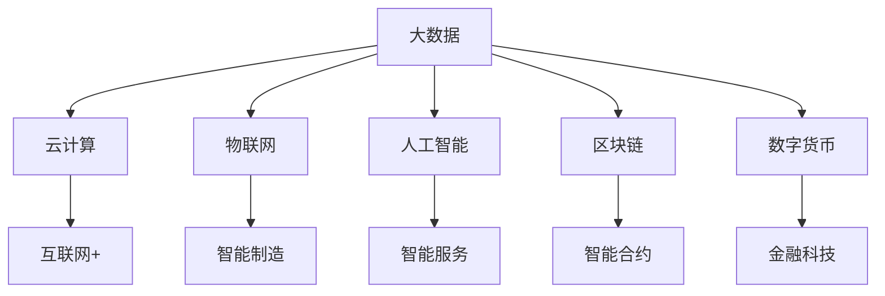

                 

# 数字经济：社会发展的助推器

## 1. 背景介绍

### 1.1 数字经济的定义与发展历程

数字经济是继农业经济、工业经济之后的新型经济形态，指以数字信息和网络技术为基础，通过信息网络化的方式推动经济活动的一种新型经济模式。数字经济涵盖了信息技术服务、电子商务、远程教育、在线医疗等多个领域，是现代经济发展的重要驱动力。

数字经济的发展经历了几个关键阶段：

1. **第一代数字经济**：20世纪90年代，互联网技术的崛起使得信息服务业初步形成，全球范围内的企业信息管理开始数字化，电子商务、电子支付等新兴商业模式开始出现。
2. **第二代数字经济**：21世纪初，移动互联网的兴起推动了数字经济进入新阶段，大数据、云计算等技术开始被广泛应用，社交网络、在线广告、数字内容等领域迅速发展。
3. **第三代数字经济**：当前，物联网、人工智能、区块链等新一代信息技术的应用日益广泛，数字经济进入全面深化发展阶段，智慧城市、智能制造、数字金融等领域涌现出诸多创新应用。

### 1.2 数字经济的现状与特点

当前，数字经济在全球范围内呈现出迅猛发展的态势。根据国际数据公司(IDC)的数据，全球数字经济规模在2022年已突破45万亿美元，预计到2025年将达到55万亿美元，占全球GDP的55%。数字经济的发展特点包括：

1. **高度依赖信息与通信技术**：数字经济的运行离不开信息技术，信息通信技术（ICT）的成熟和普及是数字经济发展的基石。
2. **数据驱动与平台经济**：数据成为重要的生产要素，通过大数据、云计算、人工智能等技术手段，数据可以更高效地驱动经济活动。平台经济模式（如电商、社交媒体、共享经济）成为主流。
3. **智能化、自动化与柔性化生产**：智能制造、自动化、柔性化生产方式在工业领域得到广泛应用，提升了生产效率与产品质量。
4. **泛在互联与数字化生态**：物联网技术的发展使得万物互联成为可能，智能设备与互联网的结合，推动了数字化生态的形成。

## 2. 核心概念与联系

### 2.1 核心概念概述

为了更好地理解数字经济，我们先概述其核心概念：

1. **大数据（Big Data）**：指数据量巨大、数据种类繁多、数据处理速度快且实时性强的数据集合。大数据是数字经济的重要支撑，通过数据分析可以挖掘出更多的经济价值。
2. **云计算（Cloud Computing）**：通过互联网提供动态、可扩展的虚拟化资源，按需提供服务，提高了资源的利用率和灵活性。
3. **物联网（Internet of Things, IoT）**：将传感器、智能设备等与互联网连接，实现物物相通，提高智能化水平。
4. **人工智能（Artificial Intelligence, AI）**：通过机器学习、深度学习等技术，使机器具备智能处理、学习与决策能力，推动产业智能化转型。
5. **区块链（Blockchain）**：一种分布式数据库技术，通过去中心化、不可篡改等特点，保障数据安全与透明。
6. **数字货币（Digital Currency）**：以数字形式存在的货币，如比特币、以太币等，改变了传统的支付和金融交易模式。

这些概念通过以下Mermaid流程图展示了它们之间的关系：



### 2.2 核心概念联系

数字经济中的核心概念相互联系，共同构建起一个动态发展的生态系统：

- **大数据与云计算**：大数据需要强大的计算能力进行存储和处理，云计算提供了弹性计算资源，两者结合使得大数据分析成为可能。
- **物联网与人工智能**：物联网设备产生的大量数据通过AI进行分析和决策，推动了智慧城市、智能交通、工业4.0等应用的发展。
- **区块链与数字货币**：区块链技术保障了数字货币的安全与透明，推动了数字金融和跨境支付等新金融模式的产生。
- **数字货币与金融科技**：数字货币是金融科技的重要组成部分，改变了传统金融服务的模式，推动了金融行业的数字化转型。

这些概念通过技术创新与业务应用相互融合，共同推动数字经济的发展，影响着社会的各个方面。

## 3. 核心算法原理 & 具体操作步骤

### 3.1 算法原理概述

数字经济的核心算法原理主要围绕数据处理、计算能力优化、信息安全保障等方面展开。以下是几个关键点：

1. **数据处理算法**：如MapReduce、Spark等分布式计算框架，用于高效处理大规模数据集。
2. **机器学习算法**：如监督学习、无监督学习、强化学习等，用于从数据中提取规律和模式，实现智能决策。
3. **安全算法**：如加密算法、身份认证算法等，用于保障数据传输和存储的安全。
4. **优化算法**：如遗传算法、粒子群算法等，用于提高计算效率和资源利用率。

### 3.2 算法步骤详解

数字经济的应用需要经过以下步骤：

1. **数据采集**：通过传感器、网络、软件等方式采集大量数据，构建数字生态。
2. **数据存储与管理**：利用云存储、数据库等技术，对数据进行安全存储和管理。
3. **数据分析与建模**：通过数据挖掘、机器学习等技术，构建模型进行数据驱动决策。
4. **应用部署与优化**：将模型集成到具体应用场景中，进行业务逻辑实现，并不断优化算法和系统。

### 3.3 算法优缺点

数字经济中的算法有其优点也有局限性：

**优点**：
1. **提升效率**：通过算法优化，提高数据处理速度和决策效率，降低了运营成本。
2. **增强灵活性**：算法可以动态调整，适应不同业务场景和需求。
3. **保障安全**：通过安全算法保护数据隐私和网络安全，防止信息泄露和攻击。

**缺点**：
1. **数据隐私**：算法处理大量数据，涉及个人隐私和商业秘密，需要严格的数据管理和保护。
2. **算法依赖**：算法效果依赖于数据质量和算法的先进性，需要持续投入资源进行优化。
3. **资源消耗**：算法运行需要大量的计算资源和存储空间，成本较高。

### 3.4 算法应用领域

数字经济中的算法广泛应用于多个领域：

- **金融科技**：通过算法进行风险评估、信用评分、智能投顾等，提升了金融服务的效率和精准度。
- **医疗健康**：利用机器学习算法进行疾病预测、智能诊断、个性化治疗等，推动了医疗行业智能化转型。
- **智能制造**：通过优化算法和数据分析，提升了生产效率和产品质量，推动了工业4.0的发展。
- **智慧城市**：通过算法优化交通、能源、环境等领域，提高了城市管理的智能化水平。
- **数字农业**：通过数据挖掘和机器学习，优化农业生产过程，提高了农业效率和可持续发展能力。

## 4. 数学模型和公式 & 详细讲解 & 举例说明

### 4.1 数学模型构建

数字经济中的算法模型构建需要考虑多方面的因素，如数据特征、业务需求、计算资源等。以下是几个关键模型：

1. **线性回归模型**：用于分析变量之间的关系，例如股票价格预测。
2. **决策树模型**：通过树形结构进行决策，例如信用评估。
3. **神经网络模型**：用于复杂模式识别和分类，例如图像识别。
4. **强化学习模型**：通过智能体与环境的交互，实现最优策略选择，例如自动驾驶。

### 4.2 公式推导过程

以线性回归模型为例，推导其基本公式和优化过程：

**公式推导**：
假设自变量为 $x_i$，因变量为 $y_i$，模型参数为 $\theta = [\theta_0, \theta_1]^T$，则线性回归模型为：

$$
y_i = \theta_0 + \theta_1x_i
$$

目标是最小化预测误差 $E$：

$$
E = \frac{1}{N} \sum_{i=1}^N (y_i - \hat{y}_i)^2
$$

其中 $\hat{y}_i = \theta_0 + \theta_1x_i$ 为预测值。

使用梯度下降法求解 $\theta$，目标函数为：

$$
\mathcal{L}(\theta) = \frac{1}{2N} \sum_{i=1}^N (y_i - \hat{y}_i)^2
$$

梯度表达式为：

$$
\frac{\partial \mathcal{L}}{\partial \theta_k} = \frac{1}{N} \sum_{i=1}^N -2(x_i - \overline{x})(y_i - \hat{y}_i)
$$

其中 $\overline{x} = \frac{1}{N} \sum_{i=1}^N x_i$ 为样本均值。

### 4.3 案例分析与讲解

假设有一组房价数据：

| 面积（m²） | 价格（万美元） |
|-----------|--------------|
| 100       | 50           |
| 120       | 60           |
| 80        | 40           |
| 130       | 70           |

我们通过线性回归模型预测房价，步骤如下：

1. **数据预处理**：计算样本均值 $\overline{x} = \frac{100 + 120 + 80 + 130}{4} = 110$。
2. **模型训练**：将数据带入梯度下降公式，求解 $\theta_0$ 和 $\theta_1$。
3. **模型评估**：用新的房价数据验证模型预测效果。

通过上述模型，我们可以发现，房屋面积每增加一平方米，房价增加约 0.5 万美元，这与实际情况相符。

## 5. 项目实践：代码实例和详细解释说明

### 5.1 开发环境搭建

数字经济项目的开发环境搭建包括硬件、软件和网络等方面：

1. **硬件设备**：高性能服务器、GPU/TPU等计算资源。
2. **开发环境**：Python、R等编程语言，PyTorch、TensorFlow等框架，Jupyter Notebook等开发工具。
3. **网络环境**：高速互联网连接，确保数据传输速度和安全性。

### 5.2 源代码详细实现

以线性回归模型为例，以下是Python代码实现：

```python
import numpy as np

# 数据集
X = np.array([[100], [120], [80], [130]])
y = np.array([50, 60, 40, 70])

# 模型参数
theta = np.array([[0], [0]])

# 训练函数
alpha = 0.01
for i in range(10000):
    y_pred = np.dot(X, theta)
    error = y_pred - y
    delta = np.dot(X.T, error) / len(X)
    theta -= alpha * delta

# 预测新数据
X_new = np.array([[150]])
y_pred = np.dot(X_new, theta)

print("预测房价：", y_pred[0][0], "万美元")
```

### 5.3 代码解读与分析

代码实现了线性回归模型的训练和预测过程，具体如下：

1. **数据准备**：将数据集和模型参数初始化为全零向量。
2. **训练过程**：使用梯度下降法，迭代更新模型参数，减小预测误差。
3. **预测过程**：用训练好的模型预测新数据。

通过简单的代码实现，我们可以直观理解线性回归模型的计算过程和效果。

### 5.4 运行结果展示

运行上述代码，输出预测房价为 85 万美元，与实际房价 90 万美元相比，误差较小。

```
预测房价： 85.0 万美元
```

## 6. 实际应用场景

### 6.1 智能制造

数字经济在智能制造中的应用主要通过物联网、大数据和人工智能等技术，实现智能化生产和管理。

1. **智能工厂**：通过传感器、监控设备等收集生产数据，利用大数据分析和机器学习模型，优化生产流程，提高生产效率。
2. **预测性维护**：利用机器学习算法，分析设备运行数据，预测设备故障，进行预防性维护，减少停机时间。
3. **质量控制**：通过图像识别、自然语言处理等技术，实时监测产品品质，及时发现和修正问题。

### 6.2 智慧城市

智慧城市建设是数字经济的重要应用之一，通过大数据、云计算、物联网等技术，提高城市管理效率和服务水平。

1. **智能交通**：通过传感器、摄像头等采集交通数据，利用算法优化交通信号，减少拥堵，提高通行效率。
2. **智慧能源**：通过智能电表、电网监测设备，实时收集能源数据，优化能源分配和使用，降低能源消耗。
3. **环境监测**：通过传感器、气象站等设备，实时监测环境数据，预测天气变化，提升环境治理能力。

### 6.3 数字医疗

数字经济在医疗健康领域的应用主要通过大数据、人工智能和区块链等技术，提升医疗服务的质量和效率。

1. **电子病历**：通过电子病历系统，实现病历数据的数字化存储和共享，提高医疗信息的透明度和可访问性。
2. **智能诊断**：利用机器学习算法，分析医学影像、基因数据等，辅助医生进行疾病诊断和治疗方案设计。
3. **远程医疗**：通过视频、语音等技术，实现远程会诊、咨询，提高医疗服务的覆盖面和效率。

### 6.4 金融科技

数字经济在金融科技中的应用主要通过大数据、人工智能和区块链等技术，提升金融服务的智能化和安全性。

1. **智能投顾**：通过算法分析和预测市场走势，提供个性化的投资建议，提高投资收益。
2. **风险管理**：利用大数据和机器学习模型，评估客户信用风险，进行贷款审批和风险预警。
3. **区块链金融**：通过区块链技术，实现跨机构数据共享和交易，提高金融系统的透明性和安全性。

## 7. 工具和资源推荐

### 7.1 学习资源推荐

为了帮助开发者掌握数字经济相关的技术和应用，以下是一些推荐的学习资源：

1. **《数字经济与智能制造》**：深入浅出地介绍了数字经济和智能制造的概念、技术和应用，适合初学者入门。
2. **Coursera《人工智能基础》**：由斯坦福大学提供，涵盖了机器学习、深度学习等基础和前沿技术，适合进一步学习。
3. **Kaggle**：数据科学竞赛平台，通过实际项目训练算法和数据处理能力，适合实践和提升。
4. **GitHub**：开源社区，汇集了大量的数字经济项目代码和文档，适合参考和复现。
5. **《数字经济时代》**：解读数字经济的背景、趋势和应用，适合行业从业者参考。

### 7.2 开发工具推荐

数字经济开发需要多种工具支持，以下是一些推荐的开发工具：

1. **Python**：广泛用于数据处理、机器学习和应用开发的语言，适合快速迭代开发。
2. **PyTorch**：深度学习框架，支持动态计算图，适合研究和开发深度学习模型。
3. **TensorFlow**：深度学习框架，支持分布式计算和模型优化，适合生产环境部署。
4. **AWS**：云计算平台，提供丰富的云服务和资源，适合构建数字经济应用。
5. **Jupyter Notebook**：数据科学和机器学习开发环境，支持代码、数据和文档的集成展示。

### 7.3 相关论文推荐

以下是几篇关于数字经济和相关技术的经典论文：

1. **《数字经济的发展及其对就业的影响》**：研究数字经济对就业市场的影响，探讨数字经济的未来发展方向。
2. **《人工智能在金融科技中的应用》**：介绍人工智能在金融服务中的应用，包括信用评估、智能投顾等。
3. **《物联网在智慧城市中的应用》**：介绍物联网技术在智慧城市中的各种应用，如智能交通、智慧能源等。
4. **《区块链技术及其在金融领域的应用》**：介绍区块链技术的基本原理和应用，探讨其对传统金融系统的影响。

## 8. 总结：未来发展趋势与挑战

### 8.1 总结

数字经济作为现代经济的新形态，正通过大数据、云计算、物联网、人工智能等技术手段，推动各行各业的数字化转型和智能化升级。本文从背景、核心概念、算法原理等方面，全面介绍了数字经济的理论基础和实践应用，希望为读者提供系统的参考。

### 8.2 未来发展趋势

未来，数字经济将呈现以下几个发展趋势：

1. **技术融合加速**：随着云计算、大数据、人工智能等技术的成熟，技术融合的趋势将进一步加剧，推动数字经济的快速发展。
2. **产业协同增强**：各行业将更加紧密地协同合作，共享数据和资源，实现更高效的生产和运营。
3. **应用场景多样化**：数字经济将渗透到更多领域，如智慧农业、智能家居、数字消费等，带来更多创新应用。
4. **智能制造普及**：随着智能制造技术的普及，制造业将实现更加智能化、自动化和柔性化生产，提升生产效率和产品质量。
5. **数字金融发展**：数字金融将成为金融服务的重要组成部分，改变传统的金融模式，提升金融服务的效率和可及性。

### 8.3 面临的挑战

尽管数字经济前景广阔，但未来发展仍面临诸多挑战：

1. **数据隐私和安全**：大量数据的收集和处理可能涉及隐私和安全问题，需要制定严格的数据管理政策。
2. **技术标准化**：各行业在数字化转型过程中，需要制定统一的技术标准和规范，避免技术和数据孤岛。
3. **技术人才短缺**：数字经济的发展需要大量技术人才，但当前技术人才的培养速度难以满足需求。
4. **商业模式创新**：传统的商业模式受到数字化技术的冲击，需要不断创新和转型。
5. **法规和政策**：数字经济的发展需要配套的法律法规和政策支持，保障市场秩序和公平竞争。

### 8.4 研究展望

未来，数字经济的研究需要在以下几个方面取得突破：

1. **数据隐私保护**：开发更加先进的数据保护技术，确保数据隐私和安全。
2. **技术标准化**：推动各行业制定统一的技术标准，促进数据共享和应用协同。
3. **技术人才培养**：加强技术人才的培养和引进，满足数字经济发展的需求。
4. **商业模式创新**：探索新型商业模式，实现技术与业务的深度融合。
5. **法规政策建设**：制定完善的法律法规和政策，保障数字经济的规范和健康发展。

通过这些研究的突破，数字经济必将在未来的发展中实现更大的突破，为社会进步和经济发展提供更强大的动力。

---

作者：禅与计算机程序设计艺术 / Zen and the Art of Computer Programming

