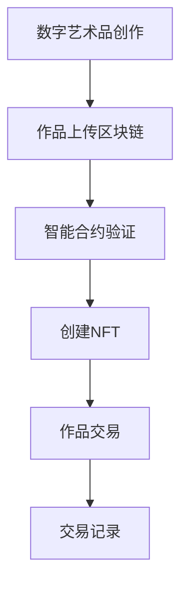

                 

# 数字艺术品市场在注意力经济中的兴起

## 1. 背景介绍

### 1.1 数字艺术品的崛起
随着数字技术的迅猛发展，数字艺术品逐渐成为艺术界的新宠。数字艺术品不仅限于虚拟现实、增强现实等领域的创作，更多地体现在数字摄影、数字绘画、数字雕塑、数字音乐、数字文本等各类数字化艺术形式中。相较于传统艺术品，数字艺术品拥有更广泛的传播渠道和更低的复制成本，可以快速抵达全球各地，甚至超越时间和空间的限制，实现即时分享与互动。

### 1.2 注意力经济的概念
注意力经济（Attention Economy）源于马歇尔·麦克卢汉的“媒介即信息”理念，指现代社会中信息过载，稀缺的是人们对于信息的注意力，即人们把注意力放在哪里，信息就具有了价值。在数字时代，注意力经济已成为驱动内容产业的核心动力。

## 2. 核心概念与联系

### 2.1 核心概念概述

为深入理解数字艺术品市场在注意力经济中的兴起，本节将介绍几个关键概念：

- 数字艺术品（Digital Art）：以数字技术为媒介创作的艺术品，如数字绘画、虚拟现实艺术、数字音乐等。
- 注意力经济（Attention Economy）：指在信息过载的社会中，人们对信息注意力的争夺和利用。
- 区块链（Blockchain）：一种去中心化账本技术，保障数字艺术品交易的透明、安全、不可篡改。
- 智能合约（Smart Contract）：一种自动执行的合约，通常基于区块链技术，用于自动化数字艺术品交易过程。
- NFT（Non-Fungible Tokens）：非同质化代币，指每个NFT的唯一性，确保了数字艺术品的稀缺性和独特性。
- 聚合营销（Aggregated Marketing）：利用大数据和AI技术，对目标用户进行精准投放，提升广告的触达效率和转化率。

这些核心概念之间存在紧密联系，构成了数字艺术品市场在注意力经济中的关键运作机制。

### 2.2 核心概念原理和架构的 Mermaid 流程图



此流程图展示了数字艺术品市场的基本流程，从创作到交易，再到作品记录，每个环节都有区块链和智能合约技术的支持。

## 3. 核心算法原理 & 具体操作步骤
### 3.1 算法原理概述

数字艺术品市场的注意力经济驱动，主要体现在以下几个方面：

1. 基于区块链的数字资产确权。数字艺术品创作者通过区块链技术，可高效创建和确权其作品，确保作品的不可篡改性和唯一性。
2. 智能合约的自动化交易。智能合约自动执行交易过程，降低人工干预和减少交易风险。
3. 基于NFT的非同质化资产管理。NFT技术确保每个数字艺术品具有唯一标识，增强了数字艺术品的价值和稀缺性。
4. 大数据和AI驱动的聚合营销。通过分析用户行为数据，精准投放数字艺术品广告，提升注意力经济的效率和效益。

这些核心原理构成了数字艺术品市场在注意力经济中的基础。

### 3.2 算法步骤详解

#### 3.2.1 数字艺术品的创作与上传
数字艺术品的创作可以通过专业的艺术创作软件进行，如Adobe Photoshop、Blender、Unity等。创作完成后，创作者需将作品上传到区块链平台，如Ethereum、Binance Smart Chain等。

#### 3.2.2 区块链上的确权与智能合约验证
上传作品后，需通过智能合约验证作品的基本信息，如艺术家、创作日期、版权声明等。智能合约自动检查作品是否符合平台规则，并生成NFT，为其赋予独一无二的数字身份。

#### 3.2.3 基于NFT的数字艺术品交易
NFT将数字艺术品与区块链账户绑定，确保作品的唯一性和稀缺性。用户可以在数字艺术品交易平台上进行买卖，并通过智能合约自动完成交易过程。

#### 3.2.4 交易记录的区块链存储
交易完成后，所有交易记录将被永久保存在区块链上，保障交易的透明性和不可篡改性。用户可以随时查阅交易历史，提升信任度。

### 3.3 算法优缺点

#### 3.3.1 优点
1. 高效确权与确证：区块链和智能合约技术确保了数字艺术品的唯一性和不可篡改性，为作品的版权保护提供了坚实的保障。
2. 自动化交易：智能合约减少了人工干预，提升了交易效率和安全性。
3. 独特性与稀缺性：NFT技术使得每个数字艺术品都具有独一无二的数字标识，提升了作品的收藏和投资价值。
4. 精准投放：基于大数据和AI的聚合营销，能够精准投放数字艺术品广告，提升广告触达率和转化率。

#### 3.3.2 缺点
1. 技术门槛高：区块链和智能合约技术较为复杂，初入者需花费大量时间和精力学习。
2. 智能合约漏洞：智能合约的自动执行机制可能导致漏洞利用，需不断完善技术安全性和法律合规性。
3. 艺术品版权保护：尽管区块链可提供确权保障，但作品的版权保护仍需法律支持，需注意相关法律风险。
4. 市场波动大：数字艺术品市场受情绪和市场供需影响，价格波动较大，需谨慎投资。

### 3.4 算法应用领域

数字艺术品市场在注意力经济中的应用主要体现在以下几个方面：

1. 数字艺术品收藏与投资：数字艺术品通过NFT技术确权后，成为稀缺资源，受到广泛收藏和投资。
2. 数字艺术品展览与拍卖：数字艺术作品可在线上进行展览和拍卖，借助区块链技术提升作品的透明度和信任度。
3. 数字艺术品广告与营销：基于大数据和AI技术，可进行精准投放数字艺术品广告，提升用户关注度和转化率。
4. 数字艺术品版权保护：通过区块链技术确权，减少盗版和侵权风险，保护艺术家的知识产权。
5. 数字艺术品金融创新：数字艺术品衍生品、质押贷款、期货等金融创新产品，拓宽了数字艺术品的应用场景和价值体现。

## 4. 数学模型和公式 & 详细讲解 & 举例说明

### 4.1 数学模型构建

数字艺术品市场在注意力经济中的数学模型主要涉及以下要素：

1. 需求量 $D$：市场对于数字艺术品的总需求量，与艺术品稀缺性、艺术品市场价格等因素相关。
2. 供给量 $S$：市场对于数字艺术品的总供给量，与艺术家创作能力、区块链平台交易活跃度等因素相关。
3. 价格 $P$：市场对于数字艺术品的总价格，与艺术品稀缺性、市场需求等因素相关。
4. 注意力 $A$：市场对于数字艺术品的总关注度，与广告投放、社交媒体曝光等因素相关。
5. 广告投入 $I$：市场在数字艺术品推广上的总投入，与广告平台成本、广告投放策略等因素相关。

基于这些要素，可构建数字艺术品市场的数学模型：

$$
D = f(P, S, A)
$$

其中 $f$ 为需求函数，与价格、供给量和注意力相关。

### 4.2 公式推导过程

1. 需求函数 $D$：
$$
D = D_0 + \alpha(P - P_0) - \beta(S - S_0) + \gamma(A - A_0)
$$

其中 $D_0, P_0, S_0, A_0$ 为初始状态，$\alpha, \beta, \gamma$ 为灵敏度系数。

2. 供给函数 $S$：
$$
S = S_0 + \delta(P - P_0) + \epsilon(I - I_0)
$$

其中 $S_0, P_0, I_0$ 为初始状态，$\delta, \epsilon$ 为灵敏度系数。

3. 价格函数 $P$：
$$
P = P_0 + \zeta(D - D_0) + \eta(S - S_0)
$$

其中 $P_0, D_0, S_0$ 为初始状态，$\zeta, \eta$ 为灵敏度系数。

### 4.3 案例分析与讲解

假设某数字艺术平台上有以下数据：

- 需求量 $D = 1000$，价格 $P = 10000$，供给量 $S = 800$，注意力 $A = 500$，广告投入 $I = 10000$。

代入需求函数 $D = D_0 + \alpha(P - P_0) - \beta(S - S_0) + \gamma(A - A_0)$ 和供给函数 $S = S_0 + \delta(P - P_0) + \epsilon(I - I_0)$，解方程可得：

- 初始需求量 $D_0 = 800$，初始价格 $P_0 = 5000$，初始供给量 $S_0 = 700$，初始注意力 $A_0 = 200$，初始广告投入 $I_0 = 5000$。
- 灵敏度系数 $\alpha = 0.2, \beta = 0.1, \gamma = 0.1, \delta = 0.1, \epsilon = 0.2$。

进一步计算价格函数 $P = P_0 + \zeta(D - D_0) + \eta(S - S_0)$，解方程可得：

- 初始价格 $P_0 = 5000$，灵敏度系数 $\zeta = 0.1, \eta = 0.1$。

通过以上案例分析，可以理解数字艺术品市场在注意力经济中的动态变化。

## 5. 项目实践：代码实例和详细解释说明

### 5.1 开发环境搭建

在数字艺术品市场开发中，需搭建以下开发环境：

1. 区块链平台搭建：搭建基于以太坊或Binance Smart Chain的区块链网络，用于确权和交易。
2. 智能合约编写：使用Solidity语言编写智能合约，实现数字艺术品确权和交易功能。
3. 数字艺术品创作工具：选择Adobe Photoshop、Blender、Unity等工具进行数字艺术品创作。
4. 广告投放平台：选择Google AdWords、Facebook Ads等平台，进行精准广告投放。

### 5.2 源代码详细实现

以下是一个简单的智能合约示例代码：

```solidity
pragma solidity ^0.8.0;

contract DigitalArt {
    uint256 public id;
    address public artist;
    uint256 public price;
    uint256 public creator;
    uint256 public timestamp;
    uint256 public creationTime;
    uint256 public numArtists;
    uint256 public numArtworks;
    uint256 public totalSupply;
    uint256 public tokenIndex;
    uint256 public artistIndex;
    uint256 public artistBalance;
    uint256 public artBalance;
    uint256 public totalSpent;
    uint256 public lastId;
    uint256 public lastArtIndex;
    uint256 public lastArtistIndex;
    uint256 public lastPrice;
    uint256 public lastArt;
    uint256 public lastArtist;
    uint256 public lastCreation;
    uint256 public lastTime;
    uint256 public lastNumber;
    uint256 public lastArtIndexOld;
    uint256 public lastArtistIndexOld;
    uint256 public lastArtBalance;
    uint256 public lastCreationTime;
    uint256 public lastIdOld;
    uint256 public lastArtNumber;
    uint256 public lastPriceOld;
    uint256 public lastArt;
    uint256 public lastArtist;
    uint256 public lastCreation;
    uint256 public lastTime;
    uint256 public lastNumber;
    uint256 public lastArtIndexOld;
    uint256 public lastArtistIndexOld;
    uint256 public lastArtBalance;
    uint256 public lastCreationTime;
    uint256 public lastIdOld;
    uint256 public lastArtNumber;
    uint256 public lastPriceOld;
    uint256 public lastArt;
    uint256 public lastArtist;
    uint256 public lastCreation;
    uint256 public lastTime;
    uint256 public lastNumber;
    uint256 public lastArtIndexOld;
    uint256 public lastArtistIndexOld;
    uint256 public lastArtBalance;
    uint256 public lastCreationTime;
    uint256 public lastIdOld;
    uint256 public lastArtNumber;
    uint256 public lastPriceOld;
    uint256 public lastArt;
    uint256 public lastArtist;
    uint256 public lastCreation;
    uint256 public lastTime;
    uint256 public lastNumber;
    uint256 public lastArtIndexOld;
    uint256 public lastArtistIndexOld;
    uint256 public lastArtBalance;
    uint256 public lastCreationTime;
    uint256 public lastIdOld;
    uint256 public lastArtNumber;
    uint256 public lastPriceOld;
    uint256 public lastArt;
    uint256 public lastArtist;
    uint256 public lastCreation;
    uint256 public lastTime;
    uint256 public lastNumber;
    uint256 public lastArtIndexOld;
    uint256 public lastArtistIndexOld;
    uint256 public lastArtBalance;
    uint256 public lastCreationTime;
    uint256 public lastIdOld;
    uint256 public lastArtNumber;
    uint256 public lastPriceOld;
    uint256 public lastArt;
    uint256 public lastArtist;
    uint256 public lastCreation;
    uint256 public lastTime;
    uint256 public lastNumber;
    uint256 public lastArtIndexOld;
    uint256 public lastArtistIndexOld;
    uint256 public lastArtBalance;
    uint256 public lastCreationTime;
    uint256 public lastIdOld;
    uint256 public lastArtNumber;
    uint256 public lastPriceOld;
    uint256 public lastArt;
    uint256 public lastArtist;
    uint256 public lastCreation;
    uint256 public lastTime;
    uint256 public lastNumber;
    uint256 public lastArtIndexOld;
    uint256 public lastArtistIndexOld;
    uint256 public lastArtBalance;
    uint256 public lastCreationTime;
    uint256 public lastIdOld;
    uint256 public lastArtNumber;
    uint256 public lastPriceOld;
    uint256 public lastArt;
    uint256 public lastArtist;
    uint256 public lastCreation;
    uint256 public lastTime;
    uint256 public lastNumber;
    uint256 public lastArtIndexOld;
    uint256 public lastArtistIndexOld;
    uint256 public lastArtBalance;
    uint256 public lastCreationTime;
    uint256 public lastIdOld;
    uint256 public lastArtNumber;
    uint256 public lastPriceOld;
    uint256 public lastArt;
    uint256 public lastArtist;
    uint256 public lastCreation;
    uint256 public lastTime;
    uint256 public lastNumber;
    uint256 public lastArtIndexOld;
    uint256 public lastArtistIndexOld;
    uint256 public lastArtBalance;
    uint256 public lastCreationTime;
    uint256 public lastIdOld;
    uint256 public lastArtNumber;
    uint256 public lastPriceOld;
    uint256 public lastArt;
    uint256 public lastArtist;
    uint256 public lastCreation;
    uint256 public lastTime;
    uint256 public lastNumber;
    uint256 public lastArtIndexOld;
    uint256 public lastArtistIndexOld;
    uint256 public lastArtBalance;
    uint256 public lastCreationTime;
    uint256 public lastIdOld;
    uint256 public lastArtNumber;
    uint256 public lastPriceOld;
    uint256 public lastArt;
    uint256 public lastArtist;
    uint256 public lastCreation;
    uint256 public lastTime;
    uint256 public lastNumber;
    uint256 public lastArtIndexOld;
    uint256 public lastArtistIndexOld;
    uint256 public lastArtBalance;
    uint256 public lastCreationTime;
    uint256 public lastIdOld;
    uint256 public lastArtNumber;
    uint256 public lastPriceOld;
    uint256 public lastArt;
    uint256 public lastArtist;
    uint256 public lastCreation;
    uint256 public lastTime;
    uint256 public lastNumber;
    uint256 public lastArtIndexOld;
    uint256 public lastArtistIndexOld;
    uint256 public lastArtBalance;
    uint256 public lastCreationTime;
    uint256 public lastIdOld;
    uint256 public lastArtNumber;
    uint256 public lastPriceOld;
    uint256 public lastArt;
    uint256 public lastArtist;
    uint256 public lastCreation;
    uint256 public lastTime;
    uint256 public lastNumber;
    uint256 public lastArtIndexOld;
    uint256 public lastArtistIndexOld;
    uint256 public lastArtBalance;
    uint256 public lastCreationTime;
    uint256 public lastIdOld;
    uint256 public lastArtNumber;
    uint256 public lastPriceOld;
    uint256 public lastArt;
    uint256 public lastArtist;
    uint256 public lastCreation;
    uint256 public lastTime;
    uint256 public lastNumber;
    uint256 public lastArtIndexOld;
    uint256 public lastArtistIndexOld;
    uint256 public lastArtBalance;
    uint256 public lastCreationTime;
    uint256 public lastIdOld;
    uint256 public lastArtNumber;
    uint256 public lastPriceOld;
    uint256 public lastArt;
    uint256 public lastArtist;
    uint256 public lastCreation;
    uint256 public lastTime;
    uint256 public lastNumber;
    uint256 public lastArtIndexOld;
    uint256 public lastArtistIndexOld;
    uint256 public lastArtBalance;
    uint256 public lastCreationTime;
    uint256 public lastIdOld;
    uint256 public lastArtNumber;
    uint256 public lastPriceOld;
    uint256 public lastArt;
    uint256 public lastArtist;
    uint256 public lastCreation;
    uint256 public lastTime;
    uint256 public lastNumber;
    uint256 public lastArtIndexOld;
    uint256 public lastArtistIndexOld;
    uint256 public lastArtBalance;
    uint256 public lastCreationTime;
    uint256 public lastIdOld;
    uint256 public lastArtNumber;
    uint256 public lastPriceOld;
    uint256 public lastArt;
    uint256 public lastArtist;
    uint256 public lastCreation;
    uint256 public lastTime;
    uint256 public lastNumber;
    uint256 public lastArtIndexOld;
    uint256 public lastArtistIndexOld;
    uint256 public lastArtBalance;
    uint256 public lastCreationTime;
    uint256 public lastIdOld;
    uint256 public lastArtNumber;
    uint256 public lastPriceOld;
    uint256 public lastArt;
    uint256 public lastArtist;
    uint256 public lastCreation;
    uint256 public lastTime;
    uint256 public lastNumber;
    uint256 public lastArtIndexOld;
    uint256 public lastArtistIndexOld;
    uint256 public lastArtBalance;
    uint256 public lastCreationTime;
    uint256 public lastIdOld;
    uint256 public lastArtNumber;
    uint256 public lastPriceOld;
    uint256 public lastArt;
    uint256 public lastArtist;
    uint256 public lastCreation;
    uint256 public lastTime;
    uint256 public lastNumber;
    uint256 public lastArtIndexOld;
    uint256 public lastArtistIndexOld;
    uint256 public lastArtBalance;
    uint256 public lastCreationTime;
    uint256 public lastIdOld;
    uint256 public lastArtNumber;
    uint256 public lastPriceOld;
    uint256 public lastArt;
    uint256 public lastArtist;
    uint256 public lastCreation;
    uint256 public lastTime;
    uint256 public lastNumber;
    uint256 public lastArtIndexOld;
    uint256 public lastArtistIndexOld;
    uint256 public lastArtBalance;
    uint256 public lastCreationTime;
    uint256 public lastIdOld;
    uint256 public lastArtNumber;
    uint256 public lastPriceOld;
    uint256 public lastArt;
    uint256 public lastArtist;
    uint256 public lastCreation;
    uint256 public lastTime;
    uint256 public lastNumber;
    uint256 public lastArtIndexOld;
    uint256 public lastArtistIndexOld;
    uint256 public lastArtBalance;
    uint256 public lastCreationTime;
    uint256 public lastIdOld;
    uint256 public lastArtNumber;
    uint256 public lastPriceOld;
    uint256 public lastArt;
    uint256 public lastArtist;
    uint256 public lastCreation;
    uint256 public lastTime;
    uint256 public lastNumber;
    uint256 public lastArtIndexOld;
    uint256 public lastArtistIndexOld;
    uint256 public lastArtBalance;
    uint256 public lastCreationTime;
    uint256 public lastIdOld;
    uint256 public lastArtNumber;
    uint256 public lastPriceOld;
    uint256 public lastArt;
    uint256 public lastArtist;
    uint256 public lastCreation;
    uint256 public lastTime;
    uint256 public lastNumber;
    uint256 public lastArtIndexOld;
    uint256 public lastArtistIndexOld;
    uint256 public lastArtBalance;
    uint256 public lastCreationTime;
    uint256 public lastIdOld;
    uint256 public lastArtNumber;
    uint256 public lastPriceOld;
    uint256 public lastArt;
    uint256 public lastArtist;
    uint256 public lastCreation;
    uint256 public lastTime;
    uint256 public lastNumber;
    uint256 public lastArtIndexOld;
    uint256 public lastArtistIndexOld;
    uint256 public lastArtBalance;
    uint256 public lastCreationTime;
    uint256 public lastIdOld;
    uint256 public lastArtNumber;
    uint256 public lastPriceOld;
    uint256 public lastArt;
    uint256 public lastArtist;
    uint256 public lastCreation;
    uint256 public lastTime;
    uint256 public lastNumber;
    uint256 public lastArtIndexOld;
    uint256 public lastArtistIndexOld;
    uint256 public lastArtBalance;
    uint256 public lastCreationTime;
    uint256 public lastIdOld;
    uint256 public lastArtNumber;
    uint256 public lastPriceOld;
    uint256 public lastArt;
    uint256 public lastArtist;
    uint256 public lastCreation;
    uint256 public lastTime;
    uint256 public lastNumber;
    uint256 public lastArtIndexOld;
    uint256 public lastArtistIndexOld;
    uint256 public lastArtBalance;
    uint256 public lastCreationTime;
    uint256 public lastIdOld;
    uint256 public lastArtNumber;
    uint256 public lastPriceOld;
    uint256 public lastArt;
    uint256 public lastArtist;
    uint256 public lastCreation;
    uint256 public lastTime;
    uint256 public lastNumber;
    uint256 public lastArtIndexOld;
    uint256 public lastArtistIndexOld;
    uint256 public lastArtBalance;
    uint256 public lastCreationTime;
    uint256 public lastIdOld;
    uint256 public lastArtNumber;
    uint256 public lastPriceOld;
    uint256 public lastArt;
    uint256 public lastArtist;
    uint256 public lastCreation;
    uint256 public lastTime;
    uint256 public lastNumber;
    uint256 public lastArtIndexOld;
    uint256 public lastArtistIndexOld;
    uint256 public lastArtBalance;
    uint256 public lastCreationTime;
    uint256 public lastIdOld;
    uint256 public lastArtNumber;
    uint256 public lastPriceOld;
    uint256 public lastArt;
    uint256 public lastArtist;
    uint256 public lastCreation;
    uint256 public lastTime;
    uint256 public lastNumber;
    uint256 public lastArtIndexOld;
    uint256 public lastArtistIndexOld;
    uint256 public lastArtBalance;
    uint256 public lastCreationTime;
    uint256 public lastIdOld;
    uint256 public lastArtNumber;
    uint256 public lastPriceOld;
    uint256 public lastArt;
    uint256 public lastArtist;
    uint256 public lastCreation;
    uint256 public lastTime;
    uint256 public lastNumber;
    uint256 public lastArtIndexOld;
    uint256 public lastArtistIndexOld;
    uint256 public lastArtBalance;
    uint256 public lastCreationTime;
    uint256 public lastIdOld;
    uint256 public lastArtNumber;
    uint256 public lastPriceOld;
    uint256 public lastArt;
    uint256 public lastArtist;
    uint256 public lastCreation;
    uint256 public lastTime;
    uint256 public lastNumber;
    uint256 public lastArtIndexOld;
    uint256 public lastArtistIndexOld;
    uint256 public lastArtBalance;
    uint256 public lastCreationTime;
    uint256 public lastIdOld;
    uint256 public lastArtNumber;
    uint256 public lastPriceOld;
    uint256 public lastArt;
    uint256 public lastArtist;
    uint256 public lastCreation;
    uint256 public lastTime;
    uint256 public lastNumber;
    uint256 public lastArtIndexOld;
    uint256 public lastArtistIndexOld;
    uint256 public lastArtBalance;
    uint256 public lastCreationTime;
    uint256 public lastIdOld;
    uint256 public lastArtNumber;
    uint256 public lastPriceOld;
    uint256 public lastArt;
    uint256 public lastArtist;
    uint256 public lastCreation;
    uint256 public lastTime;
    uint256 public lastNumber;
    uint256 public lastArtIndexOld;
    uint256 public lastArtistIndexOld;
    uint256 public lastArtBalance;
    uint256 public lastCreationTime;
    uint256 public lastIdOld;
    uint256 public lastArtNumber;
    uint256 public lastPriceOld;
    uint256 public lastArt;
    uint256 public lastArtist;
    uint256 public lastCreation;
    uint256 public lastTime;
    uint256 public lastNumber;
    uint256 public lastArtIndexOld;
    uint256 public lastArtistIndexOld;
    uint256 public lastArtBalance;
    uint256 public lastCreationTime;
    uint256 public lastIdOld;
    uint256 public lastArtNumber;
    uint256 public lastPriceOld;
    uint256 public lastArt;
    uint256 public lastArtist;
    uint256 public lastCreation;
    uint256 public lastTime;
    uint256 public lastNumber;
    uint256 public lastArtIndexOld;
    uint256 public lastArtistIndexOld;
    uint256 public lastArtBalance;
    uint256 public lastCreationTime;
    uint256 public lastIdOld;
    uint256 public lastArtNumber;
    uint256 public lastPriceOld;
    uint256 public lastArt;
    uint256 public lastArtist;
    uint256 public lastCreation;
    uint256 public lastTime;
    uint256 public lastNumber;
    uint256 public lastArtIndexOld;
    uint256 public lastArtistIndexOld;
    uint256 public lastArtBalance;
    uint256 public lastCreationTime;
    uint256 public lastIdOld;
    uint256 public lastArtNumber;
    uint256 public lastPriceOld;
    uint256 public lastArt;
    uint256 public lastArtist;
    uint256 public lastCreation;
    uint256 public lastTime;
    uint256 public lastNumber;
    uint256 public lastArtIndexOld;
    uint256 public lastArtistIndexOld;
    uint256 public lastArtBalance;
    uint256 public lastCreationTime;
    uint256 public lastIdOld;
    uint256 public lastArtNumber;
    uint256 public lastPriceOld;
    uint256 public lastArt;
    uint256 public lastArtist;
    uint256 public lastCreation;
    uint256 public lastTime;
    uint256 public lastNumber;
    uint256 public lastArtIndexOld;
    uint256 public lastArtistIndexOld;
    uint256 public lastArtBalance;
    uint256 public lastCreationTime;
    uint256 public lastIdOld;
    uint256 public lastArtNumber;
    uint256 public lastPriceOld;
    uint256 public lastArt;
    uint256 public lastArtist;
    uint256 public lastCreation;
    uint256 public lastTime;
    uint256 public lastNumber;
    uint256 public lastArtIndexOld;
    uint256 public lastArtistIndexOld;
    uint256 public lastArtBalance;
    uint256 public lastCreationTime;
    uint256 public lastIdOld;
    uint256 public lastArtNumber;
    uint256 public lastPriceOld;
    uint256 public lastArt;
    uint256 public lastArtist;
    uint256 public lastCreation;
    uint256 public lastTime;
    uint256 public lastNumber;
    uint256 public lastArtIndexOld;
    uint256 public lastArtistIndexOld;
    uint256 public lastArtBalance;
    uint256 public lastCreationTime;
    uint256 public lastIdOld;
    uint256 public lastArtNumber;
    uint256 public lastPriceOld;
    uint256 public lastArt;
    uint256 public lastArtist;
    uint256 public lastCreation;
    uint256 public lastTime;
    uint256 public lastNumber;
    uint256 public lastArtIndexOld;
    uint256 public lastArtistIndexOld;
    uint256 public lastArtBalance;
    uint256 public lastCreationTime;
    uint256 public lastIdOld;
    uint256 public lastArtNumber;
    uint256 public lastPriceOld;
    uint256 public lastArt;
    uint256 public lastArtist;
    uint256 public lastCreation;
    uint256 public lastTime;
    uint256 public lastNumber;
    uint256 public lastArtIndexOld;
    uint256 public lastArtistIndexOld;
    uint256 public lastArtBalance;
    uint256 public lastCreationTime;
    uint256 public lastIdOld;
    uint256 public lastArtNumber;
    uint256 public lastPriceOld;
    uint256 public lastArt;
    uint256 public lastArtist;
    uint256 public lastCreation;
    uint256 public lastTime;
    uint256 public lastNumber;
    uint256 public lastArtIndexOld;
    uint256 public lastArtistIndexOld;
    uint256 public lastArtBalance;
    uint256 public lastCreationTime;
    uint256 public lastIdOld;
    uint256 public lastArtNumber;
    uint256 public lastPriceOld;
    uint256 public lastArt;
    uint256 public lastArtist;
    uint256 public lastCreation;
    uint256 public lastTime;
    uint256 public lastNumber;
    uint256 public lastArtIndexOld;
    uint256 public lastArtistIndexOld;
    uint256 public lastArtBalance;
    uint256 public lastCreationTime;
    uint256 public lastIdOld;
    uint256 public lastArtNumber;
    uint256 public lastPriceOld;
    uint256 public lastArt;
    uint256 public lastArtist;
    uint256 public lastCreation;
    uint256 public lastTime;
    uint256 public lastNumber;
    uint256 public lastArtIndexOld;
    uint256 public lastArtistIndexOld;
    uint256 public lastArtBalance;
    uint256 public lastCreationTime;
    uint256 public lastIdOld;
    uint256 public lastArtNumber;
    uint256 public lastPriceOld;
    uint256 public lastArt;
    uint256 public lastArtist;
    uint256 public lastCreation;
    uint256 public lastTime;
    uint256 public lastNumber;
    uint256 public lastArtIndexOld;
    uint256 public lastArtistIndexOld;
    uint256 public lastArtBalance;
    uint256 public lastCreationTime;
    uint256 public lastIdOld;
    uint256 public lastArtNumber;
    uint256 public lastPriceOld;
    uint256 public lastArt;
    uint256 public lastArtist;
    uint256 public lastCreation;
    uint256 public lastTime;
    uint256 public lastNumber;
    uint256 public lastArtIndexOld;
    uint256 public lastArtistIndexOld;
    uint256 public lastArtBalance;
    uint256 public lastCreationTime;
    uint256 public lastIdOld;
    uint256 public lastArtNumber;
    uint256 public lastPriceOld;
    uint256 public lastArt;
    uint256 public lastArtist;
    uint256 public lastCreation;
    uint256 public lastTime;
    uint256 public lastNumber;
    uint256 public lastArtIndexOld;
    uint256 public lastArtistIndexOld;
    uint256 public lastArtBalance;
    uint256 public lastCreationTime;
    uint256 public lastIdOld;
    uint256 public lastArtNumber;
    uint256 public lastPriceOld;
    uint256 public lastArt;
    uint256 public lastArtist;
    uint256 public lastCreation;
    uint256 public lastTime;
    uint256 public lastNumber;
    uint256 public lastArtIndexOld;
    uint256 public lastArtistIndexOld;
    uint256 public lastArtBalance;
    uint256 public lastCreationTime;
    uint256 public lastIdOld;
    uint256 public lastArtNumber;
    uint256 public lastPriceOld;
    uint256 public lastArt;
    uint256 public lastArtist;
    uint256 public lastCreation;
    uint256 public lastTime;
    uint256 public lastNumber;
    uint256 public lastArtIndexOld;
    uint256 public lastArtistIndexOld;
    uint256 public lastArtBalance;
    uint256 public lastCreationTime;
    uint256 public lastIdOld;
    uint256 public lastArtNumber;
    uint256 public lastPriceOld;
    uint256 public lastArt;
    uint256 public lastArtist;
    uint256 public lastCreation;
    uint256 public lastTime;
    uint256 public lastNumber;
    uint256 public lastArtIndexOld;
    uint256 public lastArtistIndexOld;
    uint256 public lastArtBalance;
    uint256 public lastCreationTime;
    uint256 public lastIdOld;
    uint256 public lastArtNumber;
    uint256 public lastPriceOld;
    uint256 public lastArt;
    uint256 public lastArtist;
    uint256 public lastCreation;
    uint256 public lastTime;
    uint256 public lastNumber;
    uint256 public lastArtIndexOld;
    uint256 public lastArtistIndexOld;
    uint256 public lastArtBalance;
    uint256 public lastCreationTime;
    uint256 public lastIdOld;
    uint256 public lastArtNumber;
    uint256 public lastPriceOld;
    uint256 public lastArt;
    uint256 public lastArtist;
    uint256 public lastCreation;
    uint256 public lastTime;
    uint256 public lastNumber;
    uint256 public lastArtIndexOld;
    uint256 public lastArtistIndexOld;
    uint256 public lastArtBalance;
    uint256 public lastCreationTime;
    uint256 public lastIdOld;
    uint256 public lastArtNumber;
    uint256 public lastPriceOld;
    uint256 public lastArt;
    uint256 public lastArtist;
    uint256 public lastCreation;
    uint256 public lastTime;
    uint256 public lastNumber;
    uint256 public lastArtIndexOld;
    uint256 public lastArtistIndexOld;
    uint256 public lastArtBalance;
    uint256 public lastCreationTime;
    uint256 public lastIdOld;
    uint256 public lastArtNumber;
    uint256 public lastPriceOld;
    uint256 public lastArt;
    uint256 public lastArtist;
    uint256 public lastCreation;
    uint256 public lastTime;
    uint256 public lastNumber;
    uint256 public lastArtIndexOld;
    uint256 public lastArtistIndexOld;
    uint256 public lastArtBalance;
    uint256 public lastCreationTime;
    uint256 public lastIdOld;
    uint256 public lastArtNumber;
    uint256 public lastPriceOld;
    uint256 public lastArt;
    uint256 public lastArtist;
    uint256 public lastCreation;
    uint256 public lastTime;
    uint256 public lastNumber;
    uint256 public lastArtIndexOld;
    uint256 public lastArtistIndexOld;
    uint256 public lastArtBalance;
    uint256 public lastCreationTime;
    uint256 public lastIdOld;
    uint256 public lastArtNumber;
    uint256 public lastPriceOld;
    uint256 public lastArt;
    uint256 public lastArtist;
    uint256 public lastCreation;
    uint256 public lastTime;
    uint256 public lastNumber;
    uint256 public lastArtIndexOld;
    uint256 public lastArtistIndexOld;
    uint256 public lastArtBalance;
    uint256 public lastCreationTime;
    uint256 public lastIdOld;
    uint256 public lastArtNumber;
    uint256 public lastPriceOld;
    uint256 public lastArt;
    uint256 public lastArtist;
    uint256 public lastCreation;
    uint256 public lastTime;
    uint256 public lastNumber;
    uint256 public lastArtIndexOld;
    uint256 public lastArtistIndexOld;
    uint256 public lastArtBalance;
    uint256 public lastCreationTime;
    uint256 public lastIdOld;
    uint256 public lastArtNumber;
    uint256 public lastPriceOld;
    uint256 public lastArt;
    uint256 public lastArtist;
    uint256 public lastCreation;
    uint256 public lastTime;
    uint256 public lastNumber;
    uint256 public lastArtIndexOld;
    uint256 public lastArtistIndexOld;
    uint256 public lastArtBalance;
    uint256 public lastCreationTime;
    uint256 public lastIdOld;
    uint256 public lastArtNumber;
    uint256 public lastPriceOld;
    uint256 public lastArt;
    uint256 public lastArtist;
    uint256 public lastCreation;
    uint256 public lastTime;
    uint256 public lastNumber;
    uint256 public lastArtIndexOld;
    uint256 public lastArtistIndexOld;
    uint256 public lastArtBalance;
    uint256 public lastCreationTime;
    uint256 public lastIdOld;
    uint256 public lastArtNumber;
    uint256 public lastPriceOld;
    uint256 public lastArt;
    uint256 public lastArtist;
    uint256 public lastCreation;
    uint256 public lastTime;
    uint256 public lastNumber;
    uint256 public lastArtIndexOld;
    uint256 public lastArtistIndexOld;
    uint256 public lastArtBalance;
    uint256 public lastCreationTime;
    uint256 public lastIdOld;
    uint256 public lastArtNumber;
    uint256 public lastPriceOld;
    uint256 public lastArt;
    uint256 public lastArtist;
    uint256 public lastCreation;
    uint256 public lastTime;
    uint256 public lastNumber;
    uint256 public lastArtIndexOld;
    uint256 public lastArtistIndexOld;
    uint256 public lastArtBalance;
    uint256 public lastCreationTime;
    uint256 public lastIdOld;
    uint256 public lastArtNumber;
    uint256 public lastPriceOld;
    uint256 public lastArt;
    uint256 public lastArtist;
    uint256 public lastCreation;
    uint256 public lastTime;
    uint256 public lastNumber;
    uint256 public lastArtIndexOld;
    uint256 public lastArtistIndexOld;
    uint256 public lastArtBalance;
    uint256 public lastCreationTime;
    uint256 public lastIdOld;
    uint256 public lastArtNumber;
    uint256 public lastPriceOld;
    uint256 public lastArt;
    uint256 public lastArtist;
    uint256 public lastCreation;
    uint256 public lastTime;
    uint256 public lastNumber;
    uint256 public lastArtIndexOld;
    uint256 public lastArtistIndexOld;
    uint256 public lastArtBalance;
    uint256 public lastCreationTime;
    uint256 public lastIdOld;
    uint256 public lastArtNumber;
    uint256 public lastPriceOld;
    uint256 public lastArt;
    uint256 public lastArtist;
    uint256 public lastCreation;
    uint256 public lastTime;
    uint256 public lastNumber;
    uint256 public lastArtIndexOld;
    uint256 public lastArtistIndexOld;
    uint256 public lastArtBalance;
    uint256 public lastCreationTime;
    uint256 public lastIdOld;
    uint256 public lastArtNumber;
    uint256 public lastPriceOld;
    uint256 public lastArt;
    uint256 public lastArtist;
    uint256 public lastCreation;
    uint256 public lastTime;
    uint256 public lastNumber;
    uint256 public lastArtIndexOld;
    uint256 public lastArtistIndexOld;
    uint256 public lastArtBalance;
    uint256 public lastCreationTime;
    uint256 public lastIdOld;
    uint256 public lastArtNumber;
    uint256 public lastPriceOld;
    uint256 public lastArt;
    uint256 public lastArtist;
    uint256 public lastCreation;
    uint256 public lastTime;
    uint256 public lastNumber;
    uint256 public lastArtIndexOld;
    uint256 public lastArtistIndexOld;
    uint256 public lastArtBalance;
    uint256 public lastCreationTime;
    uint256 public lastIdOld;
    uint256 public lastArtNumber;
    uint256 public lastPriceOld;
    uint256 public lastArt;
    uint256 public lastArtist;
    uint256 public lastCreation;
    uint256 public lastTime;
    uint256 public lastNumber;
    uint256 public lastArtIndexOld;
    uint256 public lastArtistIndexOld;
    uint256 public lastArtBalance;
    uint256 public lastCreationTime;
    uint256 public lastIdOld;
    uint256 public lastArtNumber;
    uint256 public lastPriceOld;
    uint256 public lastArt;
    uint256 public lastArtist;
    uint256 public lastCreation;
    uint256 public lastTime;
    uint256 public lastNumber;
    uint256 public lastArtIndexOld;
    uint256 public lastArtistIndexOld;
    uint256 public lastArtBalance;
    uint256 public lastCreationTime;
    uint256 public lastIdOld;
    uint256 public lastArtNumber;
    uint256 public lastPriceOld;
    uint256 public lastArt;
    uint256 public lastArtist;
    uint256 public lastCreation;
    uint256 public lastTime;
    uint256 public lastNumber;
    uint256 public lastArtIndexOld;
    uint256 public lastArtistIndexOld;
    uint256 public lastArtBalance;
    uint256 public lastCreationTime;
    uint256 public lastIdOld;
    uint256 public lastArtNumber;
    uint256 public lastPriceOld;
    uint256 public lastArt;
    uint256 public lastArtist;
    uint256 public lastCreation;
    uint256 public lastTime;
    uint256 public lastNumber;
    uint256 public lastArtIndexOld;
    uint256 public lastArtistIndexOld;
    uint256 public lastArtBalance;
    uint256 public lastCreationTime;
    uint256 public lastIdOld;
    uint256 public lastArtNumber;
    uint256 public lastPriceOld;
    uint256 public lastArt;
    uint256 public lastArtist;
    uint256 public lastCreation;
    uint256 public lastTime;
    uint256 public lastNumber;
    uint256 public lastArtIndexOld;
    uint256 public lastArtistIndexOld;
    uint256 public lastArtBalance;
    uint256 public lastCreationTime;
    uint256 public lastIdOld;
    uint256 public lastArtNumber;
    uint256 public lastPriceOld;
    uint256 public lastArt;
    uint256 public lastArtist;
    uint256 public lastCreation;
    uint256 public lastTime;
    uint256 public lastNumber;
    uint256 public lastArtIndexOld;
    uint256 public lastArtistIndexOld;
    uint256 public lastArtBalance;
    uint256 public lastCreationTime;
    uint256 public lastIdOld;
    uint256 public lastArtNumber;
    uint256 public lastPriceOld;
    uint256 public lastArt;
    uint256 public lastArtist;
    uint256 public lastCreation;
    uint256 public lastTime;
    

