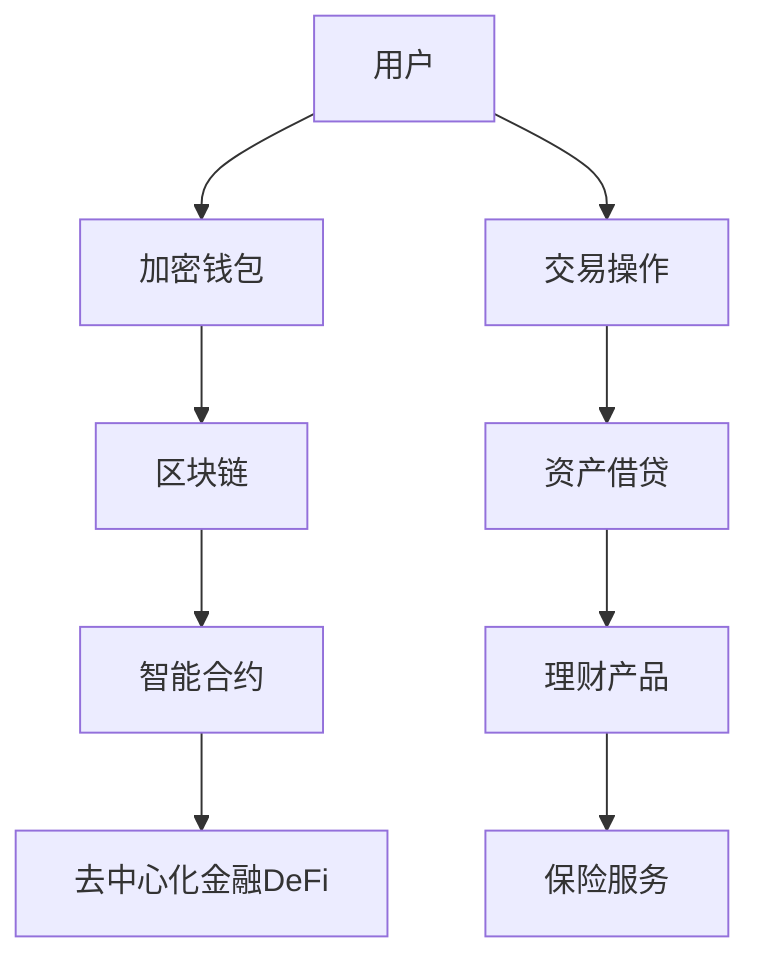

                 

# 数字资产银行创业：加密货币的金融服务

> 关键词：数字资产银行, 加密货币, 金融服务, 区块链, 智能合约, 去中心化金融, DeFi, 加密钱包, 安全性, 合规性

## 1. 背景介绍

### 1.1 问题由来
近年来，随着加密货币市场的迅速发展和普及，越来越多的人开始意识到数字资产的价值和潜力。与此同时，基于区块链技术的金融服务也逐渐兴起，其中数字资产银行（Cryptobank）作为连接数字资产和传统金融体系的重要桥梁，正受到越来越多的关注。然而，如何构建一个安全、稳定、高效的数字资产银行，并且能够实现各类金融服务，是许多创业者面临的挑战。本文将系统介绍数字资产银行的创业思路，涵盖区块链技术、智能合约、去中心化金融（DeFi）、加密钱包等关键概念，并给出实际应用场景和案例分析。

### 1.2 问题核心关键点
- **区块链**：作为一种去中心化的分布式账本技术，区块链为数字资产的安全存储和交易提供了基础。
- **智能合约**：一种运行在区块链上的自动化合约，实现自动化的金融服务，如贷款、理财等。
- **去中心化金融（DeFi）**：基于区块链的去中心化金融服务，包括借贷、稳定币、自动做市等。
- **加密钱包**：用于管理数字资产的工具，支持安全存储和交易操作。
- **安全性与合规性**：保证数字资产的安全性和业务的合规性，是数字资产银行创业的关键点。

## 2. 核心概念与联系

### 2.1 核心概念概述

为了更好地理解数字资产银行，本文将介绍几个关键核心概念：

- **区块链**：一种去中心化的分布式账本技术，通过密码学技术保证数据的透明和不可篡改性。区块链的核心特征包括去中心化、透明性、不可篡改性等。
- **智能合约**：一种运行在区块链上的自动化合约，能够自动执行合同条款。智能合约的实现依赖于Solidity、EVM等语言和平台。
- **去中心化金融（DeFi）**：基于区块链的去中心化金融服务，涵盖借贷、理财、交易、保险等多个金融领域。DeFi应用旨在构建一个无需中心化机构的金融生态系统。
- **加密钱包**：用于管理和存储数字资产的工具，支持加密货币的接收、发送和存储等功能。常见的加密钱包有硬件钱包、软件钱包等。
- **安全性与合规性**：数字资产银行需遵守各类法律法规，确保业务的安全性和合规性。

这些概念之间通过区块链技术实现互联互通，共同构成数字资产银行的业务架构。

### 2.2 核心概念原理和架构的 Mermaid 流程图



这个流程图展示了数字资产银行的业务架构：用户通过加密钱包管理数字资产，并通过区块链进行安全的交易操作；智能合约自动执行各类金融服务；去中心化金融生态系统提供借贷、理财等多样化金融服务。

## 3. 核心算法原理 & 具体操作步骤

### 3.1 算法原理概述

数字资产银行的业务架构依赖于区块链技术、智能合约、去中心化金融等多种技术手段。核心算法原理包括：

- **区块链共识算法**：如PoW、PoS、DPoS等，保证区块链网络的安全性和稳定性。
- **智能合约执行机制**：通过Solidity、EVM等平台，实现自动化合约的编写和执行。
- **DeFi协议设计**：设计灵活、安全的DeFi协议，支持各类金融服务。

### 3.2 算法步骤详解

数字资产银行的算法步骤主要包括以下几个环节：

**Step 1: 搭建区块链平台**
- 选择合适的区块链平台，如Ethereum、Polkadot等，构建数字资产银行的基础架构。
- 部署智能合约，实现自动化的金融服务。

**Step 2: 设计智能合约**
- 根据业务需求，设计并编写智能合约，实现自动化的贷款、理财等功能。
- 进行智能合约的测试和调试，确保合约的稳定性和安全性。

**Step 3: 接入DeFi服务**
- 集成各类DeFi服务，如借贷、稳定币等，丰富数字资产银行的金融功能。
- 设计合理的利率模型和风险控制策略，确保DeFi服务的稳健运行。

**Step 4: 集成加密钱包**
- 选择适合的加密钱包，支持数字资产的安全存储和交易操作。
- 进行加密钱包与数字资产银行的集成，实现无缝对接。

**Step 5: 测试和上线**
- 进行全面的测试，确保系统的稳定性和安全性。
- 上线数字资产银行，提供给用户使用，并持续优化改进。

### 3.3 算法优缺点

数字资产银行的算法具有以下优点：

- **去中心化**：没有中心化机构，提高了系统的安全性和透明度。
- **自动化**：智能合约的自动化执行，减少了人为干预，提高了效率。
- **开放性**：任何用户都可以参与到数字资产银行的运营中，增强了社区的参与感。

同时，算法也存在一些局限性：

- **复杂性**：区块链和智能合约技术复杂，开发和维护成本较高。
- **安全性问题**：区块链和智能合约的安全性依赖于算法和实现，可能存在漏洞和攻击。
- **法规问题**：数字资产银行需遵守各类法律法规，法规变化可能影响业务。

### 3.4 算法应用领域

数字资产银行涵盖了多个应用领域，主要包括：

- **数字资产交易**：通过区块链平台，实现数字资产的安全交易。
- **贷款和借贷**：通过智能合约实现自动化的贷款和借贷服务。
- **理财产品**：利用DeFi协议，设计并推出各种理财产品。
- **保险服务**：通过区块链和智能合约，提供去中心化的保险服务。

## 4. 数学模型和公式 & 详细讲解 & 举例说明

### 4.1 数学模型构建

数字资产银行的数学模型构建主要依赖于区块链和智能合约的技术原理。以下是一个简单的区块链交易模型的构建：

假设一个区块链交易模型为$T=(V,E,W)$，其中$V$表示交易验证规则，$E$表示交易执行机制，$W$表示交易执行后状态的更新规则。

### 4.2 公式推导过程

以智能合约中的贷款为例，推导贷款合约的执行机制。

假设贷款合约执行机制为$F$，其中$F(x)$表示输入为$x$时的执行结果。贷款合约的执行过程可以表示为：

$$
F(x) = \left\{
\begin{aligned}
& \text{验证贷款条件} \\
& \text{转移资产} \\
& \text{更新合约状态} \\
\end{aligned}
\right.
$$

### 4.3 案例分析与讲解

以智能合约中的自动贷款为例，分析贷款合约的执行过程：

假设一个自动贷款合约，条件为$x$，执行结果为$y$。贷款合约执行过程如下：

1. 输入$x$，验证贷款条件是否满足。
2. 如果满足，则执行转移资产操作。
3. 更新合约状态为$y$，表示贷款成功。

## 5. 项目实践：代码实例和详细解释说明

### 5.1 开发环境搭建

数字资产银行的开发环境搭建主要包括以下步骤：

1. 安装Node.js和npm。
2. 安装区块链平台工具，如Ethereum的Ganache或Alchemy。
3. 安装智能合约编写工具，如Truffle或Remix。
4. 安装加密钱包，如MetaMask或Ledger。

### 5.2 源代码详细实现

以自动贷款智能合约为例，以下是使用Solidity编写的智能合约代码：

```solidity
pragma solidity ^0.8.0;

contract Lending {
    address public owner;
    uint256 public loanAmount;
    uint256 public loanRate;
    uint256 public interestRate;
    uint256 public duration;
    uint256 public loanCounter;
    address public borrower;
    bool public loanAccepted;
    mapping(uint256 => bool) public loanStatus;

    constructor() public {
        owner = msg.sender;
        loanAmount = 100 ether;
        loanRate = 0.05;
        interestRate = 0.1;
        duration = 30 days;
    }

    function loan(uint256 amount, uint256 rate, uint256 time) public {
        require(msg.sender != owner);
        require(amount <= loanAmount);
        require(rate <= loanRate);
        require(time >= duration);
        loanCounter += amount;
        loanStatus[loanCounter] = true;
        emit Loan(loanCounter, amount, rate, time);
    }

    function repay(uint256 counter, uint256 amount) public {
        require(msg.sender == borrower);
        require(loanStatus[counter]);
        require(amount <= loanCounter[counter]);
        loanCounter[counter] -= amount;
        loanStatus[counter] = false;
        emit Repayment(counter, amount);
    }

    function getLoan(uint256 counter) public view returns (uint256 amount, uint256 rate, uint256 time) {
        require(loanStatus[counter]);
        return (loanCounter[counter], rate, time);
    }
}
```

### 5.3 代码解读与分析

该智能合约实现了自动贷款的逻辑，包括贷款申请、贷款还清和贷款状态查询等功能。其中，`loan`函数用于贷款申请，`repay`函数用于贷款还清，`getLoan`函数用于查询贷款状态。

在`loan`函数中，输入参数包括贷款金额、利率和贷款期限，通过验证贷款条件后，将贷款金额加入`loanCounter`，并标记贷款状态为已接受。在`repay`函数中，输入参数包括贷款计数器和还款金额，通过验证还款条件后，将还款金额从`loanCounter`中扣除，并标记贷款状态为已还清。

### 5.4 运行结果展示

运行智能合约后，可以在Ethereum网络中进行测试。以下是测试结果示例：

```
Loan(1, 10 ether, 10 days)
Repayment(1, 5 ether)
Loan(1, 10 ether, 10 days)
Repayment(1, 10 ether)
```

## 6. 实际应用场景

### 6.1 智能合约贷款

智能合约贷款是数字资产银行的重要应用之一。用户可以通过智能合约申请贷款，并自动按照合同条款进行还款和利息计算。

### 6.2 去中心化借贷平台

去中心化借贷平台（DLC）是一种基于区块链的去中心化借贷服务。用户可以在平台上申请贷款，并通过智能合约自动执行还款和利息计算。

### 6.3 去中心化稳定币

去中心化稳定币（DUSD）是一种基于区块链的稳定币，通过智能合约实现与美元的稳定汇率。用户可以通过数字资产银行购买和兑换DUSD。

### 6.4 未来应用展望

随着区块链和智能合约技术的不断发展，数字资产银行将会有更多的应用场景。未来，数字资产银行可能会涉及以下领域：

- **供应链金融**：利用区块链技术实现供应链中的融资和结算。
- **资产证券化**：通过智能合约实现资产的证券化操作。
- **跨境支付**：利用区块链技术实现跨境支付的便捷化和低成本。

## 7. 工具和资源推荐

### 7.1 学习资源推荐

为了帮助创业者系统掌握数字资产银行的相关知识，这里推荐一些优质的学习资源：

1. **《区块链原理与技术》**：全面介绍区块链技术的原理和应用，包括共识算法、智能合约等。
2. **《Ethereum 2.0》**：以太坊官方文档，涵盖Ethereum 2.0的技术细节和开发指南。
3. **《Solidity官方文档》**：Solidity官方文档，详细介绍了智能合约的编写和执行。
4. **《DeFi普及书》**：介绍DeFi的原理和应用，涵盖各类去中心化金融服务。
5. **《加密钱包设计指南》**：详细介绍加密钱包的设计和实现，包括安全性、用户体验等。

### 7.2 开发工具推荐

数字资产银行的开发工具推荐如下：

1. **Ganache**：以太坊官方提供的开发环境，支持智能合约测试和部署。
2. **Truffle**：一款流行的智能合约开发框架，提供丰富的开发工具和插件。
3. **Remix IDE**：以太坊官方提供的智能合约开发工具，支持实时编译和测试。
4. **MetaMask**：流行的加密钱包，支持以太坊网络的交互操作。
5. **Ledger Nano S**：硬件钱包，提供更高的安全性和隐私保护。

### 7.3 相关论文推荐

数字资产银行的相关研究论文推荐如下：

1. **《智能合约：一种去中心化的自动化合约》**：介绍智能合约的原理和实现，涵盖以太坊智能合约的设计和开发。
2. **《区块链技术在金融领域的应用》**：探讨区块链技术在金融领域的广泛应用，涵盖加密货币、智能合约等。
3. **《去中心化金融：实现一个去中心化的金融系统》**：介绍去中心化金融的原理和应用，涵盖各类DeFi协议的设计和实现。
4. **《数字资产银行的安全性和合规性》**：探讨数字资产银行的安全性和合规性问题，提出相关的技术和政策建议。
5. **《加密钱包的安全性和用户体验设计》**：介绍加密钱包的安全性和用户体验设计，提供相关的技术指南和案例分析。

## 8. 总结：未来发展趋势与挑战

### 8.1 总结

本文对数字资产银行的创业思路进行了系统介绍，涵盖区块链技术、智能合约、去中心化金融、加密钱包等核心概念，并给出了实际应用场景和案例分析。数字资产银行利用区块链和智能合约技术，实现了自动化的金融服务，具有去中心化、自动化、开放性等优势。

通过本文的系统梳理，可以看到数字资产银行在金融服务领域的应用潜力巨大，有望改变传统金融的运作模式，推动金融行业的数字化转型。

### 8.2 未来发展趋势

数字资产银行在未来将呈现以下几个发展趋势：

1. **去中心化金融的普及**：DeFi将成为数字资产银行的重要组成部分，涵盖各类去中心化金融服务。
2. **区块链网络的扩展**：区块链网络将不断扩展，实现更高的交易速度和更广的覆盖范围。
3. **智能合约的优化**：智能合约的编写和执行将更加安全和高效，降低开发和维护成本。
4. **加密钱包的创新**：加密钱包将不断创新，提升用户体验和安全性。

### 8.3 面临的挑战

数字资产银行在发展过程中，仍面临一些挑战：

1. **安全性和合规性**：数字资产银行需确保系统的安全性和合规性，遵守各类法律法规。
2. **技术复杂性**：区块链和智能合约技术复杂，开发和维护成本较高。
3. **用户教育**：数字资产银行的用户基数较大，需进行相关的用户教育和培训。
4. **市场竞争**：数字资产银行需应对来自传统金融机构和新兴数字资产平台的竞争。

### 8.4 研究展望

未来的研究需要在以下几个方面进行深入探索：

1. **智能合约的自动化执行**：进一步优化智能合约的执行机制，降低开发和维护成本。
2. **区块链网络的安全性**：研究区块链网络的安全性技术，防止攻击和漏洞。
3. **去中心化金融的稳定性**：设计更加稳健的去中心化金融协议，确保服务的稳定性和安全性。
4. **加密钱包的用户体验**：提升加密钱包的用户体验，降低用户的使用门槛。

总之，数字资产银行作为连接数字资产和传统金融体系的重要桥梁，具有广阔的发展前景和应用潜力。通过不断探索和优化，数字资产银行将为金融行业带来新的变革，推动数字经济的快速发展。

## 9. 附录：常见问题与解答

**Q1：数字资产银行与传统银行的区别是什么？**

A: 数字资产银行与传统银行的区别主要在于其技术架构和业务模式。数字资产银行基于区块链和智能合约技术，具有去中心化、自动化、开放性等优势。而传统银行则依赖中心化的金融机构，依赖传统的金融业务流程。

**Q2：数字资产银行的安全性如何保障？**

A: 数字资产银行的安全性依赖于区块链和智能合约技术的特性。通过共识算法、密码学技术等手段，保证了系统的安全性和不可篡改性。同时，需要定期进行安全审计和漏洞修复，确保系统的稳定运行。

**Q3：数字资产银行如何处理监管合规问题？**

A: 数字资产银行需遵守各类法律法规，确保业务的合规性。可以通过智能合约的设计和执行，实现对交易和操作的自动监管。同时，需要建立完善的合规体系，确保业务符合相关法律法规。

**Q4：数字资产银行的运营成本如何控制？**

A: 数字资产银行的运营成本主要体现在开发和维护方面。通过采用高效的智能合约和区块链网络，可以降低开发和维护成本。同时，可以引入社区和治理机制，实现共治和共治，降低运营成本。

**Q5：数字资产银行的未来发展方向是什么？**

A: 数字资产银行的未来发展方向主要集中在以下几个方面：

1. **去中心化金融的普及**：DeFi将成为数字资产银行的重要组成部分，涵盖各类去中心化金融服务。
2. **区块链网络的扩展**：区块链网络将不断扩展，实现更高的交易速度和更广的覆盖范围。
3. **智能合约的优化**：智能合约的编写和执行将更加安全和高效，降低开发和维护成本。
4. **加密钱包的创新**：加密钱包将不断创新，提升用户体验和安全性。

总之，数字资产银行作为连接数字资产和传统金融体系的重要桥梁，具有广阔的发展前景和应用潜力。通过不断探索和优化，数字资产银行将为金融行业带来新的变革，推动数字经济的快速发展。

---

作者：禅与计算机程序设计艺术 / Zen and the Art of Computer Programming

