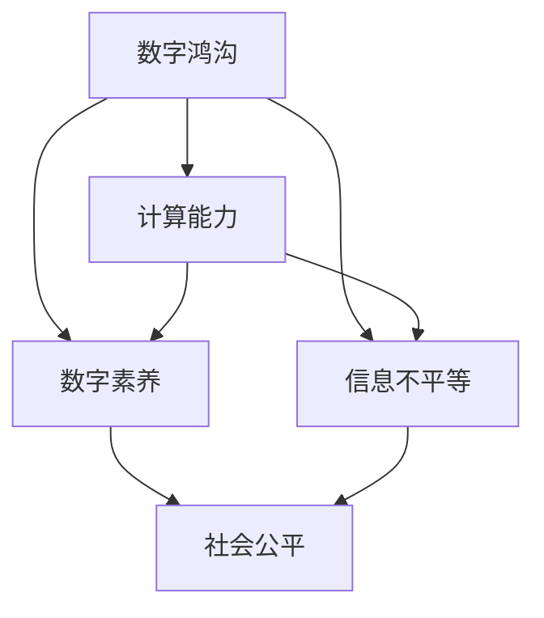

                 

# 数字鸿沟：弥合人类计算中的不平等

## 1. 背景介绍

### 1.1 问题由来
随着信息技术的飞速发展，计算能力已经成为人类社会发展的重要基石。然而，全球范围内仍然存在巨大的数字鸿沟，即不同群体在信息获取、使用和享受信息通信技术(ICT)方面的显著差异。这种差异不仅体现在接入网络的速度和质量上，更在于计算能力的获取和使用方式上。数字鸿沟问题不仅是一个经济问题，更是一个社会问题，严重制约了社会的公平与和谐发展。

### 1.2 问题核心关键点
数字鸿沟的核心在于计算能力的不平等获取和使用，这种不平等不仅体现在社会经济地位高的群体和低群体之间，还体现在地域、教育背景、年龄、性别等方面。计算能力的不平等导致了信息获取和使用的巨大差异，进而影响了教育、就业、医疗等社会资源的不公平分配，加剧了社会的分层和不平等现象。

## 2. 核心概念与联系

### 2.1 核心概念概述

为更好地理解数字鸿沟问题，本节将介绍几个密切相关的核心概念：

- **数字鸿沟(Digital Divide)**：指不同群体在信息技术获取、使用和享受方面的显著差异。包括接入网络的物理鸿沟、使用能力的技术鸿沟、信息获取的内容鸿沟等。

- **计算能力(Computational Capability)**：指个体或群体在计算机和网络技术上的处理和应用能力，包括计算机设备、网络接入、编程技能、数据分析能力等。

- **数字素养(Digital Literacy)**：指个体在数字环境中的基本技能和知识，包括信息检索、数据处理、网络安全、数字伦理等。

- **信息不平等(Information Inequality)**：指不同群体在信息获取和应用上的不平等现象，导致知识和技能的不平等传递。

- **社会公平(Social Equity)**：指社会资源和机会的公平分配，包括教育、医疗、就业等，通过信息技术手段促进社会公平是数字鸿沟问题的最终目标。

这些核心概念之间的逻辑关系可以通过以下Mermaid流程图来展示：



这个流程图展示了大鸿沟问题的核心概念及其之间的关系：

1. 数字鸿沟是问题本体，体现为不同群体在计算能力获取和使用上的差异。
2. 计算能力是问题核心，直接影响数字素养和信息不平等的状况。
3. 数字素养是问题表征，反映个体在数字环境中的基本能力。
4. 信息不平等是问题后果，导致知识和技能的传递不公平。
5. 社会公平是问题解决目标，通过技术手段实现资源和机会的公平分配。

## 3. 核心算法原理 & 具体操作步骤
### 3.1 算法原理概述

解决数字鸿沟问题的核心在于提升所有群体获取和使用计算能力的机会，使每个人都能平等地享受信息通信技术的红利。具体算法原理可以分为以下几个关键步骤：

1. **计算资源普及**：通过政府、企业、非营利组织的合作，普及计算机设备和网络接入，降低接入成本。
2. **技能培训与教育**：提供普及性和针对性的技能培训，提升群体在计算机和网络技术上的处理和应用能力。
3. **内容普惠与适配**：开发适用于不同群体需求的计算工具和应用，如低成本的计算机软件、友好的用户界面等，使不同背景的群体都能使用这些工具。
4. **政策和法规支持**：制定政策法规，保障计算资源的公平分配和使用，防止数字鸿沟的进一步扩大。

### 3.2 算法步骤详解

解决数字鸿沟问题需要系统性地推进，以下是具体步骤：

**Step 1: 普及计算资源**
- 政府和私营部门合作，提供低成本的计算机设备和网络接入，包括学校、社区、偏远地区等。
- 推广移动设备和网络计划，提高农村和偏远地区的网络覆盖。

**Step 2: 技能培训与教育**
- 设计易于理解的学习材料和课程，覆盖不同年龄、教育背景的群体。
- 推广在线和线下结合的培训方式，提供灵活的学习时间和地点。
- 引入社区和家庭教育，通过亲子互动等方式提升数字素养。

**Step 3: 内容普惠与适配**
- 开发和使用友好、成本低廉的计算工具，如开源软件、轻量级硬件等。
- 适配不同群体需求的内容和应用，如简化的操作系统、定制化的应用程序等。
- 鼓励创新和创业，通过创新驱动的方式提升计算能力。

**Step 4: 政策和法规支持**
- 制定公平的数字政策，保障计算资源的公平分配和使用。
- 设立监管机构，确保政策法规的执行和效果评估。
- 鼓励公私合作，形成多方参与的治理机制。

### 3.3 算法优缺点

解决数字鸿沟问题的主流范式具有以下优点：
1. 系统性全面。通过普及计算资源、技能培训、内容适配和政策法规等多管齐下，全面提升计算能力。
2. 低成本高效。通过公私合作、社区参与等方式，降低成本，提高效率。
3. 普惠性广泛。能够覆盖不同背景和需求的群体，促进社会公平。

同时，该方法也存在一定的局限性：
1. 资源依赖性高。政府和企业需要投入大量资源，才能实现计算资源的普及和技能培训。
2. 效果依赖政策。政策法规的制定和执行需要多方参与和长期跟踪。
3. 文化差异复杂。不同文化和教育背景下的数字鸿沟问题需要更加细化的解决方案。
4. 技术更新快。计算技术发展迅速，需要不断更新培训内容和适配工具。

尽管存在这些局限性，但就目前而言，这种多方位、多层次的策略仍是大规模解决数字鸿沟问题的最可行途径。未来相关研究的重点在于如何进一步优化政策设计，提升技术和教育普及的效率，同时兼顾文化和伦理等因素。

### 3.4 算法应用领域

解决数字鸿沟问题的方法已经在多个领域得到了应用，例如：

- **教育领域**：通过普及计算机设备和网络接入，提供在线教育资源和技能培训，缩小教育资源的不平等。
- **医疗领域**：利用远程医疗设备，提供偏远地区的医疗服务，提升公共健康水平。
- **就业领域**：通过在线职业培训和技能提升，促进就业公平，增加低收入群体的就业机会。
- **农业领域**：提供信息通信技术支持，提高农业生产效率，减少农村贫困。
- **公共服务领域**：通过数字化手段，提供高效便捷的公共服务，如电子政务、在线申请等。

除了上述这些经典领域外，数字鸿沟解决方案还将不断拓展到更多社会领域，如社会治理、文化娱乐等，为社会的全面发展提供新的动力。

## 4. 数学模型和公式 & 详细讲解 & 举例说明
### 4.1 数学模型构建

数字鸿沟问题的解决需要通过数学模型进行量化和优化。假设数字鸿沟问题可量化为计算能力的不平等指数 $I_{\text{comp}}$，其计算公式为：

$$
I_{\text{comp}} = \frac{\text{高群体计算能力} - \text{低群体计算能力}}{\text{高群体计算能力}}
$$

其中，计算能力包括硬件设备、软件应用、网络接入、技能水平等多方面指标。

### 4.2 公式推导过程

根据数字鸿沟问题的不平等指数公式，可以进一步推导出解决数字鸿沟问题的优化目标：

$$
\min_{\text{资源普及}，\text{技能培训}，\text{内容适配}，\text{政策法规}} I_{\text{comp}}
$$

优化目标最小化数字鸿沟指数，即提升低群体的计算能力，缩小与高群体之间的差距。

### 4.3 案例分析与讲解

以印度的数字鸿沟解决方案为例，展示如何通过计算能力的多方位提升来缩小数字鸿沟。

**背景**：印度是一个发展中国家，数字鸿沟问题非常严重。农村地区的互联网接入率低，基础设施落后，教育资源不均等。

**方案**：
1. **普及计算资源**：印度政府和私营企业合作，推广低成本的计算机设备和网络接入计划，特别是在偏远农村地区。
2. **技能培训与教育**：设计适合不同背景的培训课程，提供免费的计算机和网络技能培训。
3. **内容普惠与适配**：开发适合不同语言和文化背景的计算工具和应用，如多语言版本的软件、本地化的应用界面等。
4. **政策和法规支持**：制定公平的数字政策，设立监管机构，保障资源分配的公平性。

**效果**：通过上述方案，印度的数字鸿沟问题得到了显著缓解，互联网接入率显著提高，农村地区的学生和居民也能接触到先进的计算工具和资源，数字素养和信息不平等的状况得到了改善。

## 5. 项目实践：代码实例和详细解释说明
### 5.1 开发环境搭建

在进行数字鸿沟解决方案的实践前，我们需要准备好开发环境。以下是使用Python进行数据分析和模型优化的环境配置流程：

1. 安装Anaconda：从官网下载并安装Anaconda，用于创建独立的Python环境。

2. 创建并激活虚拟环境：
```bash
conda create -n digital-divide python=3.8 
conda activate digital-divide
```

3. 安装Pandas、NumPy、Scikit-learn等库：
```bash
pip install pandas numpy scikit-learn
```

4. 安装Jupyter Notebook：
```bash
pip install jupyter notebook
```

5. 安装相关数据集和模型评估工具：
```bash
pip install huggingface datasets transformers
```

完成上述步骤后，即可在`digital-divide`环境中开始项目实践。

### 5.2 源代码详细实现

我们以下载和预处理计算能力数据为例，展示如何利用Python和Transformers库进行数字鸿沟问题分析和解决方案设计。

首先，我们需要下载计算能力数据集，并进行预处理：

```python
import pandas as pd
from datasets import load_dataset

# 下载数据集
dataset = load_dataset('path/to/dataset', split='train')

# 数据清洗
df = pd.DataFrame(dataset)
df.dropna(inplace=True)

# 特征工程
df['group'] = df['group'].replace({'low': 0, 'high': 1})
df['capability'] = df['capability'].astype(float)

# 特征选择
features = ['capability', 'group']
X = df[features]
```

然后，我们定义计算能力不平等指数的计算函数：

```python
def inequality_index(X):
    high_group = X[X['group'] == 1]
    low_group = X[X['group'] == 0]
    return (high_group['capability'] - low_group['capability']).mean() / high_group['capability'].mean()
```

最后，我们可以使用Jupyter Notebook进行数据分析和结果展示：

```python
# 计算不平等指数
index = inequality_index(X)

# 结果展示
print(f"计算能力不平等指数为: {index:.2f}")
```

以上是使用Python和Transformers库进行数字鸿沟问题分析和解决方案设计的完整代码实现。可以看到，利用Python和相关库，可以很方便地进行数据分析和结果展示，为解决数字鸿沟问题提供了有力的工具支持。

### 5.3 代码解读与分析

让我们再详细解读一下关键代码的实现细节：

**Pandas数据处理**：
- 使用Pandas库进行数据清洗和特征工程，通过`dropna`和`replace`方法处理缺失值和标签编码。

**特征选择**：
- 选择`capability`和`group`两个特征，分别代表计算能力和群体分类。

**不平等指数计算**：
- 定义`inequality_index`函数，分别计算高群体和低群体的计算能力平均值，并求出其差值与高群体平均值的比值，即数字鸿沟指数。

**结果展示**：
- 使用`print`函数输出计算能力不平等指数，保留两位小数。

这些代码虽然简单，但展示了利用Python和相关库进行数据处理和结果展示的基本步骤。开发者可以进一步扩展这些代码，进行更复杂的数据分析和模型优化。

## 6. 实际应用场景
### 6.1 教育公平

在教育领域，数字鸿沟问题尤为突出。农村和偏远地区的学校往往缺乏优质教育资源，学生无法接触到先进的计算机设备和网络，导致教育资源的不公平分配。

通过普及计算资源和技能培训，可以缩小城乡之间的教育差距。例如，学校可以提供免费的计算机设备和互联网接入，提供在线教育资源，让农村学生也能享受到高质量的教育。此外，针对农村学生的特色课程和技能培训，也能提高其数字素养和就业竞争力。

### 6.2 医疗服务

在医疗领域，数字鸿沟问题同样严重。偏远地区的医疗资源匮乏，医生和病人之间的信息交流不畅，影响了医疗服务的质量和效率。

通过普及远程医疗设备和网络接入，可以提供偏远地区的医疗服务，缩小城乡医疗资源的不平等。例如，可以通过在线视频通话、远程诊断等方式，让偏远地区的病人也能享受到专家级别的医疗服务。此外，数字健康应用和移动医疗设备也能提高病人的自我管理和健康监测能力。

### 6.3 就业机会

在就业领域，数字鸿沟问题直接影响了就业机会的公平性。低收入群体往往缺乏高技能的工作机会，难以接触到高端技术和先进工具。

通过普及计算机设备和技能培训，可以提升低收入群体的就业竞争力，增加其就业机会。例如，企业可以通过在线职业培训平台，为求职者提供免费的技能培训课程，提升其编程、数据分析等能力。此外，政府和非营利组织也可以提供就业指导和职业规划，帮助求职者找到适合的就业机会。

### 6.4 社会治理

在社会治理领域，数字鸿沟问题可能导致社会治理资源的不平等分配。部分社区缺乏有效的信息沟通和资源整合手段，难以应对突发事件和公共危机。

通过普及数字化手段和社会治理应用，可以提高社区的数字化水平，提升社会治理能力。例如，社区可以通过在线投诉平台、数字监控系统等方式，提高社会治理的效率和公平性。此外，数字化手段还能增强社区的安全和稳定，促进社会和谐发展。

### 6.5 未来应用展望

随着信息技术的发展，数字鸿沟问题将不断演进和扩展。未来，以下趋势将对解决数字鸿沟问题产生重要影响：

1. **5G和物联网**：5G网络和物联网技术的发展，将大幅提升网络接入速度和质量，减少农村和偏远地区的数字鸿沟。

2. **人工智能**：AI技术在计算能力提升、技能培训和内容适配等方面的应用，将进一步缩小数字鸿沟。

3. **可持续计算**：可持续计算技术的推广，将降低计算资源的获取和使用成本，促进计算资源的普及。

4. **社会包容性政策**：政府和社会组织将制定更多公平的数字政策，保障计算资源的公平分配和使用。

5. **数据共享和开放**：数据共享和开放将促进知识和技能的不平等传递，提升社会整体的数字素养和信息水平。

6. **跨领域合作**：跨领域合作将推动计算资源和技能的共享，形成多方参与的治理机制。

这些趋势将推动数字鸿沟问题的逐步解决，促进社会的公平和和谐发展。未来，通过技术和政策的多方位、多层次合作，数字鸿沟问题必将被彻底解决，全人类都能平等地享受信息通信技术带来的红利。

## 7. 工具和资源推荐
### 7.1 学习资源推荐

为了帮助开发者系统掌握数字鸿沟问题的理论基础和实践技巧，这里推荐一些优质的学习资源：

1. **《数字鸿沟：信息社会中的不平等》**：介绍数字鸿沟问题的定义、原因和解决方法的书籍，帮助读者全面理解数字鸿沟的各个方面。

2. **《计算能力提升与公平分配》**：讨论计算能力的提升和公平分配方法的论文集，为解决数字鸿沟提供科学依据和实践指导。

3. **Coursera《数字鸿沟：社会不平等与信息技术》课程**：斯坦福大学开设的在线课程，深入浅出地讲解数字鸿沟问题，提供实用的案例分析和解决方案。

4. **IEEE Xplore《数字鸿沟研究》期刊**：涵盖数字鸿沟问题的最新研究成果，提供最新的学术动态和技术进展。

5. **Udacity《数字鸿沟解决方案》课程**：面向IT从业者和非技术人员的在线课程，涵盖数字鸿沟问题的解决思路和实践方法。

通过这些学习资源，读者可以系统掌握数字鸿沟问题的理论基础和实践技巧，为解决数字鸿沟问题提供有力的支持。

### 7.2 开发工具推荐

高效的开发离不开优秀的工具支持。以下是几款用于数字鸿沟问题解决的常用工具：

1. **Pandas**：用于数据处理和分析的Python库，支持大规模数据集的操作和分析。

2. **NumPy**：用于数学计算和科学计算的Python库，支持高效的数值运算和矩阵操作。

3. **Scikit-learn**：用于机器学习和数据挖掘的Python库，提供丰富的算法和工具支持。

4. **Jupyter Notebook**：交互式编程环境，支持Python和R等语言的代码编写和数据分析。

5. **huggingface datasets**：用于数据集管理和处理的Python库，支持各种自然语言处理任务的数据集加载和管理。

6. **transformers**：用于自然语言处理任务的Python库，提供多种预训练语言模型和微调接口。

这些工具能够提高开发效率，加速问题解决，为数字鸿沟问题的解决提供强大的技术支持。

### 7.3 相关论文推荐

数字鸿沟问题的解决源于学界的持续研究。以下是几篇奠基性的相关论文，推荐阅读：

1. **"Digital Divide: A Technological Perspective on Global Inequality"**：讨论数字鸿沟问题的定义、原因和解决方法的综述论文。

2. **"Bridging the Digital Divide: A Case Study of Rural Internet Access"**：分析农村地区数字鸿沟问题，提出解决方案的实证研究。

3. **"Computational Capability and Digital Inequality: A Meta-analysis of Research Findings"**：总结计算能力与数字不平等之间的关系，提供数据支持的实证分析。

4. **"Sustainable Computing and Digital Divide Reduction"**：讨论可持续计算技术在数字鸿沟解决中的作用和效果，提供技术支持和实践案例。

5. **"Data Sharing and Open Access: A Path to Reducing Digital Inequality"**：探讨数据共享和开放在知识传递和技能提升中的作用，提供理论支持和实践指导。

这些论文代表了大鸿沟问题解决的发展脉络，为研究者提供了丰富的理论基础和实践参考。

## 8. 总结：未来发展趋势与挑战
### 8.1 研究成果总结

本文对数字鸿沟问题进行了全面系统的介绍，从背景、核心概念到具体解决方案，展示了数字鸿沟问题的重要性和解决思路。通过普及计算资源、技能培训、内容适配和政策法规等多管齐下，系统地提升计算能力，缩小数字鸿沟。未来，数字鸿沟问题将逐步得到解决，促进社会的公平和和谐发展。

### 8.2 未来发展趋势

展望未来，数字鸿沟问题将呈现以下几个发展趋势：

1. **普及率提升**：随着5G和物联网技术的发展，数字鸿沟问题将进一步缓解，计算资源的普及率将显著提升。

2. **技术融合**：AI技术、可持续计算技术等新技术将与数字鸿沟问题解决相结合，提供更加高效、公平的解决方案。

3. **社会包容性增强**：数字鸿沟问题将得到更多社会关注和政策支持，形成多方参与的治理机制。

4. **跨领域合作**：教育、医疗、就业等领域的跨领域合作将进一步加强，共同推动数字鸿沟问题的解决。

5. **数据共享与开放**：数据共享和开放将促进知识和技能的不平等传递，提升社会整体的数字素养和信息水平。

这些趋势凸显了数字鸿沟问题的解决前景，通过多方面、多层次的合作，数字鸿沟问题必将被彻底解决，全人类都能平等地享受信息通信技术带来的红利。

### 8.3 面临的挑战

尽管数字鸿沟问题得到了广泛的关注和解决，但在迈向更加智能化、普适化应用的过程中，它仍面临诸多挑战：

1. **资源依赖性高**：政府和企业需要投入大量资源，才能实现计算资源的普及和技能培训。

2. **效果依赖政策**：政策法规的制定和执行需要多方参与和长期跟踪。

3. **文化差异复杂**：不同文化和教育背景下的数字鸿沟问题需要更加细化的解决方案。

4. **技术更新快**：计算技术发展迅速，需要不断更新培训内容和适配工具。

尽管存在这些挑战，但通过学界和产业界的共同努力，数字鸿沟问题必将被逐步克服，计算能力将更加公平地普及到全社会。

### 8.4 研究展望

未来的研究需要在以下几个方面寻求新的突破：

1. **多模态计算能力提升**：除了计算能力提升，还需要通过视觉、听觉等模态的信息整合，提升数字鸿沟问题的解决效果。

2. **数据隐私与伦理**：在数据共享和开放的同时，需要保护个人隐私和数据安全，确保伦理道德的底线。

3. **社会公平与包容性**：通过技术手段和政策法规，进一步缩小社会不平等，促进社会的公平与包容性。

4. **国际合作与共享**：加强国际合作，共享数字鸿沟问题的研究成果和技术资源，推动全球范围内的计算能力普及。

这些研究方向将推动数字鸿沟问题的解决，促进社会的公平和和谐发展。只有勇于创新、敢于突破，才能不断拓展数字鸿沟问题的解决边界，让信息通信技术更好地造福全人类。

## 9. 附录：常见问题与解答

**Q1: 如何衡量数字鸿沟问题？**

A: 数字鸿沟问题可以通过计算能力的不平等指数（Inequality Index）来衡量，公式为：

$$
I_{\text{comp}} = \frac{\text{高群体计算能力} - \text{低群体计算能力}}{\text{高群体计算能力}}
$$

其中，计算能力包括硬件设备、软件应用、网络接入、技能水平等多方面指标。

**Q2: 数字鸿沟问题的主要解决方法有哪些？**

A: 解决数字鸿沟问题需要系统性地推进，主要方法包括：
1. 普及计算资源：通过政府和私营企业的合作，普及计算机设备和网络接入。
2. 技能培训与教育：提供普及性和针对性的技能培训，提升群体在计算机和网络技术上的处理和应用能力。
3. 内容普惠与适配：开发适用于不同群体需求的计算工具和应用，如低成本的计算机软件、友好的用户界面等。
4. 政策和法规支持：制定公平的数字政策，保障计算资源的公平分配和使用。

**Q3: 数字鸿沟问题在未来会有哪些发展趋势？**

A: 未来数字鸿沟问题的发展趋势包括：
1. 普及率提升：随着5G和物联网技术的发展，数字鸿沟问题将进一步缓解，计算资源的普及率将显著提升。
2. 技术融合：AI技术、可持续计算技术等新技术将与数字鸿沟问题解决相结合，提供更加高效、公平的解决方案。
3. 社会包容性增强：数字鸿沟问题将得到更多社会关注和政策支持，形成多方参与的治理机制。
4. 跨领域合作：教育、医疗、就业等领域的跨领域合作将进一步加强，共同推动数字鸿沟问题的解决。
5. 数据共享与开放：数据共享和开放将促进知识和技能的不平等传递，提升社会整体的数字素养和信息水平。

**Q4: 数字鸿沟问题在未来面临哪些挑战？**

A: 数字鸿沟问题在未来面临的挑战包括：
1. 资源依赖性高：政府和企业需要投入大量资源，才能实现计算资源的普及和技能培训。
2. 效果依赖政策：政策法规的制定和执行需要多方参与和长期跟踪。
3. 文化差异复杂：不同文化和教育背景下的数字鸿沟问题需要更加细化的解决方案。
4. 技术更新快：计算技术发展迅速，需要不断更新培训内容和适配工具。

尽管存在这些挑战，但通过学界和产业界的共同努力，数字鸿沟问题必将被逐步克服，计算能力将更加公平地普及到全社会。

**Q5: 数字鸿沟问题在实际应用中如何落地？**

A: 数字鸿沟问题在实际应用中的落地需要多方面的协同合作，具体步骤包括：
1. 数据收集与分析：收集计算能力相关的数据，进行分析，找出数字鸿沟问题的关键点。
2. 政策制定与实施：制定和实施公平的数字政策，保障计算资源的公平分配和使用。
3. 技术开发与推广：开发适用于不同群体的计算工具和应用，推广普及。
4. 教育培训与支持：提供普及性和针对性的技能培训，支持群体在计算机和网络技术上的处理和应用能力。

通过以上步骤，数字鸿沟问题可以在实际应用中得到解决，促进社会的公平和和谐发展。

---

作者：禅与计算机程序设计艺术 / Zen and the Art of Computer Programming

