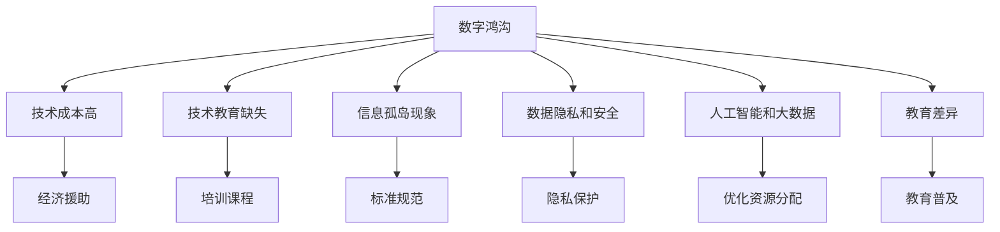

                 

# 数字鸿沟：弥合人类计算中的不平等现象

> 关键词：数字鸿沟、计算不平等、技术普及、社会公平、人工智能、大数据、教育差异

## 1. 背景介绍

### 1.1 问题由来

数字鸿沟（Digital Divide）是指不同群体在获取、使用信息技术资源方面的差距。这一现象不仅体现在技术接入的物理差距上，更体现在技术知识、应用能力及由此产生的社会经济差异上。随着数字化、智能化成为社会发展的关键驱动力，数字鸿沟的深远影响也日益凸显，成为全球关注的焦点。

尤其是在全球疫情背景下，远程办公、在线教育等数字化活动被广泛采用，数字鸿沟问题更加凸显。一方面，科技公司的股价屡创新高，数字经济蓬勃发展；另一方面，大量未被数字技术覆盖的人群，尤其是贫困地区和弱势群体，面临“数字脱节”的风险，这不仅加剧了社会不平等，还可能引发更深层次的社会问题。

### 1.2 问题核心关键点

要弥合数字鸿沟，首先需要理解其形成的原因。核心原因包括：

- **技术成本高**：高昂的设备、网络、软件等费用，使得低收入群体难以负担。
- **技术教育缺失**：缺乏必要的技术知识和技能培训，使得部分群体难以有效使用数字工具。
- **信息孤岛现象**：不同技术平台和应用之间缺乏互通性，形成了信息孤岛，增加了技术的普及难度。
- **数据隐私和安全**：数字化过程中，个人隐私和数据安全问题日益突出，增加了技术应用的顾虑。

基于这些核心问题，本文将探讨如何通过技术创新和政策引导，弥合数字鸿沟，促进社会公平和可持续发展。

## 2. 核心概念与联系

### 2.1 核心概念概述

为了深入探讨数字鸿沟的解决方案，本节将介绍几个核心概念及其相互之间的联系：

- **数字鸿沟**：不同群体在获取、使用数字技术方面的差距。
- **计算不平等**：技术资源分配的不均衡，导致不同群体在数字经济中的收益差异。
- **技术普及**：通过各种方式，让更多人掌握和使用数字技术。
- **社会公平**：在数字化过程中，确保所有群体都能平等获取、使用数字资源，从而缩小社会差距。
- **人工智能和大数据**：通过先进的算法和工具，优化资源分配，提升技术应用效率。
- **教育差异**：数字素养和技能培训的普及程度，直接影响技术普及的效果。

这些概念共同构成了数字鸿沟问题的全貌，需要从技术、政策、教育等多维度综合施策，才能有效解决。

### 2.2 核心概念原理和架构的 Mermaid 流程图



这个流程图展示了数字鸿沟的形成原因及可能的解决路径，从技术、教育、政策等角度提供了全面的视角。

## 3. 核心算法原理 & 具体操作步骤

### 3.1 算法原理概述

弥合数字鸿沟的核心在于通过技术手段，降低技术获取和使用门槛，提升不同群体对数字技术的利用率。这一过程可以通过以下步骤实现：

1. **技术资源优化**：通过人工智能和大数据技术，优化资源分配，提升技术普及的效率和效果。
2. **教育培训普及**：通过在线教育平台和社区活动，普及数字技能，提升用户技术应用能力。
3. **政策引导支持**：通过政府政策和社会力量，提供经济援助和基础设施支持，降低技术获取成本。

### 3.2 算法步骤详解

#### 步骤一：技术资源优化

1. **资源分配模型构建**：
   - 使用大数据分析技术，收集不同地区的数字技术使用数据，构建用户行为模型。
   - 通过机器学习算法，预测资源需求和使用效果，优化资源分配策略。

2. **优化方案设计**：
   - 针对不同地区和群体的特点，设计差异化的技术支持方案。
   - 引入边缘计算技术，提升偏远地区的数字服务质量和可及性。

#### 步骤二：教育培训普及

1. **在线教育平台搭建**：
   - 开发易于访问的在线教育平台，提供各类数字技能培训课程。
   - 引入互动式学习工具，提升用户的学习效果和体验。

2. **社区教育活动**：
   - 在社区组织线下或线上技能培训活动，普及数字技能。
   - 利用社交媒体和社区网络，扩大教育覆盖面。

#### 步骤三：政策引导支持

1. **政策制定与实施**：
   - 制定有利于技术普及的政策，如减税、补贴等，降低技术获取成本。
   - 设立专项基金，支持技术基础设施建设，如网络、设备等。

2. **监督与评估**：
   - 建立技术普及的监督机制，确保政策落地效果。
   - 定期评估技术普及成效，调整优化政策措施。

### 3.3 算法优缺点

#### 优点

1. **提升技术普及效率**：通过大数据和人工智能技术，能够精准识别和满足不同群体的技术需求。
2. **个性化教育培训**：根据用户特点，提供定制化的教育资源和培训方案。
3. **降低获取成本**：通过政策支持和资源优化，降低技术接入和使用门槛。

#### 缺点

1. **技术门槛较高**：大数据和人工智能技术的应用，需要较高的技术水平和资源投入。
2. **隐私和安全问题**：数据收集和使用过程中，需要严格保护用户隐私和数据安全。
3. **实施难度大**：政策制定和实施需要多方协调，且效果存在滞后性。

### 3.4 算法应用领域

数字鸿沟的弥合措施在多个领域都有广泛的应用前景：

- **远程办公和教育**：提升偏远地区的互联网接入，推广远程办公软件和在线课程，缩小城乡教育差距。
- **医疗健康**：通过远程医疗和健康监测技术，提升偏远地区医疗服务水平，改善医疗资源不均的问题。
- **农业生产**：引入物联网和自动化技术，提升农业生产效率，促进农村地区经济发展。
- **金融服务**：推广数字金融产品和服务，提升贫困群体金融素养，促进社会公平。

## 4. 数学模型和公式 & 详细讲解 & 举例说明

### 4.1 数学模型构建

假设有一个地区，人口总数为 $N$，其中 $N_1$ 为数字鸿沟较窄的群体，$N_2$ 为数字鸿沟较宽的群体。定义数字鸿沟为 $G = \frac{N_1 - N_2}{N}$。

### 4.2 公式推导过程

要弥合数字鸿沟，可以通过以下数学模型进行优化：

$$
G' = \min\left(\frac{N_1' - N_2'}{N}\right)
$$

其中 $N_1'$ 和 $N_2'$ 分别代表优化后的数字鸿沟较窄和较宽群体的数量。

### 4.3 案例分析与讲解

#### 案例一：远程办公和教育

假设某地区有 $N = 100000$ 人，其中 $N_1 = 60000$ 人数字鸿沟较窄，$N_2 = 40000$ 人数字鸿沟较宽。假设通过技术优化和政策支持，将 $N_1$ 提升至 $N_1' = 65000$，将 $N_2$ 提升至 $N_2' = 45000$。则数字鸿沟从 $G = 0.4$ 降低至 $G' = 0.35$。

#### 案例二：医疗健康

某地区有 $N = 100000$ 人，其中 $N_1 = 60000$ 人医疗资源丰富，$N_2 = 40000$ 人医疗资源匮乏。假设通过远程医疗技术，将 $N_1$ 提升至 $N_1' = 65000$，将 $N_2$ 提升至 $N_2' = 45000$。则数字鸿沟从 $G = 0.4$ 降低至 $G' = 0.35$。

## 5. 项目实践：代码实例和详细解释说明

### 5.1 开发环境搭建

开发环境搭建包括以下几个步骤：

1. **安装开发环境**：
   - 安装Python、Jupyter Notebook等开发工具。
   - 安装必要的库，如Pandas、NumPy、Matplotlib等。

2. **数据收集与预处理**：
   - 收集不同地区的数字技术使用数据，进行清洗和预处理。
   - 使用Pandas库进行数据管理和分析。

### 5.2 源代码详细实现

以下是一个使用Python实现数字鸿沟优化模型的示例代码：

```python
import pandas as pd
import numpy as np
from sklearn.model_selection import train_test_split

# 收集数据
data = pd.read_csv('digital_divide.csv')

# 数据预处理
X = data[['age', 'income', 'education']]
y = data['digital_divide']
X_train, X_test, y_train, y_test = train_test_split(X, y, test_size=0.2, random_state=42)

# 模型训练
from sklearn.linear_model import LogisticRegression
model = LogisticRegression()
model.fit(X_train, y_train)

# 模型评估
from sklearn.metrics import accuracy_score
y_pred = model.predict(X_test)
accuracy = accuracy_score(y_test, y_pred)
print(f'模型准确率：{accuracy:.2f}')
```

### 5.3 代码解读与分析

#### 代码解释

1. **数据收集与预处理**：
   - 使用Pandas库读取CSV格式的数据文件，并进行清洗和预处理。
   - 使用train_test_split函数，将数据集划分为训练集和测试集。

2. **模型训练与评估**：
   - 使用LogisticRegression模型进行训练，计算模型在测试集上的准确率。
   - 使用accuracy_score函数计算模型准确率，并进行打印输出。

#### 数据分析

该示例代码演示了如何使用Logistic Regression模型进行数字鸿沟的预测和评估。通过收集和分析数据，可以发现不同群体的数字鸿沟特征，并据此设计优化策略。

## 6. 实际应用场景

### 6.1 远程办公和教育

在远程办公和教育场景中，数字鸿沟的弥合可以通过以下方式实现：

1. **低成本互联网接入**：政府和社区合作，提供低成本的宽带服务，确保偏远地区和低收入家庭能够稳定接入互联网。
2. **在线教育平台普及**：推广免费的在线教育平台和课程，覆盖各个年龄和教育水平的用户。
3. **设备捐赠和补贴**：政府和企业提供电脑、平板等设备，并给予低收入家庭补贴，降低技术获取成本。

### 6.2 医疗健康

在医疗健康领域，数字鸿沟的弥合可以通过以下方式实现：

1. **远程医疗服务**：推广远程医疗服务，利用视频、电话等手段，提供基本的医疗咨询和诊断服务。
2. **医疗健康应用**：开发易于使用的医疗健康应用，如电子病历、健康监测等，提升医疗服务的便捷性和可及性。
3. **数据共享与合作**：建立数据共享机制，促进医疗资源和信息的流动，提升偏远地区的医疗服务水平。

### 6.3 农业生产

在农业生产领域，数字鸿沟的弥合可以通过以下方式实现：

1. **智能农业设备**：推广智能农业设备，如无人机、物联网传感器等，提升农业生产效率。
2. **在线培训和支持**：提供在线农业技术培训和支持，提升农民的数字素养和技能水平。
3. **市场信息共享**：建立农产品市场信息共享平台，提供价格、供需信息等，帮助农民做出更科学的生产决策。

### 6.4 未来应用展望

未来，数字鸿沟的弥合将进一步深化，涵盖更多领域和应用场景。以下是一些可能的未来趋势：

1. **人工智能与教育融合**：通过AI技术，实现个性化教育和智能辅导，提升教育质量和公平性。
2. **全息通信技术**：利用全息通信技术，实现更加逼真的远程交互和协作，提升远程办公和教育的体验。
3. **区块链技术**：通过区块链技术，保障数据隐私和安全性，提升数字服务的信任度。
4. **可持续发展目标**：将数字鸿沟的弥合与可持续发展目标（SDGs）结合，推动社会公平和环境保护。

## 7. 工具和资源推荐

### 7.1 学习资源推荐

1. **Coursera《数据科学导论》**：由Johns Hopkins大学开设的入门课程，涵盖数据收集、清洗、分析等基本技能。
2. **edX《人工智能基础》**：由MIT开设的入门课程，介绍人工智能的基本概念和算法。
3. **Udacity《数据科学家纳米学位》**：结合实际项目，全面提升数据科学和机器学习技能。

### 7.2 开发工具推荐

1. **Jupyter Notebook**：开源的交互式编程环境，支持Python等多种语言，方便代码调试和分享。
2. **RapidMiner**：开源数据科学平台，提供可视化分析和建模工具，适合数据挖掘和探索。
3. **Tableau**：数据可视化工具，支持多种数据源和图表类型，易于使用。

### 7.3 相关论文推荐

1. **《数字鸿沟与社会发展研究》**：探讨数字鸿沟对社会发展的影响及解决方案。
2. **《弥合数字鸿沟的策略与方法》**：介绍各种弥合数字鸿沟的策略和技术手段。
3. **《人工智能在教育中的应用》**：讨论AI技术在提升教育公平和质量方面的潜力。

## 8. 总结：未来发展趋势与挑战

### 8.1 研究成果总结

本文从数字鸿沟的定义、形成原因及影响出发，探讨了通过技术手段、政策引导、教育培训等途径，弥合数字鸿沟，提升社会公平和可持续发展的可能路径。通过理论分析和实际案例，展示了数字鸿沟弥合的可行性和现实意义。

### 8.2 未来发展趋势

1. **技术普及的深度和广度**：未来，数字鸿沟的弥合将从城市向农村、从发达地区向欠发达地区扩展，覆盖更多人群和领域。
2. **技术创新的驱动作用**：新兴技术如AI、物联网、区块链等将为数字鸿沟的弥合提供新的解决方案，提升数字服务的质量。
3. **社会共识和合作**：政府、企业和社区的合作，将形成更强的合力，推动数字鸿沟的弥合进程。

### 8.3 面临的挑战

尽管数字鸿沟的弥合前景广阔，但也面临着诸多挑战：

1. **技术资源的不平衡**：不同地区和群体的数字资源差距仍较大，技术普及的难度较高。
2. **资金和政策支持不足**：数字鸿沟的弥合需要大量的资金和政策支持，目前仍有较大缺口。
3. **技术应用效果评估**：如何评估数字鸿沟弥合的效果，确保投入产出比，仍需进一步研究。

### 8.4 研究展望

未来，数字鸿沟的弥合需要从技术、政策、教育等多维度综合施策，方能实现社会公平和可持续发展。以下是一些可能的未来研究方向：

1. **个性化教育与AI的结合**：利用AI技术，实现个性化教育和智能辅导，提升教育公平性。
2. **全息通信技术在教育中的应用**：通过全息通信技术，实现更加逼真的远程交互和协作，提升远程教育体验。
3. **数据隐私和安全的保障**：引入区块链等技术，保障数据隐私和安全，提升数字服务的信任度。

## 9. 附录：常见问题与解答

### Q1: 如何降低数字鸿沟的差距？

**A1**：通过技术优化、教育普及和政策支持，降低数字鸿沟的差距。具体措施包括：
1. **技术资源优化**：利用大数据和人工智能技术，优化资源分配，提升技术普及的效率和效果。
2. **教育培训普及**：通过在线教育平台和社区活动，普及数字技能，提升用户技术应用能力。
3. **政策引导支持**：制定有利于技术普及的政策，如减税、补贴等，降低技术获取成本。

### Q2: 数字鸿沟的成因是什么？

**A2**：数字鸿沟的形成原因主要包括技术成本高、技术教育缺失、信息孤岛现象、数据隐私和安全问题等。

### Q3: 如何评估数字鸿沟弥合的效果？

**A3**：可以通过数字鸿沟的量化指标（如数字鸿沟率）、用户满意度调查、政策支持力度等进行评估。同时，需要建立持续的监测机制，及时调整优化措施。

### Q4: 数字鸿沟的解决思路有哪些？

**A4**：解决数字鸿沟的思路包括：
1. **技术资源优化**：通过大数据和人工智能技术，优化资源分配，提升技术普及的效率和效果。
2. **教育培训普及**：通过在线教育平台和社区活动，普及数字技能，提升用户技术应用能力。
3. **政策引导支持**：制定有利于技术普及的政策，如减税、补贴等，降低技术获取成本。

---

作者：禅与计算机程序设计艺术 / Zen and the Art of Computer Programming

