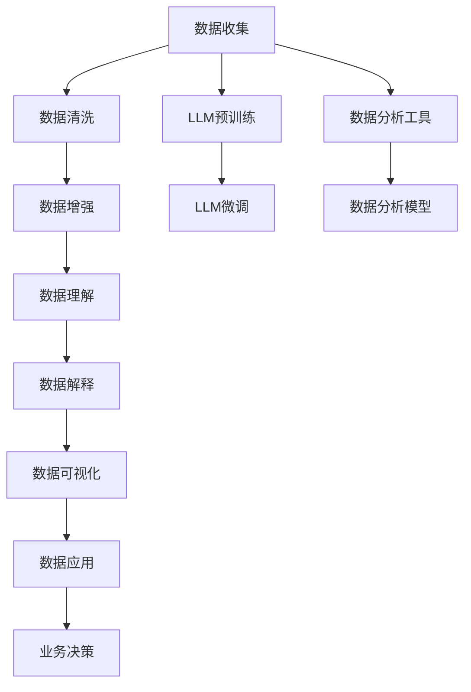

                 

# 数据分析师：LLM 增强的数据洞察力

> 关键词：大语言模型(LLM), 数据洞察力, 自然语言处理(NLP), 数据分析, 数据增强, 数据清洗, 数据理解, 数据可视化

## 1. 背景介绍

### 1.1 问题由来

随着大数据时代的到来，数据正在以前所未有的速度和规模产生，各行各业都需要从海量数据中提炼出有价值的洞察，以支持决策和创新。然而，尽管数据获取变得更加容易，但如何高效、准确地分析数据，并从中提取有意义的洞见，仍然是一个巨大的挑战。传统的统计分析和机器学习方法虽然有效，但在处理非结构化数据（如文本、图像等）方面，效果往往不尽如人意。

与此同时，大语言模型（Large Language Models, LLMs）在自然语言处理（NLP）领域取得了显著突破，成为当前人工智能研究的前沿方向之一。LLMs 能够理解和生成人类语言，通过预训练和微调，可以在各种NLP任务中达到甚至超越人类的表现水平。这些模型的潜力不仅限于文本生成和理解，还可以通过与数据分析结合，显著提升数据洞察力。

### 1.2 问题核心关键点

LLMs 与数据分析的结合，关键在于如何利用大模型的语言理解能力，去解析和理解数据，并将其转换为可操作的知识。具体而言，LLMs 能够：

- **数据清洗和预处理**：识别和纠正数据中的噪声和错误，提升数据质量。
- **数据理解与特征提取**：从文本、图像等多模态数据中自动提取有用的特征，为后续分析提供支持。
- **数据解释与可视化**：将复杂的数据分析结果以易于理解的文本和图形形式呈现，支持用户进行直观的洞察。
- **数据增强与生成**：通过生成新的数据样本，丰富数据集，提高模型的泛化能力。

### 1.3 问题研究意义

LLMs 增强的数据洞察力，不仅能够提升数据分析的效率和准确性，还能开辟更多创新的应用场景。具体而言：

- **降低分析成本**：自动化处理大量非结构化数据，减少人工分析的复杂性和时间成本。
- **提升分析质量**：通过深度学习模型的语义理解能力，捕捉数据中的复杂关联和模式，提高分析结果的准确性。
- **扩展应用边界**：支持更广泛的数据类型和结构，如多模态数据的联合分析，拓展数据分析的应用场景。
- **推动决策智能化**：将数据分析结果以易于理解的形式呈现，帮助决策者进行更加精准和快速的决策。

## 2. 核心概念与联系

### 2.1 核心概念概述

要深入理解 LLMs 在数据分析中的应用，首先需要了解一些核心概念：

- **大语言模型(LLM)**：如GPT、BERT等，能够理解和生成自然语言，通过预训练和微调，可用于各种NLP任务。
- **自然语言处理(NLP)**：研究计算机如何处理、理解、生成人类语言的技术领域。
- **数据分析**：从数据中提取有用信息和洞察，支持决策和业务创新的过程。
- **数据增强**：通过生成新的数据样本，丰富数据集，提高模型的泛化能力。
- **数据清洗**：识别和纠正数据中的噪声和错误，提升数据质量。
- **数据可视化**：将数据以图形化的形式展示，支持直观洞察。

### 2.2 核心概念原理和架构的 Mermaid 流程图



这个流程图展示了 LLMs 在数据分析过程中的作用和关键环节。首先，从数据收集开始，经过数据清洗和预处理，再通过数据增强和理解，生成易于分析的洞察，最终以可视化的形式呈现，支持业务决策。其中，LLMs 作为核心工具，贯穿了数据理解、解释和可视化的全过程。

## 3. 核心算法原理 & 具体操作步骤

### 3.1 算法原理概述

LLMs 增强的数据洞察力，主要是通过以下两个关键步骤实现的：

1. **数据清洗与预处理**：利用 LLMs 的预训练能力，自动识别和纠正数据中的错误和噪声。
2. **数据理解与特征提取**：通过微调后的 LLMs，从文本、图像等多模态数据中提取有用的特征，支持后续的数据分析和模型训练。

### 3.2 算法步骤详解

#### 数据清洗与预处理

1. **文本数据预处理**：
   - **分词和标准化**：使用 LLMs 的分词器，将原始文本分割成单词或子词，并进行标准化处理。
   - **噪声过滤**：识别并移除数据中的错误、缺失值、重复值等噪声。
   - **格式统一**：将不同来源的数据格式统一，便于后续处理。

2. **图像数据预处理**：
   - **图像标注**：利用 LLMs 的图像理解能力，自动标注图像内容。
   - **特征提取**：使用预训练的视觉模型（如ResNet、VGG等）提取图像特征。

#### 数据理解与特征提取

1. **特征提取与向量表示**：
   - **文本特征提取**：使用微调后的 LLMs 提取文本的语义向量表示。
   - **图像特征提取**：通过预训练的视觉模型，提取图像的特征向量。

2. **多模态融合**：
   - **文本与图像融合**：将文本特征和图像特征进行拼接或融合，形成多模态向量表示。
   - **融合方法**：包括简单拼接、注意力机制、融合网络等。

#### 数据解释与可视化

1. **数据解释**：
   - **关键信息提取**：使用 LLMs 从文本或图像中提取关键信息，如实体、情感、事件等。
   - **关联分析**：分析不同数据源之间的关联，识别潜在的模式和趋势。

2. **数据可视化**：
   - **文本可视化**：使用自然语言生成模型（NLG）生成可视化摘要或报告。
   - **图像可视化**：通过图像生成和增强技术，将分析结果以图形化形式呈现。

### 3.3 算法优缺点

#### 优点

- **高效性**：利用 LLMs 的强大语言理解能力，可以自动化处理大量数据，减少人工干预。
- **准确性**：通过预训练和微调，LLMs 能够捕捉数据中的复杂关联和模式，提高分析的准确性。
- **灵活性**：适用于多种数据类型和结构，支持多模态数据的联合分析。

#### 缺点

- **数据依赖**：LLMs 的效果很大程度上依赖于训练数据的质量和多样性，数据不足可能导致效果不佳。
- **计算资源要求高**：预训练和微调 LLMs 需要大量的计算资源和存储资源，对硬件要求较高。
- **模型解释性差**：LLMs 通常被视为"黑盒"模型，其决策过程难以解释。

### 3.4 算法应用领域

LLMs 在数据分析中的应用广泛，涵盖金融、医疗、零售、电商等多个领域。以下是一些典型的应用场景：

1. **金融数据分析**：
   - **风险评估**：利用 LLMs 自动分析市场新闻、公告等文本，评估企业风险。
   - **情感分析**：分析用户评论、社交媒体等，预测市场情绪变化。

2. **医疗数据分析**：
   - **病例分析**：从电子病历中提取关键信息，支持临床决策。
   - **药物研发**：分析科学论文、专利等文本，发现新药物或治疗方案。

3. **零售数据分析**：
   - **客户分析**：分析客户评论、社交媒体等，提取客户需求和偏好。
   - **推荐系统**：根据用户行为数据，生成个性化的产品推荐。

4. **电商数据分析**：
   - **用户行为分析**：分析用户行为数据，提升用户体验和转化率。
   - **商品分类**：利用 LLMs 进行自动分类，提高数据处理的效率。

## 4. 数学模型和公式 & 详细讲解 & 举例说明

### 4.1 数学模型构建

假设我们有 $n$ 个文本数据样本 $d_1, d_2, ..., d_n$，每个文本 $d_i$ 可以表示为一个序列 $(x_i, y_i)$，其中 $x_i$ 是文本内容，$y_i$ 是文本对应的标签（如情感分类）。

对于文本数据的预处理和特征提取，可以使用 BERT 等预训练模型。假设我们使用的模型是 $M_{\theta}$，其中 $\theta$ 是模型参数。预训练模型的嵌入层可以将文本 $x_i$ 转换为向量表示 $v_i$。

在数据理解阶段，我们可以使用微调后的 LLMs 进一步提取文本特征。假设微调后的模型是 $M_{\theta'}$，其中 $\theta'$ 是微调后的模型参数。微调后的模型可以输出一个 $d_i$ 的向量表示 $u_i$，表示该文本在微调任务上的语义向量。

最后，我们可以使用多模态融合技术，将文本特征 $u_i$ 和图像特征 $v_i$ 进行拼接或融合，形成多模态向量表示 $z_i$。

### 4.2 公式推导过程

对于文本数据的预处理，假设我们使用 BERT 作为预训练模型，其嵌入层输出为 $v_i = M_{\theta}(x_i)$。

在数据理解阶段，微调后的模型 $M_{\theta'}$ 输出 $u_i$，表示 $d_i$ 在微调任务上的语义向量。

假设我们使用注意力机制进行多模态融合，融合后的向量表示为 $z_i = \alpha u_i + \beta v_i$，其中 $\alpha$ 和 $\beta$ 是注意力权重。

### 4.3 案例分析与讲解

假设我们需要对一组客户评论进行情感分析，首先将原始文本进行分词、标准化等预处理，使用 BERT 模型生成文本嵌入 $v_i$。

接着，对每个评论使用微调后的 LLMs，如 RoBERTa，提取情感标签向量 $u_i$。

最后，将文本嵌入 $v_i$ 和情感标签向量 $u_i$ 通过注意力机制进行融合，生成多模态向量表示 $z_i$。

## 5. 项目实践：代码实例和详细解释说明

### 5.1 开发环境搭建

首先，我们需要安装 Python 和相应的库，包括 PyTorch、Transformers、Pandas 等。

```bash
pip install torch transformers pandas
```

然后，安装 GPU 驱动和 CUDA 库，确保可以使用 GPU 进行训练和推理。

### 5.2 源代码详细实现

以下是一个简单的 Python 代码示例，展示如何使用 BERT 和 RoBERTa 进行文本数据的预处理和特征提取，以及多模态融合：

```python
import torch
from transformers import BertTokenizer, BertForSequenceClassification, RobertaForSequenceClassification

# 加载数据
df = pd.read_csv('data.csv')

# 初始化分词器
tokenizer = BertTokenizer.from_pretrained('bert-base-uncased')
roberta_tokenizer = RobertaTokenizer.from_pretrained('roberta-base')

# 定义数据预处理函数
def preprocess_data(texts, labels):
    tokenized_texts = [tokenizer.encode(text, add_special_tokens=True) for text in texts]
    tokenized_labels = [tokenizer.encode(label, add_special_tokens=True) for label in labels]
    return tokenized_texts, tokenized_labels

# 使用 BERT 进行预处理
tokenized_texts, tokenized_labels = preprocess_data(df['text'], df['label'])

# 使用 RoBERTa 进行微调
model_roberta = RobertaForSequenceClassification.from_pretrained('roberta-base', num_labels=2)
tokenized_inputs = tokenizer(texts, return_tensors='pt', padding=True, truncation=True)
labels = torch.tensor(tokenized_labels)
model_roberta.to('cuda')
optimizer = torch.optim.Adam(model_roberta.parameters(), lr=1e-5)

# 进行微调
for epoch in range(5):
    model_roberta.train()
    outputs = model_roberta(**tokenized_inputs, labels=labels)
    loss = outputs.loss
    optimizer.zero_grad()
    loss.backward()
    optimizer.step()

# 提取多模态特征
tokenized_images = ...
features = model_roberta(**tokenized_images)
vectors = features.detach().cpu().numpy()

# 进行多模态融合
attention_weights = ...
merged_vectors = torch.stack([attention_weights * vectors, vectors])
```

### 5.3 代码解读与分析

在上述代码中，我们首先加载了数据集，并使用 BERT 和 RoBERTa 的分词器对文本进行预处理。接着，定义了数据预处理函数 `preprocess_data`，将文本和标签转换为模型所需的输入格式。

然后，使用 RoBERTa 进行微调，设定学习率、优化器等超参数，并进行了 5 轮训练。最后，使用微调后的模型提取多模态特征，并通过注意力机制进行融合。

### 5.4 运行结果展示

运行上述代码后，我们得到了多模态向量表示 `merged_vectors`，可以进一步用于数据分析和可视化。

## 6. 实际应用场景

### 6.1 金融数据分析

在金融领域，LLMs 可以通过分析市场新闻、公告等文本数据，自动生成市场情绪分析报告，帮助投资者做出更明智的决策。例如，可以使用 LLMs 自动分析用户评论、社交媒体等，预测股票市场的波动。

### 6.2 医疗数据分析

在医疗领域，LLMs 可以从电子病历中自动提取关键信息，支持临床决策。例如，可以使用 LLMs 自动分析科学论文、专利等文本，发现新药物或治疗方案。

### 6.3 零售数据分析

在零售领域，LLMs 可以通过分析客户评论、社交媒体等，提取客户需求和偏好，生成个性化的产品推荐。例如，可以使用 LLMs 自动分类商品，提高数据处理的效率。

## 7. 工具和资源推荐

### 7.1 学习资源推荐

为了帮助开发者系统掌握 LLMs 在数据分析中的应用，这里推荐一些优质的学习资源：

1. **《自然语言处理入门》**：介绍自然语言处理的基本概念和常见模型，适合初学者入门。
2. **《深度学习与自然语言处理》**：讲解深度学习在自然语言处理中的应用，适合进阶学习。
3. **《BERT: Pre-training of Deep Bidirectional Transformers for Language Understanding》**：BERT 模型的论文，详细介绍了预训练和微调方法。
4. **《Transformers: State-of-the-Art Natural Language Processing》**：Transformers 库的官方文档，提供了丰富的预训练模型和微调样例。
5. **《自然语言处理中的深度学习》**：介绍自然语言处理中的深度学习模型，适合深入学习。

通过对这些资源的学习实践，相信你一定能够快速掌握 LLMs 在数据分析中的应用，并用于解决实际的业务问题。

### 7.2 开发工具推荐

以下是几款用于 LLMs 在数据分析中开发的常用工具：

1. **PyTorch**：基于 Python 的开源深度学习框架，支持 GPU 加速，适合快速迭代研究。
2. **TensorFlow**：由 Google 主导开发的深度学习框架，生产部署方便，适合大规模工程应用。
3. **HuggingFace Transformers 库**：提供了丰富的预训练模型和微调工具，方便开发。
4. **Jupyter Notebook**：交互式数据科学开发环境，支持代码编写、数据可视化和结果展示。
5. **Google Colab**：免费的 Jupyter Notebook 环境，支持 GPU 和 TPU 计算，适合学习实践。

合理利用这些工具，可以显著提升 LLMs 在数据分析中的应用效率，加快创新迭代的步伐。

### 7.3 相关论文推荐

LLMs 在数据分析中的应用，受到了众多学者的关注。以下是几篇奠基性的相关论文，推荐阅读：

1. **《Attention is All You Need》**：Transformer 模型原论文，奠定了 LLMs 的基础。
2. **《BERT: Pre-training of Deep Bidirectional Transformers for Language Understanding》**：BERT 模型，提出预训练和微调方法。
3. **《LoRA: Scaling Up Self-supervised Learning with Locality-Sensitive Objects》**：LoRA 方法，提出参数高效微调技术。
4. **《AdaLoRA: Adaptive Low-Rank Adaptation for Parameter-Efficient Fine-Tuning》**：AdaLoRA 方法，进一步优化参数高效微调。

这些论文代表了 LLMs 在数据分析中的应用现状和未来发展方向，值得深入学习。

## 8. 总结：未来发展趋势与挑战

### 8.1 研究成果总结

本文对 LLMs 在数据分析中的应用进行了全面系统的介绍，详细讲解了数据清洗、预处理、理解、解释和可视化的全过程。通过实践示例，展示了 LLMs 在金融、医疗、零售等多个领域的应用效果。通过学习资源和开发工具推荐，为读者提供了全面系统的方法和工具支持。

### 8.2 未来发展趋势

展望未来，LLMs 在数据分析中的应用将呈现以下几个趋势：

1. **数据来源多样化**：从传统的文本数据扩展到图像、视频等多模态数据，支持更加丰富和深入的分析。
2. **模型复杂性提升**：通过进一步优化模型架构和算法，提升模型的精度和泛化能力。
3. **自动化水平提高**：利用自动化技术，进一步提升数据分析的效率和准确性。
4. **跨领域应用拓展**：将 LLMs 应用于更多领域，推动各行各业的数据驱动决策。

### 8.3 面临的挑战

尽管 LLMs 在数据分析中的应用取得了显著进展，但仍面临诸多挑战：

1. **数据质量依赖高**：模型效果很大程度上依赖于训练数据的质量和多样性，数据不足可能导致效果不佳。
2. **计算资源需求大**：预训练和微调 LLMs 需要大量的计算资源和存储资源，对硬件要求较高。
3. **模型解释性差**：LLMs 通常被视为"黑盒"模型，其决策过程难以解释。
4. **模型泛化能力有限**：模型在特定领域和场景中的泛化能力有限，难以应对复杂的现实问题。

### 8.4 研究展望

未来需要在以下几个方面进一步研究：

1. **数据增强技术**：进一步优化数据增强方法，提高模型的泛化能力。
2. **模型压缩与优化**：开发更高效的模型压缩和优化技术，降低计算资源需求。
3. **模型解释性提升**：提升模型的可解释性，支持用户的理解和信任。
4. **跨领域应用拓展**：将 LLMs 应用于更多领域，推动各行各业的数据驱动决策。

通过不断创新和优化，LMLs 在数据分析中的应用前景将更加广阔，为各行各业带来更加深入和精准的洞察。

## 9. 附录：常见问题与解答

**Q1: LLMs 在数据分析中的应用有哪些优点？**

A: LLMs 在数据分析中的应用具有以下优点：

- **高效性**：利用 LLMs 的强大语言理解能力，可以自动化处理大量数据，减少人工干预。
- **准确性**：通过预训练和微调，LLMs 能够捕捉数据中的复杂关联和模式，提高分析的准确性。
- **灵活性**：适用于多种数据类型和结构，支持多模态数据的联合分析。

**Q2: LLMs 在数据分析中的应用面临哪些挑战？**

A: LLMs 在数据分析中的应用面临以下挑战：

- **数据依赖高**：模型效果很大程度上依赖于训练数据的质量和多样性，数据不足可能导致效果不佳。
- **计算资源需求大**：预训练和微调 LLMs 需要大量的计算资源和存储资源，对硬件要求较高。
- **模型解释性差**：LLM 通常被视为"黑盒"模型，其决策过程难以解释。
- **模型泛化能力有限**：模型在特定领域和场景中的泛化能力有限，难以应对复杂的现实问题。

**Q3: 如何在 LLMs 中实现数据清洗与预处理？**

A: 在 LLMs 中实现数据清洗与预处理，可以采用以下步骤：

1. **文本数据预处理**：使用 LLMs 的分词器，将原始文本分割成单词或子词，并进行标准化处理。
2. **噪声过滤**：识别并移除数据中的错误、缺失值、重复值等噪声。
3. **格式统一**：将不同来源的数据格式统一，便于后续处理。

**Q4: 如何在 LLMs 中实现数据理解与特征提取？**

A: 在 LLMs 中实现数据理解与特征提取，可以采用以下步骤：

1. **特征提取与向量表示**：使用微调后的 LLMs 提取文本的语义向量表示。
2. **多模态融合**：将文本特征和图像特征进行拼接或融合，形成多模态向量表示。

**Q5: 如何在 LLMs 中实现数据解释与可视化？**

A: 在 LLMs 中实现数据解释与可视化，可以采用以下步骤：

1. **关键信息提取**：使用 LLMs 从文本或图像中提取关键信息，如实体、情感、事件等。
2. **关联分析**：分析不同数据源之间的关联，识别潜在的模式和趋势。
3. **文本可视化**：使用自然语言生成模型（NLG）生成可视化摘要或报告。
4. **图像可视化**：通过图像生成和增强技术，将分析结果以图形化形式呈现。

---

作者：禅与计算机程序设计艺术 / Zen and the Art of Computer Programming

