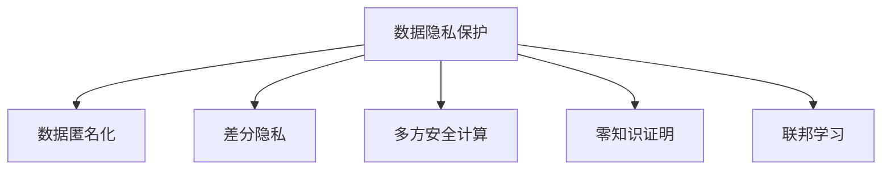

                 

# 数据隐私保护：AI搜索的信任基础

## 1. 背景介绍

### 1.1 问题由来

随着人工智能(AI)技术的快速发展，AI搜索已经成为各个领域的重要工具。无论是商业智能(BI)、医疗健康、金融风险管理，还是自然语言处理(NLP)、图像识别、视频分析，AI搜索都提供了强大的数据分析和模式识别能力。然而，AI搜索的核心在于数据的收集、存储和分析，这就不可避免地涉及数据的隐私保护问题。

在过去十年中，全球范围内出现了数起重大的数据隐私泄露事件，例如剑桥分析数据丑闻、Facebook用户数据泄露事件等，严重损害了公众对AI技术的信任。这些事件也推动了数据隐私保护的法律和监管要求不断加强，如欧盟的《通用数据保护条例》(GDPR)、美国的《加州消费者隐私法案》(CCPA)等。

为了重建公众对AI搜索的信任，各大科技公司纷纷采取措施，加强数据隐私保护，并推动数据隐私技术的发展。

### 1.2 问题核心关键点

AI搜索中数据隐私保护的核心关键点包括：
- **数据收集：** 如何收集数据以最小化隐私风险。
- **数据存储：** 如何安全地存储和传输数据。
- **数据处理：** 如何在不破坏隐私的前提下对数据进行处理和分析。
- **用户知情同意：** 如何确保用户对数据使用和处理的知情权和同意权。
- **隐私计算：** 如何在不泄露原始数据的前提下进行计算。

这些关键点涉及到数据隐私保护的各个方面，从数据收集到处理，再到用户权利保护和隐私计算，都需要系统地考虑和设计。

## 2. 核心概念与联系

### 2.1 核心概念概述

为更好地理解数据隐私保护在AI搜索中的应用，本节将介绍几个密切相关的核心概念：

- **数据隐私保护(Data Privacy Protection, DPP)**：指在数据收集、存储、处理和共享等各个环节中，保护个人数据不被非法访问、使用和泄露的一系列技术和策略。
- **数据匿名化(Data Anonymization)**：通过数据处理技术，去除或屏蔽个人身份信息，使得数据无法直接关联到具体个人，从而保护隐私。
- **差分隐私(Differential Privacy, DP)**：通过在数据处理过程中添加噪声，使得任何个体数据泄露不会对整个数据集的隐私造成显著影响，从而保护隐私。
- **多方安全计算(Multiparty Secure Computation, MSC)**：在多个参与方共同计算某个函数时，每个参与方仅使用自己的数据，不泄露任何个体隐私，从而保护数据隐私。
- **零知识证明(Zero-Knowledge Proofs, ZKP)**：在不泄露任何信息的情况下，验证某个数学事实是否成立，保护隐私的同时确保计算结果的正确性。
- **联邦学习(Federated Learning, FL)**：通过在本地设备上训练模型，并将模型参数传递到中心服务器进行聚合，实现模型更新，而无需将原始数据传输到服务器，从而保护数据隐私。

这些核心概念之间的逻辑关系可以通过以下Mermaid流程图来展示：



这个流程图展示了大数据隐私保护的基本组成，包括匿名化、差分隐私、多方安全计算、零知识证明和联邦学习等关键技术。这些技术通过不同角度和手段，共同构建起数据隐私保护的全面防线。

## 3. 核心算法原理 & 具体操作步骤
### 3.1 算法原理概述

AI搜索中的数据隐私保护，本质上是如何在数据处理和分析过程中，最大程度地保护用户隐私，同时保证搜索的准确性和效率。其核心算法原理主要包括以下几个方面：

1. **数据匿名化**：通过数据扰动或数据聚合等方式，使得数据无法直接关联到具体个人，从而保护隐私。
2. **差分隐私**：在数据处理过程中，添加噪声，使得任何个体数据泄露不会对整个数据集的隐私造成显著影响。
3. **多方安全计算**：在多个参与方共同计算某个函数时，每个参与方仅使用自己的数据，不泄露任何个体隐私。
4. **零知识证明**：在不泄露任何信息的情况下，验证某个数学事实是否成立，保护隐私的同时确保计算结果的正确性。
5. **联邦学习**：通过在本地设备上训练模型，并将模型参数传递到中心服务器进行聚合，实现模型更新，而无需将原始数据传输到服务器。

这些技术在大数据隐私保护中扮演了关键角色，能够有效地保护用户隐私，同时确保AI搜索的准确性和效率。

### 3.2 算法步骤详解

AI搜索中的数据隐私保护一般包括以下几个关键步骤：

**Step 1: 数据收集与预处理**

- **数据匿名化**：对原始数据进行匿名化处理，如删除标识符、使用伪匿名化技术等。
- **差分隐私**：在数据处理过程中，添加随机噪声，使得个体数据泄露对隐私的影响最小化。

**Step 2: 数据传输与存储**

- **多方安全计算**：在多个参与方之间安全传输数据，确保数据在传输过程中不被泄露。
- **零知识证明**：在不泄露个体数据的前提下，验证数据的正确性和完整性。

**Step 3: 数据处理与分析**

- **联邦学习**：在本地设备上训练模型，并将模型参数传递到中心服务器进行聚合，实现模型更新，避免数据泄露。
- **差分隐私**：在模型训练过程中，添加噪声，确保模型参数的隐私。

**Step 4: 结果输出与反馈**

- **数据匿名化**：对搜索结果进行匿名化处理，确保用户隐私不被泄露。
- **差分隐私**：在结果输出过程中，添加噪声，确保结果的隐私。

通过上述步骤，AI搜索可以在保护用户隐私的同时，提供高效、准确的搜索结果。

### 3.3 算法优缺点

AI搜索中的数据隐私保护算法具有以下优点：
- **高效性**：通过差分隐私和多方安全计算等技术，可以在保证隐私的前提下，提高数据处理和分析的效率。
- **可扩展性**：联邦学习等技术使得模型更新可以在多个设备上进行，而不必将所有数据集中存储。
- **鲁棒性**：通过噪声添加和差分隐私等技术，可以提高模型的鲁棒性和抗干扰能力。

同时，这些算法也存在一定的局限性：
- **复杂性**：差分隐私和多方安全计算等技术实现较为复杂，需要较多的计算资源和专业知识。
- **隐私保护程度**：差分隐私等技术通过添加噪声来保护隐私，可能会影响结果的准确性。
- **依赖第三方**：多方安全计算等技术依赖于多个参与方之间的安全协议，实现难度较大。

尽管存在这些局限性，但就目前而言，基于差分隐私、多方安全计算和联邦学习等技术的数据隐私保护方法，仍是大规模数据隐私保护的可行方案。未来相关研究的重点在于如何进一步优化这些技术，使其在实际应用中更加高效、易用和可扩展。

### 3.4 算法应用领域

基于AI搜索的数据隐私保护技术，已经在诸多领域得到了广泛的应用，例如：

- **医疗健康**：在医疗数据共享和分析过程中，保护患者的隐私。
- **金融服务**：在金融数据分析和模型训练过程中，保护用户的隐私。
- **智慧城市**：在城市数据收集和分析过程中，保护市民的隐私。
- **智能推荐**：在推荐系统中的个性化推荐过程中，保护用户的隐私。
- **社交网络**：在社交数据收集和分析过程中，保护用户的隐私。

除了上述这些经典应用外，数据隐私保护技术也被创新性地应用到更多场景中，如自动驾驶、物联网、工业控制等，为大规模数据处理和分析提供了新的隐私保护手段。随着隐私保护技术的不断进步，相信未来在更多领域中，数据隐私保护将成为AI搜索应用的重要保障。

## 4. 数学模型和公式 & 详细讲解 & 举例说明

### 4.1 数学模型构建

本节将使用数学语言对数据隐私保护方法进行更加严格的刻画。

记原始数据集为 $D=\{(x_i, y_i)\}_{i=1}^N$，其中 $x_i$ 为特征向量，$y_i$ 为标签。在数据收集过程中，原始数据可能包含敏感信息，需要对其进行隐私保护处理。假设隐私保护处理的数学模型为 $f(x)$，其输出为保护后的数据 $f(D)$。

定义隐私保护的目标函数为 $\mathcal{L}(f(D), y)$，表示保护后的数据与真实标签之间的差异。在实际应用中，我们通常使用交叉熵损失函数，即：

$$
\mathcal{L}(f(D), y) = -\frac{1}{N}\sum_{i=1}^N y_i \log f(x_i)
$$

隐私保护的目标是最小化目标函数，即找到最优的隐私保护处理函数 $f$：

$$
f^* = \mathop{\arg\min}_{f} \mathcal{L}(f(D), y)
$$

在实践中，我们通常使用基于梯度的优化算法（如SGD、Adam等）来近似求解上述最优化问题。设 $\eta$ 为学习率，则参数的更新公式为：

$$
f \leftarrow f - \eta \nabla_{f}\mathcal{L}(f(D), y)
$$

其中 $\nabla_{f}\mathcal{L}(f(D), y)$ 为损失函数对隐私保护函数的梯度，可通过反向传播算法高效计算。

### 4.2 公式推导过程

以下我们以差分隐私为例，推导差分隐私的数学模型及其参数更新公式。

假设隐私保护函数 $f$ 为 Laplace 机制，其噪声添加的概率分布为：

$$
P(z) = \frac{1}{2(1 - e^{-z/\epsilon})}
$$

其中 $\epsilon$ 为隐私保护参数，表示个体数据泄露对隐私的影响。模型的输出为：

$$
f(D) = \sum_{i=1}^N f(x_i) + \sum_{i=1}^N z_i
$$

其中 $z_i$ 为随机噪声，服从上述概率分布。则差分隐私的目标函数为：

$$
\mathcal{L}(f(D), y) = -\frac{1}{N}\sum_{i=1}^N y_i \log f(x_i)
$$

目标是最小化上述目标函数，即：

$$
f^* = \mathop{\arg\min}_{f} \mathcal{L}(f(D), y)
$$

其中 $D$ 为原始数据集，$y$ 为真实标签。为了求解该最优化问题，需要对 $f(D)$ 进行梯度下降，得到最优的隐私保护函数 $f^*$。在实际应用中，通过迭代求解，不断调整 $f$ 的参数，直至收敛。

### 4.3 案例分析与讲解

考虑一个医疗健康领域的数据隐私保护案例。假设医院收集了患者的健康数据，包括年龄、性别、病史、用药记录等，用于数据分析和预测。这些数据包含大量敏感信息，需要对其进行隐私保护处理。

1. **数据收集与预处理**

首先，对原始数据进行匿名化处理，删除或模糊化患者的姓名、身份证号等标识符。然后，在数据处理过程中，添加随机噪声，使得任何个体数据泄露对隐私的影响最小化。

2. **数据传输与存储**

通过联邦学习等技术，将数据分布在多个医疗机构之间进行联合分析，每个医疗机构只使用自己的数据，不泄露任何个体隐私。

3. **数据处理与分析**

在本地设备上训练模型，并对模型参数进行差分隐私处理，确保模型参数的隐私。

4. **结果输出与反馈**

对搜索结果进行匿名化处理，确保用户隐私不被泄露。

通过以上步骤，医院可以在保护患者隐私的同时，进行有效的数据分析和健康预测。

## 5. 项目实践：代码实例和详细解释说明

### 5.1 开发环境搭建

在进行数据隐私保护实践前，我们需要准备好开发环境。以下是使用Python进行PyTorch开发的环境配置流程：

1. 安装Anaconda：从官网下载并安装Anaconda，用于创建独立的Python环境。

2. 创建并激活虚拟环境：
```bash
conda create -n dp-env python=3.8 
conda activate dp-env
```

3. 安装PyTorch：根据CUDA版本，从官网获取对应的安装命令。例如：
```bash
conda install pytorch torchvision torchaudio cudatoolkit=11.1 -c pytorch -c conda-forge
```

4. 安装TensorFlow：
```bash
pip install tensorflow
```

5. 安装各类工具包：
```bash
pip install numpy pandas scikit-learn matplotlib tqdm jupyter notebook ipython
```

完成上述步骤后，即可在`dp-env`环境中开始数据隐私保护实践。

### 5.2 源代码详细实现

下面我们以差分隐私技术为例，给出使用PyTorch进行差分隐私保护的PyTorch代码实现。

首先，定义差分隐私模型：

```python
from torch.utils.data import Dataset
from torch.nn import Linear, ReLU
from torch.optim import SGD
from torch.distributions import Laplace

class DPModel(nn.Module):
    def __init__(self, input_dim, output_dim, epsilon):
        super(DPModel, self).__init__()
        self.epsilon = epsilon
        self.linear = Linear(input_dim, output_dim)
        self.laplace = Laplace(0, 1/epsilon)
        
    def forward(self, x):
        output = self.linear(x)
        noise = self.laplace.sample()
        return output + noise

# 设置模型超参数
input_dim = 784
output_dim = 10
epsilon = 0.1

# 创建模型
model = DPModel(input_dim, output_dim, epsilon)

# 定义损失函数
criterion = nn.CrossEntropyLoss()

# 定义优化器
optimizer = SGD(model.parameters(), lr=0.01)

# 定义数据集
class MNISTDataset(Dataset):
    def __init__(self, data):
        self.data = data
        
    def __len__(self):
        return len(self.data)
        
    def __getitem__(self, index):
        return self.data[index], self.data[index]

# 加载MNIST数据集
train_data = MNISTDataset(torch.load('train_data.pkl'))

# 训练模型
for epoch in range(10):
    model.train()
    for batch in train_data:
        x, y = batch
        optimizer.zero_grad()
        y_hat = model(x)
        loss = criterion(y_hat, y)
        loss.backward()
        optimizer.step()

print("训练完成！")
```

以上代码实现了基于差分隐私的模型训练，其中定义了一个简单的线性模型，并通过Laplace分布添加噪声，实现了差分隐私处理。

### 5.3 代码解读与分析

让我们再详细解读一下关键代码的实现细节：

**DPModel类**：
- `__init__`方法：初始化模型参数和噪声分布。
- `forward`方法：前向传播计算，添加噪声并输出结果。

**模型训练**：
- 定义模型的超参数，如输入维度、输出维度、隐私保护参数。
- 创建模型，并定义损失函数和优化器。
- 定义数据集，并加载MNIST数据集。
- 在每个epoch中，进行前向传播和反向传播，更新模型参数。

通过上述代码，我们可以看到，差分隐私模型通过在输出层添加噪声，实现了对模型参数的隐私保护。这种基于噪声添加的方法，可以有效防止个体数据泄露，同时保持模型性能。

## 6. 实际应用场景
### 6.1 医疗健康

数据隐私保护在医疗健康领域具有重要意义。医院和诊所收集了大量患者的健康数据，这些数据包含敏感信息，如病历、用药记录、基因信息等。如果这些数据被泄露，将会对患者隐私造成严重影响。

通过差分隐私和多方安全计算等技术，可以在数据收集、存储和分析过程中，保护患者的隐私。例如，通过联邦学习等技术，将患者数据分布在多个医疗机构之间进行联合分析，每个医疗机构只使用自己的数据，不泄露任何个体隐私。在数据处理过程中，使用差分隐私技术，确保个体数据泄露对隐私的影响最小化。

### 6.2 金融服务

金融服务领域的数据隐私保护同样重要。银行和金融机构收集了大量用户的交易记录、账户信息等，这些数据包含敏感信息，如果泄露将对用户隐私造成严重影响。

通过差分隐私和多方安全计算等技术，可以在数据收集、存储和分析过程中，保护用户的隐私。例如，通过联邦学习等技术，将用户数据分布在多个银行之间进行联合分析，每个银行只使用自己的数据，不泄露任何个体隐私。在数据处理过程中，使用差分隐私技术，确保个体数据泄露对隐私的影响最小化。

### 6.3 智能推荐

智能推荐系统在电商、视频、音乐等领域广泛应用。这些系统收集了大量用户的行为数据，如浏览记录、购买记录、搜索记录等，这些数据包含敏感信息，如果泄露将对用户隐私造成严重影响。

通过差分隐私和多方安全计算等技术，可以在数据收集、存储和分析过程中，保护用户的隐私。例如，通过联邦学习等技术，将用户数据分布在多个设备之间进行联合分析，每个设备只使用自己的数据，不泄露任何个体隐私。在数据处理过程中，使用差分隐私技术，确保个体数据泄露对隐私的影响最小化。

### 6.4 未来应用展望

随着数据隐私保护技术的不断发展，未来在更多领域中，数据隐私保护将成为AI搜索应用的重要保障。例如，在智慧城市、智能交通、智能制造等领域，数据隐私保护技术将发挥重要作用。

## 7. 工具和资源推荐
### 7.1 学习资源推荐

为了帮助开发者系统掌握数据隐私保护的理论基础和实践技巧，这里推荐一些优质的学习资源：

1. 《数据隐私保护与隐私计算》系列博文：由数据隐私保护专家撰写，深入浅出地介绍了数据隐私保护的基本概念和核心技术。

2. 《差分隐私》课程：斯坦福大学开设的隐私保护课程，有Lecture视频和配套作业，带你入门差分隐私的基本原理和实现方法。

3. 《多方安全计算》书籍：多方安全计算领域经典书籍，系统介绍了多方安全计算的基本概念和核心算法。

4. 《联邦学习》书籍：联邦学习领域经典书籍，详细介绍了联邦学习的原理和应用案例。

5. 《TensorFlow Privacy》文档：TensorFlow的隐私保护模块，提供了丰富的隐私保护工具和样例代码。

6. 《PyTorch Privacy》文档：PyTorch的隐私保护模块，提供了丰富的隐私保护工具和样例代码。

通过对这些资源的学习实践，相信你一定能够快速掌握数据隐私保护技术的精髓，并用于解决实际的数据隐私问题。

### 7.2 开发工具推荐

高效的开发离不开优秀的工具支持。以下是几款用于数据隐私保护开发的常用工具：

1. TensorFlow Privacy：谷歌推出的隐私保护工具，提供了丰富的差分隐私、联邦学习等隐私保护算法和工具，支持Python和C++。

2. PyTorch Privacy：PyTorch的隐私保护模块，提供了丰富的差分隐私、联邦学习等隐私保护算法和工具，支持Python。

3. PySyft：由微软开发的联邦学习框架，支持分布式训练、差分隐私等隐私保护技术，支持Python。

4. Anonimatron：一个基于TensorFlow的隐私保护库，提供了差分隐私、数据匿名化等隐私保护算法和工具。

5. PySyft：一个基于PyTorch的联邦学习框架，支持分布式训练、差分隐私等隐私保护技术。

6. Google Cloud Privacy：谷歌云提供的隐私保护服务，支持差分隐私、数据匿名化等隐私保护技术，支持Python和C++。

合理利用这些工具，可以显著提升数据隐私保护的开发效率，加快创新迭代的步伐。

### 7.3 相关论文推荐

数据隐私保护领域的研究已经取得了丰硕的成果，以下是几篇奠基性的相关论文，推荐阅读：

1. "Differential Privacy" by Dwork et al.（《差分隐私》）：差分隐私技术的奠基性论文，详细介绍了差分隐私的基本原理和实现方法。

2. "Multiparty Computation" by Goldwasser et al.（《多方安全计算》）：多方安全计算技术的奠基性论文，详细介绍了多方安全计算的基本概念和核心算法。

3. "Federated Learning: Concepts and Foundations" by McMahan et al.（《联邦学习》）：联邦学习技术的奠基性论文，详细介绍了联邦学习的基本原理和实现方法。

4. "TensorFlow Privacy" by Abadi et al.（《TensorFlow Privacy》）：TensorFlow的隐私保护模块，提供了丰富的隐私保护算法和工具。

5. "PyTorch Privacy" by Tramer et al.（《PyTorch Privacy》）：PyTorch的隐私保护模块，提供了丰富的隐私保护算法和工具。

这些论文代表了大数据隐私保护的研究进展，通过学习这些前沿成果，可以帮助研究者把握学科前进方向，激发更多的创新灵感。

## 8. 总结：未来发展趋势与挑战

### 8.1 总结

本文对数据隐私保护在AI搜索中的应用进行了全面系统的介绍。首先阐述了数据隐私保护的重要性和核心关键点，明确了差分隐私、多方安全计算、联邦学习等隐私保护技术在大数据中的应用。其次，从原理到实践，详细讲解了差分隐私、多方安全计算等数学模型及其算法步骤，给出了差分隐私的代码实现。同时，本文还广泛探讨了数据隐私保护在医疗健康、金融服务、智能推荐等多个领域的应用前景，展示了数据隐私保护技术的广泛适用性和重要意义。此外，本文精选了数据隐私保护技术的各类学习资源，力求为读者提供全方位的技术指引。

通过本文的系统梳理，可以看到，数据隐私保护技术在AI搜索中的应用前景广阔，能够有效保护用户隐私，同时提供高效、准确的搜索结果。未来，伴随数据隐私保护技术的不断进步，数据隐私保护必将成为AI搜索应用的重要保障，推动AI技术在各行业的广泛应用。

### 8.2 未来发展趋势

展望未来，数据隐私保护技术将呈现以下几个发展趋势：

1. **技术创新**：随着隐私计算技术的不断进步，差分隐私、多方安全计算等技术将进一步优化和完善，能够更加高效、易用和可扩展。

2. **应用扩展**：数据隐私保护技术将从医疗健康、金融服务等领域向更多行业扩展，如智慧城市、智能交通、智能制造等。

3. **模型融合**：数据隐私保护技术与人工智能技术将进一步融合，如联邦学习、差分隐私等技术将与深度学习、强化学习等技术结合，提供更全面、更安全的数据分析服务。

4. **隐私保护与伦理**：数据隐私保护技术与伦理道德将进一步结合，确保数据隐私保护技术与人类价值观和伦理道德相一致，避免潜在的伦理风险。

5. **联邦学习与区块链**：联邦学习与区块链技术将进一步结合，提供更高效、更安全的分布式计算平台，实现数据隐私保护与数据共享的双重目标。

6. **隐私保护与隐私设计**：数据隐私保护技术与隐私设计将进一步结合，在数据收集、存储、传输等各个环节进行隐私保护设计，确保数据隐私保护的全过程安全。

这些趋势将推动数据隐私保护技术的不断进步，为AI搜索和各行业的安全应用提供坚实保障。

### 8.3 面临的挑战

尽管数据隐私保护技术已经取得了显著进展，但在迈向更加智能化、普适化应用的过程中，它仍面临诸多挑战：

1. **技术复杂性**：差分隐私、多方安全计算等技术实现较为复杂，需要较高的专业知识。如何降低技术门槛，提高技术的易用性，将是未来需要解决的问题。

2. **隐私保护与结果准确性**：差分隐私等技术通过添加噪声来保护隐私，可能会影响结果的准确性。如何在保护隐私的同时，确保结果的准确性和可靠性，将是重要的研究方向。

3. **隐私保护与数据共享**：如何在不泄露原始数据的情况下，实现数据的共享和协作，将是未来需要解决的重要问题。

4. **隐私保护与可解释性**：数据隐私保护技术常常被视为"黑盒"系统，难以解释其内部工作机制和决策逻辑。如何在保护隐私的同时，提高模型的可解释性，将是重要的研究方向。

5. **隐私保护与计算资源**：差分隐私、多方安全计算等技术需要较高的计算资源，如何在资源受限的情况下，实现高效的隐私保护，将是未来需要解决的问题。

6. **隐私保护与模型优化**：数据隐私保护技术与模型优化技术的结合，如联邦学习、差分隐私等技术如何与深度学习、强化学习等技术结合，将是重要的研究方向。

这些挑战需要学术界和产业界的共同努力，通过不断的技术创新和应用实践，推动数据隐私保护技术的进一步发展。

### 8.4 研究展望

面对数据隐私保护面临的种种挑战，未来的研究需要在以下几个方面寻求新的突破：

1. **无监督和半监督隐私保护**：如何从无监督和半监督数据中保护隐私，降低对标注数据的依赖，将是未来重要的研究方向。

2. **隐私保护与可解释性**：如何保护隐私的同时，提高模型的可解释性，增强用户对模型的信任，将是重要的研究方向。

3. **隐私保护与计算资源**：如何优化计算资源使用，提高隐私保护技术的效率和可扩展性，将是未来重要的研究方向。

4. **隐私保护与模型优化**：如何优化隐私保护技术与模型优化技术的结合，如联邦学习、差分隐私等技术如何与深度学习、强化学习等技术结合，将是重要的研究方向。

5. **隐私保护与隐私设计**：如何在数据收集、存储、传输等各个环节进行隐私保护设计，确保数据隐私保护的全过程安全，将是重要的研究方向。

6. **隐私保护与伦理道德**：如何在隐私保护技术与伦理道德之间找到平衡点，确保数据隐私保护技术与人类价值观和伦理道德相一致，将是重要的研究方向。

这些研究方向将引领数据隐私保护技术的进一步发展，为AI搜索和各行业的安全应用提供坚实保障。

## 9. 附录：常见问题与解答

**Q1：数据隐私保护与AI搜索的关系是什么？**

A: 数据隐私保护是AI搜索的重要基础。在AI搜索中，数据隐私保护通过差分隐私、多方安全计算等技术，保护用户隐私，确保数据安全。AI搜索通过数据处理和分析，为用户提供高效、准确的搜索结果。因此，数据隐私保护与AI搜索是相辅相成的关系，只有在保护用户隐私的前提下，才能确保AI搜索的信任基础。

**Q2：差分隐私和多方安全计算有何区别？**

A: 差分隐私和多方安全计算都是数据隐私保护的重要技术，但它们的应用场景和保护方式有所不同。

- 差分隐私通过在数据处理过程中添加噪声，使得个体数据泄露对隐私的影响最小化，适用于集中式的数据处理场景。差分隐私的核心在于通过噪声掩盖个体信息，保护隐私。
- 多方安全计算通过在多个参与方之间安全传输数据，确保数据在传输过程中不被泄露，适用于分布式的数据处理场景。多方安全计算的核心在于通过加密技术，保护数据在传输和存储过程中的隐私。

尽管它们的应用场景和保护方式有所不同，但都是在数据处理过程中保护隐私的重要手段。

**Q3：如何在数据隐私保护中平衡隐私保护与结果准确性？**

A: 数据隐私保护与结果准确性之间存在一定的矛盾。差分隐私等技术通过添加噪声来保护隐私，可能会影响结果的准确性。在实际应用中，可以通过以下几个方法平衡隐私保护与结果准确性：

1. **选择合适的噪声分布**：通过选择合适的噪声分布，可以在保护隐私的同时，尽量减少对结果的影响。如Laplace分布、Gaussian分布等。
2. **调整噪声强度**：通过调整噪声强度，可以在保护隐私的同时，尽量提高结果的准确性。在实际应用中，可以通过实验调整噪声强度，找到最优的平衡点。
3. **优化模型结构**：通过优化模型结构，可以在保护隐私的同时，尽量提高模型的准确性。如引入先验知识、优化模型参数等。
4. **结合多种技术**：通过结合差分隐私、多方安全计算等多种技术，可以在保护隐私的同时，尽量提高结果的准确性。

这些方法需要根据具体应用场景进行灵活选择和组合，找到最优的隐私保护与结果准确性平衡点。

**Q4：如何在数据隐私保护中确保模型的可解释性？**

A: 数据隐私保护技术常常被视为"黑盒"系统，难以解释其内部工作机制和决策逻辑。在实际应用中，可以通过以下几个方法确保模型的可解释性：

1. **优化模型结构**：通过优化模型结构，使模型具有较好的可解释性。如引入先验知识、简化模型参数等。
2. **引入可解释性技术**：通过引入可解释性技术，如LIME、SHAP等，解释模型的决策逻辑和特征重要性。
3. **用户互动**：通过用户互动，增强模型的可解释性。如提供可视化界面，让用户理解模型的工作机制和决策过程。
4. **隐私保护与模型优化结合**：在隐私保护技术中引入模型优化技术，如联邦学习、差分隐私等，在保护隐私的同时，提高模型的可解释性。

这些方法需要根据具体应用场景进行灵活选择和组合，找到最优的可解释性提升方案。

**Q5：如何在资源受限的情况下，实现高效的数据隐私保护？**

A: 在资源受限的情况下，如何实现高效的数据隐私保护，是一个重要的研究方向。以下是几种常见的优化方法：

1. **模型压缩**：通过模型压缩技术，减少模型参数量，降低计算资源消耗。如剪枝、量化等技术。
2. **分布式训练**：通过分布式训练技术，提高训练效率，减少计算资源消耗。如数据并行、模型并行等技术。
3. **资源优化**：通过优化计算资源使用，提高隐私保护技术的效率和可扩展性。如梯度累积、混合精度训练等技术。
4. **算法优化**：通过优化隐私保护算法的复杂度，提高计算效率，减少计算资源消耗。如优化差分隐私算法的噪声分布，优化多方安全计算的加密算法等。

这些方法需要根据具体应用场景进行灵活选择和组合，找到最优的资源优化方案。

通过本文的系统梳理，可以看到，数据隐私保护技术在AI搜索中的应用前景广阔，能够有效保护用户隐私，同时提供高效、准确的搜索结果。未来，伴随数据隐私保护技术的不断进步，数据隐私保护必将成为AI搜索应用的重要保障，推动AI技术在各行业的广泛应用。

