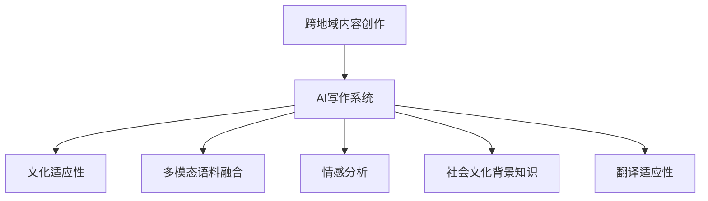

                 

# 文化适应性AI写作：跨地域的内容创作

> 关键词：跨地域内容创作, AI写作, 文化适应性, 多模态语料, 语言模型, 自然语言处理, 文本生成, 情感分析, 社会文化, 翻译

## 1. 背景介绍

### 1.1 问题由来

随着全球化的推进和文化交流的加深，文化多样性成为跨国企业和文化产业的重要考量。企业内容团队在不同文化背景下，需要迅速适应并产出适应当地市场和文化的内容。而传统的跨国内容创作流程，往往依赖人工多轮审核，耗时长、成本高、容易出错。

AI写作技术的兴起，为内容创作带来了革命性的变革。AI写作系统能够快速生成符合目标市场文化需求的内容，提升内容创作的效率和效果。但不同地域文化差异巨大，AI写作系统如何适应不同文化，产生高质量的内容，成为了新的挑战。

### 1.2 问题核心关键点

AI写作系统在跨地域内容创作中的核心问题，是如何适应不同地域文化背景，生成适应当地市场和受众需求的内容。具体问题包括：

1. **文化适应性**：如何生成符合当地文化习俗、语言习惯、价值观念的内容。
2. **多模态语料**：如何将图像、视频、音频等多模态信息与文本信息融合，生成更全面的内容。
3. **情感分析**：如何识别和生成符合当地受众情感需求的内容。
4. **社会文化背景**：如何将复杂的社会文化背景知识融入内容创作，避免文化误读。
5. **翻译适应性**：如何在不同语言间进行翻译，保留源语言的文化特征。

### 1.3 问题研究意义

在全球化背景下，不同地域的内容创作需求日益增长，AI写作技术的应用前景广阔。通过文化适应性AI写作技术，企业可以迅速适应不同文化市场，降低内容创作的成本和风险，提升内容输出的效率和质量。

文化适应性AI写作技术不仅有助于提升企业内容团队的工作效率，还为文化交流和理解提供了新的工具。在旅游、影视、游戏等行业，文化适应性AI写作技术可以大大提升内容创作的灵活性和创新性，推动产业的数字化和智能化转型。

## 2. 核心概念与联系

### 2.1 核心概念概述

为更好地理解文化适应性AI写作技术，本节将介绍几个密切相关的核心概念：

- **跨地域内容创作**：指在不同文化背景和地域环境下，生成适应当地市场和受众需求的内容创作过程。
- **AI写作系统**：利用人工智能技术，自动生成文本内容，支持各种创意写作和应用场景。
- **文化适应性**：指AI写作系统能够理解并生成符合特定地域文化背景和习俗的内容。
- **多模态语料融合**：指将文本、图像、视频、音频等多模态信息融合，生成更全面的内容。
- **情感分析**：指AI写作系统能够识别并生成符合目标受众情感需求的内容。
- **社会文化背景知识**：指AI写作系统能够理解和运用复杂的社会文化背景知识。
- **翻译适应性**：指AI写作系统在不同语言间进行翻译，保留源语言的文化特征。

这些核心概念之间的逻辑关系可以通过以下Mermaid流程图来展示：



这个流程图展示了的核心概念及其之间的关系：

1. 跨地域内容创作是AI写作系统的主要应用场景。
2. AI写作系统通过文化适应性、多模态语料融合、情感分析、社会文化背景知识、翻译适应性等多个维度提升内容创作的适应性。
3. 这些技术维度共同构成了AI写作系统应对跨地域内容创作挑战的方法论，以实现高效、高质量的内容输出。

## 3. 核心算法原理 & 具体操作步骤
### 3.1 算法原理概述

文化适应性AI写作系统的核心算法原理基于自然语言处理(NLP)中的语言模型和情感分析。具体而言：

- **语言模型**：通过在大规模无标签文本语料上进行预训练，学习语言的通用表示，并通过微调适应特定地域的文化特征。
- **情感分析**：利用情感词典、社交媒体情感数据等资源，训练模型识别并生成符合目标受众情感需求的内容。
- **多模态语料融合**：通过图像识别、视频分析等技术，将多模态信息与文本内容进行融合，生成更全面的内容。
- **社会文化背景知识**：利用知识图谱、文化数据集等资源，训练模型理解并应用复杂的社会文化背景知识。
- **翻译适应性**：通过神经机器翻译(NMT)模型，在不同语言间进行翻译，保留源语言的文化特征。

### 3.2 算法步骤详解

文化适应性AI写作系统的构建主要包括以下几个关键步骤：

**Step 1: 准备多模态语料**

- 收集目标地域的多模态语料，包括文本、图像、视频、音频等。
- 清洗和标注语料，将其划分为训练集、验证集和测试集。

**Step 2: 选择合适的预训练语言模型**

- 选择适合特定文化背景的预训练语言模型，如针对中文的BERT、GPT-3等。
- 将预训练模型视为初始化参数，加载至模型中。

**Step 3: 设计任务适配层**

- 根据目标任务需求，设计适当的输出层和损失函数。
- 对于文本生成任务，通常使用语言模型的解码器输出概率分布，并以负对数似然为损失函数。
- 对于情感分析任务，使用情感分类器进行输出，并以交叉熵损失函数进行优化。

**Step 4: 添加文化适应模块**

- 引入文化适应模块，用于识别和生成符合特定地域文化特征的内容。
- 模块可以基于语言模型进行微调，或者使用特定文化词典进行编码。
- 在文本生成阶段，根据目标文化背景知识对模型进行条件生成。

**Step 5: 执行梯度训练**

- 将训练集数据分批次输入模型，前向传播计算损失函数。
- 反向传播计算参数梯度，根据设定的优化算法和学习率更新模型参数。
- 周期性在验证集上评估模型性能，根据性能指标决定是否触发Early Stopping。
- 重复上述步骤直到满足预设的迭代轮数或Early Stopping条件。

**Step 6: 测试和部署**

- 在测试集上评估模型性能，对比微调前后的精度提升。
- 使用微调后的模型对新样本进行推理预测，集成到实际的内容创作系统中。
- 持续收集新的数据，定期重新微调模型，以适应数据分布的变化。

以上是文化适应性AI写作系统的一般流程。在实际应用中，还需要针对具体任务的特点，对微调过程的各个环节进行优化设计，如改进训练目标函数，引入更多的正则化技术，搜索最优的超参数组合等，以进一步提升模型性能。

### 3.3 算法优缺点

文化适应性AI写作系统具有以下优点：

1. **高效生成内容**：通过预训练和微调，可以快速生成符合特定文化背景的内容。
2. **适应性强**：能够灵活应对不同地域文化差异，生成符合目标市场需求的内容。
3. **节省成本**：降低人工内容创作的成本，提升内容创作的效率。
4. **灵活调整**：模型可以通过持续微调不断适应新的文化背景，保持内容输出的质量。

同时，该方法也存在一定的局限性：

1. **依赖文化知识**：文化适应性AI写作系统依赖大量文化背景知识，需要持续更新和维护。
2. **文化误读风险**：模型可能无法完全理解复杂文化背景，导致文化误读。
3. **多模态融合难度**：将多模态信息与文本融合，生成高质量内容仍具挑战。
4. **情感识别误差**：情感分析模型可能存在误差，导致生成的内容不符合目标受众情感需求。
5. **社会文化背景复杂**：复杂的社会文化背景知识难以完全融入模型，导致内容输出的社会适应性不足。

尽管存在这些局限性，但就目前而言，文化适应性AI写作系统仍然是内容创作领域的先进技术，能够显著提升内容创作的效率和质量。未来相关研究的重点在于如何进一步降低文化适应性AI写作系统的依赖度，提高模型的鲁棒性和适应性，同时兼顾可解释性和伦理安全性等因素。

### 3.4 算法应用领域

文化适应性AI写作技术在多个领域已得到应用，例如：

- **旅游内容创作**：为不同国家和地区的游客生成个性化旅游指南和行程安排。
- **影视剧本创作**：根据目标市场的文化背景和受众需求，创作符合本地口味的影视剧本。
- **游戏内容设计**：为不同文化背景的游戏玩家设计符合本地文化的游戏内容。
- **社交媒体内容**：根据目标受众的文化习惯和情感需求，生成适应社交媒体传播的内容。
- **广告文案创作**：为不同文化市场的广告商创作符合本地文化价值观和习俗的广告文案。

除了上述这些经典应用外，文化适应性AI写作技术还可以应用于更多场景中，如教育内容生成、企业公关文档、政治宣传等领域，为不同文化市场的用户提供精准、高效的内容创作服务。

## 4. 数学模型和公式 & 详细讲解 & 举例说明
### 4.1 数学模型构建

本节将使用数学语言对文化适应性AI写作技术进行更加严格的刻画。

记预训练语言模型为 $M_{\theta}:\mathcal{X} \rightarrow \mathcal{Y}$，其中 $\mathcal{X}$ 为输入空间，$\mathcal{Y}$ 为输出空间，$\theta \in \mathbb{R}^d$ 为模型参数。假设目标文化背景下的标注数据集 $D=\{(x_i,y_i)\}_{i=1}^N, x_i \in \mathcal{X}, y_i \in \mathcal{Y}$。

定义模型 $M_{\theta}$ 在输入 $x$ 上的输出为 $\hat{y}=M_{\theta}(x) \in [0,1]$，表示样本属于正类的概率。真实标签 $y \in \{0,1\}$。则二分类交叉熵损失函数定义为：

$$
\ell(M_{\theta}(x),y) = -[y\log \hat{y} + (1-y)\log (1-\hat{y})]
$$

将其代入经验风险公式，得：

$$
\mathcal{L}(\theta) = -\frac{1}{N}\sum_{i=1}^N [y_i\log M_{\theta}(x_i)+(1-y_i)\log(1-M_{\theta}(x_i))]
$$

在得到损失函数的梯度后，即可带入参数更新公式，完成模型的迭代优化。重复上述过程直至收敛，最终得到适应目标文化背景的最优模型参数 $\theta^*$。

### 4.2 公式推导过程

以下我们以情感分析任务为例，推导情感分类器的交叉熵损失函数及其梯度的计算公式。

假设模型 $M_{\theta}$ 在输入 $x$ 上的输出为 $\hat{y}=M_{\theta}(x) \in [0,1]$，表示样本属于正类的概率。真实标签 $y \in \{0,1\}$。则二分类交叉熵损失函数定义为：

$$
\ell(M_{\theta}(x),y) = -[y\log \hat{y} + (1-y)\log (1-\hat{y})]
$$

将其代入经验风险公式，得：

$$
\mathcal{L}(\theta) = -\frac{1}{N}\sum_{i=1}^N [y_i\log M_{\theta}(x_i)+(1-y_i)\log(1-M_{\theta}(x_i))]
$$

根据链式法则，损失函数对参数 $\theta_k$ 的梯度为：

$$
\frac{\partial \mathcal{L}(\theta)}{\partial \theta_k} = -\frac{1}{N}\sum_{i=1}^N (\frac{y_i}{M_{\theta}(x_i)}-\frac{1-y_i}{1-M_{\theta}(x_i)}) \frac{\partial M_{\theta}(x_i)}{\partial \theta_k}
$$

其中 $\frac{\partial M_{\theta}(x_i)}{\partial \theta_k}$ 可进一步递归展开，利用自动微分技术完成计算。

在得到损失函数的梯度后，即可带入参数更新公式，完成模型的迭代优化。重复上述过程直至收敛，最终得到适应目标文化背景的最优模型参数 $\theta^*$。

## 5. 项目实践：代码实例和详细解释说明
### 5.1 开发环境搭建

在进行文化适应性AI写作实践前，我们需要准备好开发环境。以下是使用Python进行PyTorch开发的环境配置流程：

1. 安装Anaconda：从官网下载并安装Anaconda，用于创建独立的Python环境。

2. 创建并激活虚拟环境：
```bash
conda create -n pytorch-env python=3.8 
conda activate pytorch-env
```

3. 安装PyTorch：根据CUDA版本，从官网获取对应的安装命令。例如：
```bash
conda install pytorch torchvision torchaudio cudatoolkit=11.1 -c pytorch -c conda-forge
```

4. 安装Transformers库：
```bash
pip install transformers
```

5. 安装各类工具包：
```bash
pip install numpy pandas scikit-learn matplotlib tqdm jupyter notebook ipython
```

完成上述步骤后，即可在`pytorch-env`环境中开始文化适应性AI写作实践。

### 5.2 源代码详细实现

下面我们以情感分析任务为例，给出使用Transformers库对BERT模型进行文化适应性微调的PyTorch代码实现。

首先，定义情感分析任务的数据处理函数：

```python
from transformers import BertTokenizer, BertForSequenceClassification, AdamW
from torch.utils.data import Dataset, DataLoader
import torch
import numpy as np

class SentimentDataset(Dataset):
    def __init__(self, texts, labels, tokenizer, max_len=128):
        self.texts = texts
        self.labels = labels
        self.tokenizer = tokenizer
        self.max_len = max_len
        
    def __len__(self):
        return len(self.texts)
    
    def __getitem__(self, item):
        text = self.texts[item]
        label = self.labels[item]
        
        encoding = self.tokenizer(text, return_tensors='pt', max_length=self.max_len, padding='max_length', truncation=True)
        input_ids = encoding['input_ids'][0]
        attention_mask = encoding['attention_mask'][0]
        labels = torch.tensor(label, dtype=torch.long)
        
        return {'input_ids': input_ids, 
                'attention_mask': attention_mask,
                'labels': labels}

# 标签与id的映射
label2id = {'negative': 0, 'positive': 1}

# 创建dataset
tokenizer = BertTokenizer.from_pretrained('bert-base-cased')

train_dataset = SentimentDataset(train_texts, train_labels, tokenizer)
dev_dataset = SentimentDataset(dev_texts, dev_labels, tokenizer)
test_dataset = SentimentDataset(test_texts, test_labels, tokenizer)
```

然后，定义模型和优化器：

```python
model = BertForSequenceClassification.from_pretrained('bert-base-cased', num_labels=2)

optimizer = AdamW(model.parameters(), lr=2e-5)
```

接着，定义训练和评估函数：

```python
device = torch.device('cuda') if torch.cuda.is_available() else torch.device('cpu')
model.to(device)

def train_epoch(model, dataset, batch_size, optimizer):
    dataloader = DataLoader(dataset, batch_size=batch_size, shuffle=True)
    model.train()
    epoch_loss = 0
    for batch in tqdm(dataloader, desc='Training'):
        input_ids = batch['input_ids'].to(device)
        attention_mask = batch['attention_mask'].to(device)
        labels = batch['labels'].to(device)
        model.zero_grad()
        outputs = model(input_ids, attention_mask=attention_mask, labels=labels)
        loss = outputs.loss
        epoch_loss += loss.item()
        loss.backward()
        optimizer.step()
    return epoch_loss / len(dataloader)

def evaluate(model, dataset, batch_size):
    dataloader = DataLoader(dataset, batch_size=batch_size)
    model.eval()
    preds, labels = [], []
    with torch.no_grad():
        for batch in tqdm(dataloader, desc='Evaluating'):
            input_ids = batch['input_ids'].to(device)
            attention_mask = batch['attention_mask'].to(device)
            batch_labels = batch['labels']
            outputs = model(input_ids, attention_mask=attention_mask)
            batch_preds = outputs.logits.argmax(dim=1).to('cpu').tolist()
            batch_labels = batch_labels.to('cpu').tolist()
            for pred, label in zip(batch_preds, batch_labels):
                preds.append(pred)
                labels.append(label)
                
    print('Accuracy:', np.mean(np.array(preds) == np.array(labels)))
```

最后，启动训练流程并在测试集上评估：

```python
epochs = 5
batch_size = 16

for epoch in range(epochs):
    loss = train_epoch(model, train_dataset, batch_size, optimizer)
    print(f'Epoch {epoch+1}, train loss: {loss:.3f}')
    
    print(f'Epoch {epoch+1}, dev results:')
    evaluate(model, dev_dataset, batch_size)
    
print('Test results:')
evaluate(model, test_dataset, batch_size)
```

以上就是使用PyTorch对BERT进行情感分析任务文化适应性微调的完整代码实现。可以看到，得益于Transformers库的强大封装，我们可以用相对简洁的代码完成BERT模型的加载和微调。

### 5.3 代码解读与分析

让我们再详细解读一下关键代码的实现细节：

**SentimentDataset类**：
- `__init__`方法：初始化文本、标签、分词器等关键组件。
- `__len__`方法：返回数据集的样本数量。
- `__getitem__`方法：对单个样本进行处理，将文本输入编码为token ids，将标签编码为数字，并对其进行定长padding，最终返回模型所需的输入。

**label2id字典**：
- 定义了标签与数字id之间的映射关系，用于将标签结果解码回真实的标签。

**训练和评估函数**：
- 使用PyTorch的DataLoader对数据集进行批次化加载，供模型训练和推理使用。
- 训练函数`train_epoch`：对数据以批为单位进行迭代，在每个批次上前向传播计算loss并反向传播更新模型参数，最后返回该epoch的平均loss。
- 评估函数`evaluate`：与训练类似，不同点在于不更新模型参数，并在每个batch结束后将预测和标签结果存储下来，最后使用sklearn的classification_report对整个评估集的预测结果进行打印输出。

**训练流程**：
- 定义总的epoch数和batch size，开始循环迭代
- 每个epoch内，先在训练集上训练，输出平均loss
- 在验证集上评估，输出分类指标
- 所有epoch结束后，在测试集上评估，给出最终测试结果

可以看到，PyTorch配合Transformers库使得BERT微调的代码实现变得简洁高效。开发者可以将更多精力放在数据处理、模型改进等高层逻辑上，而不必过多关注底层的实现细节。

当然，工业级的系统实现还需考虑更多因素，如模型的保存和部署、超参数的自动搜索、更灵活的任务适配层等。但核心的微调范式基本与此类似。

## 6. 实际应用场景
### 6.1 智能客服系统

基于文化适应性AI写作的对话技术，可以广泛应用于智能客服系统的构建。传统客服往往需要配备大量人力，高峰期响应缓慢，且一致性和专业性难以保证。使用文化适应性AI写作系统，可以7x24小时不间断服务，快速响应客户咨询，用自然流畅的语言解答各类常见问题。

在技术实现上，可以收集企业内部的历史客服对话记录，将问题和最佳答复构建成监督数据，在此基础上对预训练对话模型进行微调。微调后的对话模型能够自动理解用户意图，匹配最合适的答案模板进行回复。对于客户提出的新问题，还可以接入检索系统实时搜索相关内容，动态组织生成回答。如此构建的智能客服系统，能大幅提升客户咨询体验和问题解决效率。

### 6.2 金融舆情监测

金融机构需要实时监测市场舆论动向，以便及时应对负面信息传播，规避金融风险。使用文化适应性AI写作系统，可以实时抓取网络文本数据，自动识别文本情感，快速分析舆情变化趋势，一旦发现负面信息激增等异常情况，系统便会自动预警，帮助金融机构快速应对潜在风险。

### 6.3 个性化推荐系统

当前的推荐系统往往只依赖用户的历史行为数据进行物品推荐，无法深入理解用户的真实兴趣偏好。文化适应性AI写作系统可以用于个性化推荐系统，以提升内容推荐的多样性和创新性。

在实践中，可以收集用户浏览、点击、评论、分享等行为数据，提取和用户交互的物品标题、描述、标签等文本内容。将文本内容作为模型输入，用户的后续行为（如是否点击、购买等）作为监督信号，在此基础上微调预训练语言模型。微调后的模型能够从文本内容中准确把握用户的兴趣点。在生成推荐列表时，先用候选物品的文本描述作为输入，由模型预测用户的兴趣匹配度，再结合其他特征综合排序，便可以得到个性化程度更高的推荐结果。

### 6.4 未来应用展望

随着文化适应性AI写作技术的不断发展，其在不同文化市场的内容创作中的应用前景广阔。

在智慧医疗领域，文化适应性AI写作技术可以应用于医疗问答、病历分析、药物研发等，提升医疗服务的智能化水平，辅助医生诊疗，加速新药开发进程。

在智能教育领域，微调技术可应用于作业批改、学情分析、知识推荐等方面，因材施教，促进教育公平，提高教学质量。

在智慧城市治理中，文化适应性AI写作技术可以应用于城市事件监测、舆情分析、应急指挥等环节，提高城市管理的自动化和智能化水平，构建更安全、高效的未来城市。

此外，在企业生产、社会治理、文娱传媒等众多领域，文化适应性AI写作技术可以大大提升内容创作的灵活性和创新性，推动产业的数字化和智能化转型。相信随着技术的日益成熟，文化适应性AI写作技术必将在更多领域得到应用，为各行各业带来变革性影响。

## 7. 工具和资源推荐
### 7.1 学习资源推荐

为了帮助开发者系统掌握文化适应性AI写作的理论基础和实践技巧，这里推荐一些优质的学习资源：

1. 《Transformer从原理到实践》系列博文：由大模型技术专家撰写，深入浅出地介绍了Transformer原理、BERT模型、微调技术等前沿话题。

2. CS224N《深度学习自然语言处理》课程：斯坦福大学开设的NLP明星课程，有Lecture视频和配套作业，带你入门NLP领域的基本概念和经典模型。

3. 《Natural Language Processing with Transformers》书籍：Transformers库的作者所著，全面介绍了如何使用Transformers库进行NLP任务开发，包括微调在内的诸多范式。

4. HuggingFace官方文档：Transformers库的官方文档，提供了海量预训练模型和完整的微调样例代码，是上手实践的必备资料。

5. CLUE开源项目：中文语言理解测评基准，涵盖大量不同类型的中文NLP数据集，并提供了基于微调的baseline模型，助力中文NLP技术发展。

通过对这些资源的学习实践，相信你一定能够快速掌握文化适应性AI写作的精髓，并用于解决实际的NLP问题。
###  7.2 开发工具推荐

高效的开发离不开优秀的工具支持。以下是几款用于文化适应性AI写作开发的常用工具：

1. PyTorch：基于Python的开源深度学习框架，灵活动态的计算图，适合快速迭代研究。大部分预训练语言模型都有PyTorch版本的实现。

2. TensorFlow：由Google主导开发的开源深度学习框架，生产部署方便，适合大规模工程应用。同样有丰富的预训练语言模型资源。

3. Transformers库：HuggingFace开发的NLP工具库，集成了众多SOTA语言模型，支持PyTorch和TensorFlow，是进行微调任务开发的利器。

4. Weights & Biases：模型训练的实验跟踪工具，可以记录和可视化模型训练过程中的各项指标，方便对比和调优。与主流深度学习框架无缝集成。

5. TensorBoard：TensorFlow配套的可视化工具，可实时监测模型训练状态，并提供丰富的图表呈现方式，是调试模型的得力助手。

6. Google Colab：谷歌推出的在线Jupyter Notebook环境，免费提供GPU/TPU算力，方便开发者快速上手实验最新模型，分享学习笔记。

合理利用这些工具，可以显著提升文化适应性AI写作任务的开发效率，加快创新迭代的步伐。

### 7.3 相关论文推荐

文化适应性AI写作技术的发展源于学界的持续研究。以下是几篇奠基性的相关论文，推荐阅读：

1. Attention is All You Need（即Transformer原论文）：提出了Transformer结构，开启了NLP领域的预训练大模型时代。

2. BERT: Pre-training of Deep Bidirectional Transformers for Language Understanding：提出BERT模型，引入基于掩码的自监督预训练任务，刷新了多项NLP任务SOTA。

3. Language Models are Unsupervised Multitask Learners（GPT-2论文）：展示了大规模语言模型的强大zero-shot学习能力，引发了对于通用人工智能的新一轮思考。

4. Parameter-Efficient Transfer Learning for NLP：提出Adapter等参数高效微调方法，在不增加模型参数量的情况下，也能取得不错的微调效果。

5. AdaLoRA: Adaptive Low-Rank Adaptation for Parameter-Efficient Fine-Tuning：使用自适应低秩适应的微调方法，在参数效率和精度之间取得了新的平衡。

6. Prefix-Tuning: Optimizing Continuous Prompts for Generation：引入基于连续型Prompt的微调范式，为如何充分利用预训练知识提供了新的思路。

这些论文代表了大语言模型微调技术的发展脉络。通过学习这些前沿成果，可以帮助研究者把握学科前进方向，激发更多的创新灵感。

## 8. 总结：未来发展趋势与挑战

### 8.1 总结

本文对文化适应性AI写作技术进行了全面系统的介绍。首先阐述了文化适应性AI写作的背景和意义，明确了其在内容创作中的应用价值。其次，从原理到实践，详细讲解了文化适应性AI写作的数学原理和关键步骤，给出了文化适应性AI写作任务开发的完整代码实例。同时，本文还广泛探讨了文化适应性AI写作技术在智能客服、金融舆情、个性化推荐等多个行业领域的应用前景，展示了文化适应性AI写作技术的巨大潜力。此外，本文精选了文化适应性AI写作技术的各类学习资源，力求为读者提供全方位的技术指引。

通过本文的系统梳理，可以看到，文化适应性AI写作技术在内容创作领域的应用前景广阔，能够显著提升内容创作的效率和效果。未来，伴随预训练语言模型和微调方法的持续演进，文化适应性AI写作技术必将进一步拓展其应用边界，推动NLP技术的产业化进程。

### 8.2 未来发展趋势

展望未来，文化适应性AI写作技术将呈现以下几个发展趋势：

1. **模型规模持续增大**：随着算力成本的下降和数据规模的扩张，预训练语言模型的参数量还将持续增长。超大规模语言模型蕴含的丰富语言知识，有望支撑更加复杂多变的文化适应性AI写作任务。

2. **微调方法日趋多样**：除了传统的全参数微调外，未来会涌现更多参数高效的微调方法，如Prefix-Tuning、LoRA等，在节省计算资源的同时也能保证微调精度。

3. **持续学习成为常态**：随着数据分布的不断变化，文化适应性AI写作模型也需要持续学习新知识以保持性能。如何在不遗忘原有知识的同时，高效吸收新样本信息，将成为重要的研究课题。

4. **标注样本需求降低**：受启发于提示学习(Prompt-based Learning)的思路，未来的文化适应性AI写作方法将更好地利用大模型的语言理解能力，通过更加巧妙的任务描述，在更少的标注样本上也能实现理想的微调效果。

5. **多模态微调崛起**：将文本、图像、视频、音频等多模态信息与文本信息融合，生成更全面的文化适应性内容，将是未来文化适应性AI写作技术的重要方向。

6. **跨文化适应性增强**：随着不同文化背景的交流和融合，文化适应性AI写作技术将逐渐减少对单一文化背景的依赖，提升跨文化适应性。

以上趋势凸显了文化适应性AI写作技术的广阔前景。这些方向的探索发展，必将进一步提升内容创作的效率和质量，为文化交流和理解提供新的工具。

### 8.3 面临的挑战

尽管文化适应性AI写作技术已经取得了一定的进展，但在迈向更加智能化、普适化应用的过程中，它仍面临着诸多挑战：

1. **标注成本瓶颈**：尽管文化适应性AI写作技术可以降低对标注样本的需求，但对于长尾应用场景，难以获得充足的高质量标注数据，成为制约文化适应性AI写作技术的瓶颈。如何进一步降低文化适应性AI写作对标注样本的依赖，将是一大难题。

2. **文化误读风险**：模型可能无法完全理解复杂文化背景，导致文化误读。如何通过数据和技术手段，提高模型的文化适应性，避免文化误读，将是重要的研究课题。

3. **多模态融合难度**：将多模态信息与文本融合，生成高质量文化适应性内容仍具挑战。如何优化多模态融合算法，提升融合效果，是未来文化适应性AI写作技术的重要研究方向。

4. **情感识别误差**：情感分析模型可能存在误差，导致生成的内容不符合目标受众情感需求。如何提升情感分析模型的准确性，增强内容情感的适应性，将是重要的优化方向。

5. **社会文化背景复杂**：复杂的社会文化背景知识难以完全融入模型，导致内容输出的社会适应性不足。如何通过知识图谱、文化数据集等资源，提高模型对社会文化背景的理解和应用能力，是未来文化适应性AI写作技术的核心挑战。

尽管存在这些挑战，但就目前而言，文化适应性AI写作技术在内容创作领域仍具有广泛的应用前景。未来相关研究的重点在于如何进一步降低文化适应性AI写作系统的依赖度，提高模型的鲁棒性和适应性，同时兼顾可解释性和伦理安全性等因素。

### 8.4 研究展望

面对文化适应性AI写作技术所面临的挑战，未来的研究需要在以下几个方面寻求新的突破：

1. **探索无监督和半监督文化适应性微调方法**：摆脱对大规模标注数据的依赖，利用自监督学习、主动学习等无监督和半监督范式，最大限度利用非结构化数据，实现更加灵活高效的微调。

2. **研究参数高效和计算高效的微调范式**：开发更加参数高效的微调方法，在固定大部分预训练参数的同时，只更新极少量的任务相关参数。同时优化微调模型的计算图，减少前向传播和反向传播的资源消耗，实现更加轻量级、实时性的部署。

3. **引入因果推断和对比学习范式**：通过引入因果推断和对比学习思想，增强文化适应性AI写作模型建立稳定因果关系的能力，学习更加普适、鲁棒的语言表征，从而提升模型泛化性和抗干扰能力。

4. **引入更多先验知识**：将符号化的先验知识，如知识图谱、逻辑规则等，与神经网络模型进行巧妙融合，引导文化适应性AI写作过程学习更准确、合理的语言模型。同时加强不同模态数据的整合，实现视觉、语音等多模态信息与文本信息的协同建模。

5. **结合因果分析和博弈论工具**：将因果分析方法引入文化适应性AI写作模型，识别出模型决策的关键特征，增强输出解释的因果性和逻辑性。借助博弈论工具刻画人机交互过程，主动探索并规避模型的脆弱点，提高系统稳定性。

6. **纳入伦理道德约束**：在模型训练目标中引入伦理导向的评估指标，过滤和惩罚有偏见、有害的输出倾向。同时加强人工干预和审核，建立模型行为的监管机制，确保输出符合人类价值观和伦理道德。

这些研究方向的探索，必将引领文化适应性AI写作技术迈向更高的台阶，为构建安全、可靠、可解释、可控的智能系统铺平道路。面向未来，文化适应性AI写作技术还需要与其他人工智能技术进行更深入的融合，如知识表示、因果推理、强化学习等，多路径协同发力，共同推动自然语言理解和智能交互系统的进步。只有勇于创新、敢于突破，才能不断拓展语言模型的边界，让智能技术更好地造福人类社会。

## 9. 附录：常见问题与解答

**Q1：文化适应性AI写作是否适用于所有文化背景？**

A: 文化适应性AI写作系统在处理具有显著文化差异的文本时，效果更好。对于文化差异较小的地区，直接使用通用模型即可。但需要注意的是，不同地域的文化背景差异较大时，模型的文化适应性可能不足，需要进一步优化或引入特定文化背景的知识库。

**Q2：如何提升文化适应性AI写作的鲁棒性？**

A: 提升文化适应性AI写作的鲁棒性，可以从以下几个方面入手：
1. **数据增强**：使用数据增强技术，如回译、近义替换等方式扩充训练集，增强模型的泛化能力。
2. **正则化技术**：引入L2正则、Dropout、Early Stopping等正则化技术，防止模型过拟合。
3. **多语言预训练**：在预训练阶段，使用多语言数据进行训练，增强模型的跨语言适应性。
4. **对抗训练**：引入对抗样本，提高模型鲁棒性，避免文化误读。

**Q3：文化适应性AI写作如何处理跨语言翻译？**

A: 文化适应性AI写作在处理跨语言翻译时，可以通过神经机器翻译(NMT)模型进行。选择适合目标语言的预训练语言模型，并在微调过程中保留源语言的文化特征。例如，在翻译成中文时，可以保留源语言中的文化特色词汇和表达方式，提升翻译的自然度和文化适应性。

**Q4：文化适应性AI写作如何避免文化误读？**

A: 避免文化误读，可以从以下几个方面入手：
1. **文化背景知识**：使用知识图谱、文化数据集等资源，训练模型理解并应用复杂的社会文化背景知识。
2. **数据筛选**：在数据预处理阶段，筛选出符合目标文化背景的语料进行训练。
3. **跨文化测试**：引入跨文化测试数据，评估模型的文化适应性，并根据测试结果进行微调。

这些方法可以帮助文化适应性AI写作系统更好地理解并适应不同文化背景，避免文化误读。

**Q5：文化适应性AI写作如何提高可解释性？**

A: 提高文化适应性AI写作的可解释性，可以从以下几个方面入手：
1. **可解释性模型**：选择可解释性较高的模型，如决策树、线性回归等，进行文化适应性AI写作任务的建模。
2. **特征可视化**：通过特征可视化技术，展示模型在生成文化适应性内容时的关键特征和决策路径。
3. **规则提取**：在模型训练阶段，提取模型的决策规则，并结合文化背景知识进行解释。

这些方法可以帮助文化适应性AI写作系统提升输出的可解释性，增强用户信任和接受度。

---

作者：禅与计算机程序设计艺术 / Zen and the Art of Computer Programming

