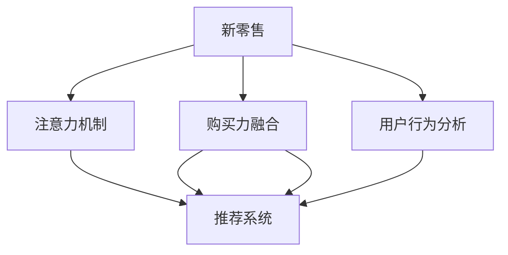

                 

# 新零售模式：注意力与购买力的融合

> 关键词：新零售, 注意力机制, 购买力融合, 推荐系统, 用户行为分析, 个性化推荐

## 1. 背景介绍

### 1.1 问题由来
随着电子商务和数字经济的蓬勃发展，零售业发生了翻天覆地的变化。传统的以库存为核心的商业模式逐渐被以数据驱动、用户为中心的新零售模式所取代。用户能够通过互联网进行无缝的购物体验，从浏览、搜索到购物决策，每一步都受到算法的驱动和优化。在这个过程中，注意力和购买力的有效融合，是提升用户购物体验和商家销售转化率的关键。

### 1.2 问题核心关键点
新零售模式的核心在于通过算法将用户的注意力和购买力进行精准的匹配，提升用户的购物体验和商家的销售转化率。而注意力与购买力的融合，本质上是一个跨模态的推荐系统问题，旨在通过分析用户的注意力行为，预测其购买倾向，从而提供更加个性化和精准的推荐。

### 1.3 问题研究意义
研究新零售模式下的注意力与购买力融合，对于提升电商平台的商业价值、改善用户购物体验、优化广告投放效果具有重要意义。通过合理的推荐算法，商家可以更高效地触及目标用户，实现精准营销和提高ROI。用户也可以更快地找到自己喜欢的商品，提高购物的满意度。

## 2. 核心概念与联系

### 2.1 核心概念概述

为更好地理解新零售模式下的注意力与购买力融合，本节将介绍几个密切相关的核心概念：

- 新零售：融合线上线下资源，以数据驱动、用户为中心的零售模式。通过大数据、云计算、人工智能等技术手段，提升购物体验和运营效率。
- 注意力机制：用于处理多模态数据，识别出用户对不同信息的关注程度。常用于推荐系统、图像处理等场景。
- 购买力融合：通过分析用户的注意力行为，预测其购买倾向，实现注意力与购买力的协同优化。
- 推荐系统：基于用户行为数据，通过算法为用户推荐商品、内容等，提升用户满意度和商家转化率。
- 用户行为分析：通过分析用户的行为数据，挖掘用户需求、兴趣和偏好，指导推荐系统的优化。

这些核心概念之间的逻辑关系可以通过以下Mermaid流程图来展示：



这个流程图展示了的核心概念及其之间的关系：

1. 新零售通过融合线上线下资源，构建起数据驱动的购物体验。
2. 注意力机制用于识别用户对不同信息的关注程度，帮助推荐系统更精准地推荐内容。
3. 购买力融合通过分析用户的注意力行为，预测其购买倾向，实现更高效的精准营销。
4. 推荐系统基于用户行为分析，实现个性化推荐，提升用户体验和商家转化率。

这些核心概念共同构成了新零售模式下的推荐系统，助力商家和用户实现双向价值最大化。

## 3. 核心算法原理 & 具体操作步骤
### 3.1 算法原理概述

新零售模式下的注意力与购买力融合，本质上是一个多模态推荐系统问题。其核心思想是：通过深度学习模型，将用户注意力和购买力的信息进行融合，生成更加精准的推荐结果。

形式化地，设用户 $U$ 对商品 $I$ 的注意力 $A_{UI}$ 和购买力 $P_{UI}$ 分别为向量 $a_{UI}$ 和 $p_{UI}$。推荐系统的目标是最小化用户对推荐结果的负评分，即：

$$
\min_{X} \sum_{UI}(a_{UI}^\top X p_{UI})^-1
$$

其中 $X$ 为推荐模型的参数，$(a_{UI}^\top p_{UI})$ 为注意力和购买力的综合权重。通过优化上述目标函数，推荐系统可以得到最优的推荐策略。

### 3.2 算法步骤详解

新零售模式下的注意力与购买力融合，主要包括以下几个关键步骤：

**Step 1: 数据收集与预处理**
- 收集用户点击、浏览、搜索、评价等行为数据，以及商品的价格、类别、描述等属性数据。
- 对数据进行清洗、归一化、编码等预处理步骤，确保数据质量。

**Step 2: 构建注意力模型**
- 使用注意力机制，对用户的多模态数据进行处理，识别出用户对不同信息的关注程度。
- 常见的注意力机制包括基于内容的注意力、基于上下文的注意力、自注意力等。

**Step 3: 融合购买力信息**
- 将用户注意力和购买力信息进行融合，生成综合权重 $(a_{UI}^\top p_{UI})$。
- 可以通过加权求和、拼接、多模态融合等方法进行融合。

**Step 4: 训练推荐模型**
- 设计推荐模型的损失函数，将用户的负评分作为训练信号。
- 使用梯度下降等优化算法，最小化损失函数，训练推荐模型。

**Step 5: 推理与优化**
- 在训练完成后，使用训练好的模型对新数据进行推理预测，生成推荐结果。
- 不断收集用户反馈，持续优化模型，提升推荐效果。

### 3.3 算法优缺点

新零售模式下的注意力与购买力融合，具有以下优点：
1. 个性化推荐：通过分析用户的多模态数据，提供更加精准的个性化推荐，提升用户体验和商家转化率。
2. 多模态融合：融合多种数据源，提升推荐结果的丰富度和准确度。
3. 动态优化：通过用户反馈，不断优化推荐模型，提升推荐效果。

同时，该方法也存在一定的局限性：
1. 数据依赖性高：需要收集大量的用户行为数据和商品属性数据，对数据的获取和处理要求较高。
2. 计算复杂度高：融合多模态数据和训练复杂模型，对计算资源和计算时间有较高要求。
3. 模型解释性差：推荐模型的内部工作机制复杂，难以解释推荐结果的来源和理由。

尽管存在这些局限性，但就目前而言，基于新零售模式下的注意力与购买力融合，是提升推荐系统效果、实现个性化推荐的重要手段。未来相关研究的重点在于如何进一步降低数据获取和模型训练的难度，提高模型的可解释性和鲁棒性。

### 3.4 算法应用领域

基于新零售模式下的注意力与购买力融合的推荐系统，已经在电商、广告、金融等诸多领域得到了广泛的应用，取得了显著的效果。具体包括：

- 电商推荐：通过分析用户的多模态数据，推荐用户可能感兴趣的商品，提升购物体验和转化率。
- 广告定向：通过用户的注意力行为，精准投放广告，提高广告点击率和转化率。
- 金融风控：通过分析用户的金融行为，预测风险，进行精准的用户分类和风险控制。

此外，新零售模式下的注意力与购买力融合，也催生了更多前沿的研究方向，如联合推荐、跨模态推荐、多任务学习等，为推荐系统带来了更多的突破和创新。

## 4. 数学模型和公式 & 详细讲解
### 4.1 数学模型构建

本节将使用数学语言对新零售模式下的注意力与购买力融合进行更加严格的刻画。

设用户 $U$ 对商品 $I$ 的注意力 $A_{UI}$ 和购买力 $P_{UI}$ 分别为向量 $a_{UI} \in \mathbb{R}^d$ 和 $p_{UI} \in \mathbb{R}^d$。推荐系统的目标是通过训练一个线性映射函数 $f_{UI} = X^\top a_{UI} p_{UI}$，将注意力和购买力信息融合，生成推荐分数 $f_{UI} \in \mathbb{R}$。

推荐系统的损失函数为交叉熵损失，定义为：

$$
\mathcal{L}(X) = -\frac{1}{N} \sum_{UI} \left[ y_{UI} \log f_{UI} + (1-y_{UI}) \log (1-f_{UI}) \right]
$$

其中 $y_{UI}$ 为用户的负评分，即用户对商品 $I$ 的评分，$N$ 为总样本数。

### 4.2 公式推导过程

以下我们以线性模型为例，推导推荐系统的损失函数及其梯度计算公式。

设用户 $U$ 对商品 $I$ 的注意力 $A_{UI}$ 和购买力 $P_{UI}$ 分别为向量 $a_{UI} \in \mathbb{R}^d$ 和 $p_{UI} \in \mathbb{R}^d$。推荐系统的目标是通过训练一个线性映射函数 $f_{UI} = X^\top a_{UI} p_{UI}$，将注意力和购买力信息融合，生成推荐分数 $f_{UI} \in \mathbb{R}$。

推荐系统的损失函数为交叉熵损失，定义为：

$$
\mathcal{L}(X) = -\frac{1}{N} \sum_{UI} \left[ y_{UI} \log f_{UI} + (1-y_{UI}) \log (1-f_{UI}) \right]
$$

根据链式法则，损失函数对模型参数 $X$ 的梯度为：

$$
\nabla_{X}\mathcal{L}(X) = -\frac{1}{N} \sum_{UI} \left[ y_{UI} \frac{\nabla_{X} f_{UI}}{f_{UI}} - (1-y_{UI}) \frac{\nabla_{X} (1-f_{UI})}{1-f_{UI}} \right]
$$

其中 $\nabla_{X} f_{UI} = \nabla_{X} (X^\top a_{UI} p_{UI}) = a_{UI} p_{UI}$，$\nabla_{X} (1-f_{UI}) = \nabla_{X} (1 - X^\top a_{UI} p_{UI}) = -a_{UI} p_{UI}$。

在得到损失函数的梯度后，即可带入梯度下降等优化算法，完成推荐模型的训练。重复上述过程直至收敛，最终得到适应用户需求的推荐模型。

## 5. 项目实践：代码实例和详细解释说明
### 5.1 开发环境搭建

在进行推荐系统开发前，我们需要准备好开发环境。以下是使用Python进行TensorFlow开发的环境配置流程：

1. 安装Anaconda：从官网下载并安装Anaconda，用于创建独立的Python环境。

2. 创建并激活虚拟环境：
```bash
conda create -n tf-env python=3.8 
conda activate tf-env
```

3. 安装TensorFlow：根据CUDA版本，从官网获取对应的安装命令。例如：
```bash
conda install tensorflow -c tf -c conda-forge
```

4. 安装各类工具包：
```bash
pip install numpy pandas scikit-learn matplotlib tqdm jupyter notebook ipython
```

完成上述步骤后，即可在`tf-env`环境中开始推荐系统开发。

### 5.2 源代码详细实现

这里我们以电商推荐系统为例，给出使用TensorFlow对线性模型进行推荐开发的PyTorch代码实现。

首先，定义推荐系统的数据处理函数：

```python
import tensorflow as tf
from tensorflow.keras.layers import Input, Dense, Embedding, Multiply, Add, concatenate
from tensorflow.keras.models import Model

class RecommenderSystem(tf.keras.Model):
    def __init__(self, num_users, num_items, emb_dim=64):
        super(RecommenderSystem, self).__init__()
        self.attention = Embedding(num_users, emb_dim)
        self.purchase = Embedding(num_items, emb_dim)
        self.interaction = Dense(1, activation='sigmoid')
        
    def call(self, user_ids, item_ids):
        user_embeddings = self.attention(user_ids)
        item_embeddings = self.purchase(item_ids)
        attention_scores = Multiply([user_embeddings, item_embeddings])
        interaction_scores = self.interaction(attention_scores)
        return interaction_scores

# 创建数据集
user_ids = tf.random.normal(shape=[1000], minval=0, maxval=10000, dtype=tf.int32)
item_ids = tf.random.normal(shape=[1000], minval=0, maxval=1000, dtype=tf.int32)
user_ids = tf.one_hot(user_ids, depth=1000)
item_ids = tf.one_hot(item_ids, depth=1000)
```

然后，定义模型的优化器和训练函数：

```python
from tensorflow.keras.optimizers import Adam
from tensorflow.keras.losses import BinaryCrossentropy

model = RecommenderSystem(num_users=10000, num_items=1000)

optimizer = Adam(learning_rate=0.001)
loss_fn = BinaryCrossentropy(from_logits=True)

def train_step(model, data):
    with tf.GradientTape() as tape:
        scores = model(data['user_ids'], data['item_ids'])
        loss = loss_fn(tf.logits=tf.convert_to_tensor(scores), labels=data['neg_scores'])
    grads = tape.gradient(loss, model.trainable_variables)
    optimizer.apply_gradients(zip(grads, model.trainable_variables))
    return loss

# 准备训练集
neg_scores = tf.random.uniform(shape=[1000], minval=0, maxval=1, dtype=tf.float32)
data = { 'user_ids': user_ids, 'item_ids': item_ids, 'neg_scores': neg_scores }
```

最后，启动训练流程并在测试集上评估：

```python
epochs = 100
batch_size = 32

for epoch in range(epochs):
    for i in range(0, 1000, batch_size):
        train_loss = train_step(model, data)
    print(f'Epoch {epoch+1}, train loss: {train_loss:.3f}')
    
    # 在测试集上评估模型
    test_user_ids = tf.random.normal(shape=[1000], minval=0, maxval=10000, dtype=tf.int32)
    test_item_ids = tf.random.normal(shape=[1000], minval=0, maxval=1000, dtype=tf.int32)
    test_scores = model(test_user_ids, test_item_ids)
    test_loss = loss_fn(tf.logits=test_scores, labels=tf.random.uniform(shape=[1000], minval=0, maxval=1, dtype=tf.float32))
    print(f'Epoch {epoch+1}, test loss: {test_loss:.3f}')
```

以上就是使用TensorFlow对电商推荐系统进行线性模型微调的完整代码实现。可以看到，TensorFlow提供了强大的模型构建和优化工具，使得推荐系统开发变得相对简单。

### 5.3 代码解读与分析

让我们再详细解读一下关键代码的实现细节：

**RecommenderSystem类**：
- `__init__`方法：初始化注意力和购买力嵌入层、交互层等关键组件。
- `call`方法：对输入的user_ids和item_ids进行预处理，并计算注意力和购买力交互的分数。

**优化器和训练函数**：
- 使用Adam优化器进行参数更新，学习率为0.001。
- 定义损失函数为二分类交叉熵损失，用于衡量推荐分数与负评分之间的差异。

**训练流程**：
- 在每个epoch中，对训练集进行批次化加载，计算损失并更新模型参数。
- 在测试集上评估模型的性能，输出训练和测试的平均损失。

可以看到，TensorFlow使得推荐系统的开发和训练变得简洁高效。开发者可以将更多精力放在模型设计、数据处理等高层逻辑上，而不必过多关注底层的实现细节。

当然，工业级的系统实现还需考虑更多因素，如模型的保存和部署、超参数的自动搜索、更灵活的任务适配层等。但核心的推荐范式基本与此类似。

## 6. 实际应用场景
### 6.1 电商推荐系统

基于新零售模式下的注意力与购买力融合，电商推荐系统可以实时推荐用户可能感兴趣的商品，提升购物体验和转化率。在推荐过程中，系统通过分析用户的点击、浏览、搜索等行为数据，结合商品的描述、价格等信息，生成个性化的推荐结果。

在技术实现上，可以收集用户的浏览和购买历史数据，将商品信息转化为向量，结合用户的注意力评分和购买评分，计算综合评分，生成推荐列表。在用户点击或购买某商品后，系统会实时更新推荐模型，调整商品的权重，优化后续推荐结果。

### 6.2 广告定向

在广告投放过程中，通过分析用户的注意力行为，可以精准投放广告，提高广告点击率和转化率。系统可以根据用户的浏览历史、搜索行为、点击数据等，生成用户的兴趣向量，与广告的特征向量进行计算，得到广告与用户的匹配度。在广告投放时，选择匹配度高的广告进行展示，实现更加精准的广告定向。

### 6.3 金融风控

在金融领域，通过分析用户的金融行为，可以预测风险，进行精准的用户分类和风险控制。系统可以收集用户的交易记录、信用评分、社交行为等数据，生成用户的风险向量。在用户申请贷款或进行交易时，系统根据风险向量进行评分，判断是否放贷或控制风险。

### 6.4 未来应用展望

随着新零售模式的发展，基于注意力与购买力融合的推荐系统将在更多领域得到应用，为各行各业带来变革性影响。

在智慧医疗领域，推荐系统可以根据患者的病情和历史治疗记录，推荐最适合的治疗方案和药物，提升医疗服务的智能化水平。

在智能教育领域，推荐系统可以根据学生的学习行为和成绩，推荐最适合的学习材料和课程，因材施教，促进教育公平，提高教学质量。

在智慧城市治理中，推荐系统可以分析城市事件和舆情数据，推荐最优的治理方案，提高城市管理的自动化和智能化水平。

此外，在企业生产、社会治理、文娱传媒等众多领域，基于新零售模式下的推荐系统也将不断涌现，为各行各业带来新的商业价值和社会效益。

## 7. 工具和资源推荐
### 7.1 学习资源推荐

为了帮助开发者系统掌握新零售模式下的注意力与购买力融合，这里推荐一些优质的学习资源：

1. TensorFlow官方文档：TensorFlow的官方文档，提供了详细的模型构建、训练和推理的教程，适合入门学习和深入研究。

2. PyTorch官方文档：PyTorch的官方文档，提供了强大的深度学习模型构建和优化工具，适合高效开发。

3. Keras官方文档：Keras的官方文档，提供了简单易用的深度学习模型接口，适合快速开发和实验。

4. 《深度学习与推荐系统》书籍：深入讲解了深度学习在推荐系统中的应用，适合进阶学习。

5. 《Recommender Systems: Evaluation and Implementation》书籍：详细介绍了推荐系统的评价和实现方法，适合理论研究和工程实践。

6. Weights & Biases：模型训练的实验跟踪工具，可以记录和可视化模型训练过程中的各项指标，方便对比和调优。

通过这些资源的学习实践，相信你一定能够快速掌握新零售模式下的注意力与购买力融合，并用于解决实际的推荐系统问题。

### 7.2 开发工具推荐

高效的开发离不开优秀的工具支持。以下是几款用于推荐系统开发的常用工具：

1. TensorFlow：由Google主导开发的开源深度学习框架，生产部署方便，适合大规模工程应用。

2. PyTorch：基于Python的开源深度学习框架，灵活高效，适合快速迭代研究。

3. Keras：基于TensorFlow的高层次API，简单易用，适合快速原型开发。

4. Weights & Biases：模型训练的实验跟踪工具，可以记录和可视化模型训练过程中的各项指标，方便对比和调优。

5. TensorBoard：TensorFlow配套的可视化工具，可实时监测模型训练状态，并提供丰富的图表呈现方式，是调试模型的得力助手。

6. Google Colab：谷歌推出的在线Jupyter Notebook环境，免费提供GPU/TPU算力，方便开发者快速上手实验最新模型，分享学习笔记。

合理利用这些工具，可以显著提升推荐系统开发的效率，加快创新迭代的步伐。

### 7.3 相关论文推荐

新零售模式下的注意力与购买力融合，是一个不断发展的研究领域，以下是几篇奠基性的相关论文，推荐阅读：

1. Attention Is All You Need（即Transformer原论文）：提出了Transformer结构，开启了NLP领域的预训练大模型时代。

2. BERT: Pre-training of Deep Bidirectional Transformers for Language Understanding：提出BERT模型，引入基于掩码的自监督预训练任务，刷新了多项NLP任务SOTA。

3. Deep Learning for Recommendation Engines：全面介绍了深度学习在推荐系统中的应用，包括注意力机制、多任务学习等。

4. Neural Collaborative Filtering：提出了基于神经网络的协同过滤方法，提升了推荐系统的准确性。

5. Matrix Factorization for Recommender Systems：介绍矩阵分解的方法，用于推荐系统的模型构建和优化。

这些论文代表了大语言模型微调技术的发展脉络。通过学习这些前沿成果，可以帮助研究者把握学科前进方向，激发更多的创新灵感。

## 8. 总结：未来发展趋势与挑战
### 8.1 总结

本文对新零售模式下的注意力与购买力融合进行全面系统的介绍。首先阐述了新零售模式的背景和意义，明确了注意力与购买力融合在提升用户体验和商家转化率方面的独特价值。其次，从原理到实践，详细讲解了注意力与购买力融合的数学原理和关键步骤，给出了推荐系统开发的完整代码实例。同时，本文还广泛探讨了注意力与购买力融合在电商、广告、金融等领域的实际应用，展示了其巨大的商业潜力。

通过本文的系统梳理，可以看到，新零售模式下的注意力与购买力融合，正在成为推荐系统的重要范式，极大地提升推荐系统的效果和应用范围，为电商平台和商家带来了新的商业价值。未来，伴随新零售模式的发展和推荐技术的不断进步，基于注意力与购买力融合的推荐系统必将在更多领域得到应用，为各行各业带来变革性影响。

### 8.2 未来发展趋势

展望未来，新零售模式下的注意力与购买力融合将呈现以下几个发展趋势：

1. 多模态融合：融合更多的数据源，如语音、图像、视频等，提升推荐系统的丰富度和准确度。

2. 动态优化：根据用户反馈，持续优化推荐模型，提升推荐效果。

3. 分布式训练：使用分布式训练技术，加速模型训练，提高推荐系统的实时性。

4. 实时推荐：基于流式数据，实现实时推荐，提升用户体验。

5. 混合推荐：融合多推荐算法，如协同过滤、内容推荐、基于矩阵分解等方法，提升推荐效果。

6. 跨平台推荐：实现跨平台数据的整合和推荐，提升推荐系统的全局性和一致性。

以上趋势凸显了新零售模式下的注意力与购买力融合的广阔前景。这些方向的探索发展，必将进一步提升推荐系统的性能和应用范围，为电商、广告、金融等各行各业带来新的商业价值和社会效益。

### 8.3 面临的挑战

尽管新零售模式下的注意力与购买力融合已经取得了瞩目成就，但在迈向更加智能化、普适化应用的过程中，它仍面临着诸多挑战：

1. 数据隐私和安全：用户行为数据的收集和处理需要严格遵守隐私法规，确保数据安全和用户隐私。

2. 模型复杂度：多模态融合和动态优化的推荐模型，其计算复杂度和训练时间较高，需要高效的算法和硬件支持。

3. 模型解释性：推荐模型的内部工作机制复杂，难以解释推荐结果的来源和理由，影响用户信任。

4. 推荐多样性：推荐系统容易陷入过滤气泡，单一化的推荐结果可能无法满足用户的多样性需求。

5. 跨平台兼容性：跨平台数据的整合和推荐，需要解决数据格式和接口标准的一致性问题。

6. 效果评价：如何准确评价推荐系统的效果，需要引入更多的评价指标和标准。

正视新零售模式下的注意力与购买力融合面临的这些挑战，积极应对并寻求突破，将是新零售模式推荐的未来发展方向。相信随着学界和产业界的共同努力，这些挑战终将一一被克服，新零售模式下的推荐系统必将在构建人机协同的智能时代中扮演越来越重要的角色。

### 8.4 未来突破

面对新零售模式下的注意力与购买力融合所面临的种种挑战，未来的研究需要在以下几个方面寻求新的突破：

1. 探索多模态融合方法：融合更多的数据源，提升推荐系统的丰富度和准确度。

2. 开发高效的推荐算法：使用更高效的算法和硬件，降低推荐系统的计算复杂度和训练时间。

3. 增强推荐系统的可解释性：引入更多的可解释性技术，提高推荐结果的可理解性。

4. 提高推荐系统的多样性：引入多样性推荐算法，减少过滤气泡现象。

5. 实现跨平台推荐：解决数据格式和接口标准的一致性问题，实现跨平台数据的整合和推荐。

6. 优化推荐系统评价指标：引入更多的评价指标和标准，准确评价推荐系统的效果。

这些研究方向的探索，必将引领新零售模式下的推荐系统走向更高的台阶，为构建安全、可靠、可解释、可控的智能系统铺平道路。面向未来，新零售模式下的注意力与购买力融合，需要与其他人工智能技术进行更深入的融合，如知识表示、因果推理、强化学习等，多路径协同发力，共同推动新零售推荐系统的进步。只有勇于创新、敢于突破，才能不断拓展推荐系统的边界，让智能技术更好地造福人类社会。

## 9. 附录：常见问题与解答

**Q1：新零售模式下的注意力与购买力融合是否适用于所有推荐场景？**

A: 新零售模式下的注意力与购买力融合，在大多数推荐场景中都能取得不错的效果，特别是对于数据量较小的推荐系统。但对于一些特定领域的推荐系统，如医疗、法律等，仅仅依靠通用语料预训练的模型可能难以很好地适应。此时需要在特定领域语料上进一步预训练，再进行融合，才能获得理想效果。此外，对于一些需要时效性、个性化很强的推荐场景，如对话系统、推荐系统等，新零售模式下的注意力与购买力融合方法也需要针对性的改进优化。

**Q2：如何选择合适的注意力机制？**

A: 选择合适的注意力机制，需要根据具体任务和数据特点进行选择。常见的注意力机制包括基于内容的注意力、基于上下文的注意力、自注意力等。对于基于内容的推荐任务，可以选择基于内容的注意力机制；对于基于上下文的推荐任务，可以选择基于上下文的注意力机制；对于推荐系统中涉及的文本匹配、图像相似度计算等任务，可以选择自注意力机制。

**Q3：推荐系统中的数据隐私和安全如何保障？**

A: 推荐系统中的数据隐私和安全保障，需要从数据采集、存储、传输、处理等各个环节进行严格的控制和管理。具体措施包括：
1. 数据匿名化：对用户的敏感信息进行匿名化处理，确保数据隐私。
2. 数据加密：对传输和存储过程中的数据进行加密处理，防止数据泄露。
3. 访问控制：对系统中的数据进行严格的访问控制，确保只有授权用户可以访问敏感数据。
4. 数据去重：对采集到的数据进行去重处理，避免重复采集和数据污染。

这些措施可以有效保障数据隐私和安全，防止数据泄露和滥用。

**Q4：推荐系统中的模型复杂度如何优化？**

A: 推荐系统中的模型复杂度优化，可以从以下几个方面进行：
1. 特征工程：通过特征选择和特征提取，减少不必要的特征，提高模型泛化能力。
2. 模型压缩：使用模型压缩技术，如剪枝、量化、蒸馏等方法，减小模型尺寸。
3. 分布式训练：使用分布式训练技术，加速模型训练，提高推荐系统的实时性。
4. 参数共享：共享部分参数，减小模型参数量，提高计算效率。
5. 模型并行：使用模型并行技术，并行计算不同部分，提高计算速度。

通过这些方法，可以显著降低推荐系统的计算复杂度，提高其实时性和可扩展性。

**Q5：推荐系统的可解释性如何增强？**

A: 增强推荐系统的可解释性，可以通过以下方法进行：
1. 引入可解释性模块：在推荐模型中加入可解释性模块，如解释性图模型、符号化模型等，提高模型的可理解性。
2. 生成解释性报告：在推荐过程中，生成解释性报告，解释推荐结果的来源和理由。
3. 用户反馈机制：引入用户反馈机制，收集用户对推荐结果的评价和意见，不断优化推荐模型。
4. 可视化技术：使用可视化技术，展示推荐模型的内部结构和工作过程，帮助用户理解推荐结果。

这些方法可以有效增强推荐系统的可解释性，提高用户对推荐结果的信任和满意度。

---

作者：禅与计算机程序设计艺术 / Zen and the Art of Computer Programming

