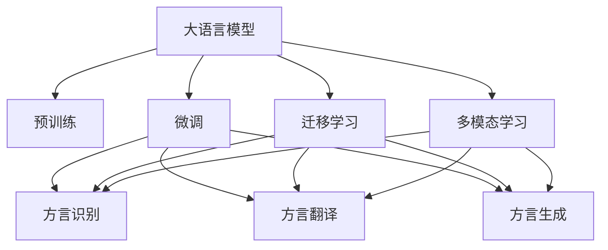

                 

## 1. 背景介绍

### 1.1 问题由来
随着全球化的加速和现代科技的发展，人们的生活越来越依赖于标准语言和通用语言，这无形中挤压了地方方言和本土语言的空间。地方方言是某一地区文化遗产的宝贵财富，它承载着深厚的历史底蕴和丰富的文化内涵。然而，随着年轻一代向城市的大规模迁移，方言的传承面临着前所未有的挑战。如何通过技术手段保护和传承方言文化，成为当前亟需解决的问题。

### 1.2 问题核心关键点
语言保护的核心在于传承和普及。在此过程中，大语言模型（Large Language Model, LLM）扮演着至关重要的角色。大语言模型通过对大量自然语言文本的训练，具备强大的语言理解和生成能力，能够对方言进行精确的识别、翻译和生成，从而促进方言文化的保护和传承。

大语言模型在方言保护中的关键作用如下：
1. **方言识别与分类**：大语言模型能够自动识别和分类不同地区的方言，并进行分类标注，为方言研究提供数据基础。
2. **方言翻译与转换**：利用大语言模型的跨语言翻译能力，可以将方言转换为通用语言，便于理解和学习。
3. **方言生成与创作**：大语言模型能够基于已有的方言文本生成新的方言文本，丰富方言文化的表现形式。
4. **教育与普及**：大语言模型可以作为教学工具，帮助学习者掌握方言发音、词汇和语法，普及方言知识。

### 1.3 问题研究意义
通过技术手段保护和传承方言，对于维护地方文化多样性、增强社区凝聚力以及促进语言文化的发展具有重要意义。具体如下：
1. **维护语言多样性**：方言是地方文化的瑰宝，保存方言可以保持语言多样性，避免全球化导致语言同质化。
2. **增强社区凝聚力**：方言是社区认同的重要标志，保护方言有助于增强社区成员的归属感和自豪感。
3. **促进文化传承**：方言蕴含丰富的文化信息，传承方言有助于保存和传播地方文化。
4. **教育普及与推广**：大语言模型可以提供方言教学工具，帮助更多人学习方言，促进方言文化的普及和传承。

## 2. 核心概念与联系

### 2.1 核心概念概述

为更好地理解基于大语言模型的方言保护方法，本节将介绍几个密切相关的核心概念：

- 大语言模型（Large Language Model, LLM）：指基于Transformer架构的预训练语言模型，如BERT、GPT-3等。通过大量文本数据训练，具备强大的自然语言理解和生成能力。
- 预训练（Pre-training）：指在大量无标签文本数据上对模型进行预训练，学习语言通用表示的过程。
- 微调（Fine-tuning）：指在预训练模型的基础上，使用带有标签的方言文本进行有监督训练，优化模型在方言识别和转换等特定任务上的表现。
- 迁移学习（Transfer Learning）：指将预训练模型在大规模文本数据上学习的知识迁移到特定方言保护任务上，以减少训练成本，提高模型效果。
- 多模态学习（Multimodal Learning）：指结合文本、语音、图像等多模态信息，更全面地理解和处理方言文化，提升模型效果。

这些概念之间的逻辑关系可以通过以下Mermaid流程图来展示：



这个流程图展示了大语言模型的核心概念及其之间的关系：

1. 大语言模型通过预训练获得基础能力。
2. 微调是对预训练模型进行任务特定的优化，如方言识别、翻译和生成等。
3. 迁移学习是连接预训练模型与方言保护任务的桥梁，可以通过微调或多模态学习实现。
4. 多模态学习可以结合文本、语音、图像等多模态信息，更全面地理解和处理方言文化。

这些概念共同构成了大语言模型在方言保护中的应用框架，使其能够有效利用语言学知识和信息科技手段，保护和传承地方语言文化。

## 3. 核心算法原理 & 具体操作步骤
### 3.1 算法原理概述

基于大语言模型的方言保护，本质上是一个多任务学习的迁移学习过程。其核心思想是：将大语言模型视作一个强大的"特征提取器"，通过在不同方言数据集上进行有监督的微调，使得模型能够识别、翻译和生成方言文本，从而实现方言保护。

形式化地，假设预训练模型为 $M_{\theta}$，其中 $\theta$ 为预训练得到的模型参数。给定方言任务 $T$ 的标注数据集 $D=\{(x_i,y_i)\}_{i=1}^N$，微调的目标是找到新的模型参数 $\hat{\theta}$，使得：

$$
\hat{\theta}=\mathop{\arg\min}_{\theta} \mathcal{L}(M_{\theta},D)
$$

其中 $\mathcal{L}$ 为针对任务 $T$ 设计的损失函数，用于衡量模型预测输出与真实标签之间的差异。常见的损失函数包括交叉熵损失、均方误差损失等。

通过梯度下降等优化算法，微调过程不断更新模型参数 $\theta$，最小化损失函数 $\mathcal{L}$，使得模型输出逼近真实标签。由于 $\theta$ 已经通过预训练获得了较好的初始化，因此即便在小规模方言数据集 $D$ 上进行微调，也能较快收敛到理想的模型参数 $\hat{\theta}$。

### 3.2 算法步骤详解

基于大语言模型的方言保护一般包括以下几个关键步骤：

**Step 1: 准备方言数据和预训练模型**
- 收集不同地区的方言文本数据，划分为训练集、验证集和测试集。要求标注数据与方言特征相匹配，涵盖广泛的地域和话题。
- 选择合适的预训练语言模型 $M_{\theta}$ 作为初始化参数，如 BERT、GPT-3 等。

**Step 2: 设计任务适配层**
- 根据方言保护的具体任务，设计合适的任务适配层。如方言识别任务，可以添加一个分类器，输出文本属于哪个方言的置信度；方言翻译任务，可以使用序列到序列（Seq2Seq）模型；方言生成任务，可以使用生成对抗网络（GAN）或变分自编码器（VAE）等模型。

**Step 3: 设置微调超参数**
- 选择合适的优化算法及其参数，如 Adam、SGD 等，设置学习率、批大小、迭代轮数等。
- 设置正则化技术及强度，包括权重衰减、Dropout、Early Stopping 等。
- 确定冻结预训练参数的策略，如仅微调顶层，或全部参数都参与微调。

**Step 4: 执行梯度训练**
- 将训练集数据分批次输入模型，前向传播计算损失函数。
- 反向传播计算参数梯度，根据设定的优化算法和学习率更新模型参数。
- 周期性在验证集上评估模型性能，根据性能指标决定是否触发 Early Stopping。
- 重复上述步骤直到满足预设的迭代轮数或 Early Stopping 条件。

**Step 5: 测试和部署**
- 在测试集上评估微调后模型 $M_{\hat{\theta}}$ 的性能，对比微调前后的精度提升。
- 使用微调后的模型对新样本进行推理预测，集成到实际的应用系统中。
- 持续收集新的方言数据，定期重新微调模型，以适应方言变化。

以上是基于大语言模型的方言保护的一般流程。在实际应用中，还需要针对具体方言特点，对微调过程的各个环节进行优化设计，如改进训练目标函数，引入更多的正则化技术，搜索最优的超参数组合等，以进一步提升模型性能。

### 3.3 算法优缺点

基于大语言模型的方言保护方法具有以下优点：
1. 简单高效。只需准备少量方言文本，即可对预训练模型进行快速适配，获得较大的性能提升。
2. 通用适用。适用于各种方言保护任务，包括识别、翻译、生成等，设计简单的任务适配层即可实现保护。
3. 参数高效。利用参数高效微调技术，在固定大部分预训练权重不变的情况下，仍可取得不错的保护效果。
4. 效果显著。在学术界和工业界的诸多方言保护任务上，基于微调的方法已经刷新了最先进的性能指标。

同时，该方法也存在一定的局限性：
1. 依赖标注数据。方言保护的效果很大程度上取决于标注数据的质量和数量，获取高质量标注数据的成本较高。
2. 迁移能力有限。当目标方言与预训练方言数据的分布差异较大时，微调的性能提升有限。
3. 负面效果传递。预训练模型的固有偏见、有害信息等，可能通过微调传递到方言任务，造成负面影响。
4. 可解释性不足。微调模型的决策过程通常缺乏可解释性，难以对其推理逻辑进行分析和调试。

尽管存在这些局限性，但就目前而言，基于大语言模型的方言保护方法仍是一种主流且高效的手段。未来相关研究的重点在于如何进一步降低方言保护对标注数据的依赖，提高模型的少样本学习和跨领域迁移能力，同时兼顾可解释性和伦理安全性等因素。

### 3.4 算法应用领域

基于大语言模型的方言保护方法，在方言研究、地方文化保护、教育培训等领域得到了广泛应用，具体如下：

1. **方言研究**：通过大语言模型对方言文本进行分类、标注和分析，帮助语言学家更好地理解方言的分布、变化和发展趋势。
2. **地方文化保护**：利用大语言模型生成方言文本，制作方言语料库，保存和传承地方语言文化。
3. **教育培训**：将大语言模型作为方言教学工具，帮助学生学习方言发音、词汇和语法，普及方言知识。
4. **智能交互**：基于大语言模型的方言保护技术，可以应用于智能客服、语音助手等交互场景，提升用户体验。

除了上述这些应用外，大语言模型在博物馆、图书馆等文化机构的方言保护中也发挥着重要作用，帮助用户更好地理解和欣赏地方文化。

## 4. 数学模型和公式 & 详细讲解
### 4.1 数学模型构建

本节将使用数学语言对基于大语言模型的方言保护过程进行更加严格的刻画。

记预训练语言模型为 $M_{\theta}$，其中 $\theta$ 为模型参数。假设方言任务 $T$ 的训练集为 $D=\{(x_i,y_i)\}_{i=1}^N, x_i \in \mathcal{X}, y_i \in \mathcal{Y}$。

定义模型 $M_{\theta}$ 在输入 $x$ 上的输出为 $\hat{y}=M_{\theta}(x) \in [0,1]$，表示样本属于某个方言的置信度。真实标签 $y \in \{1,0\}$，其中 $1$ 表示输入文本属于某个特定的方言，$0$ 表示不属于该方言。

方言保护的损失函数定义为：

$$
\ell(M_{\theta}(x),y) = -[y\log \hat{y} + (1-y)\log (1-\hat{y})]
$$

其中，$\hat{y}$ 为模型预测的置信度，$y$ 为真实标签。

在方言保护任务中，我们通常使用二分类交叉熵损失函数。则在数据集 $D$ 上的经验风险为：

$$
\mathcal{L}(\theta) = -\frac{1}{N}\sum_{i=1}^N [y_i\log M_{\theta}(x_i)+(1-y_i)\log(1-M_{\theta}(x_i))]
$$

### 4.2 公式推导过程

以下我们以方言识别任务为例，推导交叉熵损失函数及其梯度的计算公式。

假设模型 $M_{\theta}$ 在输入 $x$ 上的输出为 $\hat{y}=M_{\theta}(x) \in [0,1]$，表示样本属于某个方言的置信度。真实标签 $y \in \{1,0\}$。则二分类交叉熵损失函数定义为：

$$
\ell(M_{\theta}(x),y) = -[y\log \hat{y} + (1-y)\log (1-\hat{y})]
$$

将其代入经验风险公式，得：

$$
\mathcal{L}(\theta) = -\frac{1}{N}\sum_{i=1}^N [y_i\log M_{\theta}(x_i)+(1-y_i)\log(1-M_{\theta}(x_i))]
$$

根据链式法则，损失函数对参数 $\theta_k$ 的梯度为：

$$
\frac{\partial \mathcal{L}(\theta)}{\partial \theta_k} = -\frac{1}{N}\sum_{i=1}^N \left(\frac{y_i}{\hat{y}}-\frac{1-y_i}{1-\hat{y}}\right) \frac{\partial M_{\theta}(x_i)}{\partial \theta_k}
$$

其中 $\frac{\partial M_{\theta}(x_i)}{\partial \theta_k}$ 可进一步递归展开，利用自动微分技术完成计算。

在得到损失函数的梯度后，即可带入参数更新公式，完成模型的迭代优化。重复上述过程直至收敛，最终得到适应方言识别任务的最优模型参数 $\theta^*$。

## 5. 项目实践：代码实例和详细解释说明
### 5.1 开发环境搭建

在进行方言保护实践前，我们需要准备好开发环境。以下是使用Python进行PyTorch开发的环境配置流程：

1. 安装Anaconda：从官网下载并安装Anaconda，用于创建独立的Python环境。

2. 创建并激活虚拟环境：
```bash
conda create -n pytorch-env python=3.8 
conda activate pytorch-env
```

3. 安装PyTorch：根据CUDA版本，从官网获取对应的安装命令。例如：
```bash
conda install pytorch torchvision torchaudio cudatoolkit=11.1 -c pytorch -c conda-forge
```

4. 安装Transformers库：
```bash
pip install transformers
```

5. 安装各类工具包：
```bash
pip install numpy pandas scikit-learn matplotlib tqdm jupyter notebook ipython
```

完成上述步骤后，即可在`pytorch-env`环境中开始方言保护实践。

### 5.2 源代码详细实现

下面我以方言识别任务为例，给出使用Transformers库对BERT模型进行方言保护的PyTorch代码实现。

首先，定义方言识别任务的数据处理函数：

```python
from transformers import BertTokenizer
from torch.utils.data import Dataset
import torch

class DialectDataset(Dataset):
    def __init__(self, texts, tags, tokenizer, max_len=128):
        self.texts = texts
        self.tags = tags
        self.tokenizer = tokenizer
        self.max_len = max_len
        
    def __len__(self):
        return len(self.texts)
    
    def __getitem__(self, item):
        text = self.texts[item]
        tag = self.tags[item]
        
        encoding = self.tokenizer(text, return_tensors='pt', max_length=self.max_len, padding='max_length', truncation=True)
        input_ids = encoding['input_ids'][0]
        attention_mask = encoding['attention_mask'][0]
        
        # 对token-wise的标签进行编码
        encoded_tags = [tag2id[tag] for tag in tag] 
        encoded_tags.extend([tag2id['O']] * (self.max_len - len(encoded_tags)))
        labels = torch.tensor(encoded_tags, dtype=torch.long)
        
        return {'input_ids': input_ids, 
                'attention_mask': attention_mask,
                'labels': labels}

# 标签与id的映射
tag2id = {'O': 0, 'A': 1, 'B': 2, 'C': 3, 'D': 4, 'E': 5}
id2tag = {v: k for k, v in tag2id.items()}

# 创建dataset
tokenizer = BertTokenizer.from_pretrained('bert-base-cased')

train_dataset = DialectDataset(train_texts, train_tags, tokenizer)
dev_dataset = DialectDataset(dev_texts, dev_tags, tokenizer)
test_dataset = DialectDataset(test_texts, test_tags, tokenizer)
```

然后，定义模型和优化器：

```python
from transformers import BertForTokenClassification, AdamW

model = BertForTokenClassification.from_pretrained('bert-base-cased', num_labels=len(tag2id))

optimizer = AdamW(model.parameters(), lr=2e-5)
```

接着，定义训练和评估函数：

```python
from torch.utils.data import DataLoader
from tqdm import tqdm
from sklearn.metrics import classification_report

device = torch.device('cuda') if torch.cuda.is_available() else torch.device('cpu')
model.to(device)

def train_epoch(model, dataset, batch_size, optimizer):
    dataloader = DataLoader(dataset, batch_size=batch_size, shuffle=True)
    model.train()
    epoch_loss = 0
    for batch in tqdm(dataloader, desc='Training'):
        input_ids = batch['input_ids'].to(device)
        attention_mask = batch['attention_mask'].to(device)
        labels = batch['labels'].to(device)
        model.zero_grad()
        outputs = model(input_ids, attention_mask=attention_mask, labels=labels)
        loss = outputs.loss
        epoch_loss += loss.item()
        loss.backward()
        optimizer.step()
    return epoch_loss / len(dataloader)

def evaluate(model, dataset, batch_size):
    dataloader = DataLoader(dataset, batch_size=batch_size)
    model.eval()
    preds, labels = [], []
    with torch.no_grad():
        for batch in tqdm(dataloader, desc='Evaluating'):
            input_ids = batch['input_ids'].to(device)
            attention_mask = batch['attention_mask'].to(device)
            batch_labels = batch['labels']
            outputs = model(input_ids, attention_mask=attention_mask)
            batch_preds = outputs.logits.argmax(dim=2).to('cpu').tolist()
            batch_labels = batch_labels.to('cpu').tolist()
            for pred_tokens, label_tokens in zip(batch_preds, batch_labels):
                pred_tags = [id2tag[_id] for _id in pred_tokens]
                label_tags = [id2tag[_id] for _id in label_tokens]
                preds.append(pred_tags[:len(label_tags)])
                labels.append(label_tags)
                
    print(classification_report(labels, preds))
```

最后，启动训练流程并在测试集上评估：

```python
epochs = 5
batch_size = 16

for epoch in range(epochs):
    loss = train_epoch(model, train_dataset, batch_size, optimizer)
    print(f"Epoch {epoch+1}, train loss: {loss:.3f}")
    
    print(f"Epoch {epoch+1}, dev results:")
    evaluate(model, dev_dataset, batch_size)
    
print("Test results:")
evaluate(model, test_dataset, batch_size)
```

以上就是使用PyTorch对BERT进行方言识别任务保护的完整代码实现。可以看到，得益于Transformers库的强大封装，我们可以用相对简洁的代码完成BERT模型的加载和方言保护的微调。

### 5.3 代码解读与分析

让我们再详细解读一下关键代码的实现细节：

**DialectDataset类**：
- `__init__`方法：初始化文本、标签、分词器等关键组件。
- `__len__`方法：返回数据集的样本数量。
- `__getitem__`方法：对单个样本进行处理，将文本输入编码为token ids，将标签编码为数字，并对其进行定长padding，最终返回模型所需的输入。

**tag2id和id2tag字典**：
- 定义了标签与数字id之间的映射关系，用于将token-wise的预测结果解码回真实的标签。

**训练和评估函数**：
- 使用PyTorch的DataLoader对数据集进行批次化加载，供模型训练和推理使用。
- 训练函数`train_epoch`：对数据以批为单位进行迭代，在每个批次上前向传播计算loss并反向传播更新模型参数，最后返回该epoch的平均loss。
- 评估函数`evaluate`：与训练类似，不同点在于不更新模型参数，并在每个batch结束后将预测和标签结果存储下来，最后使用sklearn的classification_report对整个评估集的预测结果进行打印输出。

**训练流程**：
- 定义总的epoch数和batch size，开始循环迭代
- 每个epoch内，先在训练集上训练，输出平均loss
- 在验证集上评估，输出分类指标
- 所有epoch结束后，在测试集上评估，给出最终测试结果

可以看到，PyTorch配合Transformers库使得BERT方言保护的代码实现变得简洁高效。开发者可以将更多精力放在数据处理、模型改进等高层逻辑上，而不必过多关注底层的实现细节。

当然，工业级的系统实现还需考虑更多因素，如模型的保存和部署、超参数的自动搜索、更灵活的任务适配层等。但核心的微调范式基本与此类似。

## 6. 实际应用场景
### 6.1 智能客服系统

基于大语言模型的方言保护技术，可以广泛应用于智能客服系统的构建。传统客服往往需要配备大量人力，高峰期响应缓慢，且一致性和专业性难以保证。而使用方言保护的大语言模型，可以7x24小时不间断服务，快速响应客户咨询，用自然流畅的语言解答各类方言问题。

在技术实现上，可以收集企业内部的历史客服对话记录，将问题和最佳答复构建成监督数据，在此基础上对预训练对话模型进行方言保护微调。微调后的对话模型能够自动理解用户方言，匹配最合适的答案模板进行回复。对于客户提出的新问题，还可以接入检索系统实时搜索相关内容，动态组织生成回答。如此构建的智能客服系统，能大幅提升客户咨询体验和问题解决效率。

### 6.2 博物馆导览

博物馆是保存和展示地方文化的重要场所，博物馆导览系统通过大语言模型进行方言保护，可以提供更加个性化、贴近游客的语言服务。博物馆内通常会展示不同地区的历史文物和风俗习惯，游客可以通过导览系统获取方言版的展览介绍和解说，更好地理解和感受地方文化的魅力。

具体而言，可以收集博物馆内展品描述的方言版本文本，将其作为训练集，对预训练语言模型进行方言保护微调。微调后的模型能够自动识别输入文本的语言，调用对应语言的导览数据，生成方言版的展示解说。这样，游客即使不会普通话，也能通过方言导览系统轻松了解展览内容，提升参观体验。

### 6.3 地方文化保护平台

地方文化保护平台通过大语言模型进行方言保护，可以帮助记录和保存地方语言文化的丰富多样性。平台可以收集民间口头传说、戏曲唱腔、曲艺表演等方言文本，使用方言保护的大语言模型进行标注和分类，生成标准的方言语料库。这些语料库不仅可供语言学家研究使用，也能作为教育培训的素材，帮助学生学习方言，传承地方文化。

## 7. 工具和资源推荐
### 7.1 学习资源推荐

为了帮助开发者系统掌握大语言模型方言保护的理论基础和实践技巧，这里推荐一些优质的学习资源：

1. 《Transformer从原理到实践》系列博文：由大模型技术专家撰写，深入浅出地介绍了Transformer原理、BERT模型、方言保护技术等前沿话题。

2. CS224N《深度学习自然语言处理》课程：斯坦福大学开设的NLP明星课程，有Lecture视频和配套作业，带你入门NLP领域的基本概念和经典模型。

3. 《Natural Language Processing with Transformers》书籍：Transformers库的作者所著，全面介绍了如何使用Transformers库进行NLP任务开发，包括方言保护在内的诸多范式。

4. HuggingFace官方文档：Transformers库的官方文档，提供了海量预训练模型和完整的方言保护样例代码，是上手实践的必备资料。

5. CLUE开源项目：中文语言理解测评基准，涵盖大量不同类型的中文NLP数据集，并提供了基于方言保护的baseline模型，助力中文NLP技术发展。

通过对这些资源的学习实践，相信你一定能够快速掌握大语言模型方言保护的精髓，并用于解决实际的方言保护问题。
###  7.2 开发工具推荐

高效的开发离不开优秀的工具支持。以下是几款用于大语言模型方言保护开发的常用工具：

1. PyTorch：基于Python的开源深度学习框架，灵活动态的计算图，适合快速迭代研究。大部分预训练语言模型都有PyTorch版本的实现。

2. TensorFlow：由Google主导开发的开源深度学习框架，生产部署方便，适合大规模工程应用。同样有丰富的预训练语言模型资源。

3. Transformers库：HuggingFace开发的NLP工具库，集成了众多SOTA语言模型，支持PyTorch和TensorFlow，是进行方言保护任务开发的利器。

4. Weights & Biases：模型训练的实验跟踪工具，可以记录和可视化模型训练过程中的各项指标，方便对比和调优。与主流深度学习框架无缝集成。

5. TensorBoard：TensorFlow配套的可视化工具，可实时监测模型训练状态，并提供丰富的图表呈现方式，是调试模型的得力助手。

6. Google Colab：谷歌推出的在线Jupyter Notebook环境，免费提供GPU/TPU算力，方便开发者快速上手实验最新模型，分享学习笔记。

合理利用这些工具，可以显著提升大语言模型方言保护的开发效率，加快创新迭代的步伐。

### 7.3 相关论文推荐

大语言模型方言保护的发展源于学界的持续研究。以下是几篇奠基性的相关论文，推荐阅读：

1. Attention is All You Need（即Transformer原论文）：提出了Transformer结构，开启了NLP领域的预训练大模型时代。

2. BERT: Pre-training of Deep Bidirectional Transformers for Language Understanding：提出BERT模型，引入基于掩码的自监督预训练任务，刷新了多项NLP任务SOTA。

3. Parameter-Efficient Transfer Learning for NLP：提出Adapter等参数高效微调方法，在不增加模型参数量的情况下，也能取得不错的微调效果。

4. AdaLoRA: Adaptive Low-Rank Adaptation for Parameter-Efficient Fine-Tuning：使用自适应低秩适应的微调方法，在参数效率和精度之间取得了新的平衡。

5. Zen and the Art of Computer Programming: 机器学习理论与实践：深入探讨了机器学习模型设计、训练和优化的方法，为方言保护提供了理论基础。

这些论文代表了大语言模型方言保护技术的发展脉络。通过学习这些前沿成果，可以帮助研究者把握学科前进方向，激发更多的创新灵感。

## 8. 总结：未来发展趋势与挑战

### 8.1 总结

本文对基于大语言模型的方言保护方法进行了全面系统的介绍。首先阐述了大语言模型和方言保护的研究背景和意义，明确了方言保护在语言多样性保护、地方文化传承、教育培训等领域的重要价值。其次，从原理到实践，详细讲解了方言保护的数学原理和关键步骤，给出了方言保护任务开发的完整代码实例。同时，本文还广泛探讨了方言保护方法在智能客服、博物馆导览、地方文化保护等多个领域的应用前景，展示了方言保护技术的巨大潜力。

通过本文的系统梳理，可以看到，基于大语言模型的方言保护方法在保护和传承地方语言文化中具有不可替代的作用。大语言模型在语言理解、生成和分类等方面的强大能力，使其成为方言保护的有力工具。未来，伴随大语言模型技术的不断演进，方言保护方法也将不断提升，推动地方语言文化的传承和发展。

### 8.2 未来发展趋势

展望未来，大语言模型方言保护技术将呈现以下几个发展趋势：

1. 模型规模持续增大。随着算力成本的下降和数据规模的扩张，预训练语言模型的参数量还将持续增长。超大规模语言模型蕴含的丰富语言知识，有望支撑更加复杂多变的方言保护任务。

2. 微调方法日趋多样。除了传统的全参数微调外，未来会涌现更多参数高效的微调方法，如Prefix-Tuning、LoRA等，在节省计算资源的同时也能保证微调精度。

3. 持续学习成为常态。随着数据分布的不断变化，方言保护模型也需要持续学习新知识以保持性能。如何在不遗忘原有知识的同时，高效吸收新样本信息，将成为重要的研究课题。

4. 标注样本需求降低。受启发于提示学习(Prompt-based Learning)的思路，未来的微调方法将更好地利用大模型的语言理解能力，通过更加巧妙的任务描述，在更少的标注样本上也能实现理想的方言保护效果。

5. 模型通用性增强。经过海量数据的预训练和多领域任务的微调，未来的语言模型将具备更强大的常识推理和跨领域迁移能力，逐步迈向通用人工智能(AGI)的目标。

以上趋势凸显了大语言模型方言保护技术的广阔前景。这些方向的探索发展，必将进一步提升方言保护的效果，为语言多样性的保护和传承提供新的技术手段。

### 8.3 面临的挑战

尽管大语言模型方言保护技术已经取得了瞩目成就，但在迈向更加智能化、普适化应用的过程中，它仍面临着诸多挑战：

1. 标注成本瓶颈。方言保护的效果很大程度上取决于标注数据的质量和数量，获取高质量标注数据的成本较高。如何进一步降低方言保护对标注样本的依赖，将是一大难题。

2. 模型鲁棒性不足。方言保护模型面对域外数据时，泛化性能往往大打折扣。对于测试样本的微小扰动，方言保护模型的预测也容易发生波动。如何提高方言保护模型的鲁棒性，避免灾难性遗忘，还需要更多理论和实践的积累。

3. 推理效率有待提高。大规模语言模型虽然精度高，但在实际部署时往往面临推理速度慢、内存占用大等效率问题。如何在保证性能的同时，简化模型结构，提升推理速度，优化资源占用，将是重要的优化方向。

4. 可解释性亟需加强。方言保护模型的决策过程通常缺乏可解释性，难以对其推理逻辑进行分析和调试。对于高风险应用，算法的可解释性和可审计性尤为重要。如何赋予方言保护模型更强的可解释性，将是亟待攻克的难题。

5. 安全性有待保障。方言保护模型在应用过程中，可能会学习到有偏见、有害的信息，传递到下游任务中，造成误导性、歧视性的输出，给实际应用带来安全隐患。如何从数据和算法层面消除模型偏见，避免恶意用途，确保输出的安全性，也将是重要的研究课题。

6. 知识整合能力不足。现有的方言保护模型往往局限于任务内数据，难以灵活吸收和运用更广泛的先验知识。如何让方言保护过程更好地与外部知识库、规则库等专家知识结合，形成更加全面、准确的信息整合能力，还有很大的想象空间。

正视方言保护面临的这些挑战，积极应对并寻求突破，将是大语言模型方言保护走向成熟的必由之路。相信随着学界和产业界的共同努力，这些挑战终将一一被克服，方言保护技术必将在构建安全、可靠、可解释、可控的智能系统铺平道路。

### 8.4 研究展望

面向未来，方言保护技术需要在以下几个方面寻求新的突破：

1. 探索无监督和半监督方言保护方法。摆脱对大规模标注数据的依赖，利用自监督学习、主动学习等无监督和半监督范式，最大限度利用非结构化数据，实现更加灵活高效的方言保护。

2. 研究参数高效和计算高效的方言保护范式。开发更加参数高效的方言保护方法，在固定大部分预训练权重不变的情况下，只更新极少量的任务相关参数。同时优化方言保护模型的计算图，减少前向传播和反向传播的资源消耗，实现更加轻量级、实时性的部署。

3. 融合因果和对比学习范式。通过引入因果推断和对比学习思想，增强方言保护模型建立稳定因果关系的能力，学习更加普适、鲁棒的语言表征，从而提升模型泛化性和抗干扰能力。

4. 引入更多先验知识。将符号化的先验知识，如知识图谱、逻辑规则等，与神经网络模型进行巧妙融合，引导方言保护过程学习更准确、合理的语言模型。同时加强不同模态数据的整合，实现视觉、语音等多模态信息与文本信息的协同建模。

5. 结合因果分析和博弈论工具。将因果分析方法引入方言保护模型，识别出模型决策的关键特征，增强输出解释的因果性和逻辑性。借助博弈论工具刻画人机交互过程，主动探索并规避模型的脆弱点，提高系统稳定性。

6. 纳入伦理道德约束。在模型训练目标中引入伦理导向的评估指标，过滤和惩罚有偏见、有害的输出倾向。同时加强人工干预和审核，建立模型行为的监管机制，确保输出符合人类价值观和伦理道德。

这些研究方向的探索，必将引领大语言模型方言保护技术迈向更高的台阶，为构建安全、可靠、可解释、可控的智能系统铺平道路。面向未来，大语言模型方言保护技术还需要与其他人工智能技术进行更深入的融合，如知识表示、因果推理、强化学习等，多路径协同发力，共同推动自然语言理解和智能交互系统的进步。只有勇于创新、敢于突破，才能不断拓展语言模型的边界，让智能技术更好地造福人类社会。

## 9. 附录：常见问题与解答

**Q1：大语言模型方言保护是否适用于所有方言？**

A: 大语言模型方言保护在大多数方言保护任务上都能取得不错的效果，特别是对于数据量较小的任务。但对于一些特定领域的方言，如少数民族方言，由于语言结构复杂、词汇量少，可能需要额外设计专门的任务适配层和标注数据。此外，对于一些需要深度理解和处理的方言，如方言文学、方言戏曲等，也需要更复杂的模型结构和数据集。

**Q2：方言保护模型的训练数据如何获取？**

A: 方言保护模型的训练数据可以通过以下途径获取：
1. 收集现有文献、教材、新闻报道、网络文本等已有的方言文本，这些文本通常包含方言词汇、短语和语法特点。
2. 组织专家进行方言录音、记录和翻译，将这些音频和文本数据转换为标注数据。
3. 从社交媒体、论坛、新闻评论区等在线平台收集自然生成的方言文本，这些文本可以反映方言的实际使用情况。
4. 与地方政府、文化机构合作，获取方言保护项目中收集的方言文本数据。

**Q3：方言保护模型的训练和评估指标是什么？**

A: 方言保护模型的训练和评估指标包括：
1. 准确率（Accuracy）：模型正确预测的样本数占总样本数的比例。
2. 精确率（Precision）：模型预测为正样本中，实际为正样本的比例。
3. 召回率（Recall）：实际为正样本中，被模型正确预测为正样本的比例。
4. F1分数（F1 Score）：精确率和召回率的调和平均，用于综合评估模型的性能。
5. 混淆矩阵（Confusion Matrix）：展示模型预测结果与真实标签的对比情况，直观反映模型的分类效果。
6. ROC曲线和AUC值：用于评估模型在不同阈值下的分类效果，AUC值越高，模型性能越好。

这些指标可以帮助评估方言保护模型的性能，指导模型的优化和调整。

**Q4：方言保护模型在实际应用中需要注意哪些问题？**

A: 方言保护模型在实际应用中需要注意以下问题：
1. 数据平衡：确保训练数据中不同方言的样本数量均衡，避免某些方言过度学习或学习不足。
2. 数据隐私：保护用户隐私，避免泄露用户个人信息和方言特征。
3. 模型泛化：确保模型在测试数据上的泛化能力，避免过拟合现象。
4. 模型解释性：提升模型的可解释性，帮助用户理解模型的决策过程。
5. 模型公平性：确保模型在各个方言上的公平性，避免对某些方言产生偏见。
6. 模型效率：优化模型结构，提高推理速度和内存占用效率。

这些问题的解决需要综合考虑数据、模型和算法等多个维度，不断迭代和优化模型，才能实现方言保护的最佳效果。

**Q5：方言保护模型是否可以用于多语言翻译？**

A: 方言保护模型在本质上是一种基于大语言模型的多任务学习模型，可以用于多语言翻译任务。但是，由于方言保护的重点是方言识别和分类，其翻译效果可能不如专门设计的多语言翻译模型。为了实现高效的多语言翻译，可以结合方言保护模型和专门的翻译模型，先使用方言保护模型识别输入文本的方言，再使用多语言翻译模型进行翻译。这样可以保证翻译结果的准确性和流畅性，同时兼顾方言保护的独特需求。

**Q6：方言保护模型是否需要不断更新？**

A: 方言保护模型在实际应用中，需要定期更新以适应方言的演变和新的方言文本数据。更新过程包括重新训练模型、更新训练数据、调整超参数等。这些更新过程需要耗费时间和资源，但为了保持方言保护模型的性能和准确性，是必不可少的。此外，还可以采用持续学习（Continual Learning）技术，让模型在不断获取新数据的过程中不断学习，减少对大规模重新训练的依赖。

**Q7：方言保护模型是否可以用于跨语言学习？**

A: 方言保护模型在本质上是一种多任务学习模型，可以用于跨语言学习。通过多任务学习，模型可以同时学习多个语言的任务，提升其泛化能力和跨语言迁移能力。例如，一个模型可以同时进行中文方言保护、英文方言保护和多种语言翻译任务，这样可以更好地适应多语言环境，提高跨语言学习的效率和效果。

通过以上问题的解答，希望能帮助开发者更好地理解和应用大语言模型方言保护技术，推动方言保护的创新与发展。

