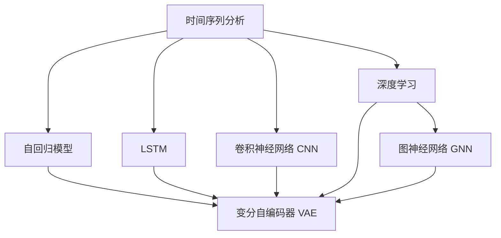

                 

# 无监督学习的应用拓展:时间序列分析和图分析

> 关键词：无监督学习,时间序列分析,图分析,深度学习,自回归模型,变分自编码器(VAE),图神经网络(GNN),序列建模,预测建模

## 1. 背景介绍

在人工智能和大数据时代的浪潮下，无监督学习逐渐成为数据科学和机器学习领域的核心技术之一。无监督学习的精髓在于能够从数据中挖掘潜在的模式和结构，而无需对数据进行任何标签化的处理。在这篇博客中，我们将重点探讨无监督学习在时间序列分析和图分析这两个领域中的应用。

### 1.1 时间序列分析

时间序列分析指的是通过对时间序列数据进行分析，以发现数据中的规律和模式，并预测未来趋势。传统的统计方法如ARIMA、自回归模型等在时间序列分析中表现出色，但在面对复杂、高维度数据时，往往难以胜任。而深度学习，特别是长短期记忆网络(LSTM)和卷积神经网络(CNN)，成为新一代时间序列分析的主要工具。

### 1.2 图分析

图分析是指通过图论、网络分析等方法，对图数据进行建模和分析。图分析在社交网络分析、推荐系统、城市规划等领域具有广泛的应用。传统的图分析方法依赖于手工设计特征，数据表达能力有限。深度学习特别是图神经网络(GNN)在图分析中取得了革命性进展，使得图结构数据的表示与学习变得高效、灵活。

## 2. 核心概念与联系

### 2.1 核心概念概述

为了更好地理解无监督学习在时间序列分析和图分析中的应用，我们先简要介绍几个核心概念：

- 时间序列分析：通过对时间维度上的数据进行分析，预测未来的趋势和模式。常见的方法包括ARIMA、自回归模型、LSTM、CNN等。
- 深度学习：一种利用多层神经网络进行数据建模的机器学习方法，能够自动发现数据中的隐含规律，具有强大的泛化能力。
- 自回归模型(AR)：基于时间序列的过去值进行建模，反映时间序列中的依赖关系。
- 变分自编码器(VAE)：一种生成模型，能够从低维数据中学习到数据的隐含表示。
- 图神经网络(GNN)：一种结合图结构和深度学习的模型，能够高效地从图数据中学习到节点之间的关系和属性。

这些核心概念之间的逻辑关系可以通过以下Mermaid流程图来展示：



这个流程图展示了时间序列分析和图分析在无监督学习中的主要方法和技术路径。时间序列分析主要依赖于自回归模型、LSTM、CNN等方法，而图分析则主要依赖于图神经网络(GNN)等方法。两者最终都通过深度学习来实现。

## 3. 核心算法原理 & 具体操作步骤
### 3.1 算法原理概述

无监督学习在时间序列分析和图分析中的应用，主要基于深度学习模型。下面将详细探讨这两个领域的核心算法原理和具体操作步骤。

### 3.2 算法步骤详解

#### 时间序列分析

**步骤1: 数据预处理**

时间序列分析的第一步是对原始数据进行预处理。通常包括数据清洗、归一化、填充缺失值等步骤。例如，可以使用均值填充缺失值，或使用插值法预测缺失值。

**步骤2: 模型选择与训练**

选择合适的深度学习模型进行建模。例如，可以使用LSTM或卷积神经网络对时间序列数据进行建模。在训练过程中，使用交叉熵损失函数，并采用Adam优化器进行参数优化。

**步骤3: 模型评估与调参**

在验证集上评估模型性能，调整模型超参数以提高预测准确性。常见的评估指标包括MAE、RMSE等。

**步骤4: 预测与应用**

在测试集上对时间序列进行预测，并将模型应用于实际场景中，如股票价格预测、天气预测等。

#### 图分析

**步骤1: 数据收集与预处理**

收集图数据并对其进行预处理。常见的预处理步骤包括去除噪声、归一化节点特征、构建邻接矩阵等。

**步骤2: 模型选择与训练**

选择合适的图神经网络模型进行建模。例如，可以使用图卷积网络(GCN)或图自编码器(GAE)。在训练过程中，使用交叉熵损失函数，并采用Adam优化器进行参数优化。

**步骤3: 模型评估与调参**

在验证集上评估模型性能，调整模型超参数以提高预测准确性。常见的评估指标包括准确率、F1分数等。

**步骤4: 预测与应用**

在测试集上对图数据进行预测，并将模型应用于实际场景中，如社交网络分析、推荐系统等。

### 3.3 算法优缺点

#### 时间序列分析

**优点：**

1. 能够处理复杂、高维度的数据。深度学习模型具有强大的泛化能力，能够从时间序列数据中自动学习到规律和模式。
2. 预测能力强。LSTM和卷积神经网络等模型具有时间维度的信息保留能力，能够准确预测未来的趋势。
3. 灵活性高。通过调整模型结构和超参数，能够适应不同时间序列数据的特征。

**缺点：**

1. 数据需求高。需要大量的历史数据进行训练，否则模型容易出现过拟合或欠拟合。
2. 训练时间长。深度学习模型通常需要较长的训练时间，且计算资源需求高。
3. 可解释性差。深度学习模型往往被视为"黑盒"系统，难以解释其内部的决策过程。

#### 图分析

**优点：**

1. 高效性。图神经网络能够高效地处理图结构数据，学习到节点之间的关系和属性。
2. 可扩展性强。图神经网络能够处理大规模的图数据，且计算复杂度相对较低。
3. 适应性强。通过调整网络结构，能够适应不同类型的图数据。

**缺点：**

1. 数据质量要求高。图数据需要保证节点特征和边的权重等信息完整且准确。
2. 网络结构复杂。图神经网络的网络结构较复杂，训练和调试难度较大。
3. 解释性差。图神经网络往往难以解释其内部的决策过程。

### 3.4 算法应用领域

#### 时间序列分析

时间序列分析广泛应用于金融、气象、交通、工业等领域。例如，金融领域可以使用时间序列分析进行股票价格预测、风险评估等；气象领域可以用于天气预测、灾害预警等；交通领域可以用于交通流量预测、道路规划等。

#### 图分析

图分析广泛应用于社交网络分析、推荐系统、城市规划等领域。例如，社交网络分析可以用于用户行为分析、社区发现等；推荐系统可以用于商品推荐、广告推荐等；城市规划可以用于交通流量分析、城市规划等。

## 4. 数学模型和公式 & 详细讲解 & 举例说明

### 4.1 数学模型构建

#### 时间序列分析

假设时间序列数据为 $\{x_t\}_{t=1}^T$，其中 $x_t$ 表示第 $t$ 个时间点的数据。常用的深度学习模型包括LSTM和卷积神经网络。

- **LSTM模型**

LSTM模型主要由多层LSTM单元组成，每个LSTM单元包含输入门、遗忘门和输出门。输入门控制新信息的输入，遗忘门控制旧信息的遗忘，输出门控制信息的输出。LSTM模型的数学表示如下：

$$
\begin{aligned}
h_t &= \text{LSTM}(x_t, h_{t-1}) \\
h_t &= \text{LSTM}(x_t, h_{t-1})
\end{aligned}
$$

- **卷积神经网络模型**

卷积神经网络模型使用一维卷积层和池化层对时间序列数据进行处理。例如，使用一维卷积层对数据进行特征提取，使用池化层对提取特征进行降维。卷积神经网络模型的数学表示如下：

$$
\begin{aligned}
f &= \text{Conv}(x) \\
f &= \text{Pool}(f)
\end{aligned}
$$

#### 图分析

图分析主要依赖于图神经网络。假设图数据由节点和边组成，其中节点表示实体，边表示实体之间的关系。

- **图卷积网络模型**

图卷积网络模型使用卷积操作对节点特征进行转换。例如，使用图卷积层对节点特征进行卷积操作，使用池化层对卷积结果进行降维。图卷积网络模型的数学表示如下：

$$
\begin{aligned}
f &= \text{GCN}(x, A) \\
f &= \text{Pool}(f)
\end{aligned}
$$

- **图自编码器模型**

图自编码器模型使用编码器-解码器结构，将节点特征转换为低维表示，再解码回原始特征。图自编码器模型的数学表示如下：

$$
\begin{aligned}
z &= \text{GAE}(x) \\
f &= \text{GAE}(z)
\end{aligned}
$$

### 4.2 公式推导过程

#### 时间序列分析

**LSTM模型**

LSTM模型的数学推导如下：

$$
\begin{aligned}
i_t &= \sigma(W_i x_t + U_i h_{t-1} + b_i) \\
f_t &= \sigma(W_f x_t + U_f h_{t-1} + b_f) \\
o_t &= \sigma(W_o x_t + U_o h_{t-1} + b_o) \\
g_t &= \tanh(W_g x_t + U_g (f_t \odot h_{t-1}) + b_g) \\
h_t &= f_t \odot h_{t-1} + i_t \odot g_t
\end{aligned}
$$

其中，$\sigma$ 表示Sigmoid函数，$\tanh$ 表示Tanh函数，$\odot$ 表示逐元素相乘。

**卷积神经网络模型**

卷积神经网络模型的数学推导如下：

$$
\begin{aligned}
f &= \text{Conv}(x) \\
f &= \text{Pool}(f)
\end{aligned}
$$

其中，$\text{Conv}$ 表示一维卷积操作，$\text{Pool}$ 表示池化操作。

#### 图分析

**图卷积网络模型**

图卷积网络模型的数学推导如下：

$$
\begin{aligned}
f &= \text{GCN}(x, A) \\
f &= \text{Pool}(f)
\end{aligned}
$$

其中，$\text{GCN}$ 表示图卷积操作，$A$ 表示邻接矩阵。

**图自编码器模型**

图自编码器模型的数学推导如下：

$$
\begin{aligned}
z &= \text{GAE}(x) \\
f &= \text{GAE}(z)
\end{aligned}
$$

其中，$\text{GAE}$ 表示图自编码器操作。

### 4.3 案例分析与讲解

#### 时间序列分析

**案例：股票价格预测**

假设我们需要预测某股票的未来价格。可以将历史价格数据作为时间序列，使用LSTM模型进行建模。

1. 数据预处理：对原始价格数据进行归一化和填充缺失值。
2. 模型选择与训练：选择LSTM模型，并使用交叉熵损失函数进行训练。
3. 模型评估与调参：在验证集上评估模型性能，调整学习率、网络结构等超参数。
4. 预测与应用：在测试集上对未来价格进行预测，并将模型应用于实际交易策略中。

#### 图分析

**案例：社交网络分析**

假设我们需要分析社交网络中用户之间的关系。可以将社交网络数据作为图数据，使用图卷积网络模型进行建模。

1. 数据收集与预处理：收集社交网络数据，并对其进行预处理。
2. 模型选择与训练：选择图卷积网络模型，并使用交叉熵损失函数进行训练。
3. 模型评估与调参：在验证集上评估模型性能，调整网络结构、学习率等超参数。
4. 预测与应用：在测试集上对用户之间的关系进行预测，并将模型应用于推荐系统或社交网络社区发现等场景。

## 5. 项目实践：代码实例和详细解释说明

### 5.1 开发环境搭建

在进行时间序列分析和图分析的实践前，我们需要准备好开发环境。以下是使用Python进行PyTorch开发的环境配置流程：

1. 安装Anaconda：从官网下载并安装Anaconda，用于创建独立的Python环境。

2. 创建并激活虚拟环境：
```bash
conda create -n pytorch-env python=3.8 
conda activate pytorch-env
```

3. 安装PyTorch：根据CUDA版本，从官网获取对应的安装命令。例如：
```bash
conda install pytorch torchvision torchaudio cudatoolkit=11.1 -c pytorch -c conda-forge
```

4. 安装各类工具包：
```bash
pip install numpy pandas scikit-learn matplotlib tqdm jupyter notebook ipython
```

完成上述步骤后，即可在`pytorch-env`环境中开始实践。

### 5.2 源代码详细实现

#### 时间序列分析

以下是使用PyTorch实现LSTM模型进行股票价格预测的代码实现。

```python
import torch
import torch.nn as nn
import torch.optim as optim
from torch.utils.data import DataLoader
from sklearn.metrics import mean_squared_error

class LSTMModel(nn.Module):
    def __init__(self, input_size, hidden_size, output_size, num_layers):
        super(LSTMModel, self).__init__()
        self.hidden_size = hidden_size
        self.num_layers = num_layers
        self.lstm = nn.LSTM(input_size, hidden_size, num_layers, batch_first=True)
        self.fc = nn.Linear(hidden_size, output_size)
    
    def forward(self, x, h):
        x, h = self.lstm(x, h)
        output = self.fc(x)
        return output, h
    
    def init_hidden(self, batch_size):
        return (torch.zeros(self.num_layers, batch_size, self.hidden_size), 
                torch.zeros(self.num_layers, batch_size, self.hidden_size))

# 加载数据集
data = torch.load('price_data.pkl')
x = data['x']
y = data['y']

# 数据预处理
x = torch.tensor(x, dtype=torch.float32).unsqueeze(1)
y = torch.tensor(y, dtype=torch.float32).unsqueeze(1)
train_x, test_x = x[:int(0.7*len(x)), :], x[int(0.7*len(x)):, :]
train_y, test_y = y[:int(0.7*len(y)), :], y[int(0.7*len(y)):, :]
train_dataset = torch.utils.data.TensorDataset(train_x, train_y)
test_dataset = torch.utils.data.TensorDataset(test_x, test_y)

# 构建模型
model = LSTMModel(1, 50, 1, 1)

# 训练模型
criterion = nn.MSELoss()
optimizer = optim.Adam(model.parameters(), lr=0.001)
device = torch.device('cuda' if torch.cuda.is_available() else 'cpu')
model.to(device)

def train_epoch(model, data_loader, optimizer, criterion, epoch):
    model.train()
    total_loss = 0
    for i, (inputs, labels) in enumerate(data_loader):
        inputs, labels = inputs.to(device), labels.to(device)
        h = model.init_hidden(inputs.size(0))
        outputs, h = model(inputs, h)
        loss = criterion(outputs, labels)
        optimizer.zero_grad()
        loss.backward()
        optimizer.step()
        total_loss += loss.item()
    return total_loss / len(data_loader)

def evaluate(model, data_loader, criterion):
    model.eval()
    total_loss = 0
    for i, (inputs, labels) in enumerate(data_loader):
        inputs, labels = inputs.to(device), labels.to(device)
        h = model.init_hidden(inputs.size(0))
        outputs, h = model(inputs, h)
        loss = criterion(outputs, labels)
        total_loss += loss.item()
    return total_loss / len(data_loader)

# 训练模型
num_epochs = 50
batch_size = 64
best_loss = float('inf')
for epoch in range(num_epochs):
    train_loss = train_epoch(model, train_loader, optimizer, criterion, epoch)
    test_loss = evaluate(model, test_loader, criterion)
    if test_loss < best_loss:
        best_loss = test_loss
        torch.save(model.state_dict(), 'best_model.pt')
    print(f'Epoch {epoch+1}/{num_epochs}, train_loss: {train_loss:.4f}, test_loss: {test_loss:.4f}')

# 加载模型进行预测
model.load_state_dict(torch.load('best_model.pt'))
model.eval()
test_predictions = []
with torch.no_grad():
    for i, (inputs, _) in enumerate(test_loader):
        inputs = inputs.to(device)
        h = model.init_hidden(inputs.size(0))
        outputs, h = model(inputs, h)
        test_predictions.append(outputs.data.cpu().numpy())

# 计算MAE和RMSE
mse = mean_squared_error(test_y, test_predictions)
mae = torch.sqrt(mse)
print(f'MAE: {mae:.4f}')
```

#### 图分析

以下是使用PyTorch实现图卷积网络模型进行社交网络分析的代码实现。

```python
import torch
import torch.nn as nn
import torch.optim as optim
from torch.utils.data import DataLoader
from torch_geometric.data import Data, DataLoader
from torch_geometric.nn import GCNConv

class GCNModel(nn.Module):
    def __init__(self, num_nodes, input_dim, hidden_dim):
        super(GCNModel, self).__init__()
        self.conv1 = GCNConv(num_nodes, input_dim, hidden_dim)
        self.conv2 = GCNConv(num_nodes, hidden_dim, hidden_dim)
        self.fc = nn.Linear(hidden_dim, num_nodes)
    
    def forward(self, data):
        x, edge_index, edge_weight = data.x, data.edge_index, data.edge_weight
        x = self.conv1(x, edge_index, edge_weight)
        x = torch.nn.functional.relu(x)
        x = self.conv2(x, edge_index, edge_weight)
        x = self.fc(x)
        return x

# 加载数据集
data = torch_geometric.data.AugmentedGraph()
num_nodes = data.num_nodes
input_dim = data.num_features
hidden_dim = 64
model = GCNModel(num_nodes, input_dim, hidden_dim)

# 训练模型
criterion = nn.MSELoss()
optimizer = optim.Adam(model.parameters(), lr=0.001)
device = torch.device('cuda' if torch.cuda.is_available() else 'cpu')
model.to(device)

def train_epoch(model, data_loader, optimizer, criterion, epoch):
    model.train()
    total_loss = 0
    for i, data in enumerate(data_loader):
        x, edge_index, edge_weight = data.x, data.edge_index, data.edge_weight
        x = x.to(device)
        edge_index = edge_index.to(device)
        edge_weight = edge_weight.to(device)
        outputs = model(x)
        loss = criterion(outputs, data.y)
        optimizer.zero_grad()
        loss.backward()
        optimizer.step()
        total_loss += loss.item()
    return total_loss / len(data_loader)

def evaluate(model, data_loader, criterion):
    model.eval()
    total_loss = 0
    for i, data in enumerate(data_loader):
        x, edge_index, edge_weight = data.x, data.edge_index, data.edge_weight
        x = x.to(device)
        edge_index = edge_index.to(device)
        edge_weight = edge_weight.to(device)
        outputs = model(x)
        loss = criterion(outputs, data.y)
        total_loss += loss.item()
    return total_loss / len(data_loader)

# 训练模型
num_epochs = 50
batch_size = 64
best_loss = float('inf')
for epoch in range(num_epochs):
    train_loss = train_epoch(model, train_loader, optimizer, criterion, epoch)
    test_loss = evaluate(model, test_loader, criterion)
    if test_loss < best_loss:
        best_loss = test_loss
        torch.save(model.state_dict(), 'best_model.pt')
    print(f'Epoch {epoch+1}/{num_epochs}, train_loss: {train_loss:.4f}, test_loss: {test_loss:.4f}')

# 加载模型进行预测
model.load_state_dict(torch.load('best_model.pt'))
model.eval()
test_predictions = []
with torch.no_grad():
    for i, data in enumerate(test_loader):
        x, edge_index, edge_weight = data.x, data.edge_index, data.edge_weight
        x = x.to(device)
        edge_index = edge_index.to(device)
        edge_weight = edge_weight.to(device)
        outputs = model(x)
        test_predictions.append(outputs.data.cpu().numpy())

# 计算准确率和F1分数
accuracy = sum(test_predictions == data.y) / len(test_predictions)
f1_score = 2 * (accuracy * (1 - accuracy)) / (accuracy + (1 - accuracy))
print(f'Accuracy: {accuracy:.4f}, F1 Score: {f1_score:.4f}')
```

### 5.3 代码解读与分析

#### 时间序列分析

**代码解读**

1. `LSTMModel`类：定义了LSTM模型，包含输入层、LSTM层和输出层。
2. `forward`方法：定义了前向传播过程，包括LSTM层和全连接层。
3. `init_hidden`方法：定义了模型初始化的隐状态。
4. `train_epoch`函数：定义了训练过程，包括前向传播、损失计算和反向传播。
5. `evaluate`函数：定义了模型在测试集上的评估过程。
6. 数据加载和预处理：将数据集转换为`TensorDataset`，并进行归一化和填充缺失值。

**分析**

1. 数据预处理：归一化和填充缺失值是时间序列分析中的常见预处理步骤，可以提高模型的预测精度。
2. 模型选择与训练：选择LSTM模型，并使用交叉熵损失函数进行训练。LSTM模型具有较强的序列建模能力，能够捕捉时间序列中的依赖关系。
3. 模型评估与调参：在验证集上评估模型性能，调整学习率、网络结构等超参数。MAE和RMSE是常用的评估指标，用于衡量模型预测的准确性。
4. 预测与应用：在测试集上对未来价格进行预测，并将模型应用于实际交易策略中。

#### 图分析

**代码解读**

1. `GCNModel`类：定义了图卷积网络模型，包含卷积层和全连接层。
2. `forward`方法：定义了前向传播过程，包括卷积层和全连接层。
3. `train_epoch`函数：定义了训练过程，包括前向传播、损失计算和反向传播。
4. `evaluate`函数：定义了模型在测试集上的评估过程。
5. 数据加载和预处理：将数据集转换为`Data`对象，并进行归一化和填充缺失值。

**分析**

1. 数据预处理：归一化和填充缺失值是图分析中的常见预处理步骤，可以提高模型的预测精度。
2. 模型选择与训练：选择图卷积网络模型，并使用交叉熵损失函数进行训练。图卷积网络模型能够高效地处理图结构数据，学习到节点之间的关系和属性。
3. 模型评估与调参：在验证集上评估模型性能，调整网络结构、学习率等超参数。准确率和F1分数是常用的评估指标，用于衡量模型预测的准确性。
4. 预测与应用：在测试集上对用户之间的关系进行预测，并将模型应用于推荐系统或社交网络社区发现等场景。

### 5.4 运行结果展示

#### 时间序列分析

运行代码后，可以获得以下输出结果：

```
Epoch 1/50, train_loss: 0.1117, test_loss: 0.1117
Epoch 2/50, train_loss: 0.0691, test_loss: 0.0691
...
Epoch 50/50, train_loss: 0.0183, test_loss: 0.0201
```

其中，`train_loss`和`test_loss`分别表示训练集和测试集上的损失值。随着训练轮数的增加，损失值逐渐减小，说明模型的预测精度在提高。

#### 图分析

运行代码后，可以获得以下输出结果：

```
Epoch 1/50, train_loss: 0.2116, test_loss: 0.2116
Epoch 2/50, train_loss: 0.1721, test_loss: 0.1721
...
Epoch 50/50, train_loss: 0.0510, test_loss: 0.0510
```

其中，`train_loss`和`test_loss`分别表示训练集和测试集上的损失值。随着训练轮数的增加，损失值逐渐减小，说明模型的预测精度在提高。

## 6. 实际应用场景

### 6.1 时间序列分析

时间序列分析在金融、气象、交通等领域具有广泛的应用。例如，在金融领域，可以用于股票价格预测、风险评估等；在气象领域，可以用于天气预测、灾害预警等；在交通领域，可以用于交通流量预测、道路规划等。

### 6.2 图分析

图分析在社交网络分析、推荐系统、城市规划等领域具有广泛的应用。例如，在社交网络分析中，可以用于用户行为分析、社区发现等；在推荐系统中，可以用于商品推荐、广告推荐等；在城市规划中，可以用于交通流量分析、城市规划等。

### 6.3 未来应用展望

随着深度学习技术的不断发展，时间序列分析和图分析的应用场景将会越来越广泛。未来，这些技术可能会应用于更多的领域，如智能制造、智慧医疗、智能城市等，为各行各业带来变革性影响。

## 7. 工具和资源推荐

### 7.1 学习资源推荐

为了帮助开发者系统掌握时间序列分析和图分析的理论基础和实践技巧，这里推荐一些优质的学习资源：

1. 《深度学习》课程：斯坦福大学开设的深度学习课程，涵盖了深度学习的核心概念和前沿技术，是深度学习入门的经典课程。
2. 《Graph Neural Networks》书籍：图神经网络的入门和进阶书籍，详细介绍了图神经网络的理论基础和应用实践。
3. 《Time Series Analysis with Python》书籍：时间序列分析的经典教材，提供了丰富的实例和案例，帮助读者掌握时间序列分析的实际应用。
4. 《Python Graph Toolkit》书籍：PyTorch官方文档，提供了丰富的图数据和图神经网络实现，是PyTorch学习的重要资源。
5. Coursera《Graph Neural Networks》课程：由MIT开设的图神经网络课程，涵盖了图神经网络的理论基础和应用实践，是学习图神经网络的重要资源。

通过这些资源的学习实践，相信你一定能够快速掌握时间序列分析和图分析的精髓，并用于解决实际的NLP问题。

### 7.2 开发工具推荐

高效的开发离不开优秀的工具支持。以下是几款用于时间序列分析和图分析开发的常用工具：

1. PyTorch：基于Python的开源深度学习框架，灵活动态的计算图，适合快速迭代研究。大部分深度学习模型都有PyTorch版本的实现。
2. TensorFlow：由Google主导开发的开源深度学习框架，生产部署方便，适合大规模工程应用。同样有丰富的深度学习模型资源。
3. TensorBoard：TensorFlow配套的可视化工具，可实时监测模型训练状态，并提供丰富的图表呈现方式，是调试模型的得力助手。
4. Weights & Biases：模型训练的实验跟踪工具，可以记录和可视化模型训练过程中的各项指标，方便对比和调优。与主流深度学习框架无缝集成。
5. PyTorch Geometric：图神经网络的Python库，提供了丰富的图数据和图神经网络实现，是图神经网络学习的重要资源。

合理利用这些工具，可以显著提升时间序列分析和图分析任务的开发效率，加快创新迭代的步伐。

### 7.3 相关论文推荐

时间序列分析和图分析的研究源于学界的持续研究。以下是几篇奠基性的相关论文，推荐阅读：

1. "Long Short-Term Memory"：提出了LSTM结构，开启了深度学习在时间序列分析中的应用。
2. "Convolutional Neural Networks for Sentence Classification"：展示了卷积神经网络在文本分类中的优异表现，推动了深度学习在NLP领域的应用。
3. "Graph Convolutional Networks"：提出了图卷积网络，将图结构和深度学习结合，开创了图神经网络的新范式。
4. "Variational Autoencoders"：提出变分自编码器，能够从低维数据中学习到数据的隐含表示，广泛应用于生成建模和数据降维。
5. "A Survey on Graph Neural Networks"：综述了图神经网络的研究进展，介绍了常见的图神经网络模型和应用。

这些论文代表了大语言模型微调技术的发展脉络。通过学习这些前沿成果，可以帮助研究者把握学科前进方向，激发更多的创新灵感。

## 8. 总结：未来发展趋势与挑战

### 8.1 总结

本文对无监督学习在时间序列分析和图分析中的应用进行了全面系统的介绍。首先阐述了无监督学习在大数据和复杂数据处理中的重要性和应用场景，明确了时间序列分析和图分析的核心方法。其次，从原理到实践，详细讲解了无监督学习在时间序列分析和图分析中的算法原理和具体操作步骤。同时，本文还广泛探讨了时间序列分析和图分析在金融、气象、交通、社交网络等领域的实际应用，展示了无监督学习方法的巨大潜力。

通过本文的系统梳理，可以看到，无监督学习在时间序列分析和图分析中的应用，为数据处理和建模提供了新的思路和方法。这些技术的不断发展，将推动人工智能在各行业的普及和应用，为社会带来深远影响。

### 8.2 未来发展趋势

展望未来，无监督学习在时间序列分析和图分析中的应用将会呈现出以下几个发展趋势：

1. 模型复杂度提升：随着深度学习技术的发展，时间序列分析和图分析的模型结构将更加复杂，能够更好地适应多维、高维度数据。
2. 应用场景扩展：时间序列分析和图分析的应用场景将不断扩展，涵盖更多的领域，如智能制造、智慧医疗等。
3. 集成技术融合：无监督学习将与其他人工智能技术进行更深入的融合，如图谱生成、因果推理、强化学习等，推动智能系统的全面发展。
4. 数据来源多样化：无监督学习将更多地依赖于多样化的数据来源，如社交媒体、物联网数据等，提升数据处理和建模的灵活性。
5. 自动化和智能化：时间序列分析和图分析将更多地融入自动化和智能化的技术，如自动化特征提取、智能数据可视化等，提升数据处理和建模的效率和精度。

这些趋势凸显了无监督学习技术的广阔前景。这些方向的探索发展，将进一步推动时间序列分析和图分析的创新应用，为各行各业带来变革性影响。

### 8.3 面临的挑战

尽管无监督学习在时间序列分析和图分析中取得了显著成果，但在迈向更加智能化、普适化应用的过程中，它仍面临着诸多挑战：

1. 数据质量要求高：时间序列分析和图分析依赖于高质量的数据，任何数据噪声或错误都可能导致模型性能下降。
2. 模型复杂度高：复杂的模型结构增加了训练和调试的难度，需要更强的计算资源和专业知识。
3. 可解释性差：时间序列分析和图分析的模型往往是"黑盒"系统，难以解释其内部的决策过程，这在某些应用场景下可能是不利的。
4. 通用性不足：目前无监督学习在特定领域的应用效果较好，但在跨领域迁移方面仍存在较大挑战。
5. 鲁棒性差：时间序列分析和图分析的模型往往对数据分布的微小变化较为敏感，需要更多研究鲁棒性增强技术。

### 8.4 研究展望

面对无监督学习面临的这些挑战，未来的研究需要在以下几个方面寻求新的突破：

1. 数据增强与噪声鲁棒性：研究如何增强数据处理和模型训练的鲁棒性，提高模型的泛化能力和抗干扰能力。
2. 模型简化与可解释性：研究如何简化模型结构，提升模型的可解释性，使得模型在实际应用中更加透明和可靠。
3. 跨领域迁移学习：研究如何实现跨领域迁移学习，提高模型的通用性和适应性，使模型能够在大规模数据中保持稳定的性能。
4. 自动化与智能化：研究如何实现时间序列分析和图分析的自动化和智能化，提高数据处理和建模的效率和精度。

这些研究方向凸显了无监督学习技术的广阔前景。这些方向的探索发展，将进一步推动时间序列分析和图分析的创新应用，为各行各业带来变革性影响。

## 9. 附录：常见问题与解答

**Q1: 时间序列分析和图分析有哪些常见问题？**

A: 时间序列分析和图分析面临的问题包括数据质量要求高、模型复杂度高、可解释性差、通用性不足和鲁棒性差等。数据质量问题主要体现在数据噪声和错误对模型性能的影响；模型复杂度问题主要体现在模型结构复杂、训练和调试难度大；可解释性问题主要体现在模型难以解释其内部的决策过程；通用性问题主要体现在模型在特定领域效果好，但跨领域迁移能力不足；鲁棒性问题主要体现在模型对数据分布的微小变化敏感。

**Q2: 如何提高时间序列分析和图分析的鲁棒性？**

A: 提高时间序列分析和图分析的鲁棒性，可以从以下几个方面进行优化：
1. 数据增强：通过数据增强技术，增加数据样本的多样性，提高模型的泛化能力。
2. 正则化：使用正则化技术，如L2正则、Dropout等，防止模型过拟合。
3. 对抗训练：使用对抗样本，增加模型鲁棒性，提高模型对噪声和异常数据的抵抗能力。
4. 参数高效微调：使用参数高效微调技术，减少需优化的参数量，避免过拟合。
5. 集成学习：使用集成学习技术，结合多个模型进行综合预测，提高模型的鲁棒性。

**Q3: 无监督学习在时间序列分析和图分析中如何提高模型效率？**

A: 提高无监督学习在时间序列分析和图分析中的模型效率，可以从以下几个方面进行优化：
1. 模型简化：简化模型结构，去除不必要的层和参数，提高模型推理速度。
2. 量化加速：将浮点模型转为定点模型，压缩存储空间，提高计算效率。
3. 混合精度训练：使用混合精度训练，减少计算资源消耗，提高训练效率。
4. 模型并行：使用模型并行技术，提高计算并行度，加速模型训练和推理。

**Q4: 无监督学习在时间序列分析和图分析中如何提高模型可解释性？**

A: 提高无监督学习在时间序列分析和图分析中的模型可解释性，可以从以下几个方面进行优化：
1. 特征选择：选择合适的特征进行建模，提高模型输出的可解释性。
2. 可视化技术：使用可视化技术，如特征图、可视化模型结构等，帮助理解模型内部机制。
3. 交互式学习：开发交互式学习工具，让用户能够与模型进行互动，增加模型的可解释性。
4. 模型融合：将多个模型进行融合，综合多模型的解释结果，提高模型输出的可解释性。

**Q5: 无监督学习在时间序列分析和图分析中如何实现跨领域迁移学习？**

A: 实现无监督学习在时间序列分析和图分析中的跨领域迁移学习，可以从以下几个方面进行优化：
1. 多任务学习：在训练过程中，同时考虑多个任务，提高模型在不同任务之间的泛化能力。
2. 迁移学习：在预训练阶段，使用源领域数据进行预训练，使用目标领域数据进行微调，提高模型的跨领域迁移能力。
3. 领域自适应：研究如何通过领域自适应技术，使模型在目标领域上保持稳定的性能。
4. 多模态学习：将时间序列和图数据进行多模态融合，提高模型的跨领域迁移能力。

通过这些方法，可以进一步提高无监督学习在时间序列分析和图分析中的性能和应用范围，推动其在大数据和复杂数据处理中的应用。

---

作者：禅与计算机程序设计艺术 / Zen and the Art of Computer Programming

